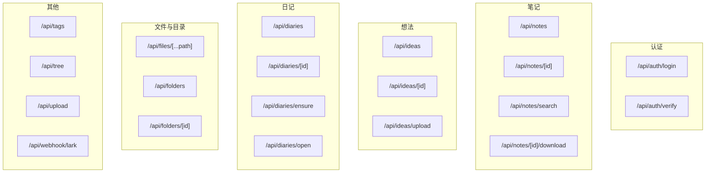
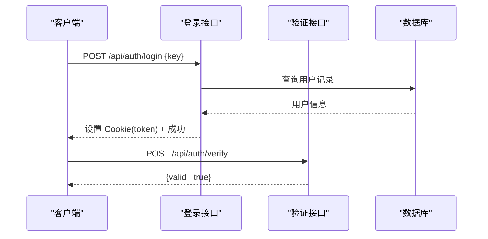
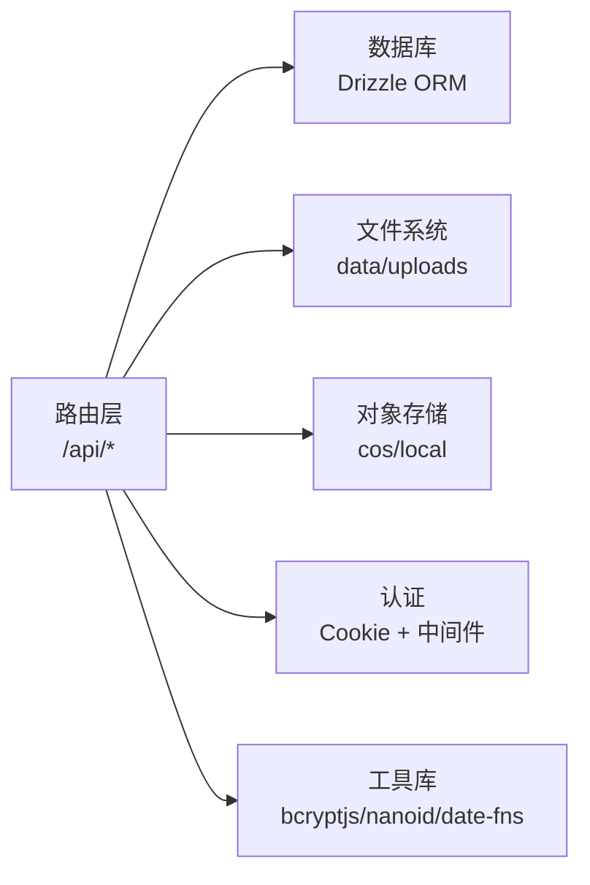

# API 接口文档

<cite>
**本文档引用的文件**
- [src/app/api/auth/login/route.ts](file://src/app/api/auth/login/route.ts)
- [src/app/api/auth/verify/route.ts](file://src/app/api/auth/verify/route.ts)
- [src/app/api/diaries/route.ts](file://src/app/api/diaries/route.ts)
- [src/app/api/diaries/[id]/route.ts](file://src/app/api/diaries/[id]/route.ts)
- [src/app/api/diaries/ensure/route.ts](file://src/app/api/diaries/ensure/route.ts)
- [src/app/api/diaries/open/route.ts](file://src/app/api/diaries/open/route.ts)
- [src/app/api/files/[...path]/route.ts](file://src/app/api/files/[...path]/route.ts)
- [src/app/api/folders/route.ts](file://src/app/api/folders/route.ts)
- [src/app/api/folders/[id]/route.ts](file://src/app/api/folders/[id]/route.ts)
- [src/app/api/ideas/route.ts](file://src/app/api/ideas/route.ts)
- [src/app/api/ideas/[id]/route.ts](file://src/app/api/ideas/[id]/route.ts)
- [src/app/api/ideas/upload/route.ts](file://src/app/api/ideas/upload/route.ts)
- [src/app/api/notes/route.ts](file://src/app/api/notes/route.ts)
- [src/app/api/notes/[id]/route.ts](file://src/app/api/notes/[id]/route.ts)
- [src/app/api/notes/search/route.ts](file://src/app/api/notes/search/route.ts)
- [src/app/api/notes/[id]/download/route.ts](file://src/app/api/notes/[id]/download/route.ts)
- [src/app/api/tags/route.ts](file://src/app/api/tags/route.ts)
- [src/app/api/tree/route.ts](file://src/app/api/tree/route.ts)
- [src/app/api/upload/route.ts](file://src/app/api/upload/route.ts)
- [src/app/api/webhook/lark/route.ts](file://src/app/api/webhook/lark/route.ts)
</cite>

## 目录
1. [简介](#简介)
2. [项目结构](#项目结构)
3. [核心组件](#核心组件)
4. [架构总览](#架构总览)
5. [详细组件分析](#详细组件分析)
6. [依赖关系分析](#依赖关系分析)
7. [性能考虑](#性能考虑)
8. [故障排除指南](#故障排除指南)
9. [结论](#结论)
10. [附录](#附录)

## 简介
本文件为 ynNote v2 的完整 API 接口文档，覆盖认证、笔记、想法、日记、文件与目录、Webhook 等模块。文档提供每个 API 组的接口规范（认证要求、请求格式、响应结构）、请求与响应示例、错误码与异常处理、版本控制与兼容性说明，以及最佳实践与性能优化建议。

## 项目结构
API 路由采用 Next.js App Router 的约定式路由组织，按功能域划分目录，如 /api/auth、/api/notes、/api/ideas、/api/diaries、/api/files 等。各路由文件实现对应资源的 HTTP 方法（GET/POST/PATCH/DELETE），并与数据库层（Drizzle ORM）交互。

图表来源
- [src/app/api/auth/login/route.ts:1-63](file://src/app/api/auth/login/route.ts#L1-L63)
- [src/app/api/auth/verify/route.ts:1-7](file://src/app/api/auth/verify/route.ts#L1-L7)
- [src/app/api/notes/route.ts:1-86](file://src/app/api/notes/route.ts#L1-L86)
- [src/app/api/notes/[id]/route.ts](file://src/app/api/notes/[id]/route.ts#L1-L104)
- [src/app/api/notes/search/route.ts:1-44](file://src/app/api/notes/search/route.ts#L1-L44)
- [src/app/api/notes/[id]/download/route.ts](file://src/app/api/notes/[id]/download/route.ts#L1-L33)
- [src/app/api/ideas/route.ts:1-151](file://src/app/api/ideas/route.ts#L1-L151)
- [src/app/api/ideas/[id]/route.ts](file://src/app/api/ideas/[id]/route.ts#L1-L117)
- [src/app/api/ideas/upload/route.ts:1-66](file://src/app/api/ideas/upload/route.ts#L1-L66)
- [src/app/api/diaries/route.ts:1-45](file://src/app/api/diaries/route.ts#L1-L45)
- [src/app/api/diaries/[id]/route.ts](file://src/app/api/diaries/[id]/route.ts#L1-L63)
- [src/app/api/diaries/ensure/route.ts:1-127](file://src/app/api/diaries/ensure/route.ts#L1-L127)
- [src/app/api/diaries/open/route.ts:1-130](file://src/app/api/diaries/open/route.ts#L1-L130)
- [src/app/api/files/[...path]/route.ts](file://src/app/api/files/[...path]/route.ts#L1-L48)
- [src/app/api/folders/route.ts:1-75](file://src/app/api/folders/route.ts#L1-L75)
- [src/app/api/folders/[id]/route.ts](file://src/app/api/folders/[id]/route.ts#L1-L101)
- [src/app/api/tags/route.ts](file://src/app/api/tags/route.ts)
- [src/app/api/tree/route.ts](file://src/app/api/tree/route.ts)
- [src/app/api/upload/route.ts](file://src/app/api/upload/route.ts)
- [src/app/api/webhook/lark/route.ts](file://src/app/api/webhook/lark/route.ts)

章节来源
- [src/app/api/auth/login/route.ts:1-63](file://src/app/api/auth/login/route.ts#L1-L63)
- [src/app/api/auth/verify/route.ts:1-7](file://src/app/api/auth/verify/route.ts#L1-L7)
- [src/app/api/notes/route.ts:1-86](file://src/app/api/notes/route.ts#L1-L86)
- [src/app/api/notes/[id]/route.ts](file://src/app/api/notes/[id]/route.ts#L1-L104)
- [src/app/api/notes/search/route.ts:1-44](file://src/app/api/notes/search/route.ts#L1-L44)
- [src/app/api/notes/[id]/download/route.ts](file://src/app/api/notes/[id]/download/route.ts#L1-L33)
- [src/app/api/ideas/route.ts:1-151](file://src/app/api/ideas/route.ts#L1-L151)
- [src/app/api/ideas/[id]/route.ts](file://src/app/api/ideas/[id]/route.ts#L1-L117)
- [src/app/api/ideas/upload/route.ts:1-66](file://src/app/api/ideas/upload/route.ts#L1-L66)
- [src/app/api/diaries/route.ts:1-45](file://src/app/api/diaries/route.ts#L1-L45)
- [src/app/api/diaries/[id]/route.ts](file://src/app/api/diaries/[id]/route.ts#L1-L63)
- [src/app/api/diaries/ensure/route.ts:1-127](file://src/app/api/diaries/ensure/route.ts#L1-L127)
- [src/app/api/diaries/open/route.ts:1-130](file://src/app/api/diaries/open/route.ts#L1-L130)
- [src/app/api/files/[...path]/route.ts](file://src/app/api/files/[...path]/route.ts#L1-L48)
- [src/app/api/folders/route.ts:1-75](file://src/app/api/folders/route.ts#L1-L75)
- [src/app/api/folders/[id]/route.ts](file://src/app/api/folders/[id]/route.ts#L1-L101)
- [src/app/api/tags/route.ts](file://src/app/api/tags/route.ts)
- [src/app/api/tree/route.ts](file://src/app/api/tree/route.ts)
- [src/app/api/upload/route.ts](file://src/app/api/upload/route.ts)
- [src/app/api/webhook/lark/route.ts](file://src/app/api/webhook/lark/route.ts)

## 核心组件
- 认证组件：提供登录与令牌校验接口，使用 Cookie 存储安全令牌，内置速率限制。
- 笔记组件：提供笔记的增删改查、全文检索与 Markdown 下载。
- 想法组件：提供想法的分页列表、标签关联、图片上传与管理。
- 日记组件：提供按年份查询、按日/周打开、确保存在等时间维度操作。
- 文件与目录组件：提供本地文件服务、目录树与层级管理。
- Webhook 组件：接收外部事件并进行处理。

章节来源
- [src/app/api/auth/login/route.ts:1-63](file://src/app/api/auth/login/route.ts#L1-L63)
- [src/app/api/auth/verify/route.ts:1-7](file://src/app/api/auth/verify/route.ts#L1-L7)
- [src/app/api/notes/route.ts:1-86](file://src/app/api/notes/route.ts#L1-L86)
- [src/app/api/notes/[id]/route.ts](file://src/app/api/notes/[id]/route.ts#L1-L104)
- [src/app/api/notes/search/route.ts:1-44](file://src/app/api/notes/search/route.ts#L1-L44)
- [src/app/api/notes/[id]/download/route.ts](file://src/app/api/notes/[id]/download/route.ts#L1-L33)
- [src/app/api/ideas/route.ts:1-151](file://src/app/api/ideas/route.ts#L1-L151)
- [src/app/api/ideas/[id]/route.ts](file://src/app/api/ideas/[id]/route.ts#L1-L117)
- [src/app/api/ideas/upload/route.ts:1-66](file://src/app/api/ideas/upload/route.ts#L1-L66)
- [src/app/api/diaries/route.ts:1-45](file://src/app/api/diaries/route.ts#L1-L45)
- [src/app/api/diaries/[id]/route.ts](file://src/app/api/diaries/[id]/route.ts#L1-L63)
- [src/app/api/diaries/ensure/route.ts:1-127](file://src/app/api/diaries/ensure/route.ts#L1-L127)
- [src/app/api/diaries/open/route.ts:1-130](file://src/app/api/diaries/open/route.ts#L1-L130)
- [src/app/api/files/[...path]/route.ts](file://src/app/api/files/[...path]/route.ts#L1-L48)
- [src/app/api/folders/route.ts:1-75](file://src/app/api/folders/route.ts#L1-L75)
- [src/app/api/folders/[id]/route.ts](file://src/app/api/folders/[id]/route.ts#L1-L101)
- [src/app/api/webhook/lark/route.ts](file://src/app/api/webhook/lark/route.ts)

## 架构总览
API 层通过 Next.js 路由暴露 REST 风格接口，统一返回 JSON 响应；部分路由返回二进制流（如文件下载）。数据库访问通过 Drizzle ORM 进行，部分存储使用本地文件系统或对象存储（根据配置）。认证通过 Cookie 令牌实现，前端需携带 Cookie 才能访问受保护资源。

图表来源
- [src/app/api/auth/login/route.ts:1-63](file://src/app/api/auth/login/route.ts#L1-L63)
- [src/app/api/auth/verify/route.ts:1-7](file://src/app/api/auth/verify/route.ts#L1-L7)

## 详细组件分析

### 认证 API
- 登录接口
  - 方法与路径：POST /api/auth/login
  - 认证要求：无（用于获取令牌）
  - 请求体字段
    - key: 字符串，管理员密钥
  - 成功响应：设置 HttpOnly、SameSite=Strict、7 天过期的 token Cookie，返回 { success: true }
  - 错误响应
    - 400：缺少 key 或请求体格式错误
    - 401：密钥错误
    - 429：超出速率限制（包含 Retry-After、X-RateLimit-Remaining）
    - 500：服务器内部错误
  - 示例
    - 请求：POST /api/auth/login，Body: { "key": "your-admin-key" }
    - 响应：Set-Cookie: token=...; Path=/; HttpOnly; Secure; SameSite=Strict; Max-Age=604800

- 验证接口
  - 方法与路径：POST /api/auth/verify
  - 认证要求：需要有效 token（中间件已验证）
  - 成功响应：{ valid: true }
  - 错误响应：通常由中间件处理，此处直接返回验证结果

章节来源
- [src/app/api/auth/login/route.ts:1-63](file://src/app/api/auth/login/route.ts#L1-L63)
- [src/app/api/auth/verify/route.ts:1-7](file://src/app/api/auth/verify/route.ts#L1-L7)

### 笔记 API
- 列表与创建
  - GET /api/notes?folderId={id|root}
    - 查询参数：folderId（可选，"root" 表示根级笔记）
    - 响应：数组，元素包含 id、folderId、title、wordCount、sortOrder、createdAt、updatedAt
  - POST /api/notes
    - 请求体字段：folderId（可选，字符串或 null）、title（可选，最大长度 100，不允许特定非法字符）、sortOrder（可选）
    - 成功响应：新建笔记对象（201）
    - 错误响应：400（标题非法）、500（服务器错误）

- 单条笔记读取、更新、删除
  - GET /api/notes/[id]
    - 成功响应：笔记对象
    - 错误响应：404（笔记不存在）、500（服务器错误）
  - PATCH /api/notes/[id]
    - 支持更新字段：title、content、markdown、wordCount、sortOrder、folderId
    - 错误响应：400（标题非法）、404（笔记不存在）、500（服务器错误）
  - DELETE /api/notes/[id]
    - 成功响应：{ success: true }
    - 错误响应：404（笔记不存在）、500（服务器错误）

- 搜索
  - GET /api/notes/search?q=关键词
    - 响应：{ notes: [...] }，匹配 title/content/markdown

- 下载
  - GET /api/notes/[id]/download
    - 响应：text/markdown 流，文件名为标题.md（非法字符替换为_）

章节来源
- [src/app/api/notes/route.ts:1-86](file://src/app/api/notes/route.ts#L1-L86)
- [src/app/api/notes/[id]/route.ts](file://src/app/api/notes/[id]/route.ts#L1-L104)
- [src/app/api/notes/search/route.ts:1-44](file://src/app/api/notes/search/route.ts#L1-L44)
- [src/app/api/notes/[id]/download/route.ts](file://src/app/api/notes/[id]/download/route.ts#L1-L33)

### 想法 API
- 列表与创建
  - GET /api/ideas?tagId={id}&cursor={时间戳}&limit={1-50}
    - 分页：cursor（createdAt 小于游标）、limit（默认 20，上限 50）
    - 响应：{ ideas: [...], hasMore: boolean }
  - POST /api/ideas
    - 请求体字段：content（可选）、imageIds（可选）、tagNames（可选数组）
    - 约束：内容与图片不能同时为空
    - 成功响应：新建想法对象（201），包含 tags 与 images 数组

- 更新与删除
  - PATCH /api/ideas/[id]
    - 支持更新：content（非空）、tagNames（全量替换）
    - 成功响应：完整想法对象（含 tags/images）
  - DELETE /api/ideas/[id]
    - 成功响应：{ success: true }

- 图片上传
  - POST /api/ideas/upload
    - 表单字段：file（必填，类型限制）、ideaId（可选）
    - 限制：类型 png/jpeg/gif/webp/svg+xml，大小 ≤ 10MB
    - 成功响应：{ url, id, width, height }

章节来源
- [src/app/api/ideas/route.ts:1-151](file://src/app/api/ideas/route.ts#L1-L151)
- [src/app/api/ideas/[id]/route.ts](file://src/app/api/ideas/[id]/route.ts#L1-L117)
- [src/app/api/ideas/upload/route.ts:1-66](file://src/app/api/ideas/upload/route.ts#L1-L66)

### 日记 API
- 年度列表
  - GET /api/diaries?year=YYYY
    - 响应：按周序、类型、日期排序的日记列表

- 单条日记
  - GET /api/diaries/[id]
    - 响应：日记对象
  - PATCH /api/diaries/[id]
    - 支持更新：content、markdown、wordCount
    - 响应：更新后的日记对象

- 确保存在
  - POST /api/diaries/ensure
    - 请求体：{ today: "YYYY-MM-DD" }
    - 行为：确保当天“日”与当周“周”两条记录存在，返回 { daily, weekly }

- 打开指定日期/周
  - POST /api/diaries/open
    - 请求体：{ type: "daily|weekly", date: "YYYY-MM-DD|YYYY-Www" }
    - 校验：不能创建未来日期/周，且 weekly 格式为 YYYY-Www
    - 成功响应：新建日记对象（201）

章节来源
- [src/app/api/diaries/route.ts:1-45](file://src/app/api/diaries/route.ts#L1-L45)
- [src/app/api/diaries/[id]/route.ts](file://src/app/api/diaries/[id]/route.ts#L1-L63)
- [src/app/api/diaries/ensure/route.ts:1-127](file://src/app/api/diaries/ensure/route.ts#L1-L127)
- [src/app/api/diaries/open/route.ts:1-130](file://src/app/api/diaries/open/route.ts#L1-L130)

### 文件与目录 API
- 文件下载
  - GET /api/files/[...path]
    - 安全校验：禁止目录穿越，仅允许 data/uploads 下访问
    - 成功响应：按扩展名返回对应 Content-Type，带长缓存头
    - 错误响应：403（禁止）、404（未找到）、500（服务器错误）

- 目录树与层级管理
  - GET /api/folders
    - 响应：按排序与创建时间升序的目录树
  - POST /api/folders
    - 请求体：name（必填，长度与非法字符校验）、parentId（可选，最多两级）
    - 成功响应：新建目录对象（201）
  - PATCH /api/folders/[id]
    - 支持更新：name、sortOrder、isExpanded、isArchived、parentId（自检与层级约束）
    - 错误响应：400（非法参数）、404（目录不存在）、500（服务器错误）
  - DELETE /api/folders/[id]
    - 成功响应：{ success: true }

章节来源
- [src/app/api/files/[...path]/route.ts](file://src/app/api/files/[...path]/route.ts#L1-L48)
- [src/app/api/folders/route.ts:1-75](file://src/app/api/folders/route.ts#L1-L75)
- [src/app/api/folders/[id]/route.ts](file://src/app/api/folders/[id]/route.ts#L1-L101)

### 其他 API
- 标签与树形结构
  - /api/tags：标签相关接口（当前文件为空，预留）
  - /api/tree：树形结构接口（当前文件为空，预留）
- 通用上传
  - /api/upload：通用上传接口（当前文件为空，预留）
- 飞书 Webhook
  - /api/webhook/lark：飞书事件回调接口（当前文件为空，预留）

章节来源
- [src/app/api/tags/route.ts](file://src/app/api/tags/route.ts)
- [src/app/api/tree/route.ts](file://src/app/api/tree/route.ts)
- [src/app/api/upload/route.ts](file://src/app/api/upload/route.ts)
- [src/app/api/webhook/lark/route.ts](file://src/app/api/webhook/lark/route.ts)

## 依赖关系分析
- 数据库层：Drizzle ORM 提供类型安全的查询与更新。
- 存储层：本地文件系统（data/uploads）与对象存储（根据实现返回 URL 类型）。
- 中间件与认证：Cookie 令牌配合中间件进行鉴权。
- 第三方库：bcryptjs（密码比较）、nanoid（ID 生成）、date-fns（ISO 周计算）。

图表来源
- [src/app/api/auth/login/route.ts:1-63](file://src/app/api/auth/login/route.ts#L1-L63)
- [src/app/api/ideas/upload/route.ts:1-66](file://src/app/api/ideas/upload/route.ts#L1-L66)
- [src/app/api/files/[...path]/route.ts](file://src/app/api/files/[...path]/route.ts#L1-L48)

## 性能考虑
- 分页与游标：想法列表支持 cursor 与 limit，避免一次性加载大量数据。
- 缓存策略：文件下载设置强缓存（immutable），减少重复请求。
- 数据库索引：建议在常用查询字段（如 createdAt、folderId、date、year 等）建立索引以提升查询性能。
- 速率限制：登录接口已内置速率限制，防止暴力破解。
- 图片处理：上传时对图片进行压缩与尺寸提取，降低存储与传输成本。

## 故障排除指南
- 400 错误
  - 请求体格式错误、参数缺失或格式不符、标题/名称非法、未来日期/周等
- 401 错误
  - 令牌无效或缺失（需先登录）
- 403 错误
  - 目录穿越防护触发（文件下载）
- 404 错误
  - 资源不存在（笔记、日记、想法、目录）
- 429 错误
  - 登录尝试过多，检查 Retry-After 与 X-RateLimit-Remaining
- 500 错误
  - 服务器内部错误，查看后端日志定位具体异常

章节来源
- [src/app/api/auth/login/route.ts:1-63](file://src/app/api/auth/login/route.ts#L1-L63)
- [src/app/api/files/[...path]/route.ts](file://src/app/api/files/[...path]/route.ts#L1-L48)
- [src/app/api/notes/[id]/route.ts](file://src/app/api/notes/[id]/route.ts#L1-L104)
- [src/app/api/diaries/[id]/route.ts](file://src/app/api/diaries/[id]/route.ts#L1-L63)
- [src/app/api/ideas/[id]/route.ts](file://src/app/api/ideas/[id]/route.ts#L1-L117)
- [src/app/api/folders/[id]/route.ts](file://src/app/api/folders/[id]/route.ts#L1-L101)

## 结论
本 API 文档覆盖了认证、笔记、想法、日记、文件与目录、Webhook 等核心功能域，提供了清晰的接口规范、错误码与最佳实践建议。建议在生产环境中结合速率限制、缓存策略与数据库索引进一步优化性能，并完善中间件与权限控制。

## 附录
- 版本控制与兼容性
  - 当前路由未显式声明 API 版本号，建议在路由前缀中加入版本（如 /api/v1/...），以便平滑演进与向后兼容。
- 最佳实践
  - 前端统一通过 Cookie 访问受保护接口，避免明文传递令牌。
  - 合理使用分页与游标，避免一次性拉取大量数据。
  - 对外暴露的文件下载接口需严格校验路径，防止目录穿越。
  - 图片上传前进行类型与大小校验，并在数据库中记录元信息以便后续管理。