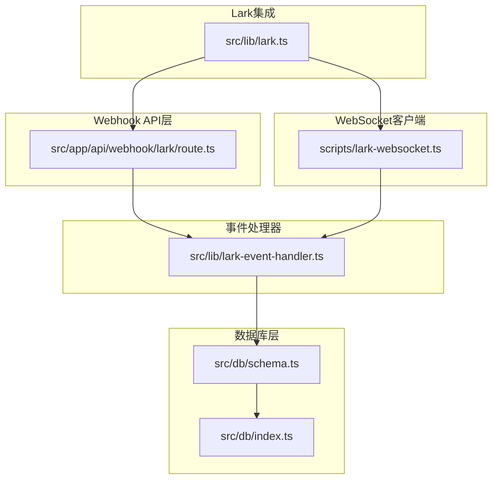
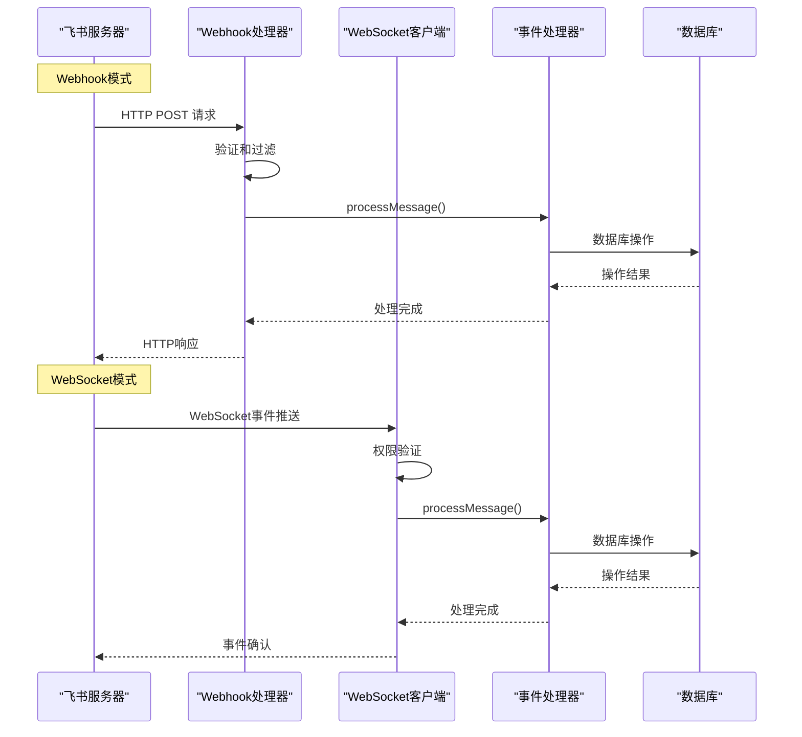
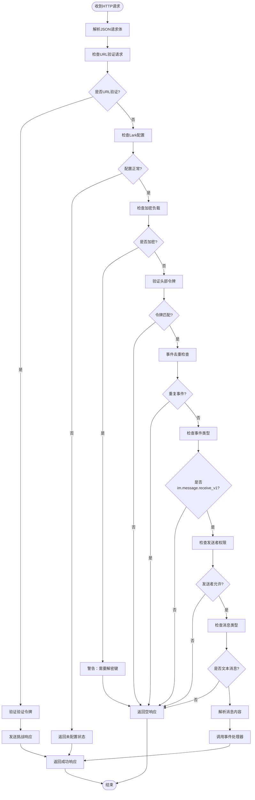
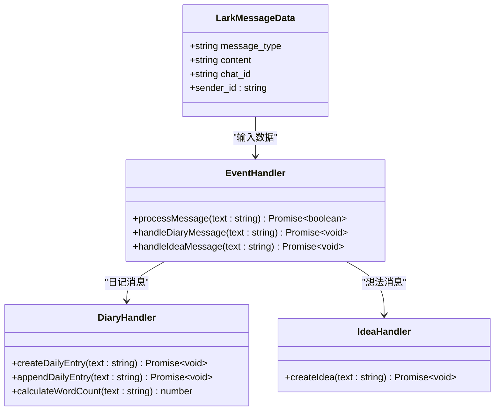
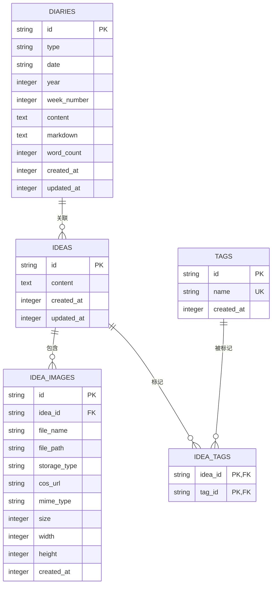

# Webhook API

<cite>
**本文档引用的文件**
- [src/app/api/webhook/lark/route.ts](file://src/app/api/webhook/lark/route.ts)
- [scripts/lark-websocket.ts](file://scripts/lark-websocket.ts)
- [src/lib/lark-event-handler.ts](file://src/lib/lark-event-handler.ts)
- [src/lib/lark.ts](file://src/lib/lark.ts)
- [src/db/schema.ts](file://src/db/schema.ts)
- [src/db/index.ts](file://src/db/index.ts)
- [package.json](file://package.json)
- [drizzle.config.ts](file://drizzle.config.ts)
</cite>

## 目录
1. [简介](#简介)
2. [项目结构](#项目结构)
3. [核心组件](#核心组件)
4. [架构概览](#架构概览)
5. [详细组件分析](#详细组件分析)
6. [依赖关系分析](#依赖关系分析)
7. [性能考虑](#性能考虑)
8. [故障排除指南](#故障排除指南)
9. [结论](#结论)
10. [附录](#附录)

## 简介

本项目实现了飞书（Lark/Feishu）Webhook API的完整解决方案，支持两种事件接收模式：Webhook和WebSocket长连接。系统能够处理飞书IM消息事件，自动识别和路由不同类型的消息到相应的业务处理器，并提供完整的事件去重、验证和错误处理机制。

该系统主要功能包括：
- 接收和处理飞书IM消息事件
- 支持日记和想法两种消息类型的智能路由
- 提供Webhook和WebSocket两种事件接收方式
- 实现事件去重和访问控制
- 提供完整的错误处理和日志记录

## 项目结构

项目采用模块化设计，核心Webhook相关文件分布如下：



**图表来源**
- [src/app/api/webhook/lark/route.ts:1-106](file://src/app/api/webhook/lark/route.ts#L1-L106)
- [scripts/lark-websocket.ts:1-109](file://scripts/lark-websocket.ts#L1-L109)
- [src/lib/lark-event-handler.ts:1-126](file://src/lib/lark-event-handler.ts#L1-L126)
- [src/lib/lark.ts:1-367](file://src/lib/lark.ts#L1-L367)

**章节来源**
- [src/app/api/webhook/lark/route.ts:1-106](file://src/app/api/webhook/lark/route.ts#L1-L106)
- [scripts/lark-websocket.ts:1-109](file://scripts/lark-websocket.ts#L1-L109)
- [src/lib/lark-event-handler.ts:1-126](file://src/lib/lark-event-handler.ts#L1-L126)
- [src/lib/lark.ts:1-367](file://src/lib/lark.ts#L1-L367)

## 核心组件

### Webhook处理器组件

Webhook处理器是系统的核心入口点，负责接收飞书服务器的HTTP请求并进行完整的事件处理。

**主要特性：**
- URL验证挑战响应
- 配置状态检查
- 加密负载检测
- 验证令牌校验
- 事件ID去重
- 事件类型过滤
- 发送者权限控制
- 消息类型验证
- 内容解析和路由

**章节来源**
- [src/app/api/webhook/lark/route.ts:28-105](file://src/app/api/webhook/lark/route.ts#L28-L105)

### WebSocket客户端组件

WebSocket客户端提供无需公网Webhook URL的实时事件接收能力。

**主要特性：**
- 自动重连机制
- 优雅关闭处理
- 事件分发器注册
- 用户权限验证
- 消息类型过滤
- 内容解析和处理

**章节来源**
- [scripts/lark-websocket.ts:74-109](file://scripts/lark-websocket.ts#L74-L109)

### 事件处理器组件

共享的事件处理器组件，被Webhook和WebSocket客户端共同使用。

**主要功能：**
- 日记消息处理（创建或追加）
- 想法消息处理（创建新条目）
- 智能消息路由
- 数据库操作封装

**章节来源**
- [src/lib/lark-event-handler.ts:104-125](file://src/lib/lark-event-handler.ts#L104-L125)

## 架构概览

系统采用双模式架构，支持Webhook和WebSocket两种事件接收方式：



**图表来源**
- [src/app/api/webhook/lark/route.ts:28-105](file://src/app/api/webhook/lark/route.ts#L28-L105)
- [scripts/lark-websocket.ts:43-71](file://scripts/lark-websocket.ts#L43-L71)
- [src/lib/lark-event-handler.ts:104-125](file://src/lib/lark-event-handler.ts#L104-L125)

## 详细组件分析

### Webhook处理器详细分析

Webhook处理器实现了完整的事件生命周期管理：



**图表来源**
- [src/app/api/webhook/lark/route.ts:28-105](file://src/app/api/webhook/lark/route.ts#L28-L105)

**章节来源**
- [src/app/api/webhook/lark/route.ts:28-105](file://src/app/api/webhook/lark/route.ts#L28-L105)

### 事件处理器详细分析

事件处理器实现了智能的消息路由和业务逻辑：



**图表来源**
- [src/lib/lark-event-handler.ts:12-23](file://src/lib/lark-event-handler.ts#L12-L23)
- [src/lib/lark-event-handler.ts:104-125](file://src/lib/lark-event-handler.ts#L104-L125)

**章节来源**
- [src/lib/lark-event-handler.ts:104-125](file://src/lib/lark-event-handler.ts#L104-L125)

### 数据模型分析

系统使用SQLite作为本地存储，支持日记和想法两种核心数据类型：



**图表来源**
- [src/db/schema.ts:93-104](file://src/db/schema.ts#L93-L104)
- [src/db/schema.ts:57-62](file://src/db/schema.ts#L57-L62)
- [src/db/schema.ts:64-76](file://src/db/schema.ts#L64-L76)
- [src/db/schema.ts:78-91](file://src/db/schema.ts#L78-L91)

**章节来源**
- [src/db/schema.ts:1-105](file://src/db/schema.ts#L1-L105)

## 依赖关系分析

系统的关键依赖关系如下：

```mermaid
graph TB
subgraph "外部依赖"
A[@larksuiteoapi/node-sdk]
B[better-sqlite3]
C[drizzle-orm]
D[date-fns]
E[nanoid]
end
subgraph "内部模块"
F[Webhook处理器]
G[WebSocket客户端]
H[事件处理器]
I[配置管理]
J[数据库层]
end
A --> F
A --> G
B --> J
C --> J
D --> H
E --> H
F --> H
G --> H
H --> J
I --> F
I --> G
```

**图表来源**
- [package.json:13-99](file://package.json#L13-L99)
- [src/lib/lark.ts:1-3](file://src/lib/lark.ts#L1-L3)
- [src/lib/lark-event-handler.ts:6-10](file://src/lib/lark-event-handler.ts#L6-L10)

**章节来源**
- [package.json:13-99](file://package.json#L13-L99)
- [src/lib/lark.ts:1-3](file://src/lib/lark.ts#L1-L3)

## 性能考虑

### 事件去重机制
系统实现了基于内存的事件去重，使用Map存储最近5分钟的事件ID，每分钟清理过期条目，有效防止重复处理。

### 数据库优化
- 使用WAL模式提高并发性能
- 启用外键约束确保数据完整性
- 为常用查询字段建立索引
- 使用单例模式管理数据库连接

### 内存管理
- 定时清理过期事件缓存
- 使用Set数据结构存储用户ID集合
- 避免不必要的对象创建

## 故障排除指南

### 常见问题及解决方案

**Webhook配置问题**
- 确认LARK_APP_ID和LARK_APP_SECRET已正确设置
- 验证LARK_VERIFICATION_TOKEN与飞书后台一致
- 检查LARK_ALLOWED_USER_IDS格式（逗号分隔）

**WebSocket连接问题**
- 确认WebSocket模式已启用（LARK_EVENT_MODE=websocket）
- 检查网络连接和防火墙设置
- 验证自动重连机制正常工作

**事件处理问题**
- 检查消息格式是否符合预期
- 确认消息类型为text
- 验证发送者权限设置

**数据库问题**
- 检查DATABASE_PATH配置
- 确认数据库文件权限
- 验证表结构完整性

**章节来源**
- [src/lib/lark.ts:25-41](file://src/lib/lark.ts#L25-L41)
- [src/app/api/webhook/lark/route.ts:48-53](file://src/app/api/webhook/lark/route.ts#L48-L53)
- [src/db/index.ts:8-25](file://src/db/index.ts#L8-L25)

## 结论

本Webhook API实现了飞书事件处理的完整解决方案，具有以下特点：

**优势：**
- 支持Webhook和WebSocket两种模式，适应不同部署场景
- 实现了完整的事件验证和安全机制
- 提供智能消息路由和业务逻辑处理
- 具备良好的错误处理和日志记录

**扩展性：**
- 模块化设计便于功能扩展
- 支持多种消息类型的处理
- 数据库层支持灵活的数据模型

**安全性：**
- 多层验证机制（配置、令牌、权限）
- 事件去重防止重复处理
- 加密负载检测和警告

## 附录

### 环境变量配置

| 变量名 | 必需 | 描述 | 示例值 |
|--------|------|------|--------|
| LARK_APP_ID | 是 | 飞书应用ID | app_id_123456 |
| LARK_APP_SECRET | 是 | 飞书应用密钥 | secret_key_789 |
| LARK_VERIFICATION_TOKEN | 否 | 验证令牌 | my_token |
| LARK_ALLOWED_USER_IDS | 否 | 允许的用户ID列表 | user_open_id_1,user_open_id_2 |
| LARK_ENCRYPT_KEY | 否 | 加密密钥 | encrypt_key_abc |
| LARK_EVENT_MODE | 否 | 事件模式 | webhook 或 websocket |
| DATABASE_PATH | 否 | 数据库文件路径 | ./data/ynote.db |

### 脚本命令

| 命令 | 功能 | 说明 |
|------|------|------|
| npm run dev | 开发模式 | 启动Next.js开发服务器 |
| npm run lark:ws | WebSocket模式 | 启动WebSocket客户端 |
| npm run dev:ws | 开发+WebSocket | 同时启动开发服务器和WebSocket客户端 |

### 事件类型支持

当前版本仅支持以下飞书事件类型：
- `im.message.receive_v1`: 即时消息接收事件

### 消息类型支持

系统支持以下消息类型：
- `text`: 文本消息（默认处理）
- 其他类型：当前版本忽略处理