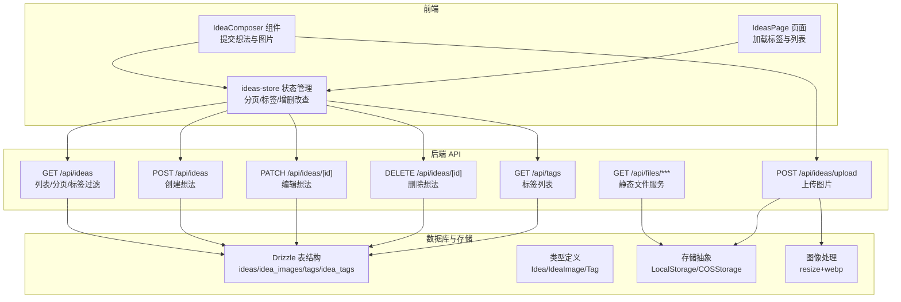
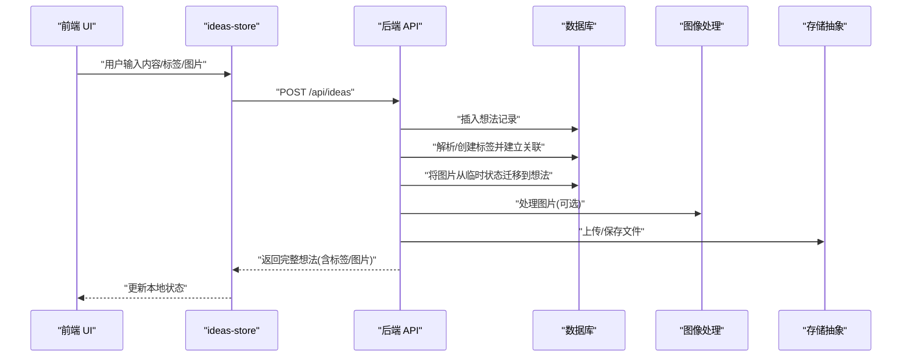
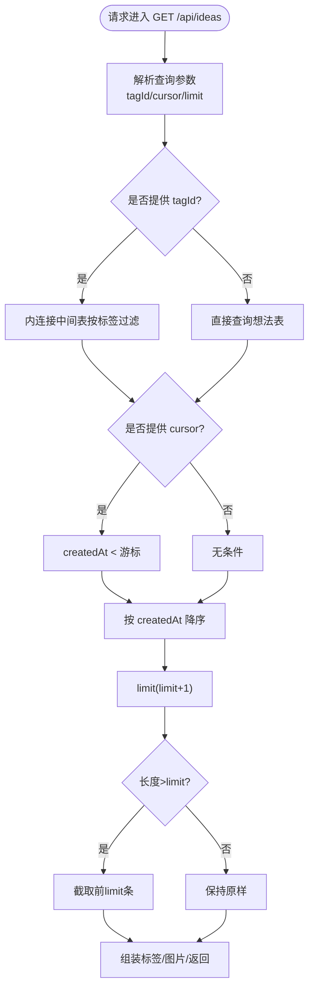
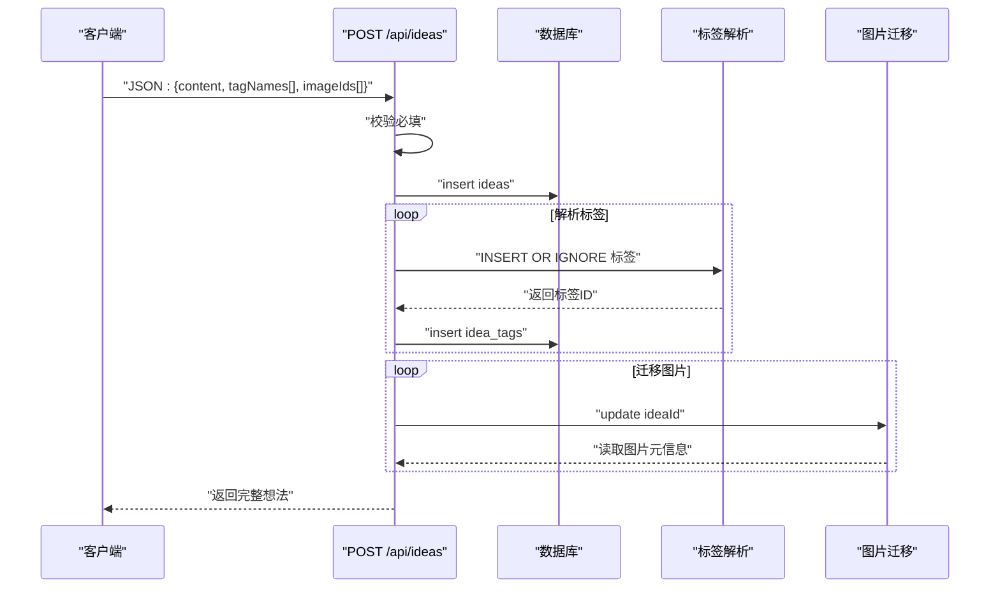
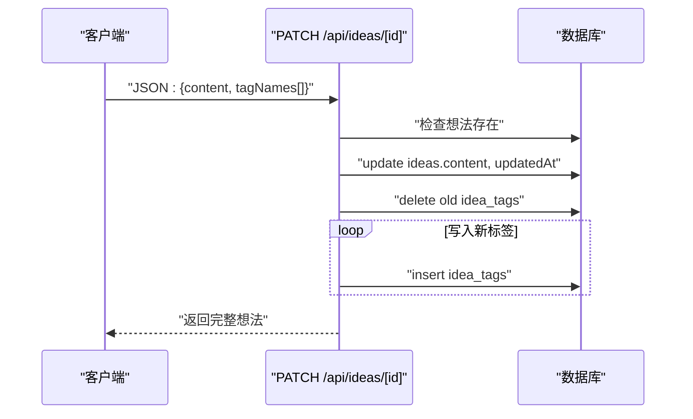
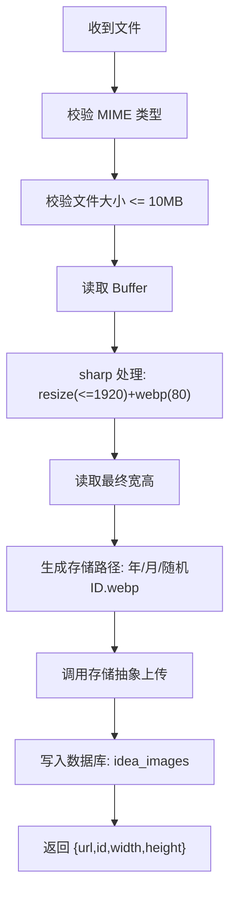
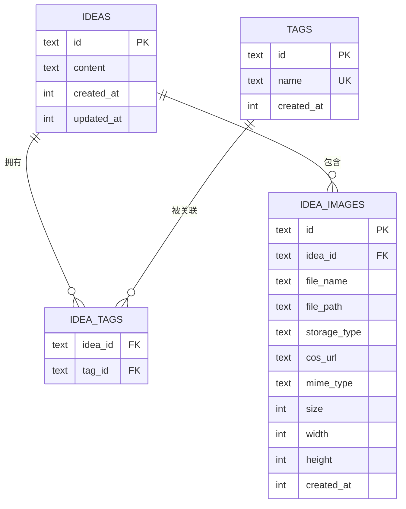
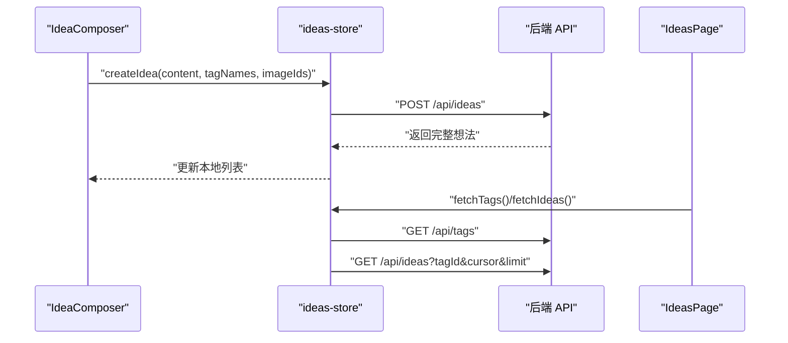
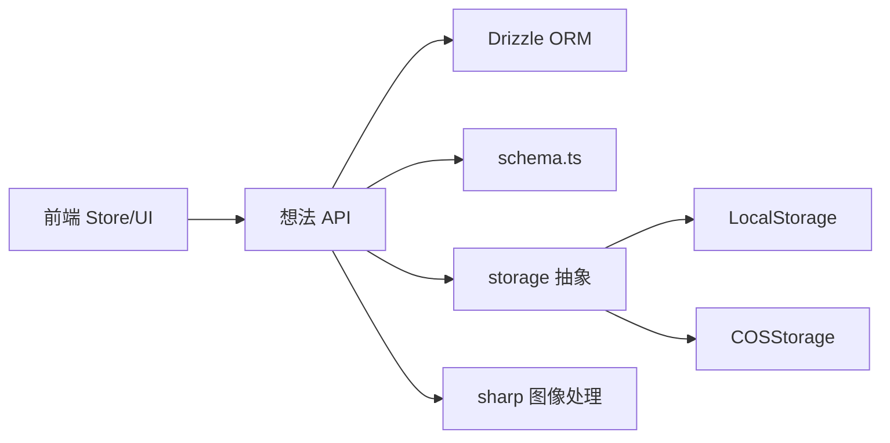

# 想法 API

<cite>
**本文引用的文件**
- [src/app/api/ideas/route.ts](file://src/app/api/ideas/route.ts)
- [src/app/api/ideas/[id]/route.ts](file://src/app/api/ideas/[id]/route.ts)
- [src/app/api/ideas/upload/route.ts](file://src/app/api/ideas/upload/route.ts)
- [src/app/api/tags/route.ts](file://src/app/api/tags/route.ts)
- [src/db/schema.ts](file://src/db/schema.ts)
- [src/types/index.ts](file://src/types/index.ts)
- [src/lib/storage/index.ts](file://src/lib/storage/index.ts)
- [src/lib/storage/local.ts](file://src/lib/storage/local.ts)
- [src/lib/storage/cos.ts](file://src/lib/storage/cos.ts)
- [src/lib/image-process.ts](file://src/lib/image-process.ts)
- [src/app/api/files/[...path]/route.ts](file://src/app/api/files/[...path]/route.ts)
- [src/stores/ideas-store.ts](file://src/stores/ideas-store.ts)
- [src/components/ideas/idea-composer.tsx](file://src/components/ideas/idea-composer.tsx)
- [src/components/ideas/ideas-page.tsx](file://src/components/ideas/ideas-page.tsx)
</cite>

## 目录
1. [简介](#简介)
2. [项目结构](#项目结构)
3. [核心组件](#核心组件)
4. [架构总览](#架构总览)
5. [详细组件分析](#详细组件分析)
6. [依赖分析](#依赖分析)
7. [性能考虑](#性能考虑)
8. [故障排查指南](#故障排查指南)
9. [结论](#结论)
10. [附录](#附录)

## 简介
本文件系统性地文档化“想法”模块的后端 API 与前端集成，覆盖以下能力：
- 想法的创建、编辑与删除接口
- 文本内容与图片附件的处理流程
- 想法上传接口的文件处理与存储策略（本地或对象存储）
- 想法列表的分页查询与排序
- 想法与标签的关联关系与管理接口
- 想法数据结构与字段说明
- 图片上传的 MIME 类型支持与尺寸限制
- 搜索与过滤功能（基于标签过滤）

## 项目结构
与“想法” API 相关的关键文件组织如下：
- 后端路由：/src/app/api/ideas/*、/src/app/api/ideas/upload、/src/app/api/tags、/src/app/api/files
- 数据模型：/src/db/schema.ts
- 类型定义：/src/types/index.ts
- 存储抽象：/src/lib/storage/*
- 图像处理：/src/lib/image-process.ts
- 前端状态与调用：/src/stores/ideas-store.ts、/src/components/ideas/*

图表来源
- [src/app/api/ideas/route.ts:1-151](file://src/app/api/ideas/route.ts#L1-L151)
- [src/app/api/ideas/[id]/route.ts](file://src/app/api/ideas/[id]/route.ts#L1-L117)
- [src/app/api/ideas/upload/route.ts:1-66](file://src/app/api/ideas/upload/route.ts#L1-L66)
- [src/app/api/tags/route.ts:1-28](file://src/app/api/tags/route.ts#L1-L28)
- [src/app/api/files/[...path]/route.ts](file://src/app/api/files/[...path]/route.ts#L1-L48)
- [src/db/schema.ts:57-91](file://src/db/schema.ts#L57-L91)
- [src/types/index.ts:37-58](file://src/types/index.ts#L37-L58)
- [src/lib/storage/index.ts:1-30](file://src/lib/storage/index.ts#L1-L30)
- [src/lib/image-process.ts:1-21](file://src/lib/image-process.ts#L1-L21)

章节来源
- [src/app/api/ideas/route.ts:1-151](file://src/app/api/ideas/route.ts#L1-L151)
- [src/app/api/ideas/[id]/route.ts](file://src/app/api/ideas/[id]/route.ts#L1-L117)
- [src/app/api/ideas/upload/route.ts:1-66](file://src/app/api/ideas/upload/route.ts#L1-L66)
- [src/app/api/tags/route.ts:1-28](file://src/app/api/tags/route.ts#L1-L28)
- [src/app/api/files/[...path]/route.ts](file://src/app/api/files/[...path]/route.ts#L1-L48)
- [src/db/schema.ts:57-91](file://src/db/schema.ts#L57-L91)
- [src/types/index.ts:37-58](file://src/types/index.ts#L37-L58)
- [src/lib/storage/index.ts:1-30](file://src/lib/storage/index.ts#L1-L30)
- [src/lib/image-process.ts:1-21](file://src/lib/image-process.ts#L1-L21)

## 核心组件
- 想法列表与创建
  - GET /api/ideas：支持 cursor 分页、limit 控制（默认 20，最大 50）、按标签过滤
  - POST /api/ideas：创建想法，支持 content、tagNames、imageIds；返回完整关联数据
- 想法编辑与删除
  - PATCH /api/ideas/[id]：编辑 content 与标签（全量替换），返回完整关联数据
  - DELETE /api/ideas/[id]：删除想法
- 图片上传与存储
  - POST /api/ideas/upload：上传图片，校验类型与大小，压缩为 webp，写入存储并记录元信息
  - 支持本地存储与腾讯云 COS，自动根据配置选择
- 标签管理
  - GET /api/tags：返回标签及关联想法数量，按数量降序

章节来源
- [src/app/api/ideas/route.ts:7-84](file://src/app/api/ideas/route.ts#L7-L84)
- [src/app/api/ideas/[id]/route.ts](file://src/app/api/ideas/[id]/route.ts#L40-L94)
- [src/app/api/ideas/[id]/route.ts](file://src/app/api/ideas/[id]/route.ts#L96-L116)
- [src/app/api/ideas/upload/route.ts:11-65](file://src/app/api/ideas/upload/route.ts#L11-L65)
- [src/app/api/tags/route.ts:6-27](file://src/app/api/tags/route.ts#L6-L27)

## 架构总览
下面以序列图展示“创建想法”的端到端流程。

图表来源
- [src/stores/ideas-store.ts:73-91](file://src/stores/ideas-store.ts#L73-L91)
- [src/app/api/ideas/route.ts:86-150](file://src/app/api/ideas/route.ts#L86-L150)
- [src/lib/image-process.ts:3-20](file://src/lib/image-process.ts#L3-L20)
- [src/lib/storage/index.ts:12-29](file://src/lib/storage/index.ts#L12-L29)

## 详细组件分析

### 想法列表与分页查询
- 查询参数
  - tagId：按标签过滤
  - cursor：时间游标（按 createdAt 小于游标）
  - limit：每页条数，默认 20，最大 50
- 排序规则
  - 按 createdAt 降序
- 返回结构
  - ideas：数组，每项包含 id、content、tags、images、createdAt、updatedAt
  - hasMore：是否存在更多数据
- 过滤逻辑
  - 当提供 tagId 时，通过中间表 inner join 过滤
  - 当提供 cursor 时，仅返回早于游标的记录

图表来源
- [src/app/api/ideas/route.ts:7-84](file://src/app/api/ideas/route.ts#L7-L84)

章节来源
- [src/app/api/ideas/route.ts:7-84](file://src/app/api/ideas/route.ts#L7-L84)

### 想法创建（POST /api/ideas）
- 请求体字段
  - content：字符串，必填或至少需配合 imageIds
  - tagNames：字符串数组，用于创建/解析标签
  - imageIds：字符串数组，将已有图片归档到该想法
- 处理流程
  - 校验 content 与 imageIds 至少其一
  - 插入想法记录（createdAt/updatedAt 同步）
  - 遍历 tagNames：去空格、去重、INSERT OR IGNORE、建立关联
  - 遍历 imageIds：更新归属到当前想法，并收集图片信息
- 返回值
  - 完整想法对象（包含 tags 与 images）

图表来源
- [src/app/api/ideas/route.ts:86-150](file://src/app/api/ideas/route.ts#L86-L150)

章节来源
- [src/app/api/ideas/route.ts:86-150](file://src/app/api/ideas/route.ts#L86-L150)

### 想法编辑（PATCH /api/ideas/[id]）
- 请求体字段
  - content：字符串（非空）
  - tagNames：字符串数组（全量替换）
- 处理流程
  - 校验存在性
  - 更新 content 与 updatedAt
  - 删除既有标签关联，重新写入传入的 tagNames
- 返回值
  - 完整想法对象（包含 tags 与 images）

图表来源
- [src/app/api/ideas/[id]/route.ts](file://src/app/api/ideas/[id]/route.ts#L40-L94)

章节来源
- [src/app/api/ideas/[id]/route.ts](file://src/app/api/ideas/[id]/route.ts#L40-L94)

### 想法删除（DELETE /api/ideas/[id]）
- 处理流程
  - 校验存在性
  - 删除对应想法记录
- 返回值
  - { success: true }

章节来源
- [src/app/api/ideas/[id]/route.ts](file://src/app/api/ideas/[id]/route.ts#L96-L116)

### 图片上传与存储（POST /api/ideas/upload）
- 请求格式
  - multipart/form-data
  - 字段：file（必需）、ideaId（可选）
- 校验规则
  - 文件类型：仅允许 PNG/JPEG/GIF/WEBP/SVG
  - 文件大小：不超过 10MB
- 处理流程
  - 读取二进制缓冲区
  - 使用 sharp 调整最大宽度至 1920（不放大），编码为 webp（质量 80）
  - 计算最终宽高
  - 生成存储路径（年/月/随机ID.webp）
  - 通过存储抽象上传（本地或 COS）
  - 写入数据库（idea_images）：fileName、filePath、storageType、cosUrl、mimeType、size、width、height、createdAt
- 返回值
  - { url, id, width, height }

图表来源
- [src/app/api/ideas/upload/route.ts:11-65](file://src/app/api/ideas/upload/route.ts#L11-L65)
- [src/lib/image-process.ts:3-20](file://src/lib/image-process.ts#L3-L20)
- [src/lib/storage/index.ts:12-29](file://src/lib/storage/index.ts#L12-L29)
- [src/lib/storage/local.ts:7-28](file://src/lib/storage/local.ts#L7-L28)
- [src/lib/storage/cos.ts:11-61](file://src/lib/storage/cos.ts#L11-L61)

章节来源
- [src/app/api/ideas/upload/route.ts:11-65](file://src/app/api/ideas/upload/route.ts#L11-L65)
- [src/lib/image-process.ts:1-21](file://src/lib/image-process.ts#L1-L21)
- [src/lib/storage/index.ts:1-30](file://src/lib/storage/index.ts#L1-L30)
- [src/lib/storage/local.ts:1-29](file://src/lib/storage/local.ts#L1-L29)
- [src/lib/storage/cos.ts:1-62](file://src/lib/storage/cos.ts#L1-L62)

### 标签管理（GET /api/tags）
- 功能
  - 返回所有标签及其关联的想法数量（按数量降序）
- 实现要点
  - 左连接统计 count(ideaId)，按 count 降序

章节来源
- [src/app/api/tags/route.ts:6-27](file://src/app/api/tags/route.ts#L6-L27)

### 数据模型与字段说明
- 表结构概览
  - ideas：id、content、createdAt、updatedAt
  - idea_images：id、ideaId、fileName、filePath、storageType、cosUrl、mimeType、size、width、height、createdAt
  - tags：id、name（唯一）、createdAt
  - idea_tags：ideaId、tagId（双外键，级联删除）
- 前端类型
  - Idea：id、content、tags[]、images[]、createdAt、updatedAt
  - IdeaImage：id、ideaId、url、width、height
  - Tag：id、name、count?

图表来源
- [src/db/schema.ts:57-91](file://src/db/schema.ts#L57-L91)
- [src/types/index.ts:37-58](file://src/types/index.ts#L37-L58)

章节来源
- [src/db/schema.ts:57-91](file://src/db/schema.ts#L57-L91)
- [src/types/index.ts:37-58](file://src/types/index.ts#L37-L58)

### 前端集成与交互
- IdeaComposer：负责输入内容、标签、图片上传与提交
- ideas-store：封装分页、标签筛选、CRUD 调用
- IdeasPage：页面入口，加载标签与列表，响应标签切换触发刷新

图表来源
- [src/components/ideas/idea-composer.tsx:16-103](file://src/components/ideas/idea-composer.tsx#L16-L103)
- [src/stores/ideas-store.ts:29-91](file://src/stores/ideas-store.ts#L29-L91)
- [src/components/ideas/ideas-page.tsx:9-23](file://src/components/ideas/ideas-page.tsx#L9-L23)

章节来源
- [src/components/ideas/idea-composer.tsx:1-202](file://src/components/ideas/idea-composer.tsx#L1-L202)
- [src/stores/ideas-store.ts:1-126](file://src/stores/ideas-store.ts#L1-L126)
- [src/components/ideas/ideas-page.tsx:1-43](file://src/components/ideas/ideas-page.tsx#L1-L43)

## 依赖分析
- 组件耦合
  - 想法 API 依赖 Drizzle ORM 与 SQLite（或兼容层）
  - 存储抽象屏蔽本地与 COS 差异
  - 图像处理依赖 sharp
- 外部依赖
  - COS SDK（可选）
  - Next.js 路由器与 Drizzle ORM
- 可能的循环依赖
  - 未见直接循环导入；API 层仅依赖 schema 与存储抽象

图表来源
- [src/app/api/ideas/route.ts:1-5](file://src/app/api/ideas/route.ts#L1-L5)
- [src/db/schema.ts:1-105](file://src/db/schema.ts#L1-L105)
- [src/lib/storage/index.ts:1-30](file://src/lib/storage/index.ts#L1-L30)
- [src/lib/image-process.ts:1-21](file://src/lib/image-process.ts#L1-L21)
- [src/stores/ideas-store.ts:1-18](file://src/stores/ideas-store.ts#L1-L18)

章节来源
- [src/app/api/ideas/route.ts:1-5](file://src/app/api/ideas/route.ts#L1-L5)
- [src/db/schema.ts:1-105](file://src/db/schema.ts#L1-L105)
- [src/lib/storage/index.ts:1-30](file://src/lib/storage/index.ts#L1-L30)
- [src/lib/image-process.ts:1-21](file://src/lib/image-process.ts#L1-L21)
- [src/stores/ideas-store.ts:1-18](file://src/stores/ideas-store.ts#L1-L18)

## 性能考虑
- 列表分页
  - 默认 limit=20，最大 50，避免一次性返回过多数据
  - 使用 cursor（createdAt 时间戳）进行无偏移分页，提升大表性能
- 数据库访问
  - 列表查询在 tagId 场景下使用 inner join，确保索引命中
  - 关联查询（tags/images）在单条记录上执行，批量场景建议前端合并
- 图像处理
  - 限制最大宽度 1920，压缩为 webp，兼顾体积与清晰度
  - 10MB 上限控制上传成本
- 存储策略
  - 优先使用对象存储（COS）以获得更好的扩展性与 CDN 加速
  - 本地存储适合开发或小规模部署

## 故障排查指南
- 创建想法失败
  - 现象：返回错误信息
  - 排查：检查 content 与 imageIds 是否同时为空；查看数据库异常日志
- 编辑失败
  - 现象：返回错误信息
  - 排查：确认 id 存在；content 非空；标签解析是否报错
- 删除失败
  - 现象：返回错误信息
  - 排查：确认 id 存在；检查级联删除是否生效
- 图片上传失败
  - 现象：返回错误信息
  - 排查：MIME 类型是否在允许列表；文件大小是否超过 10MB；存储配置是否正确；sharp 处理是否抛错
- 列表为空或分页异常
  - 现象：hasMore 与数据不一致
  - 排查：cursor 是否正确传递；limit 是否超过上限；tagId 是否有效

章节来源
- [src/app/api/ideas/route.ts:86-150](file://src/app/api/ideas/route.ts#L86-L150)
- [src/app/api/ideas/[id]/route.ts](file://src/app/api/ideas/[id]/route.ts#L40-L116)
- [src/app/api/ideas/upload/route.ts:11-65](file://src/app/api/ideas/upload/route.ts#L11-L65)

## 结论
想法 API 提供了完整的 CRUD、标签关联、图片上传与存储、以及基于标签的列表过滤与分页能力。通过统一的存储抽象与图像处理策略，系统在易用性与可扩展性之间取得平衡。建议在生产环境启用对象存储，并结合前端的 cursor 分页与标签筛选，以获得最佳用户体验与性能表现。

## 附录

### API 定义与示例

- 获取想法列表
  - 方法：GET
  - 路径：/api/ideas
  - 查询参数：
    - tagId：标签 ID（可选）
    - cursor：时间游标（可选）
    - limit：每页数量（默认 20，最大 50）
  - 响应：
    - ideas：数组，元素包含 id、content、tags、images、createdAt、updatedAt
    - hasMore：布尔

- 创建想法
  - 方法：POST
  - 路径：/api/ideas
  - 请求体：
    - content：字符串（必填或需配合 imageIds）
    - tagNames：字符串数组（可选）
    - imageIds：字符串数组（可选）
  - 响应：完整想法对象

- 编辑想法
  - 方法：PATCH
  - 路径：/api/ideas/[id]
  - 请求体：
    - content：字符串（非空）
    - tagNames：字符串数组（全量替换）
  - 响应：完整想法对象

- 删除想法
  - 方法：DELETE
  - 路径：/api/ideas/[id]
  - 响应：{ success: true }

- 上传图片
  - 方法：POST
  - 路径：/api/ideas/upload
  - 请求体：multipart/form-data
    - file：图片文件（必填）
    - ideaId：目标想法 ID（可选）
  - 响应：{ url, id, width, height }

- 获取标签列表
  - 方法：GET
  - 路径：/api/tags
  - 响应：{ tags: [{ id, name, count }] }

章节来源
- [src/app/api/ideas/route.ts:7-84](file://src/app/api/ideas/route.ts#L7-L84)
- [src/app/api/ideas/[id]/route.ts](file://src/app/api/ideas/[id]/route.ts#L40-L116)
- [src/app/api/ideas/upload/route.ts:11-65](file://src/app/api/ideas/upload/route.ts#L11-L65)
- [src/app/api/tags/route.ts:6-27](file://src/app/api/tags/route.ts#L6-L27)

### 图片上传 MIME 类型与尺寸限制
- 支持的 MIME 类型
  - image/png
  - image/jpeg
  - image/gif
  - image/webp
  - image/svg+xml
- 尺寸限制
  - 最大文件大小：10MB
  - 处理后输出：最大宽度 1920，webp 编码（质量 80）

章节来源
- [src/app/api/ideas/upload/route.ts:8-27](file://src/app/api/ideas/upload/route.ts#L8-L27)
- [src/lib/image-process.ts:8-10](file://src/lib/image-process.ts#L8-L10)

### 想法数据结构字段说明
- Idea
  - id：字符串，主键
  - content：字符串，内容
  - tags：Tag 数组
  - images：IdeaImage 数组
  - createdAt：数字，毫秒时间戳
  - updatedAt：数字，毫秒时间戳
- IdeaImage
  - id：字符串，图片 ID
  - ideaId：字符串，所属想法 ID
  - url：字符串，访问地址（优先 COS URL，否则本地 /api/files 路由）
  - width：数字，像素
  - height：数字，像素
- Tag
  - id：字符串
  - name：字符串
  - count：数字（可选，用于统计）

章节来源
- [src/types/index.ts:37-58](file://src/types/index.ts#L37-L58)
- [src/db/schema.ts:57-91](file://src/db/schema.ts#L57-L91)

### 搜索与过滤说明
- 标签过滤
  - 通过 GET /api/ideas?tagId=xxx 实现
- 分页
  - 通过 GET /api/ideas?cursor=xxx&limit=N 实现
- 排序
  - 默认按 createdAt 降序

章节来源
- [src/app/api/ideas/route.ts:10-42](file://src/app/api/ideas/route.ts#L10-L42)