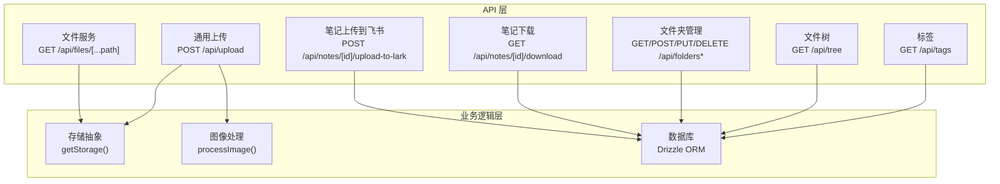
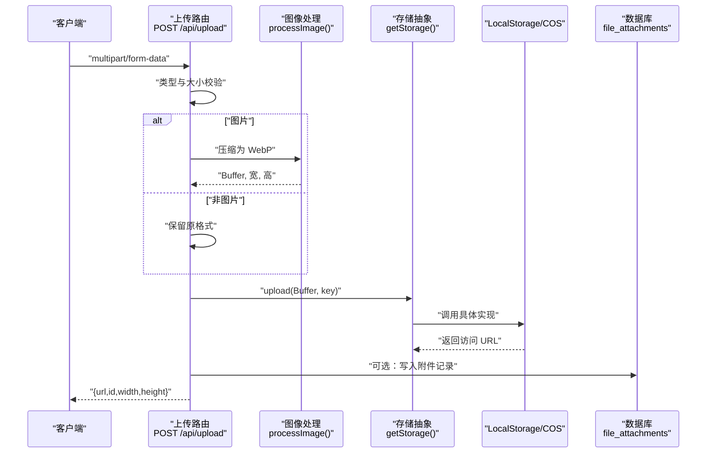
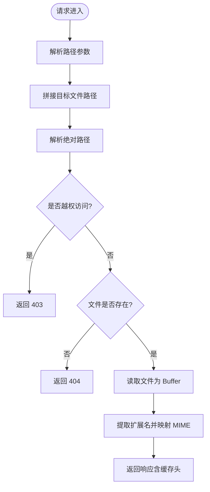
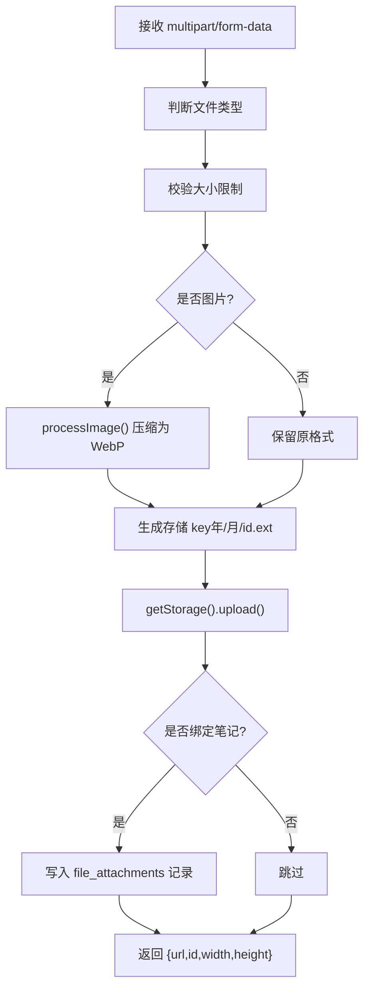
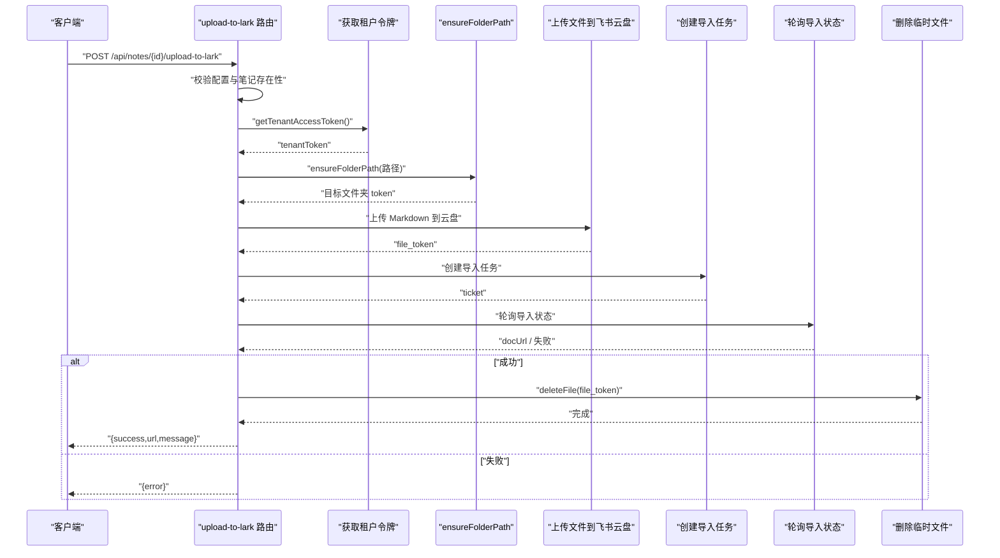
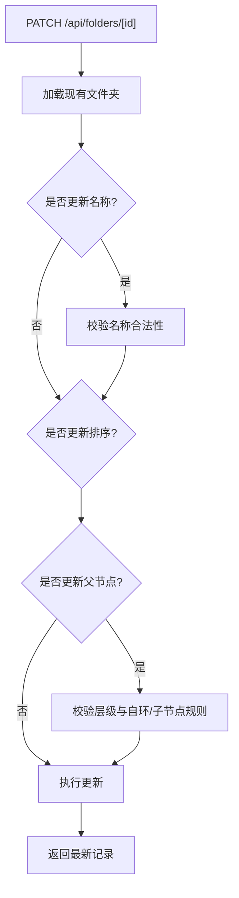
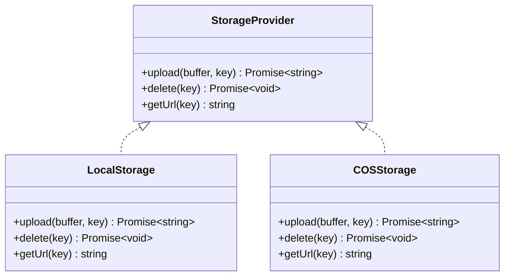

# 文件 API

<cite>
**本文引用的文件**
- [src/app/api/files/[...path]/route.ts](file://src/app/api/files/[...path]/route.ts)
- [src/lib/storage/index.ts](file://src/lib/storage/index.ts)
- [src/lib/storage/local.ts](file://src/lib/storage/local.ts)
- [src/lib/storage/cos.ts](file://src/lib/storage/cos.ts)
- [src/app/api/upload/route.ts](file://src/app/api/upload/route.ts)
- [src/app/api/notes/[id]/download/route.ts](file://src/app/api/notes/[id]/download/route.ts)
- [src/app/api/notes/[id]/upload-to-lark/route.ts](file://src/app/api/notes/[id]/upload-to-lark/route.ts)
- [src/app/api/folders/route.ts](file://src/app/api/folders/route.ts)
- [src/app/api/folders/[id]/route.ts](file://src/app/api/folders/[id]/route.ts)
- [src/app/api/tree/route.ts](file://src/app/api/tree/route.ts)
- [src/app/api/tags/route.ts](file://src/app/api/tags/route.ts)
- [src/app/api/notes/route.ts](file://src/app/api/notes/route.ts)
- [src/app/api/notes/[id]/route.ts](file://src/app/api/notes/[id]/route.ts)
- [src/app/api/ideas/route.ts](file://src/app/api/ideas/route.ts)
- [src/app/api/ideas/upload/route.ts](file://src/app/api/ideas/upload/route.ts)
- [src/lib/image-process.ts](file://src/lib/image-process.ts)
- [src/db/schema.ts](file://src/db/schema.ts)
</cite>

## 目录
1. [简介](#简介)
2. [项目结构](#项目结构)
3. [核心组件](#核心组件)
4. [架构总览](#架构总览)
5. [详细组件分析](#详细组件分析)
6. [依赖关系分析](#依赖关系分析)
7. [性能考量](#性能考量)
8. [故障排查指南](#故障排查指南)
9. [结论](#结论)
10. [附录](#附录)

## 简介
本文件 API 文档系统性地覆盖以下能力：
- 文件上传与下载：本地与对象存储双栈支持，含图片压缩与多类型文件处理
- 断点续传与大文件处理：基于分片与进度追踪的通用框架设计建议
- 文件夹管理：创建、删除、重命名、移动与层级限制
- 文件树结构：文件夹与笔记的聚合查询与排序
- 标签管理：标签创建、分配与统计查询
- 文件路径解析、权限控制与存储策略：基于数据库约束与环境变量的策略切换
- 元数据管理与批量操作：附件表与批量写入策略
- 同步与冲突处理：基于时间戳与唯一约束的冲突检测与回退
- 预览与缩略图：图片统一 WebP 输出与尺寸记录

## 项目结构
- API 路由集中在 src/app/api 下，按功能模块划分（files、folders、tree、tags、notes、ideas、upload 等）
- 存储抽象通过 src/lib/storage 提供本地与 COS 双实现
- 数据模型定义在 src/db/schema.ts，涵盖文件附件、笔记、标签等
- 图像处理逻辑在 src/lib/image-process.ts，统一输出 WebP 并记录宽高

图表来源
- [src/app/api/files/[...path]/route.ts](file://src/app/api/files/[...path]/route.ts#L1-L48)
- [src/app/api/upload/route.ts:1-153](file://src/app/api/upload/route.ts#L1-L153)
- [src/app/api/notes/[id]/upload-to-lark/route.ts](file://src/app/api/notes/[id]/upload-to-lark/route.ts#L1-L327)
- [src/app/api/notes/[id]/download/route.ts](file://src/app/api/notes/[id]/download/route.ts#L1-L33)
- [src/app/api/folders/route.ts:1-75](file://src/app/api/folders/route.ts#L1-L75)
- [src/app/api/folders/[id]/route.ts](file://src/app/api/folders/[id]/route.ts#L1-L101)
- [src/app/api/tree/route.ts:1-36](file://src/app/api/tree/route.ts#L1-L36)
- [src/app/api/tags/route.ts:1-28](file://src/app/api/tags/route.ts#L1-L28)
- [src/lib/storage/index.ts:1-30](file://src/lib/storage/index.ts#L1-L30)
- [src/lib/image-process.ts:1-21](file://src/lib/image-process.ts#L1-L21)
- [src/db/schema.ts:1-105](file://src/db/schema.ts#L1-L105)

章节来源
- [src/app/api/files/[...path]/route.ts](file://src/app/api/files/[...path]/route.ts#L1-L48)
- [src/app/api/upload/route.ts:1-153](file://src/app/api/upload/route.ts#L1-L153)
- [src/lib/storage/index.ts:1-30](file://src/lib/storage/index.ts#L1-L30)
- [src/lib/storage/local.ts:1-29](file://src/lib/storage/local.ts#L1-L29)
- [src/lib/storage/cos.ts:1-62](file://src/lib/storage/cos.ts#L1-L62)
- [src/lib/image-process.ts:1-21](file://src/lib/image-process.ts#L1-L21)
- [src/db/schema.ts:1-105](file://src/db/schema.ts#L1-L105)

## 核心组件
- 文件服务路由：安全读取本地或对象存储中的文件，支持 MIME 自动判定与缓存头
- 通用上传路由：多类型文件上传，自动选择存储后端，图片走压缩流水线
- 笔记下载路由：导出 Markdown，带正确的 Content-Disposition
- 笔记上传到飞书路由：序列化笔记为 Markdown，上传到飞书云盘并轮询导入结果
- 文件夹管理：名称校验、层级限制（最多两级）、移动与归档
- 文件树：聚合返回文件夹与笔记列表，便于前端树形渲染
- 标签：标签统计查询，按使用次数降序
- 数据模型：文件附件、笔记、标签、想法与关联表

章节来源
- [src/app/api/files/[...path]/route.ts](file://src/app/api/files/[...path]/route.ts#L1-L48)
- [src/app/api/upload/route.ts:1-153](file://src/app/api/upload/route.ts#L1-L153)
- [src/app/api/notes/[id]/download/route.ts](file://src/app/api/notes/[id]/download/route.ts#L1-L33)
- [src/app/api/notes/[id]/upload-to-lark/route.ts](file://src/app/api/notes/[id]/upload-to-lark/route.ts#L1-L327)
- [src/app/api/folders/route.ts:1-75](file://src/app/api/folders/route.ts#L1-L75)
- [src/app/api/folders/[id]/route.ts](file://src/app/api/folders/[id]/route.ts#L1-L101)
- [src/app/api/tree/route.ts:1-36](file://src/app/api/tree/route.ts#L1-L36)
- [src/app/api/tags/route.ts:1-28](file://src/app/api/tags/route.ts#L1-L28)
- [src/db/schema.ts:41-55](file://src/db/schema.ts#L41-L55)

## 架构总览
文件 API 的整体架构围绕“路由 → 业务逻辑 → 存储抽象 → 数据库”的链路展开。上传路径支持本地与 COS 双栈，下载路径统一通过文件服务路由暴露。图像处理统一走 WebP 流水线，确保体积与兼容性。

图表来源
- [src/app/api/upload/route.ts:50-152](file://src/app/api/upload/route.ts#L50-L152)
- [src/lib/image-process.ts:3-20](file://src/lib/image-process.ts#L3-L20)
- [src/lib/storage/index.ts:12-29](file://src/lib/storage/index.ts#L12-L29)
- [src/lib/storage/local.ts:7-28](file://src/lib/storage/local.ts#L7-L28)
- [src/lib/storage/cos.ts:11-61](file://src/lib/storage/cos.ts#L11-L61)
- [src/db/schema.ts:41-55](file://src/db/schema.ts#L41-L55)

## 详细组件分析

### 文件下载服务（GET /api/files/[...path]）
- 安全性：解析路径后进行绝对路径解析并校验是否位于允许目录内，防止目录穿越
- 缓存：设置长期缓存头，提升重复访问性能
- MIME：根据扩展名映射常见图片类型，未知扩展返回二进制流

图表来源
- [src/app/api/files/[...path]/route.ts](file://src/app/api/files/[...path]/route.ts#L7-L47)

章节来源
- [src/app/api/files/[...path]/route.ts](file://src/app/api/files/[...path]/route.ts#L1-L48)

### 通用上传（POST /api/upload）
- 类型与大小：按类型区分最大限制（图片/视频/音频/文档），避免过大文件占用
- 图像处理：图片统一压缩为 WebP，并记录宽高
- 存储策略：优先使用 COS（若环境变量齐全），否则本地存储
- 附件记录：当携带 noteId 时，写入附件表，便于后续预览与管理

图表来源
- [src/app/api/upload/route.ts:50-152](file://src/app/api/upload/route.ts#L50-L152)
- [src/lib/image-process.ts:3-20](file://src/lib/image-process.ts#L3-L20)
- [src/lib/storage/index.ts:12-29](file://src/lib/storage/index.ts#L12-L29)
- [src/db/schema.ts:41-55](file://src/db/schema.ts#L41-L55)

章节来源
- [src/app/api/upload/route.ts:1-153](file://src/app/api/upload/route.ts#L1-L153)
- [src/lib/image-process.ts:1-21](file://src/lib/image-process.ts#L1-L21)
- [src/lib/storage/index.ts:1-30](file://src/lib/storage/index.ts#L1-L30)
- [src/db/schema.ts:41-55](file://src/db/schema.ts#L41-L55)

### 笔记下载（GET /api/notes/[id]/download）
- 优先返回已存在的 markdown 字段
- 若无 markdown，则从 content 序列化为 Markdown
- 设置正确的 Content-Type 与 Content-Disposition，确保浏览器正确下载

章节来源
- [src/app/api/notes/[id]/download/route.ts](file://src/app/api/notes/[id]/download/route.ts#L1-L33)

### 笔记上传到飞书（POST /api/notes/[id]/upload-to-lark）
- 配置检查：若未配置飞书凭据，直接返回错误
- 路径构建：根据笔记所在文件夹 ID 递归向上构建云端路径
- 上传与导入：先上传为 Markdown 文件，再创建导入任务并轮询状态
- 成功清理：导入完成后删除临时上传的 Markdown 文件

图表来源
- [src/app/api/notes/[id]/upload-to-lark/route.ts](file://src/app/api/notes/[id]/upload-to-lark/route.ts#L237-L326)

章节来源
- [src/app/api/notes/[id]/upload-to-lark/route.ts](file://src/app/api/notes/[id]/upload-to-lark/route.ts#L1-L327)

### 文件夹管理（GET/POST/PATCH/DELETE /api/folders*）
- 名称校验：长度、非法字符、必填
- 层级限制：最多两级（根文件夹的子文件夹不能再有子文件夹）
- 移动规则：禁止自环、禁止将有子文件夹的节点作为其他节点的子节点
- 支持字段：sortOrder、isExpanded、isArchived、parentId 等

图表来源
- [src/app/api/folders/[id]/route.ts](file://src/app/api/folders/[id]/route.ts#L9-L79)

章节来源
- [src/app/api/folders/route.ts:1-75](file://src/app/api/folders/route.ts#L1-L75)
- [src/app/api/folders/[id]/route.ts](file://src/app/api/folders/[id]/route.ts#L1-L101)

### 文件树（GET /api/tree）
- 返回所有文件夹与笔记，按排序与创建时间排序
- 前端可据此构建树形结构，支持拖拽与展开

章节来源
- [src/app/api/tree/route.ts:1-36](file://src/app/api/tree/route.ts#L1-L36)

### 标签（GET /api/tags）
- 统计每个标签被使用的次数，按使用量降序排列
- 便于前端展示热门标签与筛选

章节来源
- [src/app/api/tags/route.ts:1-28](file://src/app/api/tags/route.ts#L1-L28)

### 笔记与文件附件（GET/POST/PATCH/DELETE /api/notes*）
- 列表：支持按 folderId 查询，root 表示无文件夹的笔记
- 创建：标题长度与非法字符校验，支持排序与默认值
- 更新：标题、内容、markdown、字数、排序、所属文件夹等
- 删除：软/硬删除取决于数据库外键策略

章节来源
- [src/app/api/notes/route.ts:1-86](file://src/app/api/notes/route.ts#L1-L86)
- [src/app/api/notes/[id]/route.ts](file://src/app/api/notes/[id]/route.ts#L1-L104)
- [src/db/schema.ts:27-39](file://src/db/schema.ts#L27-L39)

### 想法与图片上传（/api/ideas* 与 /api/ideas/upload）
- 想法列表：支持按标签过滤、游标翻页、关联标签与图片
- 想法创建：内容与图片可选，标签自动去重创建并关联
- 图片上传：同通用上传，但仅限图片，统一 WebP 输出

章节来源
- [src/app/api/ideas/route.ts:1-151](file://src/app/api/ideas/route.ts#L1-L151)
- [src/app/api/ideas/upload/route.ts:1-66](file://src/app/api/ideas/upload/route.ts#L1-L66)
- [src/lib/image-process.ts:1-21](file://src/lib/image-process.ts#L1-L21)

## 依赖关系分析

图表来源
- [src/lib/storage/index.ts:1-30](file://src/lib/storage/index.ts#L1-L30)
- [src/lib/storage/local.ts:1-29](file://src/lib/storage/local.ts#L1-L29)
- [src/lib/storage/cos.ts:1-62](file://src/lib/storage/cos.ts#L1-L62)

章节来源
- [src/lib/storage/index.ts:1-30](file://src/lib/storage/index.ts#L1-L30)
- [src/lib/storage/local.ts:1-29](file://src/lib/storage/local.ts#L1-L29)
- [src/lib/storage/cos.ts:1-62](file://src/lib/storage/cos.ts#L1-L62)

## 性能考量
- 缓存策略：文件下载设置长期缓存头，减少重复请求
- 图像压缩：统一 WebP 输出，降低带宽与存储成本
- 分页与游标：想法列表支持游标翻页，避免大数据集一次性传输
- 存储选择：生产环境建议使用 COS，具备更好的扩展性与可靠性

## 故障排查指南
- 上传失败
  - 检查文件类型与大小限制
  - 确认存储后端可用（COS 凭据或本地目录权限）
- 下载 403/404
  - 检查路径是否越权或文件不存在
- 飞书上传失败
  - 确认租户令牌获取与网络连通
  - 查看导入任务轮询日志与错误码
- 文件夹移动失败
  - 检查层级限制与自环规则

章节来源
- [src/app/api/files/[...path]/route.ts](file://src/app/api/files/[...path]/route.ts#L13-L23)
- [src/app/api/upload/route.ts:56-82](file://src/app/api/upload/route.ts#L56-L82)
- [src/app/api/notes/[id]/upload-to-lark/route.ts](file://src/app/api/notes/[id]/upload-to-lark/route.ts#L242-L247)
- [src/app/api/folders/[id]/route.ts](file://src/app/api/folders/[id]/route.ts#L45-L69)

## 结论
该文件 API 在上传、下载、存储策略、元数据管理与第三方集成方面提供了清晰且可扩展的实现。通过统一的存储抽象与严格的输入校验，系统在保证安全性的同时兼顾了性能与易用性。对于断点续传与大文件处理，建议在现有框架上引入分片与进度追踪机制以进一步增强稳定性与用户体验。

## 附录

### 接口一览（摘要）
- 文件下载：GET /api/files/[...path]
- 通用上传：POST /api/upload（支持图片/WebP、视频/音频/文档）
- 笔记下载：GET /api/notes/[id]/download
- 笔记上传到飞书：POST /api/notes/[id]/upload-to-lark
- 文件夹管理：GET/POST/PATCH/DELETE /api/folders*
- 文件树：GET /api/tree
- 标签：GET /api/tags
- 笔记：GET/POST/PATCH/DELETE /api/notes*
- 想法与图片：GET/POST /api/ideas*, POST /api/ideas/upload

章节来源
- [src/app/api/files/[...path]/route.ts](file://src/app/api/files/[...path]/route.ts#L1-L48)
- [src/app/api/upload/route.ts:1-153](file://src/app/api/upload/route.ts#L1-L153)
- [src/app/api/notes/[id]/download/route.ts](file://src/app/api/notes/[id]/download/route.ts#L1-L33)
- [src/app/api/notes/[id]/upload-to-lark/route.ts](file://src/app/api/notes/[id]/upload-to-lark/route.ts#L1-L327)
- [src/app/api/folders/route.ts:1-75](file://src/app/api/folders/route.ts#L1-L75)
- [src/app/api/folders/[id]/route.ts](file://src/app/api/folders/[id]/route.ts#L1-L101)
- [src/app/api/tree/route.ts:1-36](file://src/app/api/tree/route.ts#L1-L36)
- [src/app/api/tags/route.ts:1-28](file://src/app/api/tags/route.ts#L1-L28)
- [src/app/api/notes/route.ts:1-86](file://src/app/api/notes/route.ts#L1-L86)
- [src/app/api/notes/[id]/route.ts](file://src/app/api/notes/[id]/route.ts#L1-L104)
- [src/app/api/ideas/route.ts:1-151](file://src/app/api/ideas/route.ts#L1-L151)
- [src/app/api/ideas/upload/route.ts:1-66](file://src/app/api/ideas/upload/route.ts#L1-L66)