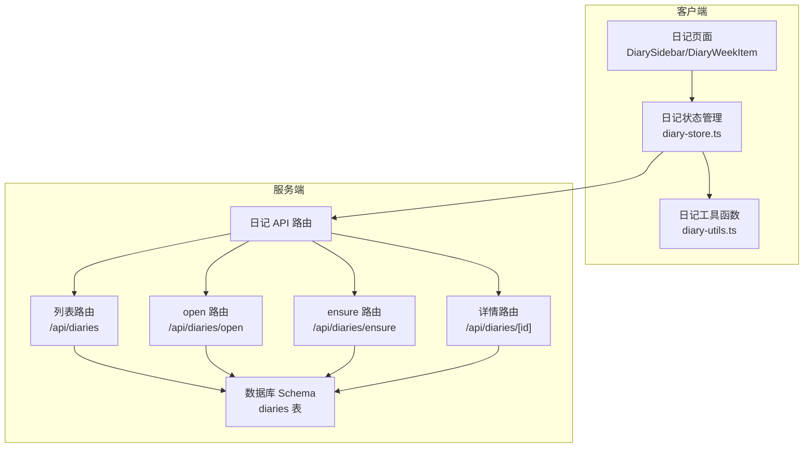
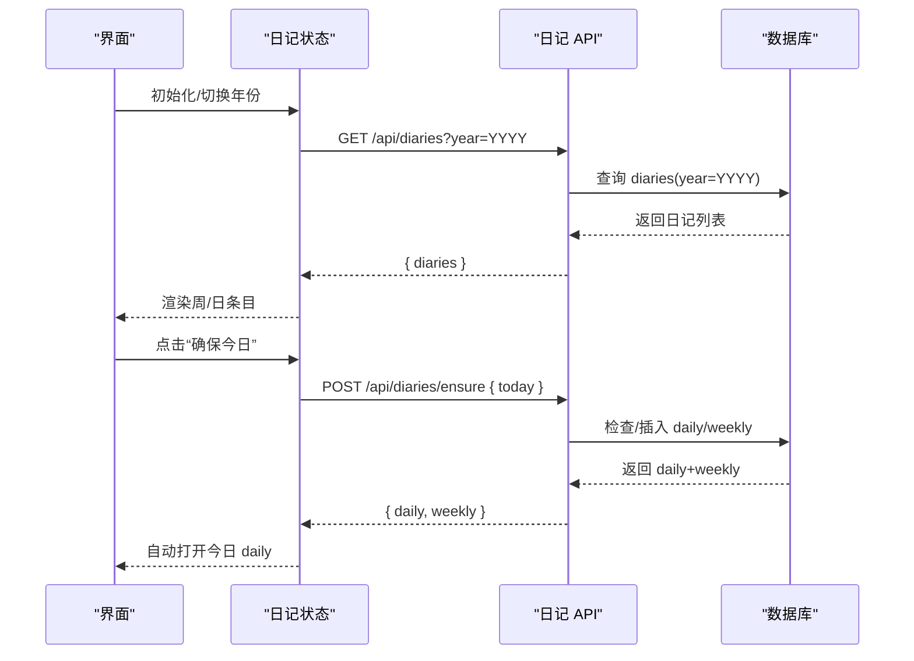
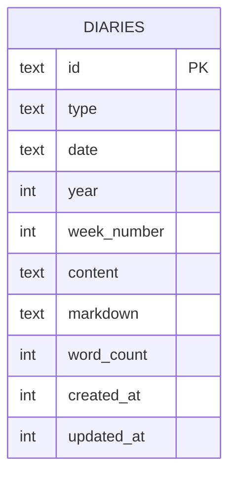
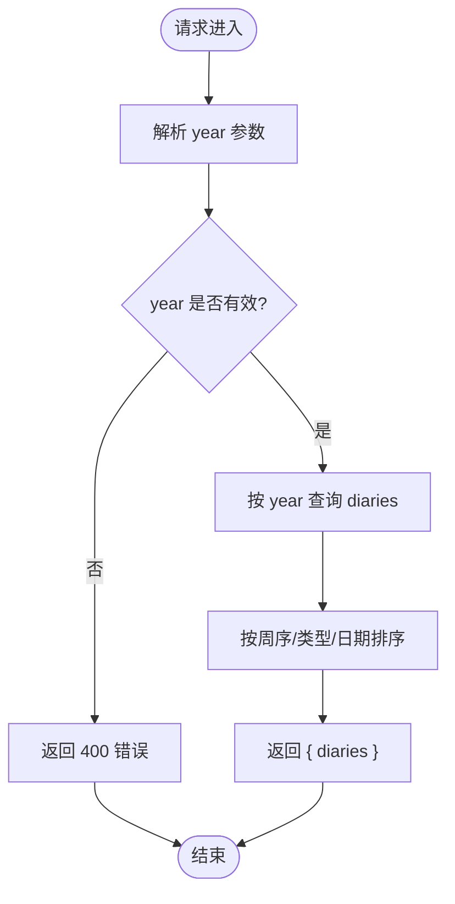
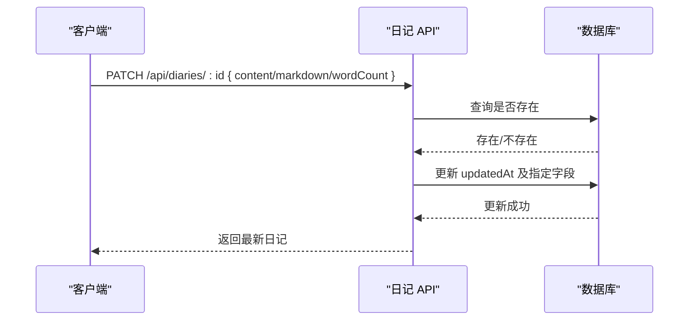
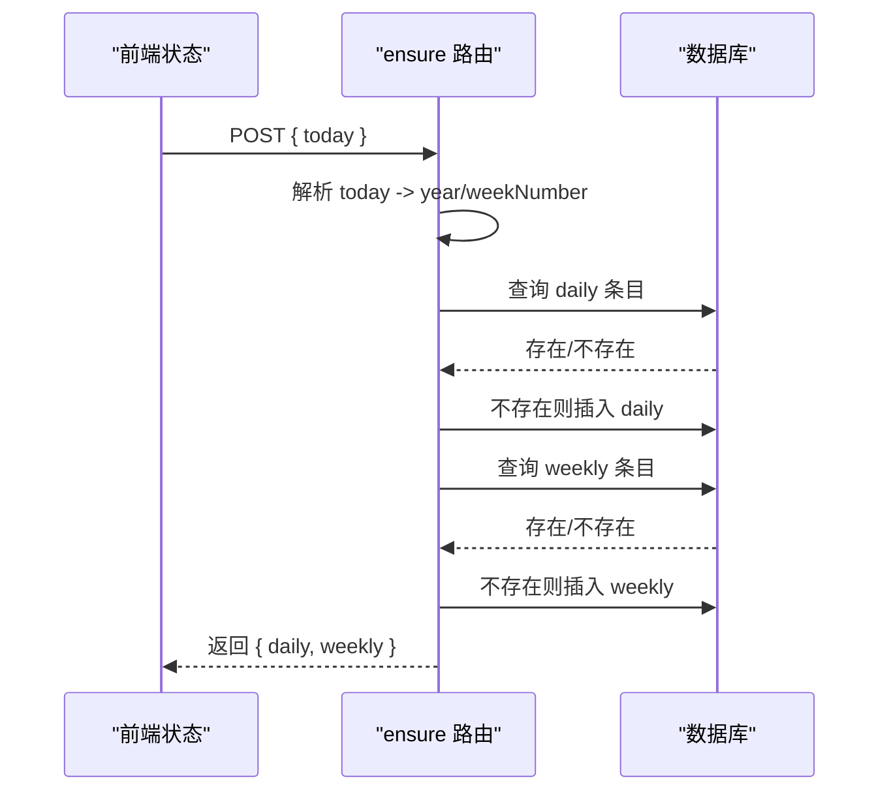
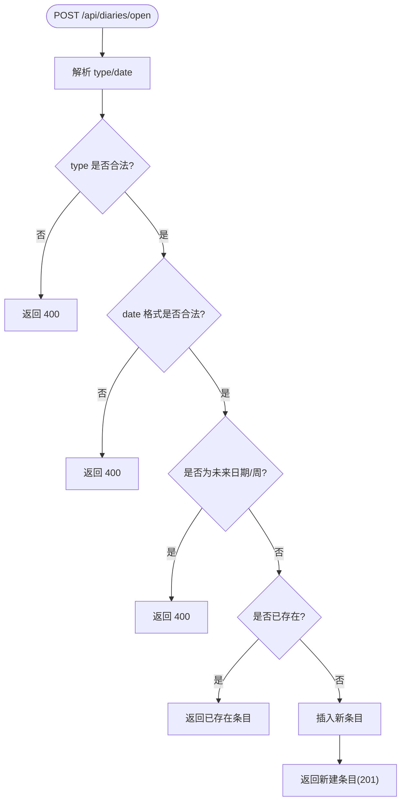
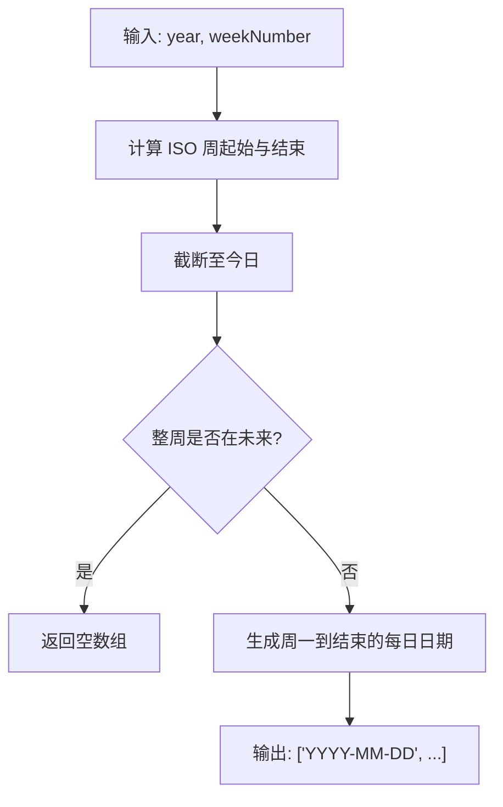
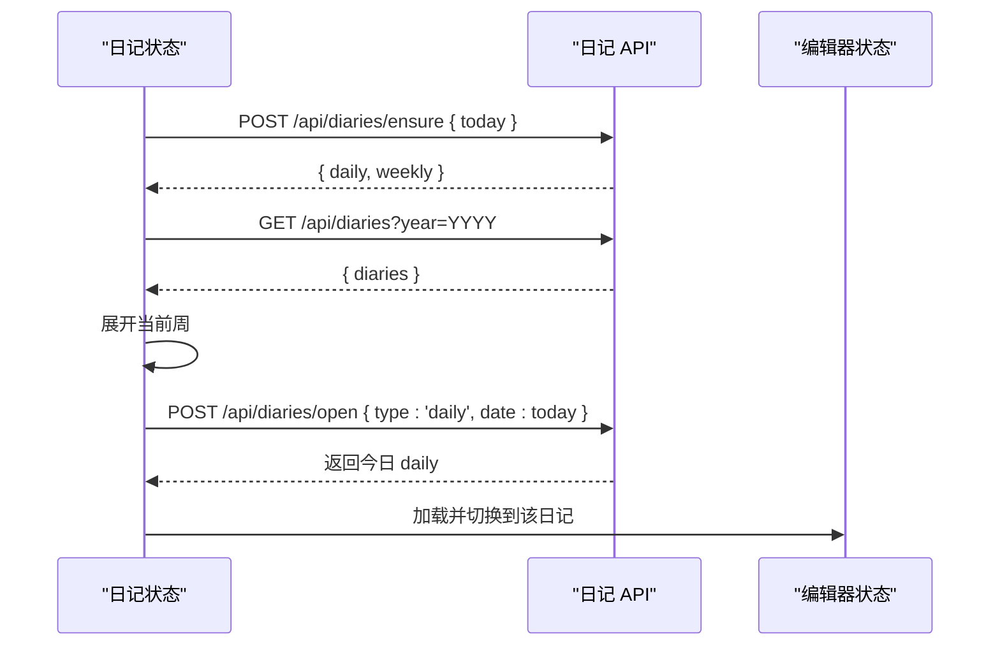
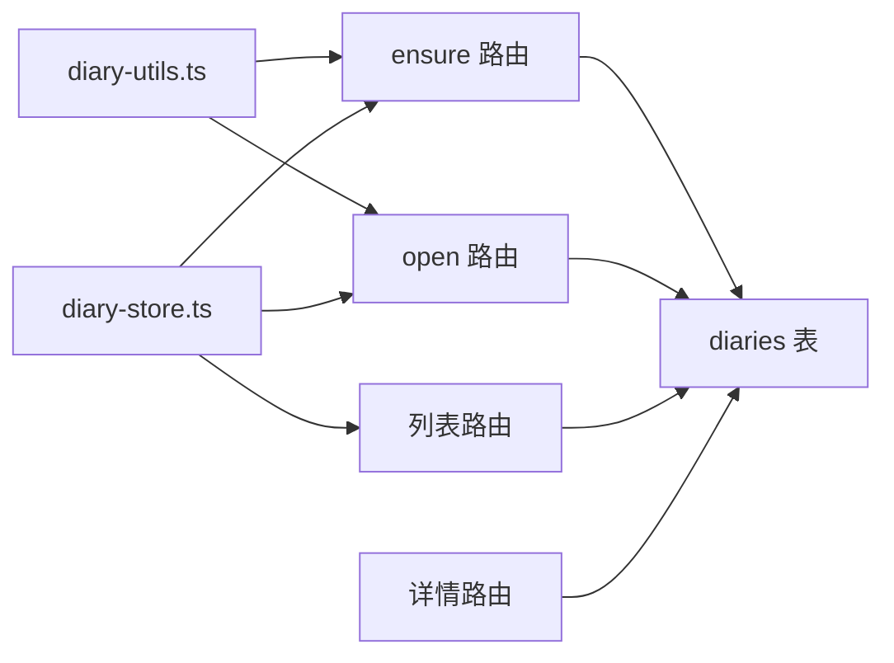

# 日记 API

<cite>
**本文引用的文件**
- [src/app/api/diaries/route.ts](file://src/app/api/diaries/route.ts)
- [src/app/api/diaries/[id]/route.ts](file://src/app/api/diaries/[id]/route.ts)
- [src/app/api/diaries/ensure/route.ts](file://src/app/api/diaries/ensure/route.ts)
- [src/app/api/diaries/open/route.ts](file://src/app/api/diaries/open/route.ts)
- [src/db/schema.ts](file://src/db/schema.ts)
- [src/stores/diary-store.ts](file://src/stores/diary-store.ts)
- [src/lib/diary-utils.ts](file://src/lib/diary-utils.ts)
- [src/types/index.ts](file://src/types/index.ts)
- [src/db/index.ts](file://src/db/index.ts)
- [src/lib/lark-event-handler.ts](file://src/lib/lark-event-handler.ts)
</cite>

## 目录
1. [简介](#简介)
2. [项目结构](#项目结构)
3. [核心组件](#核心组件)
4. [架构总览](#架构总览)
5. [详细组件分析](#详细组件分析)
6. [依赖关系分析](#依赖关系分析)
7. [性能考量](#性能考量)
8. [故障排查指南](#故障排查指南)
9. [结论](#结论)
10. [附录](#附录)

## 简介
本文件系统性地文档化日记 API，覆盖以下能力：
- 日记条目的创建、读取、更新与删除（CRUD）
- ensure 接口的“日记条目保证机制”与自动创建逻辑
- open 接口的“日记开放状态管理”与访问控制
- 日记日期格式、ISO 周计算与时间范围查询
- 日记内容的数据结构与元数据管理
- 日记统计与聚合查询的接口说明
- 日记的搜索与过滤功能（按日期与标签）

## 项目结构
日记 API 的后端采用 Next.js App Router 的路由约定式 API，前端通过 Zustand 状态管理与工具函数协作完成交互与展示。

图表来源
- [src/stores/diary-store.ts:1-234](file://src/stores/diary-store.ts#L1-L234)
- [src/lib/diary-utils.ts:1-113](file://src/lib/diary-utils.ts#L1-L113)
- [src/app/api/diaries/route.ts:1-44](file://src/app/api/diaries/route.ts#L1-L44)
- [src/app/api/diaries/[id]/route.ts](file://src/app/api/diaries/[id]/route.ts#L1-L63)
- [src/app/api/diaries/ensure/route.ts:1-127](file://src/app/api/diaries/ensure/route.ts#L1-L127)
- [src/app/api/diaries/open/route.ts:1-130](file://src/app/api/diaries/open/route.ts#L1-L130)
- [src/db/schema.ts:93-104](file://src/db/schema.ts#L93-L104)

章节来源
- [src/stores/diary-store.ts:1-234](file://src/stores/diary-store.ts#L1-L234)
- [src/lib/diary-utils.ts:1-113](file://src/lib/diary-utils.ts#L1-L113)
- [src/app/api/diaries/route.ts:1-44](file://src/app/api/diaries/route.ts#L1-L44)
- [src/app/api/diaries/[id]/route.ts](file://src/app/api/diaries/[id]/route.ts#L1-L63)
- [src/app/api/diaries/ensure/route.ts:1-127](file://src/app/api/diaries/ensure/route.ts#L1-L127)
- [src/app/api/diaries/open/route.ts:1-130](file://src/app/api/diaries/open/route.ts#L1-L130)
- [src/db/schema.ts:93-104](file://src/db/schema.ts#L93-L104)

## 核心组件
- 数据模型：日记表包含主键 id、类型（daily/weekly）、日期字符串、ISO 周年份与周数、内容文本、Markdown 文本、字数统计、创建与更新时间戳等字段。
- 端点：
  - GET /api/diaries?year=YYYY：按年份返回日记列表，支持排序与筛选。
  - GET /api/diaries/[id]：按 ID 获取单条日记详情。
  - PATCH /api/diaries/[id]：更新日记内容、Markdown 与字数统计。
  - POST /api/diaries/ensure：确保当天与本周的日记条目存在，若不存在则自动创建。
  - POST /api/diaries/open：按类型与日期创建或打开日记条目，含未来日期校验。
- 前端状态与工具：
  - 使用 Zustand 管理选中年份、日记列表、展开周、加载状态等。
  - 使用工具函数处理 ISO 周、本地化标签、当前周判断、周内天数生成等。

章节来源
- [src/db/schema.ts:93-104](file://src/db/schema.ts#L93-L104)
- [src/app/api/diaries/route.ts:1-44](file://src/app/api/diaries/route.ts#L1-L44)
- [src/app/api/diaries/[id]/route.ts](file://src/app/api/diaries/[id]/route.ts#L1-L63)
- [src/app/api/diaries/ensure/route.ts:1-127](file://src/app/api/diaries/ensure/route.ts#L1-L127)
- [src/app/api/diaries/open/route.ts:1-130](file://src/app/api/diaries/open/route.ts#L1-L130)
- [src/stores/diary-store.ts:1-234](file://src/stores/diary-store.ts#L1-L234)
- [src/lib/diary-utils.ts:1-113](file://src/lib/diary-utils.ts#L1-L113)

## 架构总览
下图展示了客户端到服务端的调用链路与数据流。

图表来源
- [src/stores/diary-store.ts:69-100](file://src/stores/diary-store.ts#L69-L100)
- [src/app/api/diaries/route.ts:6-36](file://src/app/api/diaries/route.ts#L6-L36)
- [src/app/api/diaries/ensure/route.ts:8-118](file://src/app/api/diaries/ensure/route.ts#L8-L118)
- [src/db/schema.ts:93-104](file://src/db/schema.ts#L93-L104)

## 详细组件分析

### 数据模型与元数据
- 表结构要点
  - 主键：id（UUID）
  - 类型：type ∈ {"daily","weekly"}
  - 日期：date 字符串
    - daily：'YYYY-MM-DD'
    - weekly：'YYYY-Www'（ISO 周）
  - 年与周：year（ISO 周年）、weekNumber（1-53）
  - 内容：content（JSON 文本块数组）、markdown（纯文本）
  - 统计：wordCount（整数）
  - 时间戳：createdAt、updatedAt（毫秒时间戳）
- 类型定义
  - DiaryEntry：包含完整内容与元数据
  - DiaryMeta：不包含 content/markdown 的轻量元数据

图表来源
- [src/db/schema.ts:93-104](file://src/db/schema.ts#L93-L104)
- [src/types/index.ts:60-74](file://src/types/index.ts#L60-L74)

章节来源
- [src/db/schema.ts:93-104](file://src/db/schema.ts#L93-L104)
- [src/types/index.ts:60-74](file://src/types/index.ts#L60-L74)

### 列表查询与时间范围
- 端点：GET /api/diaries?year=YYYY
- 功能：按年份查询所有日记条目，按周序降序、类型升序、日期降序排序
- 用途：年视图展示与统计

图表来源
- [src/app/api/diaries/route.ts:6-36](file://src/app/api/diaries/route.ts#L6-L36)

章节来源
- [src/app/api/diaries/route.ts:1-44](file://src/app/api/diaries/route.ts#L1-L44)

### 详情读取与更新
- 读取：GET /api/diaries/[id]
- 更新：PATCH /api/diaries/[id]
  - 支持更新字段：content、markdown、wordCount
  - 自动更新 updatedAt
- 删除：未在现有路由中暴露，如需可扩展为 DELETE /api/diaries/[id]

图表来源
- [src/app/api/diaries/[id]/route.ts](file://src/app/api/diaries/[id]/route.ts#L26-L57)

章节来源
- [src/app/api/diaries/[id]/route.ts](file://src/app/api/diaries/[id]/route.ts#L1-L63)

### ensure 接口：日记条目保证机制与自动创建
- 目标：确保当天（daily）与本周（weekly）的日记条目存在；若不存在则创建
- 输入：today（'YYYY-MM-DD'）
- 处理流程：
  - 计算 ISO 周年份与周数，生成 weekly 日期字符串 'YYYY-Www'
  - 分别查询 daily 与 weekly 条目，不存在则插入空内容条目
- 输出：返回 { daily, weekly } 对象（仅包含元数据）

图表来源
- [src/app/api/diaries/ensure/route.ts:8-118](file://src/app/api/diaries/ensure/route.ts#L8-L118)
- [src/lib/diary-utils.ts:36-41](file://src/lib/diary-utils.ts#L36-L41)

章节来源
- [src/app/api/diaries/ensure/route.ts:1-127](file://src/app/api/diaries/ensure/route.ts#L1-L127)
- [src/lib/diary-utils.ts:31-41](file://src/lib/diary-utils.ts#L31-L41)

### open 接口：日记开放状态管理与访问控制
- 目标：按类型与日期创建或打开日记条目
- 输入：type ∈ {"daily","weekly"}，date（'YYYY-MM-DD' 或 'YYYY-Www'）
- 校验规则：
  - daily：必须为过去或今天的日期（不允许未来日期）
  - weekly：不允许未来周（基于当前 ISO 周年份与周数）
- 行为：
  - 若已存在：直接返回该条目
  - 若不存在：计算 year/weekNumber，插入空内容条目并返回
- 返回：新建条目（201）或已存在条目（200）

图表来源
- [src/app/api/diaries/open/route.ts:14-121](file://src/app/api/diaries/open/route.ts#L14-L121)

章节来源
- [src/app/api/diaries/open/route.ts:1-130](file://src/app/api/diaries/open/route.ts#L1-L130)

### 日期格式、ISO 周计算与周内天数
- 日期格式
  - daily：'YYYY-MM-DD'
  - weekly：'YYYY-Www'
- ISO 周计算
  - 工具函数提供：获取 ISO 周字符串、当前周年份与周数、周内天数（至今日）
- 周内天数生成
  - getWeekDaysUpToToday：返回从周一到“周日或今天”的 ISO 日期列表，用于当前周展示

图表来源
- [src/lib/diary-utils.ts:67-91](file://src/lib/diary-utils.ts#L67-L91)

章节来源
- [src/lib/diary-utils.ts:31-113](file://src/lib/diary-utils.ts#L31-L113)

### 前端集成与自动打开
- 初始化流程
  - ensureToday：调用 ensure 接口，确保今日与本周条目存在
  - fetchDiaries：拉取当年日记列表
  - 展开当前周并自动打开今日 daily
- 打开日记
  - openDiary：调用 open 接口，若新建条目则加入本地列表并切换编辑器

图表来源
- [src/stores/diary-store.ts:153-184](file://src/stores/diary-store.ts#L153-L184)
- [src/app/api/diaries/ensure/route.ts:8-118](file://src/app/api/diaries/ensure/route.ts#L8-L118)
- [src/app/api/diaries/open/route.ts:14-121](file://src/app/api/diaries/open/route.ts#L14-L121)

章节来源
- [src/stores/diary-store.ts:84-184](file://src/stores/diary-store.ts#L84-L184)

### 搜索与过滤（按日期与标签）
- 按日期
  - 列表端点支持按年份查询；可在前端进一步按周/日过滤
  - 工具函数提供周内天数生成，便于前端渲染与筛选
- 按标签
  - 当前日记 API 不直接支持标签过滤
  - 若需标签过滤，建议在笔记模块（notes/tags）中实现，再通过外部关联策略扩展到日记

章节来源
- [src/app/api/diaries/route.ts:6-36](file://src/app/api/diaries/route.ts#L6-L36)
- [src/lib/diary-utils.ts:67-91](file://src/lib/diary-utils.ts#L67-L91)

### 统计与聚合查询
- 字数统计
  - 数据库存储 wordCount 字段，支持按需排序与筛选
- 聚合建议
  - 可在服务端新增端点：GET /api/diaries/stats?year=YYYY，返回按周/日的字数汇总
  - 前端使用 getWeekDaysUpToToday 生成周内天数，结合后端聚合结果进行可视化

章节来源
- [src/db/schema.ts:101-101](file://src/db/schema.ts#L101-L101)
- [src/lib/diary-utils.ts:67-91](file://src/lib/diary-utils.ts#L67-L91)

### 与其他模块的集成（如飞书事件）
- 飞书事件处理器会在当日无条目时自动创建一条包含文本的 daily 条目，并更新字数统计
- 该行为与 ensure/open 接口互补，确保“零散输入”也能被纳入统一的数据模型

章节来源
- [src/lib/lark-event-handler.ts:36-87](file://src/lib/lark-event-handler.ts#L36-L87)

## 依赖关系分析
- 组件耦合
  - 前端状态依赖工具函数与 API；API 依赖数据库 Schema
  - ensure/open 依赖日期工具与 ISO 周计算
- 外部依赖
  - date-fns：ISO 周、起止周、区间遍历、格式化
  - nanoid：生成唯一 ID
  - drizzle-orm：SQLite 查询与索引
- 索引设计
  - diaries(type,date) 唯一索引：保证同类型同日期唯一
  - diaries(year)、diaries(year,week_number)：优化按年/周查询

图表来源
- [src/lib/diary-utils.ts:1-113](file://src/lib/diary-utils.ts#L1-L113)
- [src/app/api/diaries/ensure/route.ts:1-127](file://src/app/api/diaries/ensure/route.ts#L1-L127)
- [src/app/api/diaries/open/route.ts:1-130](file://src/app/api/diaries/open/route.ts#L1-L130)
- [src/app/api/diaries/route.ts:1-44](file://src/app/api/diaries/route.ts#L1-L44)
- [src/app/api/diaries/[id]/route.ts](file://src/app/api/diaries/[id]/route.ts#L1-L63)
- [src/stores/diary-store.ts:1-234](file://src/stores/diary-store.ts#L1-L234)
- [src/db/schema.ts:93-104](file://src/db/schema.ts#L93-L104)

章节来源
- [src/db/index.ts:127-130](file://src/db/index.ts#L127-L130)

## 性能考量
- 查询优化
  - 使用 year/week_number 索引进行分组与排序
  - 列表端点按年份过滤，避免全表扫描
- 写入优化
  - ensure/open 在存在时直接返回，减少重复写入
  - 插入时批量设置 createdAt/updatedAt，避免多次往返
- 前端缓存
  - 状态管理缓存日记列表，避免重复请求
  - 仅在必要时刷新与合并新条目

## 故障排查指南
- 常见错误与处理
  - 缺少 year 参数：返回 400，提示缺少 year
  - 日期格式非法：返回 400，提示无效日期/周格式
  - 未来日期/周：返回 400，提示不允许创建未来日记
  - 条目不存在：读取返回 404，更新返回 404
- 建议排查步骤
  - 检查请求参数类型与格式（ISO 日期/周）
  - 核对 ensure/open 的返回值，确认是否已存在
  - 查看数据库索引是否生效（year/week_number/type,date）
  - 关注控制台日志中的异常堆栈

章节来源
- [src/app/api/diaries/route.ts:11-16](file://src/app/api/diaries/route.ts#L11-L16)
- [src/app/api/diaries/open/route.ts:37-73](file://src/app/api/diaries/open/route.ts#L37-L73)
- [src/app/api/diaries/[id]/route.ts](file://src/app/api/diaries/[id]/route.ts#L15-L17)

## 结论
本日记 API 以简洁的 CRUD 与两个保障性端点为核心，结合前端状态管理与日期工具，实现了“按年/周/日”的高效组织与展示。ensure/open 端点确保了数据完整性与可用性，日期工具提供了 ISO 周与周内天数的实用能力。后续可扩展统计端点与标签过滤，进一步完善检索与分析能力。

## 附录
- API 端点一览
  - GET /api/diaries?year=YYYY：按年份列出日记
  - GET /api/diaries/[id]：获取日记详情
  - PATCH /api/diaries/[id]：更新日记内容与统计
  - POST /api/diaries/ensure：确保今日与本周条目
  - POST /api/diaries/open：按类型与日期创建/打开日记
- 数据库索引
  - diaries(type,date)：唯一
  - diaries(year)、diaries(year,week_number)：查询优化