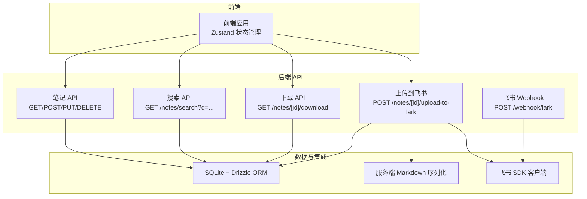
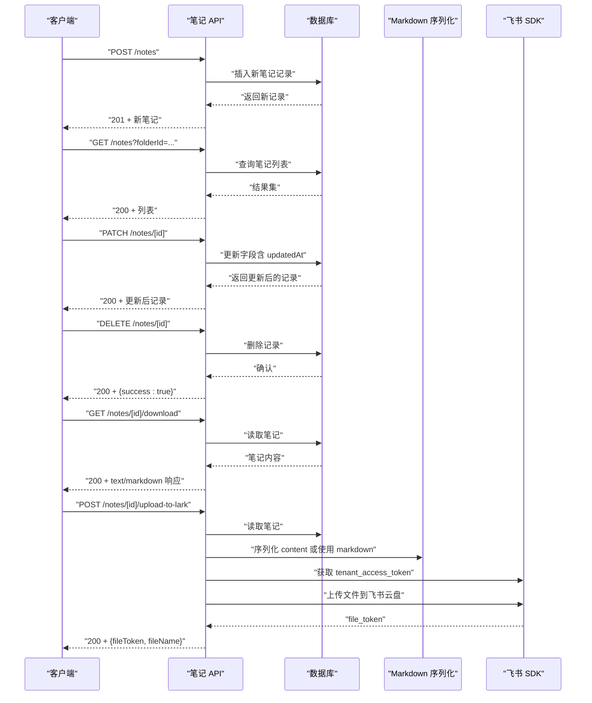
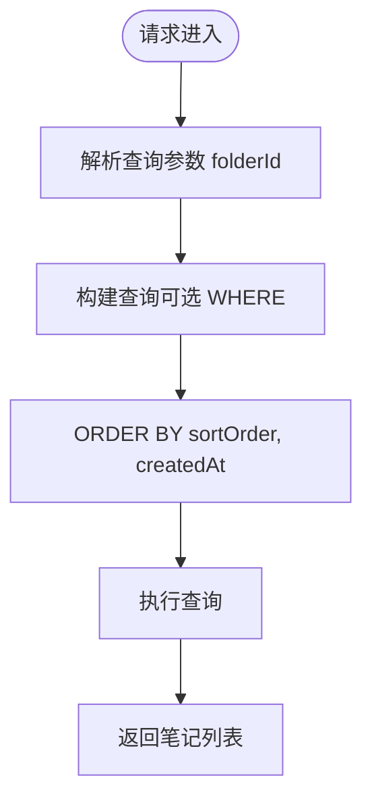
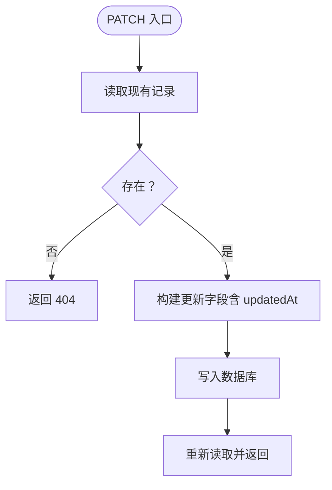
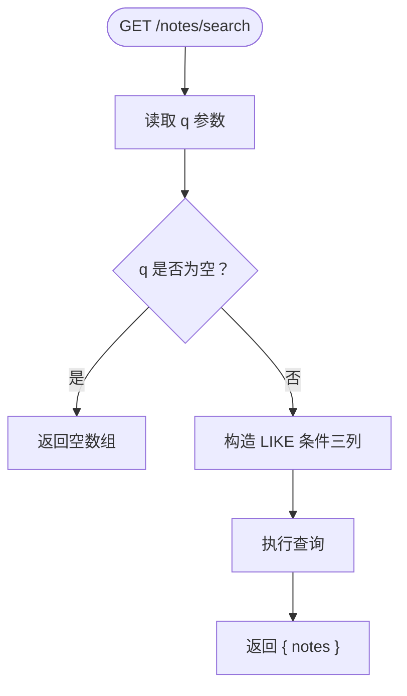
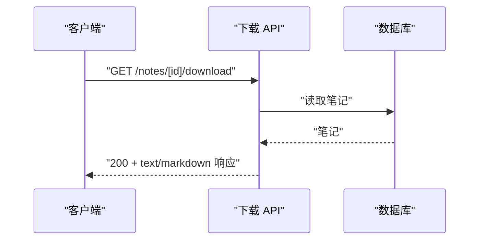
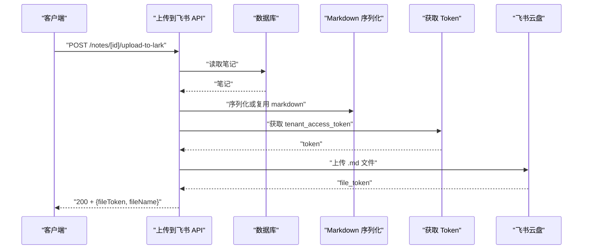
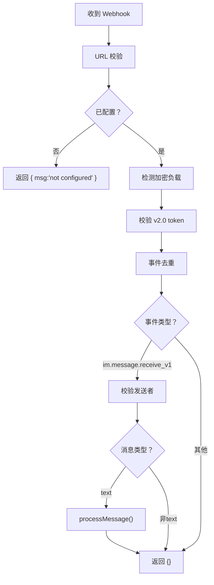
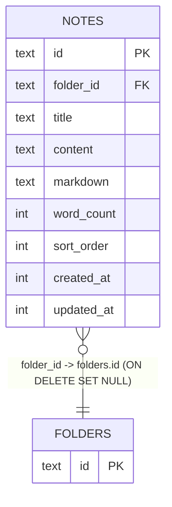

# 笔记 API

<cite>
**本文引用的文件**
- [src/app/api/notes/route.ts](file://src/app/api/notes/route.ts)
- [src/app/api/notes/[id]/route.ts](file://src/app/api/notes/[id]/route.ts)
- [src/app/api/notes/search/route.ts](file://src/app/api/notes/search/route.ts)
- [src/app/api/notes/[id]/download/route.ts](file://src/app/api/notes/[id]/download/route.ts)
- [src/app/api/notes/[id]/upload-to-lark/route.ts](file://src/app/api/notes/[id]/upload-to-lark/route.ts)
- [src/db/schema.ts](file://src/db/schema.ts)
- [src/lib/lark.ts](file://src/lib/lark.ts)
- [src/lib/server-markdown.ts](file://src/lib/server-markdown.ts)
- [src/app/api/webhook/lark/route.ts](file://src/app/api/webhook/lark/route.ts)
- [src/lib/lark-event-handler.ts](file://src/lib/lark-event-handler.ts)
- [src/stores/app-store.ts](file://src/stores/app-store.ts)
- [package.json](file://package.json)
</cite>

## 目录
1. [简介](#简介)
2. [项目结构](#项目结构)
3. [核心组件](#核心组件)
4. [架构总览](#架构总览)
5. [详细组件分析](#详细组件分析)
6. [依赖关系分析](#依赖关系分析)
7. [性能考量](#性能考量)
8. [故障排查指南](#故障排查指南)
9. [结论](#结论)
10. [附录](#附录)

## 简介
本文件为“笔记 API”的完整技术文档，覆盖以下能力与范围：
- 笔记的 CRUD 接口：创建、读取、更新、删除
- 笔记搜索接口：查询参数与过滤选项
- 笔记下载接口：文件格式与传输协议
- 上传到飞书接口：同步机制与冲突处理策略
- 数据模型与元数据：字段定义、版本控制与一致性
- 批量操作与分页查询：实现建议
- 错误处理与异常情况：返回码与日志策略

## 项目结构
笔记 API 位于后端 Next.js 应用中，采用按路由组织的 API 结构，配合 Drizzle ORM 访问 SQLite 数据库。核心目录与文件如下：
- 路由层：按资源划分（notes、folders、files 等）
- 数据层：Drizzle 表定义与索引
- 飞书集成：SDK 客户端、事件处理、Webhook/WS
- 前端集成：Zustand 状态管理调用 API

图表来源
- [src/app/api/notes/route.ts:1-86](file://src/app/api/notes/route.ts#L1-L86)
- [src/app/api/notes/[id]/route.ts](file://src/app/api/notes/[id]/route.ts#L1-L104)
- [src/app/api/notes/search/route.ts:1-44](file://src/app/api/notes/search/route.ts#L1-L44)
- [src/app/api/notes/[id]/download/route.ts](file://src/app/api/notes/[id]/download/route.ts#L1-L33)
- [src/app/api/notes/[id]/upload-to-lark/route.ts](file://src/app/api/notes/[id]/upload-to-lark/route.ts#L1-L186)
- [src/app/api/webhook/lark/route.ts:1-106](file://src/app/api/webhook/lark/route.ts#L1-L106)
- [src/db/schema.ts:27-39](file://src/db/schema.ts#L27-L39)
- [src/lib/lark.ts:1-96](file://src/lib/lark.ts#L1-L96)
- [src/lib/server-markdown.ts:1-138](file://src/lib/server-markdown.ts#L1-L138)

章节来源
- [src/app/api/notes/route.ts:1-86](file://src/app/api/notes/route.ts#L1-L86)
- [src/app/api/notes/[id]/route.ts](file://src/app/api/notes/[id]/route.ts#L1-L104)
- [src/app/api/notes/search/route.ts:1-44](file://src/app/api/notes/search/route.ts#L1-L44)
- [src/app/api/notes/[id]/download/route.ts](file://src/app/api/notes/[id]/download/route.ts#L1-L33)
- [src/app/api/notes/[id]/upload-to-lark/route.ts](file://src/app/api/notes/[id]/upload-to-lark/route.ts#L1-L186)
- [src/db/schema.ts:27-39](file://src/db/schema.ts#L27-L39)

## 核心组件
- 笔记表结构与字段
  - 主键：id
  - 关联：folderId 引用 folders.id（级联删除设为 set null）
  - 标题：title，默认“Untitled”
  - 内容：content（Plate JSON）、markdown（导出/同步）
  - 统计：wordCount
  - 排序：sortOrder
  - 时间戳：createdAt、updatedAt
- 查询与排序
  - 列表查询支持 folderId 参数，root 表示无父文件夹
  - 默认按 sortOrder、createdAt 升序
- 搜索
  - 支持 q 关键词，模糊匹配 title、content、markdown
- 下载
  - 返回 text/markdown，文件名基于标题，自动转义非法字符
- 上传到飞书
  - 依赖 LARK_APP_ID/LARK_APP_SECRET
  - 可选 LARK_FOLDER_TOKEN 指定目标云盘目录
  - 优先使用存储的 markdown，其次序列化 content，最后回退标题
  - 使用 tenant_access_token 上传为 .md 文件

章节来源
- [src/db/schema.ts:27-39](file://src/db/schema.ts#L27-L39)
- [src/app/api/notes/route.ts:10-40](file://src/app/api/notes/route.ts#L10-L40)
- [src/app/api/notes/search/route.ts:6-43](file://src/app/api/notes/search/route.ts#L6-L43)
- [src/app/api/notes/[id]/download/route.ts](file://src/app/api/notes/[id]/download/route.ts#L6-L32)
- [src/app/api/notes/[id]/upload-to-lark/route.ts](file://src/app/api/notes/[id]/upload-to-lark/route.ts#L116-L186)

## 架构总览
下图展示从客户端到数据库与飞书的调用链路。

图表来源
- [src/app/api/notes/route.ts:42-85](file://src/app/api/notes/route.ts#L42-L85)
- [src/app/api/notes/[id]/route.ts](file://src/app/api/notes/[id]/route.ts#L9-L103)
- [src/app/api/notes/[id]/download/route.ts](file://src/app/api/notes/[id]/download/route.ts#L6-L32)
- [src/app/api/notes/[id]/upload-to-lark/route.ts](file://src/app/api/notes/[id]/upload-to-lark/route.ts#L116-L186)
- [src/lib/server-markdown.ts:85-137](file://src/lib/server-markdown.ts#L85-L137)
- [src/lib/lark.ts:8-27](file://src/lib/lark.ts#L8-L27)

## 详细组件分析

### 笔记列表与创建（GET/POST）
- GET /api/notes
  - 查询参数：folderId（可为 "root" 表示顶层）
  - 返回字段：id、folderId、title、wordCount、sortOrder、createdAt、updatedAt
  - 排序：sortOrder 升序，createdAt 升序
- POST /api/notes
  - 请求体可包含 folderId、title、sortOrder
  - 标题长度限制与非法字符校验
  - 默认值：未命名笔记、wordCount=0、createdAt=updatedAt=当前时间戳
  - 成功返回 201

图表来源
- [src/app/api/notes/route.ts:10-40](file://src/app/api/notes/route.ts#L10-L40)

章节来源
- [src/app/api/notes/route.ts:10-85](file://src/app/api/notes/route.ts#L10-L85)

### 笔记详情、更新与删除（GET/PATCH/DELETE）
- GET /api/notes/[id]
  - 不存在返回 404
- PATCH /api/notes/[id]
  - 支持更新 title、content、markdown、wordCount、sortOrder、folderId
  - 标题必填且长度与字符校验
  - 自动更新 updatedAt
- DELETE /api/notes/[id]
  - 不存在返回 404
  - 成功返回 { success: true }

图表来源
- [src/app/api/notes/[id]/route.ts](file://src/app/api/notes/[id]/route.ts#L29-L82)

章节来源
- [src/app/api/notes/[id]/route.ts](file://src/app/api/notes/[id]/route.ts#L9-L103)

### 搜索接口（GET /notes/search）
- 查询参数：q（关键词）
- 过滤条件：title/content/markdown 任一匹配（模糊）
- 返回：notes 数组（同列表字段）

图表来源
- [src/app/api/notes/search/route.ts:6-43](file://src/app/api/notes/search/route.ts#L6-L43)

章节来源
- [src/app/api/notes/search/route.ts:6-43](file://src/app/api/notes/search/route.ts#L6-L43)

### 下载接口（GET /notes/[id]/download）
- 读取笔记，若无 markdown 则以标题生成默认内容
- Content-Type: text/markdown; charset=utf-8
- Content-Disposition: attachment，文件名为标题（非法字符替换为下划线）

图表来源
- [src/app/api/notes/[id]/download/route.ts](file://src/app/api/notes/[id]/download/route.ts#L6-L32)

章节来源
- [src/app/api/notes/[id]/download/route.ts](file://src/app/api/notes/[id]/download/route.ts#L6-L32)

### 上传到飞书（POST /notes/[id]/upload-to-lark）
- 前置检查：是否配置 LARK_APP_ID/LARK_APP_SECRET
- 读取笔记，优先使用 markdown，其次序列化 content，最后回退标题
- 获取 tenant_access_token
- 将 Markdown 转为 ArrayBuffer 并上传至飞书云盘
- 可选指定目标目录（LARK_FOLDER_TOKEN）
- 返回 file_token、fileName 与成功消息

图表来源
- [src/app/api/notes/[id]/upload-to-lark/route.ts](file://src/app/api/notes/[id]/upload-to-lark/route.ts#L116-L186)
- [src/lib/server-markdown.ts:116-137](file://src/lib/server-markdown.ts#L116-L137)
- [src/lib/lark.ts:25-45](file://src/lib/lark.ts#L25-L45)

章节来源
- [src/app/api/notes/[id]/upload-to-lark/route.ts](file://src/app/api/notes/[id]/upload-to-lark/route.ts#L116-L186)
- [src/lib/server-markdown.ts:116-137](file://src/lib/server-markdown.ts#L116-L137)
- [src/lib/lark.ts:25-45](file://src/lib/lark.ts#L25-L45)

### 飞书 Webhook 与事件处理
- Webhook 路由
  - 支持 URL 校验、验证令牌、去重（5 分钟 TTL）、仅处理文本消息
  - 仅处理 im.message.receive_v1 事件
- 事件处理器
  - 解析消息内容，按前缀路由到日记或想法处理
  - 日记：按日期聚合，支持追加
  - 想法：直接创建

图表来源
- [src/app/api/webhook/lark/route.ts:28-105](file://src/app/api/webhook/lark/route.ts#L28-L105)
- [src/lib/lark-event-handler.ts:104-125](file://src/lib/lark-event-handler.ts#L104-L125)

章节来源
- [src/app/api/webhook/lark/route.ts:28-105](file://src/app/api/webhook/lark/route.ts#L28-L105)
- [src/lib/lark-event-handler.ts:28-98](file://src/lib/lark-event-handler.ts#L28-L98)

## 依赖关系分析
- 数据模型
  - notes 表包含主键、外键、标题、内容、统计与时间戳
  - 索引：notes.folder_id
- 外部依赖
  - 飞书 SDK：@larksuiteoapi/node-sdk
  - Markdown 序列化：@platejs/markdown + remark 生态
  - SQLite + Drizzle ORM
- 前端集成
  - Zustand 状态管理通过 fetch 调用 /api/notes 与 /api/folders

图表来源
- [src/db/schema.ts:27-39](file://src/db/schema.ts#L27-L39)

章节来源
- [src/db/schema.ts:27-39](file://src/db/schema.ts#L27-L39)
- [package.json:16-16](file://package.json#L16-L16)

## 性能考量
- 查询优化
  - 列表查询按 sortOrder、createdAt 排序，避免全表扫描
  - 建议在高并发场景下增加数据库连接池与缓存层
- 搜索性能
  - LIKE 模糊匹配可能影响性能，建议对高频关键词建立全文索引或使用专用搜索引擎
- 上传到飞书
  - 上传为小文件（.md），建议异步处理并返回任务 ID，前端轮询状态
- 前端批处理
  - 使用 Promise.all 并发更新/删除，注意错误隔离与回滚策略

## 故障排查指南
- 笔记不存在
  - GET/PATCH/DELETE 返回 404，检查 id 与软删除状态
- 创建/更新失败
  - 标题长度超限或包含非法字符会返回 400
  - 其他异常返回 500，并在服务端打印错误日志
- 上传到飞书失败
  - 确认 LARK_APP_ID/LARK_APP_SECRET 已配置
  - 检查 tenant_access_token 获取与网络连通性
  - 若未配置目标目录，文件将上传到应用资源空间
- Webhook 不生效
  - 确认验证令牌一致、事件类型为 im.message.receive_v1、消息类型为 text
  - 加密消息需配置解密密钥或关闭加密

章节来源
- [src/app/api/notes/[id]/route.ts](file://src/app/api/notes/[id]/route.ts#L18-L41)
- [src/app/api/notes/[id]/upload-to-lark/route.ts](file://src/app/api/notes/[id]/upload-to-lark/route.ts#L121-L126)
- [src/app/api/webhook/lark/route.ts:32-105](file://src/app/api/webhook/lark/route.ts#L32-L105)

## 结论
本笔记 API 提供了完整的 CRUD、搜索、下载与飞书同步能力，数据模型清晰、接口语义明确。建议在生产环境中补充：
- 分页查询与全文检索
- 上传任务异步化与断点续传
- Webhook/WS 的幂等与重试策略
- 前端批量操作的乐观更新与回滚

## 附录

### API 定义与参数说明
- 列表与创建
  - GET /api/notes?folderId=...（可选，root 表示顶层）
  - POST /api/notes（请求体字段：folderId、title、sortOrder）
- 读取、更新、删除
  - GET /api/notes/[id]
  - PATCH /api/notes/[id]（可更新：title、content、markdown、wordCount、sortOrder、folderId）
  - DELETE /api/notes/[id]
- 搜索
  - GET /api/notes/search?q=...
- 下载
  - GET /api/notes/[id]/download
- 上传到飞书
  - POST /api/notes/[id]/upload-to-lark

章节来源
- [src/app/api/notes/route.ts:10-85](file://src/app/api/notes/route.ts#L10-L85)
- [src/app/api/notes/[id]/route.ts](file://src/app/api/notes/[id]/route.ts#L9-L103)
- [src/app/api/notes/search/route.ts:6-43](file://src/app/api/notes/search/route.ts#L6-L43)
- [src/app/api/notes/[id]/download/route.ts](file://src/app/api/notes/[id]/download/route.ts#L6-L32)
- [src/app/api/notes/[id]/upload-to-lark/route.ts](file://src/app/api/notes/[id]/upload-to-lark/route.ts#L116-L186)

### 数据模型字段说明
- notes
  - id：主键
  - folderId：外键，指向 folders.id（删除时置空）
  - title：标题，默认“Untitled”
  - content：编辑器内容（Plate JSON）
  - markdown：导出/同步用 Markdown 文本
  - wordCount：字数统计
  - sortOrder：排序权重
  - createdAt/updatedAt：时间戳

章节来源
- [src/db/schema.ts:27-39](file://src/db/schema.ts#L27-L39)

### 版本控制与一致性
- 无显式版本号字段，通过 updatedAt 与客户端缓存实现“最后修改时间”语义
- 建议引入版本号与冲突解决策略（如 MVCC 或增量合并）

### 批量操作与分页查询实现建议
- 批量
  - 前端使用 Promise.all 并发调用 /api/notes/[id] 的 PATCH/DELETE
  - 后端保持幂等，单条失败不影响其他条目
- 分页
  - 在列表接口增加 limit/offset 或基于游标（cursor）的分页参数
  - 对搜索接口同样适用

### 飞书同步机制与冲突处理
- 同步机制
  - 优先使用存储的 markdown；若无则序列化 content；若仍无则以标题作为默认内容
  - 上传为 .md 文件，文件名为标题
- 冲突处理
  - 当前实现未检测重复文件，建议在上传前查询同名文件并进行覆盖/重命名策略
  - 可结合 file_token 与云端文件元信息做去重

章节来源
- [src/app/api/notes/[id]/upload-to-lark/route.ts](file://src/app/api/notes/[id]/upload-to-lark/route.ts#L145-L169)
- [src/lib/server-markdown.ts:116-137](file://src/lib/server-markdown.ts#L116-L137)

### 前端调用参考
- Zustand 中对笔记的创建、重命名与删除均通过 fetch 调用对应 API，包含错误处理与 UI 回滚逻辑

章节来源
- [src/stores/app-store.ts:263-317](file://src/stores/app-store.ts#L263-L317)