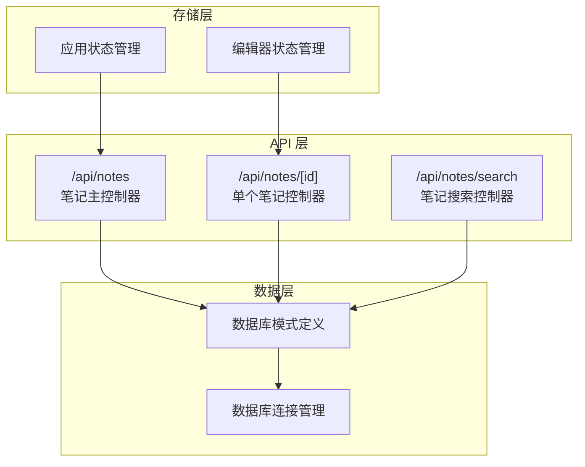
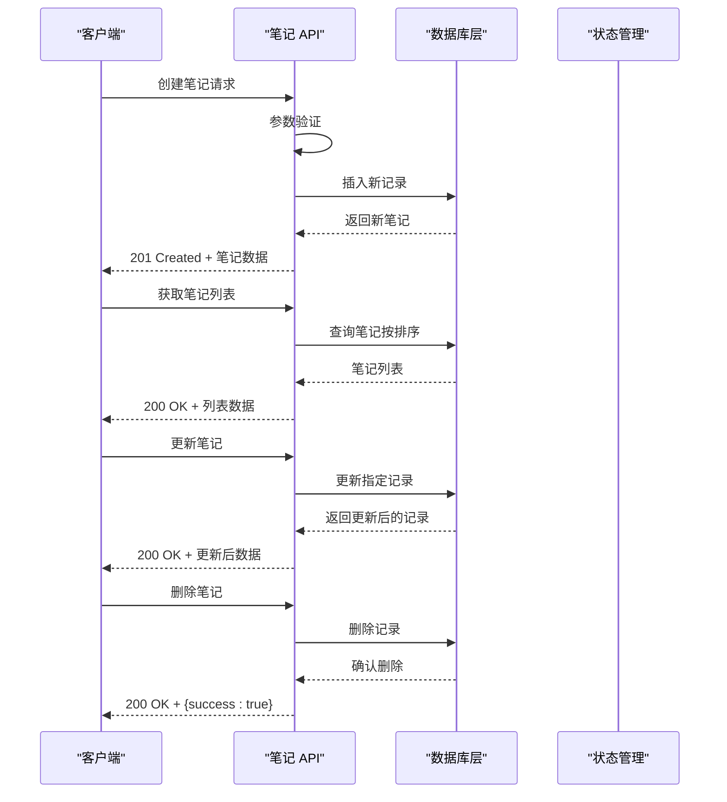
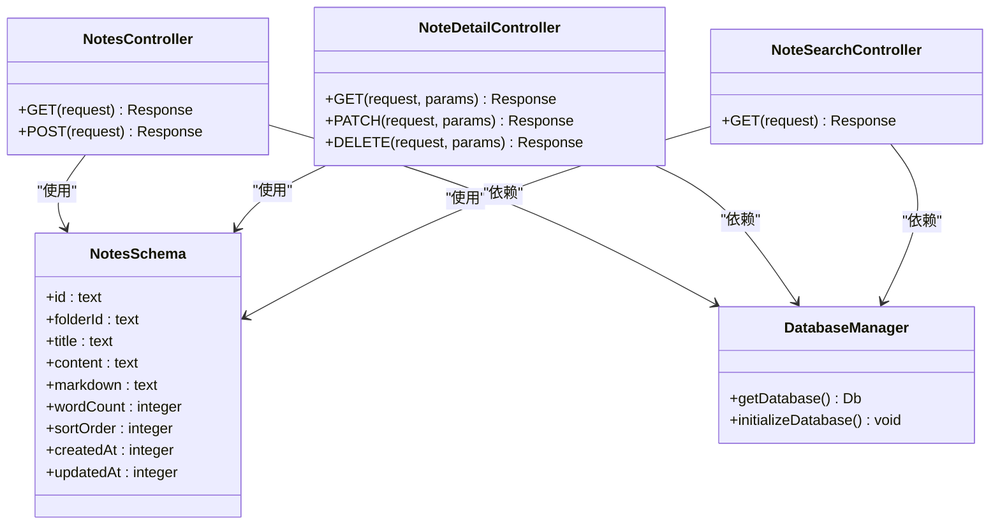
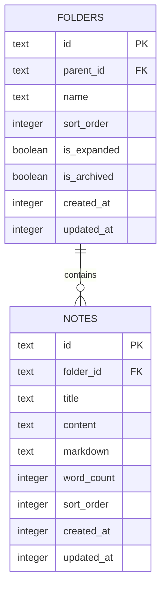

# 笔记 CRUD 操作

<cite>
**本文档引用的文件**
- [src/app/api/notes/route.ts](file://src/app/api/notes/route.ts)
- [src/app/api/notes/[id]/route.ts](file://src/app/api/notes/[id]/route.ts)
- [src/app/api/notes/search/route.ts](file://src/app/api/notes/search/route.ts)
- [src/db/schema.ts](file://src/db/schema.ts)
- [src/db/index.ts](file://src/db/index.ts)
- [src/stores/app-store.ts](file://src/stores/app-store.ts)
- [src/stores/editor-store.ts](file://src/stores/editor-store.ts)
- [src/components/file-tree/note-item.tsx](file://src/components/file-tree/note-item.tsx)
</cite>

## 目录
1. [简介](#简介)
2. [项目结构](#项目结构)
3. [核心组件](#核心组件)
4. [架构概览](#架构概览)
5. [详细组件分析](#详细组件分析)
6. [依赖关系分析](#依赖关系分析)
7. [性能考虑](#性能考虑)
8. [故障排除指南](#故障排除指南)
9. [结论](#结论)

## 简介
本文件详细文档化了 ynote-v2 笔记系统的 CRUD 操作接口，包括：
- 笔记的创建、读取、更新和删除接口实现
- GET 方法的查询参数（folderId）和返回的数据结构
- POST 方法的请求体参数验证规则，包括标题长度限制和非法字符检查
- 按 ID 获取单个笔记的接口规范
- 排序和分页查询的实现方式
- 完整的请求/响应示例和错误处理机制
- 笔记状态管理和版本控制策略

## 项目结构
笔记 API 位于 Next.js App Router 结构中，采用模块化设计：



**图表来源**
- [src/app/api/notes/route.ts:1-86](file://src/app/api/notes/route.ts#L1-L86)
- [src/app/api/notes/[id]/route.ts](file://src/app/api/notes/[id]/route.ts#L1-L104)
- [src/app/api/notes/search/route.ts:1-44](file://src/app/api/notes/search/route.ts#L1-L44)

**章节来源**
- [src/app/api/notes/route.ts:1-86](file://src/app/api/notes/route.ts#L1-L86)
- [src/app/api/notes/[id]/route.ts](file://src/app/api/notes/[id]/route.ts#L1-L104)
- [src/app/api/notes/search/route.ts:1-44](file://src/app/api/notes/search/route.ts#L1-L44)

## 核心组件
笔记系统的核心组件包括：

### 数据模型
笔记表结构支持完整的 CRUD 操作，包含以下关键字段：
- `id`: 主键标识符
- `folderId`: 外键关联到文件夹，支持空值表示根目录
- `title`: 笔记标题，默认值为 "Untitled"
- `content`: 笔记内容（JSON 格式）
- `markdown`: Markdown 格式内容
- `wordCount`: 字数统计
- `sortOrder`: 排序权重
- `createdAt/updatedAt`: 时间戳

### 验证规则
系统实现了严格的输入验证机制：
- 标题长度限制：最多 100 个字符
- 非法字符检查：禁止使用 `/ \ : * ? " < > |` 等特殊字符
- 类型验证：确保数据类型符合预期

**章节来源**
- [src/db/schema.ts:27-39](file://src/db/schema.ts#L27-L39)
- [src/app/api/notes/route.ts:7-8](file://src/app/api/notes/route.ts#L7-L8)
- [src/app/api/notes/[id]/route.ts](file://src/app/api/notes/[id]/route.ts#L6-L7)

## 架构概览
笔记系统的整体架构采用分层设计：



**图表来源**
- [src/app/api/notes/route.ts:42-85](file://src/app/api/notes/route.ts#L42-L85)
- [src/app/api/notes/[id]/route.ts](file://src/app/api/notes/[id]/route.ts#L9-L103)

## 详细组件分析

### GET /api/notes - 笔记列表查询
该接口支持按文件夹过滤和排序功能：

#### 查询参数
- `folderId` (可选): 文件夹 ID 或 "root"
  - "root": 返回根目录下的笔记（folderId 为 NULL）
  - 具体 ID: 返回指定文件夹下的笔记
  - 未提供: 返回所有笔记

#### 排序规则
- 首先按 `sortOrder` 升序排列
- 然后按 `createdAt` 升序排列

#### 响应数据结构
```json
[
  {
    "id": "string",
    "folderId": "string|null",
    "title": "string",
    "wordCount": number,
    "sortOrder": number,
    "createdAt": number,
    "updatedAt": number
  }
]
```

**章节来源**
- [src/app/api/notes/route.ts:10-40](file://src/app/api/notes/route.ts#L10-L40)

### POST /api/notes - 创建笔记
该接口负责创建新的笔记记录：

#### 请求体参数
- `folderId` (可选): 目标文件夹 ID，省略时为根目录
- `title` (可选): 笔记标题，默认 "未命名笔记"
- `sortOrder` (可选): 排序权重，默认 0

#### 验证规则
1. 标题长度验证：不超过 100 个字符
2. 非法字符检查：禁止使用 `/ \ : * ? " < > |` 
3. 自动清理：去除标题首尾空白字符

#### 响应
- 成功：201 Created + 新创建的笔记信息
- 失败：400 Bad Request 或 500 Internal Server Error

**章节来源**
- [src/app/api/notes/route.ts:42-85](file://src/app/api/notes/route.ts#L42-L85)

### GET /api/notes/[id] - 获取单个笔记
该接口用于获取指定 ID 的完整笔记信息：

#### 路径参数
- `id`: 笔记唯一标识符

#### 响应数据结构
```json
{
  "id": "string",
  "folderId": "string|null",
  "title": "string",
  "content": "string|null",
  "markdown": "string|null",
  "wordCount": number,
  "sortOrder": number,
  "createdAt": number,
  "updatedAt": number
}
```

#### 错误处理
- 404 Not Found: 当笔记不存在时返回错误信息

**章节来源**
- [src/app/api/notes/[id]/route.ts](file://src/app/api/notes/[id]/route.ts#L9-L27)

### PATCH /api/notes/[id] - 更新笔记
该接口支持对笔记进行部分更新：

#### 支持更新的字段
- `title`: 笔记标题（必填且非空）
- `content`: 笔记内容
- `markdown`: Markdown 内容
- `wordCount`: 字数统计
- `sortOrder`: 排序权重
- `folderId`: 文件夹 ID（可设为 null 表示根目录）

#### 更新流程
1. 验证目标笔记存在性
2. 应用所有有效的更新字段
3. 自动更新 `updatedAt` 时间戳
4. 返回更新后的完整记录

**章节来源**
- [src/app/api/notes/[id]/route.ts](file://src/app/api/notes/[id]/route.ts#L29-L82)

### DELETE /api/notes/[id] - 删除笔记
该接口负责删除指定的笔记记录：

#### 删除流程
1. 验证目标笔记存在性
2. 执行删除操作
3. 返回删除成功确认

#### 注意事项
- 删除操作不可撤销
- 关联的附件会级联删除

**章节来源**
- [src/app/api/notes/[id]/route.ts](file://src/app/api/notes/[id]/route.ts#L84-L103)

### GET /api/notes/search - 搜索笔记
该接口提供全文搜索功能：

#### 查询参数
- `q`: 搜索关键词

#### 搜索范围
- 标题 (`title`)
- 内容 (`content`)  
- Markdown 内容 (`markdown`)

#### 响应格式
```json
{
  "notes": [
    {
      "id": "string",
      "folderId": "string|null", 
      "title": "string",
      "wordCount": number,
      "sortOrder": number,
      "createdAt": number,
      "updatedAt": number
    }
  ]
}
```

**章节来源**
- [src/app/api/notes/search/route.ts:6-43](file://src/app/api/notes/search/route.ts#L6-L43)

## 依赖关系分析



**图表来源**
- [src/app/api/notes/route.ts:1-86](file://src/app/api/notes/route.ts#L1-L86)
- [src/app/api/notes/[id]/route.ts](file://src/app/api/notes/[id]/route.ts#L1-L104)
- [src/app/api/notes/search/route.ts:1-44](file://src/app/api/notes/search/route.ts#L1-L44)
- [src/db/schema.ts:27-39](file://src/db/schema.ts#L27-L39)

### 数据库关系
笔记与文件夹之间存在外键关系，支持级联删除策略：



**图表来源**
- [src/db/schema.ts:10-39](file://src/db/schema.ts#L10-L39)

**章节来源**
- [src/db/schema.ts:27-39](file://src/db/schema.ts#L27-L39)

## 性能考虑
笔记系统在设计时考虑了以下性能优化：

### 数据库索引
- `idx_notes_folder_id`: 加速按文件夹查询
- `idx_folders_parent_id`: 加速文件夹层级查询

### 查询优化
- 使用 `orderBy(asc(sortOrder), asc(createdAt))` 实现稳定的排序
- 仅选择必要的字段，避免 SELECT *
- 使用参数化查询防止 SQL 注入

### 缓存策略
前端实现了智能缓存机制：
- 编辑器内容缓存，减少重复 API 调用
- LRU 缓存淘汰策略，控制内存使用
- 缓存失效机制，确保数据一致性

**章节来源**
- [src/db/index.ts:73-75](file://src/db/index.ts#L73-L75)
- [src/stores/editor-store.ts:112-142](file://src/stores/editor-store.ts#L112-L142)

## 故障排除指南

### 常见错误及解决方案

#### 400 Bad Request
可能原因：
- 标题超过 100 个字符
- 标题包含非法字符
- 更新时标题为空

解决方法：
- 检查输入长度和字符合法性
- 确保更新操作中的标题非空

#### 404 Not Found
可能原因：
- 访问不存在的笔记 ID
- 文件夹 ID 无效

解决方法：
- 验证资源 ID 的有效性
- 检查文件夹是否存在

#### 500 Internal Server Error
可能原因：
- 数据库连接异常
- 查询执行失败
- 服务器内部错误

解决方法：
- 检查数据库状态
- 查看服务器日志
- 重试操作

### 调试建议
1. 启用详细日志记录
2. 使用浏览器开发者工具监控网络请求
3. 检查数据库连接状态
4. 验证数据完整性约束

**章节来源**
- [src/app/api/notes/route.ts:36-38](file://src/app/api/notes/route.ts#L36-L38)
- [src/app/api/notes/[id]/route.ts](file://src/app/api/notes/[id]/route.ts#L18-L26)

## 结论
ynote-v2 的笔记 CRUD 操作系统具有以下特点：

### 设计优势
- **清晰的 API 规范**: 标准化的 RESTful 接口设计
- **严格的数据验证**: 多层次的输入验证机制
- **灵活的查询能力**: 支持按文件夹过滤和全文搜索
- **完善的错误处理**: 统一的错误响应格式

### 技术特色
- **现代化架构**: 基于 Next.js App Router 的模块化设计
- **高性能实现**: 优化的数据库查询和缓存策略
- **用户体验**: 即时反馈和状态管理

### 扩展建议
1. 添加分页支持（limit/offset）
2. 实现更复杂的搜索过滤
3. 增加笔记版本历史记录
4. 支持批量操作

该系统为用户提供了完整的笔记管理解决方案，具备良好的可维护性和扩展性。