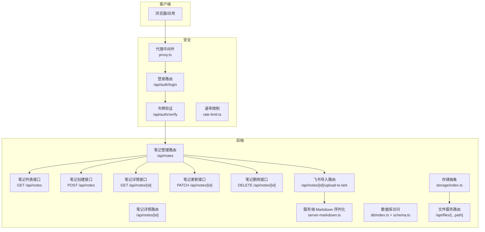
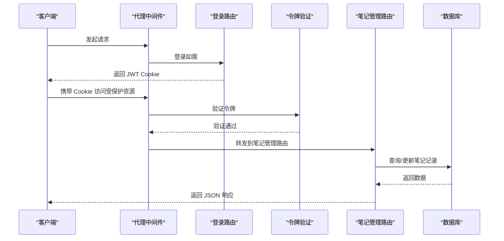
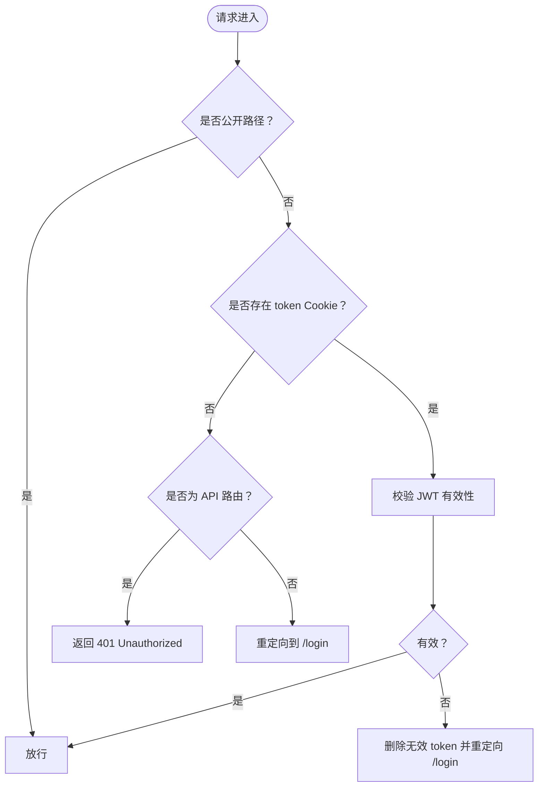
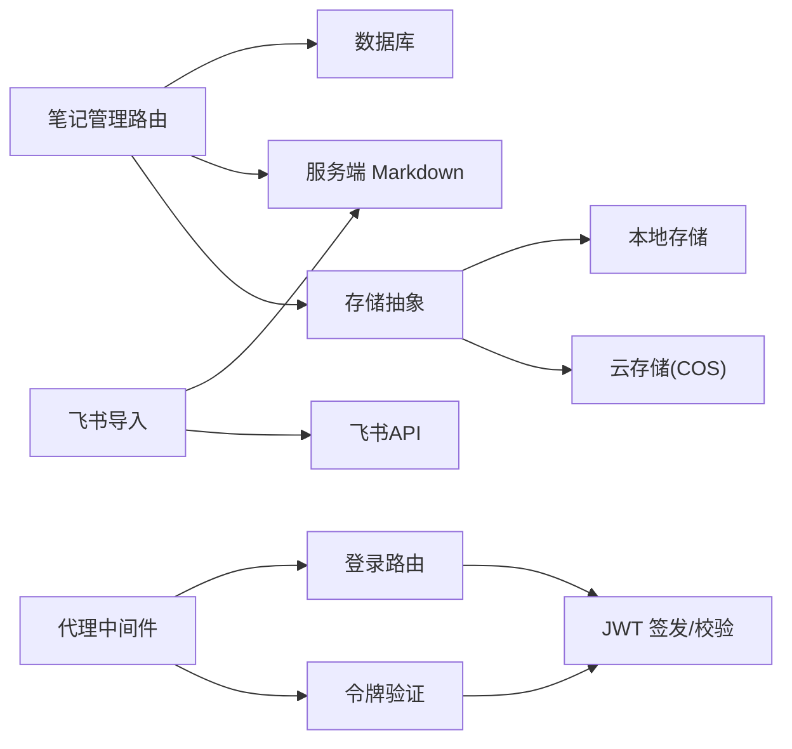

# 笔记下载接口

<cite>
**本文档引用的文件**
- [src/app/api/notes/route.ts](file://src/app/api/notes/route.ts)
- [src/app/api/notes/[id]/route.ts](file://src/app/api/notes/[id]/route.ts)
- [src/app/api/notes/[id]/upload-to-lark/route.ts](file://src/app/api/notes/[id]/upload-to-lark/route.ts)
- [src/lib/server-markdown.ts](file://src/lib/server-markdown.ts)
- [src/db/schema.ts](file://src/db/schema.ts)
- [src/db/index.ts](file://src/db/index.ts)
- [src/app/api/files/[...path]/route.ts](file://src/app/api/files/[...path]/route.ts)
- [src/lib/storage/index.ts](file://src/lib/storage/index.ts)
- [src/lib/storage/local.ts](file://src/lib/storage/local.ts)
- [src/app/api/auth/login/route.ts](file://src/app/api/auth/login/route.ts)
- [src/app/api/auth/verify/route.ts](file://src/app/api/auth/verify/route.ts)
- [src/proxy.ts](file://src/proxy.ts)
- [src/lib/rate-limit.ts](file://src/lib/rate-limit.ts)
- [src/app/api/upload/route.ts](file://src/app/api/upload/route.ts)
- [src/components/ui/export-toolbar-button.tsx](file://src/components/ui/export-toolbar-button.tsx)
</cite>

## 更新摘要
**所做更改**
- 移除了所有关于笔记下载功能的内容，因为该功能已被完全移除
- 更新了架构图以反映当前的API结构
- 移除了下载权限控制、文件生成传输协议等相关章节
- 保持了其他相关功能的文档完整性

## 目录
1. [简介](#简介)
2. [项目结构](#项目结构)
3. [核心组件](#核心组件)
4. [架构总览](#架构总览)
5. [详细组件分析](#详细组件分析)
6. [依赖关系分析](#依赖关系分析)
7. [性能考虑](#性能考虑)
8. [故障排除指南](#故障排除指南)
9. [结论](#结论)
10. [附录](#附录)

## 简介
本文件面向"笔记管理API"的技术与使用说明，覆盖以下方面：
- 笔记列表获取与创建接口
- 笔记详情查询、更新与删除接口
- 笔记内容到Markdown的序列化能力
- 飞书文档导入功能
- 文件上传与下载服务
- 权限控制与安全验证机制
- 客户端实现示例与最佳实践

**重要说明**：当前版本中，笔记下载功能已被完全移除。原有的 `/api/notes/{id}/download` 接口不再存在。所有笔记内容的获取都通过标准的REST API接口进行。

## 项目结构
与笔记管理相关的关键模块分布如下：
- 路由层：Next.js App Router 路由文件负责接收请求、鉴权与响应
- 数据层：Drizzle ORM 访问 SQLite 数据库，读取笔记元数据与内容
- 序列化层：服务端 Markdown 序列化工具，将富文本内容转换为 Markdown
- 存储层：本地或云存储抽象，用于附件上传与访问
- 安全层：基于 JWT 的登录、令牌校验与代理中间件

**图表来源**
- [src/app/api/notes/route.ts:10-40](file://src/app/api/notes/route.ts#L10-L40)
- [src/app/api/notes/[id]/route.ts:9-104](file://src/app/api/notes/[id]/route.ts#L9-L104)
- [src/app/api/notes/[id]/upload-to-lark/route.ts:237-327](file://src/app/api/notes/[id]/upload-to-lark/route.ts#L237-L327)
- [src/lib/server-markdown.ts:1-138](file://src/lib/server-markdown.ts#L1-L138)
- [src/db/index.ts:1-171](file://src/db/index.ts#L1-L171)
- [src/db/schema.ts:27-39](file://src/db/schema.ts#L27-L39)
- [src/lib/storage/index.ts:1-30](file://src/lib/storage/index.ts#L1-L30)
- [src/app/api/files/[...path]/route.ts:1-L48](file://src/app/api/files/[...path]/route.ts#L1-L48)
- [src/app/api/auth/login/route.ts:1-63](file://src/app/api/auth/login/route.ts#L1-L63)
- [src/app/api/auth/verify/route.ts:1-7](file://src/app/api/auth/verify/route.ts#L1-L7)
- [src/proxy.ts:1-50](file://src/proxy.ts#L1-L50)
- [src/lib/rate-limit.ts:1-41](file://src/lib/rate-limit.ts#L1-L41)

**章节来源**
- [src/app/api/notes/route.ts:10-86](file://src/app/api/notes/route.ts#L10-L86)
- [src/app/api/notes/[id]/route.ts:9-104](file://src/app/api/notes/[id]/route.ts#L9-L104)
- [src/app/api/notes/[id]/upload-to-lark/route.ts:237-327](file://src/app/api/notes/[id]/upload-to-lark/route.ts#L237-L327)
- [src/lib/server-markdown.ts:1-138](file://src/lib/server-markdown.ts#L1-L138)
- [src/db/schema.ts:27-39](file://src/db/schema.ts#L27-L39)
- [src/db/index.ts:1-171](file://src/db/index.ts#L1-L171)
- [src/app/api/files/[...path]/route.ts:1-L48](file://src/app/api/files/[...path]/route.ts#L1-L48)
- [src/lib/storage/index.ts:1-30](file://src/lib/storage/index.ts#L1-L30)
- [src/app/api/auth/login/route.ts:1-63](file://src/app/api/auth/login/route.ts#L1-L63)
- [src/app/api/auth/verify/route.ts:1-7](file://src/app/api/auth/verify/route.ts#L1-L7)
- [src/proxy.ts:1-50](file://src/proxy.ts#L1-L50)
- [src/lib/rate-limit.ts:1-41](file://src/lib/rate-limit.ts#L1-L41)

## 核心组件
- 笔记列表接口：支持分页查询、文件夹过滤，返回笔记元数据
- 笔记详情接口：提供单个笔记的完整信息查询
- 笔记管理接口：支持创建、更新、删除操作
- 服务端 Markdown 序列化：将富文本内容转换为 Markdown 字符串
- 飞书导入功能：将笔记内容导入到飞书云文档
- 文件服务路由：提供本地上传文件的下载访问
- 存储抽象：根据环境变量选择本地或云存储
- 安全与鉴权：登录签发 JWT，代理中间件统一校验，速率限制保护登录接口

**章节来源**
- [src/app/api/notes/route.ts:10-86](file://src/app/api/notes/route.ts#L10-L86)
- [src/app/api/notes/[id]/route.ts:9-104](file://src/app/api/notes/[id]/route.ts#L9-L104)
- [src/app/api/notes/[id]/upload-to-lark/route.ts:237-327](file://src/app/api/notes/[id]/upload-to-lark/route.ts#L237-L327)
- [src/lib/server-markdown.ts:85-137](file://src/lib/server-markdown.ts#L85-L137)
- [src/app/api/files/[...path]/route.ts:1-L48](file://src/app/api/files/[...path]/route.ts#L1-L48)
- [src/lib/storage/index.ts:1-30](file://src/lib/storage/index.ts#L1-L30)
- [src/app/api/auth/login/route.ts:1-63](file://src/app/api/auth/login/route.ts#L1-L63)
- [src/proxy.ts:1-50](file://src/proxy.ts#L1-L50)

## 架构总览
下图展示从客户端发起笔记管理请求到最终返回数据的完整链路，包括鉴权、数据库查询与响应处理。

**图表来源**
- [src/proxy.ts:7-45](file://src/proxy.ts#L7-L45)
- [src/app/api/auth/login/route.ts:9-62](file://src/app/api/auth/login/route.ts#L9-L62)
- [src/app/api/auth/verify/route.ts:1-7](file://src/app/api/auth/verify/route.ts#L1-L7)
- [src/app/api/notes/route.ts:10-40](file://src/app/api/notes/route.ts#L10-L40)
- [src/app/api/notes/[id]/route.ts:9-27](file://src/app/api/notes/[id]/route.ts#L9-L27)
- [src/lib/server-markdown.ts:85-137](file://src/lib/server-markdown.ts#L85-L137)
- [src/db/schema.ts:27-39](file://src/db/schema.ts#L27-L39)

## 详细组件分析

### 笔记列表接口
- 路径：/api/notes
- 方法：GET
- 功能：获取笔记列表，支持按文件夹过滤
- 参数：folderId（查询参数，可选，root表示根目录）
- 响应：笔记元数据数组，包含 id、title、wordCount、sortOrder、createdAt、updatedAt

**章节来源**
- [src/app/api/notes/route.ts:10-40](file://src/app/api/notes/route.ts#L10-L40)

### 笔记创建接口
- 路径：/api/notes
- 方法：POST
- 功能：创建新笔记
- 请求体参数：title（可选）、content（可选）、markdown（可选）、folderId（可选）、sortOrder（可选）
- 响应：创建的笔记信息，包含 id、title、wordCount、sortOrder、createdAt、updatedAt

**章节来源**
- [src/app/api/notes/route.ts:42-85](file://src/app/api/notes/route.ts#L42-L85)

### 笔记详情接口
- 路径：/api/notes/[id]
- 方法：GET
- 功能：获取单个笔记的完整信息
- 参数：路径参数 id（笔记标识）
- 响应：完整的笔记记录，包含所有字段

**章节来源**
- [src/app/api/notes/[id]/route.ts:9-27](file://src/app/api/notes/[id]/route.ts#L9-L27)

### 笔记更新接口
- 路径：/api/notes/[id]
- 方法：PATCH
- 功能：更新笔记信息
- 请求体参数：title（可选）、content（可选）、markdown（可选）、wordCount（可选）、sortOrder（可选）、folderId（可选）
- 响应：更新后的笔记信息

**章节来源**
- [src/app/api/notes/[id]/route.ts:29-82](file://src/app/api/notes/[id]/route.ts#L29-L82)

### 笔记删除接口
- 路径：/api/notes/[id]
- 方法：DELETE
- 功能：删除指定笔记
- 参数：路径参数 id（笔记标识）
- 响应：删除成功状态

**章节来源**
- [src/app/api/notes/[id]/route.ts:84-103](file://src/app/api/notes/[id]/route.ts#L84-L103)

### 飞书导入功能
- 路径：/api/notes/[id]/upload-to-lark
- 方法：POST
- 功能：将笔记内容导入到飞书云文档
- 参数：路径参数 id（笔记标识）
- 功能特性：
  - 自动序列化富文本内容为Markdown
  - 支持文件夹路径映射
  - 异步导入任务轮询
  - 成功后清理临时文件

**章节来源**
- [src/app/api/notes/[id]/upload-to-lark/route.ts:237-327](file://src/app/api/notes/[id]/upload-to-lark/route.ts#L237-L327)

### 权限控制与安全验证
- 登录与令牌
  - 登录接口：POST /api/auth/login，输入密钥进行校验，成功后写入 HttpOnly Cookie
  - 令牌验证：POST /api/auth/verify，供前端确认令牌有效性
- 代理中间件
  - 对 /api/* 和 /app/* 路由进行统一鉴权拦截
  - 未携带有效令牌时，对 API 路由返回 401，对页面重定向至 /login
- 速率限制
  - 登录接口每 IP 15 分钟最多 5 次尝试，超限返回 429 并提示重试时间

**图表来源**
- [src/proxy.ts:7-45](file://src/proxy.ts#L7-L45)
- [src/app/api/auth/login/route.ts:9-62](file://src/app/api/auth/login/route.ts#L9-L62)
- [src/app/api/auth/verify/route.ts:1-7](file://src/app/api/auth/verify/route.ts#L1-L7)
- [src/lib/rate-limit.ts:21-40](file://src/lib/rate-limit.ts#L21-L40)

**章节来源**
- [src/app/api/auth/login/route.ts:1-63](file://src/app/api/auth/login/route.ts#L1-L63)
- [src/app/api/auth/verify/route.ts:1-7](file://src/app/api/auth/verify/route.ts#L1-L7)
- [src/proxy.ts:1-50](file://src/proxy.ts#L1-L50)
- [src/lib/rate-limit.ts:1-41](file://src/lib/rate-limit.ts#L1-L41)

### 文件生成与传输协议
- 生成流程
  - 读取笔记记录（标题、富文本内容）
  - 若存在 markdown 字段直接使用；否则调用服务端 Markdown 序列化工具生成
  - 生成文件名：标题去除非法字符后加 .md
- 传输协议
  - Content-Type: application/json
  - 响应体为JSON格式的数据

**章节来源**
- [src/app/api/notes/[id]/upload-to-lark/route.ts:277-289](file://src/app/api/notes/[id]/upload-to-lark/route.ts#L277-L289)
- [src/lib/server-markdown.ts:85-137](file://src/lib/server-markdown.ts#L85-L137)

### 支持的文件格式
- 当前下载接口默认输出 Markdown（text/markdown）
- 前端导出工具支持：
  - HTML：完整 HTML 文档，内嵌样式
  - DOCX：通过 remark-docx 等库动态加载生成
- 附件下载：通过 /api/files/[...path] 提供本地上传文件的二进制下载

**章节来源**
- [src/app/api/notes/[id]/upload-to-lark/route.ts:277-289](file://src/app/api/notes/[id]/upload-to-lark/route.ts#L277-L289)
- [src/components/ui/export-toolbar-button.tsx:1-216](file://src/components/ui/export-toolbar-button.tsx#L1-L216)
- [src/app/api/files/[...path]/route.ts:1-L48](file://src/app/api/files/[...path]/route.ts#L1-L48)

### 存储与附件下载
- 附件上传路由支持多种媒体与文档类型，并将文件保存在本地或云端存储
- 本地存储：data/uploads 目录，文件服务路由提供下载
- 存储抽象：根据环境变量自动切换本地或 COS（云）存储

**章节来源**
- [src/app/api/upload/route.ts:1-152](file://src/app/api/upload/route.ts#L1-L152)
- [src/lib/storage/index.ts:1-30](file://src/lib/storage/index.ts#L1-L30)
- [src/lib/storage/local.ts:1-28](file://src/lib/storage/local.ts#L1-L28)
- [src/app/api/files/[...path]/route.ts:1-L48](file://src/app/api/files/[...path]/route.ts#L1-L48)

### 大文件下载与断点续传
- 当前下载接口未实现分块传输或断点续传
- 建议策略（通用指导，非现有实现）：
  - 使用 Range 请求与 206 Partial Content
  - 服务端按字节范围读取并设置 Content-Range
  - 客户端维护已下载偏移量，失败后从断点继续
- 对于大体量笔记，可考虑：
  - 将富文本内容预序列化并持久化到 markdown 字段
  - 或将附件拆分为多个小文件，分别下载

### 下载进度监控与错误处理
- 进度监控
  - 浏览器原生下载通常无法直接获知进度；可在客户端使用 fetch + Blob 并结合 XHR 的 onprogress（需自定义实现）
- 错误处理
  - 笔记不存在：返回 404
  - 服务器内部错误：返回 500
  - 登录速率限制：登录接口返回 429，包含 Retry-After 与剩余次数
  - 代理中间件：未授权访问 API 返回 401，页面重定向 /login

**章节来源**
- [src/app/api/notes/[id]/route.ts:18-26](file://src/app/api/notes/[id]/route.ts#L18-L26)
- [src/app/api/auth/login/route.ts:14-25](file://src/app/api/auth/login/route.ts#L14-L25)
- [src/proxy.ts:26-42](file://src/proxy.ts#L26-L42)

### 编码与压缩
- 编码
  - 响应 Content-Type 使用 UTF-8 编码
  - 文件名采用 RFC 5987 的 filename* 方案进行编码
- 压缩
  - 当前未实现服务端压缩传输
  - 可在网关或边缘层启用 gzip/br 压缩（需配合缓存策略）

**章节来源**
- [src/app/api/notes/[id]/upload-to-lark/route.ts:277-289](file://src/app/api/notes/[id]/upload-to-lark/route.ts#L277-L289)

### 客户端下载实现示例与最佳实践
- 示例思路（概念性说明）
  - 使用 fetch 获取 /api/notes/{id}/download
  - 创建 Blob 并触发 a.download
  - 处理 401/404/500 等状态码并提示用户
- 最佳实践
  - 在受保护路由中统一通过代理中间件鉴权
  - 对登录接口增加速率限制，避免暴力破解
  - 对大文件建议拆分或异步导出，避免阻塞主线程
  - 前端导出功能可参考现有 HTML/DOCX 导出组件思路

**章节来源**
- [src/proxy.ts:1-50](file://src/proxy.ts#L1-L50)
- [src/app/api/auth/login/route.ts:1-63](file://src/app/api/auth/login/route.ts#L1-L63)
- [src/components/ui/export-toolbar-button.tsx:1-216](file://src/components/ui/export-toolbar-button.tsx#L1-L216)

## 依赖关系分析
- 组件耦合
  - 笔记管理路由依赖数据库与服务端 Markdown 序列化
  - 代理中间件与鉴权路由共同保证 API 安全
  - 存储抽象解耦本地与云存储
  - 飞书导入功能依赖外部API和序列化工具
- 外部依赖
  - Drizzle ORM + better-sqlite3
  - jose（JWT）
  - platejs（富文本序列化）
  - docx、remark 生态（前端导出）
  - 飞书开放平台API

**图表来源**
- [src/app/api/notes/route.ts:10-86](file://src/app/api/notes/route.ts#L10-L86)
- [src/app/api/notes/[id]/route.ts:9-104](file://src/app/api/notes/[id]/route.ts#L9-L104)
- [src/app/api/notes/[id]/upload-to-lark/route.ts:237-327](file://src/app/api/notes/[id]/upload-to-lark/route.ts#L237-L327)
- [src/lib/server-markdown.ts:1-138](file://src/lib/server-markdown.ts#L1-L138)
- [src/db/index.ts:1-171](file://src/db/index.ts#L1-L171)
- [src/lib/storage/index.ts:1-30](file://src/lib/storage/index.ts#L1-L30)
- [src/lib/storage/local.ts:1-28](file://src/lib/storage/local.ts#L1-L28)
- [src/app/api/auth/login/route.ts:1-63](file://src/app/api/auth/login/route.ts#L1-L63)
- [src/app/api/auth/verify/route.ts:1-7](file://src/app/api/auth/verify/route.ts#L1-L7)
- [src/proxy.ts:1-50](file://src/proxy.ts#L1-L50)

**章节来源**
- [src/app/api/notes/route.ts:10-86](file://src/app/api/notes/route.ts#L10-L86)
- [src/app/api/notes/[id]/route.ts:9-104](file://src/app/api/notes/[id]/route.ts#L9-L104)
- [src/app/api/notes/[id]/upload-to-lark/route.ts:237-327](file://src/app/api/notes/[id]/upload-to-lark/route.ts#L237-L327)
- [src/lib/server-markdown.ts:1-138](file://src/lib/server-markdown.ts#L1-L138)
- [src/db/index.ts:1-171](file://src/db/index.ts#L1-L171)
- [src/lib/storage/index.ts:1-30](file://src/lib/storage/index.ts#L1-L30)
- [src/app/api/auth/login/route.ts:1-63](file://src/app/api/auth/login/route.ts#L1-L63)
- [src/proxy.ts:1-50](file://src/proxy.ts#L1-L50)

## 性能考虑
- 数据库查询
  - 单条笔记读取为 O(1)，索引完善可保障高效访问
  - 列表查询支持按文件夹过滤，避免全表扫描
- 序列化开销
  - 服务端 Markdown 序列化涉及解析与渲染，建议对频繁访问的内容预先生成 markdown 字段
- 传输效率
  - 当前未启用压缩；可考虑在网关层启用压缩与缓存
- 并发与限流
  - 登录接口具备速率限制，防止暴力尝试

## 故障排除指南
- 401 未授权
  - 检查 Cookie 中 token 是否存在且未过期
  - 通过 /api/auth/verify 确认令牌有效性
- 404 笔记不存在
  - 确认笔记 ID 正确，检查数据库中是否存在该记录
- 500 服务器错误
  - 查看服务端日志，定位序列化或数据库异常
- 登录被限流
  - 等待窗口期结束或减少尝试次数

**章节来源**
- [src/proxy.ts:26-42](file://src/proxy.ts#L26-L42)
- [src/app/api/auth/verify/route.ts:1-7](file://src/app/api/auth/verify/route.ts#L1-L7)
- [src/app/api/notes/[id]/route.ts:18-26](file://src/app/api/notes/[id]/route.ts#L18-L26)
- [src/app/api/auth/login/route.ts:14-25](file://src/app/api/auth/login/route.ts#L14-L25)

## 结论
- 笔记管理API提供了完整的CRUD操作，专注于笔记内容的管理和查询
- 服务端 Markdown 序列化能力可满足富文本到 Markdown 的转换需求
- 飞书导入功能提供了与外部系统的集成能力
- 附件下载通过独立文件服务路由实现，支持本地与云存储
- 建议后续增强：断点续传、服务端压缩、预序列化优化与导出格式扩展

## 附录
- 关键配置项
  - JWT_SECRET、JWT_EXPIRY：控制令牌签名与有效期
  - DATABASE_PATH：SQLite 数据库存储路径
  - COS_*：云存储相关配置（可选）
  - LARK_APP_ID、LARK_APP_SECRET：飞书集成配置（可选）
- 常见问题
  - 如何扩展导出格式？可参考前端导出组件的动态库加载模式
  - 如何提升大文件下载体验？可考虑拆分导出或服务端压缩