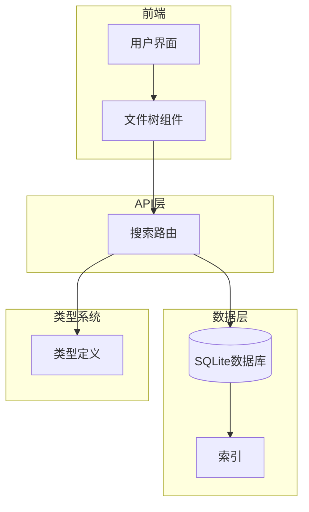
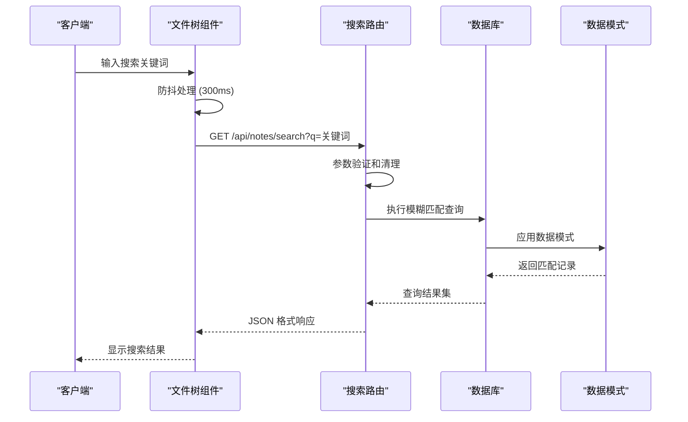
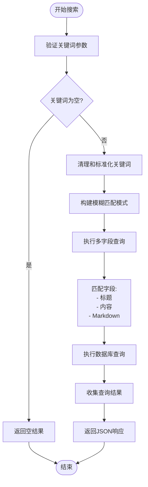
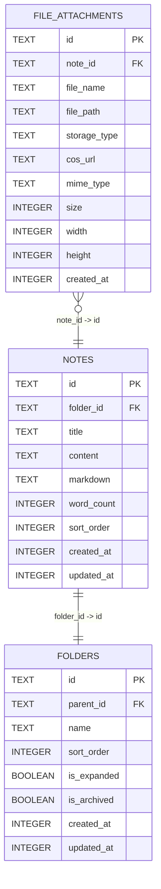
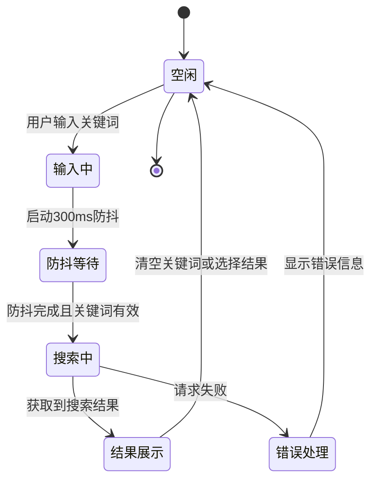
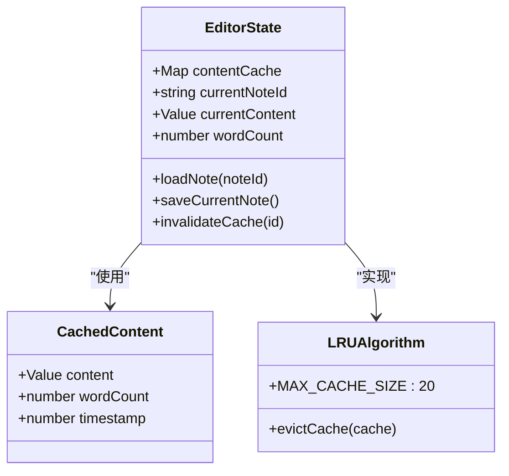
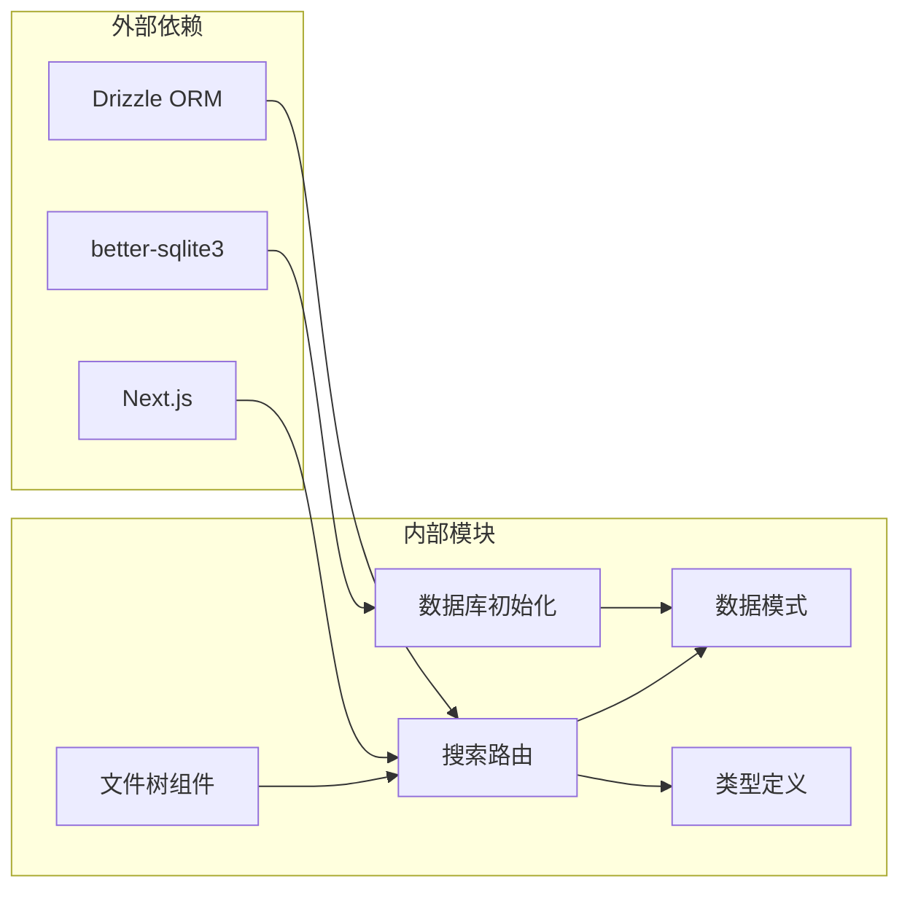

# 笔记搜索功能

<cite>
**本文档引用的文件**
- [src/app/api/notes/search/route.ts](file://src/app/api/notes/search/route.ts)
- [src/db/schema.ts](file://src/db/schema.ts)
- [src/db/index.ts](file://src/db/index.ts)
- [src/types/index.ts](file://src/types/index.ts)
- [src/components/file-tree/file-tree.tsx](file://src/components/file-tree/file-tree.tsx)
- [src/hooks/use-debounce.ts](file://src/hooks/use-debounce.ts)
- [src/stores/editor-store.ts](file://src/stores/editor-store.ts)
</cite>

## 目录
1. [简介](#简介)
2. [项目结构](#项目结构)
3. [核心组件](#核心组件)
4. [架构概览](#架构概览)
5. [详细组件分析](#详细组件分析)
6. [依赖关系分析](#依赖关系分析)
7. [性能考虑](#性能考虑)
8. [故障排除指南](#故障排除指南)
9. [结论](#结论)
10. [附录](#附录)

## 简介
本文件全面文档化了 ynote-v2 项目中的笔记搜索功能。该功能提供了基于关键词的全文检索能力，支持在笔记标题、内容和 Markdown 文本中进行模糊匹配。文档详细说明了搜索接口的查询参数、过滤选项、算法实现、索引策略、排序规则、分页机制、特殊字符处理以及性能优化建议。

## 项目结构
笔记搜索功能涉及以下关键模块：
- API 层：提供 RESTful 搜索接口
- 数据层：基于 SQLite 的数据存储和查询
- 类型系统：定义搜索结果的数据结构
- 前端集成：文件树组件中的搜索交互
- 缓存机制：编辑器状态管理中的内容缓存



**图表来源**
- [src/app/api/notes/search/route.ts:1-43](file://src/app/api/notes/search/route.ts#L1-L43)
- [src/db/index.ts:1-171](file://src/db/index.ts#L1-L171)
- [src/types/index.ts:1-74](file://src/types/index.ts#L1-L74)

**章节来源**
- [src/app/api/notes/search/route.ts:1-43](file://src/app/api/notes/search/route.ts#L1-L43)
- [src/db/index.ts:1-171](file://src/db/index.ts#L1-L171)
- [src/types/index.ts:1-74](file://src/types/index.ts#L1-L74)

## 核心组件
笔记搜索功能由以下核心组件构成：

### 搜索接口
- 路径：`/api/notes/search`
- 方法：GET
- 查询参数：`q`（必需）- 搜索关键词
- 返回值：JSON 对象，包含 `notes` 数组

### 数据模型
搜索功能涉及以下数据库表和字段：
- notes 表：包含 id、title、content、markdown、wordCount、sortOrder、createdAt、updatedAt 字段
- folders 表：包含 id、parentId、name、sortOrder、isArchived 等字段

### 类型定义
搜索结果采用统一的 `NoteMeta` 接口，确保前后端数据一致性。

**章节来源**
- [src/app/api/notes/search/route.ts:6-43](file://src/app/api/notes/search/route.ts#L6-L43)
- [src/db/schema.ts:27-39](file://src/db/schema.ts#L27-L39)
- [src/types/index.ts:12-25](file://src/types/index.ts#L12-L25)

## 架构概览
笔记搜索功能采用分层架构设计，实现了清晰的关注点分离：



**图表来源**
- [src/components/file-tree/file-tree.tsx:87-122](file://src/components/file-tree/file-tree.tsx#L87-L122)
- [src/app/api/notes/search/route.ts:6-43](file://src/app/api/notes/search/route.ts#L6-L43)

## 详细组件分析

### 搜索算法实现
搜索算法采用模糊匹配策略，在多个字段中进行关键词匹配：



**图表来源**
- [src/app/api/notes/search/route.ts:8-36](file://src/app/api/notes/search/route.ts#L8-L36)

#### 算法特点
- **模糊匹配**：使用 SQL LIKE 操作符，支持通配符匹配
- **多字段搜索**：同时在 title、content、markdown 字段中搜索
- **OR 条件组合**：任一字段匹配即视为结果
- **大小写不敏感**：SQLite 默认的 LIKE 操作符行为

**章节来源**
- [src/app/api/notes/search/route.ts:16-36](file://src/app/api/notes/search/route.ts#L16-L36)

### 数据库索引策略
当前数据库包含以下索引以优化查询性能：



**图表来源**
- [src/db/schema.ts:27-39](file://src/db/schema.ts#L27-L39)
- [src/db/schema.ts:10-25](file://src/db/schema.ts#L10-L25)
- [src/db/schema.ts:41-55](file://src/db/schema.ts#L41-L55)

#### 现有索引
- `idx_notes_folder_id`：优化按文件夹分组查询
- `idx_file_attachments_note_id`：优化附件查询
- `idx_folders_parent_id`：优化文件树导航

**章节来源**
- [src/db/schema.ts:73-75](file://src/db/schema.ts#L73-L75)
- [src/db/index.ts:73-75](file://src/db/index.ts#L73-L75)

### 前端搜索集成
文件树组件实现了完整的搜索交互流程：



**图表来源**
- [src/components/file-tree/file-tree.tsx:87-122](file://src/components/file-tree/file-tree.tsx#L87-L122)

#### 关键特性
- **防抖机制**：300ms 防抖延迟减少不必要的请求
- **实时搜索**：输入时自动触发搜索
- **结果高亮**：支持搜索结果的视觉反馈
- **清空功能**：提供一键清空搜索关键词

**章节来源**
- [src/components/file-tree/file-tree.tsx:87-122](file://src/components/file-tree/file-tree.tsx#L87-L122)
- [src/hooks/use-debounce.ts:1-19](file://src/hooks/use-debounce.ts#L1-L19)

### 缓存策略
编辑器状态管理实现了内容缓存机制，虽然主要用于笔记内容，但为搜索结果缓存提供了参考：



**图表来源**
- [src/stores/editor-store.ts:7-77](file://src/stores/editor-store.ts#L7-L77)
- [src/stores/editor-store.ts:88-281](file://src/stores/editor-store.ts#L88-L281)

**章节来源**
- [src/stores/editor-store.ts:47-77](file://src/stores/editor-store.ts#L47-L77)

## 依赖关系分析



**图表来源**
- [src/app/api/notes/search/route.ts:1-4](file://src/app/api/notes/search/route.ts#L1-L4)
- [src/db/index.ts:1-6](file://src/db/index.ts#L1-L6)
- [src/components/file-tree/file-tree.tsx:1-1](file://src/components/file-tree/file-tree.tsx#L1-L1)

### 外部依赖
- **Drizzle ORM**：提供类型安全的数据库查询
- **better-sqlite3**：高性能 SQLite 驱动
- **Next.js**：提供 API 路由基础设施

### 内部模块耦合
- 搜索路由与数据库模式紧密耦合
- 前端组件通过 API 路由间接依赖数据库
- 类型定义在前后端之间提供契约保证

**章节来源**
- [src/app/api/notes/search/route.ts:1-4](file://src/app/api/notes/search/route.ts#L1-L4)
- [src/db/index.ts:1-6](file://src/db/index.ts#L1-L6)
- [src/components/file-tree/file-tree.tsx:1-1](file://src/components/file-tree/file-tree.tsx#L1-L1)

## 性能考虑

### 当前性能特征
- **查询复杂度**：O(n) 遍历所有笔记记录
- **内存使用**：一次性加载所有匹配结果
- **网络开销**：每次搜索发送单个 HTTP 请求

### 优化建议

#### 1. 数据库层面优化
```sql
-- 建议添加的索引
CREATE INDEX IF NOT EXISTS idx_notes_search ON notes(title, content, markdown);
CREATE INDEX IF NOT EXISTS idx_notes_word_count ON notes(word_count);
CREATE INDEX IF NOT EXISTS idx_notes_updated_at ON notes(updated_at DESC);
```

#### 2. 查询优化策略
- **分页实现**：添加 limit 和 offset 参数
- **排序优化**：基于 updatedAt 或 wordCount 排序
- **结果限制**：默认返回前 50 条结果

#### 3. 缓存策略
- **短期缓存**：针对相同关键词的搜索结果缓存 5 分钟
- **LRU 缓存**：限制缓存条目数量，避免内存泄漏
- **失效机制**：基于时间戳的缓存失效检查

#### 4. 前端优化
- **智能防抖**：根据输入长度调整防抖延迟
- **结果预览**：显示搜索结果摘要而非完整内容
- **增量更新**：支持搜索结果的增量加载

## 故障排除指南

### 常见问题及解决方案

#### 1. 搜索无结果
**可能原因**：
- 关键词过短（少于 2 个字符）
- 数据库中没有匹配的笔记
- 特殊字符未正确转义

**解决方法**：
- 确保关键词至少包含 2 个字符
- 验证数据库中是否存在相关笔记
- 使用 URL 编码处理特殊字符

#### 2. 搜索响应缓慢
**可能原因**：
- 数据库记录过多导致全表扫描
- 缺少适当的数据库索引
- 网络延迟影响

**解决方法**：
- 为常用搜索字段添加数据库索引
- 实现分页和结果限制
- 优化网络连接质量

#### 3. 中文搜索问题
**可能原因**：
- SQLite 默认的 LIKE 操作符对中文支持有限
- 字符编码问题

**解决方法**：
- 考虑使用全文搜索引擎如 SQLite 的 FTS5 扩展
- 确保数据库使用 UTF-8 编码
- 实现拼音首字母索引

**章节来源**
- [src/app/api/notes/search/route.ts:11-13](file://src/app/api/notes/search/route.ts#L11-L13)
- [src/components/file-tree/file-tree.tsx:103-107](file://src/components/file-tree/file-tree.tsx#L103-L107)

## 结论
ynote-v2 的笔记搜索功能提供了基础但实用的全文检索能力。当前实现简洁高效，适合中小规模的笔记应用。随着数据量的增长，建议实施数据库索引优化、分页机制和缓存策略等改进措施。前端方面，可以增强搜索体验，如添加搜索历史、高级过滤选项和结果高亮等功能。

## 附录

### API 规范

#### 搜索接口
- **路径**：`/api/notes/search`
- **方法**：GET
- **查询参数**：
  - `q` (必需)：搜索关键词，字符串类型
- **响应格式**：
  ```json
  {
    "notes": [
      {
        "id": "string",
        "folderId": "string|null",
        "title": "string",
        "wordCount": "number",
        "sortOrder": "number",
        "createdAt": "number",
        "updatedAt": "number"
      }
    ]
  }
  ```

#### 错误响应
- **状态码**：500
- **格式**：`{"error": "搜索笔记失败"}`

### 最佳实践

#### 开发最佳实践
1. **参数验证**：始终验证和清理用户输入
2. **错误处理**：实现完善的异常捕获和错误报告
3. **性能监控**：监控搜索查询的执行时间和资源消耗
4. **测试覆盖**：为搜索功能编写单元测试和集成测试

#### 用户体验最佳实践
1. **即时反馈**：提供搜索进度指示器
2. **结果排序**：按相关性、时间等维度排序
3. **搜索建议**：提供搜索关键词建议
4. **无障碍支持**：确保搜索功能对残障用户友好