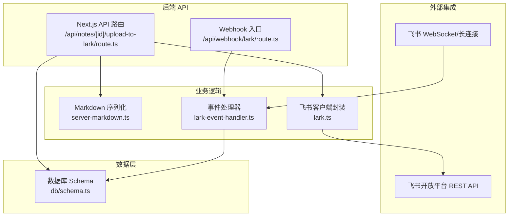
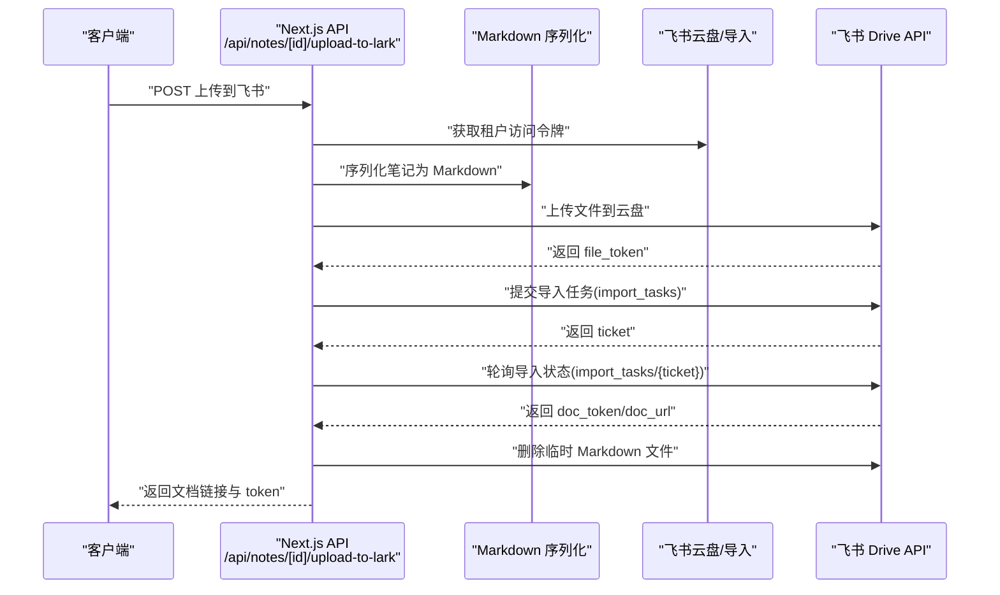
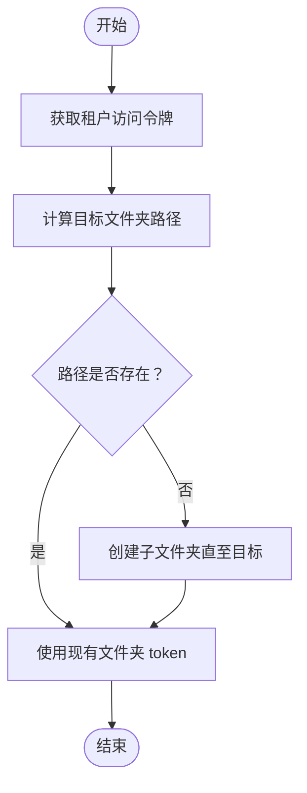
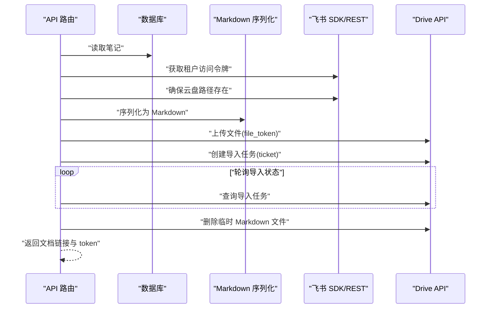
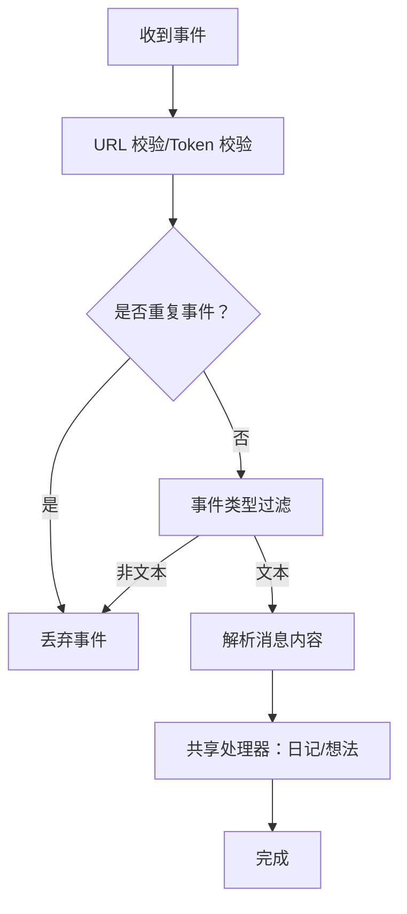
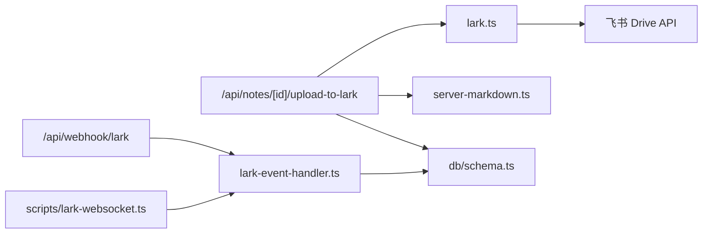

# 飞书同步接口

<cite>
**本文档引用的文件**
- [src/lib/lark.ts](file://src/lib/lark.ts)
- [src/app/api/notes/[id]/upload-to-lark/route.ts](file://src/app/api/notes/[id]/upload-to-lark/route.ts)
- [src/lib/server-markdown.ts](file://src/lib/server-markdown.ts)
- [src/app/api/webhook/lark/route.ts](file://src/app/api/webhook/lark/route.ts)
- [scripts/lark-websocket.ts](file://scripts/lark-websocket.ts)
- [src/lib/lark-event-handler.ts](file://src/lib/lark-event-handler.ts)
- [src/db/schema.ts](file://src/db/schema.ts)
- [package.json](file://package.json)
</cite>

## 目录
1. [简介](#简介)
2. [项目结构](#项目结构)
3. [核心组件](#核心组件)
4. [架构总览](#架构总览)
5. [详细组件分析](#详细组件分析)
6. [依赖关系分析](#依赖关系分析)
7. [性能考量](#性能考量)
8. [故障排查指南](#故障排查指南)
9. [结论](#结论)
10. [附录](#附录)

## 简介
本文件系统性地文档化飞书同步接口的实现与使用，覆盖以下关键主题：
- 上传到飞书的接口实现与同步机制
- 飞书文档 ID 的获取与管理策略
- 内容同步的冲突处理与版本控制
- 增量同步与全量同步的区别
- 同步状态跟踪与错误恢复机制
- 飞书 API 的调用频率限制与重试策略
- 同步性能优化建议与批量处理方案
- 离线同步与网络异常处理
- 同步日志记录与调试工具的使用方法

## 项目结构
围绕飞书同步的相关模块主要分布在如下位置：
- 飞书客户端封装与云空间操作：src/lib/lark.ts
- 单篇笔记上传至飞书文档的 API：src/app/api/notes/[id]/upload-to-lark/route.ts
- Markdown 序列化（服务端）：src/lib/server-markdown.ts
- Webhook 入口与事件去重：src/app/api/webhook/lark/route.ts
- WebSocket 长连接客户端脚本：scripts/lark-websocket.ts
- 通用飞书消息处理器：src/lib/lark-event-handler.ts
- 数据模型（笔记、文件夹等）：src/db/schema.ts
- 脚本与依赖：package.json

图表来源
- [src/app/api/notes/[id]/upload-to-lark/route.ts:237-326](file://src/app/api/notes/[id]/upload-to-lark/route.ts#L237-L326)
- [src/app/api/webhook/lark/route.ts:28-105](file://src/app/api/webhook/lark/route.ts#L28-L105)
- [src/lib/lark.ts:102-130](file://src/lib/lark.ts#L102-L130)
- [src/lib/server-markdown.ts:85-137](file://src/lib/server-markdown.ts#L85-L137)
- [src/lib/lark-event-handler.ts:28-98](file://src/lib/lark-event-handler.ts#L28-L98)
- [src/db/schema.ts:10-39](file://src/db/schema.ts#L10-L39)

章节来源
- [src/lib/lark.ts:1-367](file://src/lib/lark.ts#L1-L367)
- [src/app/api/notes/[id]/upload-to-lark/route.ts:1-327](file://src/app/api/notes/[id]/upload-to-lark/route.ts#L1-L327)
- [src/lib/server-markdown.ts:1-138](file://src/lib/server-markdown.ts#L1-L138)
- [src/app/api/webhook/lark/route.ts:1-106](file://src/app/api/webhook/lark/route.ts#L1-L106)
- [scripts/lark-websocket.ts:1-109](file://scripts/lark-websocket.ts#L1-L109)
- [src/lib/lark-event-handler.ts:1-126](file://src/lib/lark-event-handler.ts#L1-L126)
- [src/db/schema.ts:1-105](file://src/db/schema.ts#L1-L105)
- [package.json:1-119](file://package.json#L1-L119)

## 核心组件
- 飞书客户端与云空间操作
  - 提供租户访问令牌获取、根目录与子目录查询、按名称查找、创建文件夹、确保路径存在、删除文件等能力。
  - 关键函数：getTenantAccessToken、getRootFolderMeta、getSubFolders、findFolderByName、createFolder、ensureFolderPath、deleteFile。

- 笔记上传到飞书文档的 API
  - 将单篇笔记序列化为 Markdown，上传到飞书云盘，提交导入任务，轮询导入状态，完成后删除临时 Markdown 文件，并返回飞书文档链接与文档 token。

- Markdown 序列化（服务端）
  - 使用 Plate.js 插件链将编辑器 JSON 内容序列化为 Markdown，支持标题、列表、代码块、链接、图片、数学公式、表格等节点。

- Webhook 与 WebSocket 事件处理
  - Webhook：URL 校验、去重、鉴权、事件过滤、文本消息解析与路由。
  - WebSocket：长连接监听 im.message.receive_v1 事件，支持加密密钥配置与授权用户过滤。

- 通用消息处理器
  - 将“日记”前缀消息写入日记表，其他文本消息写入想法表，支持追加与去重。

- 数据模型
  - notes、folders、diaries、ideas 等，支撑笔记、文件夹、日记、想法的数据持久化。

章节来源
- [src/lib/lark.ts:102-367](file://src/lib/lark.ts#L102-L367)
- [src/app/api/notes/[id]/upload-to-lark/route.ts:16-326](file://src/app/api/notes/[id]/upload-to-lark/route.ts#L16-L326)
- [src/lib/server-markdown.ts:85-137](file://src/lib/server-markdown.ts#L85-L137)
- [src/app/api/webhook/lark/route.ts:28-105](file://src/app/api/webhook/lark/route.ts#L28-L105)
- [scripts/lark-websocket.ts:39-108](file://scripts/lark-websocket.ts#L39-L108)
- [src/lib/lark-event-handler.ts:28-98](file://src/lib/lark-event-handler.ts#L28-L98)
- [src/db/schema.ts:10-104](file://src/db/schema.ts#L10-L104)

## 架构总览
飞书同步涉及两条主线：
- 文档导入链路：前端触发 -> 后端 API -> 生成 Markdown -> 上传云盘 -> 提交导入任务 -> 轮询状态 -> 返回文档链接 -> 清理临时文件。
- 事件接收链路：飞书推送 -> Webhook/WS -> 去重与鉴权 -> 解析消息 -> 写入数据库。

图表来源
- [src/app/api/notes/[id]/upload-to-lark/route.ts:237-326](file://src/app/api/notes/[id]/upload-to-lark/route.ts#L237-L326)
- [src/lib/lark.ts:102-130](file://src/lib/lark.ts#L102-L130)
- [src/lib/server-markdown.ts:85-137](file://src/lib/server-markdown.ts#L85-L137)

## 详细组件分析

### 组件一：飞书云空间操作与文档 ID 管理
- 租户访问令牌获取：通过内部应用凭据调用飞书开放平台认证接口获取 tenant_access_token。
- 根目录与子目录：支持获取我的空间根目录 token，以及分页拉取子文件夹列表。
- 路径确保：根据笔记所在文件夹层级，自动创建缺失的云盘文件夹，最终返回目标文件夹 token。
- 文档 ID 获取：导入完成后返回的 token 即为飞书文档 token；同时可拼接标准文档链接。
- 文档删除：导入完成后清理临时 Markdown 文件，避免冗余占用。

图表来源
- [src/lib/lark.ts:278-334](file://src/lib/lark.ts#L278-L334)
- [src/lib/lark.ts:102-130](file://src/lib/lark.ts#L102-L130)

章节来源
- [src/lib/lark.ts:102-367](file://src/lib/lark.ts#L102-L367)

### 组件二：单篇笔记上传到飞书文档 API
- 输入：笔记 ID（路由参数），从数据库读取笔记标题、内容、Markdown 或序列化后的 Markdown。
- 流程：
  1) 校验飞书配置
  2) 获取租户访问令牌
  3) 计算笔记所在文件夹路径并确保云盘路径存在
  4) 序列化为 Markdown 并转为 ArrayBuffer
  5) 上传到飞书云盘，得到 file_token
  6) 提交导入任务，得到 ticket
  7) 轮询导入状态，直到完成或失败
  8) 成功后删除临时 Markdown 文件
  9) 返回文档链接与文档 token
- 错误处理：捕获异常并返回 500，导入过程中的任何阶段失败都会中断并上报错误信息。

图表来源
- [src/app/api/notes/[id]/upload-to-lark/route.ts:237-326](file://src/app/api/notes/[id]/upload-to-lark/route.ts#L237-L326)
- [src/lib/server-markdown.ts:85-137](file://src/lib/server-markdown.ts#L85-L137)
- [src/lib/lark.ts:102-130](file://src/lib/lark.ts#L102-L130)

章节来源
- [src/app/api/notes/[id]/upload-to-lark/route.ts:16-326](file://src/app/api/notes/[id]/upload-to-lark/route.ts#L16-L326)

### 组件三：Webhook 与 WebSocket 事件处理
- Webhook：
  - URL 校验：校验 challenge 与验证 token。
  - 去重：基于 event_id 的内存去重（5 分钟 TTL）。
  - 鉴权：校验 header 中的 token 与允许的用户集合。
  - 事件过滤：仅处理 im.message.receive_v1 的文本消息。
  - 消息解析：解析 content 中的 text 字段，交由共享处理器处理。
- WebSocket：
  - 通过 node-sdk 建立长连接，注册 im.message.receive_v1 事件处理器。
  - 支持加密密钥配置与授权用户过滤。
  - 提供优雅关闭与错误日志。

图表来源
- [src/app/api/webhook/lark/route.ts:28-105](file://src/app/api/webhook/lark/route.ts#L28-L105)
- [scripts/lark-websocket.ts:39-108](file://scripts/lark-websocket.ts#L39-L108)
- [src/lib/lark-event-handler.ts:28-98](file://src/lib/lark-event-handler.ts#L28-L98)

章节来源
- [src/app/api/webhook/lark/route.ts:1-106](file://src/app/api/webhook/lark/route.ts#L1-L106)
- [scripts/lark-websocket.ts:1-109](file://scripts/lark-websocket.ts#L1-L109)
- [src/lib/lark-event-handler.ts:1-126](file://src/lib/lark-event-handler.ts#L1-L126)

### 组件四：Markdown 序列化（服务端）
- 使用 Plate.js 插件链（基础节点、代码块、链接、列表、图片、Markdown 插件等）进行服务端序列化。
- 支持将编辑器 JSON 内容转换为 Markdown，并在必要时添加标题前缀。
- 异常保护：序列化失败时返回空字符串并记录错误日志。

章节来源
- [src/lib/server-markdown.ts:1-138](file://src/lib/server-markdown.ts#L1-L138)

### 组件五：数据模型与同步范围
- notes：笔记实体，包含标题、内容、Markdown、排序、时间戳等。
- folders：文件夹实体，支持父子关系与排序。
- diaries/ideas：日记与想法实体，用于 Webhook/WS 接收的消息落库。
- 同步范围：当前实现以“单篇笔记上传到飞书文档”为主，Webhook/WS 主要用于消息入口与落库，不直接参与文档版本控制。

章节来源
- [src/db/schema.ts:10-104](file://src/db/schema.ts#L10-L104)

## 依赖关系分析
- API 路由依赖：
  - 飞书 SDK/REST：获取租户令牌、云盘上传、导入任务、轮询状态、删除文件
  - Markdown 序列化：将编辑器内容转为 Markdown
  - 数据库：读取笔记与文件夹信息
- 事件处理依赖：
  - Webhook/WS：接收飞书事件
  - 共享处理器：统一处理消息并写入数据库

图表来源
- [src/app/api/notes/[id]/upload-to-lark/route.ts:1-327](file://src/app/api/notes/[id]/upload-to-lark/route.ts#L1-L327)
- [src/lib/lark.ts:1-367](file://src/lib/lark.ts#L1-L367)
- [src/lib/server-markdown.ts:1-138](file://src/lib/server-markdown.ts#L1-L138)
- [src/lib/lark-event-handler.ts:1-126](file://src/lib/lark-event-handler.ts#L1-L126)
- [src/db/schema.ts:1-105](file://src/db/schema.ts#L1-L105)
- [scripts/lark-websocket.ts:1-109](file://scripts/lark-websocket.ts#L1-L109)

章节来源
- [package.json:13-99](file://package.json#L13-L99)

## 性能考量
- 批量处理建议
  - 当前实现为单篇笔记导入，若需批量同步，可在上层调度器中并发调用 API 路由，注意控制并发度与速率，避免触发飞书限流。
  - 对于大量笔记的首次导入，建议先确保云盘路径存在（ensureFolderPath），再批量上传文件，最后批量提交导入任务并统一轮询。
- 上传与导入优化
  - 优先使用服务端 Markdown 序列化，减少前端渲染压力。
  - 上传文件采用 FormData，按需设置 parent_type 与 parent_node，避免不必要的跨目录移动。
- 轮询策略
  - 当前轮询间隔为固定值，建议结合任务规模动态调整最大尝试次数与间隔，或引入指数退避策略。
- 缓存与去重
  - Webhook 已内置基于 event_id 的内存去重（5 分钟 TTL），避免重复处理相同事件。
- 日志与可观测性
  - API 与事件处理均输出详细日志，便于定位问题与追踪导入状态。

[本节为通用性能建议，不直接分析具体文件]

## 故障排查指南
- 配置检查
  - 确认 LARK_APP_ID、LARK_APP_SECRET、LARK_VERIFICATION_TOKEN、LARK_ALLOWED_USER_IDS、LARK_ENCRYPT_KEY、LARK_FOLDER_TOKEN 等环境变量正确设置。
- Webhook/WS 无法接收事件
  - Webhook：确认回调地址可达且验证 token 匹配；检查 URL 校验与去重逻辑。
  - WebSocket：确认事件模式设置为 websocket，检查加密密钥配置与授权用户过滤。
- 导入失败
  - 检查租户访问令牌获取是否成功；核对 file_token 与 ticket 是否返回；关注轮询返回的 job_status 与错误信息。
  - 若导入完成后未返回文档 token，检查导入结果字段完整性。
- 临时文件未清理
  - 导入完成后会删除临时 Markdown 文件，若失败请检查删除接口返回与日志。
- 日志与调试
  - 使用 npm 脚本启动 WebSocket 客户端进行本地调试，观察连接建立与消息处理日志。
  - 在 API 层面开启详细日志，定位序列化、上传、导入各阶段的错误点。

章节来源
- [src/app/api/webhook/lark/route.ts:28-105](file://src/app/api/webhook/lark/route.ts#L28-L105)
- [scripts/lark-websocket.ts:24-108](file://scripts/lark-websocket.ts#L24-L108)
- [src/app/api/notes/[id]/upload-to-lark/route.ts:144-199](file://src/app/api/notes/[id]/upload-to-lark/route.ts#L144-L199)
- [src/lib/lark.ts:343-367](file://src/lib/lark.ts#L343-L367)

## 结论
本实现提供了完整的“单篇笔记上传到飞书文档”的同步链路，配合 Webhook/WS 实现消息入口与落库。文档 ID 的获取与管理通过导入任务完成，返回的 token 可直接用于后续访问。当前未实现文档版本控制与冲突合并，若需更高级的同步能力（如增量/全量、版本对比、冲突解决），可在现有基础上扩展导入后的文档更新与差异比对逻辑，并引入更细粒度的状态跟踪与重试策略。

[本节为总结性内容，不直接分析具体文件]

## 附录

### 飞书 API 调用频率限制与重试策略
- 当前实现未显式实现 API 限流与指数退避重试，建议在生产环境中：
  - 对导入任务轮询增加最大尝试次数与指数退避间隔。
  - 对 Drive API 上传与导入任务提交增加幂等键与重试控制。
  - 对 Webhook/WS 连接增加自动重连与心跳检测。

[本节为通用建议，不直接分析具体文件]

### 增量同步与全量同步
- 全量同步：首次导入所有笔记，确保云盘路径存在后批量上传与导入。
- 增量同步：基于笔记更新时间或变更标记，仅对新增或修改的笔记执行上传与导入；可结合 Webhook/WS 的消息作为触发条件。

[本节为概念性说明，不直接分析具体文件]

### 同步状态跟踪与错误恢复
- 状态跟踪：导入任务返回的 ticket 与 job_status 可用于轮询与状态记录。
- 错误恢复：对导入失败的任务进行重试；对临时文件删除失败进行补偿处理；对 Webhook/WS 事件失败进行队列化重放。

[本节为通用建议，不直接分析具体文件]

### 离线同步与网络异常处理
- 离线场景：在前端或调度层维护待同步队列，网络恢复后批量重试。
- 网络异常：对 fetch 请求增加超时与重试；WebSocket 断线后自动重连。

[本节为通用建议，不直接分析具体文件]

### 同步日志记录与调试工具
- 日志：API 与事件处理均输出详细日志，便于定位问题。
- 调试：使用 npm 脚本启动 WebSocket 客户端进行本地联调；在 Webhook/WS 中启用详细日志级别。

章节来源
- [package.json:5-11](file://package.json#L5-L11)
- [scripts/lark-websocket.ts:13-18](file://scripts/lark-websocket.ts#L13-L18)