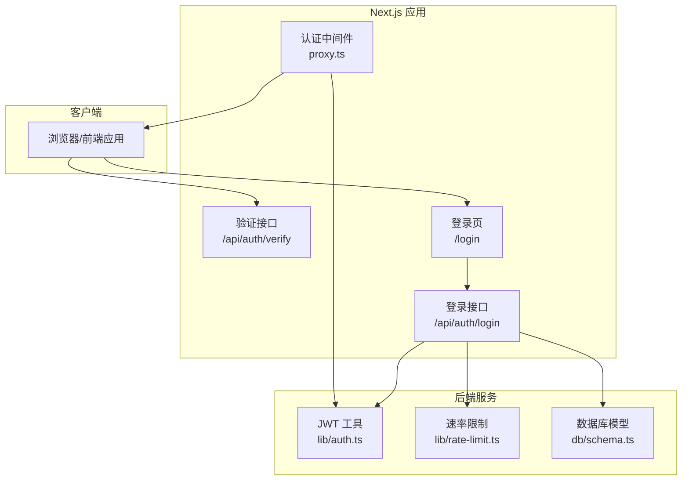
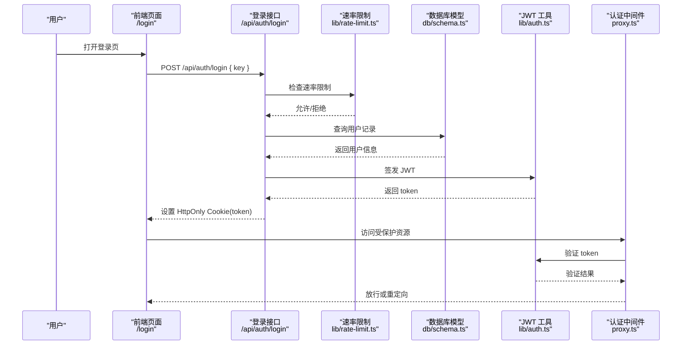
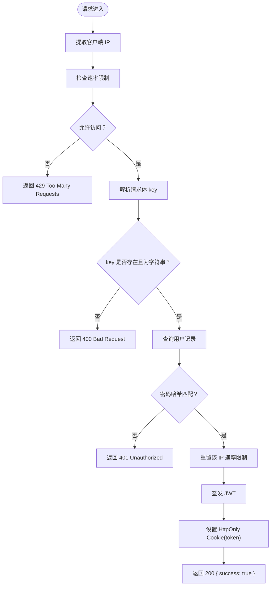
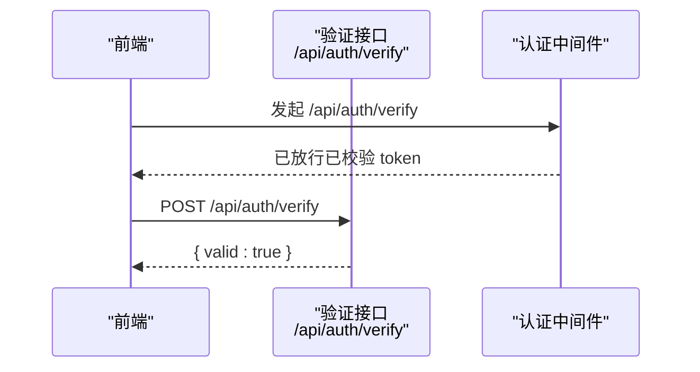
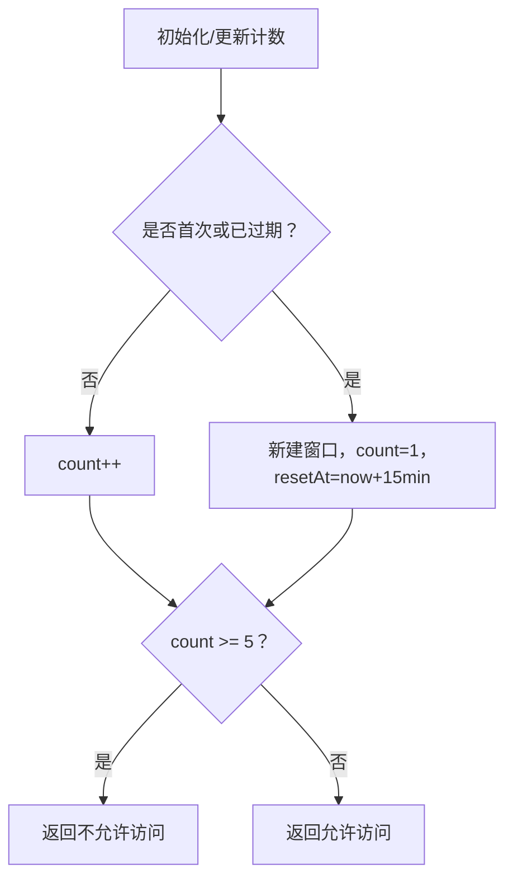
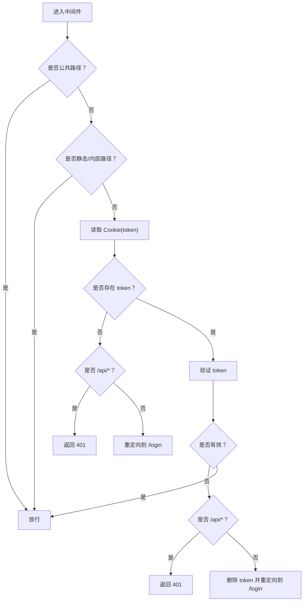
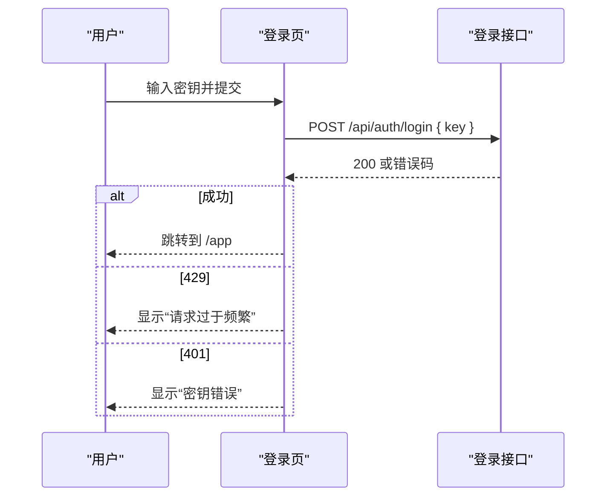
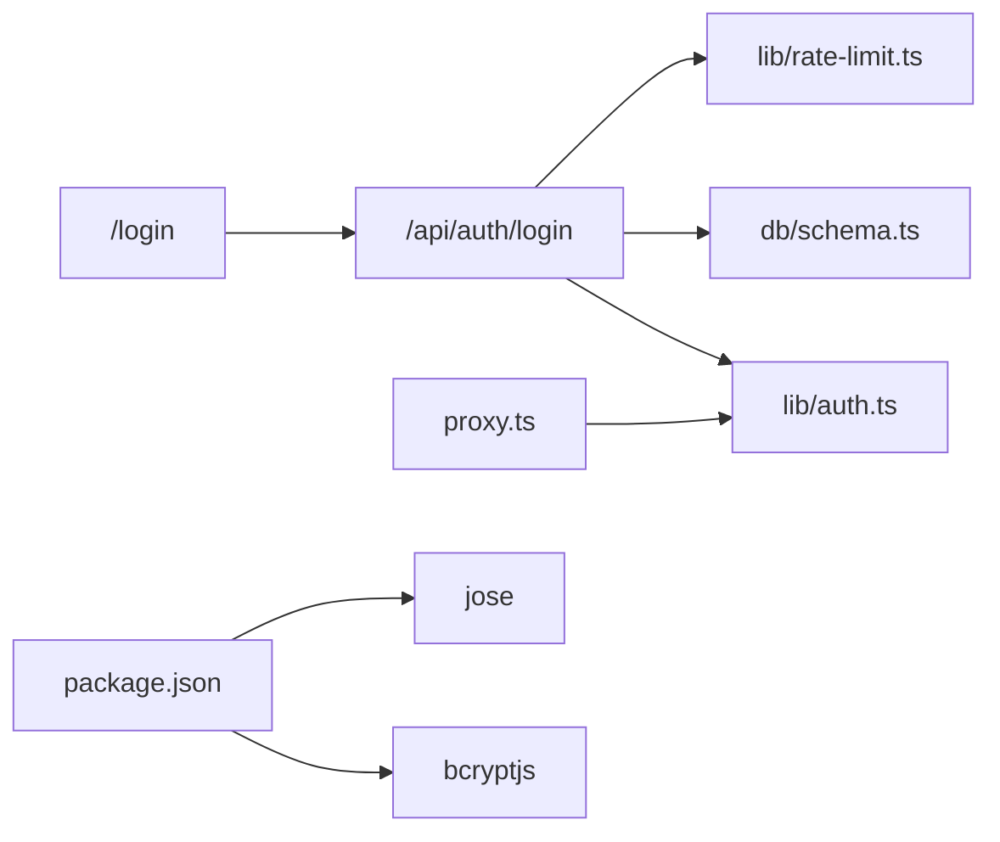

# 认证 API

<cite>
**本文引用的文件**
- [src/app/api/auth/login/route.ts](file://src/app/api/auth/login/route.ts)
- [src/app/api/auth/verify/route.ts](file://src/app/api/auth/verify/route.ts)
- [src/lib/auth.ts](file://src/lib/auth.ts)
- [src/lib/rate-limit.ts](file://src/lib/rate-limit.ts)
- [src/proxy.ts](file://src/proxy.ts)
- [src/app/login/page.tsx](file://src/app/login/page.tsx)
- [src/db/schema.ts](file://src/db/schema.ts)
- [package.json](file://package.json)
</cite>

## 目录
1. [简介](#简介)
2. [项目结构](#项目结构)
3. [核心组件](#核心组件)
4. [架构总览](#架构总览)
5. [详细组件分析](#详细组件分析)
6. [依赖关系分析](#依赖关系分析)
7. [性能考量](#性能考量)
8. [故障排查指南](#故障排查指南)
9. [结论](#结论)
10. [附录](#附录)

## 简介
本文件系统性地文档化了本项目的认证 API，包括登录接口的请求格式、JWT 令牌生成与验证流程、令牌验证接口的实现细节与安全考虑、完整的请求与响应示例、错误处理机制、认证中间件的使用指南与最佳实践，以及常见失败原因与安全建议。

## 项目结构
认证相关的核心文件分布如下：
- 登录接口：src/app/api/auth/login/route.ts
- 令牌验证接口：src/app/api/auth/verify/route.ts
- JWT 工具：src/lib/auth.ts
- 速率限制：src/lib/rate-limit.ts
- 认证中间件（代理）：src/proxy.ts
- 登录页面前端交互：src/app/login/page.tsx
- 用户表结构（密码哈希存储）：src/db/schema.ts
- 依赖声明：package.json



图表来源
- [src/app/api/auth/login/route.ts:1-63](file://src/app/api/auth/login/route.ts#L1-L63)
- [src/app/api/auth/verify/route.ts:1-7](file://src/app/api/auth/verify/route.ts#L1-L7)
- [src/lib/auth.ts:1-26](file://src/lib/auth.ts#L1-L26)
- [src/lib/rate-limit.ts:1-41](file://src/lib/rate-limit.ts#L1-L41)
- [src/proxy.ts:1-50](file://src/proxy.ts#L1-L50)
- [src/app/login/page.tsx:1-99](file://src/app/login/page.tsx#L1-L99)
- [src/db/schema.ts:1-105](file://src/db/schema.ts#L1-L105)

章节来源
- [src/app/api/auth/login/route.ts:1-63](file://src/app/api/auth/login/route.ts#L1-L63)
- [src/app/api/auth/verify/route.ts:1-7](file://src/app/api/auth/verify/route.ts#L1-L7)
- [src/lib/auth.ts:1-26](file://src/lib/auth.ts#L1-L26)
- [src/lib/rate-limit.ts:1-41](file://src/lib/rate-limit.ts#L1-L41)
- [src/proxy.ts:1-50](file://src/proxy.ts#L1-L50)
- [src/app/login/page.tsx:1-99](file://src/app/login/page.tsx#L1-L99)
- [src/db/schema.ts:1-105](file://src/db/schema.ts#L1-L105)

## 核心组件
- 登录接口：接收前端提交的密钥，进行速率限制检查、密钥校验、成功后签发 JWT 并通过 HttpOnly Cookie 返回。
- 令牌验证接口：用于确认当前会话是否有效，仅返回布尔值。
- JWT 工具：封装 HS256 签名与验证逻辑，支持自定义过期时间。
- 速率限制：基于内存 Map 的滑动窗口限流，防止暴力破解。
- 认证中间件：拦截受保护路径，校验 Cookie 中的 token，无效时重定向或返回未授权。
- 登录前端：负责收集密钥、发起登录请求、处理错误与加载状态。

章节来源
- [src/app/api/auth/login/route.ts:9-62](file://src/app/api/auth/login/route.ts#L9-L62)
- [src/app/api/auth/verify/route.ts:3-6](file://src/app/api/auth/verify/route.ts#L3-L6)
- [src/lib/auth.ts:10-25](file://src/lib/auth.ts#L10-L25)
- [src/lib/rate-limit.ts:21-40](file://src/lib/rate-limit.ts#L21-L40)
- [src/proxy.ts:7-45](file://src/proxy.ts#L7-L45)
- [src/app/login/page.tsx:13-44](file://src/app/login/page.tsx#L13-L44)

## 架构总览
下图展示了从用户在登录页输入密钥到成功进入应用的整体流程，以及中间件如何统一校验令牌。



图表来源
- [src/app/login/page.tsx:24-28](file://src/app/login/page.tsx#L24-L28)
- [src/app/api/auth/login/route.ts:12-47](file://src/app/api/auth/login/route.ts#L12-L47)
- [src/lib/rate-limit.ts:21-36](file://src/lib/rate-limit.ts#L21-L36)
- [src/db/schema.ts:3-8](file://src/db/schema.ts#L3-L8)
- [src/lib/auth.ts:10-16](file://src/lib/auth.ts#L10-L16)
- [src/proxy.ts:24-42](file://src/proxy.ts#L24-L42)

## 详细组件分析

### 登录接口（POST /api/auth/login）
- 请求体
  - 字段：key（字符串，必填）
  - 示例：{"key":"your-access-key"}
- 响应
  - 成功：200，{"success":true}，设置 Cookie: token（HttpOnly、Secure、SameSite=Strict、7 天）
  - 错误：400（参数缺失或格式错误）、401（密钥错误）、429（超出速率限制）
- 流程要点
  - 读取客户端 IP（优先 x-forwarded-for，其次 x-real-ip），进行速率限制检查
  - 从请求体解析 key，若为空则返回 400
  - 连接数据库查询用户（固定 ID 为 admin），比对密码哈希
  - 若校验失败，返回 401；若成功，重置该 IP 的速率限制并签发 JWT
  - 将 token 写入 HttpOnly Cookie，确保浏览器不暴露给前端脚本
- 安全考虑
  - 使用 bcrypt 哈希对比（后端依赖 bcryptjs）
  - 速率限制防止暴力破解
  - HttpOnly Cookie 降低 XSS 风险
  - 生产环境启用 Secure 属性



图表来源
- [src/app/api/auth/login/route.ts:9-62](file://src/app/api/auth/login/route.ts#L9-L62)
- [src/lib/rate-limit.ts:21-36](file://src/lib/rate-limit.ts#L21-L36)
- [src/lib/auth.ts:10-16](file://src/lib/auth.ts#L10-L16)
- [src/db/schema.ts:3-8](file://src/db/schema.ts#L3-L8)

章节来源
- [src/app/api/auth/login/route.ts:9-62](file://src/app/api/auth/login/route.ts#L9-L62)
- [src/lib/rate-limit.ts:21-36](file://src/lib/rate-limit.ts#L21-L36)
- [src/lib/auth.ts:10-16](file://src/lib/auth.ts#L10-L16)
- [src/db/schema.ts:3-8](file://src/db/schema.ts#L3-L8)

### 令牌验证接口（POST /api/auth/verify）
- 功能：确认当前会话是否有效
- 行为：若能到达此接口，说明已通过中间件校验；直接返回 { valid: true }
- 适用场景：前端轮询或健康检查，确认登录态仍有效



图表来源
- [src/app/api/auth/verify/route.ts:3-6](file://src/app/api/auth/verify/route.ts#L3-L6)
- [src/proxy.ts:24-42](file://src/proxy.ts#L24-L42)

章节来源
- [src/app/api/auth/verify/route.ts:3-6](file://src/app/api/auth/verify/route.ts#L3-L6)
- [src/proxy.ts:24-42](file://src/proxy.ts#L24-L42)

### JWT 工具（签名与验证）
- 签名
  - 算法：HS256
  - 载荷：默认包含子账号标识，可追加自定义字段
  - 过期时间：通过环境变量配置，默认 7 天
- 验证
  - 使用相同密钥进行验证，异常即视为无效
- 安全建议
  - 必须设置强随机的 JWT_SECRET
  - 合理设置过期时间，结合刷新策略（本项目未实现刷新）

```mermaid
classDiagram
class JWT工具 {
+签名(payload) Promise<string>
+验证(token) Promise<{valid,payload}>
}
class 环境变量 {
+JWT_SECRET : string
+JWT_EXPIRY : string
}
JWT工具 --> 环境变量 : "读取密钥与过期时间"
```

图表来源
- [src/lib/auth.ts:10-25](file://src/lib/auth.ts#L10-L25)

章节来源
- [src/lib/auth.ts:10-25](file://src/lib/auth.ts#L10-L25)

### 速率限制（防暴力破解）
- 窗口：15 分钟
- 最大尝试次数：5 次
- 存储：内存 Map，定期清理过期条目
- 行为：超过阈值返回 429，并携带 Retry-After、X-RateLimit-Remaining 等头部



图表来源
- [src/lib/rate-limit.ts:21-36](file://src/lib/rate-limit.ts#L21-L36)

章节来源
- [src/lib/rate-limit.ts:1-41](file://src/lib/rate-limit.ts#L1-L41)

### 认证中间件（代理）
- 匹配规则：/app/* 与 /api/* 受保护路径
- 放行规则：/login、/api/auth/login、静态资源、Next.js 内部路径
- 校验逻辑：
  - 无 token：API 路径返回 401，页面重定向至 /login
  - token 无效：API 路径返回 401，页面删除 Cookie 并重定向至 /login
  - 有效：放行



图表来源
- [src/proxy.ts:7-45](file://src/proxy.ts#L7-L45)

章节来源
- [src/proxy.ts:5-49](file://src/proxy.ts#L5-L49)

### 登录前端（/login 页面）
- 表单行为：提交前校验 key 非空，禁用重复提交
- 请求：向 /api/auth/login 发送 JSON，包含 key
- 错误处理：根据状态码区分 429 与 401，并提示用户
- 成功：跳转到 /app



图表来源
- [src/app/login/page.tsx:13-44](file://src/app/login/page.tsx#L13-L44)
- [src/app/api/auth/login/route.ts:27-61](file://src/app/api/auth/login/route.ts#L27-L61)

章节来源
- [src/app/login/page.tsx:13-44](file://src/app/login/page.tsx#L13-L44)

## 依赖关系分析
- 登录接口依赖：
  - 速率限制模块（防爆破）
  - 数据库模型（用户表）
  - JWT 工具（签发 token）
- 中间件依赖：
  - JWT 工具（验证 token）
- 前端依赖：
  - 登录接口（提交密钥）



图表来源
- [src/app/api/auth/login/route.ts:6-7](file://src/app/api/auth/login/route.ts#L6-L7)
- [src/lib/rate-limit.ts:1-41](file://src/lib/rate-limit.ts#L1-L41)
- [src/db/schema.ts:3-8](file://src/db/schema.ts#L3-L8)
- [src/lib/auth.ts:1-26](file://src/lib/auth.ts#L1-L26)
- [src/proxy.ts:3](file://src/proxy.ts#L3)
- [src/app/login/page.tsx:24-28](file://src/app/login/page.tsx#L24-L28)
- [package.json:67-57](file://package.json#L67-L57)

章节来源
- [package.json:57-67](file://package.json#L57-L67)

## 性能考量
- 速率限制采用内存 Map，适合单实例部署；如需多实例，建议迁移到分布式缓存（如 Redis）以共享状态。
- JWT 验证为本地 HS256 校验，性能开销极低。
- 登录接口仅进行一次数据库查询，索引命中 admin 主键，查询成本低。
- HttpOnly Cookie 减少前端存储风险，避免跨站脚本泄露。

## 故障排查指南
- 常见错误与原因
  - 400（Bad Request）：请求体缺少 key 或非字符串类型
  - 401（Unauthorized）：密钥错误或 token 无效
  - 429（Too Many Requests）：同一 IP 在 15 分钟内尝试超过 5 次
  - 500（Internal Server Error）：数据库或服务器异常（登录接口有通用异常兜底）
- 解决方案
  - 确认请求体格式为 JSON，包含字符串类型的 key
  - 检查服务端 JWT_SECRET 与 JWT_EXPIRY 环境变量是否正确设置
  - 若频繁触发 429，等待窗口重置或调整阈值
  - 中间件未放行：确认 Cookie 中 token 是否存在且未过期
- 建议的日志与监控
  - 记录登录尝试（成功/失败）、IP、UA
  - 监控 429 比例，识别异常扫描行为
  - 对 401 频繁发生的情况进行告警

章节来源
- [src/app/api/auth/login/route.ts:31-42](file://src/app/api/auth/login/route.ts#L31-L42)
- [src/lib/rate-limit.ts:30-32](file://src/lib/rate-limit.ts#L30-L32)
- [src/proxy.ts:26-42](file://src/proxy.ts#L26-L42)

## 结论
本认证体系以 HttpOnly Cookie 携带 JWT 为核心，结合速率限制与中间件统一校验，提供了基础但有效的访问控制。建议在生产环境中进一步强化安全策略（如引入刷新令牌、分布式限流、更强的密钥管理等）。

## 附录

### API 规范与示例

- 登录接口
  - 方法：POST
  - 路径：/api/auth/login
  - 请求头：Content-Type: application/json
  - 请求体：
    - key: string（必填）
  - 成功响应（200）：
    - {"success":true}
    - Set-Cookie: token=...; HttpOnly; Secure; SameSite=Strict; Max-Age=604800; Path=/
  - 错误响应：
    - 400：{"error":"请输入密钥"}
    - 401：{"error":"密钥错误","remaining":...}
    - 429：{"error":"登录尝试次数过多，请稍后再试"}（含 Retry-After、X-RateLimit-Remaining）
- 令牌验证接口
  - 方法：POST
  - 路径：/api/auth/verify
  - 请求体：无
  - 响应：{"valid":true}

章节来源
- [src/app/api/auth/login/route.ts:27-61](file://src/app/api/auth/login/route.ts#L27-L61)
- [src/app/api/auth/verify/route.ts:3-6](file://src/app/api/auth/verify/route.ts#L3-L6)

### 认证中间件使用指南与最佳实践
- 使用方式
  - 将需要保护的路径（如 /app/* 与 /api/*）交由中间件处理
  - 公共路径（如 /login、/api/auth/login）无需 token 即可访问
- 最佳实践
  - 严格启用 HttpOnly Cookie，避免前端脚本读取 token
  - 生产环境开启 Secure 属性
  - 合理设置过期时间，结合刷新策略（本项目未实现）
  - 对 /api/* 与页面访问分别处理 401 与重定向
  - 如需多实例部署，将速率限制迁移到分布式缓存

章节来源
- [src/proxy.ts:5-49](file://src/proxy.ts#L5-L49)

### 安全建议与令牌管理策略
- 密钥与令牌
  - JWT_SECRET 必须强随机且保密，定期轮换
  - 控制 JWT 过期时间，短时效 + 刷新令牌更安全
- 存储与传输
  - 使用 HttpOnly Cookie 存储 token，避免 XSS 泄露
  - 生产环境启用 Secure 与 SameSite=Strict
- 防护措施
  - 引入速率限制与账户锁定策略
  - 对异常 IP 与 UA 进行阻断或二次验证
  - 定期审计登录日志与 429 指标

章节来源
- [src/lib/auth.ts:3-4](file://src/lib/auth.ts#L3-L4)
- [src/app/api/auth/login/route.ts:50-56](file://src/app/api/auth/login/route.ts#L50-L56)
- [src/lib/rate-limit.ts:1-41](file://src/lib/rate-limit.ts#L1-L41)