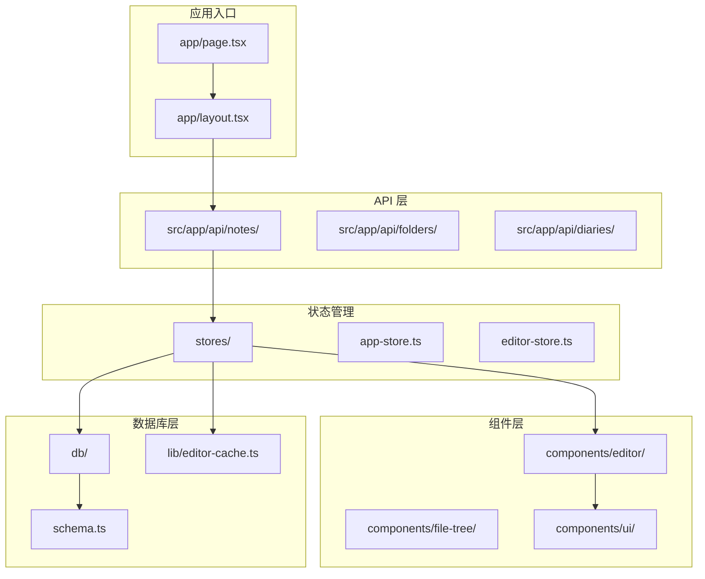
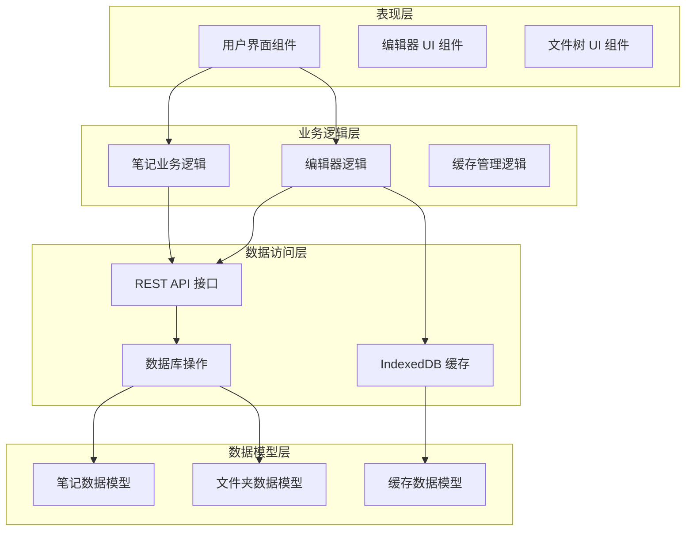
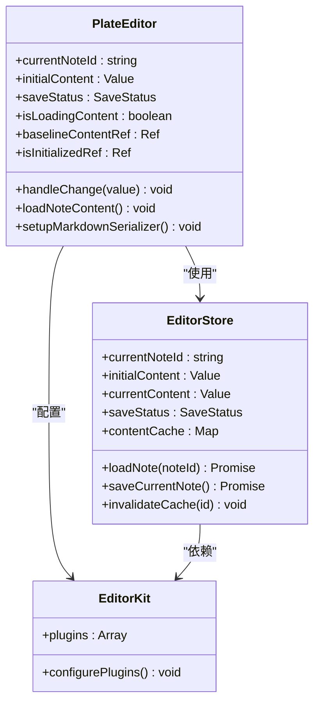
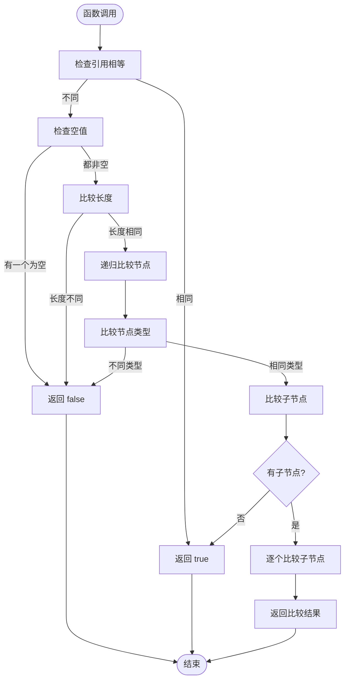
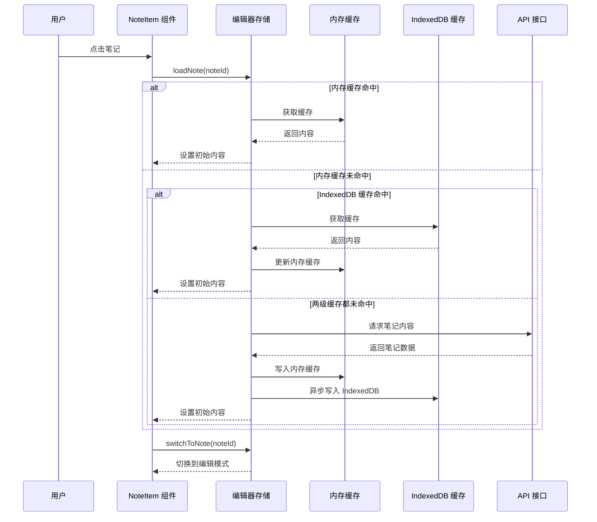
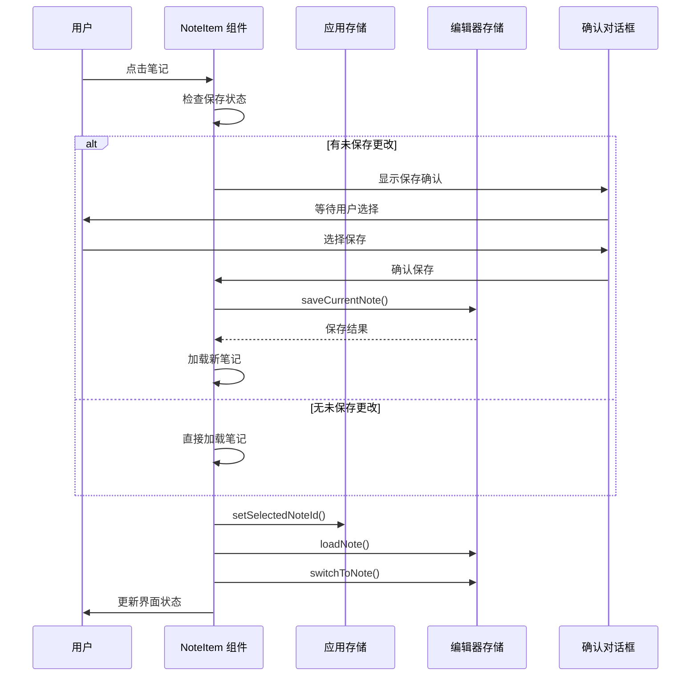
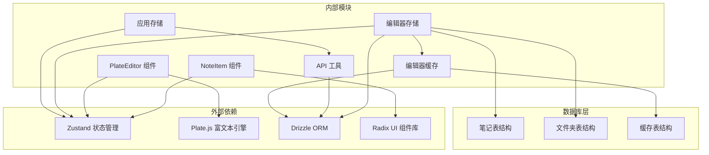
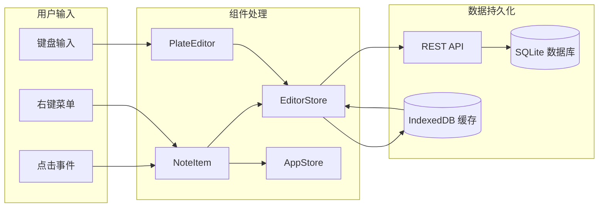

# 笔记详情界面

<cite>
**本文档引用的文件**
- [src/app/api/notes/[id]/route.ts](file://src/app/api/notes/[id]/route.ts)
- [src/app/api/notes/route.ts](file://src/app/api/notes/route.ts)
- [src/stores/editor-store.ts](file://src/stores/editor-store.ts)
- [src/stores/app-store.ts](file://src/stores/app-store.ts)
- [src/components/editor/plate-editor.tsx](file://src/components/editor/plate-editor.tsx)
- [src/components/file-tree/note-item.tsx](file://src/components/file-tree/note-item.tsx)
- [src/components/ui/editor.tsx](file://src/components/ui/editor.tsx)
- [src/lib/editor-cache.ts](file://src/lib/editor-cache.ts)
- [src/db/schema.ts](file://src/db/schema.ts)
- [src/types/index.ts](file://src/types/index.ts)
- [src/lib/api-utils.ts](file://src/lib/api-utils.ts)
</cite>

## 目录
1. [简介](#简介)
2. [项目结构](#项目结构)
3. [核心组件](#核心组件)
4. [架构概览](#架构概览)
5. [详细组件分析](#详细组件分析)
6. [依赖关系分析](#依赖关系分析)
7. [性能考虑](#性能考虑)
8. [故障排除指南](#故障排除指南)
9. [结论](#结论)

## 简介

Note Detail Interface 是 YNote v2 应用中的核心功能模块，负责提供用户与笔记内容进行交互的界面。该系统基于 Next.js 构建，采用现代化的前端技术栈，包括 Zustand 状态管理、Plate.js 富文本编辑器、Drizzle ORM 数据库抽象层等。

该界面支持完整的笔记生命周期管理，包括笔记的创建、编辑、保存、删除等功能，同时提供了智能缓存机制以优化用户体验。系统采用分层架构设计，确保了代码的可维护性和扩展性。

## 项目结构

YNote v2 项目采用基于功能的组织方式，主要目录结构如下：

**图表来源**
- [src/app/page.tsx:1-6](file://src/app/page.tsx#L1-L6)
- [src/app/layout.tsx:1-38](file://src/app/layout.tsx#L1-L38)
- [src/stores/editor-store.ts:1-343](file://src/stores/editor-store.ts#L1-L343)

**章节来源**
- [src/app/page.tsx:1-6](file://src/app/page.tsx#L1-L6)
- [src/app/layout.tsx:1-38](file://src/app/layout.tsx#L1-L38)

## 核心组件

### 编辑器组件 (PlateEditor)

PlateEditor 是笔记详情界面的核心组件，基于 Plate.js 构建，提供了丰富的富文本编辑功能。该组件实现了以下关键特性：

- **实时内容同步**：通过自定义的值比较算法，精确检测内容变化并更新保存状态
- **智能缓存管理**：结合内存缓存和 IndexedDB 持久化缓存，提供快速的内容加载体验
- **撤销重做控制**：为每个笔记维护独立的编辑历史，防止跨笔记内容混淆
- **响应式布局**：适配不同屏幕尺寸，提供一致的编辑体验

### 编辑器存储 (EditorStore)

EditorStore 使用 Zustand 实现状态管理，负责协调整个编辑器的功能：

- **多级缓存策略**：内存缓存（Map）+ IndexedDB 持久化缓存，支持 LRU 淘汰算法
- **异步内容加载**：支持从 API 获取内容，同时处理缓存命中和未命中的情况
- **自动保存机制**：检测内容变化并触发保存流程
- **内容序列化**：将 Plate.js 的 Value 结构转换为 Markdown 格式

### 文件树组件 (NoteItem)

NoteItem 提供了笔记列表的交互界面，集成了多种用户操作：

- **上下文菜单**：支持重命名、导入到飞书文档、删除等操作
- **即时切换**：点击笔记即可切换到对应的编辑界面
- **状态反馈**：显示当前选中状态和保存状态
- **确认对话框**：在执行危险操作前提供用户确认

**章节来源**
- [src/components/editor/plate-editor.tsx:1-175](file://src/components/editor/plate-editor.tsx#L1-L175)
- [src/stores/editor-store.ts:1-343](file://src/stores/editor-store.ts#L1-L343)
- [src/components/file-tree/note-item.tsx:1-210](file://src/components/file-tree/note-item.tsx#L1-L210)

## 架构概览

Note Detail Interface 采用了分层架构设计，确保各层职责清晰分离：

**图表来源**
- [src/stores/editor-store.ts:103-343](file://src/stores/editor-store.ts#L103-L343)
- [src/app/api/notes/[id]/route.ts:1-87](file://src/app/api/notes/[id]/route.ts#L1-L87)
- [src/lib/editor-cache.ts:28-73](file://src/lib/editor-cache.ts#L28-L73)

## 详细组件分析

### 编辑器组件详细分析

#### PlateEditor 组件架构

**图表来源**
- [src/components/editor/plate-editor.tsx:63-175](file://src/components/editor/plate-editor.tsx#L63-L175)
- [src/stores/editor-store.ts:103-343](file://src/stores/editor-store.ts#L103-L343)

#### 内容比较算法

编辑器实现了高效的值比较算法，避免了 JSON.stringify 的性能开销：

**图表来源**
- [src/components/editor/plate-editor.tsx:16-61](file://src/components/editor/plate-editor.tsx#L16-L61)

**章节来源**
- [src/components/editor/plate-editor.tsx:1-175](file://src/components/editor/plate-editor.tsx#L1-L175)

### 编辑器存储详细分析

#### 缓存策略架构

**图表来源**
- [src/stores/editor-store.ts:129-199](file://src/stores/editor-store.ts#L129-L199)
- [src/stores/editor-store.ts:146-186](file://src/stores/editor-store.ts#L146-L186)

#### 缓存管理机制

编辑器存储实现了三级缓存策略：

1. **内存缓存**：使用 Map 数据结构，支持 LRU 淘汰算法
2. **IndexedDB 缓存**：持久化存储，支持跨会话缓存
3. **API 缓存**：网络请求缓存，减少重复请求

**章节来源**
- [src/stores/editor-store.ts:1-343](file://src/stores/editor-store.ts#L1-L343)
- [src/lib/editor-cache.ts:1-271](file://src/lib/editor-cache.ts#L1-L271)

### 文件树组件详细分析

#### NoteItem 组件交互流程

**图表来源**
- [src/components/file-tree/note-item.tsx:52-82](file://src/components/file-tree/note-item.tsx#L52-L82)
- [src/components/file-tree/note-item.tsx:67-75](file://src/components/file-tree/note-item.tsx#L67-L75)

**章节来源**
- [src/components/file-tree/note-item.tsx:1-210](file://src/components/file-tree/note-item.tsx#L1-L210)

## 依赖关系分析

### 组件依赖图

**图表来源**
- [src/stores/editor-store.ts:1-11](file://src/stores/editor-store.ts#L1-L11)
- [src/components/editor/plate-editor.tsx:8-10](file://src/components/editor/plate-editor.tsx#L8-L10)
- [src/lib/editor-cache.ts:1-6](file://src/lib/editor-cache.ts#L1-L6)

### 数据流分析

**图表来源**
- [src/stores/app-store.ts:66-122](file://src/stores/app-store.ts#L66-L122)
- [src/stores/editor-store.ts:277-333](file://src/stores/editor-store.ts#L277-L333)

**章节来源**
- [src/stores/app-store.ts:1-424](file://src/stores/app-store.ts#L1-L424)
- [src/stores/editor-store.ts:1-343](file://src/stores/editor-store.ts#L1-L343)

## 性能考虑

### 缓存策略优化

系统实现了多层次的缓存策略来优化性能：

1. **内存缓存**：使用 Map 数据结构，O(1) 访问时间
2. **IndexedDB 缓存**：持久化存储，支持跨会话缓存
3. **LRU 淘汰算法**：自动清理最旧的缓存条目
4. **异步写入**：避免阻塞主线程

### 渲染优化

- **虚拟滚动**：对于大量笔记时使用虚拟滚动技术
- **懒加载**：只在需要时加载笔记内容
- **防抖处理**：对频繁的编辑操作进行防抖处理

### 网络优化

- **请求合并**：将多个小请求合并为批量请求
- **缓存验证**：使用 ETag 进行缓存有效性验证
- **连接复用**：复用 HTTP 连接减少握手开销

## 故障排除指南

### 常见问题及解决方案

#### 编辑器内容不更新

**症状**：修改笔记内容后，界面没有反映最新更改

**可能原因**：
1. 缓存未正确更新
2. 状态管理异常
3. 插件配置错误

**解决步骤**：
1. 检查编辑器的保存状态
2. 验证缓存是否正确失效
3. 查看浏览器控制台错误信息

#### 笔记加载失败

**症状**：点击笔记时出现加载错误

**可能原因**：
1. 网络连接问题
2. API 服务不可用
3. 缓存损坏

**解决步骤**：
1. 检查网络连接状态
2. 验证 API 服务可用性
3. 清除浏览器缓存
4. 重新启动应用

#### 编辑器性能问题

**症状**：编辑器响应缓慢或卡顿

**可能原因**：
1. 内存泄漏
2. 大量节点渲染
3. 插件冲突

**解决步骤**：
1. 检查内存使用情况
2. 减少复杂内容的使用
3. 禁用不必要的插件
4. 重启浏览器

**章节来源**
- [src/lib/api-utils.ts:1-46](file://src/lib/api-utils.ts#L1-L46)
- [src/stores/editor-store.ts:335-342](file://src/stores/editor-store.ts#L335-L342)

## 结论

Note Detail Interface 作为 YNote v2 的核心功能模块，展现了现代前端应用的设计理念和技术实践。系统通过合理的架构设计、完善的缓存策略和优雅的用户界面，为用户提供了流畅的笔记编辑体验。

### 主要优势

1. **高性能**：多级缓存策略确保快速的内容加载
2. **可靠性**：完善的错误处理和状态管理
3. **可扩展性**：模块化的架构便于功能扩展
4. **用户体验**：直观的界面设计和流畅的交互

### 技术亮点

- 基于 Plate.js 的富文本编辑器
- 基于 Zustand 的轻量级状态管理
- 智能的缓存管理系统
- 响应式的用户界面设计

该系统为个人知识管理应用提供了一个优秀的参考实现，展示了如何在保持代码简洁的同时实现复杂的功能需求。