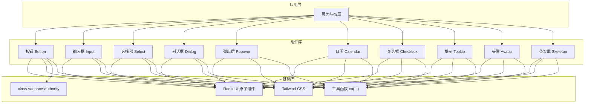
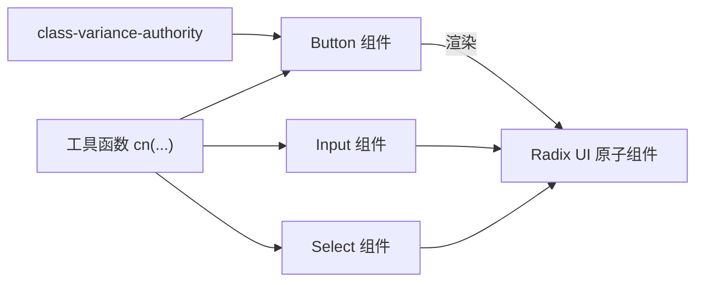
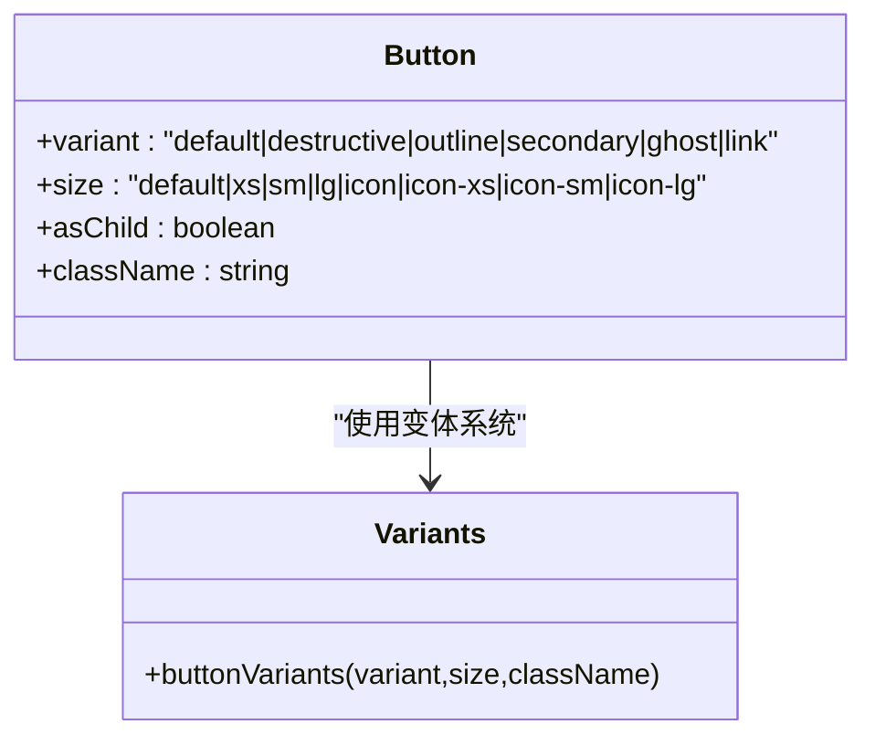
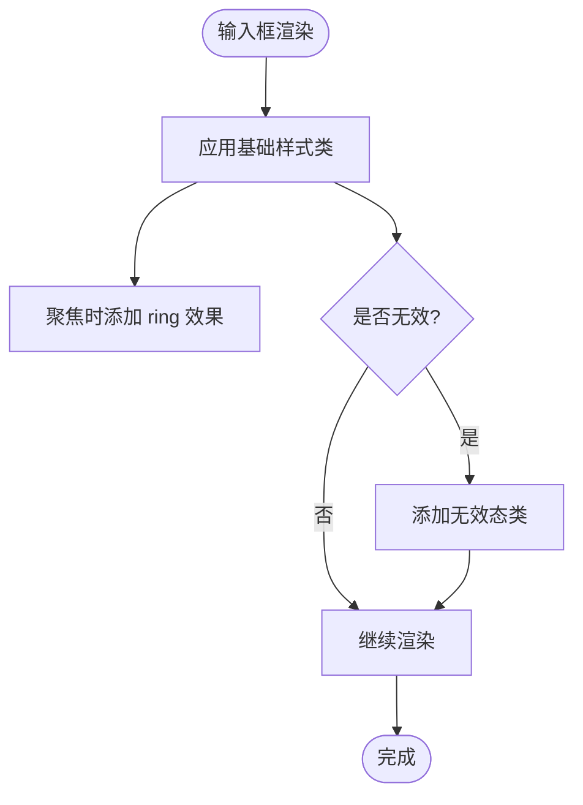
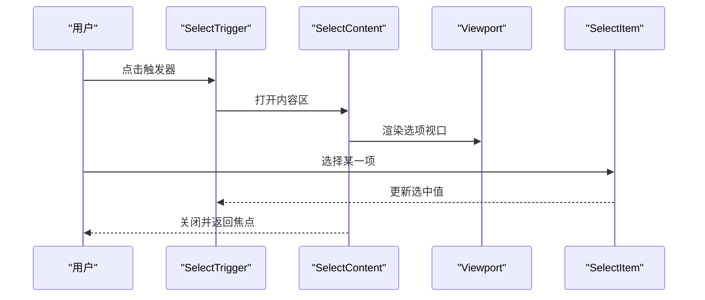
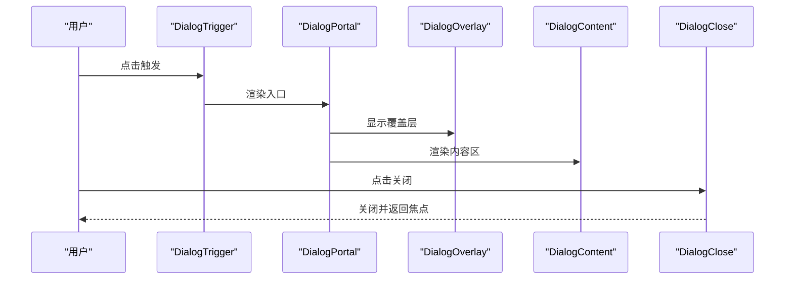
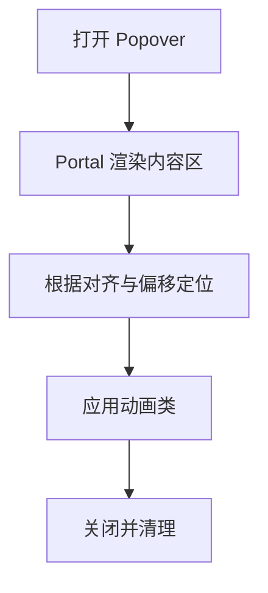
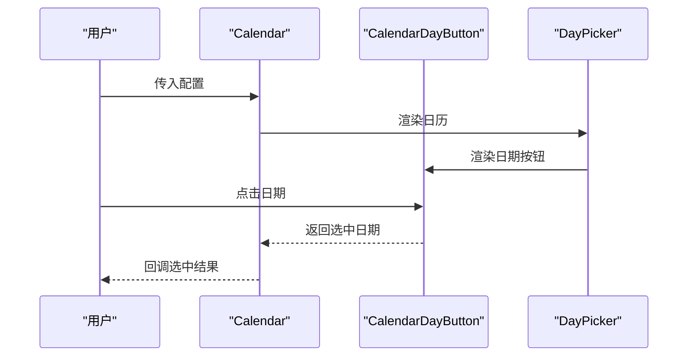
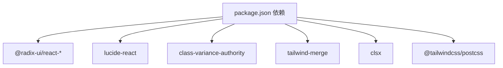

# UI 组件库

<cite>
**本文引用的文件**
- [README.md](file://README.md)
- [package.json](file://package.json)
- [components.json](file://components.json)
- [postcss.config.mjs](file://postcss.config.mjs)
- [src/lib/utils.ts](file://src/lib/utils.ts)
- [src/components/ui/button.tsx](file://src/components/ui/button.tsx)
- [src/components/ui/input.tsx](file://src/components/ui/input.tsx)
- [src/components/ui/select.tsx](file://src/components/ui/select.tsx)
- [src/components/ui/dialog.tsx](file://src/components/ui/dialog.tsx)
- [src/components/ui/popover.tsx](file://src/components/ui/popover.tsx)
- [src/components/ui/calendar.tsx](file://src/components/ui/calendar.tsx)
- [src/components/ui/checkbox.tsx](file://src/components/ui/checkbox.tsx)
- [src/components/ui/tooltip.tsx](file://src/components/ui/tooltip.tsx)
- [src/components/ui/avatar.tsx](file://src/components/ui/avatar.tsx)
- [src/components/ui/skeleton.tsx](file://src/components/ui/skeleton.tsx)
</cite>

## 目录
1. [简介](#简介)
2. [项目结构](#项目结构)
3. [核心组件](#核心组件)
4. [架构总览](#架构总览)
5. [详细组件分析](#详细组件分析)
6. [依赖分析](#依赖分析)
7. [性能考虑](#性能考虑)
8. [故障排查指南](#故障排查指南)
9. [结论](#结论)
10. [附录](#附录)

## 简介
本项目是一个基于 Next.js 的富文本与通用 UI 组件库，采用 Radix UI 作为基础交互层，结合 Tailwind CSS 实现一致的样式系统，并通过 class-variance-authority 提供变体（variants）与尺寸（sizes）的统一风格控制。组件广泛使用语义化属性与可访问性标记，确保在桌面与移动设备上具备良好的可用性与一致性。

## 项目结构
组件库位于 src/components/ui 下，每个组件封装了 Radix UI 原子能力并提供一致的外观与行为。样式系统通过工具函数合并类名，Tailwind v4 通过 PostCSS 插件启用，配置由组件库工具链生成的 schema 文件进行约束。

图表来源
- [src/components/ui/button.tsx:1-65](file://src/components/ui/button.tsx#L1-L65)
- [src/components/ui/input.tsx:1-22](file://src/components/ui/input.tsx#L1-L22)
- [src/components/ui/select.tsx:1-191](file://src/components/ui/select.tsx#L1-L191)
- [src/components/ui/dialog.tsx:1-158](file://src/components/ui/dialog.tsx#L1-L158)
- [src/components/ui/popover.tsx:1-90](file://src/components/ui/popover.tsx#L1-L90)
- [src/components/ui/calendar.tsx:1-220](file://src/components/ui/calendar.tsx#L1-L220)
- [src/components/ui/checkbox.tsx:1-33](file://src/components/ui/checkbox.tsx#L1-L33)
- [src/components/ui/tooltip.tsx:1-58](file://src/components/ui/tooltip.tsx#L1-L58)
- [src/components/ui/avatar.tsx:1-110](file://src/components/ui/avatar.tsx#L1-L110)
- [src/components/ui/skeleton.tsx:1-14](file://src/components/ui/skeleton.tsx#L1-L14)
- [src/lib/utils.ts:1-7](file://src/lib/utils.ts#L1-L7)

章节来源
- [README.md:1-37](file://README.md#L1-L37)
- [package.json:1-119](file://package.json#L1-L119)
- [components.json:1-21](file://components.json#L1-L21)
- [postcss.config.mjs:1-8](file://postcss.config.mjs#L1-L8)

## 核心组件
本节概述组件库的关键构件及其职责：
- 按钮 Button：提供多种变体与尺寸，支持 asChild 渲染，统一聚焦态与禁用态视觉。
- 输入框 Input：统一边框、内阴影、聚焦环与无效态样式，适配暗色模式。
- 选择器 Select：封装触发器、内容区、滚动按钮与条目，支持多尺寸与对齐。
- 对话框 Dialog：根容器、触发器、覆盖层、内容区、标题与描述，支持关闭按钮与脚部布局。
- 弹出层 Popover：根容器、触发器、内容区、锚点与标题/描述区块。
- 日历 Calendar：基于 react-day-picker，统一样式类名、按钮变体与日期按钮渲染。
- 复选框 Checkbox：原生交互语义，统一指示器与无效态。
- 提示 Tooltip：提供器、触发器、内容区与箭头。
- 头像 Avatar：支持多尺寸、图片与占位、徽标与分组计数。
- 骨架屏 Skeleton：统一脉动动画与背景色。

章节来源
- [src/components/ui/button.tsx:1-65](file://src/components/ui/button.tsx#L1-L65)
- [src/components/ui/input.tsx:1-22](file://src/components/ui/input.tsx#L1-L22)
- [src/components/ui/select.tsx:1-191](file://src/components/ui/select.tsx#L1-L191)
- [src/components/ui/dialog.tsx:1-158](file://src/components/ui/dialog.tsx#L1-L158)
- [src/components/ui/popover.tsx:1-90](file://src/components/ui/popover.tsx#L1-L90)
- [src/components/ui/calendar.tsx:1-220](file://src/components/ui/calendar.tsx#L1-L220)
- [src/components/ui/checkbox.tsx:1-33](file://src/components/ui/checkbox.tsx#L1-L33)
- [src/components/ui/tooltip.tsx:1-58](file://src/components/ui/tooltip.tsx#L1-L58)
- [src/components/ui/avatar.tsx:1-110](file://src/components/ui/avatar.tsx#L1-L110)
- [src/components/ui/skeleton.tsx:1-14](file://src/components/ui/skeleton.tsx#L1-L14)

## 架构总览
组件库遵循“原子组件 + 变体系统 + 工具函数”的架构：
- 原子组件：基于 Radix UI，封装交互状态与可见性。
- 变体系统：class-variance-authority 定义 variant/size 组合，Button 为例展示。
- 工具函数：cn(...) 合并与去重类名，确保样式优先级与可维护性。
- 样式系统：Tailwind v4 通过 PostCSS 插件启用，组件内部通过 cn(...) 应用类名。
- 主题与颜色：通过 CSS 变量与明暗模式变量实现，组件中体现为 ring、accent、muted 等语义色。

图表来源
- [src/lib/utils.ts:1-7](file://src/lib/utils.ts#L1-L7)
- [src/components/ui/button.tsx:1-65](file://src/components/ui/button.tsx#L1-L65)
- [src/components/ui/input.tsx:1-22](file://src/components/ui/input.tsx#L1-L22)
- [src/components/ui/select.tsx:1-191](file://src/components/ui/select.tsx#L1-L191)

## 详细组件分析

### 按钮 Button
- 设计原则
  - 以 class-variance-authority 定义变体与尺寸，统一视觉与交互反馈。
  - 支持 asChild，允许将按钮渲染为非 button 元素（如链接），保持语义与可访问性。
  - 聚焦态使用 ring 辅助高对比度，禁用态降低不透明度与移除交互事件。
- Props 接口
  - className：扩展类名
  - variant：默认/破坏性/描边/次要/幽灵/链接
  - size：默认/xs/sm/lg/icon 及其尺寸族
  - asChild：是否以子元素作为渲染根
- 事件与状态
  - 内部使用 Slot 根据 asChild 切换渲染节点；状态通过 Radix UI 属性映射。
- 样式与主题
  - 使用 cn(...) 合并基础类与变体类，支持暗色模式下的 ring 与 accent 变体。
- 可访问性
  - 保留原生 button 行为，支持键盘聚焦与无障碍标签。
- 使用示例与最佳实践
  - 优先使用变体表达语义（如 destructive 表达危险操作）。
  - 图标按钮建议使用 icon 尺寸族，避免文字溢出。
  - 需要链接语义时使用 asChild 包裹 a 标签。

图表来源
- [src/components/ui/button.tsx:1-65](file://src/components/ui/button.tsx#L1-L65)

章节来源
- [src/components/ui/button.tsx:1-65](file://src/components/ui/button.tsx#L1-L65)

### 输入框 Input
- 设计原则
  - 统一边框、内阴影与聚焦环，支持无效态与暗色模式。
  - 通过 data-slot 标记便于调试与样式隔离。
- Props 接口
  - className：扩展类名
  - type：原生 input 类型
- 事件与状态
  - 通过原生表单控件状态（如 invalid）映射到视觉反馈。
- 样式与主题
  - 使用 cn(...) 合并基础类与聚焦/无效态类。
- 可访问性
  - 保持原生 input 行为，支持自动聚焦与屏幕阅读器识别。
- 使用示例与最佳实践
  - 与表单验证联动时，利用 aria-invalid 传递状态。
  - 在复杂表单中配合辅助文本与错误提示。

图表来源
- [src/components/ui/input.tsx:1-22](file://src/components/ui/input.tsx#L1-L22)

章节来源
- [src/components/ui/input.tsx:1-22](file://src/components/ui/input.tsx#L1-L22)

### 选择器 Select
- 设计原则
  - 触发器支持两种尺寸，内容区支持 popper 与 item-aligned 两种定位策略。
  - 条目包含指示器与文本，支持分组、分隔线与滚动按钮。
- Props 接口
  - Trigger: size
  - Content: position, align
  - Item: 文本与指示器
  - ScrollUp/Down Button: 自定义图标
- 事件与状态
  - 通过 Radix UI 的 Root/Trigger/Content/Item 等组件协作，状态通过 data-* 属性暴露。
- 样式与主题
  - 使用 cn(...) 合并基础类与动画类，支持暗色模式与尺寸映射。
- 可访问性
  - 保持键盘导航与焦点管理，支持滚动与对齐。
- 使用示例与最佳实践
  - 长列表场景建议使用 viewport 与滚动按钮提升体验。
  - 与表单联动时，使用 SelectValue 读取当前值。

图表来源
- [src/components/ui/select.tsx:1-191](file://src/components/ui/select.tsx#L1-L191)

章节来源
- [src/components/ui/select.tsx:1-191](file://src/components/ui/select.tsx#L1-L191)

### 对话框 Dialog
- 设计原则
  - 根容器、触发器、覆盖层、内容区、标题与描述完整封装，支持关闭按钮与脚部布局。
  - 动画通过 data-state 与 radix 动画类实现淡入/缩放与淡出/缩小。
- Props 接口
  - Root/Trigger/Portal/Overlay/Content/Title/Description/Footer/Header
  - Content: showCloseButton
  - Footer: showCloseButton
- 事件与状态
  - 通过 Radix UI 的 Root/Portal/Overlay/Content 协作，状态通过 data-state 暴露。
- 样式与主题
  - 使用 cn(...) 合并基础类与动画类，支持暗色模式。
- 可访问性
  - 自动聚焦到内容区，支持 ESC 关闭与回退焦点。
- 使用示例与最佳实践
  - 脚部按钮建议使用 Button 组件，保持一致性。
  - 大型内容建议限制最大宽度与滚动区域。

图表来源
- [src/components/ui/dialog.tsx:1-158](file://src/components/ui/dialog.tsx#L1-L158)

章节来源
- [src/components/ui/dialog.tsx:1-158](file://src/components/ui/dialog.tsx#L1-L158)

### 弹出层 Popover
- 设计原则
  - 支持对齐与偏移，内容区带有动画与阴影，适合轻量信息展示。
- Props 接口
  - Root/Trigger/Content/Anchor/Header/Title/Description
  - Content: align, sideOffset
- 事件与状态
  - 通过 Portal 渲染至文档根部，避免层级遮挡。
- 样式与主题
  - 使用 cn(...) 合并基础类与动画类。
- 可访问性
  - 保持焦点管理与键盘交互。
- 使用示例与最佳实践
  - 与菜单或设置面板组合时，注意内容区尺寸与滚动。

图表来源
- [src/components/ui/popover.tsx:1-90](file://src/components/ui/popover.tsx#L1-L90)

章节来源
- [src/components/ui/popover.tsx:1-90](file://src/components/ui/popover.tsx#L1-L90)

### 日历 Calendar
- 设计原则
  - 基于 react-day-picker，统一样式类名与按钮变体，支持范围选择与外部日期显示。
  - 通过自定义组件替换 Chevron 与 DayButton，统一尺寸与交互。
- Props 接口
  - DayPicker 原生属性 + buttonVariant
  - 自定义组件：Root、Chevron、DayButton、WeekNumber
- 事件与状态
  - 通过 modifiers 控制选中、范围与焦点状态。
- 样式与主题
  - 使用 cn(...) 合并基础类与变体类，支持暗色模式。
- 可访问性
  - 自动聚焦到当前焦点单元格，支持键盘导航。
- 使用示例与最佳实践
  - 与表单联动时，使用 buttonVariant 与尺寸控制一致的按钮风格。
  - 外部日期显示可通过 showOutsideDays 控制。

图表来源
- [src/components/ui/calendar.tsx:1-220](file://src/components/ui/calendar.tsx#L1-L220)

章节来源
- [src/components/ui/calendar.tsx:1-220](file://src/components/ui/calendar.tsx#L1-L220)

### 复选框 Checkbox
- 设计原则
  - 统一尺寸、边框与指示器，支持无效态与暗色模式。
- Props 接口
  - Root: className
  - Indicator: 内嵌 CheckIcon
- 事件与状态
  - 通过 data-state 映射选中/未选中状态。
- 样式与主题
  - 使用 cn(...) 合并基础类与状态类。
- 可访问性
  - 保持原生复选框语义与键盘操作。
- 使用示例与最佳实践
  - 与表单联动时，使用 aria-invalid 传递状态。

章节来源
- [src/components/ui/checkbox.tsx:1-33](file://src/components/ui/checkbox.tsx#L1-L33)

### 提示 Tooltip
- 设计原则
  - 提供器统一延迟配置，内容区带箭头与动画，适合简短说明。
- Props 接口
  - Provider: delayDuration
  - Root/Trigger/Content: sideOffset
- 事件与状态
  - 通过 Portal 渲染，支持多方向定位与动画。
- 样式与主题
  - 使用 cn(...) 合并基础类与动画类。
- 可访问性
  - 保持键盘与触屏交互。
- 使用示例与最佳实践
  - 简短提示优先，避免长文本。

章节来源
- [src/components/ui/tooltip.tsx:1-58](file://src/components/ui/tooltip.tsx#L1-L58)

### 头像 Avatar
- 设计原则
  - 支持多尺寸、图片与占位、徽标与分组计数，适合用户标识与团队展示。
- Props 接口
  - Root: size
  - Image/Fallback/Badge/Group/GroupCount
- 事件与状态
  - 通过 data-size 与 data-slot 标记尺寸与部件。
- 样式与主题
  - 使用 cn(...) 合并基础类与尺寸类。
- 可访问性
  - 保持语义化结构。
- 使用示例与最佳实践
  - 分组场景使用 Group 与 GroupCount 统一间距与尺寸。

章节来源
- [src/components/ui/avatar.tsx:1-110](file://src/components/ui/avatar.tsx#L1-L110)

### 骨架屏 Skeleton
- 设计原则
  - 统一脉动动画与背景色，用于加载态占位。
- Props 接口
  - className
- 事件与状态
  - 无状态组件，仅负责渲染。
- 样式与主题
  - 使用 cn(...) 合并基础类。
- 可访问性
  - 无交互，不影响可访问性。
- 使用示例与最佳实践
  - 与异步数据加载配合，避免闪烁。

章节来源
- [src/components/ui/skeleton.tsx:1-14](file://src/components/ui/skeleton.tsx#L1-L14)

## 依赖分析
- 核心依赖
  - @radix-ui/react-*：提供可访问性与状态管理的基础交互层。
  - lucide-react：提供统一图标库。
  - class-variance-authority：提供变体与尺寸系统。
  - tailwind-merge/clsx：合并与去重类名，避免冲突。
  - @tailwindcss/postcss：启用 Tailwind v4。
- 组件耦合
  - 组件间低耦合，均通过 Radix UI 原子组件与 cn(...) 工具函数连接。
  - Button 与 Calendar 等组件复用 Button 变体系统，形成一致风格。
- 外部集成
  - react-day-picker：日历组件依赖其类名与组件替换机制。
  - @udecode/cn：部分组件使用其类名合并能力（Calendar 中有引用）。

图表来源
- [package.json:1-119](file://package.json#L1-L119)

章节来源
- [package.json:1-119](file://package.json#L1-L119)

## 性能考虑
- 渲染优化
  - 使用 Portal（Dialog/Popover/Select）减少层级与重排影响。
  - 动画通过 data-state 与 radix 动画类实现，避免 JavaScript 动画开销。
- 样式优化
  - cn(...) 合并类名，减少重复与冲突，提升样式计算效率。
  - Tailwind v4 通过 PostCSS 插件启用，按需生成样式。
- 交互优化
  - 按钮与输入框聚焦环与无效态使用 CSS 变量，避免频繁重绘。
- 数据流优化
  - 日历组件通过 modifiers 与 ref 控制焦点，减少不必要的重渲染。

## 故障排查指南
- 样式不生效
  - 检查 cn(...) 是否正确合并类名，确认 Tailwind CSS 已启用。
  - 确认组件使用的类名与主题变量一致。
- 动画异常
  - 检查 data-state 与动画类是否正确挂载。
  - 确认 Radix UI 动画类与 Tailwind 动画类无冲突。
- 可访问性问题
  - 确保焦点顺序合理，关闭后焦点回退。
  - 检查 sr-only 文本与 aria-* 属性是否正确。
- 移动端适配
  - 检查触摸目标尺寸与点击区域，确保满足最小可点击尺寸。
  - 确认弹出层与对话框在小屏设备上的定位与滚动表现。

## 结论
该 UI 组件库以 Radix UI 为基础，结合 class-variance-authority 与 Tailwind CSS，提供了高可访问性、一致风格与良好性能的组件体系。通过清晰的 Props 接口、状态管理与样式系统，组件可在桌面与移动端稳定运行。建议在实际项目中遵循组件的变体与尺寸约定，配合表单与无障碍规范，构建高质量的用户体验。

## 附录
- 样式系统与主题定制
  - Tailwind v4 通过 PostCSS 插件启用，组件通过 cn(...) 应用类名。
  - 组件库工具链配置文件 components.json 约束了 alias 与 tailwind 配置路径。
- 响应式设计与移动端适配
  - 组件普遍使用相对尺寸与栅格布局，配合 Tailwind 断点类实现响应式。
  - 弹出层与对话框通过 Portal 与定位属性适配不同屏幕尺寸。
- 动画与过渡效果
  - 组件广泛使用 data-state 与 radix 动画类，实现淡入/淡出与缩放过渡。
- 组件组合模式与布局系统
  - 组件通过组合（如 DialogHeader/DialogFooter）与容器（如 AvatarGroup）实现常见布局。
- 测试策略与质量保证
  - 建议使用可访问性测试工具（如 axe）验证组件的 ARIA 与键盘交互。
  - 对动画与定位组件进行快照测试，确保跨浏览器一致性。
  - 对表单组件进行集成测试，验证与验证库（如 Zod）的协同。

章节来源
- [components.json:1-21](file://components.json#L1-L21)
- [postcss.config.mjs:1-8](file://postcss.config.mjs#L1-L8)
- [src/lib/utils.ts:1-7](file://src/lib/utils.ts#L1-L7)