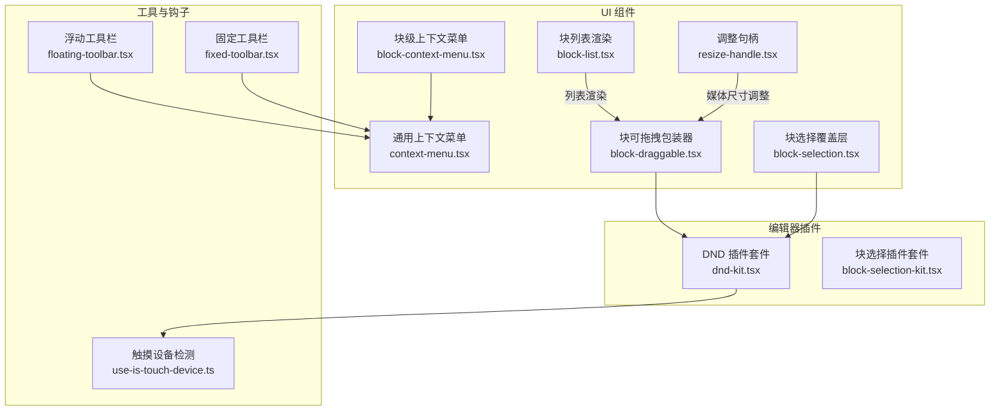
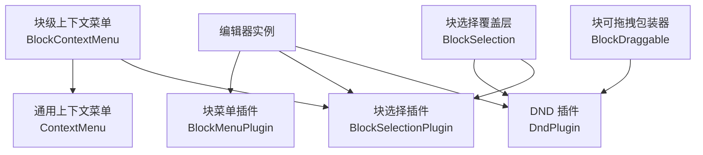
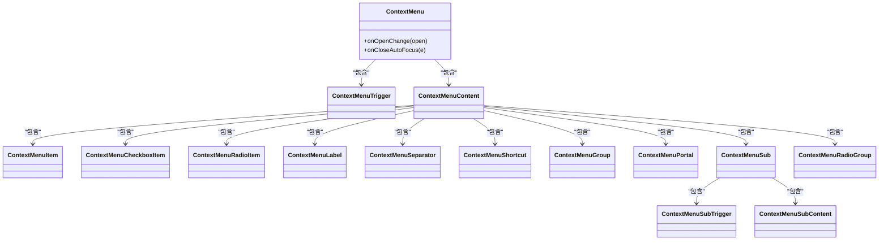
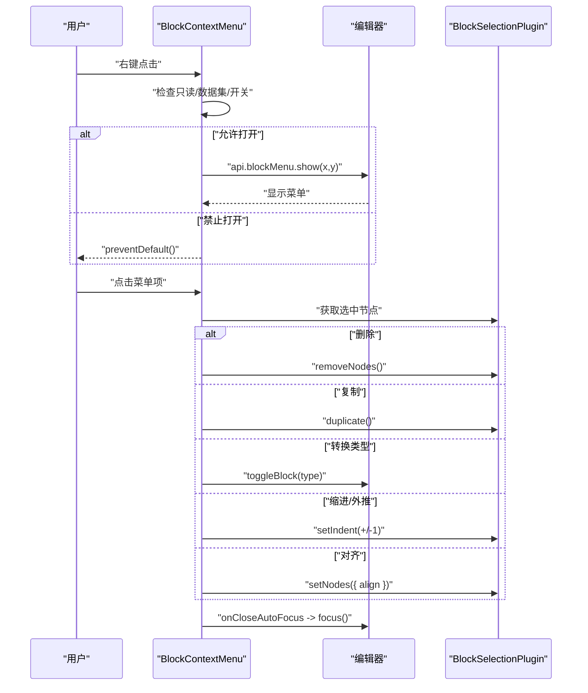
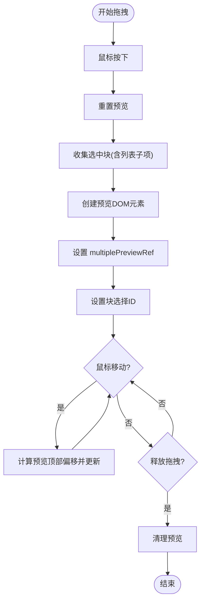
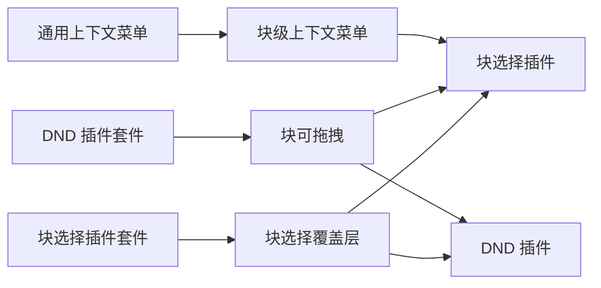

# 上下文菜单组件

<cite>
**本文档引用的文件**
- [src/components/ui/context-menu.tsx](file://src/components/ui/context-menu.tsx)
- [src/components/ui/block-context-menu.tsx](file://src/components/ui/block-context-menu.tsx)
- [src/components/ui/block-draggable.tsx](file://src/components/ui/block-draggable.tsx)
- [src/components/ui/block-selection.tsx](file://src/components/ui/block-selection.tsx)
- [src/components/ui/block-list.tsx](file://src/components/ui/block-list.tsx)
- [src/components/ui/resize-handle.tsx](file://src/components/ui/resize-handle.tsx)
- [src/components/editor/plugins/dnd-kit.tsx](file://src/components/editor/plugins/dnd-kit.tsx)
- [src/components/editor/plugins/block-selection-kit.tsx](file://src/components/editor/plugins/block-selection-kit.tsx)
- [src/hooks/use-is-touch-device.ts](file://src/hooks/use-is-touch-device.ts)
- [src/components/ui/floating-toolbar.tsx](file://src/components/ui/floating-toolbar.tsx)
- [src/components/ui/fixed-toolbar.tsx](file://src/components/ui/fixed-toolbar.tsx)
</cite>

## 目录
1. [简介](#简介)
2. [项目结构](#项目结构)
3. [核心组件](#核心组件)
4. [架构总览](#架构总览)
5. [详细组件分析](#详细组件分析)
6. [依赖关系分析](#依赖关系分析)
7. [性能考虑](#性能考虑)
8. [故障排除指南](#故障排除指南)
9. [结论](#结论)
10. [附录](#附录)

## 简介
本文件系统性地文档化编辑器中的上下文菜单与交互组件，包括通用上下文菜单、块级上下文菜单、块选择、拖拽处理、块列表以及调整句柄等。重点阐述组件的事件处理机制、状态管理、可拖拽实现与拖放逻辑、视觉反馈与用户体验、键盘导航与快捷键支持、响应式设计与触摸设备适配、可访问性特性与无障碍功能、与编辑器核心功能的集成方式、自定义配置与扩展方法，以及性能优化与最佳实践。

## 项目结构
围绕上下文菜单与交互组件的关键文件组织如下：
- 通用上下文菜单：基于 Radix UI 的封装，提供触发器、内容区、子菜单、复选/单选项、标签、分隔符、快捷键提示等。
- 块级上下文菜单：在编辑器中针对所选块显示操作（删除、复制、转换类型、缩进/外推、对齐）。
- 拖拽与放置：通过 DND 插件与工具函数实现块的拖拽预览、多选拖拽、放置线指示与拖放回调。
- 块选择：在可选区域渲染块级选区覆盖层，结合 DND 状态控制透明度与可见性。
- 列表渲染：针对不同列表样式（如待办）提供自定义渲染与标记。
- 调整句柄：媒体等节点的可调整尺寸与对齐布局。
- 集成插件：DND 提供者、块选择配置、触摸设备检测钩子、浮动/固定工具栏。

**图表来源**
- [src/components/ui/context-menu.tsx:1-253](file://src/components/ui/context-menu.tsx#L1-L253)
- [src/components/ui/block-context-menu.tsx:1-184](file://src/components/ui/block-context-menu.tsx#L1-L184)
- [src/components/ui/block-draggable.tsx:1-514](file://src/components/ui/block-draggable.tsx#L1-L514)
- [src/components/ui/block-selection.tsx:1-43](file://src/components/ui/block-selection.tsx#L1-L43)
- [src/components/ui/block-list.tsx:1-86](file://src/components/ui/block-list.tsx#L1-L86)
- [src/components/ui/resize-handle.tsx:1-89](file://src/components/ui/resize-handle.tsx#L1-L89)
- [src/components/editor/plugins/dnd-kit.tsx:1-28](file://src/components/editor/plugins/dnd-kit.tsx#L1-L28)
- [src/components/editor/plugins/block-selection-kit.tsx:1-27](file://src/components/editor/plugins/block-selection-kit.tsx#L1-L27)
- [src/hooks/use-is-touch-device.ts:1-27](file://src/hooks/use-is-touch-device.ts#L1-L27)
- [src/components/ui/floating-toolbar.tsx:1-87](file://src/components/ui/floating-toolbar.tsx#L1-L87)
- [src/components/ui/fixed-toolbar.tsx:1-18](file://src/components/ui/fixed-toolbar.tsx#L1-L18)

**章节来源**
- [src/components/ui/context-menu.tsx:1-253](file://src/components/ui/context-menu.tsx#L1-L253)
- [src/components/ui/block-context-menu.tsx:1-184](file://src/components/ui/block-context-menu.tsx#L1-L184)
- [src/components/ui/block-draggable.tsx:1-514](file://src/components/ui/block-draggable.tsx#L1-L514)
- [src/components/ui/block-selection.tsx:1-43](file://src/components/ui/block-selection.tsx#L1-L43)
- [src/components/ui/block-list.tsx:1-86](file://src/components/ui/block-list.tsx#L1-L86)
- [src/components/ui/resize-handle.tsx:1-89](file://src/components/ui/resize-handle.tsx#L1-L89)
- [src/components/editor/plugins/dnd-kit.tsx:1-28](file://src/components/editor/plugins/dnd-kit.tsx#L1-L28)
- [src/components/editor/plugins/block-selection-kit.tsx:1-27](file://src/components/editor/plugins/block-selection-kit.tsx#L1-L27)
- [src/hooks/use-is-touch-device.ts:1-27](file://src/hooks/use-is-touch-device.ts#L1-L27)
- [src/components/ui/floating-toolbar.tsx:1-87](file://src/components/ui/floating-toolbar.tsx#L1-L87)
- [src/components/ui/fixed-toolbar.tsx:1-18](file://src/components/ui/fixed-toolbar.tsx#L1-L18)

## 核心组件
- 通用上下文菜单：提供完整的上下文菜单骨架与样式变体，支持子菜单、复选/单选项、标签、分隔符与快捷键提示。
- 块级上下文菜单：在非触摸设备上拦截右键，根据当前块选择执行删除、复制、转换类型、缩进/外推、对齐等操作，并在关闭时自动聚焦回块选择。
- 块可拖拽包装器：为可拖拽块渲染拖拽手柄、拖拽预览、放置线；支持多选拖拽、列表子项展开、滚动补偿与视觉定位。
- 块选择覆盖层：在块被选中且非拖拽状态下显示半透明覆盖，提供视觉反馈。
- 列表渲染：根据列表类型渲染有序/无序列表及自定义标记（如待办）。
- 调整句柄：为媒体等节点提供四向调整句柄与居中/左/右对齐容器。
- DND 插件套件：启用 DND 提供者、滚动器与拖拽文件插入回调。
- 块选择插件套件：配置块选择行为（启用上下文菜单、可选元素类型过滤、渲染选区覆盖层）。

**章节来源**
- [src/components/ui/context-menu.tsx:96-135](file://src/components/ui/context-menu.tsx#L96-L135)
- [src/components/ui/block-context-menu.tsx:24-182](file://src/components/ui/block-context-menu.tsx#L24-L182)
- [src/components/ui/block-draggable.tsx:30-187](file://src/components/ui/block-draggable.tsx#L30-L187)
- [src/components/ui/block-selection.tsx:23-42](file://src/components/ui/block-selection.tsx#L23-L42)
- [src/components/ui/block-list.tsx:32-53](file://src/components/ui/block-list.tsx#L32-L53)
- [src/components/ui/resize-handle.tsx:42-64](file://src/components/ui/resize-handle.tsx#L42-L64)
- [src/components/editor/plugins/dnd-kit.tsx:10-27](file://src/components/editor/plugins/dnd-kit.tsx#L10-L27)
- [src/components/editor/plugins/block-selection-kit.tsx:8-26](file://src/components/editor/plugins/block-selection-kit.tsx#L8-L26)

## 架构总览
上下文菜单与交互组件围绕 Plate/React 编辑器生态构建，通过插件配置与渲染钩子实现功能扩展。DND 插件提供拖拽能力，块选择插件提供选区与上下文菜单支持，UI 层组件负责事件绑定、状态切换与视觉反馈。

**图表来源**
- [src/components/ui/block-context-menu.tsx:24-29](file://src/components/ui/block-context-menu.tsx#L24-L29)
- [src/components/ui/block-draggable.tsx:72-87](file://src/components/ui/block-draggable.tsx#L72-L87)
- [src/components/ui/block-selection.tsx:23-25](file://src/components/ui/block-selection.tsx#L23-L25)
- [src/components/editor/plugins/dnd-kit.tsx:10-11](file://src/components/editor/plugins/dnd-kit.tsx#L10-L11)
- [src/components/editor/plugins/block-selection-kit.tsx:8-9](file://src/components/editor/plugins/block-selection-kit.tsx#L8-L9)

## 详细组件分析

### 通用上下文菜单（ContextMenu）
- 设计要点
  - 使用 Radix UI 原子组件组合，提供 Root、Trigger、Content、Item、CheckboxItem、RadioItem、Label、Separator、Shortcut、Group、Portal、Sub、SubContent、SubTrigger、RadioGroup 等。
  - 通过数据属性 slot 标识组件槽位，便于主题与样式定制。
  - 支持变体（默认/破坏性）、内嵌缩进、子菜单展开动画与侧边滑入/缩放过渡。
- 事件与状态
  - Content 支持 onOpenChange 与 onCloseAutoFocus，用于控制打开状态与焦点恢复。
  - Item 支持禁用态、破坏性样式与指示器图标。
- 视觉反馈
  - 动画与阴影、边框、背景色与前景色遵循 Popover 主题变量。
- 可访问性
  - 使用语义化的触发器与内容容器，保持键盘可达性与焦点管理。

**图表来源**
- [src/components/ui/context-menu.tsx:9-252](file://src/components/ui/context-menu.tsx#L9-L252)

**章节来源**
- [src/components/ui/context-menu.tsx:9-252](file://src/components/ui/context-menu.tsx#L9-L252)

### 块级上下文菜单（BlockContextMenu）
- 设计要点
  - 在非触摸设备上拦截右键菜单，检查只读、编辑器数据集与开关标识，决定是否允许打开。
  - 打开后渲染包含删除、复制、转换类型、缩进/外推、对齐等操作的菜单组。
  - 通过 BlockSelectionPlugin 获取选中节点集合，批量应用变换（删除、复制、设置缩进、设置对齐）。
- 事件处理机制
  - onContextMenu 中根据条件阻止默认行为并延时触发块菜单显示。
  - onOpenChange 关闭时调用隐藏 API。
  - onCloseAutoFocus 将焦点恢复到块选择。
- 状态管理
  - 通过 usePlateState('readOnly') 与 usePluginOption(BlockMenuPlugin, 'openId') 控制显示与只读状态。
  - isOpen 由 openId 与固定 ID 对比确定。
- 视觉反馈与体验
  - 菜单宽度固定，子菜单与快捷键提示增强可用性。
  - 触摸设备直接透传 children，避免误触。

**图表来源**
- [src/components/ui/block-context-menu.tsx:73-179](file://src/components/ui/block-context-menu.tsx#L73-L179)

**章节来源**
- [src/components/ui/block-context-menu.tsx:24-182](file://src/components/ui/block-context-menu.tsx#L24-L182)

### 块可拖拽包装器（BlockDraggable）
- 设计要点
  - 渲染拖拽手柄与拖拽预览，支持多选拖拽与列表子项展开。
  - 在块容器外层渲染“侧槽”与“拖拽按钮”，计算按钮顶部位置以匹配滚动与边距。
  - 通过 useDraggable 与 useDropLine 提供拖拽状态与放置线。
- 拖拽处理流程
  - 鼠标按下：重置预览、收集当前或已选块集合（含列表子项），创建预览 DOM 元素并设置 multiplePreviewRef。
  - 鼠标移动：根据预览与当前块计算顶部偏移，更新预览位置。
  - 鼠标抬起：清理预览。
  - 拖放回调：将拖拽项 ID 添加到块选择，并重置预览。
- 视觉反馈
  - 拖拽时降低不透明度；预览初始隐藏，进入拖拽时显示；放置线上下边框高亮。
- 性能与复杂度
  - 预览元素克隆与滚动补偿涉及 DOM 查询与样式计算，建议在大文档中限制同时拖拽数量或使用虚拟化策略。

**图表来源**
- [src/components/ui/block-draggable.tsx:247-324](file://src/components/ui/block-draggable.tsx#L247-L324)
- [src/components/ui/block-draggable.tsx:358-456](file://src/components/ui/block-draggable.tsx#L358-L456)
- [src/components/ui/block-draggable.tsx:458-504](file://src/components/ui/block-draggable.tsx#L458-L504)

**章节来源**
- [src/components/ui/block-draggable.tsx:30-187](file://src/components/ui/block-draggable.tsx#L30-L187)

### 块选择覆盖层（BlockSelection）
- 设计要点
  - 基于 useBlockSelected 与 DndPlugin 的 isDragging 状态，动态控制覆盖层透明度。
  - 过滤表格与行节点，避免在不可选区域渲染。
- 视觉反馈
  - 半透明背景色与过渡动画，仅在非拖拽时显示，提升选择可视性。

**章节来源**
- [src/components/ui/block-selection.tsx:23-42](file://src/components/ui/block-selection.tsx#L23-L42)

### 块列表渲染（BlockList）
- 设计要点
  - 根据列表样式类型渲染有序/无序列表，支持自定义标记与列表项渲染。
  - 待办列表提供复选框与完成态样式。
- 交互
  - 复选框属性由列表插件提供，受只读状态影响。

**章节来源**
- [src/components/ui/block-list.tsx:32-85](file://src/components/ui/block-list.tsx#L32-L85)

### 调整句柄（ResizeHandle）
- 设计要点
  - 提供四向调整句柄与可选对齐容器，支持只读模式隐藏。
  - 通过状态钩子与变体类控制方向与悬停效果。
- 适用场景
  - 媒体节点的宽高调整与居中/左右对齐布局。

**章节来源**
- [src/components/ui/resize-handle.tsx:42-88](file://src/components/ui/resize-handle.tsx#L42-L88)

### DND 插件套件（DndKit）
- 设计要点
  - 启用 DND 提供者与滚动器，配置拖拽文件插入回调，将文件插入到占位符插件。
  - 通过 render aboveNodes 注入 BlockDraggable 包装器，实现全局拖拽能力。
- 集成点
  - 与编辑器初始化流程集成，确保 DND 提供者在 Slate 树之上渲染。

**章节来源**
- [src/components/editor/plugins/dnd-kit.tsx:10-27](file://src/components/editor/plugins/dnd-kit.tsx#L10-L27)

### 块选择插件套件（BlockSelectionKit）
- 设计要点
  - 启用上下文菜单、定义可选元素类型过滤（排除列、代码行、表格单元）。
  - 在可选区域下方渲染 BlockSelection 覆盖层，实现选择可视化。
- 配置
  - 通过 render.belowRootNodes 条件渲染，仅对具有特定类名的节点生效。

**章节来源**
- [src/components/editor/plugins/block-selection-kit.tsx:8-26](file://src/components/editor/plugins/block-selection-kit.tsx#L8-L26)

### 触摸设备适配（useIsTouchDevice）
- 设计要点
  - 通过监听窗口 resize 与检测触摸能力，判断当前设备是否为触摸设备。
  - 在块级上下文菜单中用于决定是否透传 children，避免误触。

**章节来源**
- [src/hooks/use-is-touch-device.ts:5-25](file://src/hooks/use-is-touch-device.ts#L5-L25)

### 工具栏集成（浮动/固定工具栏）
- 设计要点
  - 浮动工具栏根据编辑器焦点与悬浮状态自动定位，避免遮挡链接输入或 AI 对话。
  - 固定工具栏提供粘性定位与模糊背景，适合页面顶部展示。
- 与上下文菜单的关系
  - 两者均基于编辑器状态与事件进行显示/隐藏控制，提升工具条可用性。

**章节来源**
- [src/components/ui/floating-toolbar.tsx:36-64](file://src/components/ui/floating-toolbar.tsx#L36-L64)
- [src/components/ui/fixed-toolbar.tsx:7-16](file://src/components/ui/fixed-toolbar.tsx#L7-L16)

## 依赖关系分析
- 组件耦合
  - BlockContextMenu 依赖通用上下文菜单与块选择插件；BlockDraggable 依赖 DND 插件与块选择插件；BlockSelection 依赖 DND 插件与块选择插件。
- 外部依赖
  - Radix UI（上下文菜单）、Plate/DnD/Selection/Floating 插件生态、Lucide 图标库、class-variance-authority 样式变体。
- 潜在循环依赖
  - 当前文件间未见直接循环导入；插件配置通过 render 钩子注入，避免运行时循环。

**图表来源**
- [src/components/ui/block-context-menu.tsx:24-29](file://src/components/ui/block-context-menu.tsx#L24-L29)
- [src/components/ui/block-draggable.tsx:72-87](file://src/components/ui/block-draggable.tsx#L72-L87)
- [src/components/ui/block-selection.tsx:23-25](file://src/components/ui/block-selection.tsx#L23-L25)
- [src/components/editor/plugins/dnd-kit.tsx:10-11](file://src/components/editor/plugins/dnd-kit.tsx#L10-L11)
- [src/components/editor/plugins/block-selection-kit.tsx:8-9](file://src/components/editor/plugins/block-selection-kit.tsx#L8-L9)

**章节来源**
- [src/components/ui/block-context-menu.tsx:24-29](file://src/components/ui/block-context-menu.tsx#L24-L29)
- [src/components/ui/block-draggable.tsx:72-87](file://src/components/ui/block-draggable.tsx#L72-L87)
- [src/components/ui/block-selection.tsx:23-25](file://src/components/ui/block-selection.tsx#L23-L25)
- [src/components/editor/plugins/dnd-kit.tsx:10-11](file://src/components/editor/plugins/dnd-kit.tsx#L10-L11)
- [src/components/editor/plugins/block-selection-kit.tsx:8-9](file://src/components/editor/plugins/block-selection-kit.tsx#L8-L9)

## 性能考虑
- 拖拽预览与 DOM 克隆
  - 预览元素克隆与滚动补偿涉及多次 DOM 查询与样式计算，建议在大文档中限制同时拖拽块数量或采用虚拟化策略。
- 多选拖拽
  - 扩展列表子项会增加 DOM 结构与克隆数量，应避免一次性拖拽过多层级深的列表。
- 状态更新
  - 预览位置与按钮顶部位置计算在鼠标移动时频繁触发，建议节流或使用 requestAnimationFrame 优化。
- 事件绑定
  - 拖拽手柄与预览容器的事件绑定需在组件卸载时清理，避免内存泄漏。

[本节为通用性能指导，无需特定文件来源]

## 故障排除指南
- 右键菜单未出现
  - 检查只读状态与数据集标志位，确认未被显式禁用。
  - 确认触摸设备检测返回 false，否则将透传 children。
- 拖拽无效
  - 确认路径层级与不可拖拽类型过滤规则；检查 DND 提供者是否正确注入。
  - 确保多选预览引用已设置，且预览元素已添加到 DOM。
- 选择覆盖层不显示
  - 检查 isDragging 状态与块选择状态；确认未处于表格/行节点。
- 快捷键冲突
  - 若存在全局快捷键，需在菜单打开时阻止默认行为或使用组合键避免冲突。

**章节来源**
- [src/components/ui/block-context-menu.tsx:73-88](file://src/components/ui/block-context-menu.tsx#L73-L88)
- [src/components/ui/block-draggable.tsx:33-65](file://src/components/ui/block-draggable.tsx#L33-L65)
- [src/components/ui/block-selection.tsx:23-32](file://src/components/ui/block-selection.tsx#L23-L32)

## 结论
上下文菜单与交互组件通过插件化架构与清晰的事件/状态分离，实现了丰富的块级操作与拖拽体验。通用上下文菜单提供一致的 UI 语义与可访问性基础，块级上下文菜单与拖拽包装器则针对编辑器场景进行了深度定制。配合块选择覆盖层与调整句柄，整体交互具备良好的视觉反馈与可用性。未来可在大文档场景下进一步优化拖拽预览与状态更新性能，并完善键盘导航与无障碍细节。

[本节为总结性内容，无需特定文件来源]

## 附录
- 自定义配置与扩展
  - 通过插件选项扩展块选择行为（如可选类型、上下文菜单开关）。
  - 在 DND 插件中注册自定义拖拽文件处理逻辑。
  - 使用样式变体与数据属性 slot 定制上下文菜单外观。
- 最佳实践
  - 避免在不可拖拽节点上渲染手柄；在触摸设备上谨慎启用右键菜单。
  - 对频繁触发的计算进行节流或去抖；合理管理预览 DOM 生命周期。
  - 为关键操作提供键盘快捷键与屏幕阅读器友好的 ARIA 标签。

[本节为通用指导，无需特定文件来源]