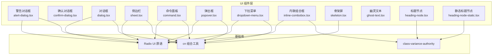
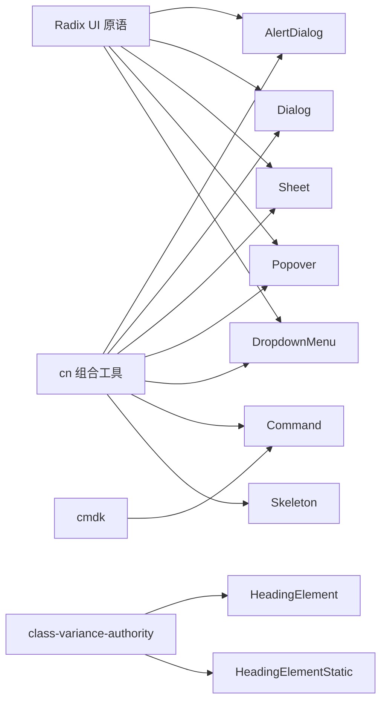
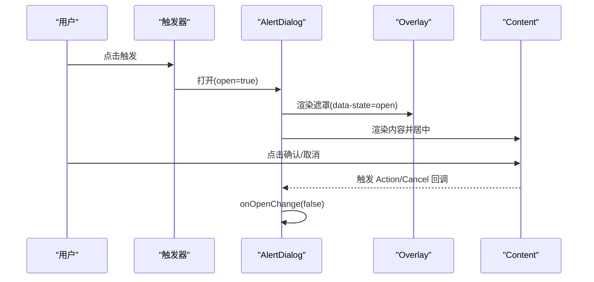
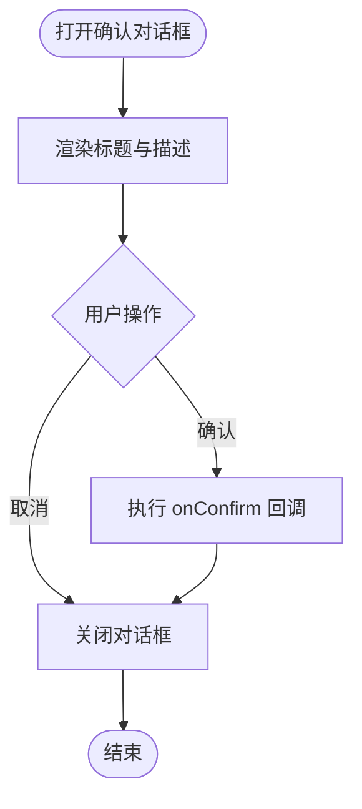
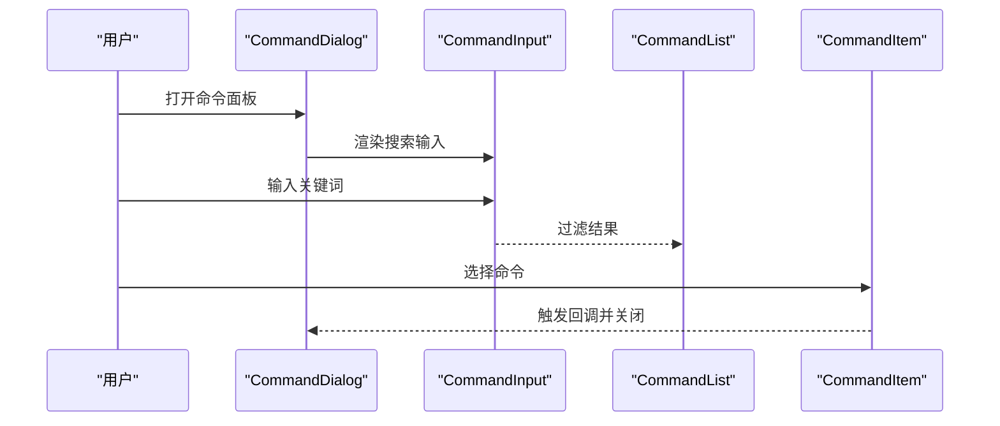
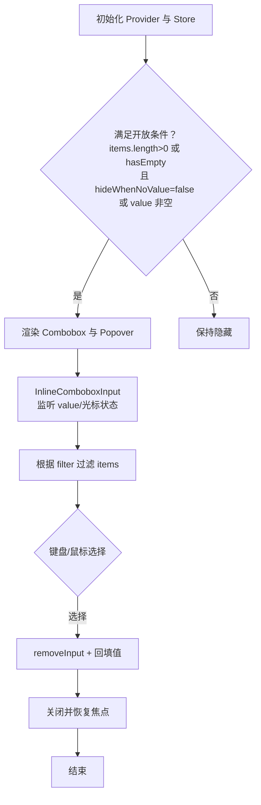
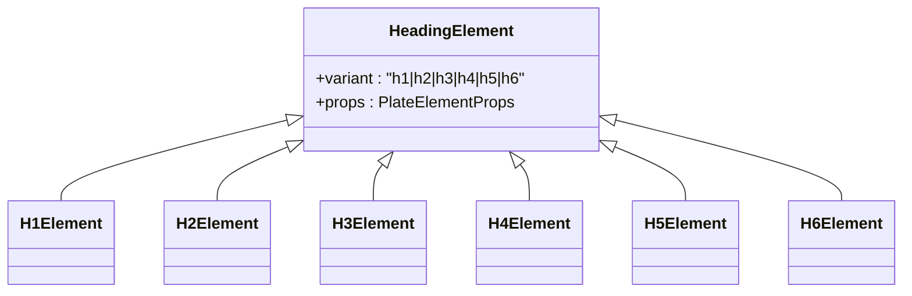
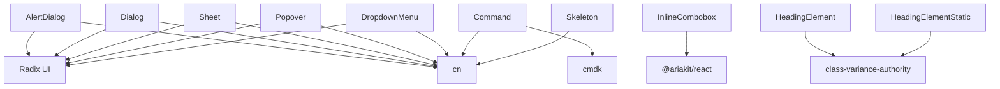

# 专用组件

<cite>
**本文引用的文件**
- [src/components/ui/alert-dialog.tsx](file://src/components/ui/alert-dialog.tsx)
- [src/components/ui/confirm-dialog.tsx](file://src/components/ui/confirm-dialog.tsx)
- [src/components/ui/dialog.tsx](file://src/components/ui/dialog.tsx)
- [src/components/ui/sheet.tsx](file://src/components/ui/sheet.tsx)
- [src/components/ui/command.tsx](file://src/components/ui/command.tsx)
- [src/components/ui/popover.tsx](file://src/components/ui/popover.tsx)
- [src/components/ui/dropdown-menu.tsx](file://src/components/ui/dropdown-menu.tsx)
- [src/components/ui/inline-combobox.tsx](file://src/components/ui/inline-combobox.tsx)
- [src/components/ui/skeleton.tsx](file://src/components/ui/skeleton.tsx)
- [src/components/ui/ghost-text.tsx](file://src/components/ui/ghost-text.tsx)
- [src/components/ui/heading-node.tsx](file://src/components/ui/heading-node.tsx)
- [src/components/ui/heading-node-static.tsx](file://src/components/ui/heading-node-static.tsx)
</cite>

## 目录
1. [简介](#简介)
2. [项目结构](#项目结构)
3. [核心组件](#核心组件)
4. [架构总览](#架构总览)
5. [详细组件分析](#详细组件分析)
6. [依赖关系分析](#依赖关系分析)
7. [性能考量](#性能考量)
8. [故障排查指南](#故障排查指南)
9. [结论](#结论)
10. [附录](#附录)

## 简介
本文件系统性梳理并文档化本仓库中的专用组件，包括：警告对话框、确认对话框、侧边栏、命令面板、弹出框、下拉菜单、内联组合框、骨架屏、幽灵文本与标题节点。文档从设计目标、使用场景、配置项与自定义能力、动画与过渡、状态管理与数据绑定、可访问性与键盘交互、主题定制与样式覆盖、组合使用模式与最佳实践、性能优化与扩展开发等方面进行深入说明，并辅以可视化图示帮助理解。

## 项目结构
这些组件主要位于 src/components/ui 目录下，采用“原子化 + 语义化”封装策略，围绕 Radix UI 的可组合原语构建，结合 Tailwind 工具类与 cn 组合工具实现一致的外观与行为。

图表来源
- [src/components/ui/alert-dialog.tsx:1-196](file://src/components/ui/alert-dialog.tsx#L1-L196)
- [src/components/ui/dialog.tsx:1-158](file://src/components/ui/dialog.tsx#L1-L158)
- [src/components/ui/sheet.tsx:1-144](file://src/components/ui/sheet.tsx#L1-L144)
- [src/components/ui/popover.tsx:1-90](file://src/components/ui/popover.tsx#L1-L90)
- [src/components/ui/dropdown-menu.tsx:1-258](file://src/components/ui/dropdown-menu.tsx#L1-L258)
- [src/components/ui/command.tsx:1-184](file://src/components/ui/command.tsx#L1-L184)
- [src/components/ui/inline-combobox.tsx:1-436](file://src/components/ui/inline-combobox.tsx#L1-L436)
- [src/components/ui/skeleton.tsx:1-14](file://src/components/ui/skeleton.tsx#L1-L14)
- [src/components/ui/heading-node.tsx:1-59](file://src/components/ui/heading-node.tsx#L1-L59)
- [src/components/ui/heading-node-static.tsx:1-72](file://src/components/ui/heading-node-static.tsx#L1-L72)

章节来源
- [src/components/ui/alert-dialog.tsx:1-196](file://src/components/ui/alert-dialog.tsx#L1-L196)
- [src/components/ui/dialog.tsx:1-158](file://src/components/ui/dialog.tsx#L1-L158)
- [src/components/ui/sheet.tsx:1-144](file://src/components/ui/sheet.tsx#L1-L144)
- [src/components/ui/popover.tsx:1-90](file://src/components/ui/popover.tsx#L1-L90)
- [src/components/ui/dropdown-menu.tsx:1-258](file://src/components/ui/dropdown-menu.tsx#L1-L258)
- [src/components/ui/command.tsx:1-184](file://src/components/ui/command.tsx#L1-L184)
- [src/components/ui/inline-combobox.tsx:1-436](file://src/components/ui/inline-combobox.tsx#L1-L436)
- [src/components/ui/skeleton.tsx:1-14](file://src/components/ui/skeleton.tsx#L1-L14)
- [src/components/ui/heading-node.tsx:1-59](file://src/components/ui/heading-node.tsx#L1-L59)
- [src/components/ui/heading-node-static.tsx:1-72](file://src/components/ui/heading-node-static.tsx#L1-L72)

## 核心组件
- 警告对话框（AlertDialog）：基于 Radix UI 的可组合原语，提供遮罩、内容区、标题、描述、媒体区、操作按钮等子组件，支持尺寸与动画控制。
- 确认对话框（ConfirmDialog）：在警告对话框之上封装业务对话框，提供通用确认/取消流程与保存确认场景。
- 对话框（Dialog）：通用模态容器，支持关闭按钮、头部、底部等布局子组件。
- 侧边栏（Sheet）：抽屉式侧边栏，支持多方向滑入/滑出，带可选关闭按钮。
- 命令面板（Command）：基于 cmdk 的全局命令入口，配合 Dialog 使用，提供搜索输入、分组、条目与快捷键展示。
- 弹出框（Popover）：轻量浮层容器，支持对齐与偏移，常用于菜单或上下文面板。
- 下拉菜单（DropdownMenu）：完整的菜单体系，支持普通项、复选/单选项、分组、子菜单、快捷键等。
- 内联组合框（InlineCombobox）：编辑器内联自动完成输入，支持过滤、回填、键盘导航、Portal 渲染与协作定位。
- 骨架屏（Skeleton）：占位加载态，通过脉冲动画提示内容即将到达。
- 幽灵文本（GhostText）：占位/空实现，可用于编辑器占位或条件渲染。
- 标题节点（HeadingElement/H1-H6）：语义化标题渲染，支持多种变体与静态版本。

章节来源
- [src/components/ui/alert-dialog.tsx:1-196](file://src/components/ui/alert-dialog.tsx#L1-L196)
- [src/components/ui/confirm-dialog.tsx:1-150](file://src/components/ui/confirm-dialog.tsx#L1-L150)
- [src/components/ui/dialog.tsx:1-158](file://src/components/ui/dialog.tsx#L1-L158)
- [src/components/ui/sheet.tsx:1-144](file://src/components/ui/sheet.tsx#L1-L144)
- [src/components/ui/command.tsx:1-184](file://src/components/ui/command.tsx#L1-L184)
- [src/components/ui/popover.tsx:1-90](file://src/components/ui/popover.tsx#L1-L90)
- [src/components/ui/dropdown-menu.tsx:1-258](file://src/components/ui/dropdown-menu.tsx#L1-L258)
- [src/components/ui/inline-combobox.tsx:1-436](file://src/components/ui/inline-combobox.tsx#L1-L436)
- [src/components/ui/skeleton.tsx:1-14](file://src/components/ui/skeleton.tsx#L1-L14)
- [src/components/ui/ghost-text.tsx:1-6](file://src/components/ui/ghost-text.tsx#L1-L6)
- [src/components/ui/heading-node.tsx:1-59](file://src/components/ui/heading-node.tsx#L1-L59)
- [src/components/ui/heading-node-static.tsx:1-72](file://src/components/ui/heading-node-static.tsx#L1-L72)

## 架构总览
这些组件共享统一的底层基础设施：
- 可组合原语：AlertDialog、Dialog、Sheet、Popover、DropdownMenu 均基于 Radix UI，确保可访问性与跨平台一致性。
- 动画与过渡：通过 data-state 属性驱动的淡入/淡出、缩放、滑动与脉冲动画，形成统一的视觉反馈。
- 样式组合：使用 cn 组合工具与 Tailwind 类名，支持主题覆盖与变体扩展。
- 编辑器集成：内联组合框与标题节点面向富文本编辑器，提供协作、光标定位与静态渲染支持。

图表来源
- [src/components/ui/alert-dialog.tsx:1-196](file://src/components/ui/alert-dialog.tsx#L1-L196)
- [src/components/ui/dialog.tsx:1-158](file://src/components/ui/dialog.tsx#L1-L158)
- [src/components/ui/sheet.tsx:1-144](file://src/components/ui/sheet.tsx#L1-L144)
- [src/components/ui/popover.tsx:1-90](file://src/components/ui/popover.tsx#L1-L90)
- [src/components/ui/dropdown-menu.tsx:1-258](file://src/components/ui/dropdown-menu.tsx#L1-L258)
- [src/components/ui/command.tsx:1-184](file://src/components/ui/command.tsx#L1-L184)
- [src/components/ui/inline-combobox.tsx:1-436](file://src/components/ui/inline-combobox.tsx#L1-L436)
- [src/components/ui/skeleton.tsx:1-14](file://src/components/ui/skeleton.tsx#L1-L14)
- [src/components/ui/heading-node.tsx:1-59](file://src/components/ui/heading-node.tsx#L1-L59)
- [src/components/ui/heading-node-static.tsx:1-72](file://src/components/ui/heading-node-static.tsx#L1-L72)

## 详细组件分析

### 警告对话框（AlertDialog）
- 设计与用途
  - 用于关键风险提示、二次确认等高优先级场景，强调明确的行动选择与视觉权重。
- 结构与子组件
  - Root/Trigger/Portal/Overlay/Content/Header/Footer/Title/Description/Media/Action/Cancel
  - 支持 size 尺寸（default/sm），内置动画与布局适配。
- 配置与自定义
  - 通过 Content 的 data-size 控制尺寸；Overlay/Content 的 data-state 控制动画；Button 变体/尺寸透传。
- 动画与过渡
  - 打开/关闭：fade-in/zoom-in 与 fade-out/zoom-out；Portal 包裹保证层级与遮罩。
- 状态管理与数据绑定
  - 外部通过 open/onOpenChange 管理可见性；内部通过原语状态驱动动画。
- 可访问性与键盘交互
  - 基于 Radix UI 的可访问性基线，支持 Tab 切换、Esc 关闭、焦点管理。
- 主题定制与样式覆盖
  - 通过 className 与 data-slot 标记，结合 Tailwind/CSS 变体覆盖默认样式。
- 使用场景
  - 删除、危险操作、重要信息确认等。

图表来源
- [src/components/ui/alert-dialog.tsx:8-67](file://src/components/ui/alert-dialog.tsx#L8-L67)
- [src/components/ui/confirm-dialog.tsx:27-88](file://src/components/ui/confirm-dialog.tsx#L27-L88)

章节来源
- [src/components/ui/alert-dialog.tsx:1-196](file://src/components/ui/alert-dialog.tsx#L1-L196)
- [src/components/ui/confirm-dialog.tsx:1-150](file://src/components/ui/confirm-dialog.tsx#L1-L150)

### 确认对话框（ConfirmDialog）
- 设计与用途
  - 在警告对话框基础上封装业务确认流程，支持 destructive 场景与保存确认。
- 结构与子组件
  - 复用 AlertDialog 的 Header/Title/Description/Footer/Action/Cancel。
- 配置与自定义
  - title/description/confirmText/cancelText/variant(onConfirm/onCancel)。
- 使用场景
  - 删除资源、离开页面未保存、强制覆盖等。

图表来源
- [src/components/ui/confirm-dialog.tsx:27-88](file://src/components/ui/confirm-dialog.tsx#L27-L88)

章节来源
- [src/components/ui/confirm-dialog.tsx:1-150](file://src/components/ui/confirm-dialog.tsx#L1-L150)

### 对话框（Dialog）
- 设计与用途
  - 通用模态容器，适合设置页、表单、详情等非高危提示。
- 结构与子组件
  - Overlay/Content/Header/Footer/Title/Description/Close。
- 配置与自定义
  - showCloseButton 控制关闭按钮显示；支持自定义 Footer 行为。
- 使用场景
  - 设置、编辑、查看详情等。

章节来源
- [src/components/ui/dialog.tsx:1-158](file://src/components/ui/dialog.tsx#L1-L158)

### 侧边栏（Sheet）
- 设计与用途
  - 抽屉式侧边栏，适合导航、筛选、设置面板等需要保留主内容区域的场景。
- 结构与子组件
  - Overlay/Content(支持 top/right/bottom/left)/Header/Footer/Title/Description/Close。
- 配置与自定义
  - side 控制滑入方向；showCloseButton 控制关闭按钮。
- 动画与过渡
  - slide-in/out-to-* 方向动画，配合透明度与阴影。
- 使用场景
  - 移动端导航、分类筛选、快速设置。

章节来源
- [src/components/ui/sheet.tsx:1-144](file://src/components/ui/sheet.tsx#L1-L144)

### 命令面板（Command）
- 设计与用途
  - 全局命令入口，提供搜索与快速执行能力。
- 结构与子组件
  - Command/CommandDialog/CommandInput/CommandList/CommandEmpty/CommandGroup/CommandItem/CommandSeparator/CommandShortcut。
- 配置与自定义
  - CommandDialog 支持 title/description/showCloseButton；CommandInput 内置搜索图标与占位符。
- 动画与过渡
  - 基于 Dialog 的动画；CommandList 滚动容器。
- 使用场景
  - 快捷命令、功能导航、搜索入口。

图表来源
- [src/components/ui/command.tsx:31-59](file://src/components/ui/command.tsx#L31-L59)

章节来源
- [src/components/ui/command.tsx:1-184](file://src/components/ui/command.tsx#L1-L184)

### 弹出框（Popover）
- 设计与用途
  - 轻量浮层，常用于上下文菜单、设置面板、提示等。
- 结构与子组件
  - Content/Trigger/Portal/Anchor/Header/Title/Description。
- 配置与自定义
  - align/offset 控制位置；支持 Header/Title/Description 布局。
- 动画与过渡
  - slide-in-from-* 与 fade/zoom 动画。
- 使用场景
  - 用户头像菜单、编辑器工具条、快捷设置。

章节来源
- [src/components/ui/popover.tsx:1-90](file://src/components/ui/popover.tsx#L1-L90)

### 下拉菜单（DropdownMenu）
- 设计与用途
  - 完整的菜单体系，支持分组、复选/单选、子菜单与快捷键。
- 结构与子组件
  - Content/Item/CheckboxItem/RadioGroup/RadioItem/Label/Separator/Shortcut/Sub/SubTrigger/SubContent。
- 配置与自定义
  - Item 支持 inset 与 variant(destructive)；Shortcut 展示快捷键文本。
- 动画与过渡
  - slide-in-from-* 与 fade/zoom 动画。
- 使用场景
  - 设置项、视图切换、编辑器上下文菜单。

章节来源
- [src/components/ui/dropdown-menu.tsx:1-258](file://src/components/ui/dropdown-menu.tsx#L1-L258)

### 内联组合框（InlineCombobox）
- 设计与用途
  - 富文本编辑器内的内联自动完成输入，支持关键词过滤、回填、键盘导航与协作定位。
- 结构与子组件
  - Provider/Combobox/Input(Content/Item/Empty/Group/GroupLabel/Row)。
- 配置与自定义
  - trigger/filter/hideWhenNoValue/showTrigger/value/setValue；默认过滤函数支持 group/keywords/label/value。
- 状态管理与数据绑定
  - 使用 useComboboxStore 管理 items/activeId/value；通过 removeInput 控制输入移除与焦点恢复。
- 动画与过渡
  - Portal 渲染与滚动容器，避免样式泄漏。
- 键盘交互
  - 上/下箭头循环选择；Backspace/左右箭头移动光标；Enter 选择后回填。
- 协作与定位
  - 基于编辑器路径计算插入点，仅允许元素创建者自动聚焦。
- 性能优化
  - React.memo/useCallback 与 React.startTransition；按需订阅 store 状态。
- 使用场景
  - @ 提及、: 表情、/ 命令、标签/链接选择等。

图表来源
- [src/components/ui/inline-combobox.tsx:178-210](file://src/components/ui/inline-combobox.tsx#L178-L210)
- [src/components/ui/inline-combobox.tsx:268-306](file://src/components/ui/inline-combobox.tsx#L268-L306)
- [src/components/ui/inline-combobox.tsx:323-365](file://src/components/ui/inline-combobox.tsx#L323-L365)

章节来源
- [src/components/ui/inline-combobox.tsx:1-436](file://src/components/ui/inline-combobox.tsx#L1-L436)

### 骨架屏（Skeleton）
- 设计与用途
  - 页面或卡片加载时的占位元素，通过脉冲动画缓解等待焦虑。
- 配置与自定义
  - 通过 className 自定义形状与颜色。
- 使用场景
  - 列表/网格加载、异步内容占位。

章节来源
- [src/components/ui/skeleton.tsx:1-14](file://src/components/ui/skeleton.tsx#L1-L14)

### 幽灵文本（GhostText）
- 设计与用途
  - 空实现占位，可用于条件渲染或编辑器占位。
- 使用场景
  - 条件占位、空状态占位。

章节来源
- [src/components/ui/ghost-text.tsx:1-6](file://src/components/ui/ghost-text.tsx#L1-L6)

### 标题节点（HeadingElement/H1-H6）
- 设计与用途
  - 语义化标题渲染，支持多种变体与静态版本，便于生成目录与文档结构。
- 结构与子组件
  - HeadingElement + H1/H2/H3/H4/H5/H6；静态版本支持锚点 id。
- 配置与自定义
  - variant 控制层级与样式；静态版本支持 id 锚点。
- 使用场景
  - 文档/笔记标题、目录生成、跳转锚点。

图表来源
- [src/components/ui/heading-node.tsx:21-59](file://src/components/ui/heading-node.tsx#L21-L59)
- [src/components/ui/heading-node-static.tsx:20-72](file://src/components/ui/heading-node-static.tsx#L20-L72)

章节来源
- [src/components/ui/heading-node.tsx:1-59](file://src/components/ui/heading-node.tsx#L1-L59)
- [src/components/ui/heading-node-static.tsx:1-72](file://src/components/ui/heading-node-static.tsx#L1-L72)

## 依赖关系分析
- 组件间耦合
  - ConfirmDialog 依赖 AlertDialog；CommandDialog 依赖 Dialog；其他组件均依赖各自原语 Root/Content/Portal。
- 外部依赖
  - Radix UI：可组合原语与可访问性基线。
  - cmdk：命令面板输入与匹配。
  - class-variance-authority：变体样式组合。
  - @ariakit/react：内联组合框与上下文存储。
- 潜在环路
  - 无直接环路；组件通过原语与工具函数解耦。
- 主题与样式
  - 统一通过 Tailwind 类名与 cn 组合，支持主题覆盖。

图表来源
- [src/components/ui/alert-dialog.tsx:1-196](file://src/components/ui/alert-dialog.tsx#L1-L196)
- [src/components/ui/dialog.tsx:1-158](file://src/components/ui/dialog.tsx#L1-L158)
- [src/components/ui/sheet.tsx:1-144](file://src/components/ui/sheet.tsx#L1-L144)
- [src/components/ui/popover.tsx:1-90](file://src/components/ui/popover.tsx#L1-L90)
- [src/components/ui/dropdown-menu.tsx:1-258](file://src/components/ui/dropdown-menu.tsx#L1-L258)
- [src/components/ui/command.tsx:1-184](file://src/components/ui/command.tsx#L1-L184)
- [src/components/ui/inline-combobox.tsx:1-436](file://src/components/ui/inline-combobox.tsx#L1-L436)
- [src/components/ui/skeleton.tsx:1-14](file://src/components/ui/skeleton.tsx#L1-L14)
- [src/components/ui/heading-node.tsx:1-59](file://src/components/ui/heading-node.tsx#L1-L59)
- [src/components/ui/heading-node-static.tsx:1-72](file://src/components/ui/heading-node-static.tsx#L1-L72)

章节来源
- [src/components/ui/alert-dialog.tsx:1-196](file://src/components/ui/alert-dialog.tsx#L1-L196)
- [src/components/ui/dialog.tsx:1-158](file://src/components/ui/dialog.tsx#L1-L158)
- [src/components/ui/sheet.tsx:1-144](file://src/components/ui/sheet.tsx#L1-L144)
- [src/components/ui/popover.tsx:1-90](file://src/components/ui/popover.tsx#L1-L90)
- [src/components/ui/dropdown-menu.tsx:1-258](file://src/components/ui/dropdown-menu.tsx#L1-L258)
- [src/components/ui/command.tsx:1-184](file://src/components/ui/command.tsx#L1-L184)
- [src/components/ui/inline-combobox.tsx:1-436](file://src/components/ui/inline-combobox.tsx#L1-L436)
- [src/components/ui/skeleton.tsx:1-14](file://src/components/ui/skeleton.tsx#L1-L14)
- [src/components/ui/heading-node.tsx:1-59](file://src/components/ui/heading-node.tsx#L1-L59)
- [src/components/ui/heading-node-static.tsx:1-72](file://src/components/ui/heading-node-static.tsx#L1-L72)

## 性能考量
- 动画与过渡
  - 使用 data-state 控制的 CSS 动画，避免 JavaScript 驱动的复杂动画；合理使用 duration 与 ease。
- 渲染与重绘
  - 内联组合框使用 Portal 减少样式泄漏与重排；列表滚动容器限制高度，避免全量渲染。
- 状态订阅
  - 仅在必要时订阅 store 状态；使用 React.startTransition 降低高优更新阻塞。
- 可访问性
  - 基于 Radix UI 的焦点管理与键盘事件，减少额外逻辑导致的性能损耗。
- 主题与样式
  - Tailwind 类名集中管理，避免运行时样式计算；通过变体组合减少重复样式。

## 故障排查指南
- 对话框无法关闭
  - 检查 open/onOpenChange 是否正确传递；确认 Overlay/Content 的 data-state 是否同步。
- 命令面板无响应
  - 确认 CommandDialog 的 showCloseButton 与 CommandInput 的事件绑定；检查过滤逻辑是否阻塞。
- 下拉菜单不显示
  - 检查 Portal 是否渲染；确认 items 是否为空；验证 inset/variant 属性。
- 内联组合框不出现
  - 检查 items 是否存在或 hasEmpty；确认 hideWhenNoValue 与 value 长度；验证 filter 返回值。
- 骨架屏不闪烁
  - 确认 animate-pulse 是否被覆盖；检查父容器是否有 overflow 隐藏动画。
- 标题锚点无效
  - 静态版本需提供 id；确保 DOM 中存在对应锚点元素。

章节来源
- [src/components/ui/alert-dialog.tsx:30-67](file://src/components/ui/alert-dialog.tsx#L30-L67)
- [src/components/ui/command.tsx:62-82](file://src/components/ui/command.tsx#L62-L82)
- [src/components/ui/dropdown-menu.tsx:54-83](file://src/components/ui/dropdown-menu.tsx#L54-L83)
- [src/components/ui/inline-combobox.tsx:195-210](file://src/components/ui/inline-combobox.tsx#L195-L210)
- [src/components/ui/skeleton.tsx:3-11](file://src/components/ui/skeleton.tsx#L3-L11)
- [src/components/ui/heading-node-static.tsx:24-36](file://src/components/ui/heading-node-static.tsx#L24-L36)

## 结论
本套专用组件以 Radix UI 为核心，结合 Tailwind 与变体系统，提供了高可访问性、强可定制与良好性能的一致体验。通过清晰的子组件划分与统一的动画/过渡策略，能够覆盖从编辑器内联输入到全局命令入口的广泛场景。建议在实际项目中遵循“最小可用 + 可组合”的原则，按需启用特性并做好主题与无障碍的统一治理。

## 附录
- 最佳实践
  - 优先使用语义化组件（如 AlertDialog/Dialog/Sheet/Popover/DropdownMenu/Command）而非自建模态。
  - 内联组合框应提供默认过滤函数与空状态提示。
  - 骨架屏与真实内容之间保持一致的尺寸与间距，避免抖动。
  - 标题节点在静态渲染时务必提供锚点 id，便于目录与跳转。
- 扩展开发
  - 新增组件建议基于现有原语封装，复用 cn 与 data-slot 标记，保持一致性。
  - 如需复杂交互，优先考虑组合现有组件，避免过度封装。
- 插件机制
  - 命令面板与下拉菜单支持子菜单与快捷键，可作为插件入口组织功能模块。