# 基础 UI 组件

<cite>
**本文引用的文件**
- [button.tsx](file://src/components/ui/button.tsx)
- [input.tsx](file://src/components/ui/input.tsx)
- [select.tsx](file://src/components/ui/select.tsx)
- [dialog.tsx](file://src/components/ui/dialog.tsx)
- [tooltip.tsx](file://src/components/ui/tooltip.tsx)
- [avatar.tsx](file://src/components/ui/avatar.tsx)
- [calendar.tsx](file://src/components/ui/calendar.tsx)
- [separator.tsx](file://src/components/ui/separator.tsx)
- [utils.ts](file://src/lib/utils.ts)
- [components.json](file://components.json)
</cite>

## 目录
1. [简介](#简介)
2. [项目结构](#项目结构)
3. [核心组件](#核心组件)
4. [架构总览](#架构总览)
5. [详细组件分析](#详细组件分析)
6. [依赖关系分析](#依赖关系分析)
7. [性能考量](#性能考量)
8. [故障排查指南](#故障排查指南)
9. [结论](#结论)
10. [附录](#附录)

## 简介
本文件系统性梳理 ynote-v2 中的基础 UI 组件，覆盖按钮、输入框、选择器、对话框、工具提示、头像、日历与分隔符等组件。内容包括：设计原则、实现细节、Props 接口、事件与状态管理、样式与主题支持、可访问性特性、组件组合与布局策略、最佳实践与常见问题。

## 项目结构
基础 UI 组件集中于 src/components/ui 目录，采用“按需封装 + Radix UI 原子能力”的方式，结合 class-variance-authority 实现变体风格，使用 Tailwind CSS 与 cn 工具进行样式合并与覆盖。组件遵循最小暴露原则，仅导出必要接口，并通过 data-slot 属性便于调试与测试。

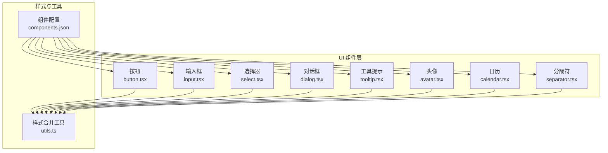

图表来源
- [button.tsx:1-65](file://src/components/ui/button.tsx#L1-L65)
- [input.tsx:1-22](file://src/components/ui/input.tsx#L1-L22)
- [select.tsx:1-191](file://src/components/ui/select.tsx#L1-L191)
- [dialog.tsx:1-158](file://src/components/ui/dialog.tsx#L1-L158)
- [tooltip.tsx:1-58](file://src/components/ui/tooltip.tsx#L1-L58)
- [avatar.tsx:1-110](file://src/components/ui/avatar.tsx#L1-L110)
- [calendar.tsx:1-220](file://src/components/ui/calendar.tsx#L1-L220)
- [separator.tsx:1-29](file://src/components/ui/separator.tsx#L1-L29)
- [utils.ts:1-7](file://src/lib/utils.ts#L1-L7)
- [components.json:1-21](file://components.json#L1-L21)

章节来源
- [components.json:1-21](file://components.json#L1-L21)

## 核心组件
- 按钮（Button）：基于 class-variance-authority 提供 variant/size 变体；支持 asChild 渲染为任意元素；内置聚焦态与禁用态视觉反馈。
- 输入框（Input）：统一边框、背景、选中与无效态样式；支持禁用与只读；聚焦时显示 ring。
- 选择器（Select）：由 Trigger、Content、Item、Label、Separator、ScrollUp/DownButton 等组成；支持尺寸、滚动、占位文本与多级分组。
- 对话框（Dialog）：Root/Portal/Overlay/Content/Header/Footer/Title/Description/Trigger/Close；支持关闭按钮与响应式布局。
- 工具提示（Tooltip）：Provider/Root/Trigger/Content；支持延迟、方位偏移与箭头。
- 头像（Avatar）：Root/Image/Fallback/Badge/Group/GroupCount；支持尺寸、遮罩、徽标与叠显。
- 日历（Calendar）：基于 react-day-picker；自定义导航按钮、单元格按钮、周序号、月份下拉等；支持范围选择与焦点同步。
- 分隔符（Separator）：水平/垂直方向；可装饰或语义化。

章节来源
- [button.tsx:1-65](file://src/components/ui/button.tsx#L1-L65)
- [input.tsx:1-22](file://src/components/ui/input.tsx#L1-L22)
- [select.tsx:1-191](file://src/components/ui/select.tsx#L1-L191)
- [dialog.tsx:1-158](file://src/components/ui/dialog.tsx#L1-L158)
- [tooltip.tsx:1-58](file://src/components/ui/tooltip.tsx#L1-L58)
- [avatar.tsx:1-110](file://src/components/ui/avatar.tsx#L1-L110)
- [calendar.tsx:1-220](file://src/components/ui/calendar.tsx#L1-L220)
- [separator.tsx:1-29](file://src/components/ui/separator.tsx#L1-L29)

## 架构总览
组件间通过以下方式协作：
- 共享样式工具：cn 合并类名，确保原子样式与自定义样式的稳定叠加。
- 主题与颜色体系：通过 Tailwind CSS 变量与暗色模式适配，组件内普遍使用前景/背景/强调色等语义变量。
- 可访问性：大量使用 aria-*、data-* 属性与语义标签，保证键盘可达与屏幕阅读器友好。
- 组合模式：容器型组件（如 Dialog、Select、Avatar）内部组合多个子组件，形成“组合即 API”。

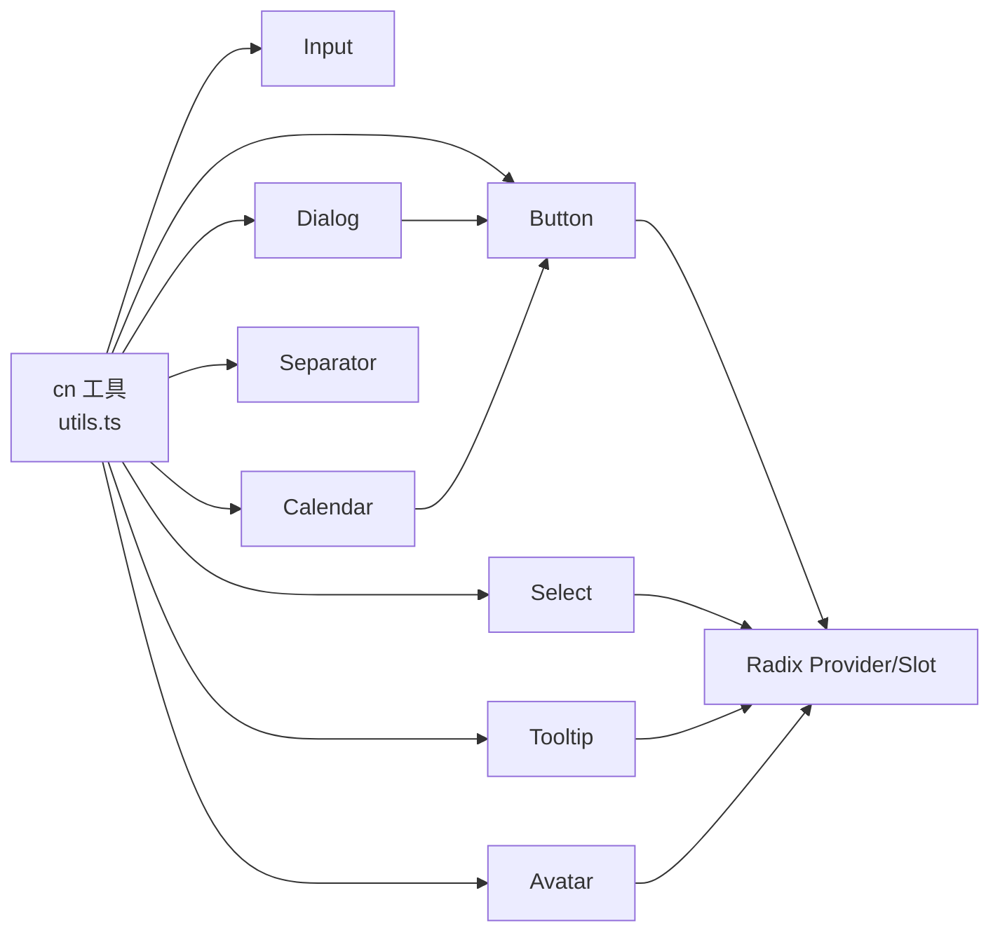

图表来源
- [utils.ts:1-7](file://src/lib/utils.ts#L1-L7)
- [button.tsx:1-65](file://src/components/ui/button.tsx#L1-L65)
- [input.tsx:1-22](file://src/components/ui/input.tsx#L1-L22)
- [select.tsx:1-191](file://src/components/ui/select.tsx#L1-L191)
- [dialog.tsx:1-158](file://src/components/ui/dialog.tsx#L1-L158)
- [tooltip.tsx:1-58](file://src/components/ui/tooltip.tsx#L1-L58)
- [avatar.tsx:1-110](file://src/components/ui/avatar.tsx#L1-L110)
- [calendar.tsx:1-220](file://src/components/ui/calendar.tsx#L1-L220)
- [separator.tsx:1-29](file://src/components/ui/separator.tsx#L1-L29)

## 详细组件分析

### 按钮（Button）
- 设计要点
  - 使用 class-variance-authority 定义 variant（默认/危险/描边/次要/幽灵/链接）与 size（默认/xs/sm/lg/icon 系列），并结合 data-slot、data-variant、data-size 标注。
  - 支持 asChild，将渲染委托给 Slot.Root，便于包裹 <Link> 或其他组件。
  - 聚焦态通过 ring 与 border-ring 强化可访问性；禁用态降低不透明度并阻止交互。
- Props 接口
  - 继承原生 button 的属性，新增 variant、size、asChild。
  - 变体与尺寸均提供默认值，便于开箱即用。
- 事件与状态
  - 内部无复杂状态；通过原生 DOM 事件与浏览器默认行为驱动交互。
- 样式与主题
  - 通过 Tailwind 变量与暗色模式前缀实现跨主题一致表现。
- 可访问性
  - 自动继承按钮语义；聚焦可见性增强；禁用态语义明确。
- 使用示例（路径）
  - [按钮基础用法:41-62](file://src/components/ui/button.tsx#L41-L62)
  - [变体与尺寸示例:10-38](file://src/components/ui/button.tsx#L10-L38)

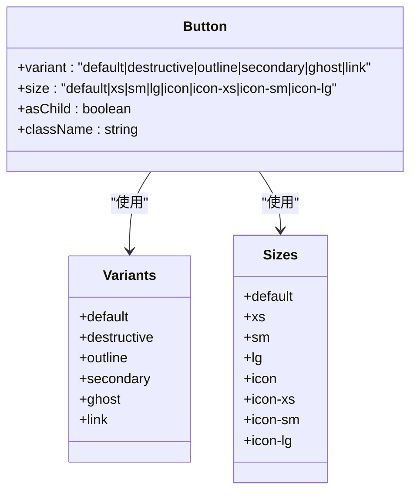

图表来源
- [button.tsx:7-39](file://src/components/ui/button.tsx#L7-L39)

章节来源
- [button.tsx:1-65](file://src/components/ui/button.tsx#L1-L65)

### 输入框（Input）
- 设计要点
  - 统一圆角、边框、背景与占位符颜色；聚焦时 ring-ring 强化边界。
  - 无效态使用 destructive 颜色与 ring，配合 aria-invalid 达成可访问性反馈。
  - 支持禁用态与文件上传样式（file:*）。
- Props 接口
  - 继承原生 input 的属性，新增 className。
- 事件与状态
  - 无内部状态；通过受控/非受控表单集成。
- 样式与主题
  - 暗色模式下通过 dark:* 前缀切换边框与背景。
- 可访问性
  - 保持原生 input 语义；聚焦可见性良好；错误态具备语义标记。
- 使用示例（路径）
  - [输入框基础用法:5-19](file://src/components/ui/input.tsx#L5-L19)

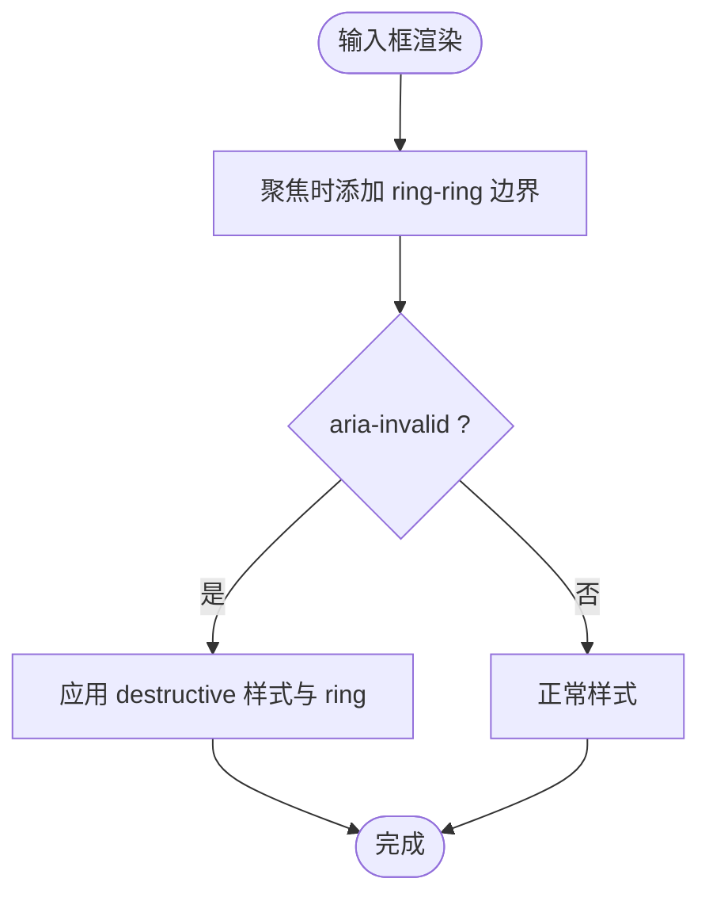

图表来源
- [input.tsx:5-19](file://src/components/ui/input.tsx#L5-L19)

章节来源
- [input.tsx:1-22](file://src/components/ui/input.tsx#L1-L22)

### 选择器（Select）
- 设计要点
  - 触发器支持 size（sm/default）、占位文本、下拉图标；内容区支持 popper 与 item-aligned 两种定位。
  - 项组件内置选中指示器与图标占位；支持分组、标签、分隔线与上下滚动按钮。
- Props 接口
  - SelectTrigger 新增 size；SelectContent 新增 position/align；SelectItem 新增 children；SelectLabel/SelectSeparator/SelectScrollUpButton/SelectScrollDownButton 为纯展示型。
- 事件与状态
  - 通过 Radix UI 状态管理；组件内部无额外状态。
- 样式与主题
  - 使用 popover/foreground 等语义色；暗色模式下提供对比度优化。
- 可访问性
  - 键盘导航、ARIA 属性齐全；滚动按钮与下拉区域具备语义。
- 使用示例（路径）
  - [触发器与内容:27-88](file://src/components/ui/select.tsx#L27-L88)
  - [项与指示器:103-128](file://src/components/ui/select.tsx#L103-L128)
  - [滚动按钮:143-177](file://src/components/ui/select.tsx#L143-L177)

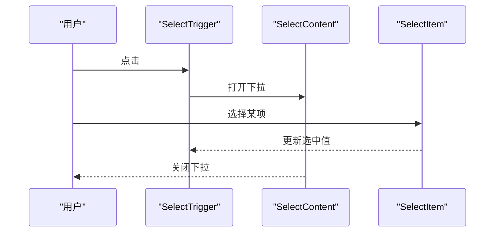

图表来源
- [select.tsx:27-88](file://src/components/ui/select.tsx#L27-L88)
- [select.tsx:103-128](file://src/components/ui/select.tsx#L103-L128)

章节来源
- [select.tsx:1-191](file://src/components/ui/select.tsx#L1-L191)

### 对话框（Dialog）
- 设计要点
  - Portal 包裹 Overlay 与 Content，居中布局，支持关闭按钮与响应式最大宽度。
  - Header/Footer 提供标题与操作区对齐；Overlay 支持动画入场/出场。
- Props 接口
  - DialogContent 新增 showCloseButton；DialogFooter 新增 showCloseButton 与 children。
- 事件与状态
  - 通过 Radix UI 控制打开/关闭；关闭按钮可作为触发器使用。
- 样式与主题
  - 背景卡片与阴影符合卡片设计语言；暗色模式下保持高对比度。
- 可访问性
  - 自动管理焦点；sr-only 文本辅助读屏。
- 使用示例（路径）
  - [内容与关闭按钮:49-81](file://src/components/ui/dialog.tsx#L49-L81)
  - [页眉与页脚:83-118](file://src/components/ui/dialog.tsx#L83-L118)

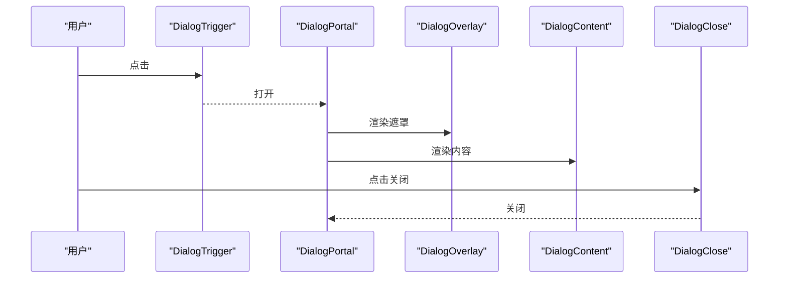

图表来源
- [dialog.tsx:15-31](file://src/components/ui/dialog.tsx#L15-L31)
- [dialog.tsx:49-81](file://src/components/ui/dialog.tsx#L49-L81)

章节来源
- [dialog.tsx:1-158](file://src/components/ui/dialog.tsx#L1-L158)

### 工具提示（Tooltip）
- 设计要点
  - Provider 统一延迟控制；Content 支持方位偏移与箭头；Portal 确保层级正确。
- Props 接口
  - TooltipProvider 新增 delayDuration；TooltipContent 新增 sideOffset。
- 事件与状态
  - 通过 Radix UI 管理显示/隐藏；无内部状态。
- 样式与主题
  - 前景色与背景色反差明显；动画过渡自然。
- 可访问性
  - 语义化触发器与内容；键盘可达。
- 使用示例（路径）
  - [提供者与内容:8-55](file://src/components/ui/tooltip.tsx#L8-L55)

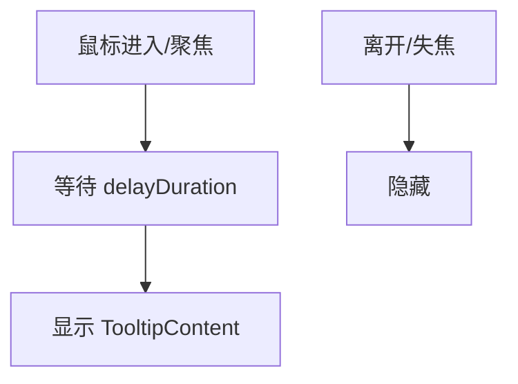

图表来源
- [tooltip.tsx:8-55](file://src/components/ui/tooltip.tsx#L8-L55)

章节来源
- [tooltip.tsx:1-58](file://src/components/ui/tooltip.tsx#L1-L58)

### 头像（Avatar）
- 设计要点
  - 支持 default/sm/lg 尺寸；Image/Fallback 组合实现加载与占位；Badge 支持状态徽标；Group/GroupCount 实现叠显与计数。
- Props 接口
  - Avatar 新增 size；Group/GroupCount 为容器型。
- 事件与状态
  - 无内部状态；通过外部数据控制显示。
- 样式与主题
  - 徽标与叠显通过相对定位与 z-index 实现；暗色模式下保持对比度。
- 可访问性
  - 语义化容器与文本；可替代图片时提供 Fallback。
- 使用示例（路径）
  - [根容器与图像:8-55](file://src/components/ui/avatar.tsx#L8-L55)
  - [徽标与叠显:57-100](file://src/components/ui/avatar.tsx#L57-L100)

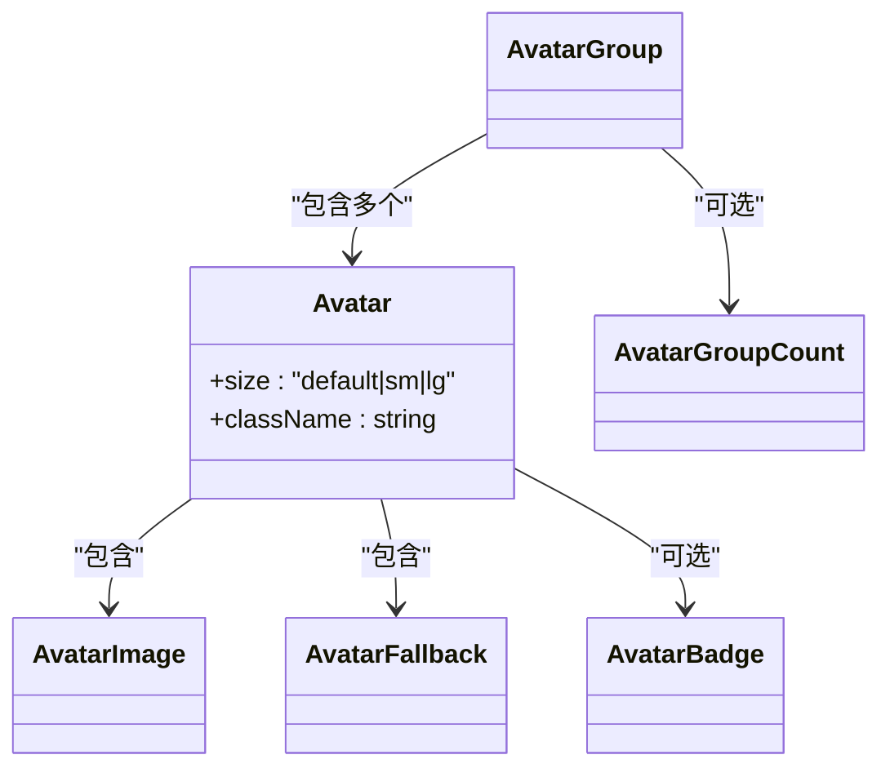

图表来源
- [avatar.tsx:8-100](file://src/components/ui/avatar.tsx#L8-L100)

章节来源
- [avatar.tsx:1-110](file://src/components/ui/avatar.tsx#L1-L110)

### 日历（Calendar）
- 设计要点
  - 基于 react-day-picker，默认类名与自定义类名并存；导航按钮复用 Button 变体；DayButton 使用 Button 幽灵样式与聚焦 ring。
  - 支持 captionLayout（label/dropdowns）、showOutsideDays、buttonVariant 等参数；自定义 Chevron 图标与 WeekNumber 单元格。
- Props 接口
  - Calendar 新增 buttonVariant、classNames、showOutsideDays、captionLayout、formatters、components。
- 事件与状态
  - 通过 DayPicker 内部状态管理日期选择；组件内部无额外状态。
- 样式与主题
  - 通过 buttonVariants 与语义色系统一风格；暗色模式下保持高对比度。
- 可访问性
  - 键盘导航、焦点同步；选中/范围/今天等状态具备视觉与语义提示。
- 使用示例（路径）
  - [日历主入口:17-179](file://src/components/ui/calendar.tsx#L17-L179)
  - [日按钮与聚焦:181-217](file://src/components/ui/calendar.tsx#L181-L217)

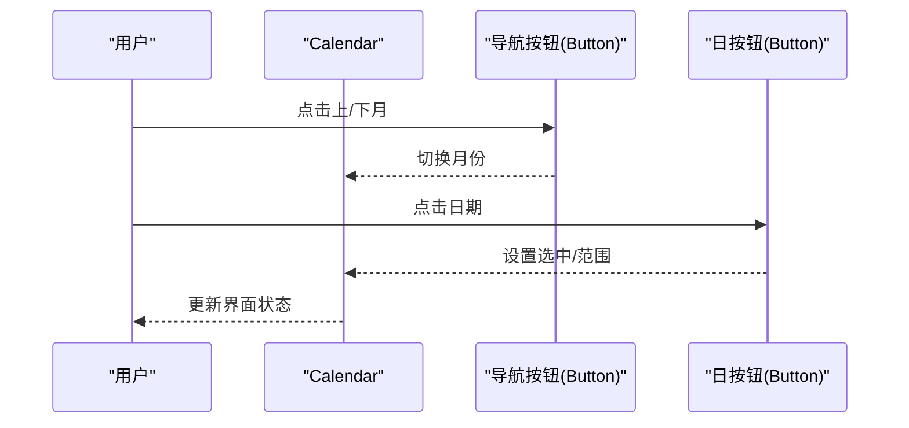

图表来源
- [calendar.tsx:17-179](file://src/components/ui/calendar.tsx#L17-L179)
- [calendar.tsx:181-217](file://src/components/ui/calendar.tsx#L181-L217)

章节来源
- [calendar.tsx:1-220](file://src/components/ui/calendar.tsx#L1-L220)

### 分隔符（Separator）
- 设计要点
  - 支持 horizontal/vertical 方向；decorative 控制是否作为语义元素。
- Props 接口
  - 继承原生 Separator.Root 属性，新增 orientation 与 decorative。
- 事件与状态
  - 无内部状态；纯展示组件。
- 样式与主题
  - 使用 border 色；根据方向切换宽高。
- 可访问性
  - 可设置为装饰性元素，避免冗余语义。
- 使用示例（路径）
  - [分隔符基础用法:8-26](file://src/components/ui/separator.tsx#L8-L26)

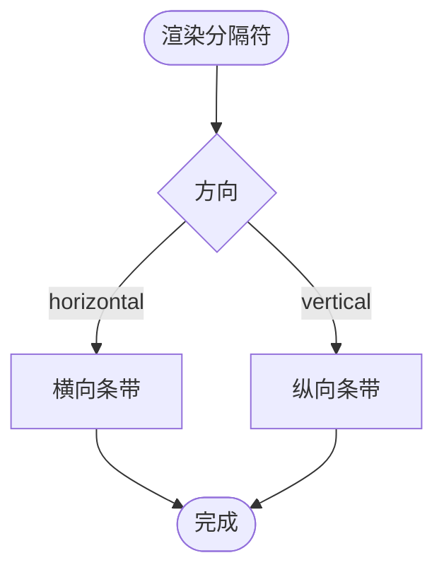

图表来源
- [separator.tsx:8-26](file://src/components/ui/separator.tsx#L8-L26)

章节来源
- [separator.tsx:1-29](file://src/components/ui/separator.tsx#L1-L29)

## 依赖关系分析
- 组件依赖
  - class-variance-authority：用于 Button 变体与尺寸。
  - radix-ui/*：用于 Button 的 Slot、Select/Dialog/Tooltip/Avatar/Separator 的原语组件。
  - lucide-react：图标（X/Chevron 系列、Save 等）。
  - react-day-picker：日历组件。
  - tailwind-merge/clsx：类名合并与冲突修复。
- 配置与别名
  - components.json 定义了组件别名与 Tailwind 配置，确保组件路径与样式工具的一致性。

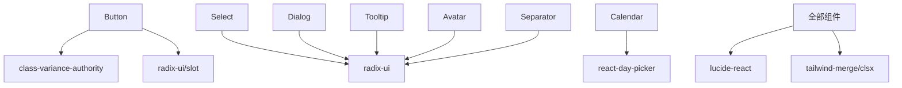

图表来源
- [button.tsx:1-6](file://src/components/ui/button.tsx#L1-L6)
- [select.tsx:1-7](file://src/components/ui/select.tsx#L1-L7)
- [dialog.tsx:1-7](file://src/components/ui/dialog.tsx#L1-L7)
- [tooltip.tsx:1-6](file://src/components/ui/tooltip.tsx#L1-L6)
- [avatar.tsx:1-6](file://src/components/ui/avatar.tsx#L1-L6)
- [calendar.tsx:1-15](file://src/components/ui/calendar.tsx#L1-L15)
- [components.json:12-20](file://components.json#L12-L20)

章节来源
- [components.json:1-21](file://components.json#L1-L21)

## 性能考量
- 渲染成本
  - 头像组叠显通过负间距与 z-index 实现，避免额外 DOM；日历通过 Button 复用减少重复样式。
- 动画与过渡
  - 对话框与工具提示使用轻量动画；选择器内容通过 Portal 渲染，避免层级回流。
- 样式合并
  - 使用 cn 合并类名，减少无效样式叠加；Tailwind CSS 变量提升主题一致性与可维护性。
- 可访问性与 SEO
  - 组件广泛使用 aria-* 与 sr-only 文本，有助于无障碍与 SEO。

## 故障排查指南
- 样式未生效
  - 检查组件是否正确引入 cn 工具；确认 Tailwind CSS 变量与暗色模式前缀是否启用。
  - 参考：[样式合并工具:4-6](file://src/lib/utils.ts#L4-L6)
- 变体/尺寸不生效
  - 确认传入的 variant/size 是否在组件定义范围内；检查 data-slot 与 data-variant/data-size 是否存在。
  - 参考：[按钮变体定义:10-38](file://src/components/ui/button.tsx#L10-L38)
- 对话框无法关闭
  - 确认 DialogClose 是否包裹在 DialogContent 内；检查 showCloseButton 与点击事件绑定。
  - 参考：[对话框关闭按钮:69-77](file://src/components/ui/dialog.tsx#L69-L77)
- 选择器项不显示选中
  - 检查 value/ defaultValue 与 SelectValue 是否匹配；确认 Item 的 children 与 ItemText。
  - 参考：[选择器项与指示器:103-128](file://src/components/ui/select.tsx#L103-L128)
- 日历焦点异常
  - 确认 DayButton 的 modifiers.focused 是否触发；检查组件是否在受控模式下更新。
  - 参考：[日历日按钮:181-217](file://src/components/ui/calendar.tsx#L181-L217)
- 工具提示不显示
  - 检查 TooltipProvider 的 delayDuration；确认 TooltipTrigger 与 TooltipContent 是否在同一 Portal 下。
  - 参考：[工具提示提供者与内容:8-55](file://src/components/ui/tooltip.tsx#L8-L55)

章节来源
- [utils.ts:1-7](file://src/lib/utils.ts#L1-L7)
- [button.tsx:10-38](file://src/components/ui/button.tsx#L10-L38)
- [dialog.tsx:69-77](file://src/components/ui/dialog.tsx#L69-L77)
- [select.tsx:103-128](file://src/components/ui/select.tsx#L103-L128)
- [calendar.tsx:181-217](file://src/components/ui/calendar.tsx#L181-L217)
- [tooltip.tsx:8-55](file://src/components/ui/tooltip.tsx#L8-L55)

## 结论
上述基础 UI 组件以 Radix UI 原语为核心，结合 class-variance-authority 与 Tailwind CSS，实现了高可定制、强可访问性的通用组件库。通过清晰的 Props 接口、合理的状态与事件模型、完善的样式与主题支持，以及良好的组合与布局策略，能够满足笔记、日记、想法等多场景需求。建议在业务组件中优先复用这些基础组件，以降低维护成本并提升一致性。

## 附录
- 组件别名与样式配置
  - 组件别名：components: "@/components"、ui: "@/components/ui"、utils: "@/lib/utils"、lib: "@/lib"、hooks: "@/hooks"
  - Tailwind CSS：src/app/globals.css；CSS 变量启用；基础色 neutral
  - 参考：[组件配置:12-20](file://components.json#L12-L20)

章节来源
- [components.json:1-21](file://components.json#L1-L21)