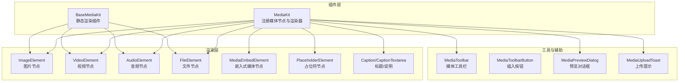
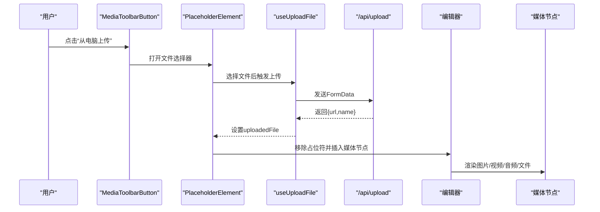
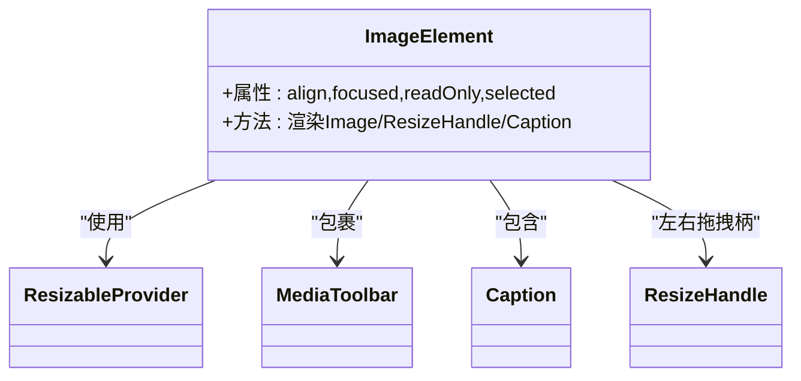
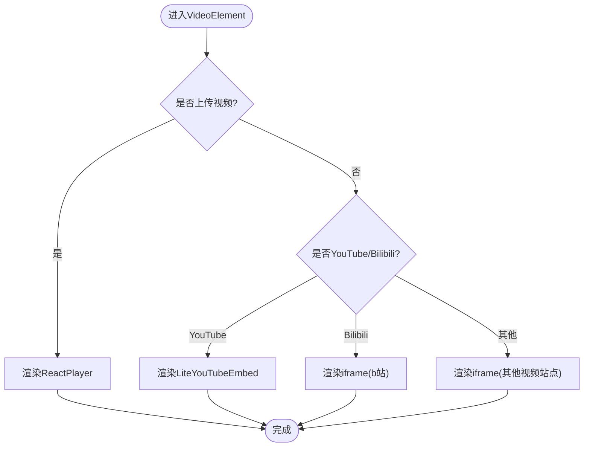
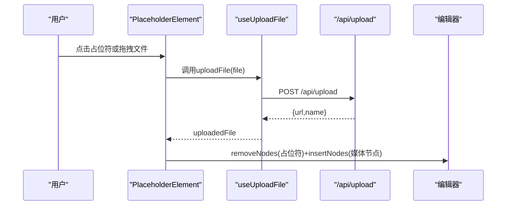
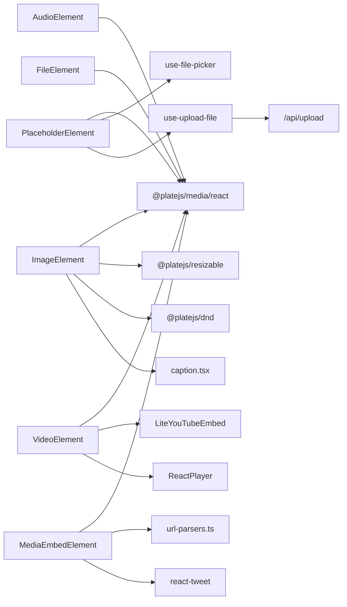

# 媒体组件

<cite>
**本文引用的文件**
- [src/components/ui/media-image-node.tsx](file://src/components/ui/media-image-node.tsx)
- [src/components/ui/media-video-node.tsx](file://src/components/ui/media-video-node.tsx)
- [src/components/ui/media-audio-node.tsx](file://src/components/ui/media-audio-node.tsx)
- [src/components/ui/media-file-node.tsx](file://src/components/ui/media-file-node.tsx)
- [src/components/ui/media-embed-node.tsx](file://src/components/ui/media-embed-node.tsx)
- [src/components/ui/media-placeholder-node.tsx](file://src/components/ui/media-placeholder-node.tsx)
- [src/components/ui/media-toolbar.tsx](file://src/components/ui/media-toolbar.tsx)
- [src/components/ui/media-toolbar-button.tsx](file://src/components/ui/media-toolbar-button.tsx)
- [src/components/ui/media-preview-dialog.tsx](file://src/components/ui/media-preview-dialog.tsx)
- [src/components/ui/media-upload-toast.tsx](file://src/components/ui/media-upload-toast.tsx)
- [src/components/ui/caption.tsx](file://src/components/ui/caption.tsx)
- [src/components/editor/plugins/media-base-kit.tsx](file://src/components/editor/plugins/media-base-kit.tsx)
- [src/components/editor/plugins/media-kit.tsx](file://src/components/editor/plugins/media-kit.tsx)
- [src/hooks/use-upload-file.ts](file://src/hooks/use-upload-file.ts)
- [src/lib/url-parsers.ts](file://src/lib/url-parsers.ts)
</cite>

## 目录
1. [简介](#简介)
2. [项目结构](#项目结构)
3. [核心组件](#核心组件)
4. [架构总览](#架构总览)
5. [详细组件分析](#详细组件分析)
6. [依赖关系分析](#依赖关系分析)
7. [性能考量](#性能考量)
8. [故障排查指南](#故障排查指南)
9. [结论](#结论)
10. [附录](#附录)

## 简介
本文件系统性地文档化了编辑器中的媒体组件体系，覆盖图片、视频、音频、文件与嵌入式媒体的渲染、占位符处理、上传与预览流程、尺寸调整与响应式适配、与后端的集成与存储策略、错误处理与回退机制、拖拽上传与批量处理、安全与访问控制、性能优化与缓存策略，以及可访问性与替代文本支持。目标是帮助开发者快速理解并扩展媒体能力。

## 项目结构
媒体组件主要由以下层次构成：
- 插件层：定义媒体节点类型、占位符与嵌入式媒体插件，并配置上传限制与渲染钩子。
- 渲染层：针对不同媒体类型的节点组件，负责 UI 呈现、交互（拖拽、缩放、工具栏）与第三方嵌入。
- 工具与辅助：占位符节点、上传进度与提示、预览对话框、标题/说明输入等。
- 编辑器集成：在基础与业务插件中注册节点组件与渲染器。

图表来源
- [src/components/editor/plugins/media-kit.tsx](file://src/components/editor/plugins/media-kit.tsx)
- [src/components/editor/plugins/media-base-kit.tsx](file://src/components/editor/plugins/media-base-kit.tsx)
- [src/components/ui/media-image-node.tsx](file://src/components/ui/media-image-node.tsx)
- [src/components/ui/media-video-node.tsx](file://src/components/ui/media-video-node.tsx)
- [src/components/ui/media-audio-node.tsx](file://src/components/ui/media-audio-node.tsx)
- [src/components/ui/media-file-node.tsx](file://src/components/ui/media-file-node.tsx)
- [src/components/ui/media-embed-node.tsx](file://src/components/ui/media-embed-node.tsx)
- [src/components/ui/media-placeholder-node.tsx](file://src/components/ui/media-placeholder-node.tsx)
- [src/components/ui/caption.tsx](file://src/components/ui/caption.tsx)
- [src/components/ui/media-toolbar.tsx](file://src/components/ui/media-toolbar.tsx)
- [src/components/ui/media-preview-dialog.tsx](file://src/components/ui/media-preview-dialog.tsx)
- [src/components/ui/media-upload-toast.tsx](file://src/components/ui/media-upload-toast.tsx)

章节来源
- [src/components/editor/plugins/media-kit.tsx](file://src/components/editor/plugins/media-kit.tsx)
- [src/components/editor/plugins/media-base-kit.tsx](file://src/components/editor/plugins/media-base-kit.tsx)

## 核心组件
- 图片节点：支持拖拽、可调整尺寸、带标题/说明、聚焦态高亮。
- 视频节点：支持本地上传播放与多平台嵌入（YouTube、Bilibili、Twitter 等），可调整尺寸与最小/最大宽度。
- 音频节点：内嵌音频控件与标题输入。
- 文件节点：下载链接、文件名展示与标题输入。
- 嵌入式媒体节点：统一解析与渲染第三方嵌入（YouTube、Bilibili、Twitter、其他视频站点）。
- 占位符节点：点击或拖拽选择文件，显示上传进度，替换为真实媒体节点。
- 工具栏：编辑链接、标题开关、删除媒体。
- 预览对话框：全屏查看、缩放、切换前后媒体。
- 上传提示：根据错误码弹出相应提示。

章节来源
- [src/components/ui/media-image-node.tsx](file://src/components/ui/media-image-node.tsx)
- [src/components/ui/media-video-node.tsx](file://src/components/ui/media-video-node.tsx)
- [src/components/ui/media-audio-node.tsx](file://src/components/ui/media-audio-node.tsx)
- [src/components/ui/media-file-node.tsx](file://src/components/ui/media-file-node.tsx)
- [src/components/ui/media-embed-node.tsx](file://src/components/ui/media-embed-node.tsx)
- [src/components/ui/media-placeholder-node.tsx](file://src/components/ui/media-placeholder-node.tsx)
- [src/components/ui/media-toolbar.tsx](file://src/components/ui/media-toolbar.tsx)
- [src/components/ui/media-preview-dialog.tsx](file://src/components/ui/media-preview-dialog.tsx)
- [src/components/ui/media-upload-toast.tsx](file://src/components/ui/media-upload-toast.tsx)

## 架构总览
媒体组件围绕 Plate.js 的插件与节点模型构建，通过 MediaKit 注册各媒体节点与渲染器，并在占位符节点中完成上传与替换流程；同时通过工具栏与预览对话框提供编辑与浏览体验。

图表来源
- [src/components/ui/media-toolbar-button.tsx](file://src/components/ui/media-toolbar-button.tsx)
- [src/components/ui/media-placeholder-node.tsx](file://src/components/ui/media-placeholder-node.tsx)
- [src/hooks/use-upload-file.ts](file://src/hooks/use-upload-file.ts)
- [src/components/editor/plugins/media-kit.tsx](file://src/components/editor/plugins/media-kit.tsx)

## 详细组件分析

### 图片组件（ImageElement）
- 功能要点
  - 支持拖拽、聚焦态高亮、可调整宽度与左右拖拽柄。
  - 内置标题/说明输入，支持对齐与只读模式。
- 关键实现
  - 使用 Plate 的媒体状态与可调整容器，结合自定义拖拽句柄与工具栏。
  - 通过属性传递 alt 作为替代文本，便于可访问性。
- 尺寸与响应式
  - 宽度由可调整容器控制，图片对象填充容器，保持圆角与边距。
- 可访问性
  - 通过 alt 属性提供替代文本；聚焦态高亮提升键盘导航体验。

图表来源
- [src/components/ui/media-image-node.tsx](file://src/components/ui/media-image-node.tsx)
- [src/components/ui/media-toolbar.tsx](file://src/components/ui/media-toolbar.tsx)
- [src/components/ui/caption.tsx](file://src/components/ui/caption.tsx)

章节来源
- [src/components/ui/media-image-node.tsx](file://src/components/ui/media-image-node.tsx)
- [src/components/ui/caption.tsx](file://src/components/ui/caption.tsx)

### 视频组件（VideoElement）
- 功能要点
  - 支持本地上传播放（ReactPlayer）、YouTube 嵌入（LiteYouTubeEmbed）、Bilibili 嵌入（iframe）。
  - 可调整尺寸，Twitter 嵌入宽度有约束。
- 关键实现
  - 使用媒体状态解析 embed/provider/url，按条件渲染不同嵌入方式。
  - 编辑器挂载后才渲染上传视频，避免 SSR 不一致。
- 尺寸与响应式
  - 统一使用 aspect-video 与相对宽高比，确保嵌入内容比例正确。

图表来源
- [src/components/ui/media-video-node.tsx](file://src/components/ui/media-video-node.tsx)
- [src/lib/url-parsers.ts](file://src/lib/url-parsers.ts)

章节来源
- [src/components/ui/media-video-node.tsx](file://src/components/ui/media-video-node.tsx)
- [src/lib/url-parsers.ts](file://src/lib/url-parsers.ts)

### 音频组件（AudioElement）
- 功能要点
  - 内嵌音频控件，固定高度，支持标题输入。
- 实现特点
  - 结构简洁，直接以 audio 元素渲染，适合小体积媒体。

章节来源
- [src/components/ui/media-audio-node.tsx](file://src/components/ui/media-audio-node.tsx)

### 文件组件（FileElement）
- 功能要点
  - 下载链接、文件名展示、标题输入；支持只读模式。
- 安全与可访问性
  - 使用 download 属性与受控的 target/rel，避免外部跳转风险。

章节来源
- [src/components/ui/media-file-node.tsx](file://src/components/ui/media-file-node.tsx)

### 嵌入式媒体组件（MediaEmbedElement）
- 功能要点
  - 解析并渲染多种嵌入源（YouTube、Twitter、其他视频站点、Bilibili）。
  - 支持可调整尺寸与对齐，聚焦态高亮。
- 关键实现
  - 使用媒体状态解析 embed/provider/url，按 provider 分支渲染。
  - Twitter 使用 react-tweet，其他视频站点使用 iframe 并设置宽高比。

章节来源
- [src/components/ui/media-embed-node.tsx](file://src/components/ui/media-embed-node.tsx)

### 占位符与上传（PlaceholderElement）
- 功能要点
  - 提供“添加图片/视频/音频/文件”的占位入口，支持点击与拖拽选择文件。
  - 显示上传进度（含图片预览进度条），完成后替换为对应媒体节点。
- 上传流程
  - 通过 useUploadFile 发起 /api/upload，成功后移除占位符并插入新节点。
  - 支持批量插入：首次替换占位符，其余文件批量插入媒体占位符。
- 错误提示
  - 通过 MediaUploadToast 根据错误码弹出提示。

图表来源
- [src/components/ui/media-placeholder-node.tsx](file://src/components/ui/media-placeholder-node.tsx)
- [src/hooks/use-upload-file.ts](file://src/hooks/use-upload-file.ts)
- [src/components/ui/media-upload-toast.tsx](file://src/components/ui/media-upload-toast.tsx)

章节来源
- [src/components/ui/media-placeholder-node.tsx](file://src/components/ui/media-placeholder-node.tsx)
- [src/hooks/use-upload-file.ts](file://src/hooks/use-upload-file.ts)
- [src/components/ui/media-upload-toast.tsx](file://src/components/ui/media-upload-toast.tsx)

### 工具栏与预览（MediaToolbar、MediaPreviewDialog）
- 工具栏
  - 在选中媒体且编辑器非只读时显示，提供“编辑链接”“标题”“删除”等操作。
- 预览对话框
  - 全屏展示图片，支持缩放、切换前后媒体、关闭与比例输入。

章节来源
- [src/components/ui/media-toolbar.tsx](file://src/components/ui/media-toolbar.tsx)
- [src/components/ui/media-preview-dialog.tsx](file://src/components/ui/media-preview-dialog.tsx)

### 插件与节点注册（MediaKit/BaseMediaKit）
- MediaKit
  - 注册 Image/Video/Audio/File/MediaEmbed/Placeholder/Caption 插件，并配置上传限制与渲染器。
  - 禁止上传插入（disableUploadInsert），改由占位符触发上传。
- BaseMediaKit
  - 提供静态渲染版本，用于只读或预览场景。

章节来源
- [src/components/editor/plugins/media-kit.tsx](file://src/components/editor/plugins/media-kit.tsx)
- [src/components/editor/plugins/media-base-kit.tsx](file://src/components/editor/plugins/media-base-kit.tsx)

## 依赖关系分析
- 外部依赖
  - @platejs/media、@platejs/media/react：媒体插件与 React 组件生态。
  - @platejs/resizable：可调整尺寸容器与拖拽柄。
  - @platejs/dnd：拖拽支持。
  - react-lite-youtube-embed、react-player、react-tweet：第三方嵌入与播放器。
  - use-file-picker、sonner：文件选择与通知。
- 内部依赖
  - caption.tsx：标题/说明输入组件。
  - url-parsers.ts：Bilibili URL 解析。
  - use-upload-file.ts：上传 Hook。

图表来源
- [src/components/ui/media-image-node.tsx](file://src/components/ui/media-image-node.tsx)
- [src/components/ui/media-video-node.tsx](file://src/components/ui/media-video-node.tsx)
- [src/components/ui/media-audio-node.tsx](file://src/components/ui/media-audio-node.tsx)
- [src/components/ui/media-file-node.tsx](file://src/components/ui/media-file-node.tsx)
- [src/components/ui/media-embed-node.tsx](file://src/components/ui/media-embed-node.tsx)
- [src/components/ui/media-placeholder-node.tsx](file://src/components/ui/media-placeholder-node.tsx)
- [src/hooks/use-upload-file.ts](file://src/hooks/use-upload-file.ts)
- [src/lib/url-parsers.ts](file://src/lib/url-parsers.ts)

## 性能考量
- 上传阶段
  - 使用 FormData 传输，前端仅在图片场景展示预览进度条，减少不必要的 DOM 更新。
  - 上传成功后一次性替换节点，避免频繁重排。
- 渲染阶段
  - 视频嵌入采用 iframe 或轻量 YouTube 嵌入组件，降低主渲染线程压力。
  - 图片与视频统一使用 object-contain/aspect-video，避免布局抖动。
- 缓存策略
  - 建议后端对已上传资源进行 CDN 缓存与压缩；前端可对最近使用的媒体 URL 进行短时缓存。
- 可访问性
  - 图片节点传入 alt 属性；标题输入框具备占位符与键盘焦点管理；预览对话框支持键盘操作。

[本节为通用指导，不直接分析具体文件]

## 故障排查指南
- 上传失败
  - 检查 /api/upload 是否返回 2xx；确认 FormData 与服务端路由一致。
  - 查看 MediaUploadToast 中的错误码提示，定位是大小/类型/数量限制问题。
- 嵌入无法显示
  - 确认 URL 解析逻辑（Bilibili）与第三方域名允许跨域。
  - 检查 YouTube/Bilibili 嵌入参数与页面号（p）是否正确。
- 预览不可用
  - 确保 MediaPreviewDialog 正确注册在 MediaKit 中，并在 ImagePlugin 的渲染钩子中启用。
- 工具栏不出现
  - 确认选区非折叠、编辑器非只读、且未处于图片预览模式。

章节来源
- [src/components/ui/media-upload-toast.tsx](file://src/components/ui/media-upload-toast.tsx)
- [src/components/ui/media-video-node.tsx](file://src/components/ui/media-video-node.tsx)
- [src/components/editor/plugins/media-kit.tsx](file://src/components/editor/plugins/media-kit.tsx)

## 结论
该媒体组件体系以 Plate.js 为核心，通过插件与节点模型实现了图片、视频、音频、文件与嵌入式媒体的一致化渲染与交互。占位符上传流程清晰，错误提示完善，配合工具栏与预览对话框提供了良好的编辑体验。建议后续在后端存储策略、CDN 加速与更丰富的可访问性特性上持续优化。

[本节为总结性内容，不直接分析具体文件]

## 附录
- 安全与访问控制
  - 上传接口需校验文件类型与大小；鉴权与权限控制应在 /api/upload 中实现。
  - 对外嵌入（YouTube、Bilibili、Twitter）需关注跨域与 CSP 策略。
- 尺寸调整与响应式
  - 使用可调整容器与宽高比类，确保媒体在不同屏幕下保持良好比例。
- 替代文本与可访问性
  - 图片节点应始终提供 alt；标题输入框具备占位符与键盘焦点管理；预览对话框支持键盘操作。

[本节为通用指导，不直接分析具体文件]