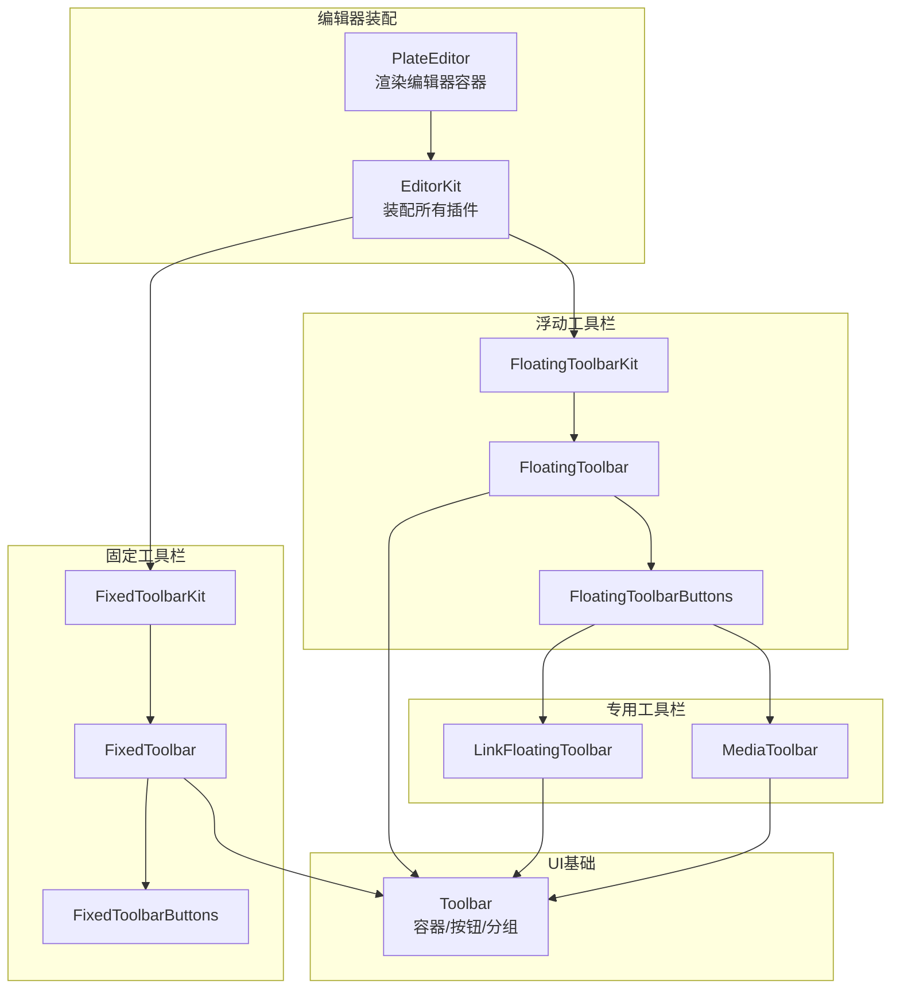
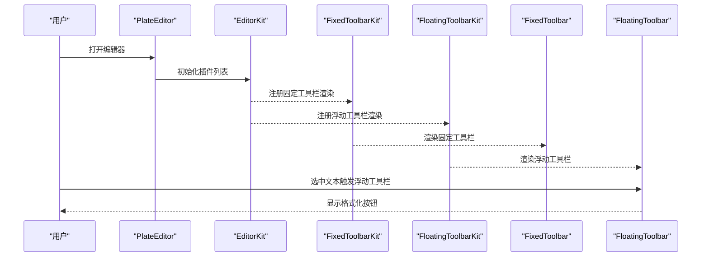
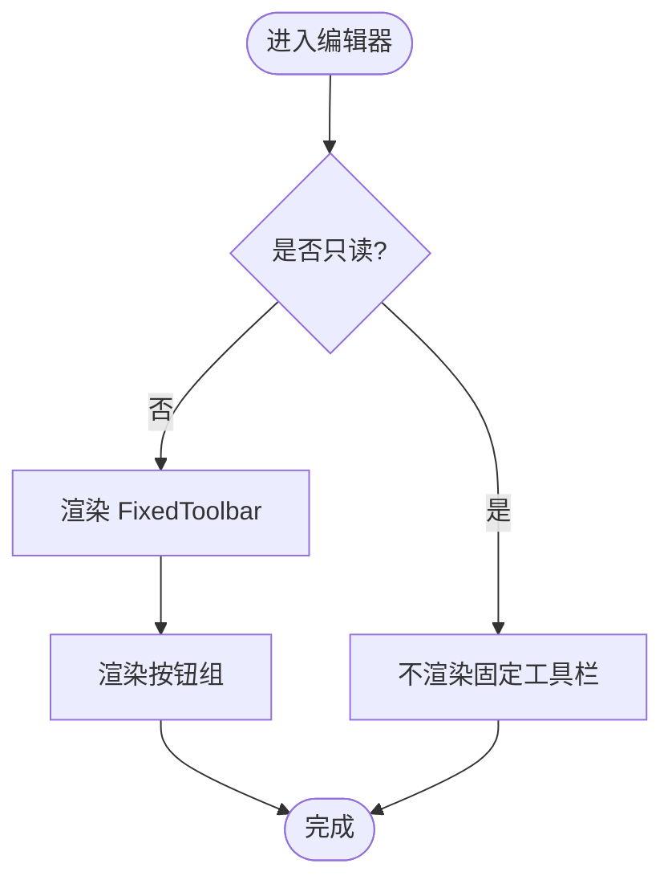
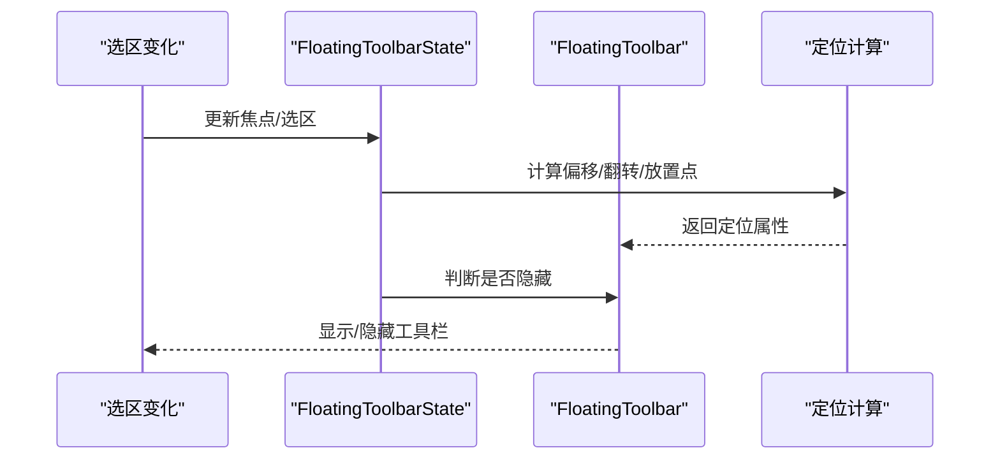
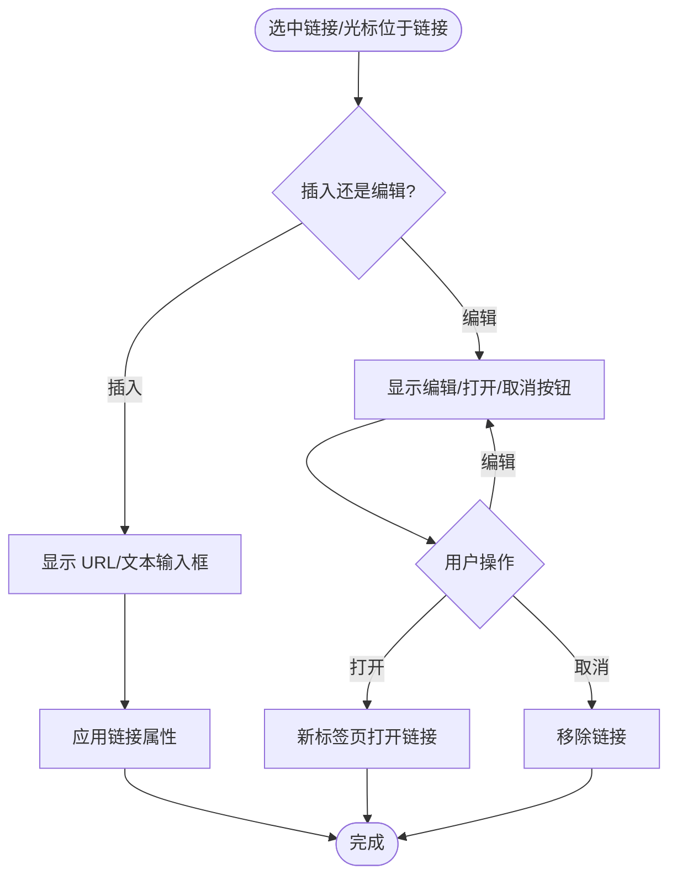
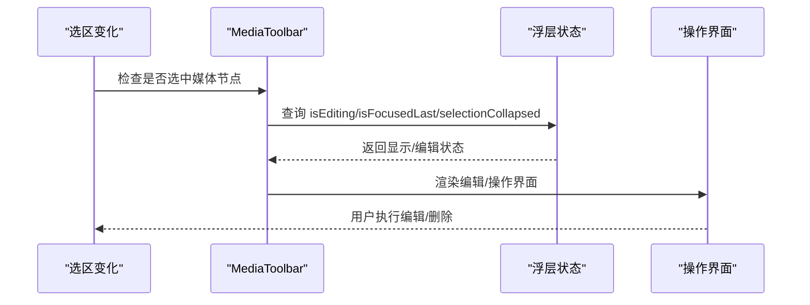
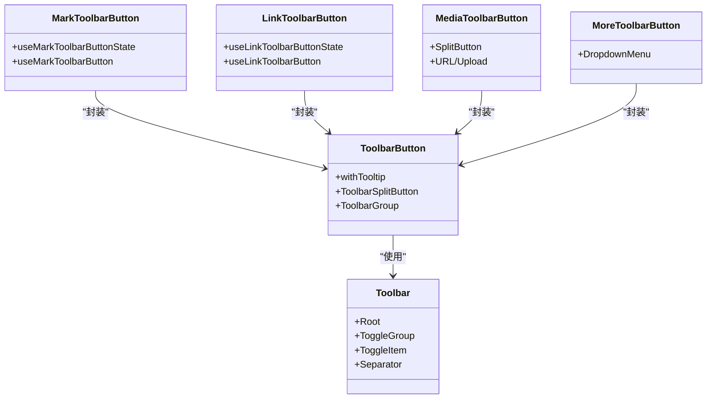
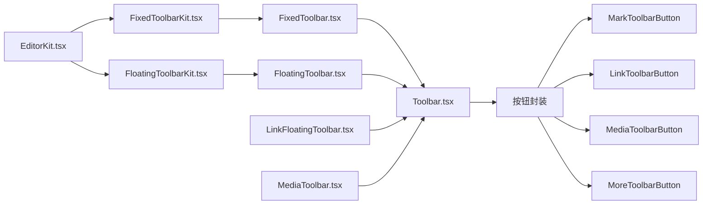

# 工具栏组件

<cite>
**本文引用的文件**
- [src/components/ui/toolbar.tsx](file://src/components/ui/toolbar.tsx)
- [src/components/ui/fixed-toolbar.tsx](file://src/components/ui/fixed-toolbar.tsx)
- [src/components/ui/floating-toolbar.tsx](file://src/components/ui/floating-toolbar.tsx)
- [src/components/ui/link-toolbar.tsx](file://src/components/ui/link-toolbar.tsx)
- [src/components/ui/media-toolbar.tsx](file://src/components/ui/media-toolbar.tsx)
- [src/components/ui/fixed-toolbar-buttons.tsx](file://src/components/ui/fixed-toolbar-buttons.tsx)
- [src/components/ui/floating-toolbar-buttons.tsx](file://src/components/ui/floating-toolbar-buttons.tsx)
- [src/components/ui/mark-toolbar-button.tsx](file://src/components/ui/mark-toolbar-button.tsx)
- [src/components/ui/link-toolbar-button.tsx](file://src/components/ui/link-toolbar-button.tsx)
- [src/components/ui/media-toolbar-button.tsx](file://src/components/ui/media-toolbar-button.tsx)
- [src/components/ui/more-toolbar-button.tsx](file://src/components/ui/more-toolbar-button.tsx)
- [src/components/editor/plugins/fixed-toolbar-kit.tsx](file://src/components/editor/plugins/fixed-toolbar-kit.tsx)
- [src/components/editor/plugins/floating-toolbar-kit.tsx](file://src/components/editor/plugins/floating-toolbar-kit.tsx)
- [src/components/editor/editor-kit.tsx](file://src/components/editor/editor-kit.tsx)
- [src/components/editor/plate-editor.tsx](file://src/components/editor/plate-editor.tsx)
</cite>

## 目录
1. [引言](#引言)
2. [项目结构](#项目结构)
3. [核心组件](#核心组件)
4. [架构总览](#架构总览)
5. [详细组件分析](#详细组件分析)
6. [依赖关系分析](#依赖关系分析)
7. [性能考量](#性能考量)
8. [故障排查指南](#故障排查指南)
9. [结论](#结论)
10. [附录](#附录)

## 引言
本文件系统性地文档化编辑器中的工具栏体系，覆盖固定工具栏、浮动工具栏、链接工具栏与媒体工具栏的设计与实现；解释按钮配置与事件处理机制；阐述定位策略与显示逻辑；提供自定义与扩展方法；给出多场景使用示例；说明与编辑器核心的集成方式；并讨论响应式与移动端适配、最佳实践与性能优化建议。

## 项目结构
工具栏相关代码主要分布在以下位置：
- UI 基础层：通用工具栏容器与按钮组件（toolbar.tsx）
- 具体工具栏：固定工具栏（fixed-toolbar.tsx）、浮动工具栏（floating-toolbar.tsx）、链接工具栏（link-toolbar.tsx）、媒体工具栏（media-toolbar.tsx）
- 工具栏按钮集合：固定工具栏按钮组（fixed-toolbar-buttons.tsx）、浮动工具栏按钮组（floating-toolbar-buttons.tsx）
- 按钮封装：标记类按钮（mark-toolbar-button.tsx）、链接按钮（link-toolbar-button.tsx）、媒体按钮（media-toolbar-button.tsx）、更多按钮（more-toolbar-button.tsx）
- 插件集成：固定/浮动工具栏插件（fixed-toolbar-kit.tsx、floating-toolbar-kit.tsx）
- 编辑器装配：编辑器装配清单（editor-kit.tsx）与编辑器容器（plate-editor.tsx）

图表来源
- [src/components/editor/editor-kit.tsx:36-78](file://src/components/editor/editor-kit.tsx#L36-L78)
- [src/components/editor/plugins/fixed-toolbar-kit.tsx:8-19](file://src/components/editor/plugins/fixed-toolbar-kit.tsx#L8-L19)
- [src/components/editor/plugins/floating-toolbar-kit.tsx:8-19](file://src/components/editor/plugins/floating-toolbar-kit.tsx#L8-L19)
- [src/components/ui/fixed-toolbar.tsx:7-17](file://src/components/ui/fixed-toolbar.tsx#L7-L17)
- [src/components/ui/floating-toolbar.tsx:23-86](file://src/components/ui/floating-toolbar.tsx#L23-L86)
- [src/components/ui/link-toolbar.tsx:40-169](file://src/components/ui/link-toolbar.tsx#L40-L169)
- [src/components/ui/media-toolbar.tsx:37-116](file://src/components/ui/media-toolbar.tsx#L37-L116)
- [src/components/ui/toolbar.tsx:18-389](file://src/components/ui/toolbar.tsx#L18-L389)

章节来源
- [src/components/editor/editor-kit.tsx:36-78](file://src/components/editor/editor-kit.tsx#L36-L78)
- [src/components/editor/plate-editor.tsx:63-175](file://src/components/editor/plate-editor.tsx#L63-L175)

## 核心组件
- 通用工具栏容器与按钮
  - 容器：Toolbar、ToggleGroup、ToggleItem、Link、Separator
  - 按钮：ToolbarButton、ToolbarSplitButton（主/次）、ToolbarToggleItem、ToolbarGroup
  - 菜单：ToolbarMenuGroup
  - 提示：Tooltip 包装器 withTooltip 及 TooltipContent
- 固定工具栏：FixedToolbar（粘性定位，顶部对齐，背景模糊）
- 浮动工具栏：FloatingToolbar（基于 @platejs/floating 的定位与隐藏逻辑）
- 链接工具栏：LinkFloatingToolbar（插入/编辑链接的悬浮面板）
- 媒体工具栏：MediaToolbar（媒体节点的弹出菜单，支持编辑链接、加注释、删除）

章节来源
- [src/components/ui/toolbar.tsx:18-389](file://src/components/ui/toolbar.tsx#L18-L389)
- [src/components/ui/fixed-toolbar.tsx:7-17](file://src/components/ui/fixed-toolbar.tsx#L7-L17)
- [src/components/ui/floating-toolbar.tsx:23-86](file://src/components/ui/floating-toolbar.tsx#L23-L86)
- [src/components/ui/link-toolbar.tsx:40-169](file://src/components/ui/link-toolbar.tsx#L40-L169)
- [src/components/ui/media-toolbar.tsx:37-116](file://src/components/ui/media-toolbar.tsx#L37-L116)

## 架构总览
工具栏通过插件系统挂载到编辑器生命周期中：
- 固定工具栏在可编辑区域之前渲染，随页面滚动保持在顶部
- 浮动工具栏在可编辑区域之后渲染，根据选区与焦点动态定位
- 链接与媒体工具栏作为独立浮层，由对应插件状态驱动显示/隐藏

图表来源
- [src/components/editor/plate-editor.tsx:79-82](file://src/components/editor/plate-editor.tsx#L79-L82)
- [src/components/editor/plugins/fixed-toolbar-kit.tsx:8-19](file://src/components/editor/plugins/fixed-toolbar-kit.tsx#L8-L19)
- [src/components/editor/plugins/floating-toolbar-kit.tsx:8-19](file://src/components/editor/plugins/floating-toolbar-kit.tsx#L8-L19)
- [src/components/ui/fixed-toolbar.tsx:7-17](file://src/components/ui/fixed-toolbar.tsx#L7-L17)
- [src/components/ui/floating-toolbar.tsx:23-86](file://src/components/ui/floating-toolbar.tsx#L23-L86)

## 详细组件分析

### 固定工具栏（FixedToolbar）
- 设计要点
  - 使用粘性定位，顶部对齐，宽度占满，背景半透明并启用模糊效果
  - 通过 Toolbar 容器承载按钮组，支持横向滚动与自动隐藏滚动条
- 组成
  - 容器：FixedToolbar（继承 Toolbar）
  - 按钮组：FixedToolbarButtons（撤销/重做、插入/转块、字号、对齐、列表、表情、表格、媒体、缩进、导出、更多）
- 交互
  - 受只读状态控制是否渲染
  - 与编辑器状态解耦，仅负责展示与布局

图表来源
- [src/components/ui/fixed-toolbar.tsx:7-17](file://src/components/ui/fixed-toolbar.tsx#L7-L17)
- [src/components/ui/fixed-toolbar-buttons.tsx:43-105](file://src/components/ui/fixed-toolbar-buttons.tsx#L43-L105)

章节来源
- [src/components/ui/fixed-toolbar.tsx:7-17](file://src/components/ui/fixed-toolbar.tsx#L7-L17)
- [src/components/ui/fixed-toolbar-buttons.tsx:43-105](file://src/components/ui/fixed-toolbar-buttons.tsx#L43-L105)

### 浮动工具栏（FloatingToolbar）
- 设计要点
  - 基于 @platejs/floating 的状态机与定位策略，支持偏移、翻转与多放置点
  - 当“链接编辑”或“AI 对话”打开时自动隐藏，避免遮挡
  - 支持点击外部关闭、最大宽度限制与打印场景隐藏
- 组成
  - 容器：FloatingToolbar（继承 Toolbar）
  - 按钮组：FloatingToolbarButtons（转块、粗体/斜体/下划线/删除线/代码/高亮、内联公式、链接、更多）
- 交互
  - 依据编辑器焦点与选区状态决定显示/隐藏
  - 通过 useFloatingToolbar/useFloatingToolbarState 管理定位与可见性

图表来源
- [src/components/ui/floating-toolbar.tsx:36-64](file://src/components/ui/floating-toolbar.tsx#L36-L64)
- [src/components/ui/floating-toolbar.tsx:70-85](file://src/components/ui/floating-toolbar.tsx#L70-L85)

章节来源
- [src/components/ui/floating-toolbar.tsx:23-86](file://src/components/ui/floating-toolbar.tsx#L23-L86)
- [src/components/ui/floating-toolbar-buttons.tsx:21-74](file://src/components/ui/floating-toolbar-buttons.tsx#L21-L74)

### 链接工具栏（LinkFloatingToolbar）
- 设计要点
  - 分为“插入链接”与“编辑链接”两套 UI
  - 输入框支持链接地址与显示文本，自动聚焦并阻止回车默认行为
  - 根据评论/建议激活状态调整放置方向（优先顶部）
- 组成
  - 插入态：输入 URL 与显示文本
  - 编辑态：编辑、打开、取消链接
  - 打开按钮：从当前链接元素提取属性并以新标签页打开
- 交互
  - 通过 @platejs/link 的 useFloatingLinkInsert/useFloatingLinkEdit 管理状态
  - 与编辑器选区联动，隐藏条件为“隐藏”状态或存在其他浮层

图表来源
- [src/components/ui/link-toolbar.tsx:66-92](file://src/components/ui/link-toolbar.tsx#L66-L92)
- [src/components/ui/link-toolbar.tsx:127-156](file://src/components/ui/link-toolbar.tsx#L127-L156)
- [src/components/ui/link-toolbar.tsx:171-206](file://src/components/ui/link-toolbar.tsx#L171-L206)

章节来源
- [src/components/ui/link-toolbar.tsx:40-169](file://src/components/ui/link-toolbar.tsx#L40-L169)

### 媒体工具栏（MediaToolbar）
- 设计要点
  - 基于 @platejs/media 的浮层状态，仅在媒体节点被选中且未处于预览模式时显示
  - 支持“编辑链接”“添加说明”“删除”等操作
  - 通过 Popover 承载内容，锚定到被选中的媒体节点
- 组成
  - 编辑态：输入媒体链接
  - 操作态：编辑、说明、删除
- 交互
  - 自动同步编辑器选区状态，若不再满足显示条件则关闭编辑态
  - 删除按钮通过 useRemoveNodeButton 获取删除行为

图表来源
- [src/components/ui/media-toolbar.tsx:37-116](file://src/components/ui/media-toolbar.tsx#L37-L116)

章节来源
- [src/components/ui/media-toolbar.tsx:37-116](file://src/components/ui/media-toolbar.tsx#L37-L116)

### 工具栏按钮与配置
- 通用按钮
  - ToolbarButton：支持尺寸/样式变体、下拉箭头、带 Tooltip 的包装
  - ToolbarSplitButton：主/次按钮组合，用于媒体上传与更多入口
  - ToolbarGroup：分组容器，自动渲染分隔线
- 标记按钮（MarkToolbarButton）
  - 封装 @platejs/react 的 useMarkToolbarButtonState/useMarkToolbarButton
  - 通过 nodeType 与 clear 参数控制具体标记类型
- 链接按钮（LinkToolbarButton）
  - 封装 @platejs/link/react 的 useLinkToolbarButtonState/useLinkToolbarButton
  - 默认带 Tooltip 与数据属性，便于焦点管理
- 媒体按钮（MediaToolbarButton）
  - 基于 SplitButton，支持本地上传与 URL 插入两种路径
  - 内置 URL 校验与错误提示
- 更多按钮（MoreToolbarButton）
  - 下拉菜单提供键盘输入、上标/下标等扩展能力
- 固定/浮动按钮组
  - 固定：撤销/重做、插入/转块、字号、对齐、列表、表情、表格、媒体、缩进、导出、更多
  - 浮动：转块、常用标记、内联公式、链接、更多

图表来源
- [src/components/ui/toolbar.tsx:18-389](file://src/components/ui/toolbar.tsx#L18-L389)
- [src/components/ui/mark-toolbar-button.tsx:8-21](file://src/components/ui/mark-toolbar-button.tsx#L8-L21)
- [src/components/ui/link-toolbar-button.tsx:12-24](file://src/components/ui/link-toolbar-button.tsx#L12-L24)
- [src/components/ui/media-toolbar-button.tsx:79-162](file://src/components/ui/media-toolbar-button.tsx#L79-L162)
- [src/components/ui/more-toolbar-button.tsx:24-81](file://src/components/ui/more-toolbar-button.tsx#L24-L81)

章节来源
- [src/components/ui/toolbar.tsx:18-389](file://src/components/ui/toolbar.tsx#L18-L389)
- [src/components/ui/mark-toolbar-button.tsx:8-21](file://src/components/ui/mark-toolbar-button.tsx#L8-L21)
- [src/components/ui/link-toolbar-button.tsx:12-24](file://src/components/ui/link-toolbar-button.tsx#L12-L24)
- [src/components/ui/media-toolbar-button.tsx:79-162](file://src/components/ui/media-toolbar-button.tsx#L79-L162)
- [src/components/ui/more-toolbar-button.tsx:24-81](file://src/components/ui/more-toolbar-button.tsx#L24-L81)
- [src/components/ui/fixed-toolbar-buttons.tsx:43-105](file://src/components/ui/fixed-toolbar-buttons.tsx#L43-L105)
- [src/components/ui/floating-toolbar-buttons.tsx:21-74](file://src/components/ui/floating-toolbar-buttons.tsx#L21-L74)

### 工具栏定位策略与显示逻辑
- 固定工具栏
  - 粘性定位，始终在编辑器顶部；适合全局常用操作
- 浮动工具栏
  - 基于选区与焦点，使用偏移与翻转中间件，优先上方，必要时切换下方/侧方
  - 当链接编辑或 AI 对话开启时隐藏，避免冲突
- 链接工具栏
  - 插入态与编辑态分别渲染；根据评论/建议激活状态调整放置方向
- 媒体工具栏
  - 仅在媒体节点被选中且未处于预览时显示；编辑态自动关闭非满足条件时的编辑状态

章节来源
- [src/components/ui/floating-toolbar.tsx:36-64](file://src/components/ui/floating-toolbar.tsx#L36-L64)
- [src/components/ui/link-toolbar.tsx:51-64](file://src/components/ui/link-toolbar.tsx#L51-L64)
- [src/components/ui/media-toolbar.tsx:37-66](file://src/components/ui/media-toolbar.tsx#L37-L66)

### 工具栏自定义与扩展
- 新增按钮
  - 复用 ToolbarButton/ToolbarSplitButton/ToolbarGroup
  - 若为标记类，使用 MarkToolbarButton 并传入 nodeType/clear
  - 若为链接/媒体，参考 LinkToolbarButton/MediaToolbarButton 的封装模式
- 自定义浮层
  - 链接：参考 LinkFloatingToolbar 的插入/编辑双态与输入校验
  - 媒体：参考 MediaToolbar 的 Popover + 编辑/操作态切换
- 插件集成
  - 固定/浮动工具栏：参考 FixedToolbarKit/FloatingToolbarKit 的渲染钩子
  - 在 EditorKit 中按需装配，确保顺序与依赖正确

章节来源
- [src/components/ui/toolbar.tsx:18-389](file://src/components/ui/toolbar.tsx#L18-L389)
- [src/components/ui/link-toolbar.tsx:40-169](file://src/components/ui/link-toolbar.tsx#L40-L169)
- [src/components/ui/media-toolbar.tsx:37-116](file://src/components/ui/media-toolbar.tsx#L37-L116)
- [src/components/editor/plugins/fixed-toolbar-kit.tsx:8-19](file://src/components/editor/plugins/fixed-toolbar-kit.tsx#L8-L19)
- [src/components/editor/plugins/floating-toolbar-kit.tsx:8-19](file://src/components/editor/plugins/floating-toolbar-kit.tsx#L8-L19)
- [src/components/editor/editor-kit.tsx:36-78](file://src/components/editor/editor-kit.tsx#L36-L78)

### 不同编辑器场景下的使用示例
- 文档编辑
  - 固定工具栏提供常用格式化与结构化操作
  - 浮动工具栏在选中文本时出现，快速应用标记
- 链接插入/编辑
  - 插入链接：使用 LinkToolbarButton 触发 LinkFloatingToolbar 的插入态
  - 编辑链接：在链接节点上触发编辑态，支持打开/取消/修改
- 媒体插入
  - 图片/视频/音频/文件：通过 MediaToolbarButton 的 SplitButton 与下拉菜单选择上传或 URL
  - 媒体节点选中后出现 MediaToolbar，支持编辑链接、添加说明、删除
- 表格/目录/分栏/公式
  - 通过固定/浮动工具栏中的对应按钮触发相应节点插入与编辑

章节来源
- [src/components/ui/fixed-toolbar-buttons.tsx:43-105](file://src/components/ui/fixed-toolbar-buttons.tsx#L43-L105)
- [src/components/ui/floating-toolbar-buttons.tsx:21-74](file://src/components/ui/floating-toolbar-buttons.tsx#L21-L74)
- [src/components/ui/link-toolbar-button.tsx:12-24](file://src/components/ui/link-toolbar-button.tsx#L12-L24)
- [src/components/ui/media-toolbar-button.tsx:79-162](file://src/components/ui/media-toolbar-button.tsx#L79-L162)

### 与编辑器核心的集成方式
- 插件装配
  - EditorKit 将各功能插件与 UI 插件（固定/浮动工具栏）统一装配
- 生命周期钩子
  - FixedToolbarKit/FloatingToolbarKit 在“可编辑前/后”注入工具栏
- 状态联动
  - 工具栏按钮通过 @platejs/react 的 hooks 与编辑器状态绑定，如只读、选区、焦点、插件选项等

章节来源
- [src/components/editor/editor-kit.tsx:36-78](file://src/components/editor/editor-kit.tsx#L36-L78)
- [src/components/editor/plugins/fixed-toolbar-kit.tsx:8-19](file://src/components/editor/plugins/fixed-toolbar-kit.tsx#L8-L19)
- [src/components/editor/plugins/floating-toolbar-kit.tsx:8-19](file://src/components/editor/plugins/floating-toolbar-kit.tsx#L8-L19)
- [src/components/editor/plate-editor.tsx:79-82](file://src/components/editor/plate-editor.tsx#L79-L82)

### 响应式设计与移动端适配
- 横向滚动与自动隐藏
  - 固定工具栏与浮动工具栏均支持横向滚动，并隐藏滚动条，提升窄屏体验
- 最大宽度与断点
  - 浮动工具栏设置最大宽度，避免在窄屏下溢出
- 移动端交互
  - 浮动工具栏采用轻量浮层与点击外部关闭，减少遮挡
  - 建议在移动端进一步压缩按钮尺寸与间距，保证触控可达性

章节来源
- [src/components/ui/fixed-toolbar.tsx:11-14](file://src/components/ui/fixed-toolbar.tsx#L11-L14)
- [src/components/ui/floating-toolbar.tsx:75-79](file://src/components/ui/floating-toolbar.tsx#L75-L79)

## 依赖关系分析
- 组件耦合
  - 工具栏按钮依赖 @platejs/react hooks 获取编辑器状态
  - 固定/浮动工具栏依赖 @platejs/floating 提供的定位与状态
  - 链接/媒体工具栏依赖 @platejs/link/@platejs/media 的 React 绑定
- 插件装配
  - EditorKit 将 UI 插件与功能插件统一装配，避免循环依赖
- 外部依赖
  - Radix UI（Toolbar、Tooltip、DropdownMenu）
  - class-variance-authority（样式变体）
  - lucide-react（图标）

图表来源
- [src/components/ui/toolbar.tsx:18-389](file://src/components/ui/toolbar.tsx#L18-L389)
- [src/components/ui/fixed-toolbar.tsx:7-17](file://src/components/ui/fixed-toolbar.tsx#L7-L17)
- [src/components/ui/floating-toolbar.tsx:23-86](file://src/components/ui/floating-toolbar.tsx#L23-L86)
- [src/components/ui/link-toolbar.tsx:40-169](file://src/components/ui/link-toolbar.tsx#L40-L169)
- [src/components/ui/media-toolbar.tsx:37-116](file://src/components/ui/media-toolbar.tsx#L37-L116)
- [src/components/editor/plugins/fixed-toolbar-kit.tsx:8-19](file://src/components/editor/plugins/fixed-toolbar-kit.tsx#L8-L19)
- [src/components/editor/plugins/floating-toolbar-kit.tsx:8-19](file://src/components/editor/plugins/floating-toolbar-kit.tsx#L8-L19)
- [src/components/editor/editor-kit.tsx:36-78](file://src/components/editor/editor-kit.tsx#L36-L78)

章节来源
- [src/components/editor/editor-kit.tsx:36-78](file://src/components/editor/editor-kit.tsx#L36-L78)

## 性能考量
- 结构相等性比较
  - 编辑器变更检测采用结构化对比，避免不必要的保存状态更新与重渲染
- 浮动定位中间件
  - 合理设置偏移与翻转策略，减少频繁重排
- 条件渲染
  - 固定/浮动工具栏在只读或隐藏条件下不渲染，降低 DOM 负担
- 事件传播
  - 下拉菜单与输入框阻止冒泡，避免干扰编辑器事件流

章节来源
- [src/components/editor/plate-editor.tsx:16-61](file://src/components/editor/plate-editor.tsx#L16-L61)
- [src/components/ui/floating-toolbar.tsx:42-56](file://src/components/ui/floating-toolbar.tsx#L42-L56)
- [src/components/ui/link-toolbar.tsx:93-95](file://src/components/ui/link-toolbar.tsx#L93-L95)

## 故障排查指南
- 工具栏不显示
  - 检查只读状态与隐藏条件（如链接编辑/AI 对话开启）
  - 确认插件已正确装配到 EditorKit
- 浮动工具栏位置异常
  - 调整偏移与翻转参数，检查容器滚动与视口边界
- 链接工具栏无法编辑
  - 确认选区位于链接节点内；检查 @platejs/link 的状态钩子
- 媒体工具栏无法打开
  - 确认媒体节点被选中且未处于预览；检查 isEditing 状态同步

章节来源
- [src/components/ui/floating-toolbar.tsx:36-64](file://src/components/ui/floating-toolbar.tsx#L36-L64)
- [src/components/ui/link-toolbar.tsx:73-92](file://src/components/ui/link-toolbar.tsx#L73-L92)
- [src/components/ui/media-toolbar.tsx:37-66](file://src/components/ui/media-toolbar.tsx#L37-L66)
- [src/components/editor/editor-kit.tsx:36-78](file://src/components/editor/editor-kit.tsx#L36-L78)

## 结论
本工具栏体系以通用容器与按钮为基础，结合 @platejs 的状态与定位能力，实现了固定、浮动、链接与媒体四类工具栏的协同工作。通过插件化装配与条件渲染，兼顾了可用性与性能；通过样式变体与响应式策略，提升了跨设备体验。按本文提供的扩展与最佳实践，可在不破坏现有结构的前提下灵活定制与优化。

## 附录
- 快速定位
  - 固定工具栏：FixedToolbar + FixedToolbarButtons
  - 浮动工具栏：FloatingToolbar + FloatingToolbarButtons
  - 链接工具栏：LinkFloatingToolbar
  - 媒体工具栏：MediaToolbar
- 关键实现路径
  - 工具栏容器与按钮：[src/components/ui/toolbar.tsx:18-389](file://src/components/ui/toolbar.tsx#L18-L389)
  - 固定工具栏：[src/components/ui/fixed-toolbar.tsx:7-17](file://src/components/ui/fixed-toolbar.tsx#L7-L17)
  - 浮动工具栏：[src/components/ui/floating-toolbar.tsx:23-86](file://src/components/ui/floating-toolbar.tsx#L23-L86)
  - 链接工具栏：[src/components/ui/link-toolbar.tsx:40-169](file://src/components/ui/link-toolbar.tsx#L40-L169)
  - 媒体工具栏：[src/components/ui/media-toolbar.tsx:37-116](file://src/components/ui/media-toolbar.tsx#L37-L116)
  - 固定/浮动工具栏插件：[src/components/editor/plugins/fixed-toolbar-kit.tsx:8-19](file://src/components/editor/plugins/fixed-toolbar-kit.tsx#L8-L19)、[src/components/editor/plugins/floating-toolbar-kit.tsx:8-19](file://src/components/editor/plugins/floating-toolbar-kit.tsx#L8-L19)
  - 编辑器装配：[src/components/editor/editor-kit.tsx:36-78](file://src/components/editor/editor-kit.tsx#L36-L78)
  - 编辑器容器：[src/components/editor/plate-editor.tsx:63-175](file://src/components/editor/plate-editor.tsx#L63-L175)