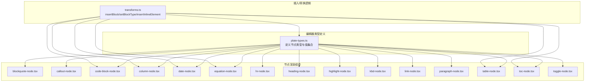
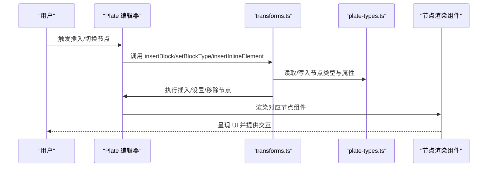
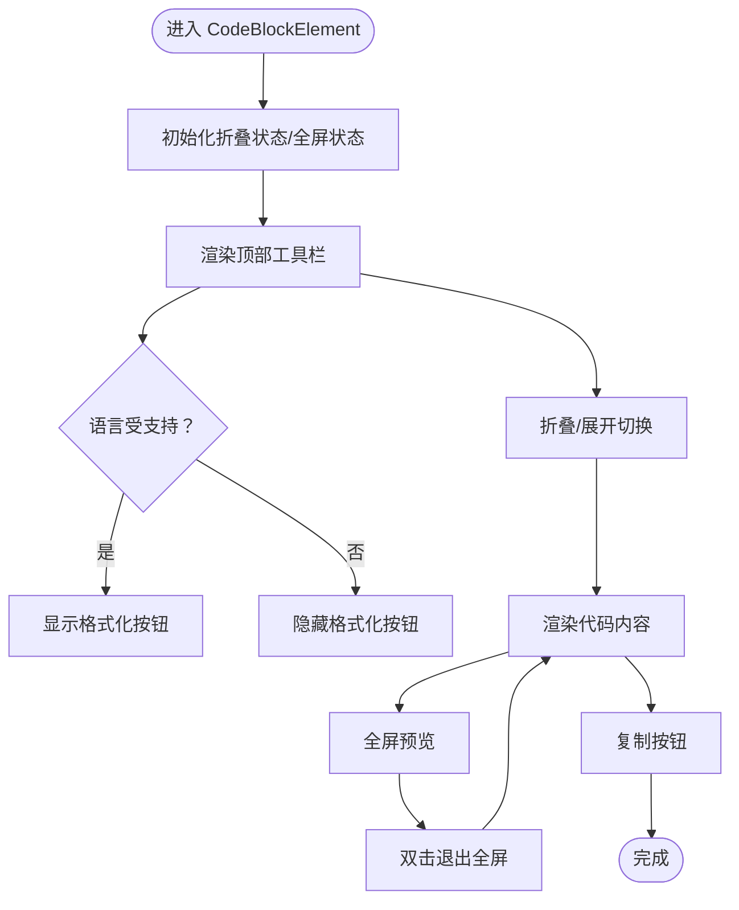
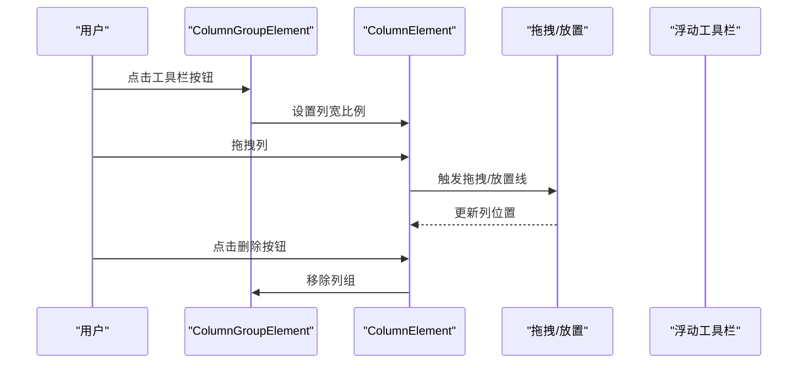
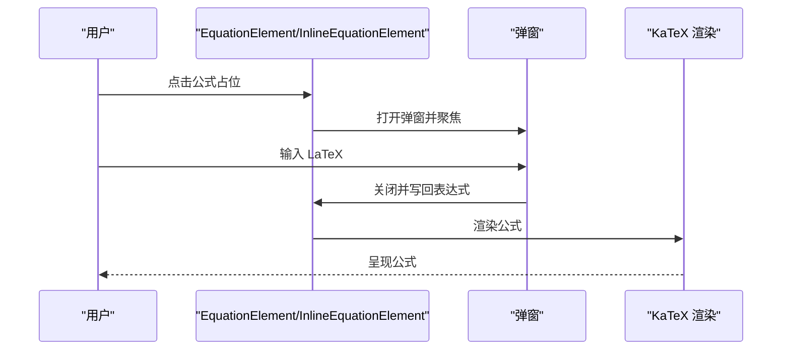
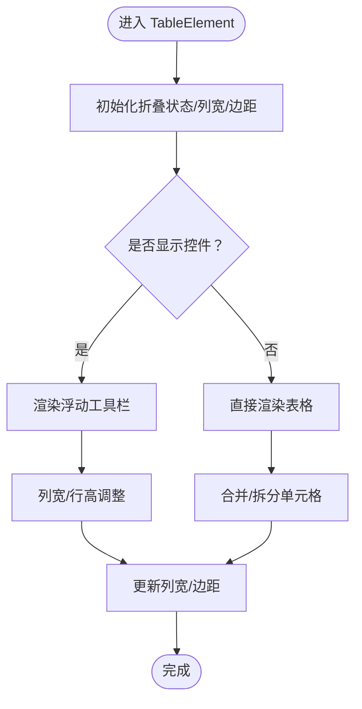
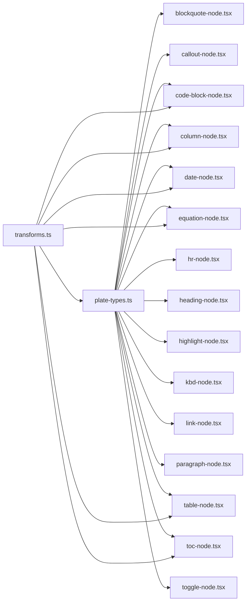

# 节点组件

<cite>
**本文档引用的文件**
- [plate-types.ts](file://src/components/editor/plate-types.ts)
- [transforms.ts](file://src/components/editor/transforms.ts)
- [blockquote-node.tsx](file://src/components/ui/blockquote-node.tsx)
- [callout-node.tsx](file://src/components/ui/callout-node.tsx)
- [code-block-node.tsx](file://src/components/ui/code-block-node.tsx)
- [column-node.tsx](file://src/components/ui/column-node.tsx)
- [date-node.tsx](file://src/components/ui/date-node.tsx)
- [equation-node.tsx](file://src/components/ui/equation-node.tsx)
- [hr-node.tsx](file://src/components/ui/hr-node.tsx)
- [heading-node.tsx](file://src/components/ui/heading-node.tsx)
- [highlight-node.tsx](file://src/components/ui/highlight-node.tsx)
- [kbd-node.tsx](file://src/components/ui/kbd-node.tsx)
- [link-node.tsx](file://src/components/ui/link-node.tsx)
- [paragraph-node.tsx](file://src/components/ui/paragraph-node.tsx)
- [table-node.tsx](file://src/components/ui/table-node.tsx)
- [toc-node.tsx](file://src/components/ui/toc-node.tsx)
- [toggle-node.tsx](file://src/components/ui/toggle-node.tsx)
</cite>

## 目录
1. [简介](#简介)
2. [项目结构](#项目结构)
3. [核心组件](#核心组件)
4. [架构总览](#架构总览)
5. [详细组件分析](#详细组件分析)
6. [依赖关系分析](#依赖关系分析)
7. [性能考量](#性能考量)
8. [故障排查指南](#故障排查指南)
9. [结论](#结论)
10. [附录](#附录)

## 简介
本文件系统化梳理 ynote-v2 中基于 Plate.js 的富文本节点组件体系，覆盖引用块、提示框、代码块、列布局、日期节点、公式节点（含行内/块级）、水平分割线、标题节点、高亮文本、键盘文本、链接节点、段落节点、表格节点、目录节点与折叠节点。文档从渲染逻辑、编辑行为、样式定制、嵌套规则与约束、与 Plate.js 的集成方式、序列化/反序列化处理、可访问性与键盘导航、以及扩展开发与自定义节点创建方法等维度进行深入说明。

## 项目结构
- 节点类型定义集中在编辑器类型文件中，统一声明所有节点元素的接口与类型别名，确保编辑器状态与渲染组件的一致性。
- 节点渲染组件位于 UI 层，每个节点对应一个独立组件，负责将 Plate.js 的元素映射到实际 DOM 结构，并提供交互能力（如弹窗、工具栏、拖拽等）。
- 插入/转换逻辑集中在 transforms 文件中，通过统一入口对节点进行插入、切换、设置类型等操作，保证行为一致性。

图表来源
- [plate-types.ts:1-164](file://src/components/editor/plate-types.ts#L1-L164)
- [transforms.ts:1-208](file://src/components/editor/transforms.ts#L1-L208)
- [blockquote-node.tsx:1-14](file://src/components/ui/blockquote-node.tsx#L1-L14)
- [callout-node.tsx:1-65](file://src/components/ui/callout-node.tsx#L1-L65)
- [code-block-node.tsx:1-439](file://src/components/ui/code-block-node.tsx#L1-L439)
- [column-node.tsx:1-317](file://src/components/ui/column-node.tsx#L1-L317)
- [date-node.tsx:1-96](file://src/components/ui/date-node.tsx#L1-L96)
- [equation-node.tsx:1-236](file://src/components/ui/equation-node.tsx#L1-L236)
- [hr-node.tsx:1-33](file://src/components/ui/hr-node.tsx#L1-L33)
- [heading-node.tsx:1-59](file://src/components/ui/heading-node.tsx#L1-L59)
- [highlight-node.tsx:1-13](file://src/components/ui/highlight-node.tsx#L1-L13)
- [kbd-node.tsx:1-17](file://src/components/ui/kbd-node.tsx#L1-L17)
- [link-node.tsx:1-30](file://src/components/ui/link-node.tsx#L1-L30)
- [paragraph-node.tsx:1-15](file://src/components/ui/paragraph-node.tsx#L1-L15)
- [table-node.tsx:1-800](file://src/components/ui/table-node.tsx#L1-L800)
- [toc-node.tsx:1-55](file://src/components/ui/toc-node.tsx#L1-L55)
- [toggle-node.tsx:1-36](file://src/components/ui/toggle-node.tsx#L1-L36)

章节来源
- [plate-types.ts:1-164](file://src/components/editor/plate-types.ts#L1-L164)
- [transforms.ts:1-208](file://src/components/editor/transforms.ts#L1-L208)

## 核心组件
- 类型系统：在类型文件中集中定义节点元素接口、文本类型、表格元素、列表属性等，确保编辑器内部数据结构与渲染组件一致。
- 插入/转换：通过 transforms 提供统一的插入与类型切换入口，支持块级节点、内联节点、列布局、表格、公式、日期等。
- 渲染组件：每个节点组件负责将 Plate.js 的 element 映射为 DOM，并提供交互（如弹窗、工具栏、拖拽、选择器等）。

章节来源
- [plate-types.ts:25-164](file://src/components/editor/plate-types.ts#L25-L164)
- [transforms.ts:39-207](file://src/components/editor/transforms.ts#L39-L207)

## 架构总览
以下图示展示节点组件与 Plate.js 的集成关系：类型定义决定数据结构；渲染组件负责 UI；transforms 统一管理插入与类型切换；部分节点使用 Plate.js 官方插件提供的 Hook 或 Provider 实现高级交互。

图表来源
- [transforms.ts:87-193](file://src/components/editor/transforms.ts#L87-L193)
- [plate-types.ts:25-164](file://src/components/editor/plate-types.ts#L25-L164)

## 详细组件分析

### 引用块（Blockquote）
- 渲染逻辑：以语义化的引用标签包裹内容，提供基础样式（边框、斜体、缩进）。
- 编辑行为：作为块级元素，支持在当前块为空时直接切换类型；不涉及复杂交互。
- 样式定制：通过类名控制边距、边框与内边距。
- 嵌套规则：引用块内部通常为段落或文本节点，遵循编辑器的“可嵌套块”规则。
- 集成方式：直接使用 PlateElement 包裹 children。
- 序列化/反序列化：由类型系统中的引用块接口定义，渲染组件负责映射。

章节来源
- [blockquote-node.tsx:5-13](file://src/components/ui/blockquote-node.tsx#L5-L13)
- [plate-types.ts:41-43](file://src/components/editor/plate-types.ts#L41-L43)

### 提示框（Callout）
- 渲染逻辑：外层容器支持背景色与圆角，左侧提供表情选择器，右侧为内容区。
- 编辑行为：通过表情选择器动态更新图标；支持右上角删除按钮。
- 样式定制：背景色通过元素属性传入；图标字体族适配多平台 Emoji。
- 嵌套规则：提示框内部为普通文本块，遵循可嵌套块规则。
- 集成方式：使用 PlateElement，结合 Plate.js 提供的表情选择器 Hook。
- 可访问性：按钮具备可聚焦性与 ARIA 属性；下拉菜单支持键盘导航。

章节来源
- [callout-node.tsx:13-64](file://src/components/ui/callout-node.tsx#L13-L64)
- [plate-types.ts:109-117](file://src/components/editor/plate-types.ts#L109-L117)

### 代码块（Code Block）
- 渲染逻辑：顶部工具栏包含折叠/展开、全屏、格式化、语言选择与复制按钮；内容区支持自动换行与语法高亮 Token。
- 编辑行为：支持折叠/展开、全屏预览、语言切换、复制代码；支持格式化（当语言受支持时）。
- 样式定制：工具栏与内容区分别设置背景、边框与圆角；全屏模式提供独立遮罩层。
- 嵌套规则：代码块包含代码行数组，每行包含纯文本；语言列表来自内置常量。
- 集成方式：使用 PlateElement/PlateLeaf，结合 Plate.js 代码块插件的格式化与语言检测能力。
- 序列化/反序列化：通过节点结构与语言属性持久化；提取文本用于复制与全屏显示。

图表来源
- [code-block-node.tsx:33-222](file://src/components/ui/code-block-node.tsx#L33-L222)
- [plate-types.ts:45-53](file://src/components/editor/plate-types.ts#L45-L53)

章节来源
- [code-block-node.tsx:33-439](file://src/components/ui/code-block-node.tsx#L33-L439)
- [plate-types.ts:45-53](file://src/components/editor/plate-types.ts#L45-L53)

### 列布局（Column Group/Column）
- 渲染逻辑：列组容器提供浮动工具栏，列元素支持拖拽与放置线；列宽可调整。
- 编辑行为：支持双列、三列、左右分屏等多种布局；支持删除列组。
- 样式定制：列元素在悬停时显示拖拽手柄；拖拽过程中降低透明度。
- 嵌套规则：列组内包含多个列，列内可嵌套其他块级节点。
- 集成方式：使用 PlateElement 与 Plate.js 布局/拖拽/可调整尺寸的 Provider/Hook。
- 可访问性：拖拽手柄具备提示信息；工具栏按钮具备 ARIA 提示。

图表来源
- [column-node.tsx:140-226](file://src/components/ui/column-node.tsx#L140-L226)
- [column-node.tsx:41-97](file://src/components/ui/column-node.tsx#L41-L97)

章节来源
- [column-node.tsx:1-317](file://src/components/ui/column-node.tsx#L1-L317)
- [transforms.ts:46-47](file://src/components/editor/transforms.ts#L46-L47)

### 日期节点（Date）
- 渲染逻辑：只读状态下显示本地化日期文案；可编辑状态下提供日历弹窗选择。
- 编辑行为：点击触发日历面板，选择后写回节点日期属性。
- 样式定制：触发元素采用圆角背景与占位文案。
- 嵌套规则：日期节点为内联元素，可与文本混合。
- 集成方式：使用 PlateElement 与 Plate.js 日期插件；结合弹窗组件。
- 可访问性：日历组件支持键盘选择与焦点管理。

章节来源
- [date-node.tsx:16-96](file://src/components/ui/date-node.tsx#L16-L96)
- [transforms.ts:77](file://src/components/editor/transforms.ts#L77)

### 公式节点（Equation/Inline Equation）
- 渲染逻辑：块级公式以弹窗形式呈现，内联公式以行内块形式呈现；支持 LaTeX 渲染。
- 编辑行为：打开弹窗输入 LaTeX，关闭后写回表达式；内联公式在选中且收拢时自动打开。
- 样式定制：块级与内联分别设置不同的容器与选中态样式。
- 嵌套规则：公式节点为内联元素，可与文本混合；块级公式可作为独立块。
- 集成方式：使用 Plate.js 数学插件的 Element/输入 Hook；结合 KaTeX 渲染。
- 可访问性：弹窗支持 ESC 关闭；内联公式具备聚焦与选中态反馈。

图表来源
- [equation-node.tsx:30-90](file://src/components/ui/equation-node.tsx#L30-L90)
- [equation-node.tsx:92-174](file://src/components/ui/equation-node.tsx#L92-L174)
- [transforms.ts:78-79](file://src/components/editor/transforms.ts#L78-L79)

章节来源
- [equation-node.tsx:1-236](file://src/components/ui/equation-node.tsx#L1-L236)
- [transforms.ts:78-79](file://src/components/editor/transforms.ts#L78-L79)

### 水平分割线（HR）
- 渲染逻辑：以 hr 标签呈现，支持选中态与聚焦态的环形边框。
- 编辑行为：只读时不可编辑；可点击插入新的分割线。
- 样式定制：通过类名控制高度、圆角与背景色。
- 嵌套规则：分割线为块级元素，通常独立一行。
- 集成方式：使用 PlateElement 包裹 hr。

章节来源
- [hr-node.tsx:13-33](file://src/components/ui/hr-node.tsx#L13-L33)
- [plate-types.ts:81-84](file://src/components/editor/plate-types.ts#L81-L84)

### 标题节点（Heading）
- 渲染逻辑：通过变体系统提供不同层级的样式，支持响应式排版。
- 编辑行为：作为块级标题，支持设置层级（h1-h6）。
- 样式定制：不同层级具有不同的字号、字重与间距。
- 嵌套规则：标题为块级元素，内部为文本节点。
- 集成方式：使用 PlateElement 并传入变体参数。

章节来源
- [heading-node.tsx:21-59](file://src/components/ui/heading-node.tsx#L21-L59)
- [plate-types.ts:55-79](file://src/components/editor/plate-types.ts#L55-L79)

### 高亮文本（Highlight）
- 渲染逻辑：将文本标记为高亮，保留继承文本颜色。
- 编辑行为：作为叶节点（Leaf），参与富文本渲染。
- 样式定制：通过类名设置背景色与透明度。
- 嵌套规则：高亮文本可与其他标记（如键盘文本）叠加。
- 集成方式：使用 PlateLeaf 包裹 children。

章节来源
- [highlight-node.tsx:6-12](file://src/components/ui/highlight-node.tsx#L6-L12)
- [plate-types.ts:144-146](file://src/components/editor/plate-types.ts#L144-L146)

### 键盘文本（Kbd）
- 渲染逻辑：以 kbd 标签呈现，带圆角、阴影与等宽字体。
- 编辑行为：作为叶节点，适合快捷键或按键组合。
- 样式定制：通过类名设置边框、背景与阴影。
- 嵌套规则：可与高亮等标记组合使用。
- 集成方式：使用 PlateLeaf 包裹 children。

章节来源
- [kbd-node.tsx:6-16](file://src/components/ui/kbd-node.tsx#L6-L16)
- [plate-types.ts:144-146](file://src/components/editor/plate-types.ts#L144-L146)

### 链接节点（Link）
- 渲染逻辑：以锚点标签呈现，应用主题色与下划线样式。
- 编辑行为：通过链接属性生成正确的 href 与 target。
- 样式定制：强调主色与下划线装饰。
- 嵌套规则：链接为内联元素，可与文本混合。
- 集成方式：使用 PlateElement 并注入链接属性。

章节来源
- [link-node.tsx:10-29](file://src/components/ui/link-node.tsx#L10-L29)
- [plate-types.ts:95-98](file://src/components/editor/plate-types.ts#L95-L98)

### 段落节点（Paragraph）
- 渲染逻辑：最小化边距与内边距，保证段落间的自然间距。
- 编辑行为：作为基础块级元素，支持插入与类型切换。
- 样式定制：通过类名控制内外边距。
- 嵌套规则：段落为可嵌套块，内部可包含文本与内联节点。
- 集成方式：使用 PlateElement 包裹 children。

章节来源
- [paragraph-node.tsx:8-14](file://src/components/ui/paragraph-node.tsx#L8-L14)
- [plate-types.ts:121-123](file://src/components/editor/plate-types.ts#L121-L123)

### 表格节点（Table）
- 渲染逻辑：支持列宽调整、行列尺寸控制、边框样式、背景色、合并/拆分单元格等。
- 编辑行为：提供浮动工具栏，支持折叠/展开、背景色、合并/拆分、拖拽调整大小。
- 样式定制：通过 CSS 变量与内联样式控制列宽与整体宽度。
- 嵌套规则：表格包含行、列、单元格，单元格内部为可嵌套块。
- 集成方式：使用 Plate.js 表格 Provider/Hook 与自定义拖拽/调整逻辑。
- 性能优化：大表格启用延迟列宽计算，避免频繁重排。

图表来源
- [table-node.tsx:553-744](file://src/components/ui/table-node.tsx#L553-L744)
- [plate-types.ts:125-138](file://src/components/editor/plate-types.ts#L125-L138)

章节来源
- [table-node.tsx:1-800](file://src/components/ui/table-node.tsx#L1-L800)
- [plate-types.ts:125-138](file://src/components/editor/plate-types.ts#L125-L138)

### 目录节点（Toc）
- 渲染逻辑：根据页面标题生成目录项，支持深度缩进与平滑滚动跳转。
- 编辑行为：点击目录项定位至对应标题。
- 样式定制：通过变体类名控制缩进与悬停效果。
- 嵌套规则：目录为块级元素，内部为按钮列表。
- 集成方式：使用 Plate.js 目录插件的 Element/State Hook。

章节来源
- [toc-node.tsx:23-54](file://src/components/ui/toc-node.tsx#L23-L54)
- [transforms.ts:69](file://src/components/editor/transforms.ts#L69)

### 折叠节点（Toggle）
- 渲染逻辑：左侧提供旋转箭头按钮，点击展开/折叠内容。
- 编辑行为：通过状态 Hook 控制展开/折叠；支持键盘激活。
- 样式定制：按钮具备过渡动画与悬停效果。
- 嵌套规则：折叠内容为可嵌套块，内部可包含多种节点。
- 集成方式：使用 Plate.js 折叠插件的 Button/State Hook。

章节来源
- [toggle-node.tsx:10-35](file://src/components/ui/toggle-node.tsx#L10-L35)
- [plate-types.ts:140-142](file://src/components/editor/plate-types.ts#L140-L142)

## 依赖关系分析
- 类型依赖：所有节点组件均依赖类型文件中定义的接口，确保编辑器内部结构与渲染一致。
- 插件依赖：部分节点使用 Plate.js 官方插件（如数学、表格、布局、目录、折叠等），通过 Hook/Provider 获取状态与行为。
- 交互依赖：节点组件依赖 UI 组件库（按钮、弹窗、下拉菜单、工具栏等）实现交互体验。

图表来源
- [plate-types.ts:25-164](file://src/components/editor/plate-types.ts#L25-L164)
- [transforms.ts:39-81](file://src/components/editor/transforms.ts#L39-L81)

章节来源
- [plate-types.ts:25-164](file://src/components/editor/plate-types.ts#L25-L164)
- [transforms.ts:39-81](file://src/components/editor/transforms.ts#L39-L81)

## 性能考量
- 大表格延迟列宽计算：当单元格数量超过阈值时，启用延迟列宽计算以减少重排。
- 代码块全屏预览：仅在需要时渲染全屏遮罩，避免不必要的 DOM 开销。
- 列布局拖拽：拖拽过程降低透明度与禁用事件冒泡，减少不必要的重绘。
- 公式渲染：使用懒加载与弹窗输入，避免在编辑过程中频繁渲染。

章节来源
- [table-node.tsx:574-577](file://src/components/ui/table-node.tsx#L574-L577)
- [code-block-node.tsx:47-53](file://src/components/ui/code-block-node.tsx#L47-L53)
- [column-node.tsx:51-60](file://src/components/ui/column-node.tsx#L51-L60)
- [equation-node.tsx:195-199](file://src/components/ui/equation-node.tsx#L195-L199)

## 故障排查指南
- 插入/切换无效：检查 transforms 中的映射表是否包含目标类型；确认当前块是否为空且类型相同。
- 代码块语言不生效：确认语言是否受支持；检查格式化函数调用与节点属性写入。
- 表格列宽异常：检查列宽计算与边界值；确认延迟计算是否开启。
- 公式无法渲染：检查 LaTeX 表达式与 KaTeX 渲染配置；确认弹窗关闭后的状态更新。
- 日历选择无响应：检查只读状态与事件绑定；确认日期写回路径正确。

章节来源
- [transforms.ts:87-122](file://src/components/editor/transforms.ts#L87-L122)
- [code-block-node.tsx:119-129](file://src/components/ui/code-block-node.tsx#L119-L129)
- [table-node.tsx:289-303](file://src/components/ui/table-node.tsx#L289-L303)
- [equation-node.tsx:35-49](file://src/components/ui/equation-node.tsx#L35-L49)
- [date-node.tsx:80-87](file://src/components/ui/date-node.tsx#L80-L87)

## 结论
本项目通过统一的类型定义与渲染组件，实现了对多种富文本节点的完整覆盖。借助 Plate.js 插件生态与自定义交互，节点组件在功能、可访问性与性能方面均达到较高水准。建议在扩展新节点时遵循现有模式：先定义类型接口，再实现渲染组件与交互逻辑，并通过 transforms 提供统一的插入/切换入口。

## 附录
- 节点类型清单与接口定义参见类型文件。
- 插入/切换节点的映射表与行为参见 transforms 文件。
- 各节点组件的渲染与交互实现参见对应 UI 文件。