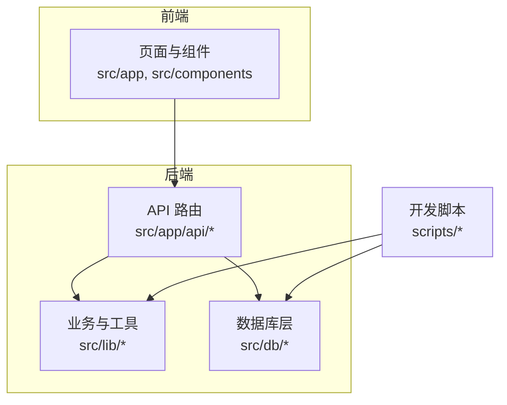
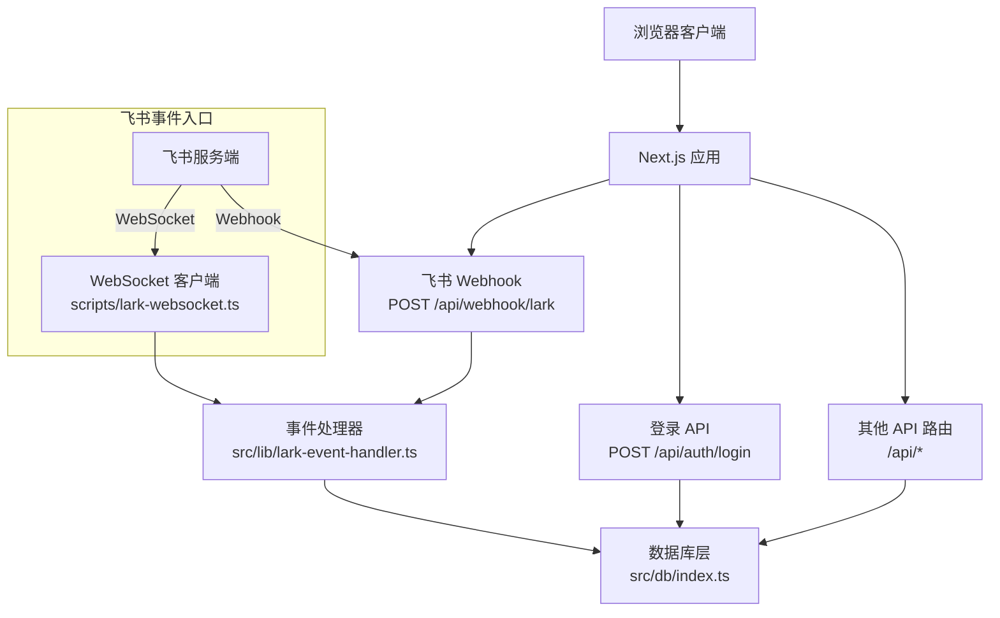
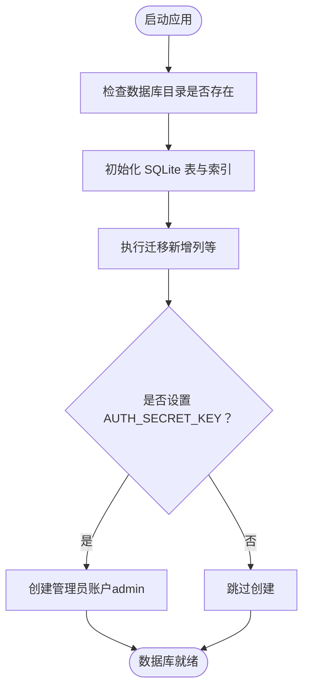
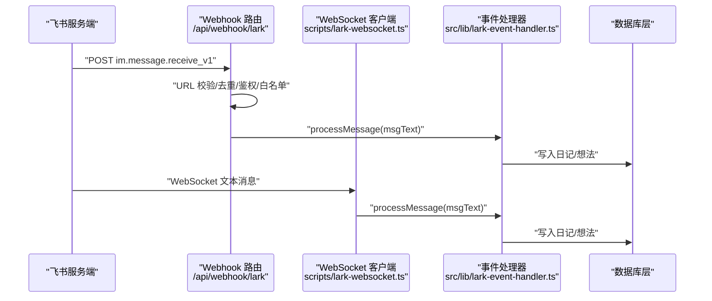
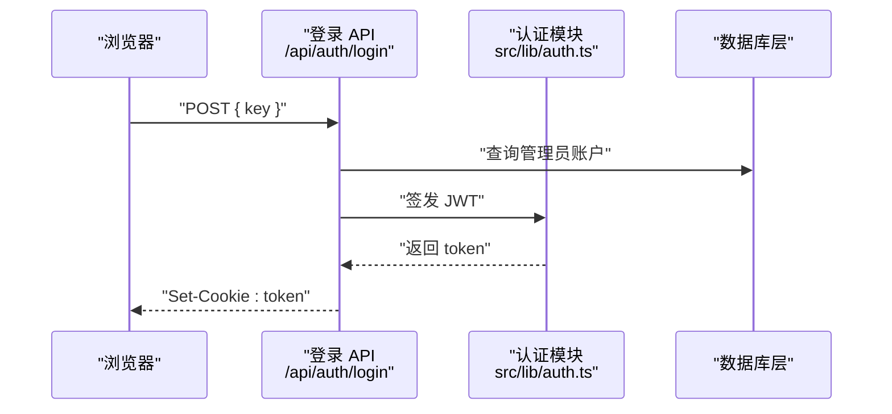
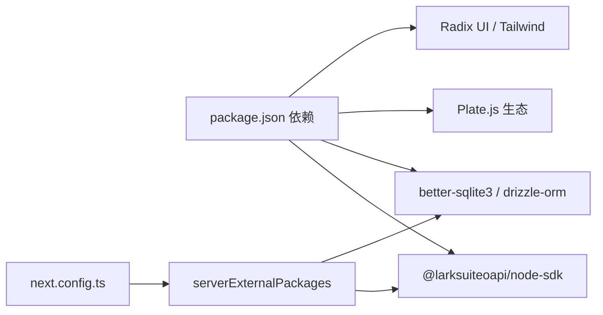

# 快速开始

<cite>
**本文引用的文件**
- [README.md](file://README.md)
- [package.json](file://package.json)
- [drizzle.config.ts](file://drizzle.config.ts)
- [src/db/schema.ts](file://src/db/schema.ts)
- [src/db/index.ts](file://src/db/index.ts)
- [src/lib/lark.ts](file://src/lib/lark.ts)
- [src/lib/lark-event-handler.ts](file://src/lib/lark-event-handler.ts)
- [src/app/api/webhook/lark/route.ts](file://src/app/api/webhook/lark/route.ts)
- [scripts/lark-websocket.ts](file://scripts/lark-websocket.ts)
- [src/app/api/auth/login/route.ts](file://src/app/api/auth/login/route.ts)
- [src/lib/auth.ts](file://src/lib/auth.ts)
- [next.config.ts](file://next.config.ts)
- [tsconfig.json](file://tsconfig.json)
</cite>

## 目录
1. [简介](#简介)
2. [项目结构](#项目结构)
3. [核心组件](#核心组件)
4. [架构总览](#架构总览)
5. [详细组件分析](#详细组件分析)
6. [依赖关系分析](#依赖关系分析)
7. [性能注意事项](#性能注意事项)
8. [故障排除指南](#故障排除指南)
9. [结论](#结论)
10. [附录](#附录)

## 简介
本指南面向初学者与开发者，帮助你在本地快速搭建并运行 YNote v2。你将完成以下任务：
- 准备 Node.js 运行环境
- 安装项目依赖
- 配置数据库与必要环境变量（尤其是飞书相关）
- 初始化数据库并启动开发服务器
- 使用飞书 Webhook 或 WebSocket 接收消息并写入日记/想法
- 常见问题排查与最佳实践

## 项目结构
YNote v2 是基于 Next.js 的应用，采用 App Router 结构，核心目录与职责概览如下：
- src/app：页面与 API 路由
- src/components：可复用 UI 组件
- src/lib：业务逻辑与工具函数（如飞书 SDK、认证、事件处理等）
- src/db：数据库 Schema 与连接初始化
- scripts：本地开发脚本（如飞书 WebSocket 客户端）
- 根目录配置：包管理、构建配置、类型系统与 Drizzle 迁移配置

**图表来源**
- [src/app/layout.tsx:1-38](file://src/app/layout.tsx#L1-L38)
- [src/db/index.ts:1-171](file://src/db/index.ts#L1-L171)
- [src/lib/lark.ts:1-96](file://src/lib/lark.ts#L1-L96)
- [scripts/lark-websocket.ts:1-109](file://scripts/lark-websocket.ts#L1-L109)

**章节来源**
- [README.md:1-37](file://README.md#L1-L37)
- [package.json:1-119](file://package.json#L1-L119)
- [tsconfig.json:1-35](file://tsconfig.json#L1-L35)
- [next.config.ts:1-17](file://next.config.ts#L1-L17)

## 核心组件
- 数据库与迁移
  - 使用 SQLite（better-sqlite3）与 Drizzle ORM，Schema 定义在数据库层，支持自动初始化与索引。
  - 迁移配置指向 schema 文件与输出目录。
- 飞书集成
  - 提供 Webhook 与 WebSocket 两种事件接收模式，支持消息解密、去重、白名单过滤。
  - 通过统一事件处理器将消息路由到“日记”或“想法”处理逻辑。
- 认证与安全
  - 使用 JWT 进行登录态签发与校验；默认管理员账户由环境变量初始化。
- 开发脚本
  - 提供独立的飞书 WebSocket 客户端，便于本地调试。

**章节来源**
- [src/db/schema.ts:1-105](file://src/db/schema.ts#L1-L105)
- [src/db/index.ts:1-171](file://src/db/index.ts#L1-L171)
- [drizzle.config.ts:1-8](file://drizzle.config.ts#L1-L8)
- [src/lib/lark.ts:1-96](file://src/lib/lark.ts#L1-L96)
- [src/lib/lark-event-handler.ts:1-126](file://src/lib/lark-event-handler.ts#L1-L126)
- [src/app/api/webhook/lark/route.ts:1-106](file://src/app/api/webhook/lark/route.ts#L1-L106)
- [scripts/lark-websocket.ts:1-109](file://scripts/lark-websocket.ts#L1-L109)
- [src/app/api/auth/login/route.ts:1-63](file://src/app/api/auth/login/route.ts#L1-L63)
- [src/lib/auth.ts:1-26](file://src/lib/auth.ts#L1-L26)

## 架构总览
下图展示了从浏览器到数据库的典型交互路径，以及飞书事件的两条接入方式（Webhook 与 WebSocket）：

**图表来源**
- [src/app/api/auth/login/route.ts:1-63](file://src/app/api/auth/login/route.ts#L1-L63)
- [src/app/api/webhook/lark/route.ts:1-106](file://src/app/api/webhook/lark/route.ts#L1-L106)
- [scripts/lark-websocket.ts:1-109](file://scripts/lark-websocket.ts#L1-L109)
- [src/lib/lark-event-handler.ts:1-126](file://src/lib/lark-event-handler.ts#L1-L126)
- [src/db/index.ts:1-171](file://src/db/index.ts#L1-L171)

## 详细组件分析

### 安装与环境准备
- Node.js 版本
  - 项目使用较新的 Next.js 与 TypeScript，建议使用 Node.js LTS（如 18.x 或 20.x）以获得最佳兼容性。
- 克隆仓库并安装依赖
  - 使用包管理器安装依赖，推荐使用与项目一致的版本。
- 启动开发服务器
  - 支持多命令启动，任选其一即可进入开发模式。

**章节来源**
- [README.md:5-15](file://README.md#L5-L15)
- [package.json:5-11](file://package.json#L5-L11)

### 数据库初始化与迁移
- 默认行为
  - 应用启动时会自动创建数据库目录与表，并初始化索引与必要列；若未存在管理员账户，将根据环境变量创建。
- 迁移配置
  - Drizzle 迁移配置已设定为 SQLite，Schema 路径与输出目录均已在配置中声明。
- 关键环境变量
  - DATABASE_PATH：SQLite 文件路径，默认位于项目内 data 目录。
  - AUTH_SECRET_KEY：用于初始化管理员账户的密钥，首次运行时生效。

**图表来源**
- [src/db/index.ts:10-158](file://src/db/index.ts#L10-L158)
- [drizzle.config.ts:1-8](file://drizzle.config.ts#L1-L8)

**章节来源**
- [src/db/index.ts:1-171](file://src/db/index.ts#L1-L171)
- [drizzle.config.ts:1-8](file://drizzle.config.ts#L1-L8)

### 飞书 API 配置与事件接入
- 必要环境变量
  - LARK_APP_ID、LARK_APP_SECRET：飞书应用凭证
  - LARK_EVENT_MODE：事件模式，"webhook" 或 "websocket"
  - LARK_VERIFICATION_TOKEN：Webhook 校验令牌
  - LARK_ENCRYPT_KEY：消息加密密钥（如启用加密）
  - LARK_ALLOWED_USER_IDS：允许的发送者 Open ID 列表（逗号分隔）
  - LARK_FOLDER_TOKEN：文档库 Token（用于文档同步）
- Webhook 模式
  - 通过 /api/webhook/lark 接收飞书事件，内置去重、鉴权与白名单过滤。
- WebSocket 模式
  - 通过 scripts/lark-websocket.ts 建立长连接，便于本地开发调试。
- 事件处理
  - 统一事件处理器将消息按前缀路由到“日记”或“想法”处理逻辑。

**图表来源**
- [src/app/api/webhook/lark/route.ts:1-106](file://src/app/api/webhook/lark/route.ts#L1-L106)
- [scripts/lark-websocket.ts:1-109](file://scripts/lark-websocket.ts#L1-L109)
- [src/lib/lark-event-handler.ts:1-126](file://src/lib/lark-event-handler.ts#L1-L126)
- [src/lib/lark.ts:1-96](file://src/lib/lark.ts#L1-L96)

**章节来源**
- [src/lib/lark.ts:1-96](file://src/lib/lark.ts#L1-L96)
- [src/app/api/webhook/lark/route.ts:1-106](file://src/app/api/webhook/lark/route.ts#L1-L106)
- [scripts/lark-websocket.ts:1-109](file://scripts/lark-websocket.ts#L1-L109)
- [src/lib/lark-event-handler.ts:1-126](file://src/lib/lark-event-handler.ts#L1-L126)

### 登录与认证流程
- 登录接口
  - 通过 /api/auth/login 校验密钥，成功后颁发 JWT 并写入 HttpOnly Cookie。
- JWT 配置
  - JWT_SECRET 与 JWT_EXPIRY 可通过环境变量自定义。
- 速率限制
  - 登录接口内置速率限制，防止暴力破解。

**图表来源**
- [src/app/api/auth/login/route.ts:1-63](file://src/app/api/auth/login/route.ts#L1-L63)
- [src/lib/auth.ts:1-26](file://src/lib/auth.ts#L1-L26)
- [src/db/index.ts:142-157](file://src/db/index.ts#L142-L157)

**章节来源**
- [src/app/api/auth/login/route.ts:1-63](file://src/app/api/auth/login/route.ts#L1-L63)
- [src/lib/auth.ts:1-26](file://src/lib/auth.ts#L1-L26)
- [src/db/index.ts:142-157](file://src/db/index.ts#L142-L157)

### 本地开发完整设置流程
- 步骤清单
  1) 准备 Node.js 环境（建议使用 LTS）
  2) 安装依赖（package.json 中已列出）
  3) 创建 .env 文件，填写飞书与数据库相关环境变量
  4) 启动数据库初始化（首次运行自动完成）
  5) 选择一种事件接入模式：
     - Webhook：在飞书控制台配置回调地址与令牌
     - WebSocket：运行脚本建立长连接（本地开发推荐）
  6) 启动开发服务器，访问 http://localhost:3000
- 命令参考
  - 开发服务器：npm run dev
  - 单独启动飞书 WebSocket：npm run lark:ws
  - 同时启动开发服务器与 WebSocket：npm run dev:ws

**章节来源**
- [README.md:5-15](file://README.md#L5-L15)
- [package.json:5-11](file://package.json#L5-L11)
- [scripts/lark-websocket.ts:1-109](file://scripts/lark-websocket.ts#L1-L109)

## 依赖关系分析
- 外部依赖
  - 飞书 SDK：@larksuiteoapi/node-sdk
  - 数据库：better-sqlite3 + drizzle-orm
  - 编辑器与 UI：Plate.js 生态、Radix UI、Tailwind
- 构建与运行
  - Next.js 16、TypeScript、Tailwind PostCSS
  - 服务器外部依赖在 next.config 中声明，避免打包问题

**图表来源**
- [package.json:13-99](file://package.json#L13-L99)
- [next.config.ts:4-10](file://next.config.ts#L4-L10)

**章节来源**
- [package.json:1-119](file://package.json#L1-L119)
- [next.config.ts:1-17](file://next.config.ts#L1-L17)

## 性能注意事项
- SQLite 与 Drizzle
  - WAL 模式与外键开启有助于并发与一致性；注意在生产部署时评估 SQLite 的并发能力。
- 事件处理
  - Webhook 与 WebSocket 均实现事件去重与白名单过滤，避免重复处理与越权消息。
- 上传与媒体
  - 项目包含媒体处理与上传相关依赖，建议在生产环境配置合适的存储与 CDN。

[本节为通用指导，不直接分析具体文件]

## 故障排除指南
- 启动失败：找不到模块或无法解析
  - 确认已安装所有依赖；检查 next.config 的 serverExternalPackages 是否包含缺失的原生模块。
- 飞书事件无响应
  - 确认 LARK_APP_ID/LARK_APP_SECRET 已正确设置；若使用 WebSocket，确认脚本已运行且日志显示连接成功。
  - 若启用加密，请设置 LARK_ENCRYPT_KEY 或在飞书控制台关闭加密。
- 登录失败或频繁触发限流
  - 检查 AUTH_SECRET_KEY 是否已设置并正确初始化管理员账户；查看速率限制返回头信息。
- 数据库异常
  - 检查 DATABASE_PATH 权限与磁盘空间；确认 SQLite 文件可读写。

**章节来源**
- [next.config.ts:4-10](file://next.config.ts#L4-L10)
- [src/lib/lark.ts:10-27](file://src/lib/lark.ts#L10-L27)
- [scripts/lark-websocket.ts:24-27](file://scripts/lark-websocket.ts#L24-L27)
- [src/app/api/auth/login/route.ts:12-25](file://src/app/api/auth/login/route.ts#L12-L25)
- [src/db/index.ts:8-14](file://src/db/index.ts#L8-L14)

## 结论
通过以上步骤，你可以在本地完成 YNote v2 的安装、配置与运行。建议优先使用 WebSocket 模式进行本地开发，再在生产环境切换至 Webhook 并完善安全与监控。遇到问题时，优先核对环境变量与日志输出，结合本指南的故障排除部分定位原因。

[本节为总结性内容，不直接分析具体文件]

## 附录

### 环境变量清单与说明
- 飞书相关
  - LARK_APP_ID：飞书应用 ID
  - LARK_APP_SECRET：飞书应用 Secret
  - LARK_EVENT_MODE：事件模式（"webhook" 或 "websocket"）
  - LARK_VERIFICATION_TOKEN：Webhook 校验令牌
  - LARK_ENCRYPT_KEY：消息加密密钥（可选）
  - LARK_ALLOWED_USER_IDS：允许的发送者 Open ID 列表（逗号分隔）
  - LARK_FOLDER_TOKEN：文档库 Token（可选）
- 认证与安全
  - JWT_SECRET：JWT 密钥（建议自定义）
  - JWT_EXPIRY：JWT 过期时间（如 "7d"）
  - AUTH_SECRET_KEY：初始化管理员账户使用的密钥
- 数据库
  - DATABASE_PATH：SQLite 文件路径（默认 ./data/ynote.db）

**章节来源**
- [src/lib/lark.ts:10-64](file://src/lib/lark.ts#L10-L64)
- [src/lib/auth.ts:3-4](file://src/lib/auth.ts#L3-L4)
- [src/db/index.ts:8-157](file://src/db/index.ts#L8-L157)

### 基本使用示例
- 登录
  - 向 /api/auth/login 发送包含密钥的 POST 请求，成功后浏览器将收到带 token 的 Cookie。
- 写入日记
  - 在飞书中向机器人发送以“日记：”或“日记:”开头的消息，系统将自动创建或追加到当天日记。
- 创建想法
  - 发送非日记前缀的消息将被识别为想法并保存。

**章节来源**
- [src/app/api/auth/login/route.ts:1-63](file://src/app/api/auth/login/route.ts#L1-L63)
- [src/lib/lark-event-handler.ts:104-125](file://src/lib/lark-event-handler.ts#L104-L125)