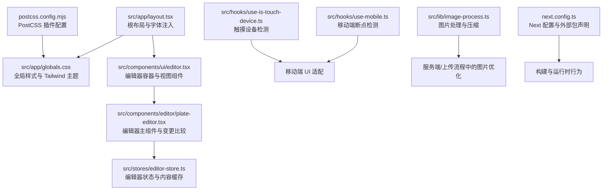
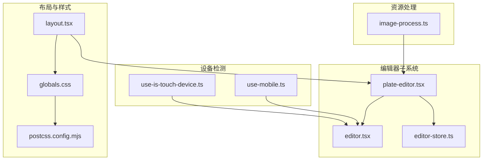
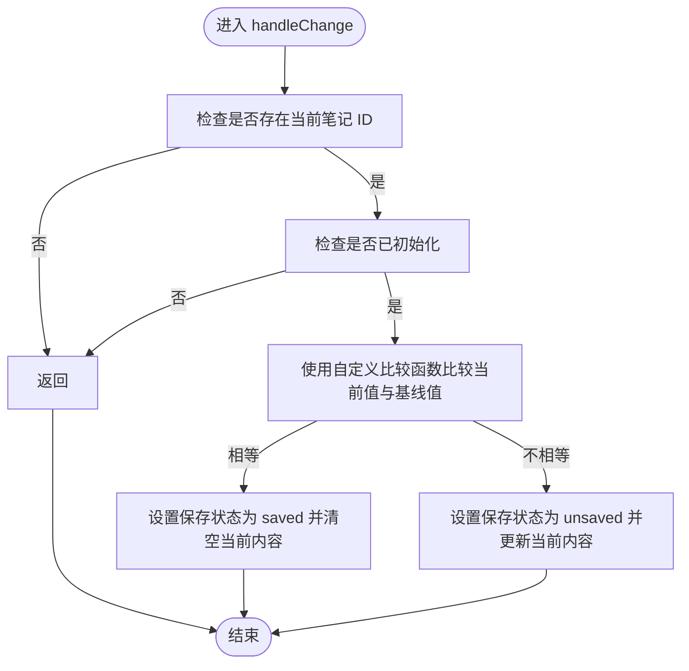
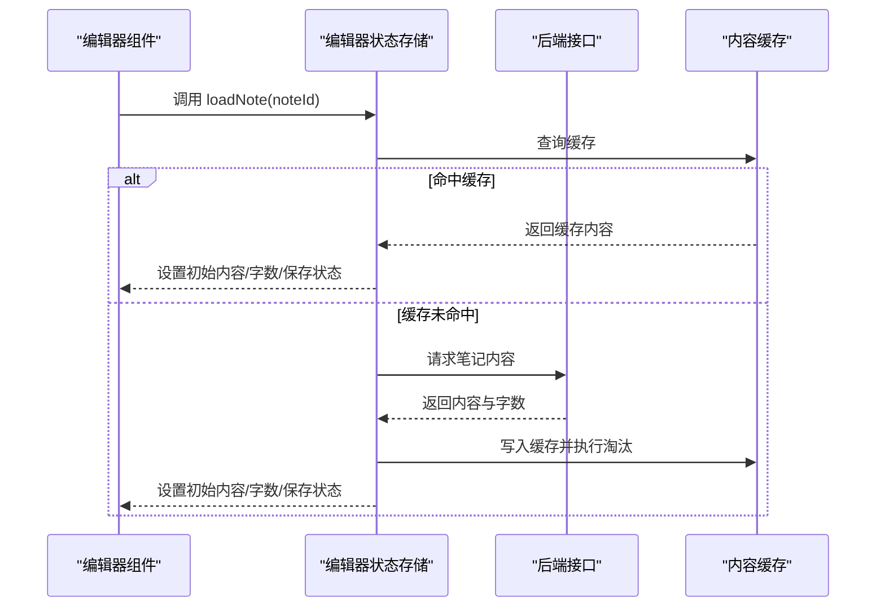
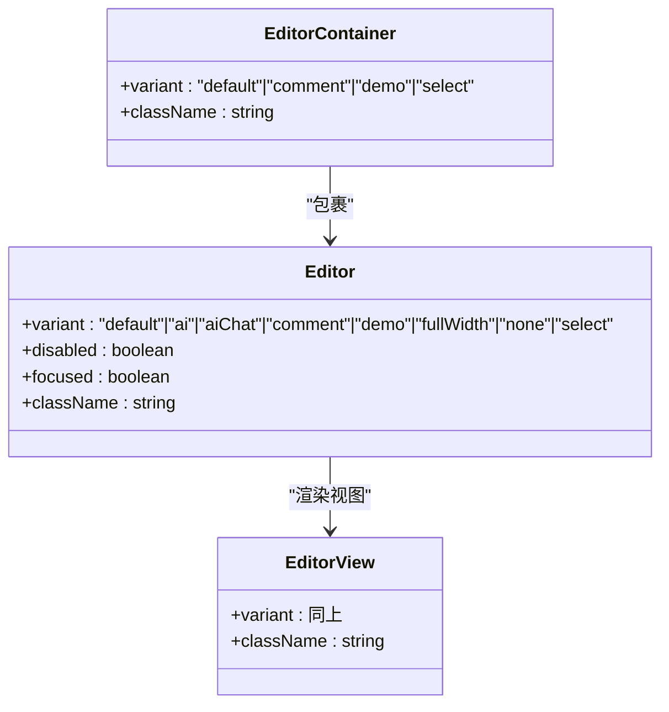
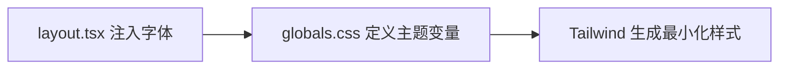
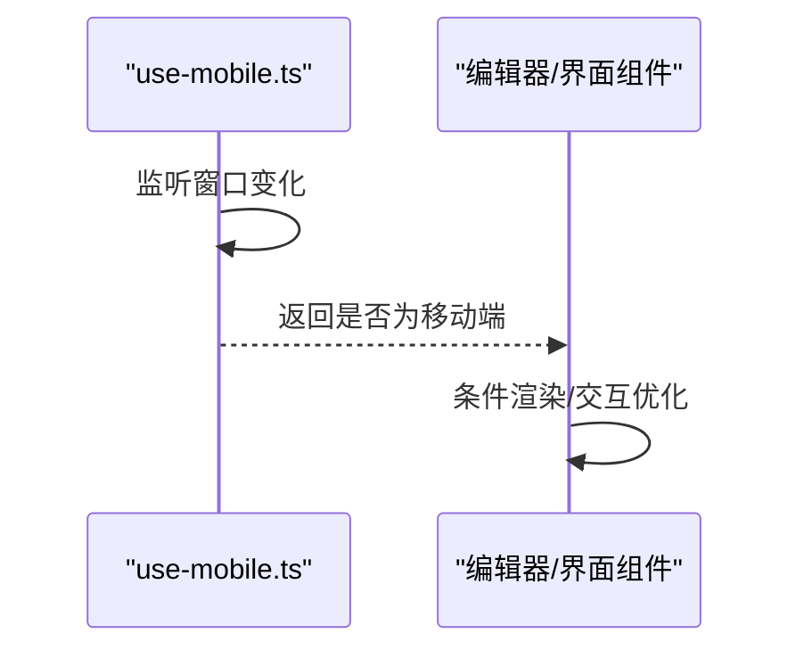
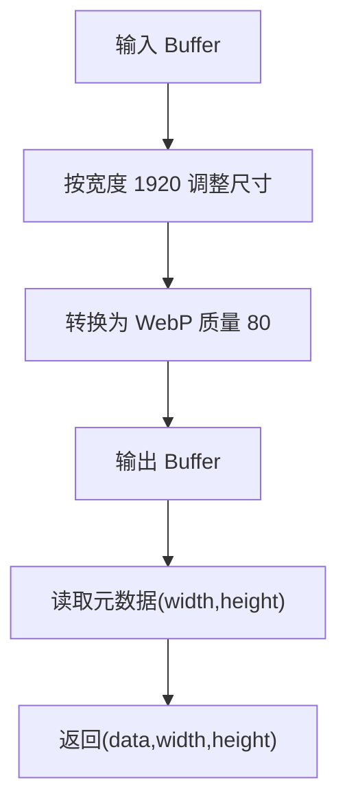
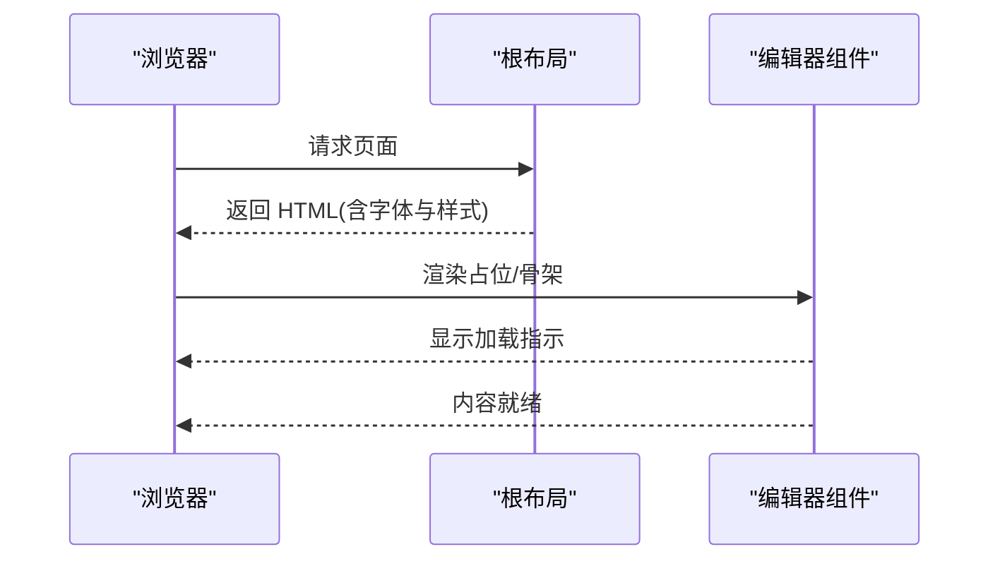
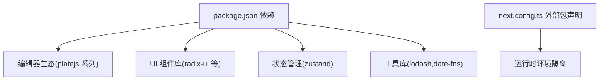

# 客户端性能优化

<cite>
**本文引用的文件**
- [next.config.ts](file://next.config.ts)
- [package.json](file://package.json)
- [src/app/layout.tsx](file://src/app/layout.tsx)
- [src/app/globals.css](file://src/app/globals.css)
- [postcss.config.mjs](file://postcss.config.mjs)
- [src/components/editor/plate-editor.tsx](file://src/components/editor/plate-editor.tsx)
- [src/stores/editor-store.ts](file://src/stores/editor-store.ts)
- [src/components/ui/editor.tsx](file://src/components/ui/editor.tsx)
- [src/hooks/use-is-touch-device.ts](file://src/hooks/use-is-touch-device.ts)
- [src/hooks/use-mobile.ts](file://src/hooks/use-mobile.ts)
- [src/lib/image-process.ts](file://src/lib/image-process.ts)
- [src/app/page.tsx](file://src/app/page.tsx)
- [src/hooks/use-mounted.ts](file://src/hooks/use-mounted.ts)
- [src/hooks/use-debounce.ts](file://src/hooks/use-debounce.ts)
</cite>

## 目录
1. [简介](#简介)
2. [项目结构](#项目结构)
3. [核心组件](#核心组件)
4. [架构总览](#架构总览)
5. [详细组件分析](#详细组件分析)
6. [依赖分析](#依赖分析)
7. [性能考量](#性能考量)
8. [故障排查指南](#故障排查指南)
9. [结论](#结论)
10. [附录](#附录)

## 简介
本指南聚焦于客户端性能优化，结合当前仓库中的 Next.js 应用实现，系统阐述以下主题：代码分割与懒加载、预取机制；静态资源优化（图片、字体、CSS）；组件渲染优化（React.memo、useMemo、useCallback 的使用建议）；浏览器缓存与 HTTP 头配置；客户端性能监控与分析工具使用；首屏加载与渐进式渲染策略；PWA 特性与离线缓存；第三方库体积优化与按需加载；错误边界与性能降级策略；移动端性能与触摸事件优化。

## 项目结构
该应用采用 Next.js App Router 结构，页面入口位于 src/app 下，全局样式通过 src/app/globals.css 引入，字体通过 next/font/google 注入。编辑器基于 platejs，状态管理采用 zustand，移动端与触摸设备检测通过自定义 Hook 实现。

**图表来源**
- [src/app/layout.tsx:1-38](file://src/app/layout.tsx#L1-L38)
- [src/app/globals.css:1-227](file://src/app/globals.css#L1-L227)
- [src/components/ui/editor.tsx:1-131](file://src/components/ui/editor.tsx#L1-L131)
- [src/components/editor/plate-editor.tsx:1-175](file://src/components/editor/plate-editor.tsx#L1-L175)
- [src/stores/editor-store.ts:1-281](file://src/stores/editor-store.ts#L1-L281)
- [src/hooks/use-mobile.ts:1-21](file://src/hooks/use-mobile.ts#L1-L21)
- [src/hooks/use-is-touch-device.ts:1-27](file://src/hooks/use-is-touch-device.ts#L1-L27)
- [src/lib/image-process.ts:1-21](file://src/lib/image-process.ts#L1-L21)
- [next.config.ts:1-17](file://next.config.ts#L1-L17)
- [postcss.config.mjs:1-8](file://postcss.config.mjs#L1-L8)

**章节来源**
- [src/app/layout.tsx:1-38](file://src/app/layout.tsx#L1-L38)
- [src/app/globals.css:1-227](file://src/app/globals.css#L1-L227)
- [postcss.config.mjs:1-8](file://postcss.config.mjs#L1-L8)
- [next.config.ts:1-17](file://next.config.ts#L1-L17)

## 核心组件
- 编辑器主组件：负责内容变更比较、初始化与保存状态更新，减少不必要的重渲染。
- 编辑器 UI 组件：封装容器与视图，支持多种变体，避免默认样式开销。
- 编辑器状态存储：提供 LRU 内容缓存、异步加载与手动保存逻辑。
- 移动端与触摸检测 Hook：用于条件渲染与交互优化。
- 图片处理工具：在上传/生成缩略图场景中进行尺寸与格式优化。

**章节来源**
- [src/components/editor/plate-editor.tsx:63-175](file://src/components/editor/plate-editor.tsx#L63-L175)
- [src/components/ui/editor.tsx:36-131](file://src/components/ui/editor.tsx#L36-L131)
- [src/stores/editor-store.ts:88-281](file://src/stores/editor-store.ts#L88-L281)
- [src/hooks/use-mobile.ts:1-21](file://src/hooks/use-mobile.ts#L1-L21)
- [src/hooks/use-is-touch-device.ts:1-27](file://src/hooks/use-is-touch-device.ts#L1-L27)
- [src/lib/image-process.ts:1-21](file://src/lib/image-process.ts#L1-L21)

## 架构总览
应用采用“布局层 → 页面/组件层 → 工具与存储层”的分层设计。编辑器作为重型组件，通过本地缓存与变更比较降低渲染成本；UI 组件通过变体系统减少重复样式；移动端与触摸检测为不同设备提供差异化体验。

**图表来源**
- [src/app/layout.tsx:22-37](file://src/app/layout.tsx#L22-L37)
- [src/app/globals.css:1-227](file://src/app/globals.css#L1-L227)
- [postcss.config.mjs:1-8](file://postcss.config.mjs#L1-L8)
- [src/components/editor/plate-editor.tsx:63-175](file://src/components/editor/plate-editor.tsx#L63-L175)
- [src/components/ui/editor.tsx:36-131](file://src/components/ui/editor.tsx#L36-L131)
- [src/stores/editor-store.ts:88-281](file://src/stores/editor-store.ts#L88-L281)
- [src/hooks/use-mobile.ts:1-21](file://src/hooks/use-mobile.ts#L1-L21)
- [src/hooks/use-is-touch-device.ts:1-27](file://src/hooks/use-is-touch-device.ts#L1-L27)
- [src/lib/image-process.ts:1-21](file://src/lib/image-process.ts#L1-L21)

## 详细组件分析

### 编辑器渲染优化与变更比较
- 使用自定义深度比较函数替代 JSON.stringify，显著降低大内容对比成本。
- 在内容未变化时仅更新保存状态而不触发额外渲染。
- 初始化完成后设置标志位，避免在切换笔记时的重复计算。

**图表来源**
- [src/components/editor/plate-editor.tsx:84-99](file://src/components/editor/plate-editor.tsx#L84-L99)
- [src/components/editor/plate-editor.tsx:16-61](file://src/components/editor/plate-editor.tsx#L16-L61)

**章节来源**
- [src/components/editor/plate-editor.tsx:63-175](file://src/components/editor/plate-editor.tsx#L63-L175)

### 编辑器状态与内容缓存
- 提供 LRU 缓存，限制最大缓存条目数量，淘汰最久未使用项。
- 加载内容时优先命中缓存，减少网络请求与解析成本。
- 保存成功后同步更新缓存，保证一致性。

**图表来源**
- [src/stores/editor-store.ts:114-155](file://src/stores/editor-store.ts#L114-L155)
- [src/stores/editor-store.ts:66-77](file://src/stores/editor-store.ts#L66-L77)

**章节来源**
- [src/stores/editor-store.ts:88-281](file://src/stores/editor-store.ts#L88-L281)

### 编辑器 UI 变体与样式优化
- 通过变体系统控制容器与视图的不同表现，避免重复样式类与默认样式开销。
- 使用禁用默认样式选项，减少不必要的 CSS 规则匹配。

**图表来源**
- [src/components/ui/editor.tsx:11-51](file://src/components/ui/editor.tsx#L11-L51)
- [src/components/ui/editor.tsx:53-113](file://src/components/ui/editor.tsx#L53-L113)
- [src/components/ui/editor.tsx:117-131](file://src/components/ui/editor.tsx#L117-L131)

**章节来源**
- [src/components/ui/editor.tsx:1-131](file://src/components/ui/editor.tsx#L1-L131)

### 字体与 CSS 优化
- 字体通过 next/font/google 按需注入，减少 FOIT/FOUT。
- 全局样式使用 Tailwind 与自定义变量，集中主题管理，减少重复样式。

**图表来源**
- [src/app/layout.tsx:7-15](file://src/app/layout.tsx#L7-L15)
- [src/app/globals.css:6-57](file://src/app/globals.css#L6-L57)
- [postcss.config.mjs:1-8](file://postcss.config.mjs#L1-L8)

**章节来源**
- [src/app/layout.tsx:1-38](file://src/app/layout.tsx#L1-L38)
- [src/app/globals.css:1-227](file://src/app/globals.css#L1-L227)
- [postcss.config.mjs:1-8](file://postcss.config.mjs#L1-L8)

### 移动端与触摸设备优化
- 使用媒体查询与断点检测，动态调整 UI 行为。
- 通过触摸设备检测决定交互细节（如手势、点击反馈）。

**图表来源**
- [src/hooks/use-mobile.ts:5-19](file://src/hooks/use-mobile.ts#L5-L19)

**章节来源**
- [src/hooks/use-mobile.ts:1-21](file://src/hooks/use-mobile.ts#L1-L21)
- [src/hooks/use-is-touch-device.ts:1-27](file://src/hooks/use-is-touch-device.ts#L1-L27)

### 图片处理与压缩
- 使用 sharp 对图片进行尺寸调整与 WebP 压缩，降低带宽与存储成本。
- 返回压缩后的数据与元信息，便于后续展示与处理。

**图表来源**
- [src/lib/image-process.ts:3-20](file://src/lib/image-process.ts#L3-L20)

**章节来源**
- [src/lib/image-process.ts:1-21](file://src/lib/image-process.ts#L1-L21)

### 首屏加载与渐进式渲染
- 根布局中注入字体与全局样式，减少首屏闪烁。
- 编辑器在无内容时显示占位提示，加载时显示骨架状态，提升感知性能。

**图表来源**
- [src/app/layout.tsx:22-37](file://src/app/layout.tsx#L22-L37)
- [src/components/editor/plate-editor.tsx:155-173](file://src/components/editor/plate-editor.tsx#L155-L173)

**章节来源**
- [src/app/layout.tsx:1-38](file://src/app/layout.tsx#L1-L38)
- [src/components/editor/plate-editor.tsx:155-173](file://src/components/editor/plate-editor.tsx#L155-L173)

## 依赖分析
- 第三方库集中在编辑器生态（platejs 及其插件）、UI 组件库（radix-ui）、状态管理（zustand）、工具库（lodash、date-fns）等。
- 通过按需引入与变体系统减少冗余代码与样式。
- 服务器外部包在 next.config 中声明，避免打包到客户端。

**图表来源**
- [package.json:13-99](file://package.json#L13-L99)
- [next.config.ts:4-10](file://next.config.ts#L4-L10)

**章节来源**
- [package.json:1-119](file://package.json#L1-L119)
- [next.config.ts:1-17](file://next.config.ts#L1-L17)

## 性能考量
- 代码分割与懒加载
  - 将重型编辑器组件与插件按需加载，减少首屏 JS 体积。
  - 利用 React.lazy 与 Suspense 包裹非关键路径组件。
- 预取机制
  - 对用户即将访问的页面或笔记内容使用预取策略，降低等待时间。
- 静态资源优化
  - 图片：使用 WebP、按需压缩与尺寸调整；在服务端或上传流程中处理。
  - 字体：next/font 按需注入，避免全量字体加载。
  - CSS：Tailwind 与 PostCSS 生成最小化样式，移除未使用规则。
- 组件渲染优化
  - 使用 useCallback 包裹事件处理器与回调，避免子组件重复渲染。
  - 使用 useMemo 缓存昂贵计算结果，配合依赖数组稳定化。
  - 使用 React.memo 包裹纯展示组件，减少不必要重渲染。
- 浏览器缓存与 HTTP 头
  - 静态资源设置长缓存与版本化命名，确保更新可感知。
  - 动态内容设置合理的 Cache-Control 与 ETag/Last-Modified。
- 客户端性能监控
  - 使用浏览器性能 API（PerformanceObserver、LCP、CLS、FID）采集指标。
  - 结合日志上报与埋点，持续跟踪关键指标。
- 首屏与渐进式渲染
  - 采用骨架屏与占位符，优先渲染关键路径内容。
  - 将非关键内容延迟加载，提升感知速度。
- PWA 与离线缓存
  - 注册 Service Worker，缓存关键资源与页面模板。
  - 使用 Cache First/Network Falling Back 策略处理离线场景。
- 第三方库体积优化
  - 采用按需导入与 Tree Shaking，移除未使用模块。
  - 替换体积较大的库为更轻量的替代方案。
- 错误边界与降级
  - 使用错误边界捕获渲染异常，提供降级 UI 与恢复入口。
  - 对网络失败与超时进行优雅降级与重试。
- 移动端与触摸优化
  - 使用媒体查询与断点检测，适配小屏交互。
  - 优化触摸目标尺寸与响应时间，减少误触。

## 故障排查指南
- 编辑器内容未更新或保存状态异常
  - 检查变更比较逻辑与基线值更新时机。
  - 确认保存成功后缓存是否同步更新。
- 移动端交互异常
  - 核对断点与触摸检测 Hook 的返回值。
  - 检查事件绑定与防抖策略。
- 图片加载缓慢
  - 确认压缩参数与尺寸是否合理。
  - 检查 CDN 与缓存策略配置。
- 首屏白屏或闪烁
  - 检查字体加载与样式注入顺序。
  - 确保关键资源优先加载。

**章节来源**
- [src/components/editor/plate-editor.tsx:84-144](file://src/components/editor/plate-editor.tsx#L84-L144)
- [src/stores/editor-store.ts:204-275](file://src/stores/editor-store.ts#L204-L275)
- [src/hooks/use-mobile.ts:5-19](file://src/hooks/use-mobile.ts#L5-L19)
- [src/hooks/use-is-touch-device.ts:5-25](file://src/hooks/use-is-touch-device.ts#L5-L25)
- [src/lib/image-process.ts:3-20](file://src/lib/image-process.ts#L3-L20)
- [src/app/layout.tsx:22-37](file://src/app/layout.tsx#L22-L37)

## 结论
通过在编辑器层面实施变更比较与缓存策略、在 UI 层采用变体系统与最小化样式、在设备层进行断点与触摸优化，并结合图片处理与字体按需加载，本项目已在客户端性能方面形成较为完善的实践体系。建议在此基础上进一步完善懒加载、预取、PWA 与监控体系，以获得更佳的用户体验与性能表现。

## 附录
- 快速检查清单
  - 是否对重型组件启用懒加载？
  - 是否对图片进行压缩与格式优化？
  - 是否使用变体系统减少样式冗余？
  - 是否针对移动端与触摸设备进行专项优化？
  - 是否配置了合适的缓存与 HTTP 头？
  - 是否接入性能监控并设定告警？