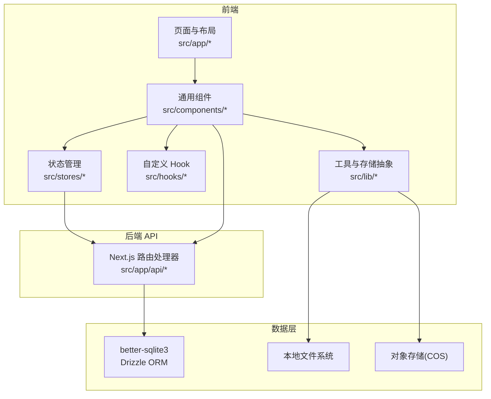
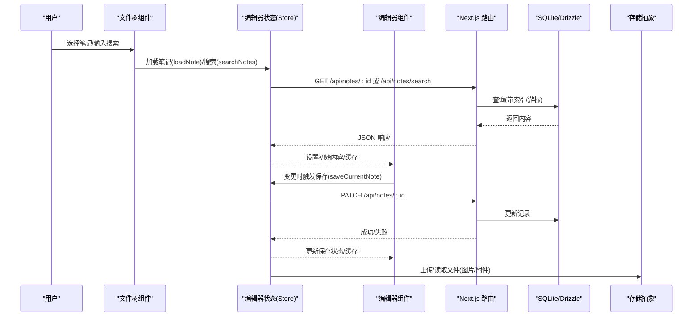
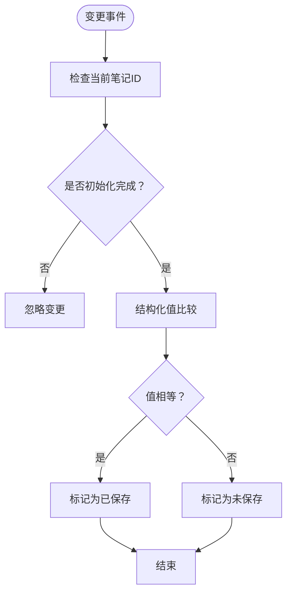
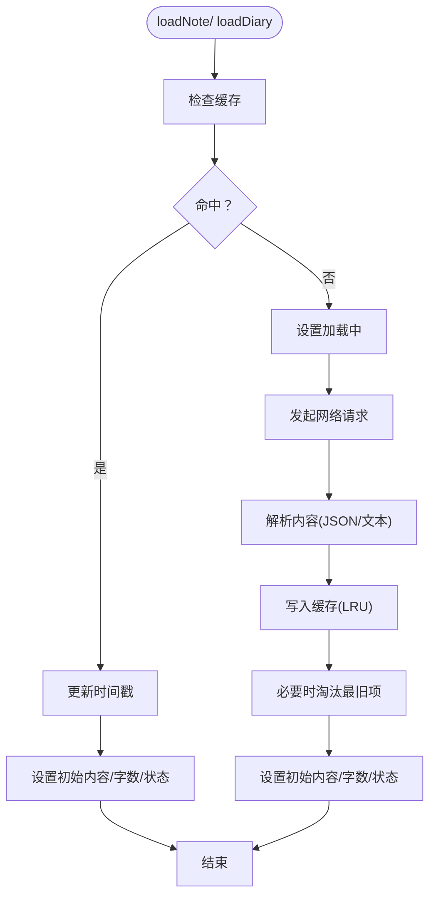
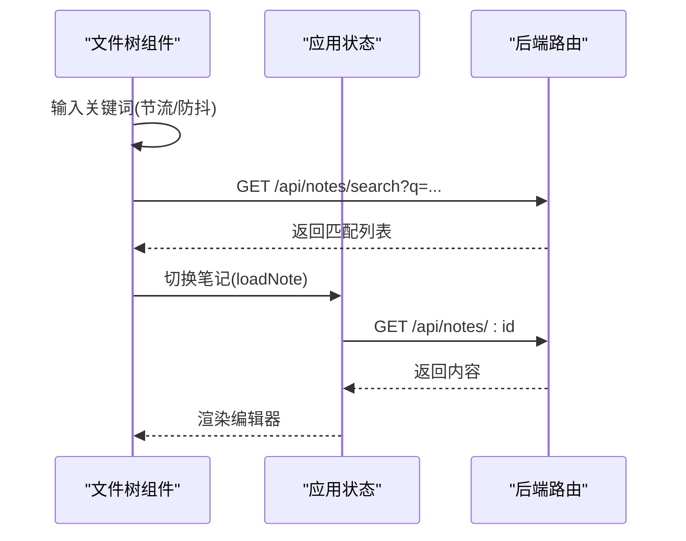
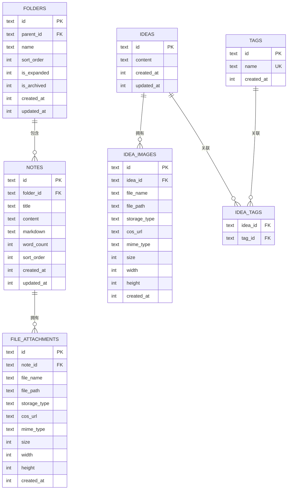
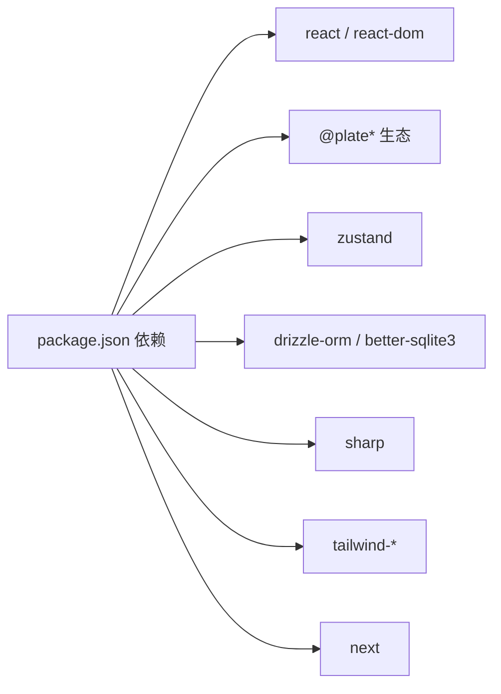

# 性能优化

<cite>
**本文引用的文件**
- [README.md](file://README.md)
- [package.json](file://package.json)
- [next.config.ts](file://next.config.ts)
- [src/db/index.ts](file://src/db/index.ts)
- [src/db/schema.ts](file://src/db/schema.ts)
- [src/components/editor/plate-editor.tsx](file://src/components/editor/plate-editor.tsx)
- [src/stores/editor-store.ts](file://src/stores/editor-store.ts)
- [src/stores/app-store.ts](file://src/stores/app-store.ts)
- [src/components/file-tree/file-tree.tsx](file://src/components/file-tree/file-tree.tsx)
- [src/hooks/use-debounce.ts](file://src/hooks/use-debounce.ts)
- [src/hooks/use-is-touch-device.ts](file://src/hooks/use-is-touch-device.ts)
- [src/hooks/use-mobile.ts](file://src/hooks/use-mobile.ts)
- [src/lib/utils.ts](file://src/lib/utils.ts)
- [src/lib/storage/index.ts](file://src/lib/storage/index.ts)
- [src/lib/image-process.ts](file://src/lib/image-process.ts)
- [src/app/api/files/[...path]/route.ts](file://src/app/api/files/[...path]/route.ts)
- [src/app/api/upload/route.ts](file://src/app/api/upload/route.ts)
- [src/app/api/ideas/route.ts](file://src/app/api/ideas/route.ts)
</cite>

## 目录
1. [简介](#简介)
2. [项目结构](#项目结构)
3. [核心组件](#核心组件)
4. [架构总览](#架构总览)
5. [详细组件分析](#详细组件分析)
6. [依赖关系分析](#依赖关系分析)
7. [性能考量与优化建议](#性能考量与优化建议)
8. [故障排查指南](#故障排查指南)
9. [结论](#结论)
10. [附录](#附录)

## 简介
本指南聚焦于该编辑器型应用在前端、后端与数据库层面的性能优化实践，涵盖以下主题：
- 编辑器性能：虚拟滚动、增量渲染与内存管理
- 数据库查询：索引使用、查询缓存与批量操作
- 网络请求：请求合并、缓存策略与错误重试
- 客户端性能：代码分割、懒加载与资源压缩
- 性能监控与分析工具使用
- 内存泄漏检测与预防
- 移动端性能：触摸事件优化与电池使用
- CDN 与静态资源优化
- 性能测试与基准测试方法
- 性能问题诊断与解决方案

## 项目结构
该项目基于 Next.js 应用，采用 App Router 结构，前端以 React 组件与 Zustand 状态管理为主，后端通过 Next.js 路由处理 API 请求；数据库使用 better-sqlite3 与 Drizzle ORM，存储层支持本地与对象存储（COS）。

图示来源
- [next.config.ts:1-17](file://next.config.ts#L1-L17)
- [src/db/index.ts:1-171](file://src/db/index.ts#L1-L171)
- [src/lib/storage/index.ts:1-29](file://src/lib/storage/index.ts#L1-L29)

章节来源
- [README.md:1-37](file://README.md#L1-L37)
- [package.json:1-119](file://package.json#L1-L119)
- [next.config.ts:1-17](file://next.config.ts#L1-L17)

## 核心组件
- 编辑器组件与比较逻辑：通过结构化值比较避免不必要的重渲染，并在笔记切换时清理历史与选区，减少跨笔记状态污染。
- 编辑器状态缓存：基于 LRU 的内容缓存，降低重复加载成本。
- 文件树与搜索：防抖搜索、分页/游标加载、批量更新。
- 存储与图片处理：统一存储接口与 Sharp 图片处理链，生成 WebP 并控制尺寸。
- 数据库初始化与索引：WAL 模式、外键启用、多表索引与迁移兼容。

章节来源
- [src/components/editor/plate-editor.tsx:1-175](file://src/components/editor/plate-editor.tsx#L1-L175)
- [src/stores/editor-store.ts:1-281](file://src/stores/editor-store.ts#L1-L281)
- [src/components/file-tree/file-tree.tsx:1-326](file://src/components/file-tree/file-tree.tsx#L1-L326)
- [src/lib/image-process.ts:1-20](file://src/lib/image-process.ts#L1-L20)
- [src/db/index.ts:1-171](file://src/db/index.ts#L1-L171)

## 架构总览
下图展示从用户交互到数据库与存储的关键路径，以及性能优化点位。

图示来源
- [src/components/file-tree/file-tree.tsx:87-122](file://src/components/file-tree/file-tree.tsx#L87-L122)
- [src/stores/editor-store.ts:114-155](file://src/stores/editor-store.ts#L114-L155)
- [src/stores/editor-store.ts:204-275](file://src/stores/editor-store.ts#L204-L275)
- [src/db/index.ts:73-76](file://src/db/index.ts#L73-L76)
- [src/lib/storage/index.ts:12-29](file://src/lib/storage/index.ts#L12-L29)

## 详细组件分析

### 编辑器性能：结构化比较与增量渲染
- 结构化值比较：避免使用 JSON.stringify 进行深度比较，采用递归节点比较，显著降低比较开销与字符串序列化成本。
- 切换笔记时的清理：清空撤销栈、取消选择、滚动至顶部，防止跨笔记状态残留导致的额外计算。
- Markdown 序列化回调：仅在需要时生成，避免在渲染路径中重复计算。
- 保存流程：提取文本统计字数，按需生成 Markdown，减少不必要的序列化。

图示来源
- [src/components/editor/plate-editor.tsx:84-99](file://src/components/editor/plate-editor.tsx#L84-L99)

章节来源
- [src/components/editor/plate-editor.tsx:1-175](file://src/components/editor/plate-editor.tsx#L1-L175)

### 编辑器状态缓存：LRU 与请求去重
- LRU 缓存：限制最大缓存条目数量，按时间戳淘汰最旧项，降低重复请求与解析成本。
- 首次加载优先：命中缓存直接设置初始内容，未命中再发起网络请求。
- 保存后更新缓存：确保缓存与持久化一致。

图示来源
- [src/stores/editor-store.ts:114-155](file://src/stores/editor-store.ts#L114-L155)
- [src/stores/editor-store.ts:66-77](file://src/stores/editor-store.ts#L66-L77)

章节来源
- [src/stores/editor-store.ts:1-281](file://src/stores/editor-store.ts#L1-L281)

### 文件树与搜索：防抖与批量更新
- 搜索防抖：输入变更后延迟触发请求，减少频繁网络调用。
- 分页/游标：服务端按游标与限制返回，避免一次性拉取过多数据。
- 批量更新：展开/折叠文件夹时乐观更新 UI，并并发发起多个 PATCH 请求。

图示来源
- [src/components/file-tree/file-tree.tsx:87-122](file://src/components/file-tree/file-tree.tsx#L87-L122)
- [src/stores/app-store.ts:149-191](file://src/stores/app-store.ts#L149-L191)
- [src/app/api/ideas/route.ts:13-42](file://src/app/api/ideas/route.ts#L13-L42)

章节来源
- [src/components/file-tree/file-tree.tsx:1-326](file://src/components/file-tree/file-tree.tsx#L1-L326)
- [src/stores/app-store.ts:1-318](file://src/stores/app-store.ts#L1-L318)
- [src/app/api/ideas/route.ts:1-42](file://src/app/api/ideas/route.ts#L1-L42)

### 数据库查询优化：索引、WAL 与迁移
- WAL 模式：提升并发读写性能，降低锁竞争。
- 外键约束：保证数据一致性，避免悬挂引用。
- 索引覆盖：对常用过滤字段建立索引（如父目录、笔记归属、标签关联等），加速查询。
- 迁移兼容：运行时检测列存在性并安全添加，避免破坏现有数据。

图示来源
- [src/db/schema.ts:1-105](file://src/db/schema.ts#L1-L105)
- [src/db/index.ts:73-130](file://src/db/index.ts#L73-L130)

章节来源
- [src/db/index.ts:1-171](file://src/db/index.ts#L1-L171)
- [src/db/schema.ts:1-105](file://src/db/schema.ts#L1-L105)

### 网络请求优化：合并、缓存与重试
- 请求合并：批量更新文件夹展开状态时使用 Promise.all 并发请求，减少往返次数。
- 缓存策略：静态资源使用强缓存头，图片与媒体资源通过 CDN 与浏览器缓存提升复用率。
- 错误重试：对幂等操作可采用指数退避重试，非幂等操作需谨慎处理。

章节来源
- [src/stores/app-store.ts:149-191](file://src/stores/app-store.ts#L149-L191)
- [src/app/api/files/[...path]/route.ts:37-42](file://src/app/api/files/[...path]/route.ts#L37-L42)

### 客户端性能：代码分割、懒加载与资源压缩
- 代码分割：利用 Next.js 的路由自动分割与动态导入，按需加载组件。
- 懒加载：图片与媒体组件采用懒加载策略，减少首屏压力。
- 资源压缩：Sharp 对图片进行 WebP 压缩与尺寸控制，降低带宽与渲染成本。

章节来源
- [src/lib/image-process.ts:1-20](file://src/lib/image-process.ts#L1-L20)
- [src/lib/utils.ts:1-7](file://src/lib/utils.ts#L1-L7)

### 存储与 CDN：统一接口与静态资源缓存
- 存储抽象：根据环境变量选择 COS 或本地存储，便于替换与扩展。
- 静态资源：文件路由返回强缓存头，适合长期驻留资源。

章节来源
- [src/lib/storage/index.ts:1-29](file://src/lib/storage/index.ts#L1-L29)
- [src/app/api/files/[...path]/route.ts:1-47](file://src/app/api/files/[...path]/route.ts#L1-L47)

### 移动端性能：触摸事件与电池使用
- 触摸设备检测：通过 resize 事件与特性检测识别触屏设备，调整交互细节。
- 移动断点：使用媒体查询与 Hook 判断移动端，优化布局与交互粒度。

章节来源
- [src/hooks/use-is-touch-device.ts:1-26](file://src/hooks/use-is-touch-device.ts#L1-L26)
- [src/hooks/use-mobile.ts:1-20](file://src/hooks/use-mobile.ts#L1-L20)

## 依赖关系分析
- 前端依赖：React 19、Plate 编辑器生态、Zustand 状态管理、Tailwind 工具类等。
- 后端依赖：better-sqlite3、Drizzle ORM、Sharp 图像处理、COS SDK 等。
- Next.js 配置：外部包声明、代理体限制等，影响构建与运行时行为。

图示来源
- [package.json:13-99](file://package.json#L13-L99)

章节来源
- [package.json:1-119](file://package.json#L1-L119)
- [next.config.ts:1-17](file://next.config.ts#L1-L17)

## 性能考量与优化建议

### 编辑器性能
- 虚拟滚动：对于长文档，建议引入虚拟列表组件，仅渲染可视区域节点，结合结构化比较与缓存进一步降低重排成本。
- 增量渲染：保持不可变数据结构，使用浅比较与选择器减少子组件重渲染。
- 内存管理：在笔记切换时及时释放大对象引用、清理定时器与订阅，避免闭包持有导致的 GC 困难。

### 数据库查询
- 索引策略：围绕高频查询字段建立复合索引（如日记的年/周组合索引），避免全表扫描。
- 查询缓存：对只读列表与搜索结果增加应用层缓存，结合 ETag/Last-Modified 实现条件请求。
- 批量操作：使用事务包裹批量更新，减少 WAL 日志写入次数。

### 网络请求
- 请求合并：对同一批状态更新使用并发请求，减少 RTT。
- 缓存策略：静态资源强缓存，动态内容使用协商缓存；对搜索与列表使用游标/分页。
- 错误重试：幂等请求可采用指数退避，非幂等需去重与幂等键。

### 客户端性能
- 代码分割：将重型编辑器插件按需加载，减少首屏 JS 体积。
- 懒加载：图片、视频与媒体预览组件采用懒加载与占位符。
- 资源压缩：继续优化 Sharp 参数与格式选择，结合 CDN 与 HTTP/2 推送。

### 性能监控与分析
- 浏览器 DevTools：使用 Performance/Network/Memory 面板定位瓶颈。
- RUM：集成轻量级前端监控（如 SPA 导航与关键指标采集）。
- 服务端指标：记录慢查询、错误率与响应时间，结合数据库 EXPLAIN 分析执行计划。

### 内存泄漏检测与预防
- 使用 DevTools Memory 面板定期快照对比，关注持续增长的对象与事件监听器。
- 避免全局单例持有组件实例；在 useEffect/cleanup 中正确解绑事件与订阅。
- 对长生命周期状态（如缓存）设定上限与过期策略。

### 移动端优化
- 触摸事件：减少不必要的 mouseenter/mouseleave，使用 pointer-events 与 touch-action 优化滚动与拖拽。
- 电池使用：降低后台刷新频率、合并网络请求、避免频繁重排与大对象分配。

### CDN 与静态资源
- 将图片、字体与媒体资源托管至 CDN，配置合适的缓存头与压缩。
- 对版本化资源使用 immutable 缓存策略，缩短缓存失效窗口。

### 性能测试与基准测试
- 基准测试：使用浏览器自动化框架（如 Playwright）模拟真实场景，测量首屏、交互延迟与内存峰值。
- 回归测试：在 CI 中加入性能回归阈值，防止性能倒退。

### 诊断与解决方案
- 卡顿定位：使用 Performance 面板查看主线程阻塞，识别长任务与重排。
- 内存泄漏：对比快照差异，定位未释放的 DOM/事件监听器/定时器。
- 网络瓶颈：观察 Network 面板的队头阻塞与重复请求，优化缓存与合并策略。

## 故障排查指南
- 编辑器卡顿：检查结构化比较是否生效、是否频繁触发保存、是否存在未清理的历史与选区。
- 搜索缓慢：确认服务端游标参数与限制是否合理，数据库索引是否覆盖查询条件。
- 图片加载慢：确认 Sharp 压缩参数与 WebP 支持情况，CDN 缓存是否命中。
- 笔记切换异常：检查撤销栈与选区清理逻辑，确保切换时重置状态。

章节来源
- [src/components/editor/plate-editor.tsx:101-136](file://src/components/editor/plate-editor.tsx#L101-L136)
- [src/stores/editor-store.ts:204-275](file://src/stores/editor-store.ts#L204-L275)
- [src/app/api/files/[...path]/route.ts:37-42](file://src/app/api/files/[...path]/route.ts#L37-L42)

## 结论
通过结构化值比较、LRU 缓存、批量更新与索引优化，本项目在编辑器与数据层已具备良好的性能基础。建议在此基础上引入虚拟滚动、CDN 与 RUM 监控，完善错误重试与内存泄漏防护，持续进行性能回归测试，以获得更稳定与流畅的用户体验。

## 附录
- Next.js 配置：外部包与代理体限制
- 数据库初始化：WAL、外键、索引与迁移
- 存储抽象：COS 与本地存储切换
- 图片处理：Sharp 链与 WebP 输出

章节来源
- [next.config.ts:1-17](file://next.config.ts#L1-L17)
- [src/db/index.ts:160-171](file://src/db/index.ts#L160-L171)
- [src/lib/storage/index.ts:12-29](file://src/lib/storage/index.ts#L12-L29)
- [src/lib/image-process.ts:1-20](file://src/lib/image-process.ts#L1-L20)