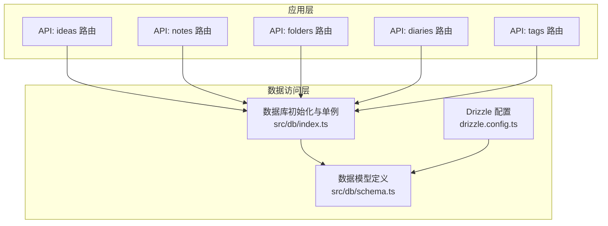
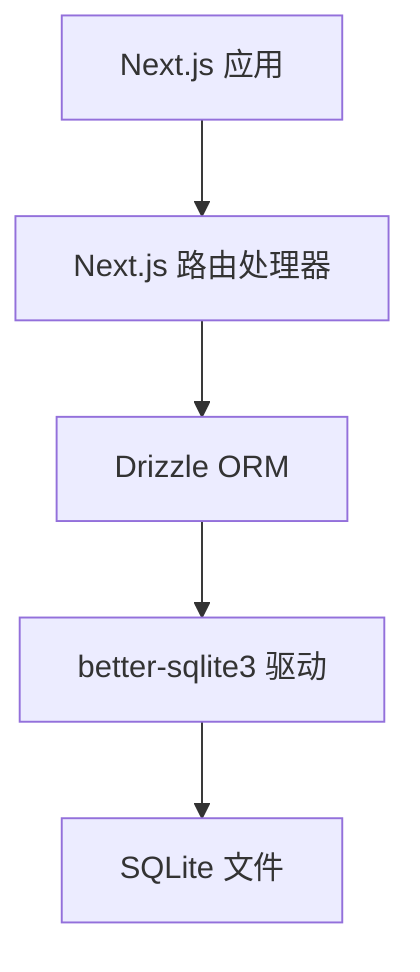
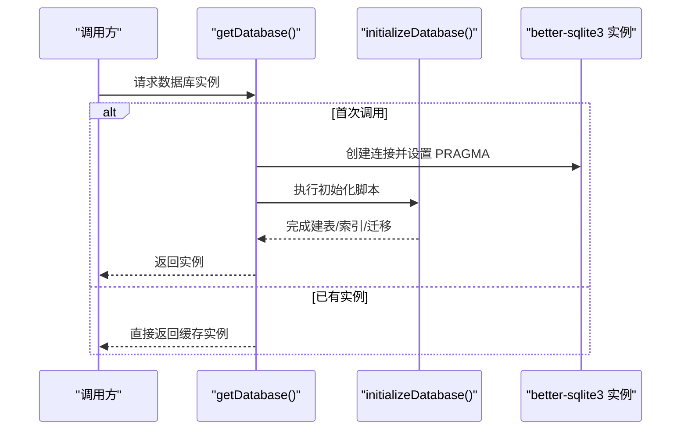
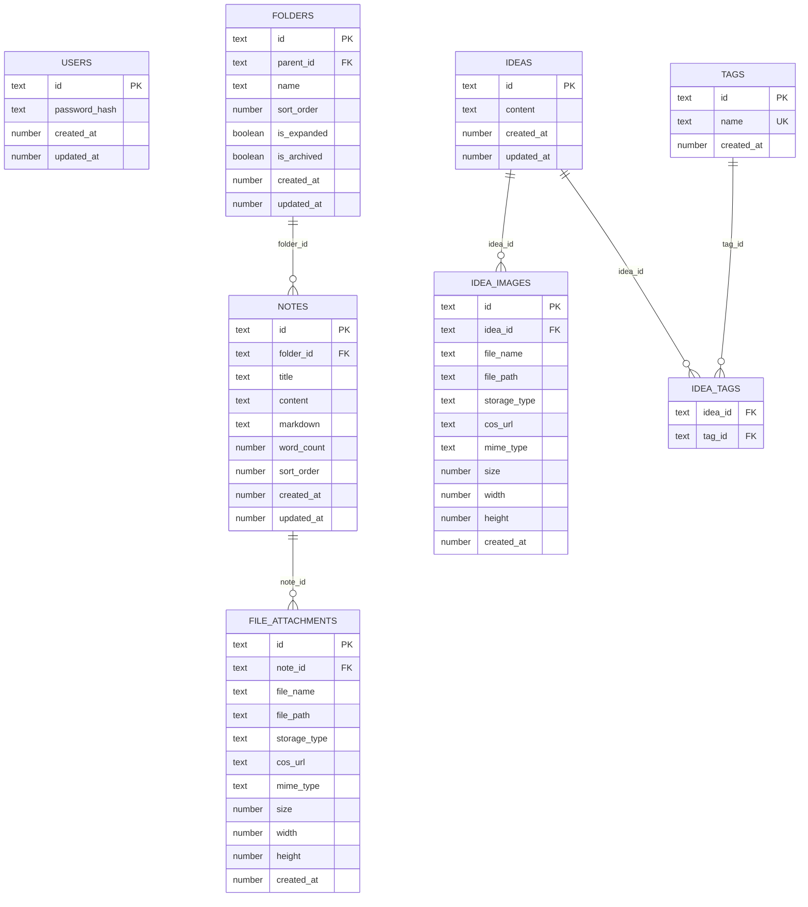
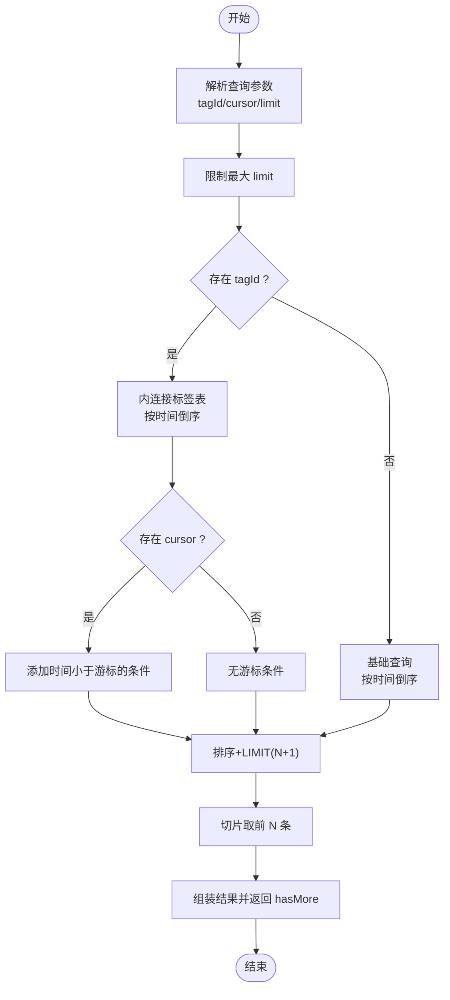
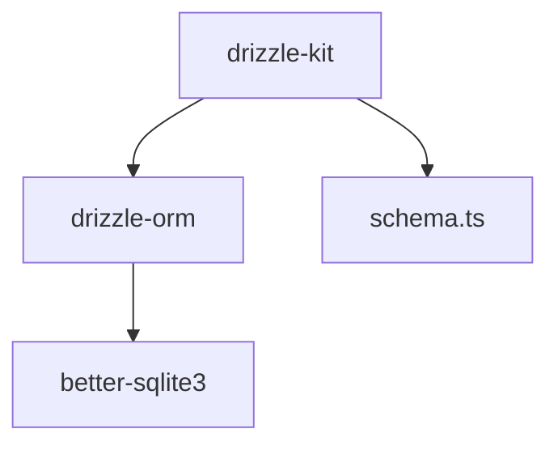

# 数据库查询优化

<cite>
**本文引用的文件**
- [drizzle.config.ts](file://drizzle.config.ts)
- [src/db/index.ts](file://src/db/index.ts)
- [src/db/schema.ts](file://src/db/schema.ts)
- [src/app/api/ideas/route.ts](file://src/app/api/ideas/route.ts)
- [src/app/api/notes/route.ts](file://src/app/api/notes/route.ts)
- [src/app/api/folders/route.ts](file://src/app/api/folders/route.ts)
- [src/app/api/diaries/route.ts](file://src/app/api/diaries/route.ts)
- [src/app/api/tags/route.ts](file://src/app/api/tags/route.ts)
- [package-lock.json](file://package-lock.json)
</cite>

## 目录
1. [简介](#简介)
2. [项目结构](#项目结构)
3. [核心组件](#核心组件)
4. [架构总览](#架构总览)
5. [详细组件分析](#详细组件分析)
6. [依赖关系分析](#依赖关系分析)
7. [性能考量](#性能考量)
8. [故障排查指南](#故障排查指南)
9. [结论](#结论)
10. [附录](#附录)

## 简介
本指南围绕 Drizzle ORM 在本项目的数据库查询优化实践展开，结合现有代码中的索引设计、查询计划与执行效率、连接池与连接复用、批量操作与事务、查询缓存策略、性能监控与慢查询识别、数据模型对查询性能的影响、分页与大数据集处理、以及数据库迁移与版本管理最佳实践进行系统化梳理。目标是帮助开发者在 SQLite（better-sqlite3）环境下，以 Drizzle ORM 为抽象层，构建高性能、可维护的数据库访问层。

## 项目结构
本项目采用“按功能模块划分”的前端工程组织方式，数据库相关的核心文件集中在 src/db 目录，并通过 Drizzle Kit 进行迁移管理。API 路由位于 src/app/api 下，统一通过 getDatabase 单例获取数据库实例，避免重复初始化与连接开销。

图表来源
- [src/db/index.ts:160-168](file://src/db/index.ts#L160-L168)
- [src/db/schema.ts:1-105](file://src/db/schema.ts#L1-105)
- [drizzle.config.ts:1-8](file://drizzle.config.ts#L1-L8)

章节来源
- [src/db/index.ts:160-168](file://src/db/index.ts#L160-L168)
- [src/db/schema.ts:1-105](file://src/db/schema.ts#L1-L105)
- [drizzle.config.ts:1-8](file://drizzle.config.ts#L1-L8)

## 核心组件
- 数据库初始化与单例：通过单例模式确保全局仅有一个数据库连接实例，减少连接建立成本；启用 WAL 模式与外键约束，提升并发写入与一致性。
- 数据模型与索引：基于 Drizzle SQLite 表定义，配合业务查询路径创建必要索引，覆盖常见过滤、排序与关联字段。
- API 路由：统一从 getDatabase 获取连接，按需构建查询，遵循最小权限选择列、合理使用排序与限制，避免 N+1 查询。

章节来源
- [src/db/index.ts:10-25](file://src/db/index.ts#L10-L25)
- [src/db/index.ts:160-168](file://src/db/index.ts#L160-L168)
- [src/db/schema.ts:1-105](file://src/db/schema.ts#L1-L105)

## 架构总览
Drizzle ORM 在本项目中承担以下职责：
- 将 TypeScript 类型映射到 SQLite 表结构
- 提供类型安全的查询构造器
- 与 better-sqlite3 驱动协作，执行 SQL 并返回结果

图表来源
- [src/db/index.ts:1-2](file://src/db/index.ts#L1-L2)
- [src/db/index.ts:16-20](file://src/db/index.ts#L16-L20)

## 详细组件分析

### 数据库初始化与连接复用
- 单例模式：首次调用时创建数据库连接并缓存，后续直接复用，避免重复初始化。
- WAL 模式：开启写-ahead 日志模式，提升并发读写性能。
- 外键约束：启用外键检查，保证引用完整性。
- 初始化脚本：在首次启动时创建表与索引，必要时执行迁移（如新增列），并初始化管理员账户。

图表来源
- [src/db/index.ts:10-25](file://src/db/index.ts#L10-L25)
- [src/db/index.ts:160-168](file://src/db/index.ts#L160-L168)

章节来源
- [src/db/index.ts:10-25](file://src/db/index.ts#L10-L25)
- [src/db/index.ts:160-168](file://src/db/index.ts#L160-L168)

### 数据模型与索引设计
- 用户表：主键 id，时间戳字段。
- 文件夹树形结构：自引用外键 parent_id，配合索引 idx_folders_parent_id 支持层级查询。
- 笔记表：folder_id 外键，配合 idx_notes_folder_id 支持按目录检索。
- 附件表：note_id 外键，配合 idx_file_attachments_note_id 支持按笔记检索。
- 想法与标签：多对多关系，分别在 idea_images、idea_tags 上建立单列或复合索引，支撑过滤与排序。
- 日记表：复合唯一索引 idx_diaries_type_date，以及 year、year+week_number 索引，支撑按年/周检索。

图表来源
- [src/db/schema.ts:1-105](file://src/db/schema.ts#L1-L105)

章节来源
- [src/db/schema.ts:1-105](file://src/db/schema.ts#L1-L105)
- [src/db/index.ts:73-129](file://src/db/index.ts#L73-L129)

### 查询计划与执行效率
- 最小列选择：API 路由中仅选择需要的列，减少网络与序列化开销。
- 合理排序与限制：对时间倒序、排序字段等进行显式排序，并限制返回条数，避免全表扫描。
- 关联查询：在需要聚合标签与图片时，先主表查询再内连接获取关联数据，避免一次性拉取过多冗余字段。
- 使用索引：确保 where 条件、join 字段与排序字段命中索引，降低 IO 与 CPU 开销。

示例参考路径
- [src/app/api/ideas/route.ts:17-42](file://src/app/api/ideas/route.ts#L17-L42)
- [src/app/api/notes/route.ts:15-34](file://src/app/api/notes/route.ts#L15-L34)
- [src/app/api/folders/route.ts:22-26](file://src/app/api/folders/route.ts#L22-L26)
- [src/app/api/diaries/route.ts:20-34](file://src/app/api/diaries/route.ts#L20-L34)

章节来源
- [src/app/api/ideas/route.ts:17-42](file://src/app/api/ideas/route.ts#L17-L42)
- [src/app/api/notes/route.ts:15-34](file://src/app/api/notes/route.ts#L15-L34)
- [src/app/api/folders/route.ts:22-26](file://src/app/api/folders/route.ts#L22-L26)
- [src/app/api/diaries/route.ts:20-34](file://src/app/api/diaries/route.ts#L20-L34)

### 分页与大数据集处理
- 游标分页：在想法列表接口中，通过 cursor 参数与时间字段进行“小于”条件过滤，避免 offset 跳过带来的性能问题。
- 限制每页数量：对 limit 做上限控制，防止一次性返回过多数据。
- 结果切片：服务端多取一条用于判断是否还有下一页，客户端据此决定 UI 展示。

图表来源
- [src/app/api/ideas/route.ts:10-42](file://src/app/api/ideas/route.ts#L10-L42)

章节来源
- [src/app/api/ideas/route.ts:10-42](file://src/app/api/ideas/route.ts#L10-L42)

### 批量操作与事务
- 当前实现：批量插入/更新在路由中逐条执行，未使用显式事务包裹。
- 优化建议：
  - 对于多步写操作（如创建想法并绑定标签、更新图片归属），应使用事务包裹，确保原子性与一致性。
  - 对于大量数据导入，考虑分批提交，避免单事务过大导致锁竞争与内存压力。
  - 使用 Drizzle 的事务 API 或底层 better-sqlite3 的事务能力，结合错误回滚与重试策略。

章节来源
- [src/app/api/ideas/route.ts:86-150](file://src/app/api/ideas/route.ts#L86-L150)

### 查询缓存机制与策略设计
- 当前实现：未见应用层缓存逻辑。
- 缓存策略建议：
  - 读多写少的数据（如标签统计、目录树、笔记元信息）可引入进程内缓存或 Redis 缓存。
  - 缓存键建议包含查询参数与版本号，避免脏读；设置 TTL 并在写操作后主动失效。
  - 对于复杂聚合查询（如标签计数），可考虑定期预计算并落盘，降低请求时计算成本。

章节来源
- [src/app/api/tags/route.ts:10-20](file://src/app/api/tags/route.ts#L10-L20)
- [package-lock.json:9563-9578](file://package-lock.json#L9563-L9578)

### 数据库迁移与版本管理
- Drizzle Kit 配置：指定方言为 sqlite，schema 路径与输出目录 migrations。
- 迁移流程：通过 Drizzle Kit 生成迁移文件，结合 schema.ts 的类型定义，确保数据库结构演进与代码一致。
- 版本管理最佳实践：
  - 迁移文件按功能拆分，变更粒度清晰；
  - 在初始化脚本中执行必要的 DDL（如新增列），保证部署一致性；
  - 严格测试迁移脚本，避免生产环境回滚风险。

章节来源
- [drizzle.config.ts:1-8](file://drizzle.config.ts#L1-L8)
- [src/db/index.ts:132-140](file://src/db/index.ts#L132-L140)

## 依赖关系分析
- Drizzle ORM 与 better-sqlite3：ORM 通过 better-sqlite3 驱动执行 SQL，二者版本需兼容。
- Drizzle Kit：用于生成与管理迁移文件，驱动 schema.ts 到实际数据库结构的同步。

图表来源
- [package-lock.json:9579-9702](file://package-lock.json#L9579-L9702)
- [drizzle.config.ts:1-8](file://drizzle.config.ts#L1-L8)

章节来源
- [package-lock.json:9579-9702](file://package-lock.json#L9579-L9702)
- [drizzle.config.ts:1-8](file://drizzle.config.ts#L1-L8)

## 性能考量
- 连接与初始化
  - 使用单例避免重复连接；启用 WAL 与外键约束提升并发与一致性。
- 查询优化
  - 最小列选择、显式排序与 LIMIT 控制输出规模；
  - 在高频过滤/排序字段上建立索引，避免全表扫描。
- 分页
  - 使用游标分页替代 OFFSET，降低大偏移场景下的性能损耗。
- 批处理
  - 对多步写入使用事务，分批提交，避免长事务锁竞争。
- 缓存
  - 引入进程内或外部缓存，设置合理 TTL 与失效策略。
- 监控与分析
  - 结合 SQLite 自带 PRAGMA 与日志，定位慢查询与锁等待；
  - 在开发/测试环境启用更详细的日志，生产环境谨慎开启高开销日志。

## 故障排查指南
- 常见问题
  - 查询慢：检查是否命中索引、是否存在不必要的列选择、是否使用了游标分页。
  - 写入阻塞：确认是否处于长事务、是否使用了 WAL 模式。
  - 迁移失败：核对 schema.ts 与迁移文件是否一致，确保初始化脚本正确执行。
- 排查步骤
  - 在路由中增加日志记录 SQL 与耗时；
  - 使用 SQLite PRAGMA 检查索引使用情况与统计信息；
  - 对热点接口进行压测，识别瓶颈点。

章节来源
- [src/db/index.ts:16-18](file://src/db/index.ts#L16-L18)
- [src/app/api/ideas/route.ts:80-83](file://src/app/api/ideas/route.ts#L80-L83)

## 结论
本项目已具备良好的数据库基础：类型安全的模型定义、合理的索引设计与单例连接复用。为进一步提升性能与可维护性，建议在事务批处理、查询缓存、慢查询监控与游标分页等方面持续优化，并完善迁移与版本管理流程，确保数据库结构演进与业务需求同步。

## 附录
- 快速参考
  - 数据库初始化与单例：[src/db/index.ts:160-168](file://src/db/index.ts#L160-L168)
  - 模型与索引：[src/db/schema.ts:1-105](file://src/db/schema.ts#L1-105)，[src/db/index.ts:73-129](file://src/db/index.ts#L73-L129)
  - API 查询示例：[src/app/api/ideas/route.ts:17-42](file://src/app/api/ideas/route.ts#L17-L42)，[src/app/api/notes/route.ts:15-34](file://src/app/api/notes/route.ts#L15-L34)，[src/app/api/folders/route.ts:22-26](file://src/app/api/folders/route.ts#L22-L26)，[src/app/api/diaries/route.ts:20-34](file://src/app/api/diaries/route.ts#L20-L34)
  - 迁移配置：[drizzle.config.ts:1-8](file://drizzle.config.ts#L1-L8)