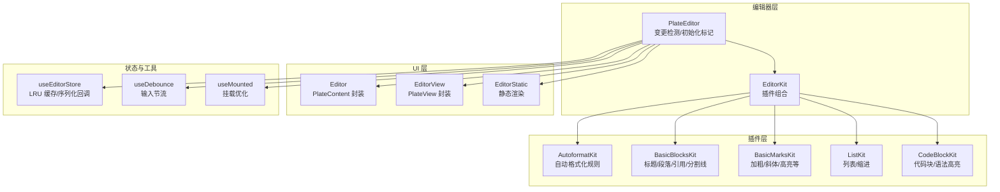
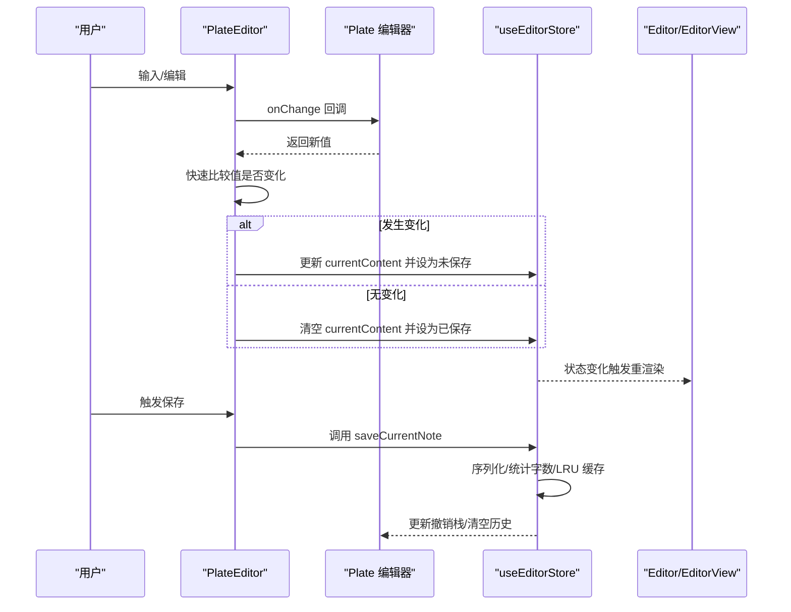
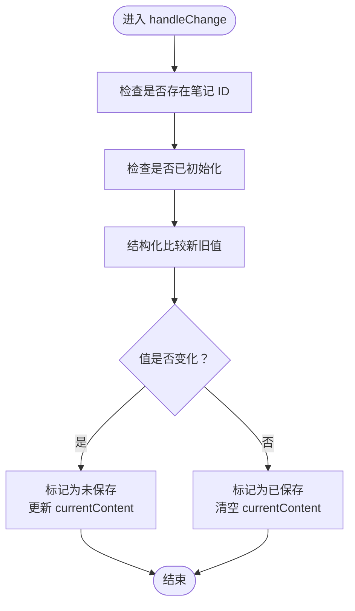
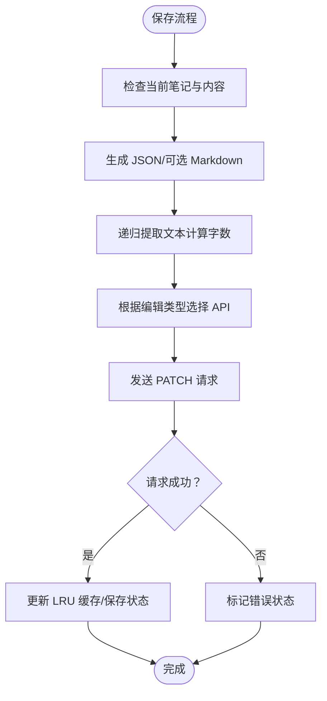
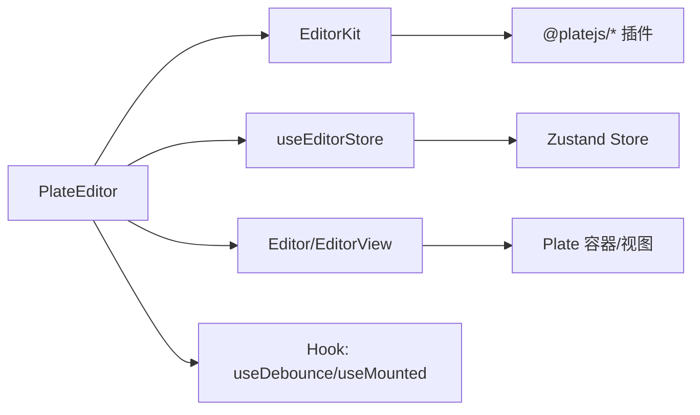

# 编辑器性能优化

<cite>
**本文引用的文件**   
- [src/components/editor/plate-editor.tsx](file://src/components/editor/plate-editor.tsx)
- [src/components/editor/editor-kit.tsx](file://src/components/editor/editor-kit.tsx)
- [src/components/editor/plugins/autoformat-kit.tsx](file://src/components/editor/plugins/autoformat-kit.tsx)
- [src/components/editor/plugins/basic-blocks-kit.tsx](file://src/components/editor/plugins/basic-blocks-kit.tsx)
- [src/components/editor/plugins/basic-marks-kit.tsx](file://src/components/editor/plugins/basic-marks-kit.tsx)
- [src/components/editor/plugins/list-kit.tsx](file://src/components/editor/plugins/list-kit.tsx)
- [src/components/editor/plugins/code-block-kit.tsx](file://src/components/editor/plugins/code-block-kit.tsx)
- [src/components/ui/editor.tsx](file://src/components/ui/editor.tsx)
- [src/components/ui/editor-static.tsx](file://src/components/ui/editor-static.tsx)
- [src/hooks/use-debounce.ts](file://src/hooks/use-debounce.ts)
- [src/hooks/use-mounted.ts](file://src/hooks/use-mounted.ts)
- [src/stores/editor-store.ts](file://src/stores/editor-store.ts)
- [package.json](file://package.json)
</cite>

## 目录
1. [简介](#简介)
2. [项目结构](#项目结构)
3. [核心组件](#核心组件)
4. [架构总览](#架构总览)
5. [详细组件分析](#详细组件分析)
6. [依赖分析](#依赖分析)
7. [性能考量](#性能考量)
8. [故障排查指南](#故障排查指南)
9. [结论](#结论)
10. [附录](#附录)

## 简介
本文件聚焦于富文本编辑器在大型文档与复杂插件体系下的性能优化策略，结合仓库中 Plate.js 实现，系统阐述以下主题：
- 虚拟滚动与增量渲染：当前实现未采用虚拟滚动，但通过变更检测与缓存策略降低重渲染成本。
- 增量渲染机制：基于快速值比较与初始化标记，避免不必要的状态更新与保存流程。
- 内存管理：内容缓存（LRU）、撤销栈清理、空闲帧初始化等手段控制内存占用。
- 防抖钩子（useDebounce）：用于输入事件节流与批量处理，建议按交互类型调整延迟。
- 组件挂载优化（useMounted）：避免服务端渲染阶段的副作用与无效计算。
- 状态管理性能：编辑器状态存储与序列化优化、变更检测策略。
- 渲染性能监控与瓶颈定位：基于浏览器性能工具与日志埋点。
- 大文档处理最佳实践：分页加载、懒解析、最小化 DOM 操作。
- 插件系统性能影响与优化：按需加载、规则精简、避免重复格式化。

## 项目结构
编辑器相关代码主要位于 src/components/editor 与 src/components/ui 下，并通过 Zustand 状态管理进行连接。关键模块如下：
- 编辑器容器与变更检测：PlateEditor
- 插件组合：EditorKit
- 典型插件示例：自动格式化、基础块级节点、基础样式、列表、代码块
- UI 容器与视图：Editor、EditorView、EditorStatic
- 性能辅助钩子：useDebounce、useMounted
- 状态存储：useEditorStore（含 LRU 缓存、序列化回调）

**图表来源**
- [src/components/editor/plate-editor.tsx:63-175](file://src/components/editor/plate-editor.tsx#L63-L175)
- [src/components/editor/editor-kit.tsx:36-78](file://src/components/editor/editor-kit.tsx#L36-L78)
- [src/components/editor/plugins/autoformat-kit.tsx:211-237](file://src/components/editor/plugins/autoformat-kit.tsx#L211-L237)
- [src/components/editor/plugins/basic-blocks-kit.tsx:27-89](file://src/components/editor/plugins/basic-blocks-kit.tsx#L27-L89)
- [src/components/editor/plugins/basic-marks-kit.tsx:19-42](file://src/components/editor/plugins/basic-marks-kit.tsx#L19-L42)
- [src/components/editor/plugins/list-kit.tsx:9-27](file://src/components/editor/plugins/list-kit.tsx#L9-L27)
- [src/components/editor/plugins/code-block-kit.tsx:18-27](file://src/components/editor/plugins/code-block-kit.tsx#L18-L27)
- [src/components/ui/editor.tsx:36-113](file://src/components/ui/editor.tsx#L36-L113)
- [src/components/ui/editor-static.tsx:41-52](file://src/components/ui/editor-static.tsx#L41-L52)
- [src/stores/editor-store.ts:88-281](file://src/stores/editor-store.ts#L88-L281)
- [src/hooks/use-debounce.ts:3-18](file://src/hooks/use-debounce.ts#L3-L18)
- [src/hooks/use-mounted.ts:3-11](file://src/hooks/use-mounted.ts#L3-L11)

**章节来源**
- [src/components/editor/plate-editor.tsx:63-175](file://src/components/editor/plate-editor.tsx#L63-L175)
- [src/components/editor/editor-kit.tsx:36-78](file://src/components/editor/editor-kit.tsx#L36-L78)
- [src/stores/editor-store.ts:88-281](file://src/stores/editor-store.ts#L88-L281)

## 核心组件
- PlateEditor：负责编辑器实例创建、变更监听、初始化标记、基线内容对比、保存状态同步与 Markdown 序列化回调设置。
- EditorKit：集中注册所有编辑器插件，形成统一的插件集合。
- useEditorStore：提供内容缓存（LRU）、手动保存、序列化回调注册、加载与切换笔记等能力。
- Editor/EditorView/EditorStatic：对 Plate 的容器与内容视图进行封装，支持变体与禁用态。

**章节来源**
- [src/components/editor/plate-editor.tsx:63-175](file://src/components/editor/plate-editor.tsx#L63-L175)
- [src/components/editor/editor-kit.tsx:36-78](file://src/components/editor/editor-kit.tsx#L36-L78)
- [src/stores/editor-store.ts:88-281](file://src/stores/editor-store.ts#L88-L281)
- [src/components/ui/editor.tsx:36-113](file://src/components/ui/editor.tsx#L36-L113)
- [src/components/ui/editor-static.tsx:41-52](file://src/components/ui/editor-static.tsx#L41-L52)

## 架构总览
编辑器采用“插件组合 + 变更检测 + 状态存储”的架构。PlateEditor 作为入口，通过 EditorKit 注入插件；useEditorStore 提供内容与缓存；Editor/EditorView/EditorStatic 提供渲染容器与视图。

**图表来源**
- [src/components/editor/plate-editor.tsx:84-144](file://src/components/editor/plate-editor.tsx#L84-L144)
- [src/stores/editor-store.ts:204-275](file://src/stores/editor-store.ts#L204-L275)

## 详细组件分析

### PlateEditor：变更检测与初始化优化
- 初始化标记：通过 isInitializedRef 与 requestAnimationFrame 避免首次赋值时的误触发与跨笔记历史污染。
- 基线内容对比：自定义结构化比较函数，跳过 JSON.stringify 的昂贵开销，仅在值真正变化时更新状态。
- 保存后基线更新：保存成功后以当前值作为新的基线，减少后续比较成本。
- Markdown 序列化回调：在编辑器就绪后注入序列化器，供保存时生成 Markdown。

**图表来源**
- [src/components/editor/plate-editor.tsx:84-99](file://src/components/editor/plate-editor.tsx#L84-L99)

**章节来源**
- [src/components/editor/plate-editor.tsx:63-175](file://src/components/editor/plate-editor.tsx#L63-L175)

### EditorKit：插件组合与扩展点
- 插件聚合：将基础块级节点、基础样式、列表/对齐/行高等功能模块化组合，便于按需启用与维护。
- 解析器：集成 Markdown 与 DOCX 导入导出，提升兼容性与迁移效率。

**章节来源**
- [src/components/editor/editor-kit.tsx:36-78](file://src/components/editor/editor-kit.tsx#L36-L78)

### 自动格式化插件：规则精简与上下文限制
- 规则覆盖：标题、引用、代码块、列表、高亮、数学、标点等多类规则。
- 上下文过滤：禁止在代码块内触发自动格式化，避免误操作与性能浪费。
- 启用撤销：开启撤销删除，提升用户体验。

**章节来源**
- [src/components/editor/plugins/autoformat-kit.tsx:211-237](file://src/components/editor/plugins/autoformat-kit.tsx#L211-L237)

### 基础块级与样式插件：渲染与快捷键
- 块级节点：标题、段落、引用、分割线等，均配置组件映射与快捷键。
- 样式节点：加粗、斜体、下划线、代码、删除线、上/下标、高亮、键盘键等，部分节点绑定组件。

**章节来源**
- [src/components/editor/plugins/basic-blocks-kit.tsx:27-89](file://src/components/editor/plugins/basic-blocks-kit.tsx#L27-L89)
- [src/components/editor/plugins/basic-marks-kit.tsx:19-42](file://src/components/editor/plugins/basic-marks-kit.tsx#L19-L42)

### 列表插件：缩进与渲染注入
- 缩进插件：与列表联动，提供一致的缩进体验。
- 渲染注入：在目标节点下方渲染列表 UI，保持布局一致性。

**章节来源**
- [src/components/editor/plugins/list-kit.tsx:9-27](file://src/components/editor/plugins/list-kit.tsx#L9-L27)

### 代码块插件：语法高亮与组件映射
- 语法高亮：基于 lowlight，支持多语言高亮。
- 组件映射：代码块、代码行、语法叶节点分别映射到 UI 组件。

**章节来源**
- [src/components/editor/plugins/code-block-kit.tsx:18-27](file://src/components/editor/plugins/code-block-kit.tsx#L18-L27)

### UI 容器与视图：渲染与样式
- EditorContainer：包裹编辑器容器，支持多种变体与滚动行为。
- Editor/EditorView：封装 PlateContent/PlateView，提供禁用态、焦点态与多种变体。
- EditorStatic：静态渲染，适合预览与导出场景。

**章节来源**
- [src/components/ui/editor.tsx:36-113](file://src/components/ui/editor.tsx#L36-L113)
- [src/components/ui/editor-static.tsx:41-52](file://src/components/ui/editor-static.tsx#L41-L52)

### 防抖钩子（useDebounce）：使用场景与参数调优
- 使用场景
  - 输入事件节流：如搜索框、实时预览、自动保存触发。
  - 批量处理：合并多次状态更新，减少渲染次数。
- 参数调优
  - 低延迟（100–250ms）：高频输入（如打字）以保证响应性。
  - 中延迟（300–500ms）：一般输入与预览。
  - 高延迟（750–1000ms）：昂贵操作（如网络请求、复杂计算）。
- 注意事项
  - 在组件卸载时清理定时器，避免内存泄漏。
  - 对不同交互设置独立的防抖实例，避免相互干扰。

**章节来源**
- [src/hooks/use-debounce.ts:3-18](file://src/hooks/use-debounce.ts#L3-L18)

### 组件挂载优化（useMounted）：避免 SSR 与无效计算
- 作用：仅在客户端挂载后返回 true，避免服务端渲染阶段执行副作用。
- 影响：确保仅在真实 DOM 存在时进行尺寸测量、滚动定位、事件绑定等操作，降低首屏抖动与错误。

**章节来源**
- [src/hooks/use-mounted.ts:3-11](file://src/hooks/use-mounted.ts#L3-L11)

### 状态管理性能：变更检测与序列化优化
- 结构化比较：在 PlateEditor 中自定义比较函数，避免深度比较的性能损耗。
- LRU 缓存：useEditorStore 维护内容缓存，按时间淘汰最旧条目，减少重复加载。
- 序列化回调：在编辑器就绪后注入 Markdown 序列化器，保存时按需生成 Markdown，避免重复计算。
- 字数统计：从节点树中递归提取文本，计算字数，减少额外存储负担。

**图表来源**
- [src/stores/editor-store.ts:204-275](file://src/stores/editor-store.ts#L204-L275)

**章节来源**
- [src/stores/editor-store.ts:88-281](file://src/stores/editor-store.ts#L88-L281)

## 依赖分析
- 编辑器核心：platejs 及其生态（@platejs/*）提供插件化能力与渲染框架。
- 状态管理：zustand 轻量高效，适合复杂编辑器状态的细粒度拆分。
- UI 组件：基于 Plate 的容器与视图封装，提供样式与交互增强。
- 工具函数：useDebounce、useMounted 等辅助 Hook 提升交互与渲染稳定性。

**图表来源**
- [package.json:13-99](file://package.json#L13-L99)
- [src/components/editor/plate-editor.tsx:63-175](file://src/components/editor/plate-editor.tsx#L63-L175)
- [src/stores/editor-store.ts:88-281](file://src/stores/editor-store.ts#L88-L281)

**章节来源**
- [package.json:13-99](file://package.json#L13-L99)

## 性能考量
- 虚拟滚动与增量渲染
  - 当前未引入虚拟滚动，但通过结构化比较与初始化标记有效减少不必要渲染与保存。
  - 建议：在超长文档场景引入虚拟滚动（如基于可编辑区域的可视窗口渲染），并配合懒加载与分页。
- 内存管理
  - LRU 缓存：限制最大缓存数量，按时间淘汰最旧条目。
  - 撤销历史清理：切换笔记时清空撤销/重做队列，避免跨笔记历史累积。
  - 空闲帧初始化：使用 requestAnimationFrame 标记初始化完成，避免阻塞主线程。
- 插件系统
  - 按需启用：仅加载必要的插件，减少初始化与运行时开销。
  - 规则精简：自动格式化规则应限定在必要范围内，避免在敏感节点（如代码块）中触发。
- 输入与渲染
  - 防抖与去抖：对高频输入使用防抖，对昂贵操作使用节流。
  - 最小化 DOM：避免不必要的节点重建，优先复用现有节点。
- 大文档处理
  - 分页/懒加载：将长文档拆分为多个页面或片段，按需加载。
  - 懒解析：仅在可见区域或即将进入可视区域时解析节点。
  - 减少回流：批量更新 DOM，避免频繁读写布局属性。
- 渲染监控
  - 使用浏览器性能面板记录 FPS、CPU、内存峰值。
  - 为关键路径埋点（如 onChange、保存、序列化），定位瓶颈。
  - 对插件启用/禁用进行 A/B 对比测试，评估性能收益。

[本节为通用指导，无需特定文件来源]

## 故障排查指南
- 保存失败或状态异常
  - 检查保存状态流转与 API 返回，确认错误状态被正确设置。
  - 关注序列化器是否可用，避免因序列化失败导致保存中断。
- 切换笔记后历史残留
  - 确认撤销/重做队列已被清空，避免跨笔记状态污染。
- 输入卡顿或闪烁
  - 检查是否有过多不必要的重渲染，确认结构化比较逻辑生效。
  - 对高频输入使用防抖，避免过度触发保存或序列化。
- SSR 报错或副作用
  - 使用 useMounted 包裹依赖 DOM 的逻辑，确保仅在客户端执行。

**章节来源**
- [src/stores/editor-store.ts:204-275](file://src/stores/editor-store.ts#L204-L275)
- [src/components/editor/plate-editor.tsx:101-136](file://src/components/editor/plate-editor.tsx#L101-L136)

## 结论
本项目在不引入虚拟滚动的前提下，通过结构化比较、初始化标记、LRU 缓存与撤销历史清理等策略，实现了较为稳健的编辑器性能表现。结合防抖钩子与挂载优化，可在交互响应与渲染稳定性之间取得良好平衡。对于超长文档与重度插件场景，建议进一步引入虚拟滚动、分页懒加载与插件按需加载等优化手段，并持续通过性能监控与埋点定位瓶颈，迭代提升整体体验。

## 附录
- 相关文件清单
  - 编辑器入口与变更检测：[src/components/editor/plate-editor.tsx:63-175](file://src/components/editor/plate-editor.tsx#L63-L175)
  - 插件组合：[src/components/editor/editor-kit.tsx:36-78](file://src/components/editor/editor-kit.tsx#L36-L78)
  - 自动格式化规则：[src/components/editor/plugins/autoformat-kit.tsx:211-237](file://src/components/editor/plugins/autoformat-kit.tsx#L211-L237)
  - 基础块级节点：[src/components/editor/plugins/basic-blocks-kit.tsx:27-89](file://src/components/editor/plugins/basic-blocks-kit.tsx#L27-L89)
  - 基础样式节点：[src/components/editor/plugins/basic-marks-kit.tsx:19-42](file://src/components/editor/plugins/basic-marks-kit.tsx#L19-L42)
  - 列表与缩进：[src/components/editor/plugins/list-kit.tsx:9-27](file://src/components/editor/plugins/list-kit.tsx#L9-L27)
  - 代码块与语法高亮：[src/components/editor/plugins/code-block-kit.tsx:18-27](file://src/components/editor/plugins/code-block-kit.tsx#L18-L27)
  - UI 容器与视图：[src/components/ui/editor.tsx:36-113](file://src/components/ui/editor.tsx#L36-L113)、[src/components/ui/editor-static.tsx:41-52](file://src/components/ui/editor-static.tsx#L41-L52)
  - 防抖与挂载优化：[src/hooks/use-debounce.ts:3-18](file://src/hooks/use-debounce.ts#L3-L18)、[src/hooks/use-mounted.ts:3-11](file://src/hooks/use-mounted.ts#L3-L11)
  - 状态存储与序列化：[src/stores/editor-store.ts:88-281](file://src/stores/editor-store.ts#L88-L281)
  - 依赖声明：[package.json:13-99](file://package.json#L13-L99)