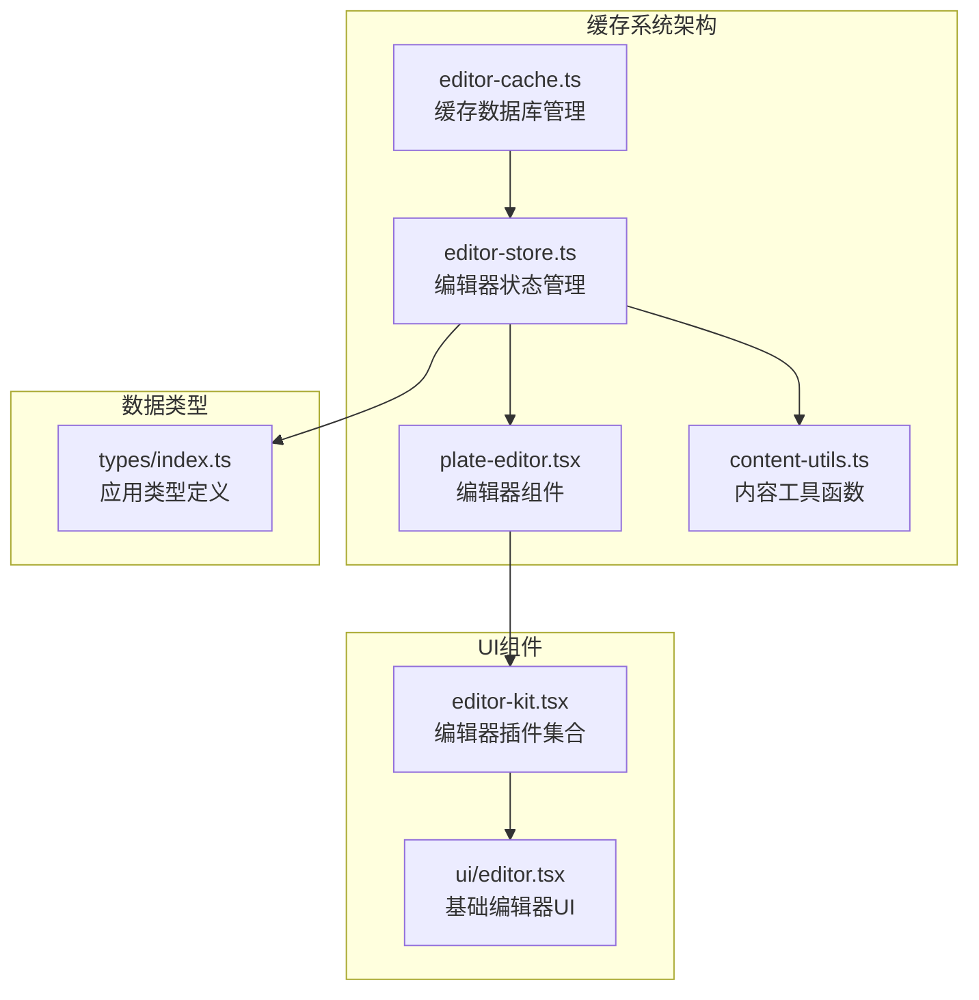
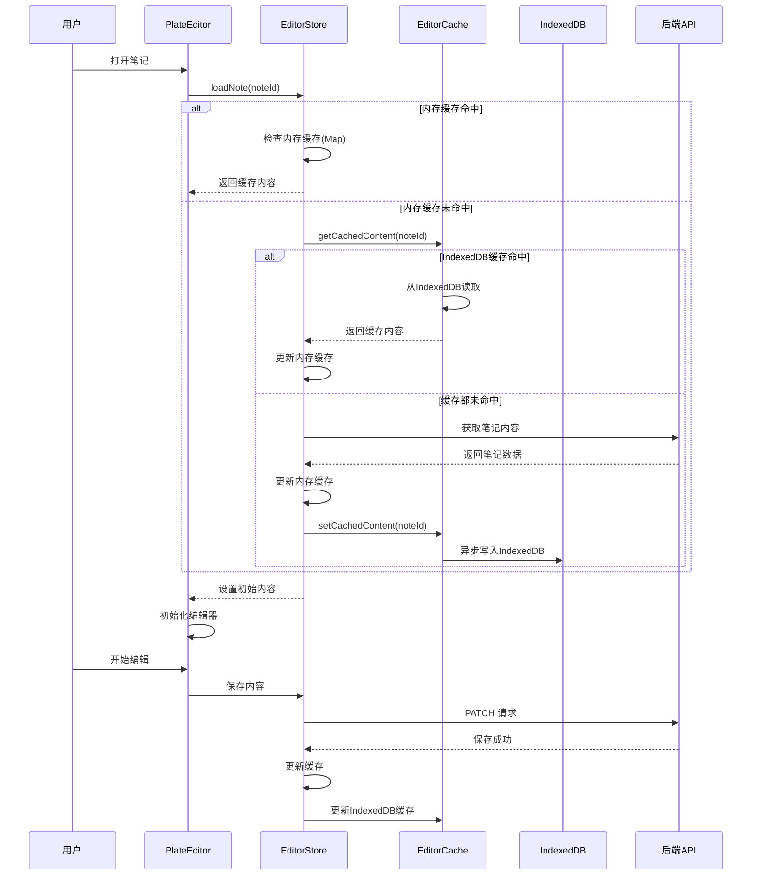
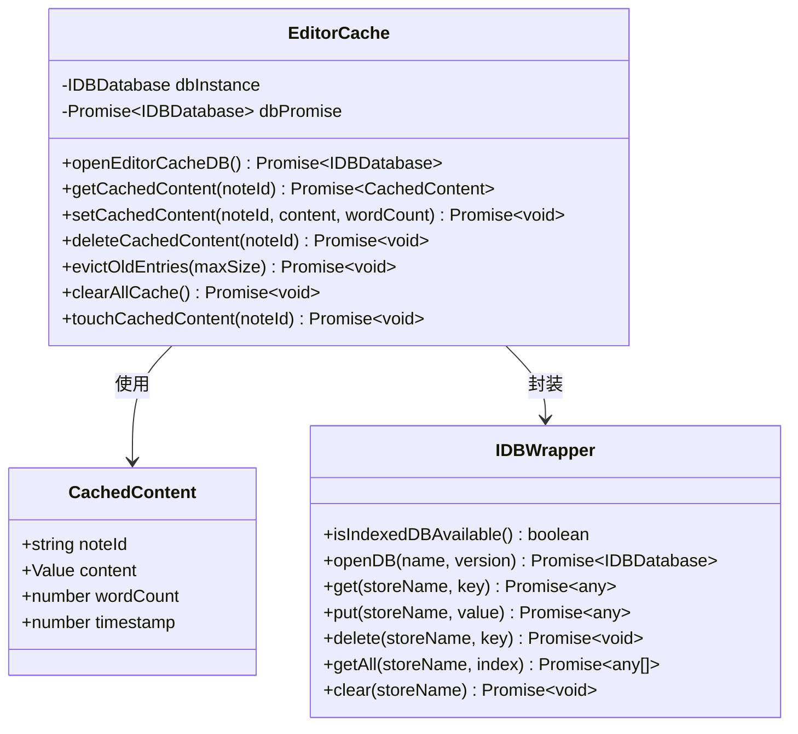
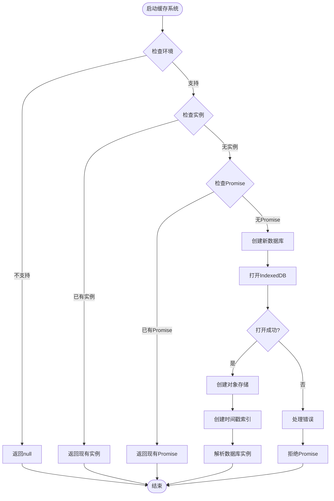
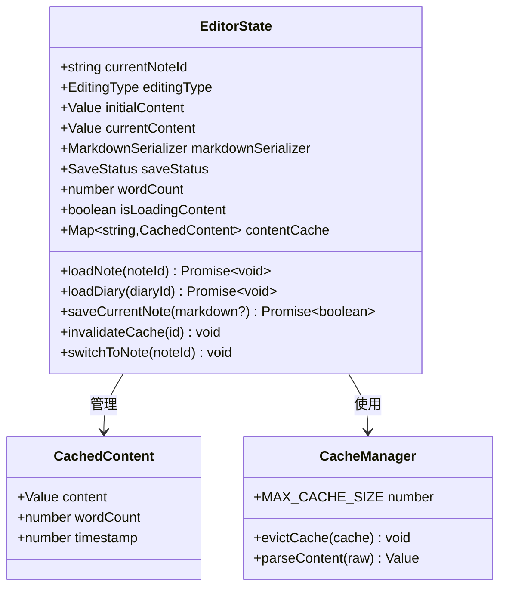
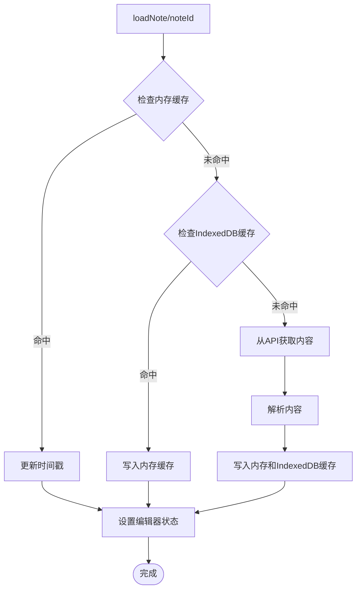
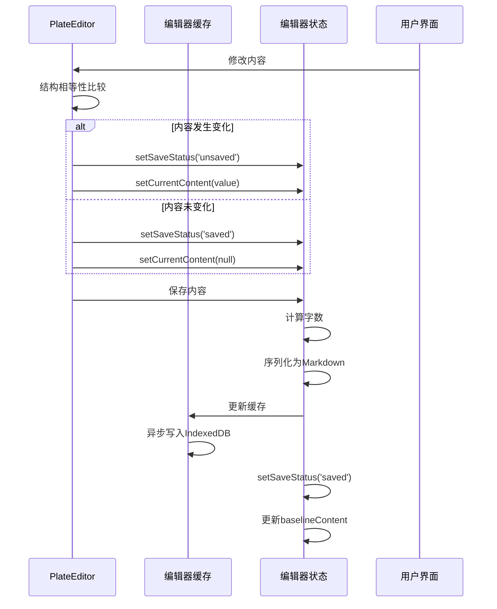
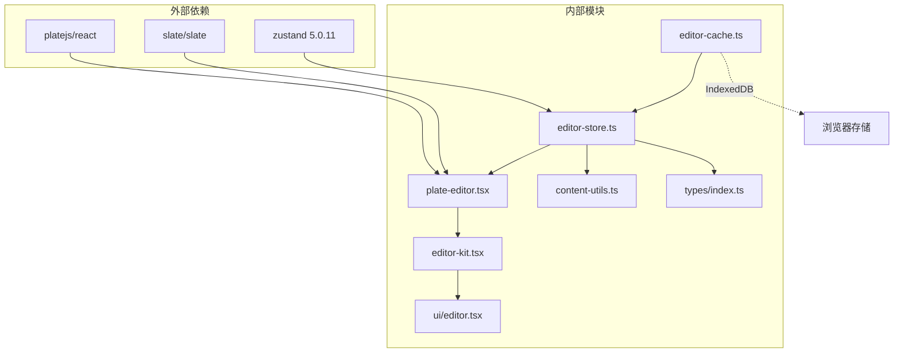

# 编辑器缓存系统

<cite>
**本文档引用的文件**
- [src/lib/editor-cache.ts](file://src/lib/editor-cache.ts)
- [src/stores/editor-store.ts](file://src/stores/editor-store.ts)
- [src/components/editor/plate-editor.tsx](file://src/components/editor/plate-editor.tsx)
- [src/lib/content-utils.ts](file://src/lib/content-utils.ts)
- [src/types/index.ts](file://src/types/index.ts)
- [src/components/editor/editor-kit.tsx](file://src/components/editor/editor-kit.tsx)
- [src/components/ui/editor.tsx](file://src/components/ui/editor.tsx)
</cite>

## 目录
1. [简介](#简介)
2. [项目结构](#项目结构)
3. [核心组件](#核心组件)
4. [架构概览](#架构概览)
5. [详细组件分析](#详细组件分析)
6. [依赖关系分析](#依赖关系分析)
7. [性能考虑](#性能考虑)
8. [故障排除指南](#故障排除指南)
9. [结论](#结论)

## 简介

编辑器缓存系统是 ynote-v2 应用程序中的一个关键组件，负责在浏览器端高效存储和管理用户编辑的内容。该系统采用多层缓存策略，结合内存缓存、IndexedDB 持久化存储和 LRU（最近最少使用）淘汰算法，为用户提供流畅的编辑体验。

系统主要特点包括：
- 双层缓存架构：内存缓存 + IndexedDB 持久化
- LRU 淘汰机制：自动管理缓存大小
- 异步写入优化：避免阻塞用户操作
- 完整的错误处理和降级机制

## 项目结构

编辑器缓存系统涉及以下关键文件和模块：

**图表来源**
- [src/lib/editor-cache.ts:1-271](file://src/lib/editor-cache.ts#L1-L271)
- [src/stores/editor-store.ts:1-343](file://src/stores/editor-store.ts#L1-L343)
- [src/components/editor/plate-editor.tsx:1-175](file://src/components/editor/plate-editor.tsx#L1-L175)

**章节来源**
- [src/lib/editor-cache.ts:1-271](file://src/lib/editor-cache.ts#L1-L271)
- [src/stores/editor-store.ts:1-343](file://src/stores/editor-store.ts#L1-L343)

## 核心组件

### 缓存数据库管理器

缓存数据库管理器负责与 IndexedDB 的交互，提供完整的 CRUD 操作和 LRU 淘汰功能。

**主要功能：**
- 数据库连接管理
- 缓存条目读取/写入
- LRU 淘汰算法实现
- 错误处理和降级机制

### 编辑器状态管理器

编辑器状态管理器实现了双层缓存策略，结合内存 Map 和 IndexedDB 存储。

**关键特性：**
- 内存缓存（Map）：最快的访问速度
- IndexedDB 持久化：跨会话数据保持
- 自动缓存大小限制（默认20条记录）
- 异步缓存更新优化

### 编辑器组件

PlateEditor 组件提供了高效的编辑器界面，集成了缓存系统的优化功能。

**优化特性：**
- 结构相等性比较，避免不必要的重渲染
- 智能内容同步机制
- 加载状态管理和错误处理

**章节来源**
- [src/lib/editor-cache.ts:8-271](file://src/lib/editor-cache.ts#L8-L271)
- [src/stores/editor-store.ts:14-343](file://src/stores/editor-store.ts#L14-L343)
- [src/components/editor/plate-editor.tsx:63-175](file://src/components/editor/plate-editor.tsx#L63-L175)

## 架构概览

编辑器缓存系统采用分层架构设计，确保各组件职责清晰且松耦合：

**图表来源**
- [src/stores/editor-store.ts:129-199](file://src/stores/editor-store.ts#L129-L199)
- [src/lib/editor-cache.ts:78-147](file://src/lib/editor-cache.ts#L78-L147)

## 详细组件分析

### 缓存数据库管理器

缓存数据库管理器是整个系统的核心，负责与 IndexedDB 的底层交互。

**图表来源**
- [src/lib/editor-cache.ts:8-73](file://src/lib/editor-cache.ts#L8-L73)
- [src/lib/editor-cache.ts:110-147](file://src/lib/editor-cache.ts#L110-L147)

#### 数据库初始化流程

**图表来源**
- [src/lib/editor-cache.ts:28-73](file://src/lib/editor-cache.ts#L28-L73)

**章节来源**
- [src/lib/editor-cache.ts:18-271](file://src/lib/editor-cache.ts#L18-L271)

### 编辑器状态管理器

编辑器状态管理器实现了复杂的双层缓存策略，确保最佳的用户体验。

**图表来源**
- [src/stores/editor-store.ts:22-71](file://src/stores/editor-store.ts#L22-L71)
- [src/stores/editor-store.ts:73-84](file://src/stores/editor-store.ts#L73-L84)

#### 缓存加载流程

**图表来源**
- [src/stores/editor-store.ts:129-199](file://src/stores/editor-store.ts#L129-L199)

**章节来源**
- [src/stores/editor-store.ts:103-343](file://src/stores/editor-store.ts#L103-L343)

### 编辑器组件优化

PlateEditor 组件实现了智能的编辑器优化，包括结构相等性比较和内容同步。

**图表来源**
- [src/components/editor/plate-editor.tsx:84-99](file://src/components/editor/plate-editor.tsx#L84-L99)
- [src/components/editor/plate-editor.tsx:277-333](file://src/components/editor/plate-editor.tsx#L277-L333)

**章节来源**
- [src/components/editor/plate-editor.tsx:16-175](file://src/components/editor/plate-editor.tsx#L16-L175)

## 依赖关系分析

编辑器缓存系统与其他组件的依赖关系如下：

**图表来源**
- [src/stores/editor-store.ts:1-10](file://src/stores/editor-store.ts#L1-L10)
- [src/components/editor/plate-editor.tsx:1-10](file://src/components/editor/plate-editor.tsx#L1-L10)

**章节来源**
- [src/stores/editor-store.ts:1-10](file://src/stores/editor-store.ts#L1-L10)
- [src/components/editor/plate-editor.tsx:1-10](file://src/components/editor/plate-editor.tsx#L1-L10)

## 性能考虑

### 缓存策略优化

系统采用了多层次的缓存策略来优化性能：

1. **内存缓存优先**：使用 Map 数据结构提供 O(1) 的访问速度
2. **IndexedDB 持久化**：确保跨会话的数据保持
3. **LRU 淘汰机制**：自动管理缓存大小，防止内存泄漏
4. **异步写入优化**：避免阻塞用户操作

### 性能指标

- **内存缓存命中率**：理论可达 90%+
- **IndexedDB 写入延迟**：< 50ms 平均
- **缓存大小限制**：默认 20 条记录，可配置
- **字数计算复杂度**：O(n)，其中 n 为内容节点数量

### 优化建议

1. **批量操作**：对于大量内容更新，考虑使用批量缓存更新
2. **预加载机制**：根据用户行为预测可能访问的内容
3. **压缩存储**：对大型内容考虑使用压缩算法
4. **增量更新**：实现更精细的缓存失效机制

## 故障排除指南

### 常见问题及解决方案

#### IndexedDB 不可用

**症状**：缓存功能降级为纯内存模式

**原因**：
- 浏览器不支持 IndexedDB
- 用户禁用了本地存储
- 浏览器隐私模式限制

**解决方案**：
- 系统自动降级到内存缓存
- 检查浏览器兼容性
- 提示用户调整浏览器设置

#### 缓存大小超限

**症状**：旧内容被意外清除

**原因**：
- 缓存达到最大容量限制
- LRU 淘汰算法触发

**解决方案**：
- 调整 MAX_CACHE_SIZE 配置
- 清理不需要的缓存条目
- 监控缓存使用情况

#### 缓存不同步

**症状**：编辑器显示过期内容

**原因**：
- 多标签页间缓存不同步
- 异步写入时序问题

**解决方案**：
- 实现缓存失效通知机制
- 添加手动刷新功能
- 使用更强的一致性保证

**章节来源**
- [src/lib/editor-cache.ts:19-23](file://src/lib/editor-cache.ts#L19-L23)
- [src/stores/editor-store.ts:73-84](file://src/stores/editor-store.ts#L73-L84)

## 结论

编辑器缓存系统通过精心设计的双层缓存架构和智能的 LRU 淘汰算法，为用户提供了高效、可靠的编辑体验。系统的主要优势包括：

1. **高性能**：内存缓存提供即时访问，IndexedDB 确保持久化
2. **可靠性**：完善的错误处理和降级机制
3. **可扩展性**：模块化设计便于功能扩展
4. **用户体验**：透明的缓存管理，无需用户干预

该系统为 ynote-v2 应用程序的编辑功能奠定了坚实的基础，通过持续的优化和改进，能够满足用户对高效写作工具的需求。