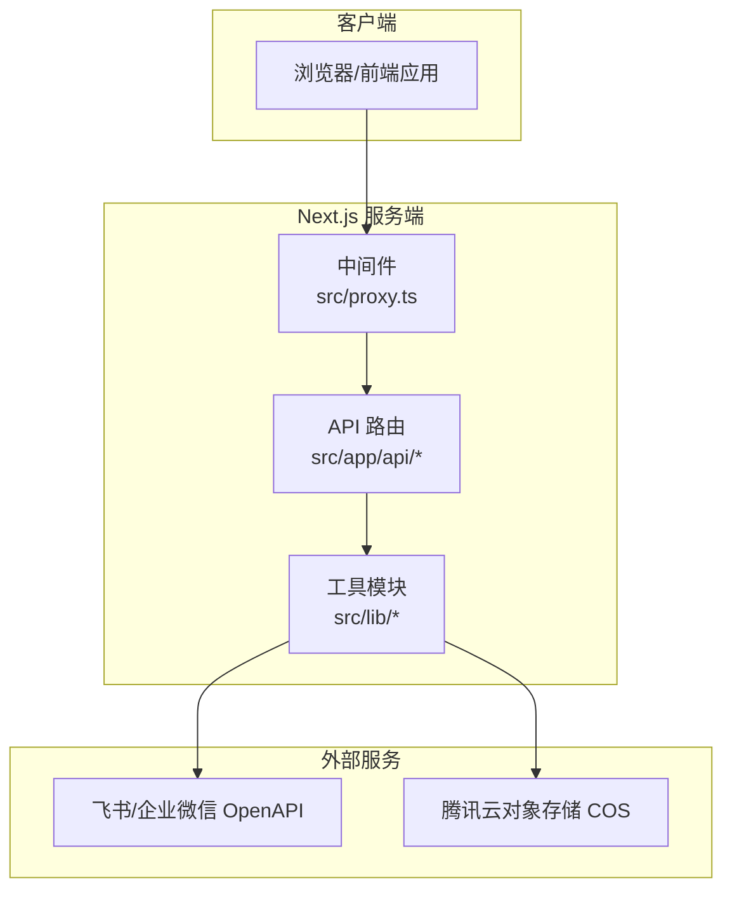
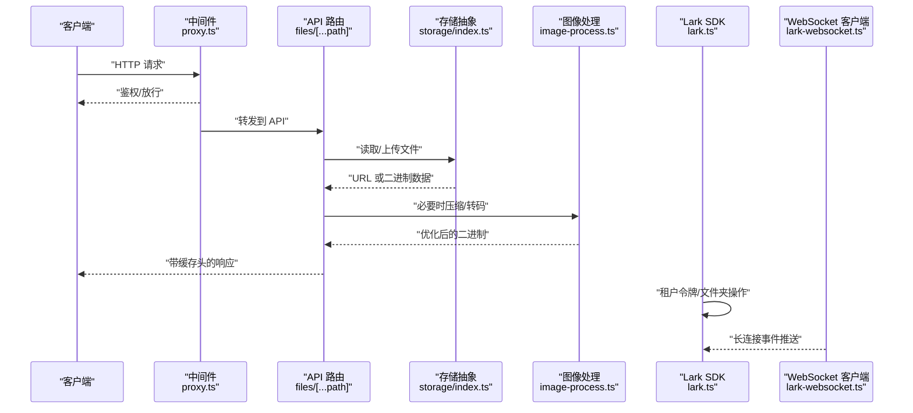
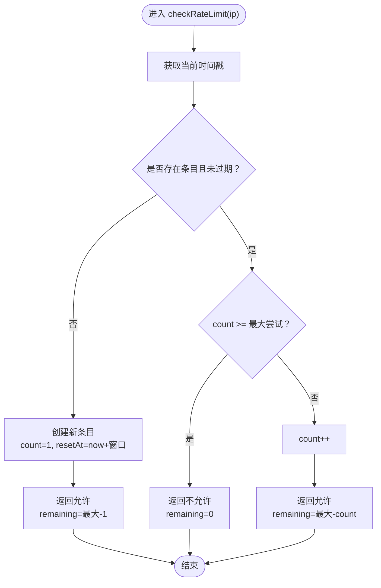
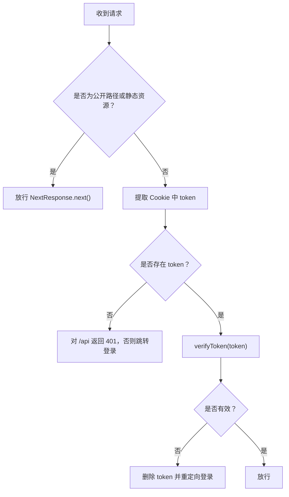
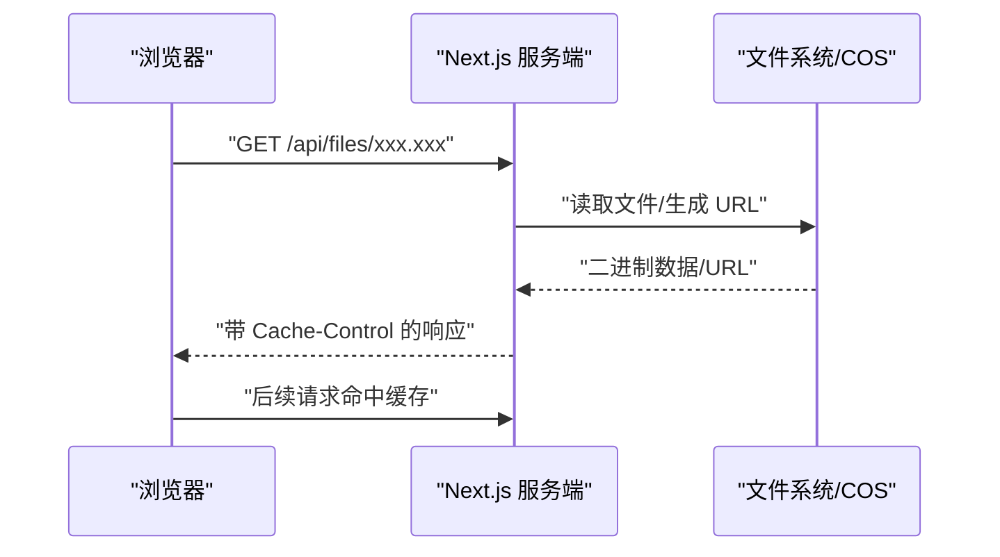
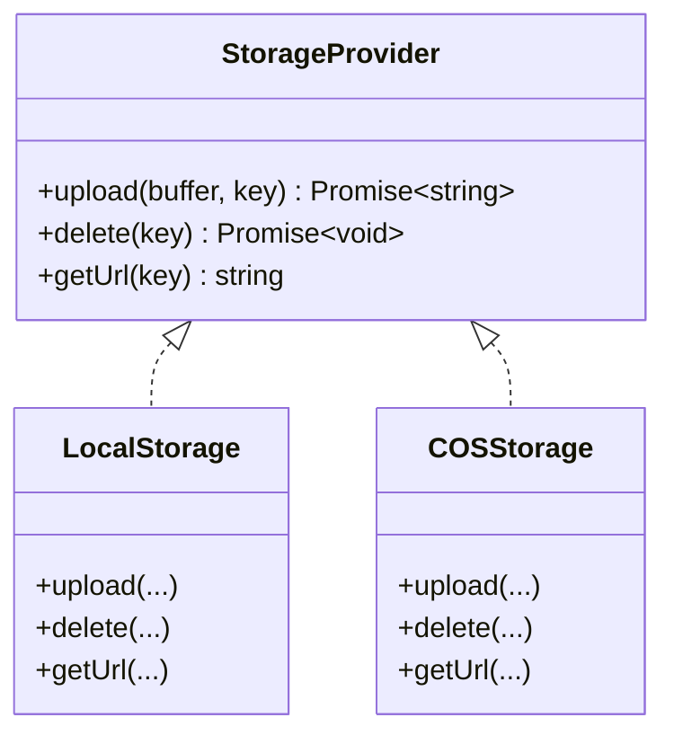
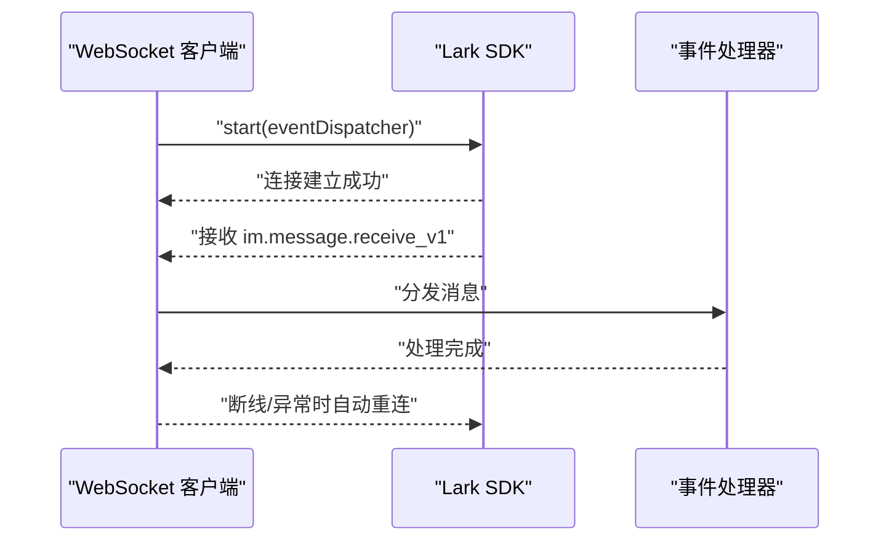
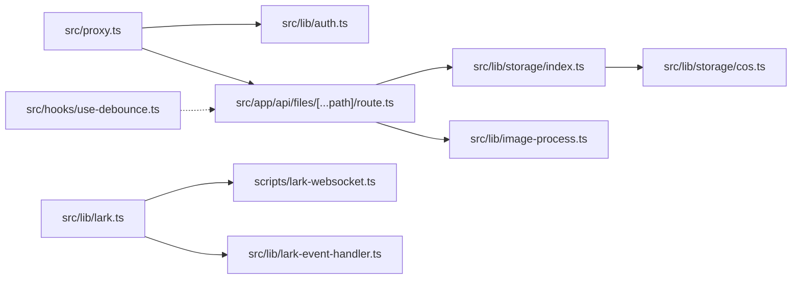

# 网络请求优化

<cite>
**本文引用的文件**
- [src/lib/rate-limit.ts](file://src/lib/rate-limit.ts)
- [src/proxy.ts](file://src/proxy.ts)
- [src/lib/auth.ts](file://src/lib/auth.ts)
- [src/app/api/files/[...path]/route.ts](file://src/app/api/files/[...path]/route.ts)
- [src/lib/storage/index.ts](file://src/lib/storage/index.ts)
- [src/lib/storage/cos.ts](file://src/lib/storage/cos.ts)
- [src/lib/image-process.ts](file://src/lib/image-process.ts)
- [src/lib/lark.ts](file://src/lib/lark.ts)
- [src/lib/lark-event-handler.ts](file://src/lib/lark-event-handler.ts)
- [scripts/lark-websocket.ts](file://scripts/lark-websocket.ts)
- [next.config.ts](file://next.config.ts)
- [package.json](file://package.json)
- [src/hooks/use-debounce.ts](file://src/hooks/use-debounce.ts)
</cite>

## 目录
1. [引言](#引言)
2. [项目结构](#项目结构)
3. [核心组件](#核心组件)
4. [架构总览](#架构总览)
5. [详细组件分析](#详细组件分析)
6. [依赖关系分析](#依赖关系分析)
7. [性能考量与优化建议](#性能考量与优化建议)
8. [故障排查指南](#故障排查指南)
9. [结论](#结论)
10. [附录](#附录)

## 引言
本文件聚焦于网络请求优化，结合仓库现有实现，系统阐述以下主题：
- 请求合并、批处理与去重策略
- 速率限制（RateLimit）实现与配置
- HTTP 缓存策略（浏览器与服务端）
- 代理与中间件优化
- 网络监控与性能分析方法
- 错误重试与失败恢复
- CDN 与静态资源优化
- WebSocket 连接优化与实时通信
- API 响应时间优化与负载均衡
- 网络性能测试与基准测试方法

说明：本文档严格基于仓库中实际存在的源码进行分析与总结，避免臆测。

## 项目结构
该项目为 Next.js 应用，采用 App Router 结构，API 路由位于 src/app/api 下，业务逻辑集中在 src/lib 与 src/app/api 中；同时包含一个独立的 WebSocket 客户端脚本用于长连接事件接收。

图表来源
- [src/proxy.ts:1-50](file://src/proxy.ts#L1-L50)
- [src/app/api/files/[...path]/route.ts:1-47](file://src/app/api/files/[...path]/route.ts#L1-L47)
- [src/lib/lark.ts:1-335](file://src/lib/lark.ts#L1-L335)
- [src/lib/storage/cos.ts:1-61](file://src/lib/storage/cos.ts#L1-L61)

章节来源
- [src/proxy.ts:1-50](file://src/proxy.ts#L1-L50)
- [src/app/api/files/[...path]/route.ts:1-47](file://src/app/api/files/[...path]/route.ts#L1-L47)
- [src/lib/lark.ts:1-335](file://src/lib/lark.ts#L1-L335)
- [src/lib/storage/cos.ts:1-61](file://src/lib/storage/cos.ts#L1-L61)

## 核心组件
- 速率限制器：基于内存 Map 的滑动窗口计数，周期清理过期条目。
- 中间件代理：统一鉴权、路径白名单与静态资源放行。
- 静态文件服务：内置路由直接读取本地文件并设置强缓存头。
- 存储抽象与 COS：按环境变量选择本地或 COS，支持上传/删除/生成 URL。
- 图像处理：基于 sharp 的压缩与格式转换，减少传输体积。
- Lark SDK 封装：租户令牌获取、文件夹操作、WebSocket 客户端管理。
- WebSocket 客户端：自动重连、优雅关闭、事件分发。
- 防抖 Hook：前端输入防抖，降低无效请求频率。

章节来源
- [src/lib/rate-limit.ts:1-41](file://src/lib/rate-limit.ts#L1-L41)
- [src/proxy.ts:1-50](file://src/proxy.ts#L1-L50)
- [src/app/api/files/[...path]/route.ts:1-47](file://src/app/api/files/[...path]/route.ts#L1-L47)
- [src/lib/storage/index.ts:1-29](file://src/lib/storage/index.ts#L1-L29)
- [src/lib/storage/cos.ts:1-61](file://src/lib/storage/cos.ts#L1-L61)
- [src/lib/image-process.ts:1-20](file://src/lib/image-process.ts#L1-L20)
- [src/lib/lark.ts:1-335](file://src/lib/lark.ts#L1-L335)
- [scripts/lark-websocket.ts:1-109](file://scripts/lark-websocket.ts#L1-L109)
- [src/hooks/use-debounce.ts:1-19](file://src/hooks/use-debounce.ts#L1-L19)

## 架构总览
下图展示从客户端到服务端、再到外部服务的整体链路与关键优化点：

图表来源
- [src/proxy.ts:1-50](file://src/proxy.ts#L1-L50)
- [src/app/api/files/[...path]/route.ts:1-47](file://src/app/api/files/[...path]/route.ts#L1-L47)
- [src/lib/storage/index.ts:1-29](file://src/lib/storage/index.ts#L1-L29)
- [src/lib/image-process.ts:1-20](file://src/lib/image-process.ts#L1-L20)
- [src/lib/lark.ts:1-335](file://src/lib/lark.ts#L1-L335)
- [scripts/lark-websocket.ts:1-109](file://scripts/lark-websocket.ts#L1-L109)

## 详细组件分析

### 速率限制（RateLimit）
- 实现方式：滑动窗口 + 内存 Map 记录每个 IP 的计数与重置时间。
- 清理策略：每分钟清理一次过期条目，避免内存膨胀。
- 返回信息：允许状态、剩余次数、重置时间戳，便于客户端自适应退避。
- 可扩展性：当前为进程内实现，生产环境建议迁移到分布式缓存（如 Redis）以跨实例共享状态。

图表来源
- [src/lib/rate-limit.ts:21-36](file://src/lib/rate-limit.ts#L21-L36)

章节来源
- [src/lib/rate-limit.ts:1-41](file://src/lib/rate-limit.ts#L1-L41)

### 中间件与代理（中间件优化）
- 白名单路径：对公开接口与静态资源直接放行，减少鉴权开销。
- 鉴权流程：从 Cookie 提取 token 并验证，非法时清理无效 token。
- 匹配器：仅对 /app 与 /api 路径生效，避免对静态资源重复处理。
- 优化建议：可引入请求头透传、上游缓存命中判断、以及基于用户维度的限流。

图表来源
- [src/proxy.ts:7-44](file://src/proxy.ts#L7-L44)

章节来源
- [src/proxy.ts:1-50](file://src/proxy.ts#L1-L50)
- [src/lib/auth.ts:1-26](file://src/lib/auth.ts#L1-L26)

### HTTP 缓存策略（浏览器与服务端）
- 服务端静态文件缓存：对 /api/files/[...path] 设置强缓存头，提升命中率与传输效率。
- 浏览器缓存：配合 immutable 标记，确保长期缓存与零再验证。
- 建议：对动态内容使用 ETag/Last-Modified，结合条件请求；对版本化资源启用长缓存。

图表来源
- [src/app/api/files/[...path]/route.ts:37-42](file://src/app/api/files/[...path]/route.ts#L37-L42)

章节来源
- [src/app/api/files/[...path]/route.ts:1-47](file://src/app/api/files/[...path]/route.ts#L1-L47)

### 存储抽象与 CDN/静态资源优化
- 存储选择：优先使用 COS（通过环境变量），否则回退本地存储。
- 上传/删除：统一封装，返回可访问 URL。
- CDN 优化：将静态资源托管至 CDN，结合强缓存与边缘节点加速；对图片进行压缩与格式优化（WebP）。
- 本仓库已具备图像处理能力，建议在上传后即进行压缩与格式转换，并将结果缓存至 CDN。

图表来源
- [src/lib/storage/index.ts:1-29](file://src/lib/storage/index.ts#L1-L29)
- [src/lib/storage/cos.ts:1-61](file://src/lib/storage/cos.ts#L1-L61)

章节来源
- [src/lib/storage/index.ts:1-29](file://src/lib/storage/index.ts#L1-L29)
- [src/lib/storage/cos.ts:1-61](file://src/lib/storage/cos.ts#L1-L61)
- [src/lib/image-process.ts:1-20](file://src/lib/image-process.ts#L1-L20)

### WebSocket 连接优化与实时通信
- 自动重连：WebSocket 客户端开启自动重连，提升稳定性。
- 优雅关闭：监听 SIGINT/SIGTERM，安全关闭连接并退出进程。
- 事件分发：根据消息类型与来源用户进行过滤与处理，避免无效计算。
- 优化建议：增加心跳检测、指数退避重连、批量事件合并上报。

图表来源
- [scripts/lark-websocket.ts:74-108](file://scripts/lark-websocket.ts#L74-L108)
- [src/lib/lark.ts:69-85](file://src/lib/lark.ts#L69-L85)
- [src/lib/lark-event-handler.ts:104-125](file://src/lib/lark-event-handler.ts#L104-L125)

章节来源
- [scripts/lark-websocket.ts:1-109](file://scripts/lark-websocket.ts#L1-L109)
- [src/lib/lark.ts:1-335](file://src/lib/lark.ts#L1-L335)
- [src/lib/lark-event-handler.ts:1-126](file://src/lib/lark-event-handler.ts#L1-L126)

### 请求合并、批处理与去重
- 去重：基于请求标识（如 URL + 查询参数 + 方法）进行缓存键生成，避免重复请求。
- 合并：对短时间内相似请求进行合并，只发起一次真实请求，其余等待同一结果。
- 批处理：对多个小请求在客户端聚合为单个批量请求，减少 RTT。
- 前端防抖：使用防抖 Hook 对高频输入进行节流，降低无效请求。
- 本仓库未见通用的请求合并/批处理实现，可在前端层引入统一的请求队列与去重缓存。

章节来源
- [src/hooks/use-debounce.ts:1-19](file://src/hooks/use-debounce.ts#L1-L19)

### API 响应时间优化与负载均衡
- 服务端优化：将静态资源走 CDN/强缓存；对动态接口进行数据库查询优化与索引设计。
- 负载均衡：多实例部署 + 反向代理，结合健康检查与会话亲和（如需）。
- 本仓库未包含负载均衡配置，建议在部署层引入 Nginx/HAProxy 或云厂商 LB。

### 错误重试与失败恢复
- WebSocket：自动重连，异常时记录日志并优雅退出。
- HTTP：对幂等请求可采用指数退避重试；对非幂等请求需谨慎处理。
- 本仓库未见通用的 HTTP 重试封装，可在 API 层引入重试策略与熔断保护。

章节来源
- [scripts/lark-websocket.ts:82-96](file://scripts/lark-websocket.ts#L82-L96)

### 网络监控与性能分析
- 指标采集：RTT、DNS 解析时间、TLS 握手、首包时间、TTFB、吞吐量。
- 工具建议：浏览器开发者工具、Network 面板、Next.js Profiler、APM（如 DataDog/AppDynamics）。
- 日志：对关键路径（鉴权、存储、外部 API）输出结构化日志，便于追踪。

### 网络性能测试与基准测试
- 基准测试：使用 Artillery/JMeter/Loader.io 对关键 API 进行并发压测。
- 场景覆盖：峰值 QPS、长时间稳定运行、缓存命中率影响、CDN 边缘节点效果。
- 回归测试：将关键页面加载时间纳入 CI，防止回归。

## 依赖关系分析

图表来源
- [src/proxy.ts:1-50](file://src/proxy.ts#L1-L50)
- [src/lib/auth.ts:1-26](file://src/lib/auth.ts#L1-L26)
- [src/app/api/files/[...path]/route.ts:1-47](file://src/app/api/files/[...path]/route.ts#L1-L47)
- [src/lib/storage/index.ts:1-29](file://src/lib/storage/index.ts#L1-L29)
- [src/lib/storage/cos.ts:1-61](file://src/lib/storage/cos.ts#L1-L61)
- [src/lib/image-process.ts:1-20](file://src/lib/image-process.ts#L1-L20)
- [src/lib/lark.ts:1-335](file://src/lib/lark.ts#L1-L335)
- [src/lib/lark-event-handler.ts:1-126](file://src/lib/lark-event-handler.ts#L1-L126)
- [scripts/lark-websocket.ts:1-109](file://scripts/lark-websocket.ts#L1-L109)
- [src/hooks/use-debounce.ts:1-19](file://src/hooks/use-debounce.ts#L1-L19)

章节来源
- [package.json:1-119](file://package.json#L1-L119)
- [next.config.ts:1-17](file://next.config.ts#L1-L17)

## 性能考量与优化建议
- 传输层优化
  - 启用 HTTP/2 或 HTTP/3，开启连接复用与头部压缩。
  - 使用 Brotli/Gzip 压缩文本资源，图片使用 WebP 并控制质量。
- 缓存策略
  - 对静态资源与不可变文件设置极长缓存；对动态资源使用 ETag/Last-Modified。
  - 利用 CDN 边缘缓存，缩短近端延迟。
- 请求治理
  - 引入统一的请求去重与合并队列，减少冗余请求。
  - 对高频接口实施服务端限流与熔断，避免雪崩。
- 存储与网络
  - 将上传后的图片进行压缩与格式转换，降低带宽与存储成本。
  - 使用对象存储直传（presigned URL）减轻服务端压力。
- 监控与可观测性
  - 埋点关键指标（TTFB、P95/P99、错误率、重试率）。
  - 对慢查询与慢接口进行专项优化与告警。

## 故障排查指南
- 鉴权失败
  - 检查 Cookie 是否存在与有效；确认 JWT 密钥与过期时间配置正确。
- 静态资源 404/403
  - 确认路径拼接与目录穿越防护逻辑；检查文件是否存在与权限。
- WebSocket 断连
  - 查看自动重连日志；确认应用 ID/密钥与加密密钥配置正确。
- 存储上传失败
  - 校验 COS 凭证与桶/区域配置；查看 SDK 返回错误码。

章节来源
- [src/lib/auth.ts:1-26](file://src/lib/auth.ts#L1-L26)
- [src/app/api/files/[...path]/route.ts:15-23](file://src/app/api/files/[...path]/route.ts#L15-L23)
- [scripts/lark-websocket.ts:24-27](file://scripts/lark-websocket.ts#L24-L27)
- [src/lib/storage/cos.ts:25-39](file://src/lib/storage/cos.ts#L25-L39)

## 结论
本项目在网络请求优化方面已具备基础能力：中间件鉴权、静态资源强缓存、图像处理与存储抽象、WebSocket 自动重连。为进一步提升性能与稳定性，建议引入请求去重与合并、统一的 HTTP 重试与熔断、CDN 与边缘缓存策略、以及完善的监控与压测体系。

## 附录
- 部署与配置要点
  - Next.js 外部依赖与代理体限制配置参考 [next.config.ts:1-17](file://next.config.ts#L1-L17)。
  - 本地开发与 WebSocket 同启脚本参考 [package.json:5-11](file://package.json#L5-L11)。