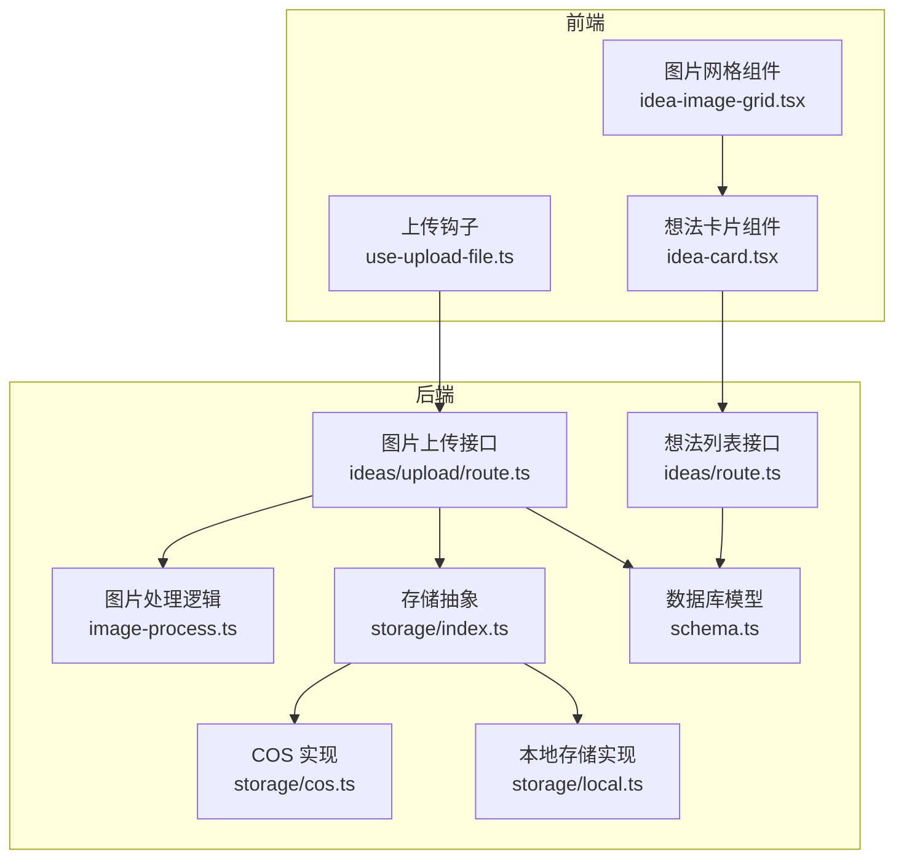
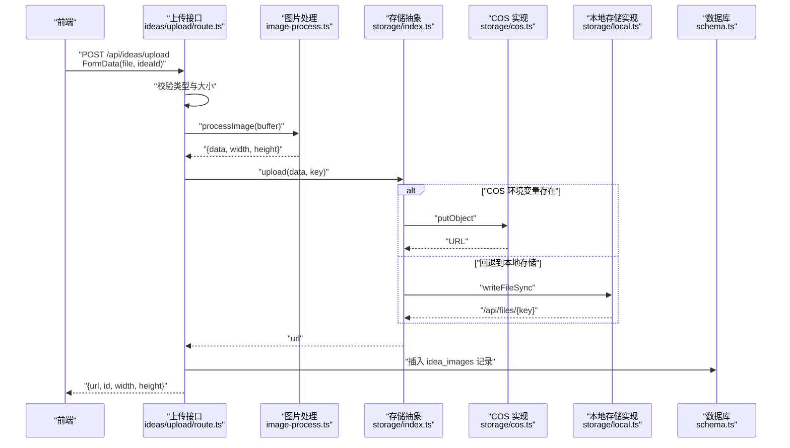
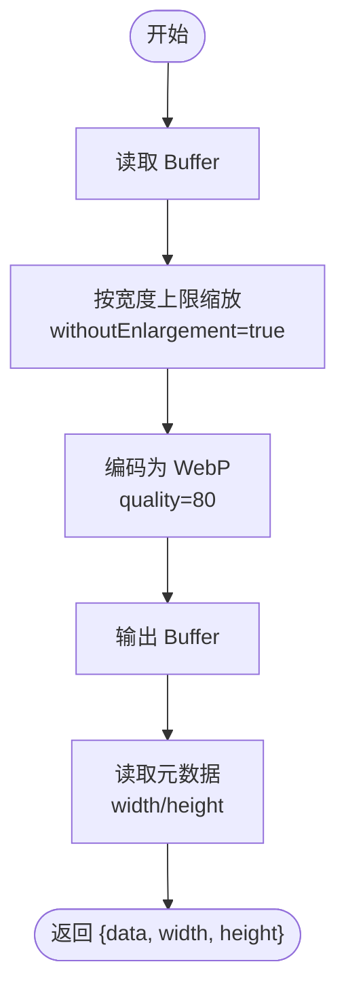
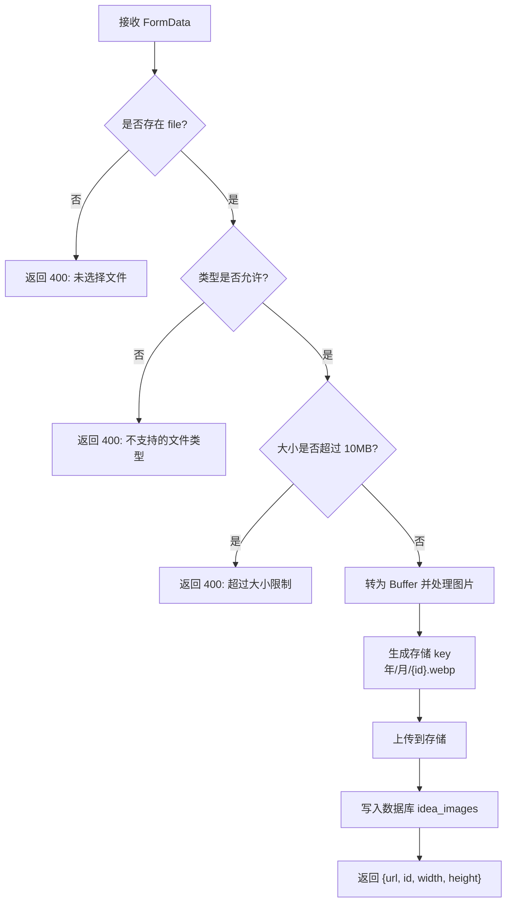
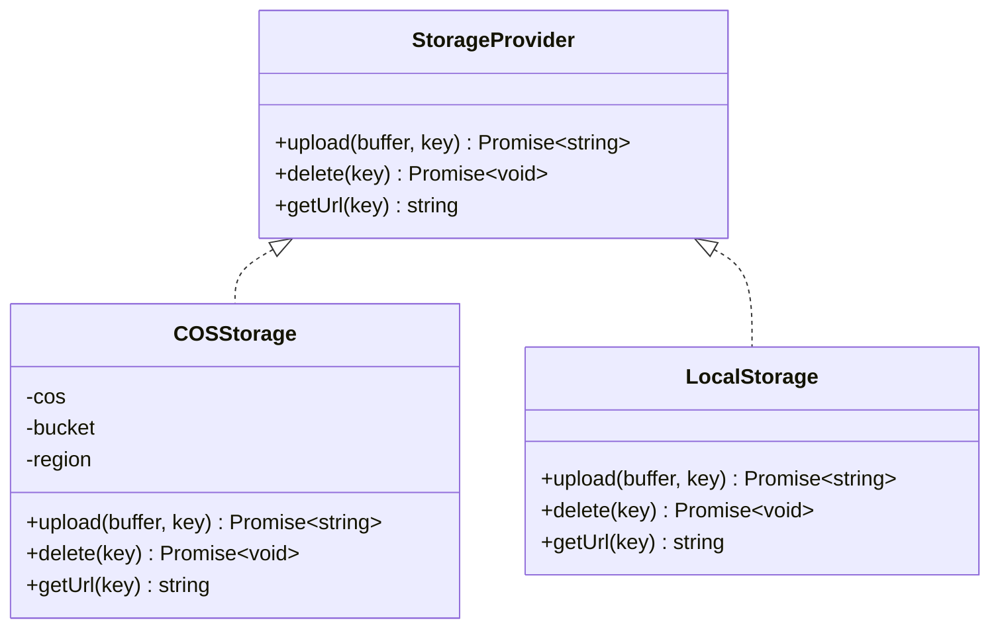
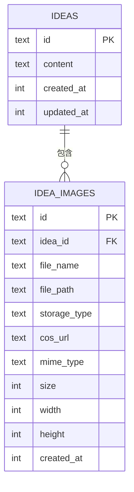
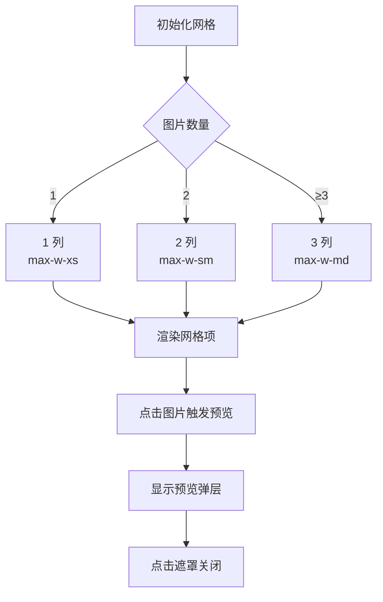

# 图片处理

<cite>
**本文引用的文件**
- [image-process.ts](file://src/lib/image-process.ts)
- [route.ts（想法上传）](file://src/app/api/ideas/upload/route.ts)
- [route.ts（想法列表）](file://src/app/api/ideas/route.ts)
- [idea-image-grid.tsx](file://src/components/ideas/idea-image-grid.tsx)
- [idea-card.tsx](file://src/components/ideas/idea-card.tsx)
- [schema.ts](file://src/db/schema.ts)
- [index.ts（存储抽象）](file://src/lib/storage/index.ts)
- [cos.ts](file://src/lib/storage/cos.ts)
- [local.ts](file://src/lib/storage/local.ts)
- [use-upload-file.ts](file://src/hooks/use-upload-file.ts)
- [index.ts（类型定义）](file://src/types/index.ts)
- [route.ts（通用上传）](file://src/app/api/upload/route.ts)
- [package.json](file://package.json)
</cite>

## 目录
1. [简介](#简介)
2. [项目结构](#项目结构)
3. [核心组件](#核心组件)
4. [架构总览](#架构总览)
5. [详细组件分析](#详细组件分析)
6. [依赖分析](#依赖分析)
7. [性能考量](#性能考量)
8. [故障排查指南](#故障排查指南)
9. [结论](#结论)
10. [附录](#附录)

## 简介
本文件系统性地文档化了图片处理功能，涵盖以下方面：
- 图片上传流程：文件验证（类型、大小）、处理（缩略图生成、尺寸调整、压缩）、持久化与索引。
- 存储集成：本地存储与对象存储（COS）的自动切换、URL 生成与访问控制策略。
- 关联关系：图片与“想法”的多对多关系及引用完整性。
- 展示组件：图片网格的懒加载与响应式布局。
- 错误处理与重试：网络异常与存储失败的处理策略。
- 安全与最佳实践：环境变量、访问控制、输入校验与资源清理。

## 项目结构
围绕图片处理的关键目录与文件如下：
- 处理与上传：src/lib/image-process.ts、src/app/api/ideas/upload/route.ts
- 展示组件：src/components/ideas/idea-image-grid.tsx、src/components/ideas/idea-card.tsx
- 数据模型：src/db/schema.ts
- 存储抽象与实现：src/lib/storage/index.ts、src/lib/storage/cos.ts、src/lib/storage/local.ts
- 通用上传与类型：src/app/api/upload/route.ts、src/types/index.ts
- 工具钩子：src/hooks/use-upload-file.ts
- 依赖声明：package.json

图表来源
- [idea-image-grid.tsx:1-77](file://src/components/ideas/idea-image-grid.tsx#L1-L77)
- [idea-card.tsx:1-190](file://src/components/ideas/idea-card.tsx#L1-L190)
- [use-upload-file.ts:1-53](file://src/hooks/use-upload-file.ts#L1-L53)
- [route.ts（想法上传）:1-66](file://src/app/api/ideas/upload/route.ts#L1-L66)
- [route.ts（想法列表）:1-151](file://src/app/api/ideas/route.ts#L1-L151)
- [image-process.ts:1-21](file://src/lib/image-process.ts#L1-L21)
- [index.ts（存储抽象）:1-30](file://src/lib/storage/index.ts#L1-L30)
- [cos.ts:1-61](file://src/lib/storage/cos.ts#L1-L61)
- [local.ts:1-29](file://src/lib/storage/local.ts#L1-L29)
- [schema.ts:64-76](file://src/db/schema.ts#L64-L76)

章节来源
- [route.ts（想法上传）:1-66](file://src/app/api/ideas/upload/route.ts#L1-L66)
- [route.ts（想法列表）:1-151](file://src/app/api/ideas/route.ts#L1-L151)
- [image-process.ts:1-21](file://src/lib/image-process.ts#L1-L21)
- [idea-image-grid.tsx:1-77](file://src/components/ideas/idea-image-grid.tsx#L1-L77)
- [idea-card.tsx:1-190](file://src/components/ideas/idea-card.tsx#L1-L190)
- [schema.ts:64-76](file://src/db/schema.ts#L64-L76)
- [index.ts（存储抽象）:1-30](file://src/lib/storage/index.ts#L1-L30)
- [cos.ts:1-61](file://src/lib/storage/cos.ts#L1-L61)
- [local.ts:1-29](file://src/lib/storage/local.ts#L1-L29)
- [use-upload-file.ts:1-53](file://src/hooks/use-upload-file.ts#L1-L53)
- [route.ts（通用上传）:1-126](file://src/app/api/upload/route.ts#L1-L126)
- [package.json:1-119](file://package.json#L1-L119)

## 核心组件
- 图片处理模块：负责读取二进制数据，进行尺寸调整与压缩，并返回处理后的字节流与元信息。
- 想法上传接口：接收前端表单数据，执行类型与大小校验，调用图片处理模块，写入对象存储或本地存储，并在数据库中记录图片元数据。
- 图片网格组件：渲染图片网格，支持预览弹层与可选移除按钮，无懒加载但具备响应式布局。
- 存储抽象：根据环境变量自动选择 COS 或本地存储，统一上传、删除与 URL 生成接口。
- 数据模型：定义“想法”与“想法图片”的关联表，确保引用完整性与级联删除。

章节来源
- [image-process.ts:1-21](file://src/lib/image-process.ts#L1-L21)
- [route.ts（想法上传）:1-66](file://src/app/api/ideas/upload/route.ts#L1-L66)
- [idea-image-grid.tsx:1-77](file://src/components/ideas/idea-image-grid.tsx#L1-L77)
- [index.ts（存储抽象）:1-30](file://src/lib/storage/index.ts#L1-L30)
- [schema.ts:64-76](file://src/db/schema.ts#L64-L76)

## 架构总览
图片处理的端到端流程如下：
- 前端通过表单提交图片文件与关联的“想法 ID”，后端进行类型与大小校验。
- 使用图像处理库对图片进行尺寸调整与压缩，转换为 WebP 格式。
- 将处理后的字节流上传至对象存储（优先），若未配置则回退到本地存储。
- 在数据库中写入图片元数据（含宽高、MIME、存储类型等），并返回给前端用于展示。

图表来源
- [route.ts（想法上传）:1-66](file://src/app/api/ideas/upload/route.ts#L1-L66)
- [image-process.ts:1-21](file://src/lib/image-process.ts#L1-L21)
- [index.ts（存储抽象）:1-30](file://src/lib/storage/index.ts#L1-L30)
- [cos.ts:1-61](file://src/lib/storage/cos.ts#L1-L61)
- [local.ts:1-29](file://src/lib/storage/local.ts#L1-L29)
- [schema.ts:64-76](file://src/db/schema.ts#L64-L76)

## 详细组件分析

### 图片处理机制
- 输入：二进制 Buffer。
- 处理：按宽度上限进行缩放，避免放大；转换为 WebP，质量参数为 80。
- 输出：处理后的 Buffer 与最终宽高（通过二次元数据读取）。
- 复杂度：主要由图像处理库决定，通常近似线性于像素数；整体为 O(W×H)。

图表来源
- [image-process.ts:1-21](file://src/lib/image-process.ts#L1-L21)

章节来源
- [image-process.ts:1-21](file://src/lib/image-process.ts#L1-L21)

### 文件验证与上传流程
- 类型校验：仅允许 PNG、JPEG、GIF、WebP、SVG。
- 大小限制：10MB。
- 处理路径：将文件转为 ArrayBuffer 并 Buffer 化，随后调用图片处理模块。
- 存储选择：若环境变量齐全则使用 COS，否则回退本地存储。
- 元数据入库：记录文件名、路径、存储类型、URL、MIME、尺寸与宽高。

图表来源
- [route.ts（想法上传）:1-66](file://src/app/api/ideas/upload/route.ts#L1-L66)

章节来源
- [route.ts（想法上传）:1-66](file://src/app/api/ideas/upload/route.ts#L1-L66)

### COS 对象存储集成
- 自动选择：当环境变量齐全时启用 COS，否则使用本地存储。
- 上传键：以“年/月/{id}.webp”组织，前缀统一为“ynote/”。
- URL 生成：COS 返回标准域名 URL；本地存储返回 /api/files/{key}。
- 删除：支持按 key 删除对象。

图表来源
- [index.ts（存储抽象）:1-30](file://src/lib/storage/index.ts#L1-L30)
- [cos.ts:1-61](file://src/lib/storage/cos.ts#L1-L61)
- [local.ts:1-29](file://src/lib/storage/local.ts#L1-L29)

章节来源
- [index.ts（存储抽象）:1-30](file://src/lib/storage/index.ts#L1-L30)
- [cos.ts:1-61](file://src/lib/storage/cos.ts#L1-L61)
- [local.ts:1-29](file://src/lib/storage/local.ts#L1-L29)

### 图片与想法的关联关系
- 多对多：一个想法可包含多张图片；一张图片可被多个想法引用。
- 引用完整性：图片表中的外键在删除想法时级联删除，保证数据一致性。
- 展示：列表接口在查询想法时一并拉取其图片集合，统一返回 URL（优先 COS，否则本地）。

图表来源
- [schema.ts:57-62](file://src/db/schema.ts#L57-L62)
- [schema.ts:64-76](file://src/db/schema.ts#L64-L76)
- [route.ts（想法列表）:55-67](file://src/app/api/ideas/route.ts#L55-L67)

章节来源
- [schema.ts:57-62](file://src/db/schema.ts#L57-L62)
- [schema.ts:64-76](file://src/db/schema.ts#L64-L76)
- [route.ts（想法列表）:55-67](file://src/app/api/ideas/route.ts#L55-L67)

### 图片网格展示组件
- 功能：根据图片数量动态选择列数与最大宽度，实现响应式网格；点击图片打开预览弹层；支持可选移除按钮。
- 交互：hover 显示移除按钮；点击遮罩关闭预览。
- 注意：当前未实现懒加载（如 IntersectionObserver），如需优化可在此基础上扩展。

图表来源
- [idea-image-grid.tsx:1-77](file://src/components/ideas/idea-image-grid.tsx#L1-L77)

章节来源
- [idea-image-grid.tsx:1-77](file://src/components/ideas/idea-image-grid.tsx#L1-L77)
- [idea-card.tsx:140-144](file://src/components/ideas/idea-card.tsx#L140-L144)

### 通用上传与错误提示
- 通用上传接口：支持图片、视频、音频、文档多种类型与不同大小限制。
- 错误提示：通过媒体编辑器的错误插件与 Toast 组件向用户反馈无效类型、过大、过多等问题。
- 上传钩子：提供基础文件上传能力（非图片专用），进度与状态管理。

章节来源
- [route.ts（通用上传）:1-126](file://src/app/api/upload/route.ts#L1-L126)
- [use-upload-file.ts:1-53](file://src/hooks/use-upload-file.ts#L1-L53)

## 依赖分析
- 图像处理：sharp（用于尺寸调整与 WebP 编码）。
- 对象存储：cos-nodejs-sdk-v5（COS SDK）。
- 数据库：better-sqlite3 与 drizzle-orm（SQLite）。
- 前端 UI：React、TailwindCSS、Lucide Icons。
- 状态管理：Zustand（想法列表与标签）。

章节来源
- [package.json:1-119](file://package.json#L1-L119)

## 性能考量
- 图像处理成本：O(W×H)，建议在服务端进行批量处理与缓存；对超大图可考虑分块或降采样。
- 存储带宽：COS 适合公网访问与 CDN 加速；本地存储适合内网或开发环境。
- 数据库查询：列表接口一次性拉取图片集合，避免 N+1 查询；可考虑分页游标与索引优化。
- 前端渲染：图片网格已具备响应式布局，可进一步引入懒加载与骨架屏提升首屏体验。

[本节为通用指导，无需具体文件来源]

## 故障排查指南
- 上传失败（500）：检查后端日志与存储连接；确认环境变量是否正确设置。
- 不支持的文件类型：确认前端类型白名单与后端校验一致。
- 超过大小限制：调整客户端提示或后端阈值；注意不同文件类型的限制差异。
- 存储失败：COS 需要正确的密钥、桶与区域；本地存储需确保目录可写。
- 图片不显示：确认 URL 生成逻辑与访问权限；COS 需要公开访问或签名策略。

章节来源
- [route.ts（想法上传）:61-64](file://src/app/api/ideas/upload/route.ts#L61-L64)
- [cos.ts:25-39](file://src/lib/storage/cos.ts#L25-L39)
- [local.ts:8-16](file://src/lib/storage/local.ts#L8-L16)

## 结论
该图片处理方案以清晰的职责分离实现了从上传、处理、存储到展示的完整链路。通过存储抽象与数据库模型，系统既支持对象存储也兼容本地部署；通过严格的类型与大小校验，提升了安全性与稳定性。后续可在前端引入懒加载、在后端引入重试与队列化处理，以进一步增强可靠性与用户体验。

[本节为总结，无需具体文件来源]

## 附录

### 关键配置与常量
- 图片大小限制：10MB
- 允许的 MIME 类型：PNG、JPEG、GIF、WebP、SVG
- 图像处理：宽度上限 1920，withoutEnlargement，质量 80，输出 WebP
- 存储键命名：年/月/{id}.webp
- 存储类型字段：local 或 cos

章节来源
- [route.ts（想法上传）:8-9](file://src/app/api/ideas/upload/route.ts#L8-L9)
- [image-process.ts:8-10](file://src/lib/image-process.ts#L8-L10)
- [route.ts（想法上传）:37-38](file://src/app/api/ideas/upload/route.ts#L37-L38)

### 安全与最佳实践
- 环境变量：COS_SECRET_ID、COS_SECRET_KEY、COS_BUCKET、COS_REGION 必须严格保密。
- 访问控制：COS 默认私有，需结合签名 URL 或 CDN 策略；本地存储需限制 /api/files 的访问范围。
- 输入校验：前后端双重校验，避免绕过。
- 资源清理：定期清理未使用的图片与数据库冗余记录。
- 错误监控：对上传失败与存储异常进行日志记录与告警。

章节来源
- [index.ts（存储抽象）:15-26](file://src/lib/storage/index.ts#L15-L26)
- [cos.ts:17-22](file://src/lib/storage/cos.ts#L17-L22)