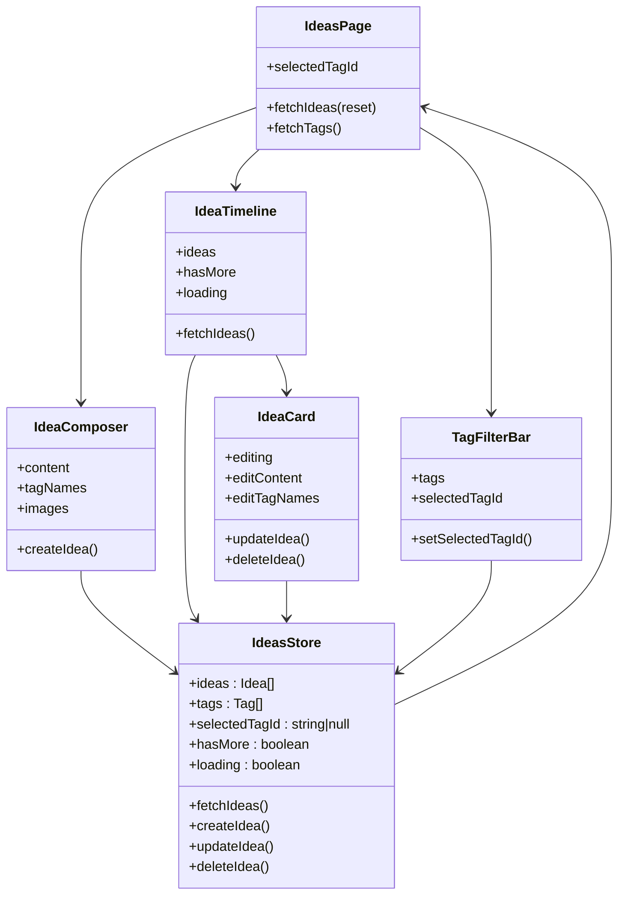
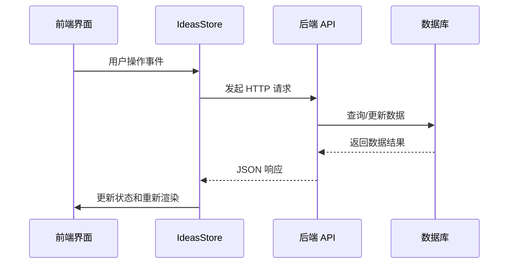
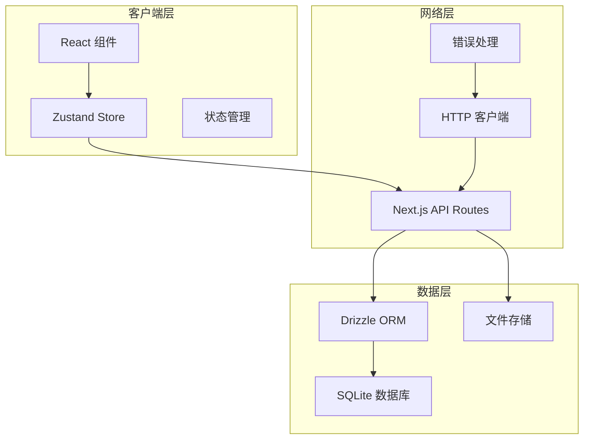
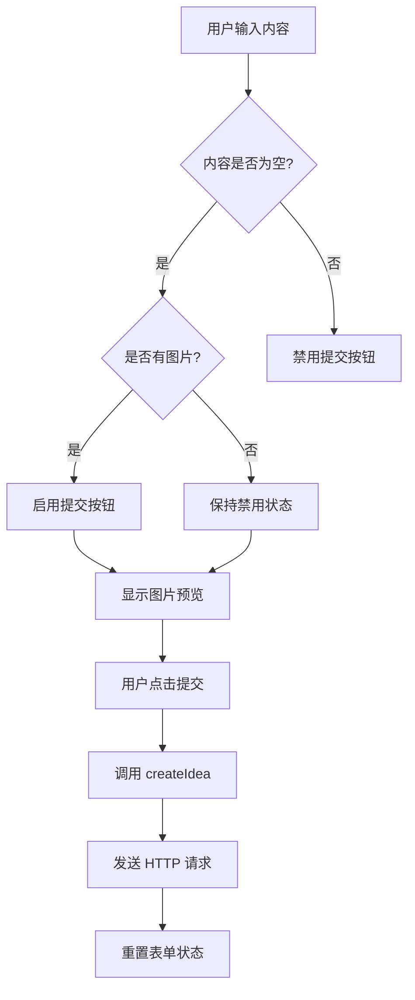
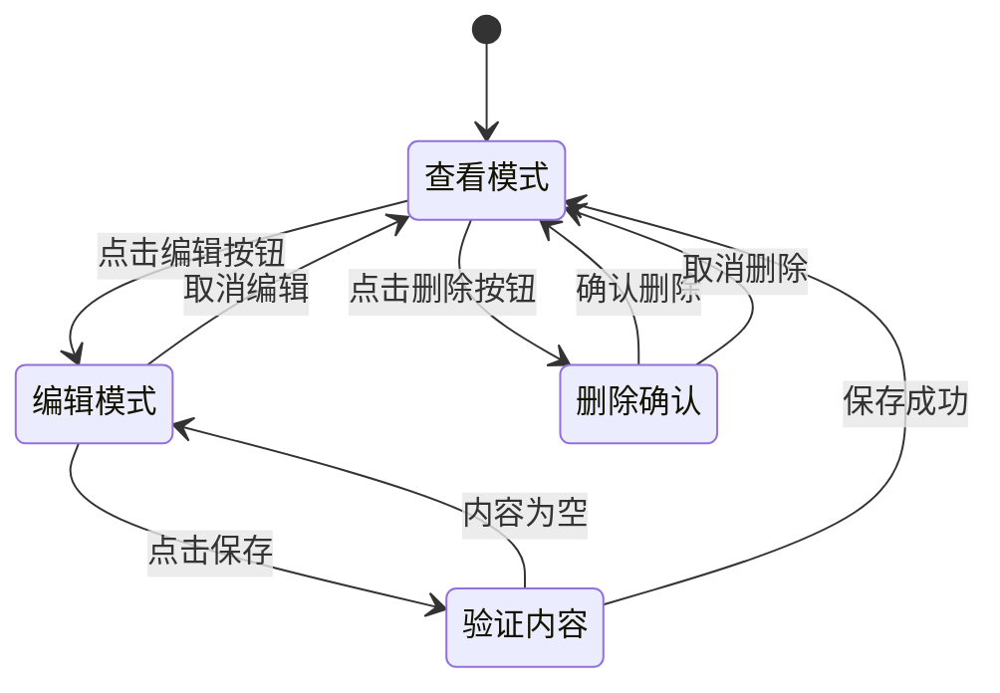
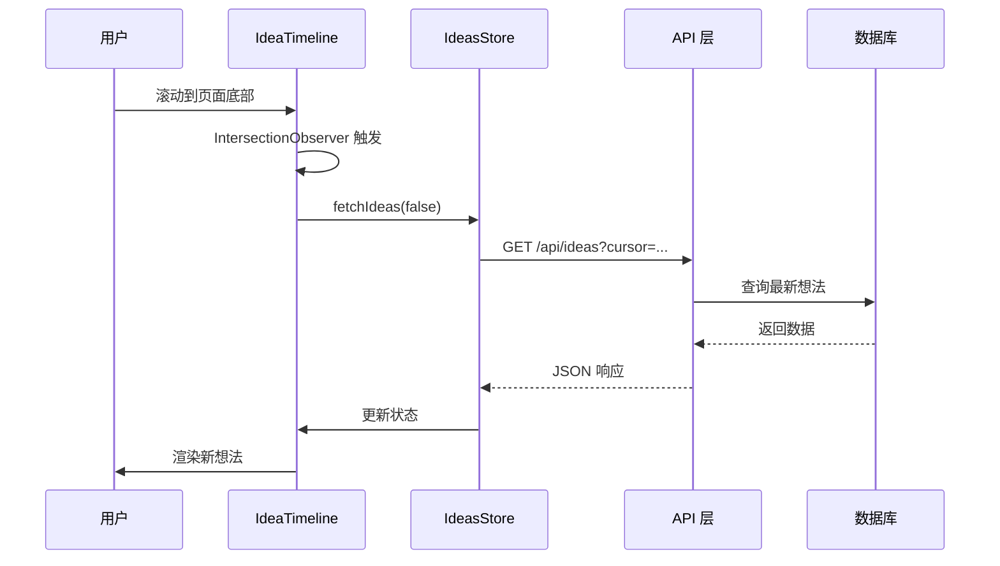
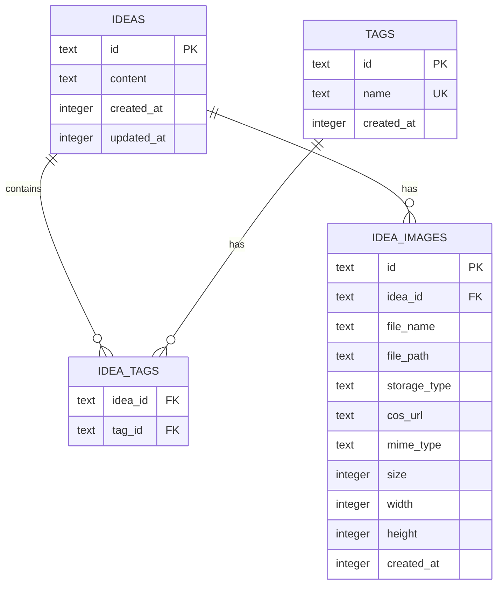
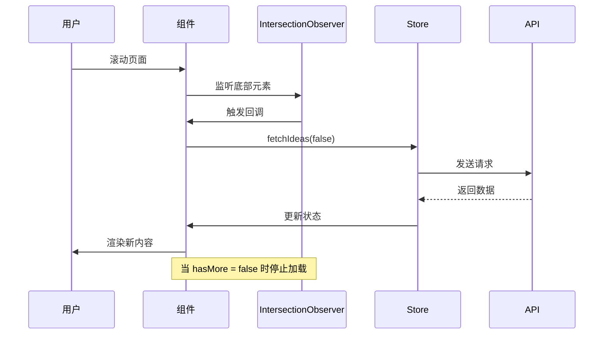
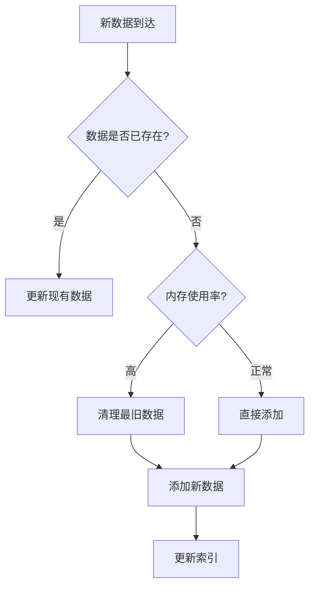

# 想法管理

<cite>
**本文档引用的文件**
- [src/app/api/ideas/route.ts](file://src/app/api/ideas/route.ts)
- [src/app/api/ideas/[id]/route.ts](file://src/app/api/ideas/[id]/route.ts)
- [src/app/api/ideas/upload/route.ts](file://src/app/api/ideas/upload/route.ts)
- [src/app/api/tags/route.ts](file://src/app/api/tags/route.ts)
- [src/components/ideas/idea-card.tsx](file://src/components/ideas/idea-card.tsx)
- [src/components/ideas/ideas-page.tsx](file://src/components/ideas/ideas-page.tsx)
- [src/components/ideas/idea-composer.tsx](file://src/components/ideas/idea-composer.tsx)
- [src/components/ideas/idea-timeline.tsx](file://src/components/ideas/idea-timeline.tsx)
- [src/components/ideas/tag-filter-bar.tsx](file://src/components/ideas/tag-filter-bar.tsx)
- [src/stores/ideas-store.ts](file://src/stores/ideas-store.ts)
- [src/db/schema.ts](file://src/db/schema.ts)
- [src/types/index.ts](file://src/types/index.ts)
- [src/lib/utils.ts](file://src/lib/utils.ts)
</cite>

## 目录
1. [简介](#简介)
2. [项目结构](#项目结构)
3. [核心组件](#核心组件)
4. [架构概览](#架构概览)
5. [详细组件分析](#详细组件分析)
6. [数据模型设计](#数据模型设计)
7. [API 接口规范](#api-接口规范)
8. [分页加载机制](#分页加载机制)
9. [性能优化策略](#性能优化策略)
10. [组件使用示例](#组件使用示例)
11. [故障排除指南](#故障排除指南)
12. [结论](#结论)

## 简介

想法管理功能是 ynote-v2 应用程序中的核心模块，为用户提供了一个完整的想法记录、管理和展示平台。该功能支持文本内容的创建、编辑、删除和查询，包含标签分类、图片附件、实时协作等功能。系统采用前后端分离架构，使用 Next.js 构建服务端渲染的 Web 应用程序。

## 项目结构

想法管理功能主要分布在以下目录结构中：

```mermaid
graph TB
subgraph "前端组件层"
A[src/components/ideas/]
B[src/stores/ideas-store.ts]
C[src/types/index.ts]
end
subgraph "后端 API 层"
D[src/app/api/ideas/]
E[src/app/api/ideas/[id]/route.ts]
F[src/app/api/ideas/upload/]
G[src/app/api/tags/]
end
subgraph "数据层"
H[src/db/schema.ts]
I[src/lib/storage/]
J[src/lib/image-process.ts]
end
A --> B
B --> D
B --> E
B --> F
B --> G
D --> H
E --> H
F --> H
F --> I
F --> J
```

**图表来源**
- [src/components/ideas/ideas-page.tsx:1-43](file://src/components/ideas/ideas-page.tsx#L1-L43)
- [src/stores/ideas-store.ts:1-126](file://src/stores/ideas-store.ts#L1-L126)
- [src/db/schema.ts:57-91](file://src/db/schema.ts#L57-L91)

**章节来源**
- [src/components/ideas/ideas-page.tsx:1-43](file://src/components/ideas/ideas-page.tsx#L1-L43)
- [src/stores/ideas-store.ts:1-126](file://src/stores/ideas-store.ts#L1-L126)

## 核心组件

想法管理功能由多个相互协作的组件组成，每个组件都有明确的职责分工：

### 前端组件层次结构



**图表来源**
- [src/components/ideas/ideas-page.tsx:9-42](file://src/components/ideas/ideas-page.tsx#L9-L42)
- [src/components/ideas/idea-composer.tsx:16-201](file://src/components/ideas/idea-composer.tsx#L16-L201)
- [src/components/ideas/idea-timeline.tsx:8-68](file://src/components/ideas/idea-timeline.tsx#L8-L68)
- [src/components/ideas/idea-card.tsx:14-189](file://src/components/ideas/idea-card.tsx#L14-L189)
- [src/components/ideas/tag-filter-bar.tsx:6-51](file://src/components/ideas/tag-filter-bar.tsx#L6-L51)
- [src/stores/ideas-store.ts:20-125](file://src/stores/ideas-store.ts#L20-L125)

### 数据流架构



**图表来源**
- [src/stores/ideas-store.ts:29-59](file://src/stores/ideas-store.ts#L29-L59)
- [src/app/api/ideas/route.ts:7-84](file://src/app/api/ideas/route.ts#L7-L84)

**章节来源**
- [src/components/ideas/ideas-page.tsx:1-43](file://src/components/ideas/ideas-page.tsx#L1-L43)
- [src/stores/ideas-store.ts:1-126](file://src/stores/ideas-store.ts#L1-L126)

## 架构概览

想法管理功能采用现代前端架构模式，结合了 React Hooks、Zustand 状态管理、Next.js API 路由和 Drizzle ORM 数据库访问层。

### 整体架构图



**图表来源**
- [src/stores/ideas-store.ts:1-126](file://src/stores/ideas-store.ts#L1-L126)
- [src/app/api/ideas/route.ts:1-151](file://src/app/api/ideas/route.ts#L1-L151)
- [src/db/schema.ts:57-91](file://src/db/schema.ts#L57-L91)

### 技术栈特性

- **前端框架**: Next.js App Router + React 18 + TypeScript
- **状态管理**: Zustand (轻量级状态管理库)
- **数据库**: Drizzle ORM + SQLite
- **文件存储**: 支持本地存储和云存储(COS)
- **图像处理**: 自动压缩和格式转换(WebP)
- **UI 组件**: Tailwind CSS + Lucide React 图标

## 详细组件分析

### IdeaComposer - 想法创作器

IdeaComposer 是用户创建新想法的主要界面组件，提供了富文本输入、标签管理和图片上传功能。

#### 组件功能特性



**图表来源**
- [src/components/ideas/idea-composer.tsx:83-103](file://src/components/ideas/idea-composer.tsx#L83-L103)

#### 关键实现细节

- **标签输入**: 支持通过回车键或逗号分隔符添加标签
- **图片上传**: 支持多文件上传，自动压缩到 WebP 格式
- **表单验证**: 实时验证输入内容的有效性
- **用户体验**: 提供加载状态指示和错误处理反馈

**章节来源**
- [src/components/ideas/idea-composer.tsx:1-202](file://src/components/ideas/idea-composer.tsx#L1-L202)

### IdeaCard - 想法卡片

IdeaCard 组件负责渲染单个想法的完整信息，包括内容、标签、图片和操作按钮。

#### 编辑模式交互流程



**图表来源**
- [src/components/ideas/idea-card.tsx:39-76](file://src/components/ideas/idea-card.tsx#L39-L76)

#### 标签管理功能

组件支持动态标签管理，用户可以通过键盘快捷键快速添加或删除标签：
- **添加标签**: 回车键或逗号分隔符确认
- **删除标签**: 点击标签右侧的关闭按钮
- **批量删除**: 按住退格键删除最后一个标签

**章节来源**
- [src/components/ideas/idea-card.tsx:1-190](file://src/components/ideas/idea-card.tsx#L1-L190)

### IdeaTimeline - 想法时间线

IdeaTimeline 实现了无限滚动加载机制，为用户提供流畅的浏览体验。

#### 懒加载实现机制



**图表来源**
- [src/components/ideas/idea-timeline.tsx:15-35](file://src/components/ideas/idea-timeline.tsx#L15-L35)
- [src/stores/ideas-store.ts:29-59](file://src/stores/ideas-store.ts#L29-L59)

#### 性能优化策略

- **虚拟滚动**: 使用 IntersectionObserver 实现懒加载
- **内存管理**: 只保留必要的数据在内存中
- **渲染优化**: 使用 React.memo 避免不必要的重渲染

**章节来源**
- [src/components/ideas/idea-timeline.tsx:1-69](file://src/components/ideas/idea-timeline.tsx#L1-L69)

### TagFilterBar - 标签过滤器

TagFilterBar 提供了基于标签的过滤功能，允许用户按标签查看特定的想法集合。

#### 过滤逻辑实现

```mermaid
flowchart LR
A[所有标签] --> B{用户选择标签}
B --> |选择全部| C[清除标签过滤]
B --> |选择特定标签| D[设置 selectedTagId]
C --> E[fetchIdeas(true)]
D --> E
E --> F[重新加载想法列表]
F --> G[显示过滤结果]
```

**图表来源**
- [src/components/ideas/tag-filter-bar.tsx:12-15](file://src/components/ideas/tag-filter-bar.tsx#L12-L15)

**章节来源**
- [src/components/ideas/tag-filter-bar.tsx:1-52](file://src/components/ideas/tag-filter-bar.tsx#L1-L52)

## 数据模型设计

想法管理功能使用关系型数据库设计，通过三个核心表实现想法、标签和图片的关联管理。

### 数据模型关系图



**图表来源**
- [src/db/schema.ts:57-91](file://src/db/schema.ts#L57-L91)

### 核心数据表结构

#### ideas 表 (想法主表)
| 字段名 | 类型 | 约束 | 描述 |
|--------|------|------|------|
| id | TEXT | PRIMARY KEY | 唯一标识符 |
| content | TEXT | NOT NULL | 想法内容 |
| createdAt | INTEGER | NOT NULL | 创建时间戳 |
| updatedAt | INTEGER | NOT NULL | 更新时间戳 |

#### ideaImages 表 (想法图片表)
| 字段名 | 类型 | 约束 | 描述 |
|--------|------|------|------|
| id | TEXT | PRIMARY KEY | 图片唯一标识符 |
| ideaId | TEXT | FOREIGN KEY | 关联的想法 ID |
| fileName | TEXT | NOT NULL | 原始文件名 |
| filePath | TEXT | NOT NULL | 存储路径 |
| storageType | TEXT | NOT NULL | 存储类型(local/cos) |
| cosUrl | TEXT |  | COS 云存储 URL |
| mimeType | TEXT | NOT NULL | MIME 类型 |
| size | INTEGER |  | 文件大小 |
| width | INTEGER |  | 图片宽度 |
| height | INTEGER |  | 图片高度 |
| createdAt | INTEGER | NOT NULL | 创建时间戳 |

#### tags 表 (标签表)
| 字段名 | 类型 | 约束 | 描述 |
|--------|------|------|------|
| id | TEXT | PRIMARY KEY | 标签唯一标识符 |
| name | TEXT | NOT NULL UNIQUE | 标签名 |
| createdAt | INTEGER | NOT NULL | 创建时间戳 |

#### ideaTags 表 (想法标签关联表)
| 字段名 | 类型 | 约束 | 描述 |
|--------|------|------|------|
| ideaId | TEXT | NOT NULL | 关联想法 ID |
| tagId | TEXT | NOT NULL | 关联标签 ID |

**章节来源**
- [src/db/schema.ts:57-91](file://src/db/schema.ts#L57-L91)
- [src/types/index.ts:43-58](file://src/types/index.ts#L43-L58)

## API 接口规范

想法管理功能提供 RESTful API 接口，支持完整的 CRUD 操作和高级查询功能。

### API 接口定义

#### 获取想法列表

**请求方法**: GET  
**路径**: `/api/ideas`  
**查询参数**:
- `tagId`: string - 标签 ID，用于按标签过滤
- `cursor`: number - 游标，用于分页加载
- `limit`: number - 最大返回数量，默认 20，最大 50

**响应格式**:
```json
{
  "ideas": [
    {
      "id": "string",
      "content": "string",
      "tags": [
        {
          "id": "string",
          "name": "string"
        }
      ],
      "images": [
        {
          "id": "string",
          "ideaId": "string",
          "url": "string",
          "width": number,
          "height": number
        }
      ],
      "createdAt": number,
      "updatedAt": number
    }
  ],
  "hasMore": boolean
}
```

**错误处理**:
- 400: 参数无效
- 500: 服务器内部错误

#### 创建新想法

**请求方法**: POST  
**路径**: `/api/ideas`  
**请求体**:
```json
{
  "content": "string",
  "tagNames": ["string"],
  "imageIds": ["string"]
}
```

**响应格式**:
```json
{
  "id": "string",
  "content": "string",
  "tags": [
    {
      "id": "string",
      "name": "string"
    }
  ],
  "images": [
    {
      "id": "string",
      "ideaId": "string",
      "url": "string",
      "width": number,
      "height": number
    }
  ],
  "createdAt": number,
  "updatedAt": number
}
```

**验证规则**:
- 内容和图片不能同时为空
- 标签名称必须非空且去重

#### 更新想法

**请求方法**: PATCH  
**路径**: `/api/ideas/[id]`  
**路径参数**:
- `id`: string - 想法 ID

**请求体**:
```json
{
  "content": "string",
  "tagNames": ["string"]
}
```

**验证规则**:
- 内容不能为空
- 标签名称必须非空且去重

#### 删除想法

**请求方法**: DELETE  
**路径**: `/api/ideas/[id]`

**响应格式**:
```json
{
  "success": true
}
```

#### 上传图片

**请求方法**: POST  
**路径**: `/api/ideas/upload`  
**请求体**: multipart/form-data

**支持的文件类型**:
- image/png
- image/jpeg  
- image/gif
- image/webp
- image/svg+xml

**文件限制**:
- 最大文件大小: 10MB
- 自动压缩到 WebP 格式

**响应格式**:
```json
{
  "id": "string",
  "url": "string",
  "width": number,
  "height": number
}
```

#### 获取标签列表

**请求方法**: GET  
**路径**: `/api/tags`

**响应格式**:
```json
{
  "tags": [
    {
      "id": "string",
      "name": "string",
      "count": number
    }
  ]
}
```

**章节来源**
- [src/app/api/ideas/route.ts:7-84](file://src/app/api/ideas/route.ts#L7-L84)
- [src/app/api/ideas/[id]/route.ts](file://src/app/api/ideas/[id]/route.ts#L40-L94)
- [src/app/api/ideas/upload/route.ts:11-65](file://src/app/api/ideas/upload/route.ts#L11-L65)
- [src/app/api/tags/route.ts:6-27](file://src/app/api/tags/route.ts#L6-L27)

## 分页加载机制

想法管理功能实现了高效的分页加载机制，支持游标分页和批量加载策略。

### 游标分页实现

```mermaid
flowchart TD
A[初始加载] --> B{是否有数据?}
B --> |是| C[显示前 N 条记录]
B --> |否| D[显示空状态]
C --> E[设置 cursor = 最后一条记录的 createdAt]
E --> F[滚动到底部触发加载]
F --> G[GET /api/ideas?cursor={cursor}&limit={N}]
G --> H{还有更多数据?}
H --> |是| I[返回 N+1 条记录]
H --> |否| J[返回 N 条记录]
I --> K[提取前 N 条显示]
K --> L[更新 cursor]
L --> M[等待下一次滚动]
J --> N[hasMore = false]
N --> M
```

**图表来源**
- [src/stores/ideas-store.ts:36-52](file://src/stores/ideas-store.ts#L36-L52)
- [src/app/api/ideas/route.ts:13-46](file://src/app/api/ideas/route.ts#L13-L46)

### 批量加载策略

系统采用智能的批量加载策略，根据用户行为和网络状况动态调整加载数量：

- **初始加载**: 默认 20 条记录
- **后续加载**: 每次加载 20 条记录
- **最大限制**: 单次请求最多 50 条记录
- **内存控制**: 自动清理不需要的数据

### 无限滚动实现



**图表来源**
- [src/components/ideas/idea-timeline.tsx:15-35](file://src/components/ideas/idea-timeline.tsx#L15-L35)
- [src/stores/ideas-store.ts:29-59](file://src/stores/ideas-store.ts#L29-L59)

**章节来源**
- [src/stores/ideas-store.ts:29-59](file://src/stores/ideas-store.ts#L29-L59)
- [src/app/api/ideas/route.ts:7-84](file://src/app/api/ideas/route.ts#L7-L84)

## 性能优化策略

想法管理功能采用了多种性能优化策略，确保在大数据量场景下的流畅用户体验。

### 懒加载优化

#### 图像懒加载
- **延迟加载**: 只在图片进入可视区域时才加载
- **占位符**: 使用低质量图片作为占位符
- **尺寸预估**: 预设图片尺寸避免布局抖动

#### 组件懒加载
- **按需加载**: 只在需要时加载组件
- **代码分割**: 将大型组件拆分为独立模块
- **缓存策略**: 利用浏览器缓存减少重复加载

### 内存管理优化

#### 数据缓存策略


#### 状态管理优化
- **最小化状态**: 只存储必要的数据
- **状态压缩**: 对大型对象进行压缩存储
- **增量更新**: 只更新变化的部分

### 网络请求优化

#### 请求合并
- **批量请求**: 将多个小请求合并为批量请求
- **请求去重**: 避免重复发送相同的请求
- **缓存策略**: 利用 HTTP 缓存头优化请求

#### 错误恢复
- **自动重试**: 失败请求自动重试
- **降级策略**: 网络异常时使用本地缓存
- **进度反馈**: 显示加载进度和状态

### 渲染性能优化

#### 虚拟滚动
- **窗口化**: 只渲染可见区域内的元素
- **固定高度**: 使用固定高度避免布局计算
- **池化复用**: 复用 DOM 元素减少创建销毁

#### 事件优化
- **防抖节流**: 对高频事件进行防抖处理
- **委托事件**: 使用事件委托减少监听器数量
- **异步处理**: 将耗时操作放到 Web Worker 中执行

**章节来源**
- [src/components/ideas/idea-timeline.tsx:15-35](file://src/components/ideas/idea-timeline.tsx#L15-L35)
- [src/stores/ideas-store.ts:29-59](file://src/stores/ideas-store.ts#L29-L59)

## 组件使用示例

### 基本使用示例

#### 在页面中集成想法管理功能

```typescript
// pages/ideas.tsx
import { IdeasPage } from '@/components/ideas/ideas-page';

export default function IdeasPage() {
  return <IdeasPage />;
}
```

#### 自定义想法卡片样式

```typescript
// components/custom-idea-card.tsx
import { IdeaCard } from '@/components/ideas/idea-card';

export function CustomIdeaCard({ idea }) {
  return (
    <div className="custom-idea-card">
      <IdeaCard 
        idea={idea}
        className="border-2 border-blue-500"
      />
    </div>
  );
}
```

### 高级使用模式

#### 实现自定义过滤器

```typescript
// components/filtered-ideas.tsx
import { useIdeasStore } from '@/stores/ideas-store';

export function FilteredIdeas({ filterType }) {
  const ideas = useIdeasStore((s) => {
    switch(filterType) {
      case 'recent':
        return s.ideas.filter(idea => 
          Date.now() - idea.createdAt < 7 * 24 * 60 * 60 * 1000
        );
      case 'withImages':
        return s.ideas.filter(idea => idea.images.length > 0);
      default:
        return s.ideas;
    }
  });

  return (
    <div>
      {ideas.map(idea => (
        <IdeaCard key={idea.id} idea={idea} />
      ))}
    </div>
  );
}
```

#### 实现自定义编辑器

```typescript
// components/custom-editor.tsx
import { useState } from 'react';
import { useIdeasStore } from '@/stores/ideas-store';

export function CustomEditor() {
  const [content, setContent] = useState('');
  const [tags, setTags] = useState<string[]>([]);
  const [images, setImages] = useState<File[]>([]);
  const createIdea = useIdeasStore(s => s.createIdea);

  const handleSubmit = async () => {
    const imageIds = await uploadImages(images);
    await createIdea(content, tags, imageIds);
    resetForm();
  };

  return (
    <div className="custom-editor">
      <textarea 
        value={content}
        onChange={(e) => setContent(e.target.value)}
        placeholder="输入想法内容..."
      />
      <div>
        {tags.map(tag => (
          <span key={tag}>{tag}</span>
        ))}
      </div>
      <button onClick={handleSubmit}>发布</button>
    </div>
  );
}
```

## 故障排除指南

### 常见问题及解决方案

#### 图片上传失败

**问题症状**:
- 上传按钮显示加载状态但无响应
- 控制台出现网络错误

**可能原因**:
1. 文件类型不支持
2. 文件大小超出限制
3. 网络连接不稳定
4. 存储服务配置错误

**解决步骤**:
1. 检查文件类型是否在支持列表中
2. 确认文件大小不超过 10MB 限制
3. 验证网络连接稳定性
4. 检查存储服务配置

**相关代码参考**:
- [文件类型检查:21-23](file://src/app/api/ideas/upload/route.ts#L21-L23)
- [文件大小限制:25-27](file://src/app/api/ideas/upload/route.ts#L25-L27)

#### 想法加载缓慢

**问题症状**:
- 页面加载时间过长
- 无限滚动加载卡顿

**优化建议**:
1. 减少单次加载的数据量
2. 实施数据缓存策略
3. 优化数据库查询
4. 使用懒加载技术

**相关代码参考**:
- [分页参数设置](file://src/app/api/ideas/route.ts#L13)
- [懒加载实现:15-35](file://src/components/ideas/idea-timeline.tsx#L15-L35)

#### 标签过滤失效

**问题症状**:
- 选择标签后页面无变化
- 标签计数显示异常

**排查步骤**:
1. 检查标签 ID 是否正确传递
2. 验证 API 响应格式
3. 确认状态更新逻辑

**相关代码参考**:
- [标签过滤逻辑:36-40](file://src/stores/ideas-store.ts#L36-L40)
- [标签选择处理:12-15](file://src/components/ideas/tag-filter-bar.tsx#L12-L15)

### 调试技巧

#### 开启开发模式日志

```typescript
// 在开发环境中启用详细日志
const DEBUG = process.env.NODE_ENV === 'development';

if (DEBUG) {
  console.log('API 请求:', url, params);
  console.log('响应数据:', data);
}
```

#### 性能监控

```typescript
// 监控 API 请求性能
const startTime = performance.now();
const response = await fetch(url);
const endTime = performance.now();
console.log(`请求耗时: ${endTime - startTime}ms`);
```

**章节来源**
- [src/app/api/ideas/upload/route.ts:11-65](file://src/app/api/ideas/upload/route.ts#L11-L65)
- [src/components/ideas/idea-timeline.tsx:15-35](file://src/components/ideas/idea-timeline.tsx#L15-L35)
- [src/components/ideas/tag-filter-bar.tsx:12-15](file://src/components/ideas/tag-filter-bar.tsx#L12-L15)

## 结论

想法管理功能是一个功能完整、架构清晰的现代化 Web 应用模块。通过合理的设计模式和技术选型，该功能实现了良好的用户体验和优秀的性能表现。

### 主要优势

1. **模块化设计**: 组件职责明确，易于维护和扩展
2. **性能优化**: 采用多种优化策略确保流畅体验
3. **数据完整性**: 通过关系型数据库保证数据一致性
4. **用户体验**: 提供直观的操作界面和反馈机制
5. **可扩展性**: 支持插件化扩展和自定义功能

### 技术亮点

- **状态管理**: 使用 Zustand 实现轻量级状态管理
- **数据持久化**: 采用 Drizzle ORM 和 SQLite 数据库
- **文件处理**: 集成图像压缩和云存储功能
- **响应式设计**: 支持移动端和桌面端访问
- **错误处理**: 完善的错误捕获和用户提示机制

### 未来改进方向

1. **搜索功能**: 添加全文搜索和高级筛选功能
2. **协作功能**: 实现实时协作和版本管理
3. **导出功能**: 支持多种格式的数据导出
4. **备份恢复**: 实现自动备份和数据恢复机制
5. **离线支持**: 添加离线模式和同步功能

该想法管理功能为用户提供了高效、便捷的想法记录和管理工具，是 ynote-v2 应用程序的重要组成部分。