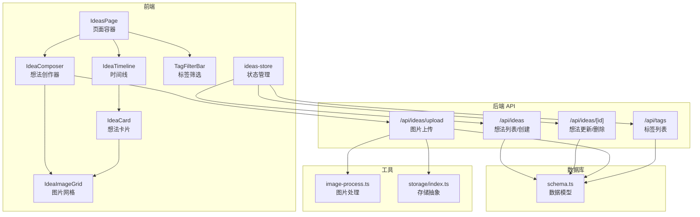
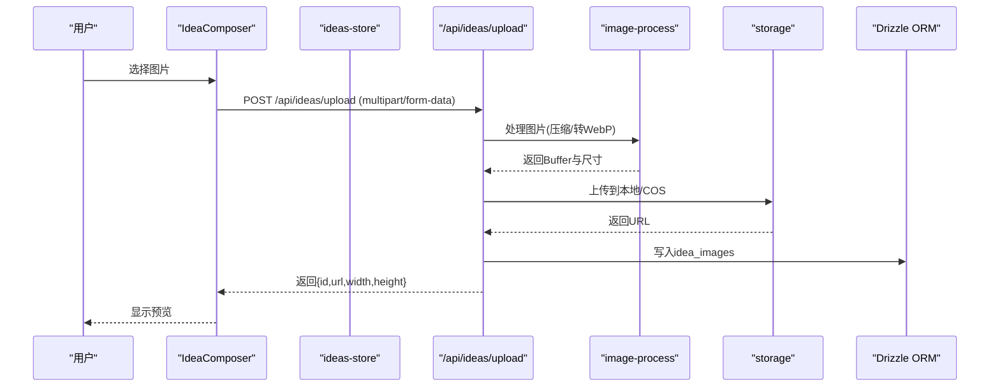
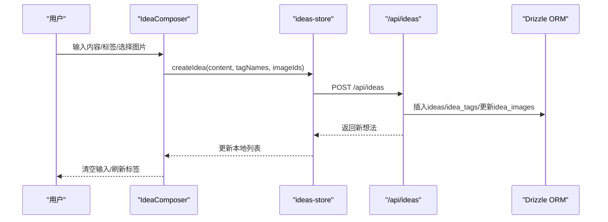
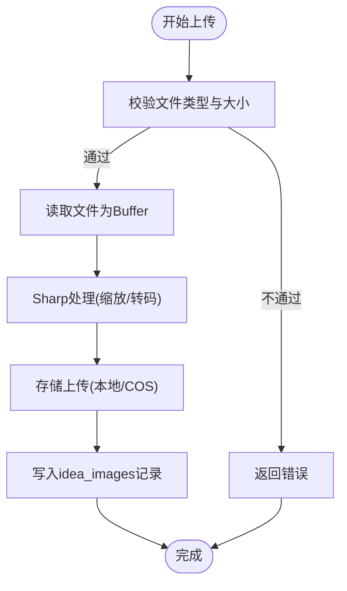
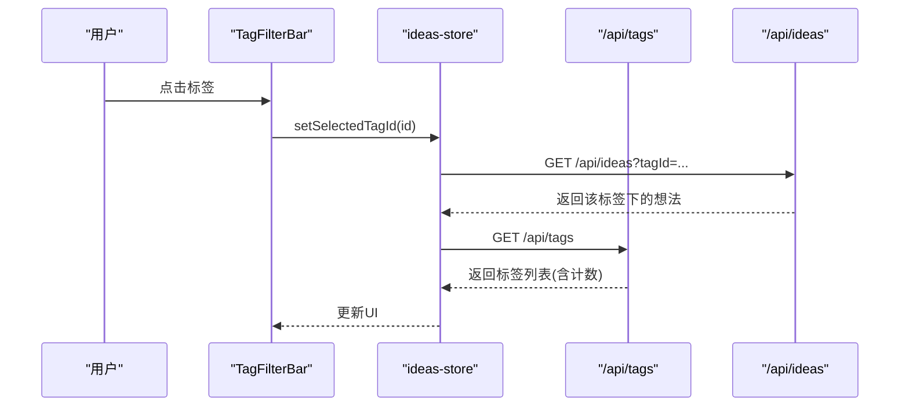
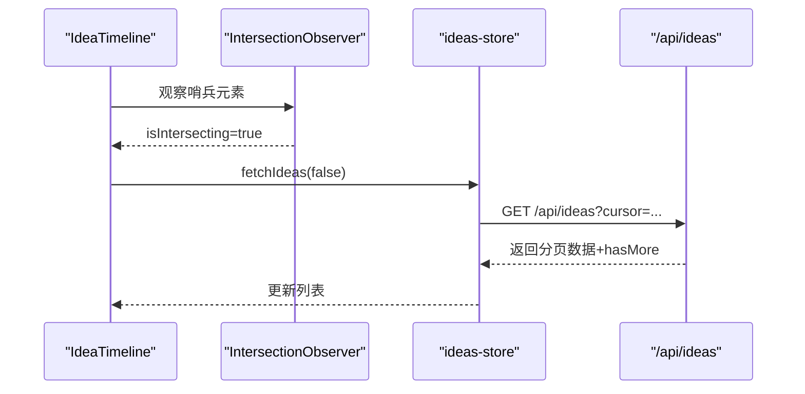
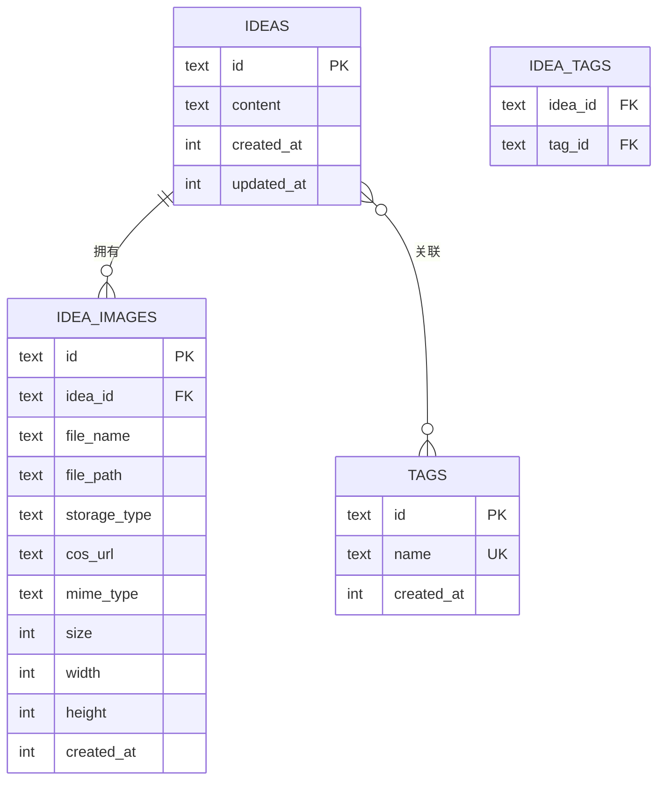
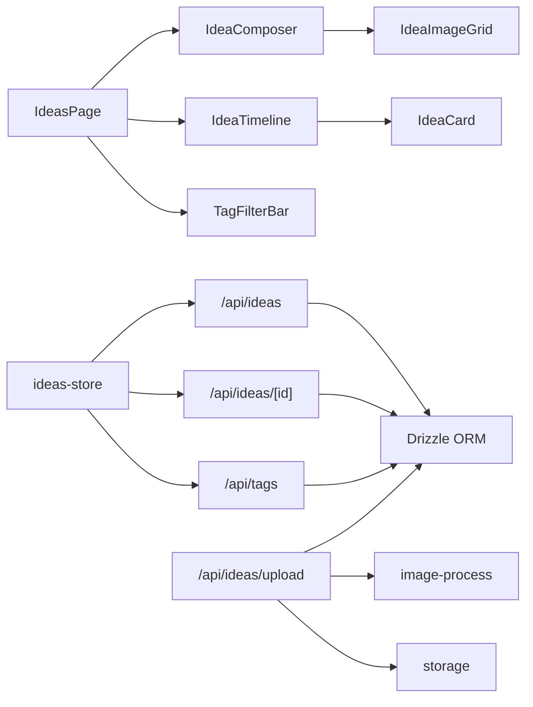

# 想法记录系统

<cite>
**本文档引用的文件**
- [src/app/api/ideas/route.ts](file://src/app/api/ideas/route.ts)
- [src/app/api/ideas/[id]/route.ts](file://src/app/api/ideas/[id]/route.ts)
- [src/app/api/ideas/upload/route.ts](file://src/app/api/ideas/upload/route.ts)
- [src/app/api/tags/route.ts](file://src/app/api/tags/route.ts)
- [src/components/ideas/ideas-page.tsx](file://src/components/ideas/ideas-page.tsx)
- [src/components/ideas/idea-composer.tsx](file://src/components/ideas/idea-composer.tsx)
- [src/components/ideas/idea-timeline.tsx](file://src/components/ideas/idea-timeline.tsx)
- [src/components/ideas/tag-filter-bar.tsx](file://src/components/ideas/tag-filter-bar.tsx)
- [src/components/ideas/idea-card.tsx](file://src/components/ideas/idea-card.tsx)
- [src/components/ideas/idea-image-grid.tsx](file://src/components/ideas/idea-image-grid.tsx)
- [src/stores/ideas-store.ts](file://src/stores/ideas-store.ts)
- [src/db/schema.ts](file://src/db/schema.ts)
- [src/lib/image-process.ts](file://src/lib/image-process.ts)
- [src/lib/storage/index.ts](file://src/lib/storage/index.ts)
- [src/types/index.ts](file://src/types/index.ts)
</cite>

## 目录
1. [简介](#简介)
2. [项目结构](#项目结构)
3. [核心组件](#核心组件)
4. [架构总览](#架构总览)
5. [详细组件分析](#详细组件分析)
6. [依赖关系分析](#依赖关系分析)
7. [性能考虑](#性能考虑)
8. [故障排除指南](#故障排除指南)
9. [结论](#结论)
10. [附录](#附录)

## 简介
本系统是一个基于 Next.js 的想法记录应用，支持文本与图片混合内容的创建、编辑与管理；提供标签分类与筛选；通过时间线展示想法并支持无限滚动加载；内置图片上传与存储（本地或云存储），并进行压缩与缩略图生成。后端采用 Drizzle ORM 连接 SQLite 数据库，前端使用 Zustand 状态管理与 IntersectionObserver 实现懒加载。

## 项目结构
系统采用分层组织：API 路由负责数据访问与业务逻辑；组件层负责 UI 交互；状态层集中管理想法、标签与加载状态；数据库层定义数据模型与关系；工具层提供图片处理与存储抽象。

图表来源
- [src/components/ideas/ideas-page.tsx:9-42](file://src/components/ideas/ideas-page.tsx#L9-L42)
- [src/components/ideas/idea-composer.tsx:16-201](file://src/components/ideas/idea-composer.tsx#L16-L201)
- [src/components/ideas/idea-timeline.tsx:8-68](file://src/components/ideas/idea-timeline.tsx#L8-L68)
- [src/components/ideas/tag-filter-bar.tsx:6-51](file://src/components/ideas/tag-filter-bar.tsx#L6-L51)
- [src/components/ideas/idea-card.tsx:14-189](file://src/components/ideas/idea-card.tsx#L14-L189)
- [src/components/ideas/idea-image-grid.tsx:13-76](file://src/components/ideas/idea-image-grid.tsx#L13-L76)
- [src/stores/ideas-store.ts:20-125](file://src/stores/ideas-store.ts#L20-L125)
- [src/app/api/ideas/route.ts:7-84](file://src/app/api/ideas/route.ts#L7-L84)
- [src/app/api/ideas/[id]/route.ts](file://src/app/api/ideas/[id]/route.ts#L40-L116)
- [src/app/api/ideas/upload/route.ts:11-65](file://src/app/api/ideas/upload/route.ts#L11-L65)
- [src/app/api/tags/route.ts:6-27](file://src/app/api/tags/route.ts#L6-L27)
- [src/db/schema.ts:57-91](file://src/db/schema.ts#L57-L91)
- [src/lib/image-process.ts:3-20](file://src/lib/image-process.ts#L3-L20)
- [src/lib/storage/index.ts:12-29](file://src/lib/storage/index.ts#L12-L29)

章节来源
- [src/components/ideas/ideas-page.tsx:9-42](file://src/components/ideas/ideas-page.tsx#L9-L42)
- [src/stores/ideas-store.ts:20-125](file://src/stores/ideas-store.ts#L20-L125)
- [src/db/schema.ts:57-91](file://src/db/schema.ts#L57-L91)

## 核心组件
- 想法创作器：支持文本输入、标签输入、图片上传与预览、提交发布。
- 时间线：按时间倒序展示想法，支持懒加载与“没有更多”提示。
- 标签筛选：展示标签及数量，支持全选与按标签过滤。
- 想法卡片：支持内联编辑、标签编辑、删除确认。
- 图片网格：根据图片数量自动布局，支持预览与移除。
- 状态管理：统一管理想法列表、标签、选中标签、加载状态与分页游标。

章节来源
- [src/components/ideas/idea-composer.tsx:16-201](file://src/components/ideas/idea-composer.tsx#L16-L201)
- [src/components/ideas/idea-timeline.tsx:8-68](file://src/components/ideas/idea-timeline.tsx#L8-L68)
- [src/components/ideas/tag-filter-bar.tsx:6-51](file://src/components/ideas/tag-filter-bar.tsx#L6-L51)
- [src/components/ideas/idea-card.tsx:14-189](file://src/components/ideas/idea-card.tsx#L14-L189)
- [src/components/ideas/idea-image-grid.tsx:13-76](file://src/components/ideas/idea-image-grid.tsx#L13-L76)
- [src/stores/ideas-store.ts:20-125](file://src/stores/ideas-store.ts#L20-L125)

## 架构总览
系统采用前后端分离的 API 驱动模式：
- 前端通过 fetch 调用后端 API，使用 Zustand 管理状态与缓存。
- 后端 API 使用 Drizzle ORM 访问 SQLite，提供想法、标签与图片的增删改查。
- 图片上传使用 Sharp 进行压缩与格式转换，存储支持本地或云对象存储（COS）。

图表来源
- [src/components/ideas/idea-composer.tsx:49-77](file://src/components/ideas/idea-composer.tsx#L49-L77)
- [src/app/api/ideas/upload/route.ts:11-65](file://src/app/api/ideas/upload/route.ts#L11-L65)
- [src/lib/image-process.ts:3-20](file://src/lib/image-process.ts#L3-L20)
- [src/lib/storage/index.ts:12-29](file://src/lib/storage/index.ts#L12-L29)
- [src/db/schema.ts:64-76](file://src/db/schema.ts#L64-L76)

## 详细组件分析

### 想法创建与编辑流程
- 创建：用户输入文本/标签/选择图片，前端调用后端创建接口，后端写入想法与关联标签、更新图片归属。
- 编辑：卡片进入编辑态，支持修改内容与标签，保存时调用更新接口，后端替换标签关联。
- 删除：点击删除按钮触发二次确认，调用删除接口，后端级联删除。

图表来源
- [src/components/ideas/idea-composer.tsx:83-103](file://src/components/ideas/idea-composer.tsx#L83-L103)
- [src/stores/ideas-store.ts:73-91](file://src/stores/ideas-store.ts#L73-L91)
- [src/app/api/ideas/route.ts:86-150](file://src/app/api/ideas/route.ts#L86-L150)
- [src/db/schema.ts:57-91](file://src/db/schema.ts#L57-L91)

章节来源
- [src/components/ideas/idea-composer.tsx:83-103](file://src/components/ideas/idea-composer.tsx#L83-L103)
- [src/stores/ideas-store.ts:73-91](file://src/stores/ideas-store.ts#L73-L91)
- [src/app/api/ideas/route.ts:86-150](file://src/app/api/ideas/route.ts#L86-L150)

### 图片上传与存储机制
- 文件校验：类型限制与大小限制。
- 图片处理：使用 Sharp 将图片最大边缩放至 1920，质量 80，输出 WebP。
- 存储选择：优先 COS，否则本地存储；根据返回 URL 判断存储类型并记录。
- 数据持久化：记录文件名、路径、MIME、尺寸、宽高、创建时间等。

图表来源
- [src/app/api/ideas/upload/route.ts:11-65](file://src/app/api/ideas/upload/route.ts#L11-L65)
- [src/lib/image-process.ts:3-20](file://src/lib/image-process.ts#L3-L20)
- [src/lib/storage/index.ts:12-29](file://src/lib/storage/index.ts#L12-L29)
- [src/db/schema.ts:64-76](file://src/db/schema.ts#L64-L76)

章节来源
- [src/app/api/ideas/upload/route.ts:11-65](file://src/app/api/ideas/upload/route.ts#L11-L65)
- [src/lib/image-process.ts:3-20](file://src/lib/image-process.ts#L3-L20)
- [src/lib/storage/index.ts:12-29](file://src/lib/storage/index.ts#L12-L29)

### 标签分类系统
- 标签获取：按标签关联数量降序返回，用于展示与筛选。
- 标签关联：创建/更新想法时，先清理旧关联，再插入新的标签关联。
- 筛选逻辑：前端设置选中标签 ID，发起请求时带上 tagId 参数，后端按标签过滤。

图表来源
- [src/components/ideas/tag-filter-bar.tsx:12-15](file://src/components/ideas/tag-filter-bar.tsx#L12-L15)
- [src/stores/ideas-store.ts:27-71](file://src/stores/ideas-store.ts#L27-L71)
- [src/app/api/tags/route.ts:6-27](file://src/app/api/tags/route.ts#L6-L27)
- [src/app/api/ideas/route.ts:17-42](file://src/app/api/ideas/route.ts#L17-L42)

章节来源
- [src/app/api/tags/route.ts:6-27](file://src/app/api/tags/route.ts#L6-L27)
- [src/app/api/ideas/route.ts:17-42](file://src/app/api/ideas/route.ts#L17-L42)
- [src/stores/ideas-store.ts:27-71](file://src/stores/ideas-store.ts#L27-L71)

### 时间线展示与懒加载
- 分页参数：cursor=最近一条 createdAt，limit 默认 20（上限 50）。
- 懒加载：使用 IntersectionObserver 观察哨兵元素，进入视口时触发下一页加载。
- 加载状态：loading 防抖，hasMore 控制是否还有数据。

图表来源
- [src/components/ideas/idea-timeline.tsx:15-35](file://src/components/ideas/idea-timeline.tsx#L15-L35)
- [src/stores/ideas-store.ts:29-59](file://src/stores/ideas-store.ts#L29-L59)
- [src/app/api/ideas/route.ts:10-42](file://src/app/api/ideas/route.ts#L10-L42)

章节来源
- [src/components/ideas/idea-timeline.tsx:8-68](file://src/components/ideas/idea-timeline.tsx#L8-L68)
- [src/stores/ideas-store.ts:29-59](file://src/stores/ideas-store.ts#L29-L59)

### 数据模型与表关系
- ideas：主表，包含 id、content、createdAt、updatedAt。
- idea_images：图片表，外键关联 ideas，记录文件名、路径、存储类型、URL、尺寸与元信息。
- tags：标签表，唯一约束 name，记录创建时间。
- idea_tags：多对多关联表，建立 idea 与 tag 的关系。

图表来源
- [src/db/schema.ts:57-91](file://src/db/schema.ts#L57-L91)

章节来源
- [src/db/schema.ts:57-91](file://src/db/schema.ts#L57-L91)

## 依赖关系分析
- 组件依赖：页面容器依赖创作器、时间线与筛选条；时间线依赖卡片；创作器依赖图片网格。
- 状态依赖：store 统一调度 API 请求，维护全局状态。
- 数据依赖：API 依赖 Drizzle ORM 与数据库；图片上传依赖 Sharp 与存储抽象。

图表来源
- [src/components/ideas/ideas-page.tsx:9-42](file://src/components/ideas/ideas-page.tsx#L9-L42)
- [src/stores/ideas-store.ts:20-125](file://src/stores/ideas-store.ts#L20-L125)
- [src/app/api/ideas/route.ts:7-84](file://src/app/api/ideas/route.ts#L7-L84)
- [src/app/api/ideas/[id]/route.ts](file://src/app/api/ideas/[id]/route.ts#L40-L116)
- [src/app/api/ideas/upload/route.ts:11-65](file://src/app/api/ideas/upload/route.ts#L11-L65)
- [src/app/api/tags/route.ts:6-27](file://src/app/api/tags/route.ts#L6-L27)
- [src/lib/image-process.ts:3-20](file://src/lib/image-process.ts#L3-L20)
- [src/lib/storage/index.ts:12-29](file://src/lib/storage/index.ts#L12-L29)
- [src/db/schema.ts:57-91](file://src/db/schema.ts#L57-L91)

章节来源
- [src/stores/ideas-store.ts:20-125](file://src/stores/ideas-store.ts#L20-L125)
- [src/db/schema.ts:57-91](file://src/db/schema.ts#L57-L91)

## 性能考虑
- 懒加载与分页：时间线使用 IntersectionObserver 与游标分页，避免一次性加载大量数据。
- 图片压缩：上传前使用 Sharp 将大图压缩为 WebP，降低带宽与存储成本。
- 存储选择：优先云存储以提升可用性与扩展性，本地存储作为降级方案。
- 状态缓存：前端使用 Zustand 缓存列表与标签，减少重复请求。
- 建议优化：
  - 对标签计数可增加索引以加速统计查询。
  - 对图片 URL 可引入 CDN 缓存头。
  - 对时间线可考虑虚拟滚动以进一步提升长列表性能。

[本节为通用性能建议，无需特定文件引用]

## 故障排除指南
- 图片上传失败
  - 检查文件类型与大小限制。
  - 确认存储配置（COS 环境变量）是否正确。
  - 查看后端日志定位 Sharp 处理或存储异常。
- 想法创建/更新失败
  - 确认内容非空且标签名称合法。
  - 检查数据库连接与事务执行情况。
- 标签筛选无结果
  - 确认标签已存在且与想法有关联。
  - 检查后端标签统计查询是否正常。

章节来源
- [src/app/api/ideas/upload/route.ts:17-27](file://src/app/api/ideas/upload/route.ts#L17-L27)
- [src/lib/storage/index.ts:15-26](file://src/lib/storage/index.ts#L15-L26)
- [src/app/api/ideas/route.ts:86-94](file://src/app/api/ideas/route.ts#L86-L94)
- [src/app/api/tags/route.ts:6-27](file://src/app/api/tags/route.ts#L6-L27)

## 结论
该系统提供了完整的想法记录能力，涵盖内容创作、图片处理、标签管理与时间线展示。通过清晰的组件划分与状态管理，实现了良好的用户体验；通过懒加载与图片压缩等手段兼顾了性能与可扩展性。后续可在数据库索引、CDN 缓存与虚拟滚动等方面进一步优化。

[本节为总结性内容，无需特定文件引用]

## 附录

### API 接口规范

- 获取想法列表
  - 方法：GET
  - 路径：/api/ideas
  - 查询参数：
    - tagId：可选，按标签过滤
    - cursor：可选，时间游标
    - limit：可选，默认 20，上限 50
  - 响应：包含 ideas 数组与 hasMore 标记
  - 章节来源
    - [src/app/api/ideas/route.ts:7-84](file://src/app/api/ideas/route.ts#L7-L84)

- 创建想法
  - 方法：POST
  - 路径：/api/ideas
  - 请求体字段：
    - content：字符串，必填（非空）
    - tagNames：字符串数组，可选
    - imageIds：字符串数组，可选
  - 响应：返回新建想法
  - 章节来源
    - [src/app/api/ideas/route.ts:86-150](file://src/app/api/ideas/route.ts#L86-L150)

- 更新想法
  - 方法：PATCH
  - 路径：/api/ideas/[id]
  - 请求体字段：
    - content：字符串，可选（非空）
    - tagNames：字符串数组，可选（将完全替换标签）
  - 响应：返回更新后的想法
  - 章节来源
    - [src/app/api/ideas/[id]/route.ts](file://src/app/api/ideas/[id]/route.ts#L40-L94)

- 删除想法
  - 方法：DELETE
  - 路径：/api/ideas/[id]
  - 响应：返回 { success: true }
  - 章节来源
    - [src/app/api/ideas/[id]/route.ts](file://src/app/api/ideas/[id]/route.ts#L96-L116)

- 上传图片
  - 方法：POST
  - 路径：/api/ideas/upload
  - 表单字段：
    - file：必填，图片文件（类型限制、大小限制）
    - ideaId：可选，归属想法 ID
  - 响应：返回 { id, url, width, height }
  - 章节来源
    - [src/app/api/ideas/upload/route.ts:11-65](file://src/app/api/ideas/upload/route.ts#L11-L65)

- 获取标签列表
  - 方法：GET
  - 路径：/api/tags
  - 响应：返回 { tags: [{ id, name, count }] }
  - 章节来源
    - [src/app/api/tags/route.ts:6-27](file://src/app/api/tags/route.ts#L6-L27)

### 组件使用示例与自定义选项
- 想法创作器
  - 支持多图上传、标签输入（回车/逗号确认）、提交状态与禁用控制。
  - 自定义选项：可传入 ideaId 使图片直接归属某想法。
  - 章节来源
    - [src/components/ideas/idea-composer.tsx:16-201](file://src/components/ideas/idea-composer.tsx#L16-L201)

- 时间线
  - 支持懒加载与“没有更多”提示；可自定义根元素边距。
  - 章节来源
    - [src/components/ideas/idea-timeline.tsx:8-68](file://src/components/ideas/idea-timeline.tsx#L8-L68)

- 标签筛选
  - 支持全部/按标签切换；显示标签计数。
  - 章节来源
    - [src/components/ideas/tag-filter-bar.tsx:6-51](file://src/components/ideas/tag-filter-bar.tsx#L6-L51)

- 想法卡片
  - 支持内联编辑（Ctrl/Cmd+Enter 保存、Esc 取消）、标签编辑、删除确认。
  - 章节来源
    - [src/components/ideas/idea-card.tsx:14-189](file://src/components/ideas/idea-card.tsx#L14-L189)

- 图片网格
  - 支持预览弹窗与移除按钮（可选）。
  - 章节来源
    - [src/components/ideas/idea-image-grid.tsx:13-76](file://src/components/ideas/idea-image-grid.tsx#L13-L76)

### 数据模型与表关系
- 表结构与字段
  - ideas：id、content、createdAt、updatedAt
  - idea_images：id、ideaId、fileName、filePath、storageType、cosUrl、mimeType、size、width、height、createdAt
  - tags：id、name、createdAt
  - idea_tags：ideaId、tagId
- 关系
  - idea -> idea_images（一对多）
  - idea <-> tags（多对多）
- 章节来源
  - [src/db/schema.ts:57-91](file://src/db/schema.ts#L57-L91)