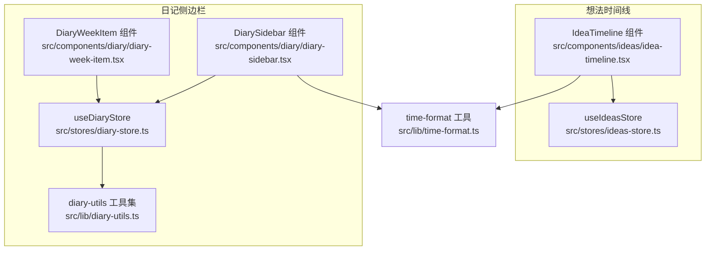
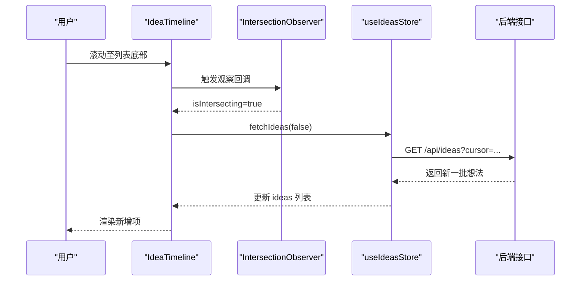
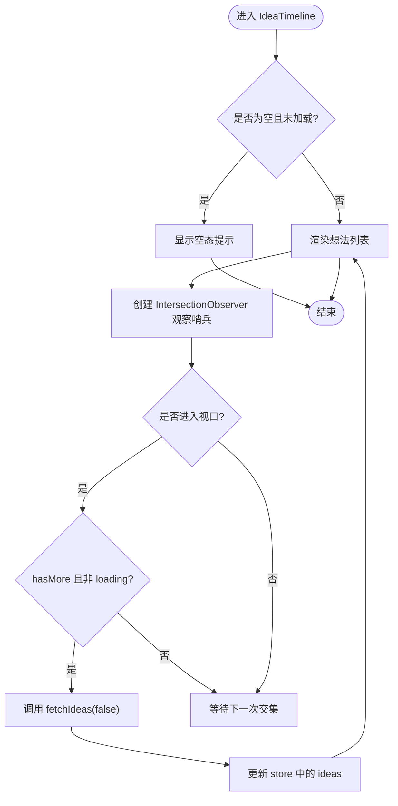
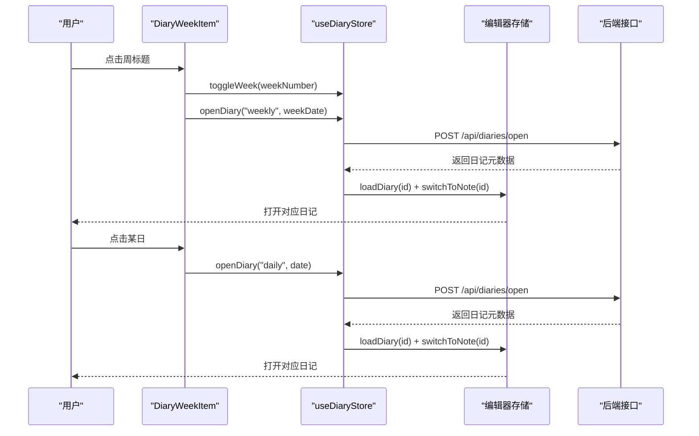
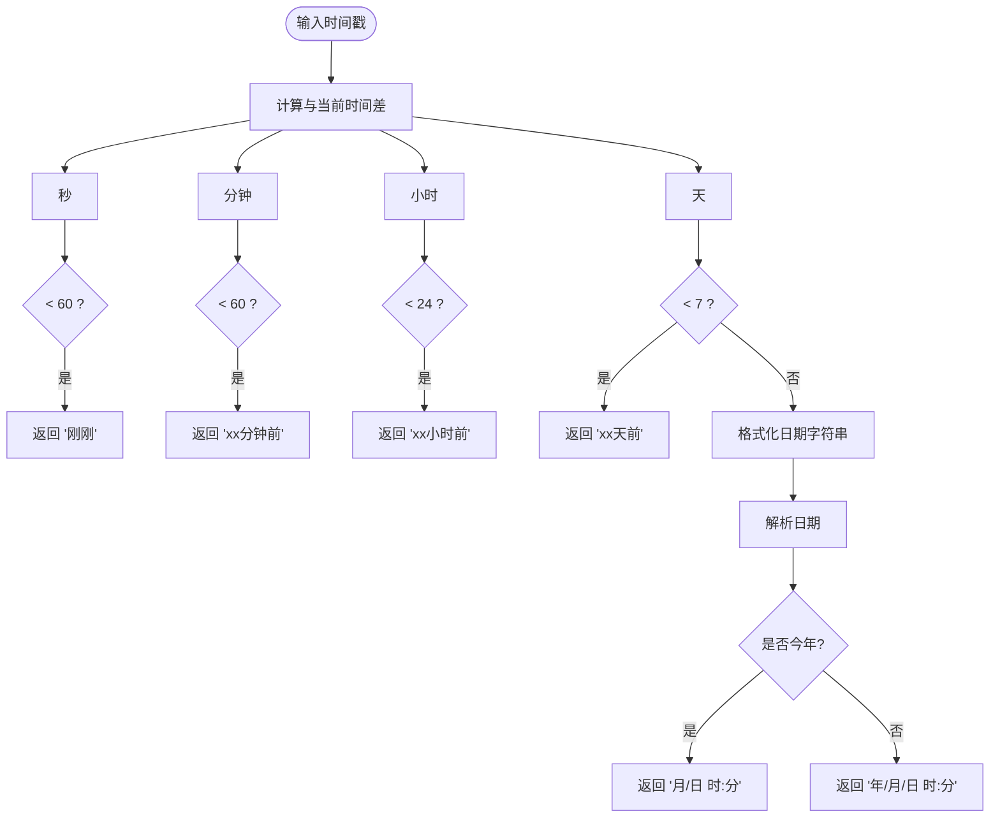
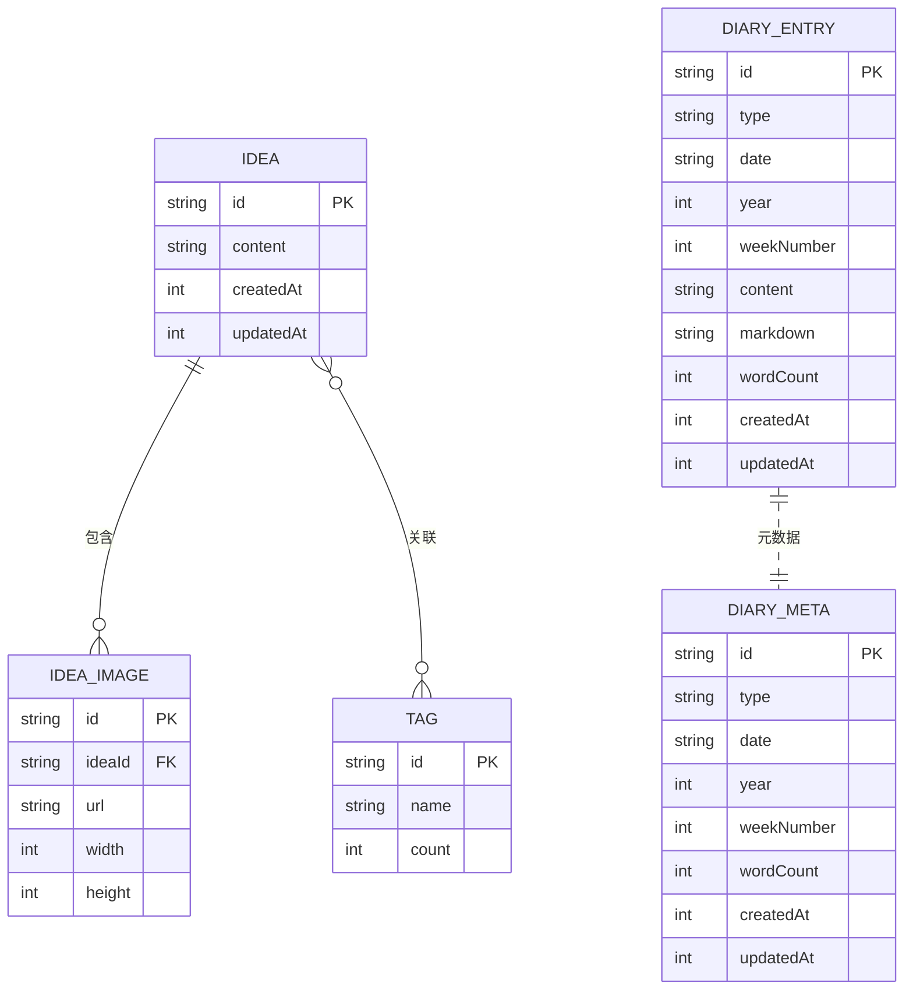
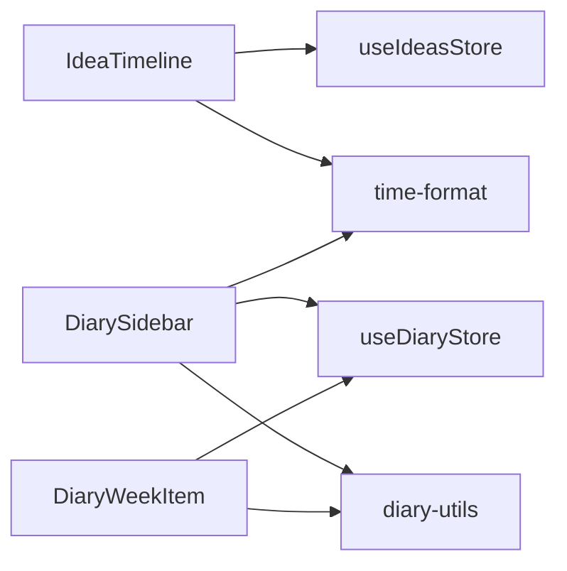

# 时间线展示

<cite>
**本文引用的文件**
- [idea-timeline.tsx](file://src/components/ideas/idea-timeline.tsx)
- [time-format.ts](file://src/lib/time-format.ts)
- [diary-sidebar.tsx](file://src/components/diary/diary-sidebar.tsx)
- [diary-week-item.tsx](file://src/components/diary/diary-week-item.tsx)
- [diary-store.ts](file://src/stores/diary-store.ts)
- [ideas-store.ts](file://src/stores/ideas-store.ts)
- [diary-utils.ts](file://src/lib/diary-utils.ts)
- [index.ts](file://src/types/index.ts)
</cite>

## 目录
1. [简介](#简介)
2. [项目结构](#项目结构)
3. [核心组件](#核心组件)
4. [架构总览](#架构总览)
5. [组件详解](#组件详解)
6. [依赖关系分析](#依赖关系分析)
7. [性能考量](#性能考量)
8. [故障排查指南](#故障排查指南)
9. [结论](#结论)
10. [附录](#附录)

## 简介
本文件系统性地文档化“时间线展示”能力，覆盖以下方面：
- 渲染机制：按时间排序与日期分组（周/日维度）
- 时间格式化：相对时间与本地化显示
- 交互功能：点击跳转、滚动定位、视口检测
- 性能优化：虚拟滚动与懒加载策略
- 自定义选项：样式与行为配置
- 数据结构与渲染算法
- 用户体验与无障碍支持建议

## 项目结构
时间线相关实现主要分布在三处：
- 想法时间线：基于 IntersectionObserver 的无限滚动
- 日记侧边栏：按周/日分组展示，并支持展开/收起与跳转
- 时间格式化：统一的相对时间与本地化日期格式

图表来源
- [idea-timeline.tsx:1-69](file://src/components/ideas/idea-timeline.tsx#L1-L69)
- [ideas-store.ts:1-126](file://src/stores/ideas-store.ts#L1-L126)
- [diary-sidebar.tsx:1-116](file://src/components/diary/diary-sidebar.tsx#L1-L116)
- [diary-week-item.tsx:1-122](file://src/components/diary/diary-week-item.tsx#L1-L122)
- [diary-store.ts:1-234](file://src/stores/diary-store.ts#L1-L234)
- [diary-utils.ts:1-113](file://src/lib/diary-utils.ts#L1-L113)
- [time-format.ts:1-27](file://src/lib/time-format.ts#L1-L27)

章节来源
- [idea-timeline.tsx:1-69](file://src/components/ideas/idea-timeline.tsx#L1-L69)
- [diary-sidebar.tsx:1-116](file://src/components/diary/diary-sidebar.tsx#L1-L116)
- [diary-week-item.tsx:1-122](file://src/components/diary/diary-week-item.tsx#L1-L122)
- [diary-store.ts:1-234](file://src/stores/diary-store.ts#L1-L234)
- [ideas-store.ts:1-126](file://src/stores/ideas-store.ts#L1-L126)
- [diary-utils.ts:1-113](file://src/lib/diary-utils.ts#L1-L113)
- [time-format.ts:1-27](file://src/lib/time-format.ts#L1-L27)

## 核心组件
- 想法时间线（IdeaTimeline）：负责渲染想法列表，使用 IntersectionObserver 实现“触底加载更多”，支持空态与加载态提示。
- 日记侧边栏（DiarySidebar + DiaryWeekItem）：按年/周/日分组展示日记条目，支持当前周自动展开与今日高亮，点击可打开对应日记。
- 时间格式化（time-format）：提供相对时间与本地化日期字符串输出。
- 存储层（Zustand）：useIdeasStore 与 useDiaryStore 提供数据状态、分页/分组逻辑与异步加载。

章节来源
- [idea-timeline.tsx:8-68](file://src/components/ideas/idea-timeline.tsx#L8-L68)
- [diary-sidebar.tsx:9-115](file://src/components/diary/diary-sidebar.tsx#L9-L115)
- [diary-week-item.tsx:17-121](file://src/components/diary/diary-week-item.tsx#L17-L121)
- [time-format.ts:1-27](file://src/lib/time-format.ts#L1-L27)
- [ideas-store.ts:20-59](file://src/stores/ideas-store.ts#L20-L59)
- [diary-store.ts:40-232](file://src/stores/diary-store.ts#L40-L232)

## 架构总览
时间线渲染采用“存储驱动 + 组件渲染”的模式：
- 存储层负责数据获取、分页与分组
- 组件通过订阅存储状态进行渲染
- 交互事件触发存储更新，进而影响渲染

图表来源
- [idea-timeline.tsx:15-35](file://src/components/ideas/idea-timeline.tsx#L15-L35)
- [ideas-store.ts:29-59](file://src/stores/ideas-store.ts#L29-L59)

## 组件详解

### 想法时间线（IdeaTimeline）
- 渲染逻辑
  - 基于 useIdeasStore 的 ideas 数组逐项渲染 IdeaCard
  - 使用 ref 作为“哨兵节点”，通过 IntersectionObserver 在接近可视区域时触发加载
- 交互与行为
  - 触底加载：rootMargin 预加载 margin 为 200px，提升感知流畅度
  - 空态与加载态：无数据时显示提示；loading 时显示旋转指示器
  - 结束态：hasMore=false 且存在数据时显示“没有更多了”
- 可扩展点
  - 支持重置加载（reset）与标签筛选（selectedTagId）
  - 可替换 IdeaCard 以适配不同卡片样式

图表来源
- [idea-timeline.tsx:15-35](file://src/components/ideas/idea-timeline.tsx#L15-L35)
- [ideas-store.ts:29-59](file://src/stores/ideas-store.ts#L29-L59)

章节来源
- [idea-timeline.tsx:8-68](file://src/components/ideas/idea-timeline.tsx#L8-L68)
- [ideas-store.ts:20-59](file://src/stores/ideas-store.ts#L20-L59)

### 日记侧边栏（DiarySidebar + DiaryWeekItem）
- 分组与排序
  - 按 weekNumber 聚合 weekly 与 daily 条目
  - weekly 与 daily 内部按日期降序排列（最新在前）
  - 当前周显示从周一到“今天”的所有日期；历史周仅显示已有条目的日期
- 展开/收起与跳转
  - 点击周标题切换 expandedWeeks
  - 点击周标题打开该周的 weekly 条目
  - 点击具体日期打开该日 daily 条目
- 交互细节
  - 当前周自动展开
  - 今日日期以特殊标记高亮
  - 未保存内容时弹出确认对话框，确保保存后再执行跳转

图表来源
- [diary-week-item.tsx:38-46](file://src/components/diary/diary-week-item.tsx#L38-L46)
- [diary-store.ts:102-142](file://src/stores/diary-store.ts#L102-L142)

章节来源
- [diary-sidebar.tsx:17-61](file://src/components/diary/diary-sidebar.tsx#L17-L61)
- [diary-week-item.tsx:17-121](file://src/components/diary/diary-week-item.tsx#L17-L121)
- [diary-store.ts:187-232](file://src/stores/diary-store.ts#L187-L232)
- [diary-utils.ts:67-91](file://src/lib/diary-utils.ts#L67-L91)

### 时间格式化（time-format）
- 相对时间：根据当前时间与目标时间差，输出“刚刚/xx分钟前/xx小时前/xx天前”
- 本地化日期：若同年内，输出“月/日 时:分”；否则输出“年/月/日 时:分”

图表来源
- [time-format.ts:1-27](file://src/lib/time-format.ts#L1-L27)

章节来源
- [time-format.ts:1-27](file://src/lib/time-format.ts#L1-L27)

### 数据结构与渲染算法
- 想法（Idea）与标签（Tag）模型
  - Idea 包含 id、content、tags、images、createdAt、updatedAt
  - Tag 包含 id、name、count
- 日记（DiaryEntry/DiaryMeta）
  - DiaryEntry 含 content/markdown
  - DiaryMeta 为 DiaryEntry 的元数据（不含正文）
- 渲染算法要点
  - 想法时间线：按 createdAt 顺序追加（或重置），支持游标分页
  - 日记侧边栏：按 weekNumber 聚合 weekly/daily，每日按日期降序

图表来源
- [index.ts:43-74](file://src/types/index.ts#L43-L74)

章节来源
- [index.ts:43-74](file://src/types/index.ts#L43-L74)

## 依赖关系分析
- 组件与存储
  - IdeaTimeline 依赖 useIdeasStore 的 ideas、loading、hasMore、fetchIdeas
  - DiarySidebar/WeekItem 依赖 useDiaryStore 的 selectedYear、expandedWeeks、diaryEntries、toggleWeek、openDiary
- 工具函数
  - 日记侧边栏使用 diary-utils 进行周/日标签生成与当前周判断
  - 通用时间格式化由 time-format 提供

图表来源
- [idea-timeline.tsx:8-13](file://src/components/ideas/idea-timeline.tsx#L8-L13)
- [diary-sidebar.tsx:3-6](file://src/components/diary/diary-sidebar.tsx#L3-L6)
- [diary-week-item.tsx:3-11](file://src/components/diary/diary-week-item.tsx#L3-L11)
- [diary-store.ts:1-10](file://src/stores/diary-store.ts#L1-L10)
- [ideas-store.ts:1-3](file://src/stores/ideas-store.ts#L1-L3)
- [diary-utils.ts:1-12](file://src/lib/diary-utils.ts#L1-L12)
- [time-format.ts:1-27](file://src/lib/time-format.ts#L1-L27)

章节来源
- [idea-timeline.tsx:8-13](file://src/components/ideas/idea-timeline.tsx#L8-L13)
- [diary-sidebar.tsx:3-6](file://src/components/diary/diary-sidebar.tsx#L3-L6)
- [diary-week-item.tsx:3-11](file://src/components/diary/diary-week-item.tsx#L3-L11)
- [diary-store.ts:1-10](file://src/stores/diary-store.ts#L1-L10)
- [ideas-store.ts:1-3](file://src/stores/ideas-store.ts#L1-L3)
- [diary-utils.ts:1-12](file://src/lib/diary-utils.ts#L1-L12)
- [time-format.ts:1-27](file://src/lib/time-format.ts#L1-L27)

## 性能考量
- 想法时间线
  - 无限滚动：通过 IntersectionObserver 在接近底部时触发加载，减少一次性渲染大量节点
  - 防抖与幂等：fetchIdeas 内部检查 loading 状态，避免重复请求
  - 渐进式加载：游标分页（cursor）避免全量刷新
- 日记侧边栏
  - useMemo 缓存周分组计算，避免每次渲染都重新聚合
  - 当前周预渲染“至今日”的完整日期序列，历史周仅渲染已存在的日期
- 通用建议
  - 若数据量进一步增大，可引入虚拟滚动（例如 react-window 或类似方案）以限制 DOM 节点数量
  - 对时间格式化可做缓存（如 LRU），减少重复格式化开销
  - 图片懒加载：IdeaImage 可结合 loading="lazy" 与占位骨架图优化首屏

章节来源
- [idea-timeline.tsx:15-35](file://src/components/ideas/idea-timeline.tsx#L15-L35)
- [ideas-store.ts:29-59](file://src/stores/ideas-store.ts#L29-L59)
- [diary-sidebar.tsx:17-61](file://src/components/diary/diary-sidebar.tsx#L17-L61)
- [diary-store.ts:187-232](file://src/stores/diary-store.ts#L187-L232)

## 故障排查指南
- 想法时间线无数据
  - 检查 hasMore 与 loading 状态，确认接口返回与 store 更新流程
  - 确认哨兵节点是否正确挂载与观察
- 无法触底加载
  - 检查 rootMargin 设置与容器滚动高度
  - 确认 IntersectionObserver 回调中 hasMore 与 loading 的判断
- 日记侧边栏不显示
  - 确认 selectedYear 与 expandedWeeks 是否正确初始化
  - 检查 getWeekDaysUpToToday 的边界条件（未来周应返回空数组）
- 跳转失败或未保存提醒频繁
  - 确保保存状态（saveStatus）与确认对话框逻辑正常
  - 检查 openDiary 的网络请求与编辑器切换流程

章节来源
- [idea-timeline.tsx:15-35](file://src/components/ideas/idea-timeline.tsx#L15-L35)
- [ideas-store.ts:29-59](file://src/stores/ideas-store.ts#L29-L59)
- [diary-sidebar.tsx:17-61](file://src/components/diary/diary-sidebar.tsx#L17-L61)
- [diary-week-item.tsx:27-36](file://src/components/diary/diary-week-item.tsx#L27-L36)
- [diary-store.ts:69-82](file://src/stores/diary-store.ts#L69-L82)

## 结论
本项目的时间线展示以“存储驱动 + 组件渲染”为核心，分别在“想法时间线”和“日记侧边栏”场景中实现了：
- 按时间排序与日期分组
- 相对时间与本地化日期格式化
- 交互跳转、滚动定位与视口检测
- 通过懒加载与缓存优化的性能策略
建议后续在超大数据量场景引入虚拟滚动，并完善无障碍与主题化定制能力。

## 附录

### 自定义选项与行为配置
- 想法时间线
  - 样式：通过容器类名与子组件样式覆盖
  - 行为：可调整 rootMargin、哨兵尺寸与加载文案
- 日记侧边栏
  - 样式：高亮今日、展开/收起图标、周标题样式
  - 行为：当前周自动展开、未保存提醒、打开日记后的编辑器切换

章节来源
- [idea-timeline.tsx:46-67](file://src/components/ideas/idea-timeline.tsx#L46-L67)
- [diary-sidebar.tsx:65-115](file://src/components/diary/diary-sidebar.tsx#L65-L115)
- [diary-week-item.tsx:50-99](file://src/components/diary/diary-week-item.tsx#L50-L99)

### 无障碍与用户体验建议
- 为“空态”“加载态”“结束态”提供语义化标签与屏幕阅读器友好文本
- 为“跳转按钮”提供明确的 ARIA-label（如“打开本周日记”“打开某日日记”）
- 为“今日高亮”提供视觉与语义双重提示
- 为“未保存提醒”对话框提供键盘可访问性与 ESC 关闭

[本节为通用建议，无需特定文件引用]