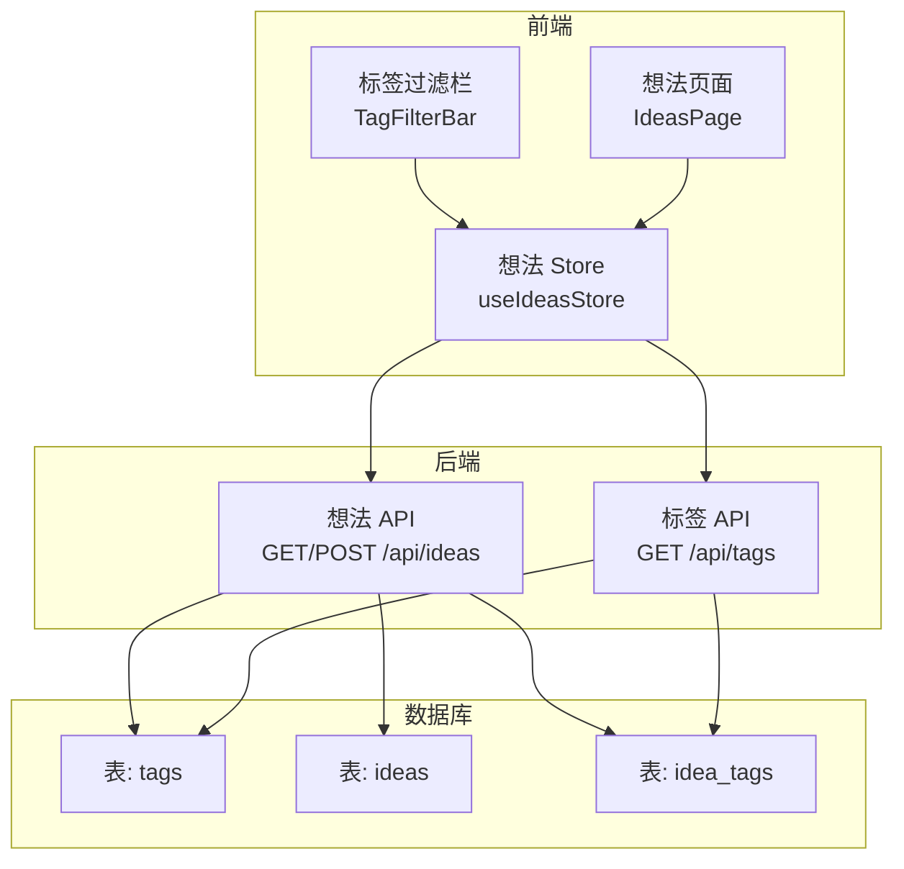
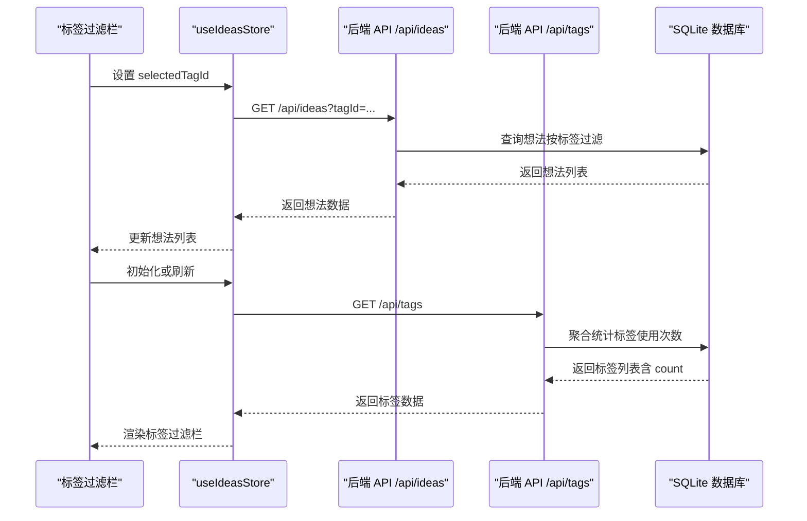
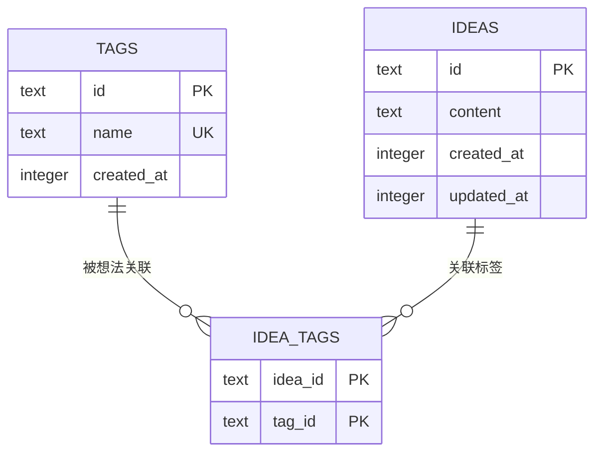
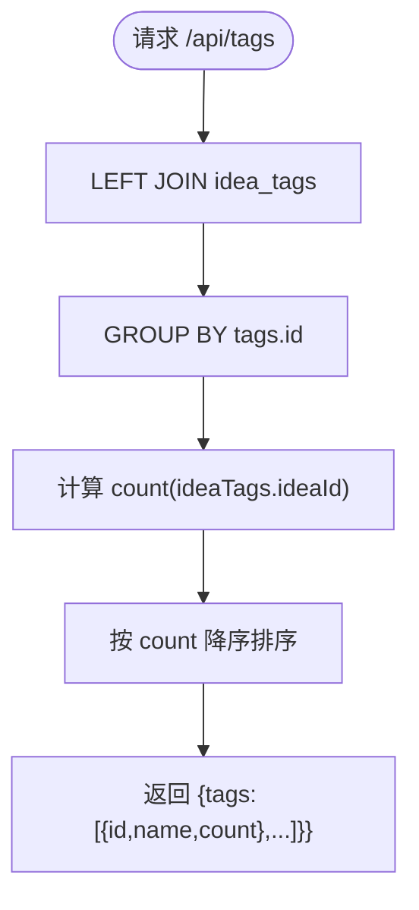
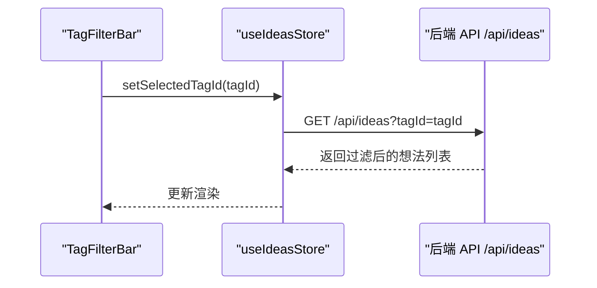
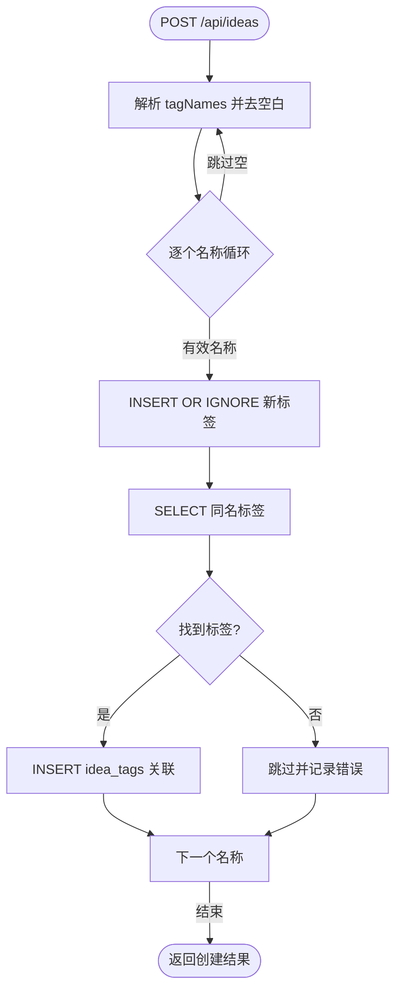
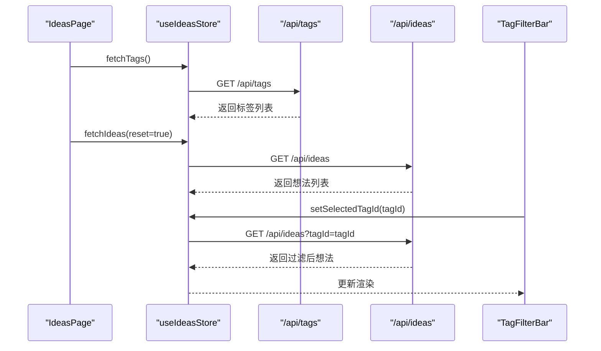
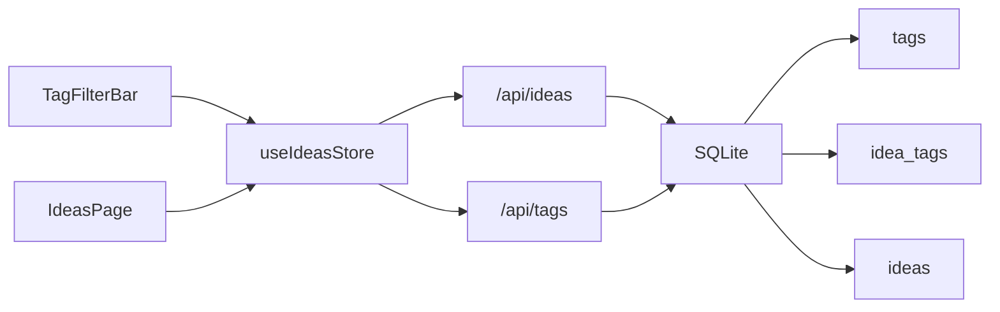

# 标签系统

<cite>
**本文引用的文件**
- [src/app/api/tags/route.ts](file://src/app/api/tags/route.ts)
- [src/app/api/ideas/route.ts](file://src/app/api/ideas/route.ts)
- [src/db/schema.ts](file://src/db/schema.ts)
- [src/db/index.ts](file://src/db/index.ts)
- [src/stores/ideas-store.ts](file://src/stores/ideas-store.ts)
- [src/components/ideas/tag-filter-bar.tsx](file://src/components/ideas/tag-filter-bar.tsx)
- [src/components/ideas/ideas-page.tsx](file://src/components/ideas/ideas-page.tsx)
- [src/types/index.ts](file://src/types/index.ts)
- [src/components/ui/inline-combobox.tsx](file://src/components/ui/inline-combobox.tsx)
- [src/components/editor/plugins/mention-kit.tsx](file://src/components/editor/plugins/mention-kit.tsx)
</cite>

## 目录
1. [简介](#简介)
2. [项目结构](#项目结构)
3. [核心组件](#核心组件)
4. [架构总览](#架构总览)
5. [详细组件分析](#详细组件分析)
6. [依赖分析](#依赖分析)
7. [性能考虑](#性能考虑)
8. [故障排查指南](#故障排查指南)
9. [结论](#结论)
10. [附录](#附录)

## 简介
本文件系统性地文档化了 ynote-v2 中“标签系统”的设计与实现，涵盖标签的创建、管理、过滤机制，标签去重与自动创建，标签与想法（ideas）的多对多关联关系及中间表设计，标签统计与热门标签展示，以及标签在界面中的使用示例（标签过滤栏）。同时补充了标签搜索与自动完成的实现思路，并给出最佳实践与性能优化建议。

## 项目结构
标签系统涉及以下关键模块：
- 数据层：SQLite 表定义与索引（标签表、想法-标签中间表）
- 后端 API：标签列表查询、想法创建时的标签自动创建与关联
- 前端状态：Zustand Store 管理想法与标签数据、过滤状态
- 前端 UI：标签过滤栏组件，用于按标签筛选想法
- 类型定义：Tag、Idea 等接口定义

图表来源
- [src/components/ideas/tag-filter-bar.tsx:1-52](file://src/components/ideas/tag-filter-bar.tsx#L1-L52)
- [src/components/ideas/ideas-page.tsx:1-43](file://src/components/ideas/ideas-page.tsx#L1-L43)
- [src/stores/ideas-store.ts:1-126](file://src/stores/ideas-store.ts#L1-L126)
- [src/app/api/ideas/route.ts:1-120](file://src/app/api/ideas/route.ts#L1-L120)
- [src/app/api/tags/route.ts:1-28](file://src/app/api/tags/route.ts#L1-L28)
- [src/db/schema.ts:78-91](file://src/db/schema.ts#L78-L91)

章节来源
- [src/components/ideas/tag-filter-bar.tsx:1-52](file://src/components/ideas/tag-filter-bar.tsx#L1-L52)
- [src/components/ideas/ideas-page.tsx:1-43](file://src/components/ideas/ideas-page.tsx#L1-L43)
- [src/stores/ideas-store.ts:1-126](file://src/stores/ideas-store.ts#L1-L126)
- [src/app/api/ideas/route.ts:1-120](file://src/app/api/ideas/route.ts#L1-L120)
- [src/app/api/tags/route.ts:1-28](file://src/app/api/tags/route.ts#L1-L28)
- [src/db/schema.ts:78-91](file://src/db/schema.ts#L78-L91)

## 核心组件
- 标签模型与类型
  - 标签实体：包含 id、name、createdAt；name 唯一约束
  - 想法-标签中间表：idea_id、tag_id，联合主键保证唯一关联
  - Tag 接口：前端类型定义包含 id、name、可选 count 字段
- 标签 API
  - GET /api/tags：按使用次数降序返回标签列表（含 count）
- 想法 API
  - POST /api/ideas：创建想法时自动去重并创建标签，再建立关联
  - GET /api/ideas：支持按 tagId 过滤
- 前端 Store
  - 维护 tags 列表、selectedTagId、加载状态等
  - 提供 fetchTags、fetchIdeas、createIdea、updateIdea、deleteIdea 等方法
- 标签过滤 UI
  - TagFilterBar：渲染标签按钮，点击切换 selectedTagId，触发重新拉取想法

章节来源
- [src/db/schema.ts:78-91](file://src/db/schema.ts#L78-L91)
- [src/types/index.ts:37-50](file://src/types/index.ts#L37-L50)
- [src/app/api/tags/route.ts:6-27](file://src/app/api/tags/route.ts#L6-L27)
- [src/app/api/ideas/route.ts:7-41](file://src/app/api/ideas/route.ts#L7-L41)
- [src/stores/ideas-store.ts:61-71](file://src/stores/ideas-store.ts#L61-L71)
- [src/components/ideas/tag-filter-bar.tsx:6-15](file://src/components/ideas/tag-filter-bar.tsx#L6-L15)

## 架构总览
标签系统采用“前端状态 + 后端 API + SQLite 数据库”的三层架构：
- 前端通过 Store 发起请求，更新本地状态
- 后端 API 使用 Drizzle ORM 访问 SQLite，执行查询与写入
- 数据库层面通过唯一约束与索引保障一致性与性能

图表来源
- [src/components/ideas/tag-filter-bar.tsx:12-15](file://src/components/ideas/tag-filter-bar.tsx#L12-L15)
- [src/stores/ideas-store.ts:29-59](file://src/stores/ideas-store.ts#L29-L59)
- [src/app/api/ideas/route.ts:17-35](file://src/app/api/ideas/route.ts#L17-L35)
- [src/app/api/tags/route.ts:10-20](file://src/app/api/tags/route.ts#L10-L20)

## 详细组件分析

### 数据模型与中间表设计
- 标签表（tags）
  - 主键：id
  - 唯一约束：name
  - 字段：id、name、createdAt
- 想法表（ideas）
  - 主键：id
  - 字段：id、content、createdAt、updatedAt
- 中间表（idea_tags）
  - 复合主键：(idea_id, tag_id)
  - 外键约束：引用 ideas(id)、tags(id)，删除级联
- 索引
  - idea_tags 上存在针对 idea_id 与 tag_id 的索引，提升关联查询效率

图表来源
- [src/db/schema.ts:78-91](file://src/db/schema.ts#L78-L91)
- [src/db/index.ts:104-112](file://src/db/index.ts#L104-L112)

章节来源
- [src/db/schema.ts:78-91](file://src/db/schema.ts#L78-L91)
- [src/db/index.ts:104-112](file://src/db/index.ts#L104-L112)

### 标签统计与热门标签展示
- 后端统计逻辑
  - 通过 LEFT JOIN idea_tags，按 tags.id 分组，统计每个标签被使用的次数
  - 按使用次数降序排序，返回标签列表
- 前端展示
  - TagFilterBar 渲染标签名与使用计数（当 count 存在时）

图表来源
- [src/app/api/tags/route.ts:10-20](file://src/app/api/tags/route.ts#L10-L20)
- [src/components/ideas/tag-filter-bar.tsx:44-46](file://src/components/ideas/tag-filter-bar.tsx#L44-L46)

章节来源
- [src/app/api/tags/route.ts:6-27](file://src/app/api/tags/route.ts#L6-L27)
- [src/components/ideas/tag-filter-bar.tsx:44-46](file://src/components/ideas/tag-filter-bar.tsx#L44-L46)

### 标签过滤机制（按标签筛选与组合过滤）
- 单标签筛选
  - Store 在 fetchIdeas 时根据 selectedTagId 构造查询参数 tagId
  - 后端 API 使用 INNER JOIN idea_tags 过滤仅包含该标签的想法
- 组合过滤
  - 当前实现为单标签筛选；如需多标签组合，可在前端 Store 扩展 selectedTagIds 列表，并在后端 API 支持多 tagId 过滤（当前未实现）
- 无筛选
  - selectedTagId 为 null 时，返回全部想法

图表来源
- [src/components/ideas/tag-filter-bar.tsx:12-15](file://src/components/ideas/tag-filter-bar.tsx#L12-L15)
- [src/stores/ideas-store.ts:36-42](file://src/stores/ideas-store.ts#L36-L42)
- [src/app/api/ideas/route.ts:17-35](file://src/app/api/ideas/route.ts#L17-L35)

章节来源
- [src/stores/ideas-store.ts:29-59](file://src/stores/ideas-store.ts#L29-L59)
- [src/app/api/ideas/route.ts:17-35](file://src/app/api/ideas/route.ts#L17-L35)
- [src/components/ideas/tag-filter-bar.tsx:12-15](file://src/components/ideas/tag-filter-bar.tsx#L12-L15)

### 标签去重与自动创建
- 去重策略
  - tags.name 唯一约束，插入时使用 INSERT OR IGNORE 避免重复
- 自动创建流程
  - 创建想法时，遍历 tagNames，对每个非空且去除首尾空白的名称：
    - 生成新 tagId
    - INSERT OR IGNORE 新标签
    - 查询刚插入的标签（或已存在的同名标签）
    - 将 (idea_id, tag_id) 写入中间表
- 结果
  - 同名标签不会重复创建，想法与标签建立唯一关联

图表来源
- [src/app/api/ideas/route.ts:102-117](file://src/app/api/ideas/route.ts#L102-L117)

章节来源
- [src/app/api/ideas/route.ts:102-117](file://src/app/api/ideas/route.ts#L102-L117)

### 标签与想法的多对多关系与查询优化
- 关系说明
  - 多个想法可拥有多个标签，一个标签可被多个想法使用
  - 通过中间表 idea_tags 实现多对多
- 查询优化
  - idea_tags 上存在针对 idea_id 与 tag_id 的索引，支持：
    - 按标签过滤（INNER JOIN + WHERE tagId）
    - 按想法查询其标签（LEFT JOIN）
  - 标签统计使用 LEFT JOIN + GROUP BY + ORDER BY，配合索引提升性能

章节来源
- [src/db/index.ts:110-112](file://src/db/index.ts#L110-L112)
- [src/app/api/ideas/route.ts:17-35](file://src/app/api/ideas/route.ts#L17-L35)
- [src/app/api/tags/route.ts:10-20](file://src/app/api/tags/route.ts#L10-L20)

### 标签组件使用示例（标签选择器与过滤栏）
- 标签过滤栏（TagFilterBar）
  - 渲染所有标签，显示名称与使用计数
  - 点击标签设置 selectedTagId，触发 Store 重新拉取想法
  - 点击“全部”清除筛选
- 想法页面（IdeasPage）
  - 初始化时拉取标签与想法
  - selectedTagId 变化时重新拉取想法

图表来源
- [src/components/ideas/ideas-page.tsx:14-23](file://src/components/ideas/ideas-page.tsx#L14-L23)
- [src/stores/ideas-store.ts:61-71](file://src/stores/ideas-store.ts#L61-L71)
- [src/components/ideas/tag-filter-bar.tsx:12-15](file://src/components/ideas/tag-filter-bar.tsx#L12-L15)

章节来源
- [src/components/ideas/ideas-page.tsx:1-43](file://src/components/ideas/ideas-page.tsx#L1-L43)
- [src/components/ideas/tag-filter-bar.tsx:1-52](file://src/components/ideas/tag-filter-bar.tsx#L1-L52)
- [src/stores/ideas-store.ts:61-71](file://src/stores/ideas-store.ts#L61-L71)

### 标签搜索与自动完成（实现思路）
- 现状
  - 当前未发现专门的“标签搜索/自动完成”组件或 API
- 建议实现路径
  - 前端：基于通用组合框组件（如 inline-combobox）构建标签输入
  - 后端：提供 /api/tags/search?q=xxx 或 /api/tags/suggest?q=xxx
  - 数据库：对 tags.name 建立索引以支持模糊匹配（当前未见相关 SQL）
- 与编辑器集成
  - 可参考 mention-kit 的实现方式，在编辑器中通过触发符（如“#”）唤起标签自动完成

章节来源
- [src/components/ui/inline-combobox.tsx:56-210](file://src/components/ui/inline-combobox.tsx#L56-L210)
- [src/components/editor/plugins/mention-kit.tsx:1-18](file://src/components/editor/plugins/mention-kit.tsx#L1-L18)

## 依赖分析
- 组件耦合
  - TagFilterBar 依赖 useIdeasStore 的 tags、selectedTagId、setSelectedTagId、fetchIdeas
  - IdeasPage 依赖 useIdeasStore 的 fetchTags、fetchIdeas，并监听 selectedTagId 变化
  - useIdeasStore 依赖 /api/ideas 与 /api/tags
- 数据依赖
  - idea_tags 依赖 tags 与 ideas 的外键
  - 标签统计依赖 idea_tags 的存在

图表来源
- [src/components/ideas/tag-filter-bar.tsx:3-10](file://src/components/ideas/tag-filter-bar.tsx#L3-L10)
- [src/components/ideas/ideas-page.tsx:3-12](file://src/components/ideas/ideas-page.tsx#L3-L12)
- [src/stores/ideas-store.ts:13-17](file://src/stores/ideas-store.ts#L13-L17)
- [src/app/api/ideas/route.ts:1-6](file://src/app/api/ideas/route.ts#L1-L6)
- [src/app/api/tags/route.ts:1-4](file://src/app/api/tags/route.ts#L1-L4)

章节来源
- [src/components/ideas/tag-filter-bar.tsx:3-10](file://src/components/ideas/tag-filter-bar.tsx#L3-L10)
- [src/components/ideas/ideas-page.tsx:3-12](file://src/components/ideas/ideas-page.tsx#L3-L12)
- [src/stores/ideas-store.ts:13-17](file://src/stores/ideas-store.ts#L13-L17)
- [src/app/api/ideas/route.ts:1-6](file://src/app/api/ideas/route.ts#L1-L6)
- [src/app/api/tags/route.ts:1-4](file://src/app/api/tags/route.ts#L1-L4)

## 性能考虑
- 索引优化
  - idea_tags 已有针对 idea_id 与 tag_id 的索引，有助于：
    - 按标签筛选想法（INNER JOIN + WHERE）
    - 统计标签使用次数（LEFT JOIN + GROUP BY）
- 查询优化建议
  - 标签统计：当前使用 LEFT JOIN + GROUP BY + ORDER BY，建议确保 tags.name 与 idea_tags 上的索引生效
  - 想法分页：GET /api/ideas 支持 cursor 与 limit，避免全量扫描
- 前端缓存与刷新
  - Store 在创建/更新/删除想法后主动刷新标签列表，保持统计准确性
- 建议
  - 如需多标签组合过滤，可在后端增加多 tagId 条件与相应索引
  - 如需标签搜索/自动完成，建议添加 tags.name 的模糊匹配索引与专用 API

[本节为通用性能讨论，不直接分析具体文件]

## 故障排查指南
- 标签统计异常
  - 确认 idea_tags 是否存在对应记录
  - 检查 tags.name 唯一约束是否被破坏
- 标签过滤无效
  - 确认 selectedTagId 是否正确传入 /api/ideas?tagId
  - 检查 idea_tags 索引是否存在
- 标签自动创建失败
  - 检查 INSERT OR IGNORE 是否执行成功
  - 确认 SELECT 查询能返回同名标签
- 前端不刷新
  - 确认 Store 的 fetchTags 是否被调用
  - 检查网络请求是否返回 200

章节来源
- [src/app/api/tags/route.ts:23-26](file://src/app/api/tags/route.ts#L23-L26)
- [src/app/api/ideas/route.ts:102-117](file://src/app/api/ideas/route.ts#L102-L117)
- [src/stores/ideas-store.ts:83-84](file://src/stores/ideas-store.ts#L83-L84)

## 结论
标签系统通过“唯一标签名 + 中间表 + 统计查询”的设计，实现了标签的去重、自动创建与高效统计。前端通过 Store 与 UI 组件实现标签筛选与热门标签展示，整体架构清晰、扩展性强。后续可在多标签组合过滤、标签搜索/自动完成等方面进一步增强体验与性能。

[本节为总结性内容，不直接分析具体文件]

## 附录

### API 定义概览
- GET /api/tags
  - 功能：返回标签列表，包含使用次数
  - 参数：无
  - 返回：{ tags: [{ id, name, count }] }
- GET /api/ideas
  - 功能：获取想法列表，支持按标签筛选与分页
  - 参数：tagId（可选）、cursor（可选）、limit（默认20，最大50）
  - 返回：{ ideas: [...], hasMore: boolean }
- POST /api/ideas
  - 功能：创建想法，自动去重并创建标签，建立关联
  - 请求体：{ content, tagNames: string[], imageIds: string[] }
  - 返回：新建想法对象

章节来源
- [src/app/api/tags/route.ts:6-27](file://src/app/api/tags/route.ts#L6-L27)
- [src/app/api/ideas/route.ts:7-41](file://src/app/api/ideas/route.ts#L7-L41)
- [src/app/api/ideas/route.ts:92-117](file://src/app/api/ideas/route.ts#L92-L117)

### 最佳实践与建议
- 标签命名规范
  - 建议统一大小写与空白处理，减少重复
- 查询与索引
  - 保持 idea_tags 索引完整，必要时为 tags.name 添加模糊匹配索引
- 前端交互
  - 在创建/更新/删除想法后及时刷新标签统计，确保 UI 与数据一致
- 扩展方向
  - 多标签组合过滤
  - 标签搜索/自动完成
  - 标签云展示与热门标签推荐

[本节为通用建议，不直接分析具体文件]