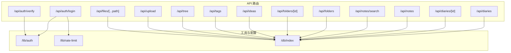
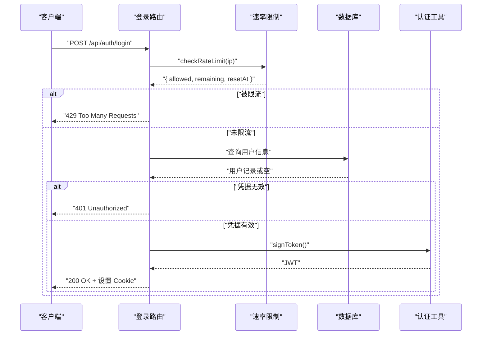
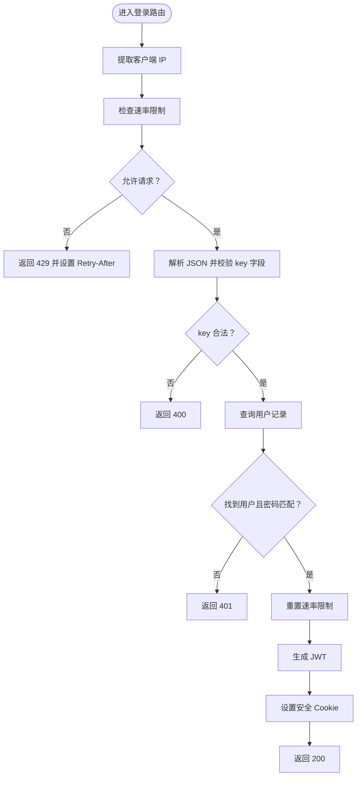
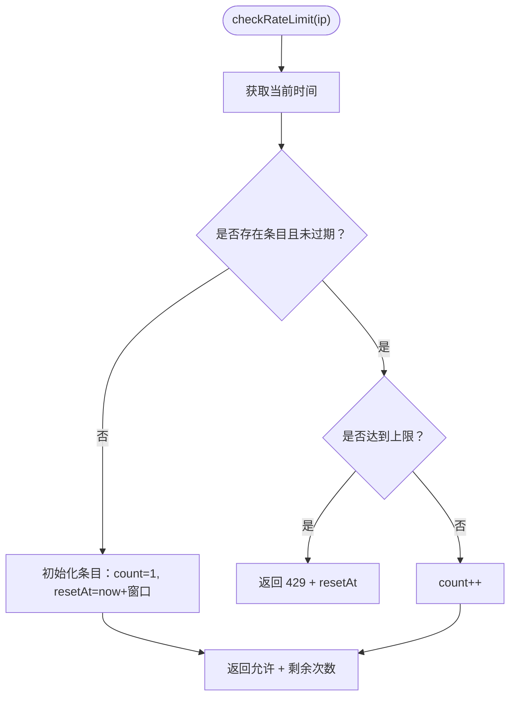
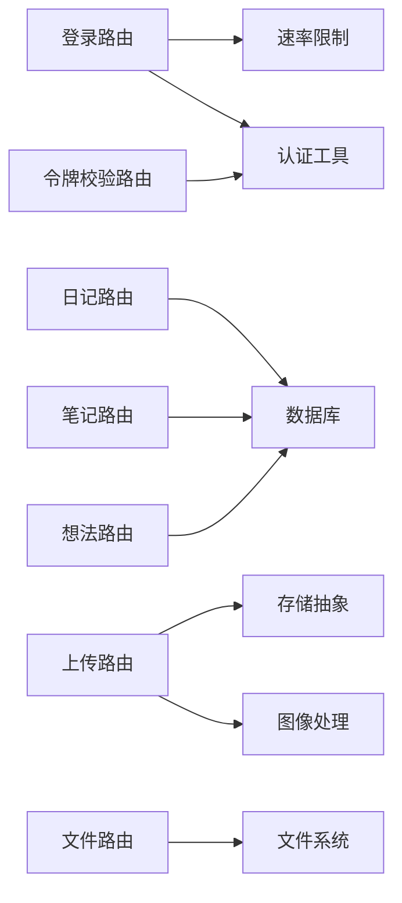

# API 错误

<cite>
**本文引用的文件**
- [src/app/api/auth/login/route.ts](file://src/app/api/auth/login/route.ts)
- [src/app/api/auth/verify/route.ts](file://src/app/api/auth/verify/route.ts)
- [src/lib/auth.ts](file://src/lib/auth.ts)
- [src/lib/rate-limit.ts](file://src/lib/rate-limit.ts)
- [src/app/api/diaries/route.ts](file://src/app/api/diaries/route.ts)
- [src/app/api/diaries/[id]/route.ts](file://src/app/api/diaries/[id]/route.ts)
- [src/app/api/files/[...path]/route.ts](file://src/app/api/files/[...path]/route.ts)
- [src/app/api/notes/route.ts](file://src/app/api/notes/route.ts)
- [src/app/api/notes/search/route.ts](file://src/app/api/notes/search/route.ts)
- [src/app/api/folders/route.ts](file://src/app/api/folders/route.ts)
- [src/app/api/folders/[id]/route.ts](file://src/app/api/folders/[id]/route.ts)
- [src/app/api/ideas/route.ts](file://src/app/api/ideas/route.ts)
- [src/app/api/tags/route.ts](file://src/app/api/tags/route.ts)
- [src/app/api/tree/route.ts](file://src/app/api/tree/route.ts)
- [src/app/api/upload/route.ts](file://src/app/api/upload/route.ts)
- [src/db/index.ts](file://src/db/index.ts)
</cite>

## 目录
1. [简介](#简介)
2. [项目结构](#项目结构)
3. [核心组件](#核心组件)
4. [架构总览](#架构总览)
5. [详细组件分析](#详细组件分析)
6. [依赖关系分析](#依赖关系分析)
7. [性能考虑](#性能考虑)
8. [故障排除指南](#故障排除指南)
9. [结论](#结论)
10. [附录](#附录)

## 简介
本指南聚焦于本项目的 REST API 常见错误的诊断与修复流程，覆盖以下场景：
- 认证相关错误：401 未授权、403 禁止访问、404 未找到、500 服务器错误
- JWT 令牌过期与签名验证失败的成因与修复
- 速率限制触发（429）的排查与缓解
- 请求参数验证失败（数据格式与业务规则）的处理
- API 性能监控与优化建议

## 项目结构
后端采用 Next.js App Router 的 API 路由组织方式，按功能模块划分在 src/app/api 下，核心能力包括：
- 认证与令牌：登录、令牌校验
- 数据模型：日记、笔记、想法、标签、文件树、文件存储
- 文件服务与上传：本地文件读取与上传处理
- 数据库初始化与表结构：better-sqlite3 + drizzle-orm

图表来源
- [src/app/api/auth/login/route.ts:1-63](file://src/app/api/auth/login/route.ts#L1-L63)
- [src/app/api/auth/verify/route.ts:1-7](file://src/app/api/auth/verify/route.ts#L1-L7)
- [src/lib/auth.ts:1-26](file://src/lib/auth.ts#L1-L26)
- [src/lib/rate-limit.ts:1-41](file://src/lib/rate-limit.ts#L1-L41)
- [src/db/index.ts:1-171](file://src/db/index.ts#L1-L171)

章节来源
- [src/app/api/auth/login/route.ts:1-63](file://src/app/api/auth/login/route.ts#L1-L63)
- [src/app/api/auth/verify/route.ts:1-7](file://src/app/api/auth/verify/route.ts#L1-L7)
- [src/lib/auth.ts:1-26](file://src/lib/auth.ts#L1-L26)
- [src/lib/rate-limit.ts:1-41](file://src/lib/rate-limit.ts#L1-L41)
- [src/db/index.ts:1-171](file://src/db/index.ts#L1-L171)

## 核心组件
- 认证与令牌
  - 登录接口负责速率限制、凭据校验与令牌签发；令牌校验接口用于确认已通过中间件校验
  - JWT 使用 HS256 签名，密钥与过期时间来自环境变量
- 速率限制
  - 基于内存 Map 的滑动窗口限流，15 分钟窗口内最多 5 次尝试，超限返回 429 并带重试时机
- 数据访问层
  - better-sqlite3 + drizzle-orm，统一数据库连接与初始化逻辑
- 文件服务与上传
  - 本地文件读取防目录穿越，上传时对文件类型、大小与内容进行校验，并可选写入数据库记录

章节来源
- [src/app/api/auth/login/route.ts:1-63](file://src/app/api/auth/login/route.ts#L1-L63)
- [src/app/api/auth/verify/route.ts:1-7](file://src/app/api/auth/verify/route.ts#L1-L7)
- [src/lib/auth.ts:1-26](file://src/lib/auth.ts#L1-L26)
- [src/lib/rate-limit.ts:1-41](file://src/lib/rate-limit.ts#L1-L41)
- [src/db/index.ts:1-171](file://src/db/index.ts#L1-L171)
- [src/app/api/files/[...path]/route.ts](file://src/app/api/files/[...path]/route.ts#L1-L48)
- [src/app/api/upload/route.ts:1-153](file://src/app/api/upload/route.ts#L1-L153)

## 架构总览
下图展示登录与令牌校验的关键交互，以及错误响应的典型路径。

图表来源
- [src/app/api/auth/login/route.ts:1-63](file://src/app/api/auth/login/route.ts#L1-L63)
- [src/lib/rate-limit.ts:1-41](file://src/lib/rate-limit.ts#L1-L41)
- [src/lib/auth.ts:1-26](file://src/lib/auth.ts#L1-L26)
- [src/db/index.ts:1-171](file://src/db/index.ts#L1-L171)

## 详细组件分析

### 认证与令牌（登录与校验）
- 登录流程要点
  - 从请求头提取 IP，执行速率限制检查
  - 解析 JSON，校验密钥字段存在且为字符串
  - 查询用户并比对密码哈希
  - 成功后重置速率限制并签发 JWT 写入 Cookie
  - 失败时返回 401 或 400，异常时返回 400
- 令牌校验
  - 仅返回“已通过中间件校验”的确认信息

图表来源
- [src/app/api/auth/login/route.ts:1-63](file://src/app/api/auth/login/route.ts#L1-L63)
- [src/lib/rate-limit.ts:1-41](file://src/lib/rate-limit.ts#L1-L41)
- [src/lib/auth.ts:1-26](file://src/lib/auth.ts#L1-L26)

章节来源
- [src/app/api/auth/login/route.ts:1-63](file://src/app/api/auth/login/route.ts#L1-L63)
- [src/app/api/auth/verify/route.ts:1-7](file://src/app/api/auth/verify/route.ts#L1-L7)
- [src/lib/auth.ts:1-26](file://src/lib/auth.ts#L1-L26)
- [src/lib/rate-limit.ts:1-41](file://src/lib/rate-limit.ts#L1-L41)

### 速率限制（滑动窗口）
- 配置
  - 窗口：15 分钟
  - 最大尝试：5 次
  - 定期清理过期条目
- 行为
  - 首次或过期后重置计数器
  - 达到上限返回 429，携带剩余次数与重置时间
  - 成功后重置该 IP 的计数

图表来源
- [src/lib/rate-limit.ts:1-41](file://src/lib/rate-limit.ts#L1-L41)

章节来源
- [src/lib/rate-limit.ts:1-41](file://src/lib/rate-limit.ts#L1-L41)

### 数据访问与常见错误
- 日记列表与详情
  - 列表：year 参数缺失或非数字时返回 400；异常返回 500
  - 详情：资源不存在返回 404；异常返回 500
- 笔记与搜索
  - 创建笔记：标题长度与非法字符校验，返回 400；异常返回 500
  - 搜索：关键词为空返回空结果；异常返回 500
- 文件读取
  - 目录穿越检测失败返回 403；文件不存在返回 404；异常返回 500
- 上传
  - 缺少文件、类型不支持、大小超限均返回 400；异常返回 500

章节来源
- [src/app/api/diaries/route.ts:1-45](file://src/app/api/diaries/route.ts#L1-L45)
- [src/app/api/diaries/[id]/route.ts](file://src/app/api/diaries/[id]/route.ts#L1-L63)
- [src/app/api/notes/route.ts:1-86](file://src/app/api/notes/route.ts#L1-L86)
- [src/app/api/notes/search/route.ts:1-44](file://src/app/api/notes/search/route.ts#L1-L44)
- [src/app/api/files/[...path]/route.ts](file://src/app/api/files/[...path]/route.ts#L1-L48)
- [src/app/api/upload/route.ts:1-153](file://src/app/api/upload/route.ts#L1-L153)

## 依赖关系分析
- 认证链路
  - 登录路由依赖速率限制与认证工具；认证工具依赖环境变量中的密钥与过期时间
- 数据访问
  - 所有数据相关路由依赖数据库初始化与 drizzle-orm 查询
- 文件服务
  - 上传路由依赖存储抽象与图像处理；文件路由依赖本地文件系统

图表来源
- [src/app/api/auth/login/route.ts:1-63](file://src/app/api/auth/login/route.ts#L1-L63)
- [src/app/api/auth/verify/route.ts:1-7](file://src/app/api/auth/verify/route.ts#L1-L7)
- [src/lib/auth.ts:1-26](file://src/lib/auth.ts#L1-L26)
- [src/lib/rate-limit.ts:1-41](file://src/lib/rate-limit.ts#L1-L41)
- [src/db/index.ts:1-171](file://src/db/index.ts#L1-L171)
- [src/app/api/upload/route.ts:1-153](file://src/app/api/upload/route.ts#L1-L153)

章节来源
- [src/app/api/auth/login/route.ts:1-63](file://src/app/api/auth/login/route.ts#L1-L63)
- [src/app/api/auth/verify/route.ts:1-7](file://src/app/api/auth/verify/route.ts#L1-L7)
- [src/lib/auth.ts:1-26](file://src/lib/auth.ts#L1-L26)
- [src/lib/rate-limit.ts:1-41](file://src/lib/rate-limit.ts#L1-L41)
- [src/db/index.ts:1-171](file://src/db/index.ts#L1-L171)
- [src/app/api/upload/route.ts:1-153](file://src/app/api/upload/route.ts#L1-L153)

## 性能考虑
- 数据库连接与初始化
  - 使用单例模式避免重复连接；启用 WAL 模式与外键约束提升并发与一致性
- 查询优化
  - 为常用查询建立索引（如日记按年、周排序，文件附件按笔记索引等）
- 上传与文件服务
  - 对图片进行预处理以减小体积；使用缓存控制头减少重复传输
- 速率限制
  - 在高并发场景建议替换为持久化存储（如 Redis）以跨进程共享状态

章节来源
- [src/db/index.ts:1-171](file://src/db/index.ts#L1-L171)
- [src/app/api/upload/route.ts:1-153](file://src/app/api/upload/route.ts#L1-L153)
- [src/lib/rate-limit.ts:1-41](file://src/lib/rate-limit.ts#L1-L41)

## 故障排除指南

### 401 未授权（登录失败）
- 可能原因
  - 密钥错误或缺失
  - 速率限制触发导致被拒绝
- 排查步骤
  - 确认请求体包含合法的密钥字段
  - 检查是否被 429 限流（查看响应头 Retry-After 与 X-RateLimit-Remaining）
  - 查看服务端日志定位异常
- 修复建议
  - 提供正确的密钥
  - 等待限流窗口重置或联系管理员重置限流状态
  - 如需频繁登录，调整限流策略或使用更宽松的策略

章节来源
- [src/app/api/auth/login/route.ts:1-63](file://src/app/api/auth/login/route.ts#L1-L63)
- [src/lib/rate-limit.ts:1-41](file://src/lib/rate-limit.ts#L1-L41)

### 403 禁止访问（文件读取）
- 可能原因
  - 目录穿越攻击防护触发
- 排查步骤
  - 检查请求路径是否位于允许的上传目录内
  - 确认路径拼接与解析逻辑未被恶意构造
- 修复建议
  - 严格限定上传目录与访问路径
  - 对外部输入进行白名单校验

章节来源
- [src/app/api/files/[...path]/route.ts](file://src/app/api/files/[...path]/route.ts#L1-L48)

### 404 未找到
- 日记与文件
  - 资源不存在返回 404
- 文件夹
  - 更新或删除不存在的文件夹返回 404
- 排查步骤
  - 核对资源 ID 是否正确
  - 检查数据库中是否存在对应记录
- 修复建议
  - 在调用前先拉取资源列表或进行存在性校验
  - 明确前端错误提示与回退行为

章节来源
- [src/app/api/diaries/[id]/route.ts](file://src/app/api/diaries/[id]/route.ts#L1-L63)
- [src/app/api/folders/[id]/route.ts](file://src/app/api/folders/[id]/route.ts#L1-L101)
- [src/app/api/files/[...path]/route.ts](file://src/app/api/files/[...path]/route.ts#L1-L48)

### 500 服务器错误
- 常见场景
  - 数据库查询异常、文件系统读取异常、上传处理异常
- 排查步骤
  - 查看服务端错误日志
  - 定位具体路由与调用栈
- 修复建议
  - 对异常进行兜底处理并返回稳定错误码
  - 引入统一错误处理器与可观测性指标

章节来源
- [src/app/api/diaries/route.ts:1-45](file://src/app/api/diaries/route.ts#L1-L45)
- [src/app/api/diaries/[id]/route.ts](file://src/app/api/diaries/[id]/route.ts#L1-L63)
- [src/app/api/files/[...path]/route.ts](file://src/app/api/files/[...path]/route.ts#L1-L48)
- [src/app/api/upload/route.ts:1-153](file://src/app/api/upload/route.ts#L1-L153)

### JWT 令牌过期与签名验证错误
- 过期
  - 令牌过期会导致后续请求被中间件拦截，需重新登录获取新令牌
- 签名验证失败
  - 可能由于密钥不一致、环境变量未正确加载或被篡改
- 排查步骤
  - 检查 JWT_SECRET 与 JWT_EXPIRY 环境变量
  - 确认前后端使用相同的密钥与算法
- 修复建议
  - 统一密钥管理与部署流程
  - 在生产环境使用强随机密钥并定期轮换

章节来源
- [src/lib/auth.ts:1-26](file://src/lib/auth.ts#L1-L26)

### 速率限制触发（429）
- 现象
  - 短时间内多次失败登录，返回 429 并提示重试时间
- 排查步骤
  - 检查客户端 IP 是否被正确识别（x-forwarded-for、x-real-ip）
  - 查看服务端定时清理任务是否正常运行
- 修复建议
  - 降低失败重试频率
  - 在网关或应用层引入更细粒度的限流策略
  - 对可信来源放行或提高配额

章节来源
- [src/app/api/auth/login/route.ts:1-63](file://src/app/api/auth/login/route.ts#L1-L63)
- [src/lib/rate-limit.ts:1-41](file://src/lib/rate-limit.ts#L1-L41)

### 请求参数验证失败（400）
- 笔记创建
  - 标题长度超限或包含非法字符
- 文件上传
  - 缺少文件、类型不支持、大小超限
- 文件夹创建/更新
  - 名称为空、超长、包含非法字符；父级不存在或层级超限；自引用或移动含子节点的文件夹
- 排查步骤
  - 逐项核对请求体字段类型与范围
  - 检查正则与阈值常量定义
- 修复建议
  - 在客户端进行基础校验
  - 明确错误消息与边界条件

章节来源
- [src/app/api/notes/route.ts:1-86](file://src/app/api/notes/route.ts#L1-L86)
- [src/app/api/upload/route.ts:1-153](file://src/app/api/upload/route.ts#L1-L153)
- [src/app/api/folders/route.ts:1-75](file://src/app/api/folders/route.ts#L1-L75)
- [src/app/api/folders/[id]/route.ts](file://src/app/api/folders/[id]/route.ts#L1-L101)

### API 性能问题
- 监控建议
  - 关注数据库慢查询与锁等待
  - 监控上传与文件读取的吞吐与延迟
  - 观察限流命中率与异常比例
- 优化建议
  - 为热点查询添加索引
  - 对大文件采用分片上传与断点续传
  - 使用 CDN 加速静态资源

章节来源
- [src/db/index.ts:1-171](file://src/db/index.ts#L1-L171)
- [src/app/api/upload/route.ts:1-153](file://src/app/api/upload/route.ts#L1-L153)
- [src/app/api/files/[...path]/route.ts](file://src/app/api/files/[...path]/route.ts#L1-L48)
- [src/lib/rate-limit.ts:1-41](file://src/lib/rate-limit.ts#L1-L41)

## 结论
本项目在认证、限流、参数校验与文件服务方面提供了清晰的错误处理路径。建议在生产环境中：
- 将速率限制持久化至 Redis
- 强化 JWT 密钥管理与轮换
- 增加统一错误处理与可观测性
- 对热点接口增加索引与缓存策略

## 附录
- 常用错误码速览
  - 400：请求参数验证失败
  - 401：认证失败
  - 403：禁止访问（目录穿越）
  - 404：资源不存在
  - 429：请求过于频繁
  - 500：服务器内部错误