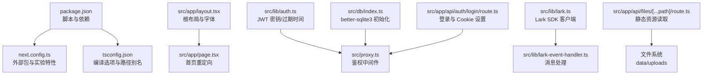
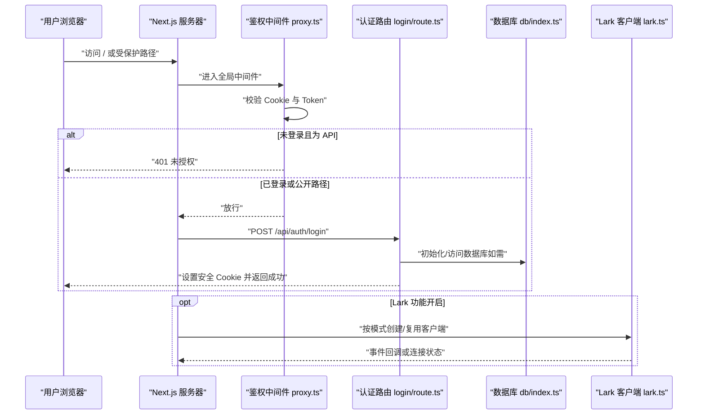
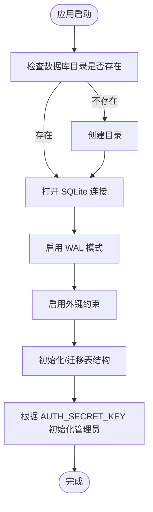
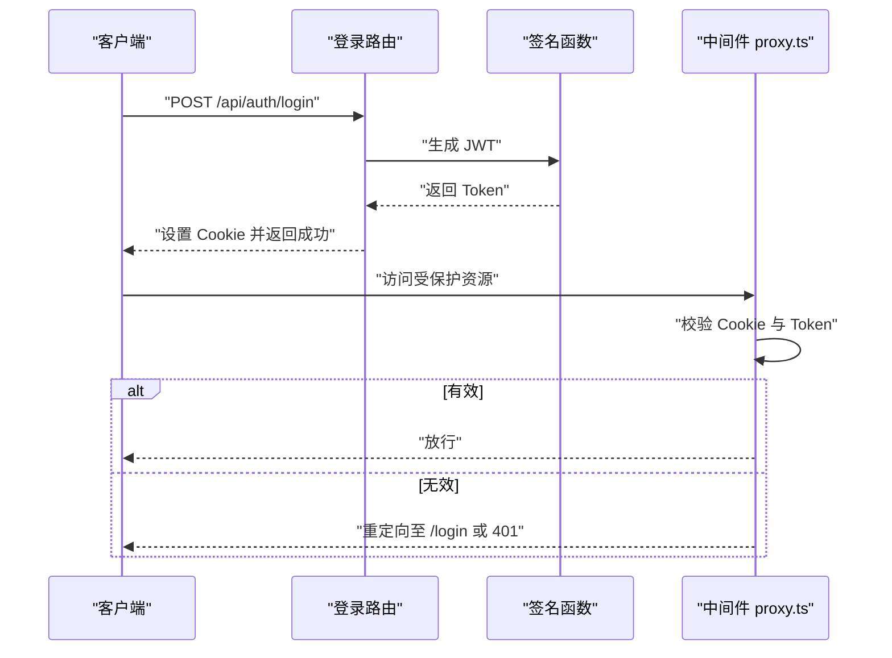
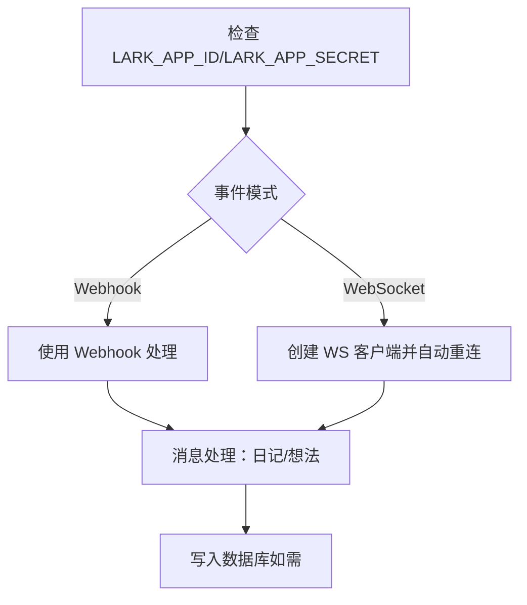
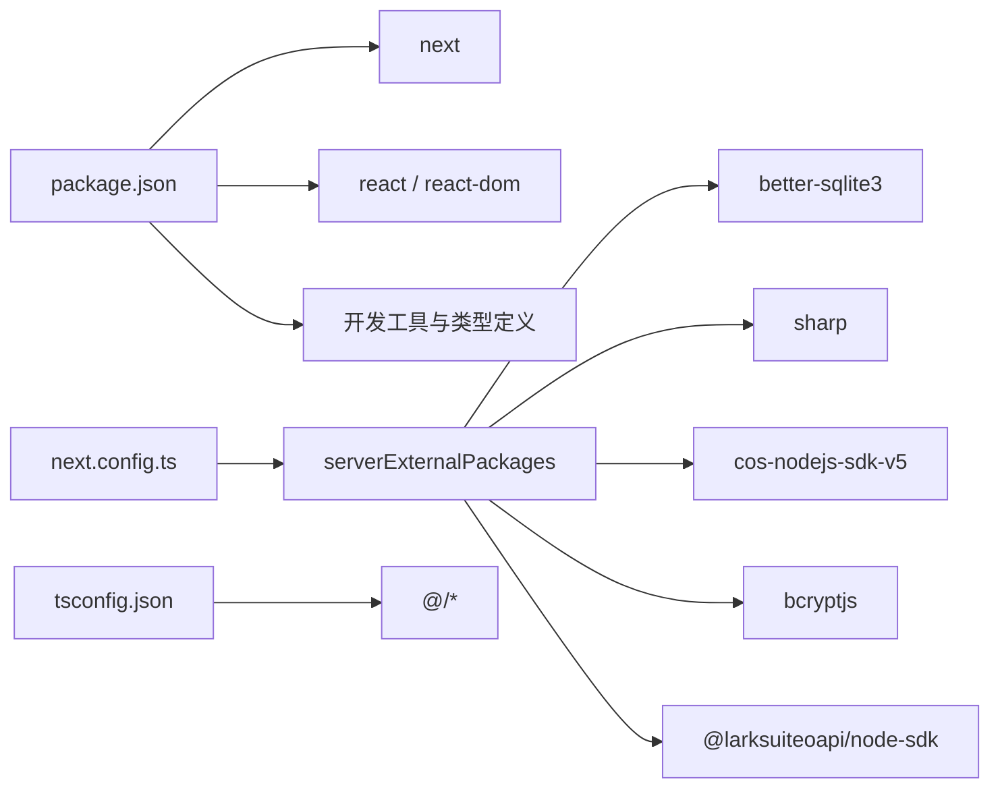

# 启动问题

<cite>
**本文引用的文件**
- [package.json](file://package.json)
- [next.config.ts](file://next.config.ts)
- [tsconfig.json](file://tsconfig.json)
- [README.md](file://README.md)
- [src/lib/auth.ts](file://src/lib/auth.ts)
- [src/db/index.ts](file://src/db/index.ts)
- [src/proxy.ts](file://src/proxy.ts)
- [src/lib/lark.ts](file://src/lib/lark.ts)
- [src/lib/lark-event-handler.ts](file://src/lib/lark-event-handler.ts)
- [src/app/api/auth/login/route.ts](file://src/app/api/auth/login/route.ts)
- [src/app/api/files/[...path]/route.ts](file://src/app/api/files/[...path]/route.ts)
</cite>

## 目录
1. [简介](#简介)
2. [项目结构](#项目结构)
3. [核心组件](#核心组件)
4. [架构总览](#架构总览)
5. [详细组件分析](#详细组件分析)
6. [依赖关系分析](#依赖关系分析)
7. [性能注意事项](#性能注意事项)
8. [故障排除指南](#故障排除指南)
9. [结论](#结论)
10. [附录](#附录)

## 简介
本指南聚焦于 Next.js 应用在开发与生产环境中的启动问题排查，覆盖依赖安装、配置文件、环境变量缺失、端口占用、内存不足、Node.js 版本兼容性、开发服务器热重载与静态资源加载失败、生产构建与运行时异常等常见问题。文档结合仓库现有配置与代码，给出可操作的诊断步骤与解决建议，并提供典型错误场景与对应处理流程。

## 项目结构
该仓库为标准 Next.js App Router 项目，采用 TypeScript 与现代模块解析策略，关键启动与运行配置集中在以下文件：
- 包管理与脚本：package.json
- Next.js 配置：next.config.ts
- TypeScript 编译配置：tsconfig.json
- 应用入口与布局：src/app/layout.tsx、src/app/page.tsx
- 认证与数据库初始化：src/lib/auth.ts、src/db/index.ts
- 请求拦截与鉴权：src/proxy.ts
- Lark 集成（可选）：src/lib/lark.ts、src/lib/lark-event-handler.ts
- API 路由示例：src/app/api/auth/login/route.ts、src/app/api/files/[...path]/route.ts

图表来源
- [package.json:1-119](file://package.json#L1-L119)
- [next.config.ts:1-17](file://next.config.ts#L1-L17)
- [tsconfig.json:1-35](file://tsconfig.json#L1-L35)
- [src/app/layout.tsx:1-38](file://src/app/layout.tsx#L1-L38)
- [src/app/page.tsx:1-6](file://src/app/page.tsx#L1-L6)
- [src/lib/auth.ts:1-26](file://src/lib/auth.ts#L1-L26)
- [src/db/index.ts:1-171](file://src/db/index.ts#L1-L171)
- [src/proxy.ts:1-50](file://src/proxy.ts#L1-L50)
- [src/lib/lark.ts:1-96](file://src/lib/lark.ts#L1-L96)
- [src/lib/lark-event-handler.ts:1-126](file://src/lib/lark-event-handler.ts#L1-L126)
- [src/app/api/auth/login/route.ts](file://src/app/api/auth/login/route.ts)
- [src/app/api/files/[...path]/route.ts](file://src/app/api/files/[...path]/route.ts)

章节来源
- [package.json:1-119](file://package.json#L1-L119)
- [next.config.ts:1-17](file://next.config.ts#L1-L17)
- [tsconfig.json:1-35](file://tsconfig.json#L1-L35)
- [README.md:1-37](file://README.md#L1-L37)

## 核心组件
- 启动脚本与依赖
  - 开发：dev -> next dev
  - 构建：build -> next build
  - 生产：start -> next start
  - 并发开发：dev:ws -> 同时启动主应用与 Lark WebSocket 脚本
- Next.js 配置
  - serverExternalPackages：声明服务端外部依赖（better-sqlite3、sharp、cos-nodejs-sdk-v5、bcryptjs、@larksuiteoapi/node-sdk）
  - experimental.proxyClientMaxBodySize：提升代理客户端最大请求体大小
- TypeScript 配置
  - 模块解析：bundler
  - 路径别名：@/*
  - 严格模式与增量编译
- 数据库初始化
  - better-sqlite3 连接与 WAL、外键启用
  - 表结构初始化与迁移
  - 单例数据库实例
- 认证与鉴权
  - JWT 密钥与过期时间来自环境变量
  - 登录成功设置安全 Cookie
  - 全局中间件校验 Token，未通过则重定向或返回 401
- Lark 集成
  - 通过环境变量配置 appId/appSecret 等
  - 支持 Webhook 与 WebSocket 两种事件模式
  - 消息处理：日记与想法两类内容路由

章节来源
- [package.json:5-12](file://package.json#L5-L12)
- [next.config.ts:3-14](file://next.config.ts#L3-L14)
- [tsconfig.json:10-23](file://tsconfig.json#L10-L23)
- [src/db/index.ts:8-25](file://src/db/index.ts#L8-L25)
- [src/lib/auth.ts:3-8](file://src/lib/auth.ts#L3-L8)
- [src/app/api/auth/login/route.ts](file://src/app/api/auth/login/route.ts)
- [src/proxy.ts:7-45](file://src/proxy.ts#L7-L45)
- [src/lib/lark.ts:10-27](file://src/lib/lark.ts#L10-L27)

## 架构总览
下图展示从浏览器到 API、数据库与第三方服务的关键调用链路，以及启动阶段的依赖注入顺序。

图表来源
- [src/proxy.ts:7-45](file://src/proxy.ts#L7-L45)
- [src/app/api/auth/login/route.ts](file://src/app/api/auth/login/route.ts)
- [src/db/index.ts:160-168](file://src/db/index.ts#L160-L168)
- [src/lib/lark.ts:8-23](file://src/lib/lark.ts#L8-L23)

## 详细组件分析

### 组件一：数据库初始化与单例
- 关键点
  - 通过 DATABASE_PATH 决定 SQLite 文件位置，默认 ./data/ynote.db
  - 启动时确保目录存在并创建表结构，执行迁移逻辑
  - 使用 better-sqlite3 与 drizzle-orm，WAL 模式与外键约束已启用
  - 单例模式避免重复连接
- 影响范围
  - 所有需要持久化的功能（笔记、日记、想法、标签等）
  - 若数据库初始化失败，应用无法启动或部分 API 报错

图表来源
- [src/db/index.ts:10-25](file://src/db/index.ts#L10-L25)
- [src/db/index.ts:132-157](file://src/db/index.ts#L132-L157)

章节来源
- [src/db/index.ts:8-25](file://src/db/index.ts#L8-L25)
- [src/db/index.ts:132-157](file://src/db/index.ts#L132-L157)

### 组件二：JWT 与登录流程
- 关键点
  - JWT_SECRET 与 JWT_EXPIRY 来自环境变量，若缺失使用默认值
  - 登录成功后设置安全 Cookie（httpOnly、secure、sameSite、maxAge）
  - 全局中间件对受保护路径进行 Token 校验
- 影响范围
  - 受保护页面与 API 的访问控制
  - 若环境变量缺失，可能导致登录失败或 Token 校验异常

图表来源
- [src/lib/auth.ts:10-25](file://src/lib/auth.ts#L10-L25)
- [src/app/api/auth/login/route.ts](file://src/app/api/auth/login/route.ts)
- [src/proxy.ts:24-42](file://src/proxy.ts#L24-L42)

章节来源
- [src/lib/auth.ts:3-8](file://src/lib/auth.ts#L3-L8)
- [src/app/api/auth/login/route.ts](file://src/app/api/auth/login/route.ts)
- [src/proxy.ts:24-42](file://src/proxy.ts#L24-L42)

### 组件三：Lark 集成（可选）
- 关键点
  - 通过 LARK_APP_ID/LARK_APP_SECRET 配置客户端
  - 支持 Webhook 与 WebSocket 两种事件模式
  - 提供消息处理函数（日记/想法）
- 影响范围
  - 若未配置 Lark 环境变量，相关功能不可用；WebSocket 模式下会抛出错误

图表来源
- [src/lib/lark.ts:10-27](file://src/lib/lark.ts#L10-L27)
- [src/lib/lark.ts:51-57](file://src/lib/lark.ts#L51-L57)
- [src/lib/lark-event-handler.ts:104-125](file://src/lib/lark-event-handler.ts#L104-L125)

章节来源
- [src/lib/lark.ts:10-27](file://src/lib/lark.ts#L10-L27)
- [src/lib/lark.ts:51-57](file://src/lib/lark.ts#L51-L57)
- [src/lib/lark-event-handler.ts:104-125](file://src/lib/lark-event-handler.ts#L104-L125)

## 依赖关系分析
- 外部包声明
  - next.config.ts 中 serverExternalPackages 声明了 better-sqlite3、sharp、cos-nodejs-sdk-v5、bcryptjs、@larksuiteoapi/node-sdk 为服务端外部依赖，确保在构建与运行时正确处理这些原生/二进制模块
- 模块解析与路径别名
  - tsconfig.json 使用 bundler 解析器与 @/* 路径别名，避免相对路径混乱
- 运行时依赖
  - package.json 指定 next 版本与 React 生态版本，确保与 TypeScript 与工具链兼容

图表来源
- [package.json:13-99](file://package.json#L13-L99)
- [next.config.ts:4-10](file://next.config.ts#L4-L10)
- [tsconfig.json:10-23](file://tsconfig.json#L10-L23)

章节来源
- [package.json:13-99](file://package.json#L13-L99)
- [next.config.ts:4-10](file://next.config.ts#L4-L10)
- [tsconfig.json:10-23](file://tsconfig.json#L10-L23)

## 性能注意事项
- 代理客户端最大请求体：通过 next.config.ts 的 experimental.proxyClientMaxBodySize 提升上传/代理场景的吞吐能力
- 数据库 WAL 模式：提高并发读写性能，减少锁竞争
- TypeScript 增量编译：缩短开发时编译时间
- 资源缓存：静态资源 API 对图片等设置了长期缓存头，降低带宽与延迟

章节来源
- [next.config.ts:11-13](file://next.config.ts#L11-L13)
- [src/db/index.ts:17-18](file://src/db/index.ts#L17-L18)
- [tsconfig.json:13-15](file://tsconfig.json#L13-L15)
- [src/app/api/files/[...path]/route.ts:37-42](file://src/app/api/files/[...path]/route.ts#L37-L42)

## 故障排除指南

### 一、依赖安装问题
- 症状
  - 安装后启动报“找不到模块”或“无法解析模块”
- 排查步骤
  - 确认 package.json 中的依赖版本与 Next.js 主版本兼容
  - 清理 node_modules 与 lockfile，重新安装
  - 检查 next.config.ts 中 serverExternalPackages 是否包含原生模块
- 相关文件
  - [package.json:13-99](file://package.json#L13-L99)
  - [next.config.ts:4-10](file://next.config.ts#L4-L10)

章节来源
- [package.json:13-99](file://package.json#L13-L99)
- [next.config.ts:4-10](file://next.config.ts#L4-L10)

### 二、配置文件错误
- 症状
  - next.config.ts 或 tsconfig.json 语法错误导致启动失败
- 排查步骤
  - 使用编辑器/IDE 的语法检查
  - 确保 tsconfig.json 的 moduleResolution 与 bundler 匹配
  - 确认 paths 别名与实际目录一致
- 相关文件
  - [next.config.ts:1-17](file://next.config.ts#L1-L17)
  - [tsconfig.json:10-23](file://tsconfig.json#L10-L23)

章节来源
- [next.config.ts:1-17](file://next.config.ts#L1-L17)
- [tsconfig.json:10-23](file://tsconfig.json#L10-L23)

### 三、环境变量缺失
- 症状
  - 登录失败、鉴权异常、数据库初始化失败、Lark 功能不可用
- 排查步骤
  - JWT：确认 JWT_SECRET 与 JWT_EXPIRY 存在
  - 数据库：确认 DATABASE_PATH 存在且可写
  - Lark：确认 LARK_APP_ID/LARK_APP_SECRET 存在；WebSocket 模式下同样需要
  - 受保护 API：确认登录后 Cookie 正确设置
- 相关文件
  - [src/lib/auth.ts:3-8](file://src/lib/auth.ts#L3-L8)
  - [src/db/index.ts:8](file://src/db/index.ts#L8)
  - [src/lib/lark.ts:10-27](file://src/lib/lark.ts#L10-L27)
  - [src/app/api/auth/login/route.ts](file://src/app/api/auth/login/route.ts)

章节来源
- [src/lib/auth.ts:3-8](file://src/lib/auth.ts#L3-L8)
- [src/db/index.ts:8](file://src/db/index.ts#L8)
- [src/lib/lark.ts:10-27](file://src/lib/lark.ts#L10-L27)
- [src/app/api/auth/login/route.ts](file://src/app/api/auth/login/route.ts)

### 四、端口占用
- 症状
  - 启动时报端口被占用
- 排查步骤
  - 使用系统命令查找占用进程并终止，或更换端口
  - Next.js 默认端口为 3000（可通过环境变量或 CLI 参数调整）
- 相关文件
  - [README.md:5-15](file://README.md#L5-L15)

章节来源
- [README.md:5-15](file://README.md#L5-L15)

### 五、内存不足
- 症状
  - 启动缓慢、构建失败、进程 OOM
- 排查步骤
  - 增加 Node.js 堆内存上限
  - 关闭不必要的后台进程
  - 检查大文件上传与图片处理是否触发高内存峰值
- 相关文件
  - [package.json:5-12](file://package.json#L5-L12)

章节来源
- [package.json:5-12](file://package.json#L5-L12)

### 六、Node.js 版本兼容性问题
- 症状
  - 启动时报语法/ABI 不兼容错误
- 排查步骤
  - 确认 Node.js 版本满足 Next.js 与 TypeScript 要求
  - 清理缓存并重新安装依赖
- 相关文件
  - [package.json:106-116](file://package.json#L106-L116)

章节来源
- [package.json:106-116](file://package.json#L106-L116)

### 七、开发服务器启动失败
- 症状
  - dev 启动卡住、热重载不生效、页面空白
- 排查步骤
  - 检查 tsconfig.json 的 strict 与 isolatedModules 配置
  - 确认路径别名 @/* 与导入语句一致
  - 查看控制台错误日志，定位具体文件
- 相关文件
  - [tsconfig.json:7-15](file://tsconfig.json#L7-L15)
  - [tsconfig.json:21-23](file://tsconfig.json#L21-L23)

章节来源
- [tsconfig.json:7-15](file://tsconfig.json#L7-L15)
- [tsconfig.json:21-23](file://tsconfig.json#L21-L23)

### 八、热重载问题
- 症状
  - 修改文件后页面不刷新
- 排查步骤
  - 确认未禁用 HMR（Next.js 默认启用）
  - 检查自定义中间件是否阻断响应
  - 清除浏览器缓存或尝试无痕模式
- 相关文件
  - [src/proxy.ts:47-49](file://src/proxy.ts#L47-L49)

章节来源
- [src/proxy.ts:47-49](file://src/proxy.ts#L47-L49)

### 九、静态资源加载失败
- 症状
  - 图片/媒体 404 或 403
- 排查步骤
  - 确认上传目录 data/uploads 存在且可读
  - 检查路径拼接与目录穿越防护逻辑
  - 查看 API 返回的 MIME 类型映射
- 相关文件
  - [src/app/api/files/[...path]/route.ts:5-47](file://src/app/api/files/[...path]/route.ts#L5-L47)

章节来源
- [src/app/api/files/[...path]/route.ts:5-47](file://src/app/api/files/[...path]/route.ts#L5-L47)

### 十、生产环境启动问题
- 症状
  - build 失败、start 启动后立即退出、运行时异常
- 排查步骤
  - 使用 next build 本地预构建，查看详细错误
  - 确认所有环境变量在生产环境可用
  - 检查数据库初始化与权限（文件系统）
  - 如启用 Lark，确认生产环境网络可达与证书配置
- 相关文件
  - [package.json:7-8](file://package.json#L7-L8)
  - [src/db/index.ts:8-25](file://src/db/index.ts#L8-L25)
  - [src/lib/lark.ts:10-27](file://src/lib/lark.ts#L10-L27)

章节来源
- [package.json:7-8](file://package.json#L7-L8)
- [src/db/index.ts:8-25](file://src/db/index.ts#L8-L25)
- [src/lib/lark.ts:10-27](file://src/lib/lark.ts#L10-L27)

### 十一、典型错误与解决步骤
- 错误示例：LARK_APP_ID/LARK_APP_SECRET 未设置
  - 现象：WebSocket 模式下初始化客户端抛出错误
  - 解决：补齐环境变量或切换为 Webhook 模式
  - 参考：[src/lib/lark.ts:10-27](file://src/lib/lark.ts#L10-L27)
- 错误示例：JWT_SECRET 未设置
  - 现象：登录成功但后续鉴权失败
  - 解决：设置 JWT_SECRET 与 JWT_EXPIRY
  - 参考：[src/lib/auth.ts:3-8](file://src/lib/auth.ts#L3-L8)
- 错误示例：DATABASE_PATH 目录不可写
  - 现象：数据库初始化失败或表创建失败
  - 解决：赋予写权限或更换路径
  - 参考：[src/db/index.ts:8](file://src/db/index.ts#L8)
- 错误示例：上传目录 data/uploads 不存在
  - 现象：静态资源 API 返回 404
  - 解决：创建目录并赋予读权限
  - 参考：[src/app/api/files/[...path]/route.ts:5-23](file://src/app/api/files/[...path]/route.ts#L5-L23)

章节来源
- [src/lib/lark.ts:10-27](file://src/lib/lark.ts#L10-L27)
- [src/lib/auth.ts:3-8](file://src/lib/auth.ts#L3-L8)
- [src/db/index.ts:8](file://src/db/index.ts#L8)
- [src/app/api/files/[...path]/route.ts:5-23](file://src/app/api/files/[...path]/route.ts#L5-L23)

## 结论
启动问题通常源于依赖、配置、环境变量与运行时条件。建议按“依赖—配置—环境变量—运行时条件”的顺序逐项排查，并结合本指南提供的定位方法与参考文件快速定位根因。生产环境务必在构建前完成全量环境变量校验与目录权限检查。

## 附录
- 快速检查清单
  - 依赖安装完整且版本兼容
  - next.config.ts 与 tsconfig.json 语法正确
  - 环境变量齐全（JWT、数据库、Lark）
  - 数据库目录存在且可写
  - 上传目录存在且可读
  - 端口未被占用，内存充足
  - Node.js 版本满足要求