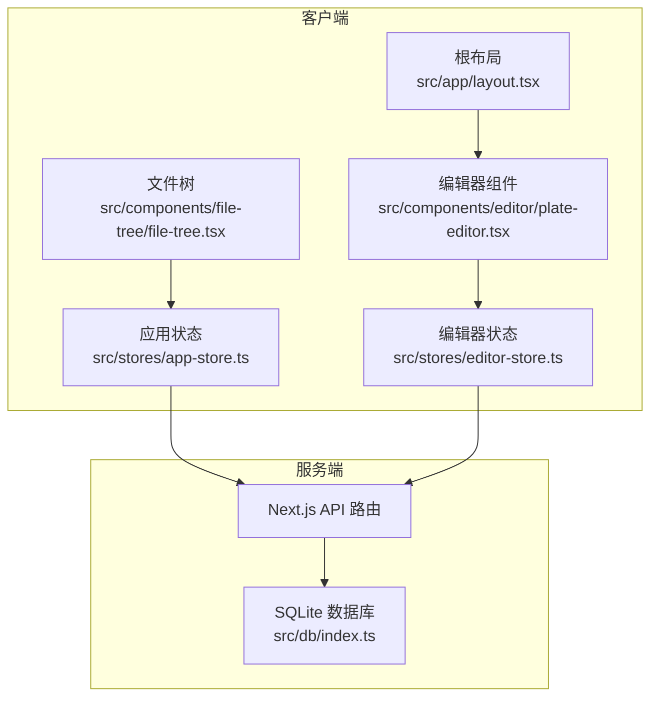
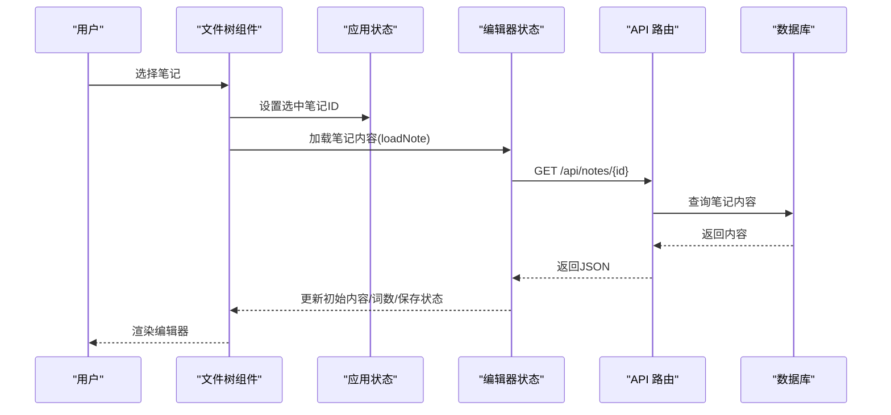
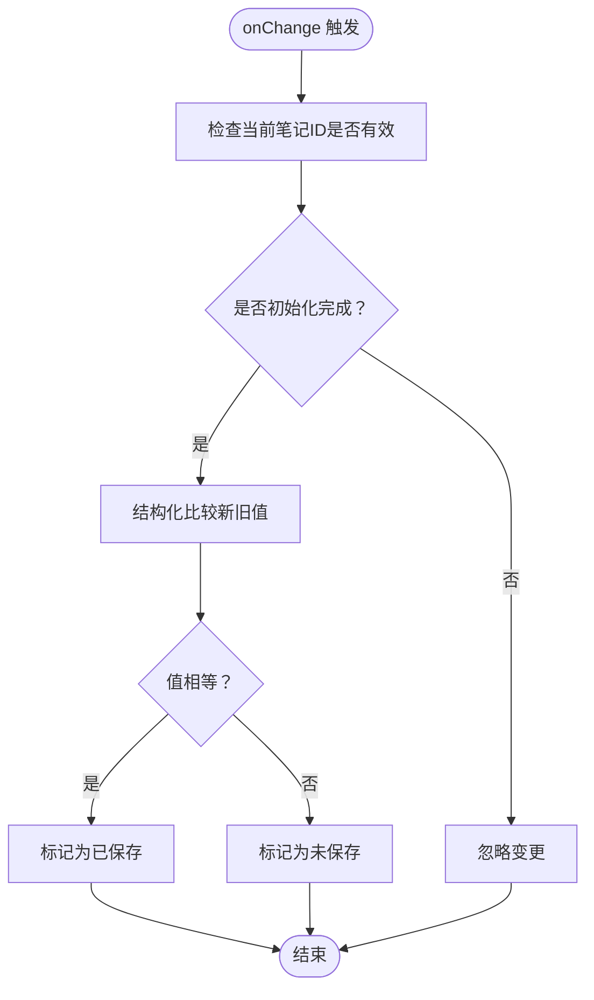
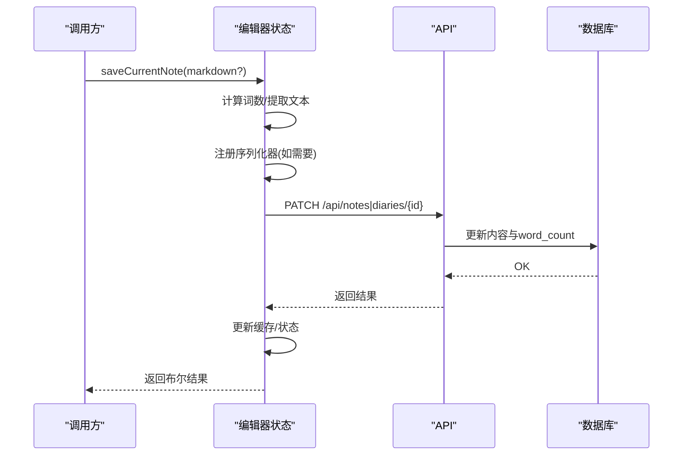
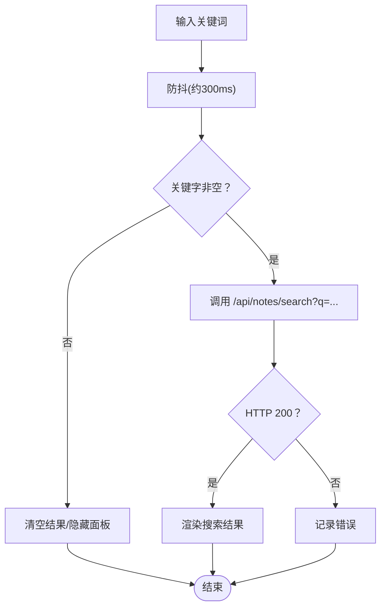
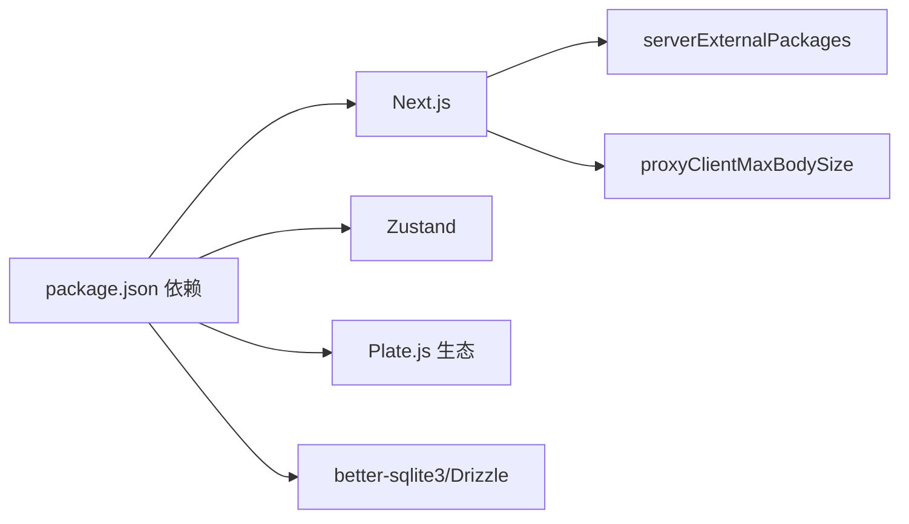

# 性能问题

<cite>
**本文引用的文件**
- [README.md](file://README.md)
- [next.config.ts](file://next.config.ts)
- [package.json](file://package.json)
- [src/app/layout.tsx](file://src/app/layout.tsx)
- [src/components/editor/plate-editor.tsx](file://src/components/editor/plate-editor.tsx)
- [src/stores/editor-store.ts](file://src/stores/editor-store.ts)
- [src/stores/app-store.ts](file://src/stores/app-store.ts)
- [src/components/file-tree/file-tree.tsx](file://src/components/file-tree/file-tree.tsx)
- [src/db/index.ts](file://src/db/index.ts)
- [src/hooks/use-debounce.ts](file://src/hooks/use-debounce.ts)
- [src/lib/utils.ts](file://src/lib/utils.ts)
- [src/components/editor/plugins/autoformat-kit.tsx](file://src/components/editor/plugins/autoformat-kit.tsx)
- [src/components/editor/plugins/basic-blocks-kit.tsx](file://src/components/editor/plugins/basic-blocks-kit.tsx)
- [src/components/editor/plugins/code-block-kit.tsx](file://src/components/editor/plugins/code-block-kit.tsx)
- [src/components/editor/plugins/media-kit.tsx](file://src/components/editor/plugins/media-kit.tsx)
- [src/components/editor/plugins/table-kit.tsx](file://src/components/editor/plugins/table-kit.tsx)
</cite>

## 目录
1. [简介](#简介)
2. [项目结构](#项目结构)
3. [核心组件](#核心组件)
4. [架构总览](#架构总览)
5. [详细组件分析](#详细组件分析)
6. [依赖分析](#依赖分析)
7. [性能考虑](#性能考虑)
8. [故障排除指南](#故障排除指南)
9. [结论](#结论)
10. [附录](#附录)

## 简介
本指南聚焦于应用在内存使用、CPU 占用与渲染性能方面的瓶颈诊断与优化方法，并结合仓库现有实现，系统性地给出编辑器性能优化策略（如内容比较、缓存与序列化）、数据库查询诊断（索引与慢查询）、网络请求排查（CDN 与缓存）以及性能监控与基准测试建议。目标是帮助开发者快速定位问题并采取可落地的优化措施。

## 项目结构
该项目基于 Next.js 构建，前端采用 React 与 Zustand 状态管理，编辑器基于 Plate.js，数据层使用 better-sqlite3 + Drizzle ORM，配合若干插件扩展富文本能力。整体结构清晰：页面布局与字体加载在根布局中完成；编辑器与状态集中在组件与 store 中；文件树与应用状态通过 API 调用交互；数据库初始化与索引在 db 模块中集中处理。

图表来源
- [src/app/layout.tsx:1-38](file://src/app/layout.tsx#L1-L38)
- [src/components/editor/plate-editor.tsx:1-175](file://src/components/editor/plate-editor.tsx#L1-L175)
- [src/stores/editor-store.ts:1-281](file://src/stores/editor-store.ts#L1-L281)
- [src/stores/app-store.ts:1-318](file://src/stores/app-store.ts#L1-L318)
- [src/components/file-tree/file-tree.tsx:1-326](file://src/components/file-tree/file-tree.tsx#L1-L326)
- [src/db/index.ts:1-171](file://src/db/index.ts#L1-L171)

章节来源
- [src/app/layout.tsx:1-38](file://src/app/layout.tsx#L1-L38)
- [src/components/editor/plate-editor.tsx:1-175](file://src/components/editor/plate-editor.tsx#L1-L175)
- [src/stores/editor-store.ts:1-281](file://src/stores/editor-store.ts#L1-L281)
- [src/stores/app-store.ts:1-318](file://src/stores/app-store.ts#L1-L318)
- [src/components/file-tree/file-tree.tsx:1-326](file://src/components/file-tree/file-tree.tsx#L1-L326)
- [src/db/index.ts:1-171](file://src/db/index.ts#L1-L171)

## 核心组件
- 编辑器组件与内容比较：通过自定义结构化比较函数避免昂贵的 JSON 序列化，降低状态变更成本。
- 编辑器状态管理：提供内容缓存（LRU）、手动保存、Markdown 序列化回调注册等，减少重复计算与网络请求。
- 文件树与应用状态：提供搜索、批量展开/折叠、删除后清理缓存等操作，优化 UI 响应与资源占用。
- 数据库初始化与索引：WAL 模式、外键启用、多表索引，为查询性能打下基础。
- 字体与布局：Next.js 字体自动优化与全局样式，减少首屏阻塞与重排。

章节来源
- [src/components/editor/plate-editor.tsx:12-61](file://src/components/editor/plate-editor.tsx#L12-L61)
- [src/stores/editor-store.ts:47-155](file://src/stores/editor-store.ts#L47-L155)
- [src/stores/app-store.ts:69-191](file://src/stores/app-store.ts#L69-L191)
- [src/db/index.ts:17-25](file://src/db/index.ts#L17-L25)
- [src/db/index.ts:73-130](file://src/db/index.ts#L73-L130)
- [src/app/layout.tsx:7-15](file://src/app/layout.tsx#L7-L15)

## 架构总览
从用户交互到数据持久化的典型路径如下：

图表来源
- [src/components/file-tree/file-tree.tsx:30-77](file://src/components/file-tree/file-tree.tsx#L30-L77)
- [src/stores/editor-store.ts:114-155](file://src/stores/editor-store.ts#L114-L155)
- [src/db/index.ts:27-158](file://src/db/index.ts#L27-L158)

## 详细组件分析

### 编辑器组件与内容比较
- 结构化比较：自定义比较函数对节点进行递归对比，跳过 JSON 序列化，显著降低 CPU 开销与 GC 压力。
- 初始化与切换：切换笔记时重置编辑器状态、清空历史与选择，避免跨笔记状态污染。
- 序列化回调：在挂载时注册 Markdown 序列化器，保存时按需生成 Markdown，减少重复计算。

图表来源
- [src/components/editor/plate-editor.tsx:84-99](file://src/components/editor/plate-editor.tsx#L84-L99)
- [src/components/editor/plate-editor.tsx:102-136](file://src/components/editor/plate-editor.tsx#L102-L136)

章节来源
- [src/components/editor/plate-editor.tsx:12-61](file://src/components/editor/plate-editor.tsx#L12-L61)
- [src/components/editor/plate-editor.tsx:84-99](file://src/components/editor/plate-editor.tsx#L84-L99)
- [src/components/editor/plate-editor.tsx:102-136](file://src/components/editor/plate-editor.tsx#L102-L136)
- [src/components/editor/plate-editor.tsx:147-153](file://src/components/editor/plate-editor.tsx#L147-L153)

### 编辑器状态管理（缓存、保存、序列化）
- 内容缓存：LRU 缓存最近访问的笔记内容，命中则直接返回，避免重复网络请求与解析。
- 手动保存：计算词数、序列化 Markdown（必要时），PATCH 到对应 API，成功后更新缓存与状态。
- 缓存失效：删除笔记后主动清理对应缓存条目，防止内存泄漏。

图表来源
- [src/stores/editor-store.ts:204-275](file://src/stores/editor-store.ts#L204-L275)
- [src/db/index.ts:27-158](file://src/db/index.ts#L27-L158)

章节来源
- [src/stores/editor-store.ts:47-77](file://src/stores/editor-store.ts#L47-L77)
- [src/stores/editor-store.ts:114-155](file://src/stores/editor-store.ts#L114-L155)
- [src/stores/editor-store.ts:204-275](file://src/stores/editor-store.ts#L204-L275)

### 文件树与应用状态（搜索、批量操作）
- 搜索防抖：输入关键字后延迟触发搜索请求，减少无效网络调用。
- 批量展开/折叠：乐观更新 UI 并并发发起多个 PATCH 请求，提升响应速度。
- 删除清理：删除笔记后清理编辑器缓存并重置当前笔记 ID，避免悬挂引用。

图表来源
- [src/components/file-tree/file-tree.tsx:88-122](file://src/components/file-tree/file-tree.tsx#L88-L122)
- [src/hooks/use-debounce.ts:1-19](file://src/hooks/use-debounce.ts#L1-L19)

章节来源
- [src/components/file-tree/file-tree.tsx:88-122](file://src/components/file-tree/file-tree.tsx#L88-L122)
- [src/stores/app-store.ts:149-191](file://src/stores/app-store.ts#L149-L191)
- [src/stores/app-store.ts:298-316](file://src/stores/app-store.ts#L298-L316)

### 数据库初始化与索引
- WAL 模式与外键：提升并发读写与参照完整性。
- 关键索引：目录父节点、笔记所属目录、附件归属、日记复合索引等，支撑高频查询。
- 迁移与初始化：统一迁移脚本与初始化逻辑，确保生产环境一致性。

章节来源
- [src/db/index.ts:17-25](file://src/db/index.ts#L17-L25)
- [src/db/index.ts:73-130](file://src/db/index.ts#L73-L130)
- [src/db/index.ts:132-158](file://src/db/index.ts#L132-L158)

### 编辑器插件与渲染性能
- 自动格式化规则：通过规则查询限制在非代码块内生效，减少不必要的格式化开销。
- 基础节点与快捷键：针对标题、引用、水平线等节点配置组件映射与快捷键，避免冗余渲染。
- 代码块高亮：使用 lowlight 进行语法高亮，注意大文档的高亮代价。
- 媒体与表格：媒体上传限制与预览组件，表格初始宽度控制，避免过大重排。
- 工具类：Tailwind 合并与条件合并工具，减少样式计算与类名拼接成本。

章节来源
- [src/components/editor/plugins/autoformat-kit.tsx:211-237](file://src/components/editor/plugins/autoformat-kit.tsx#L211-L237)
- [src/components/editor/plugins/basic-blocks-kit.tsx:27-89](file://src/components/editor/plugins/basic-blocks-kit.tsx#L27-L89)
- [src/components/editor/plugins/code-block-kit.tsx:18-27](file://src/components/editor/plugins/code-block-kit.tsx#L18-L27)
- [src/components/editor/plugins/media-kit.tsx:23-84](file://src/components/editor/plugins/media-kit.tsx#L23-L84)
- [src/components/editor/plugins/table-kit.tsx:17-27](file://src/components/editor/plugins/table-kit.tsx#L17-L27)
- [src/lib/utils.ts:4-7](file://src/lib/utils.ts#L4-L7)

## 依赖分析
- 外部包：better-sqlite3、drizzle-orm、platejs 生态、zustand 等。
- Next.js 实验特性：serverExternalPackages 与代理最大主体大小配置，影响 SSR 与代理性能。
- 字体优化：Next.js 字体自动优化，减少首屏阻塞。

图表来源
- [package.json:13-99](file://package.json#L13-L99)
- [next.config.ts:4-14](file://next.config.ts#L4-L14)

章节来源
- [package.json:13-99](file://package.json#L13-L99)
- [next.config.ts:4-14](file://next.config.ts#L4-L14)

## 性能考虑
- 内存使用
  - 编辑器内容缓存采用 LRU，避免无限增长；删除笔记后及时清理缓存。
  - 使用结构化比较替代 JSON 比较，降低字符串化与 GC 压力。
- CPU 占用
  - 搜索防抖与批量操作乐观更新，减少主线程阻塞。
  - 插件规则限制在合适上下文执行，避免全量格式化。
- 渲染性能
  - 字体自动优化与最小高度背景，减少布局抖动。
  - 组件内条件渲染与骨架屏提示，改善感知性能。

章节来源
- [src/stores/editor-store.ts:66-77](file://src/stores/editor-store.ts#L66-L77)
- [src/stores/editor-store.ts:114-155](file://src/stores/editor-store.ts#L114-L155)
- [src/components/editor/plate-editor.tsx:12-61](file://src/components/editor/plate-editor.tsx#L12-L61)
- [src/components/file-tree/file-tree.tsx:88-122](file://src/components/file-tree/file-tree.tsx#L88-L122)
- [src/components/editor/plugins/autoformat-kit.tsx:225-235](file://src/components/editor/plugins/autoformat-kit.tsx#L225-L235)
- [src/app/layout.tsx:7-15](file://src/app/layout.tsx#L7-L15)

## 故障排除指南

### 一、内存使用过高
- 症状
  - 页面卡顿、频繁 GC、内存持续上涨。
- 诊断
  - 检查编辑器缓存大小与命中率：确认 MAX_CACHE_SIZE 是否合理，是否存在未清理的缓存键。
  - 定位大文档：观察笔记内容长度与序列化耗时。
  - 监控组件实例：确认是否存在重复渲染导致的闭包与引用累积。
- 优化
  - 控制缓存上限并定期淘汰最久未使用项。
  - 对超长文档分段保存或懒加载。
  - 使用结构化比较，避免深层对象频繁重建。

章节来源
- [src/stores/editor-store.ts:7-13](file://src/stores/editor-store.ts#L7-L13)
- [src/stores/editor-store.ts:66-77](file://src/stores/editor-store.ts#L66-L77)
- [src/stores/editor-store.ts:114-155](file://src/stores/editor-store.ts#L114-L155)
- [src/components/editor/plate-editor.tsx:12-61](file://src/components/editor/plate-editor.tsx#L12-L61)

### 二、CPU 占用异常
- 症状
  - 输入延迟、搜索卡顿、批量操作缓慢。
- 诊断
  - 搜索防抖是否生效，请求频率是否过高。
  - 批量展开/折叠是否并发过多导致主线程拥塞。
  - 插件规则是否在非目标节点上执行。
- 优化
  - 调整防抖延迟与去抖边界。
  - 分批并发或节流批量请求。
  - 在插件规则中增加上下文查询，避免全量匹配。

章节来源
- [src/components/file-tree/file-tree.tsx:88-122](file://src/components/file-tree/file-tree.tsx#L88-L122)
- [src/stores/app-store.ts:149-191](file://src/stores/app-store.ts#L149-L191)
- [src/components/editor/plugins/autoformat-kit.tsx:225-235](file://src/components/editor/plugins/autoformat-kit.tsx#L225-L235)

### 三、渲染性能问题
- 症状
  - 首屏白屏时间长、滚动卡顿、大图加载慢。
- 诊断
  - 字体加载是否阻塞渲染。
  - 图片/视频/PDF 等媒体是否过大或未懒加载。
  - 表格与代码块高亮是否造成重排。
- 优化
  - 使用自动字体优化与合适的字体变量。
  - 媒体组件按需加载与尺寸控制。
  - 代码块高亮仅在可见区域执行，或延迟高亮。

章节来源
- [src/app/layout.tsx:7-15](file://src/app/layout.tsx#L7-L15)
- [src/components/editor/plugins/media-kit.tsx:23-84](file://src/components/editor/plugins/media-kit.tsx#L23-L84)
- [src/components/editor/plugins/code-block-kit.tsx:18-27](file://src/components/editor/plugins/code-block-kit.tsx#L18-L27)

### 四、编辑器性能优化策略
- 内容比较与状态更新
  - 使用结构化比较替代 JSON 比较，减少字符串化与解析。
  - 变更时仅在值真正变化时更新状态，避免不必要重渲染。
- 缓存与序列化
  - LRU 缓存热点笔记内容，命中即返回。
  - 仅在需要时生成 Markdown，避免重复序列化。
- 状态切换与历史
  - 切换笔记时清空历史与选择，避免跨笔记状态污染。
- 插件与渲染
  - 在合适上下文执行自动格式化与快捷键，减少无关计算。
  - 控制表格与媒体组件的初始尺寸与懒加载策略。

章节来源
- [src/components/editor/plate-editor.tsx:12-61](file://src/components/editor/plate-editor.tsx#L12-L61)
- [src/components/editor/plate-editor.tsx:102-136](file://src/components/editor/plate-editor.tsx#L102-L136)
- [src/stores/editor-store.ts:47-77](file://src/stores/editor-store.ts#L47-L77)
- [src/stores/editor-store.ts:114-155](file://src/stores/editor-store.ts#L114-L155)
- [src/components/editor/plugins/autoformat-kit.tsx:211-237](file://src/components/editor/plugins/autoformat-kit.tsx#L211-L237)

### 五、数据库查询性能问题
- 诊断
  - 使用 SQLite PRAGMA 与 EXPLAIN QUERY PLAN 分析慢查询。
  - 检查索引是否覆盖查询条件，是否存在全表扫描。
- 优化
  - 确保常用过滤字段（如目录父节点、笔记所属目录、日记复合键）有索引。
  - 将复杂查询拆分为多步，或引入物化视图/派生列。
  - 使用 WAL 模式与外键约束，平衡并发与一致性。

章节来源
- [src/db/index.ts:17-25](file://src/db/index.ts#L17-L25)
- [src/db/index.ts:73-130](file://src/db/index.ts#L73-L130)

### 六、网络请求性能排查
- 诊断
  - 检查请求频率与幂等性，识别重复/无效请求。
  - 使用浏览器网络面板观察缓存命中情况与响应时间。
- 优化
  - 对高频接口添加本地缓存与版本控制。
  - 合理设置代理最大主体大小，避免大文件阻塞。
  - CDN 与静态资源缓存策略：字体、图片、构建产物使用强缓存与 ETag。

章节来源
- [src/components/file-tree/file-tree.tsx:88-122](file://src/components/file-tree/file-tree.tsx#L88-L122)
- [src/stores/app-store.ts:149-191](file://src/stores/app-store.ts#L149-L191)
- [next.config.ts:11-14](file://next.config.ts#L11-L14)

### 七、性能监控与基准测试
- 监控指标
  - 首屏时间（FCP/LCP）、交互时间（FID/INP）、内存峰值、CPU 使用率。
- 工具建议
  - 浏览器性能面板、React DevTools Profiler、Next.js Profiling。
  - Node 端使用进程监控与日志采样。
- 基准测试
  - 编辑器：构造不同长度与复杂度的文档，测量输入延迟与渲染帧率。
  - 数据库：构造大量数据集，测量常见查询的 P95/P99 延迟。
  - 网络：模拟弱网与高延迟，评估缓存与降级策略效果。

章节来源
- [README.md:1-37](file://README.md#L1-L37)

## 结论
本项目在编辑器性能、状态管理与数据库设计方面已具备良好基础：结构化比较、LRU 缓存、批量操作与索引等均有助于降低 CPU 与内存压力。建议在实际运行中结合监控工具与基准测试，持续验证优化效果，并根据业务场景进一步细化缓存策略、CDN 与数据库索引方案。

## 附录
- 快速检查清单
  - 编辑器：是否使用结构化比较；缓存是否命中；序列化是否按需触发。
  - 文件树：搜索是否防抖；批量操作是否并发合理；删除后是否清理缓存。
  - 数据库：常用查询是否走索引；是否启用 WAL 与外键；索引是否覆盖过滤字段。
  - 网络：代理最大主体大小是否合理；静态资源是否强缓存；CDN 是否启用。
  - 监控：是否采集首屏、交互、内存与 CPU 指标；是否建立基线与告警。