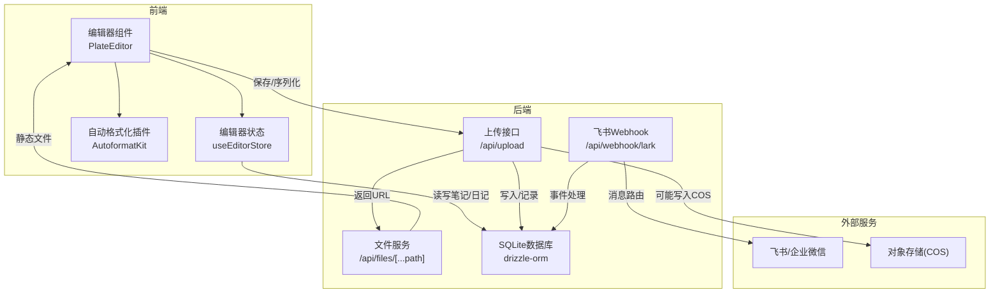
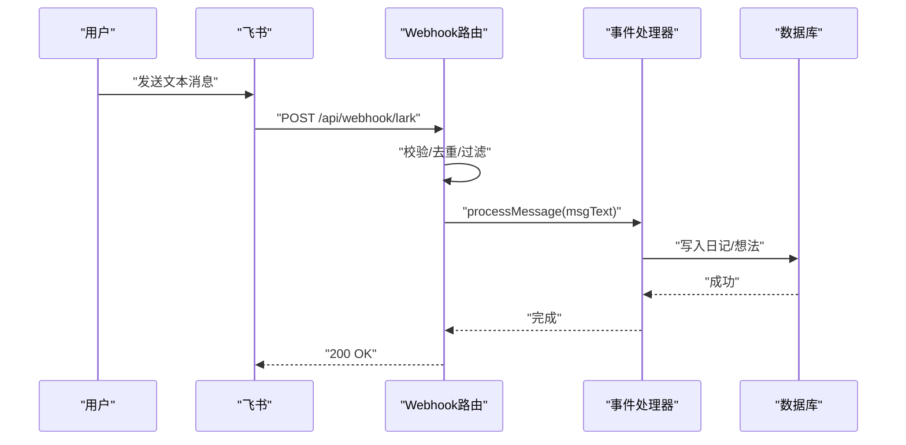
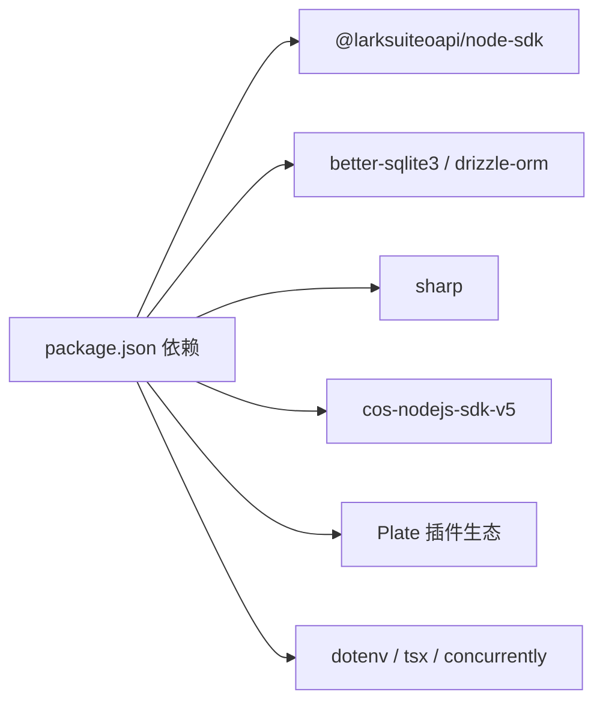

# 故障排除

<cite>
**本文引用的文件**
- [README.md](file://README.md)
- [package.json](file://package.json)
- [src/lib/lark.ts](file://src/lib/lark.ts)
- [src/lib/lark-event-handler.ts](file://src/lib/lark-event-handler.ts)
- [src/app/api/webhook/lark/route.ts](file://src/app/api/webhook/lark/route.ts)
- [scripts/lark-websocket.ts](file://scripts/lark-websocket.ts)
- [src/db/index.ts](file://src/db/index.ts)
- [src/app/api/upload/route.ts](file://src/app/api/upload/route.ts)
- [src/app/api/files/[...path]/route.ts](file://src/app/api/files/[...path]/route.ts)
- [src/hooks/use-upload-file.ts](file://src/hooks/use-upload-file.ts)
- [src/stores/editor-store.ts](file://src/stores/editor-store.ts)
- [src/components/editor/plate-editor.tsx](file://src/components/editor/plate-editor.tsx)
- [src/components/editor/plugins/autoformat-kit.tsx](file://src/components/editor/plugins/autoformat-kit.tsx)
</cite>

## 目录
1. [简介](#简介)
2. [项目结构](#项目结构)
3. [核心组件](#核心组件)
4. [架构总览](#架构总览)
5. [详细组件分析](#详细组件分析)
6. [依赖分析](#依赖分析)
7. [性能考虑](#性能考虑)
8. [故障排除指南](#故障排除指南)
9. [结论](#结论)
10. [附录](#附录)

## 简介
本指南面向运维与开发者，聚焦于本项目的常见问题诊断与修复，覆盖启动失败、数据库连接、API 错误、性能问题、网络连接（含防火墙与代理）、飞书集成（Webhook/WebSocket）、编辑器相关问题（内容丢失/格式错误）、文件上传、浏览器兼容性、开发环境问题以及紧急应急与数据恢复。文档以“可操作”为主，辅以架构图与流程图帮助快速定位根因。

## 项目结构
本项目基于 Next.js 应用，采用 App Router，核心模块包括：
- 飞书集成：SDK 客户端封装、事件处理器、Webhook 路由、WebSocket 脚本
- 数据层：better-sqlite3 + drizzle-orm，内置初始化与迁移逻辑
- 编辑器：Plate + 自定义插件集，状态管理使用 Zustand
- 文件上传：本地存储路由与通用上传接口，支持图片处理与 COS 存储类型判断
- 开发脚本：本地 WebSocket 长连调试脚本

图表来源
- [src/components/editor/plate-editor.tsx:63-175](file://src/components/editor/plate-editor.tsx#L63-L175)
- [src/stores/editor-store.ts:88-281](file://src/stores/editor-store.ts#L88-L281)
- [src/components/editor/plugins/autoformat-kit.tsx:211-237](file://src/components/editor/plugins/autoformat-kit.tsx#L211-L237)
- [src/app/api/upload/route.ts:50-153](file://src/app/api/upload/route.ts#L50-L153)
- [src/app/api/files/[...path]/route.ts](file://src/app/api/files/[...path]/route.ts#L7-L48)
- [src/app/api/webhook/lark/route.ts:28-106](file://src/app/api/webhook/lark/route.ts#L28-L106)
- [src/db/index.ts:160-171](file://src/db/index.ts#L160-L171)

章节来源
- [README.md:1-37](file://README.md#L1-L37)
- [package.json:1-119](file://package.json#L1-L119)

## 核心组件
- 飞书客户端与配置
  - 单例客户端与 WebSocket 客户端初始化、事件模式切换、加密密钥与校验令牌读取
- 事件处理
  - 消息路由：日记/想法；内容解析与持久化
- 数据库
  - better-sqlite3 + drizzle-orm，表结构初始化与迁移、索引、管理员账户初始化
- 上传与文件服务
  - 上传接口：类型/大小校验、图片处理、键命名、存储类型判断、数据库记录
  - 文件服务：本地目录读取、防路径穿越、MIME 映射、缓存头
- 编辑器
  - 内容比较、快照基线、保存状态、Markdown 序列化、缓存与撤销栈清理
- 开发脚本
  - WebSocket 长连调试，事件分发、优雅关闭

章节来源
- [src/lib/lark.ts:1-96](file://src/lib/lark.ts#L1-L96)
- [src/lib/lark-event-handler.ts:1-126](file://src/lib/lark-event-handler.ts#L1-L126)
- [src/db/index.ts:1-171](file://src/db/index.ts#L1-L171)
- [src/app/api/upload/route.ts:1-153](file://src/app/api/upload/route.ts#L1-L153)
- [src/app/api/files/[...path]/route.ts:1-48](file://src/app/api/files/[...path]/route.ts#L1-L48)
- [src/stores/editor-store.ts:1-281](file://src/stores/editor-store.ts#L1-L281)
- [src/components/editor/plate-editor.tsx:1-175](file://src/components/editor/plate-editor.tsx#L1-L175)
- [scripts/lark-websocket.ts:1-109](file://scripts/lark-websocket.ts#L1-L109)

## 架构总览
飞书事件处理链路（Webhook/WebSocket）与数据库交互，上传链路与文件服务，编辑器状态与持久化。

图表来源
- [src/app/api/webhook/lark/route.ts:28-106](file://src/app/api/webhook/lark/route.ts#L28-L106)
- [src/lib/lark-event-handler.ts:104-126](file://src/lib/lark-event-handler.ts#L104-L126)
- [src/db/index.ts:160-171](file://src/db/index.ts#L160-L171)

## 详细组件分析

### 飞书集成（Webhook）
- 关键点
  - URL 校验、v2.0 校验令牌、事件去重（内存 Map，5 分钟 TTL）、仅处理 im.message.receive_v1、仅文本消息、仅允许白名单用户、非加密负载
  - 返回 200 避免重复投递
- 常见问题
  - 未配置 LARK_APP_ID/LARK_APP_SECRET 导致初始化失败
  - 加密负载未配置 LARK_ENCRYPT_KEY 或未在飞书控制台关闭加密
  - 未设置 LARK_VERIFICATION_TOKEN 导致校验失败
  - 未配置 LARK_ALLOWED_USER_IDS 导致消息被忽略
  - 事件重复：检查去重 TTL 与事件 ID 是否正确传递
- 排查步骤
  - 确认环境变量齐全且拼写正确
  - 在飞书应用后台核对 Webhook URL、校验令牌、加密开关
  - 查看路由日志中是否出现“token mismatch”、“Received encrypted payload”
  - 使用 curl 或 Postman 模拟请求，验证响应体结构

章节来源
- [src/app/api/webhook/lark/route.ts:28-106](file://src/app/api/webhook/lark/route.ts#L28-L106)
- [src/lib/lark.ts:25-41](file://src/lib/lark.ts#L25-L41)

### 飞书集成（WebSocket）
- 关键点
  - 通过独立脚本建立长连接，事件分发器注册 im.message.receive_v1，支持加密密钥与白名单用户
  - 支持优雅关闭（SIGINT/SIGTERM）
- 常见问题
  - 未设置 LARK_EVENT_MODE=websocket
  - 未配置 LARK_APP_ID/LARK_APP_SECRET
  - 未设置 LARK_ENCRYPT_KEY 且飞书控制台开启加密
- 排查步骤
  - 设置 LARK_EVENT_MODE=websocket 并运行 npm run lark:ws 或 npm run dev:ws
  - 检查脚本输出“连接已建立”、“收到事件”等日志
  - 若连接失败，查看失败原因并确认网络可达性与证书

章节来源
- [scripts/lark-websocket.ts:1-109](file://scripts/lark-websocket.ts#L1-L109)
- [src/lib/lark.ts:69-96](file://src/lib/lark.ts#L69-L96)

### 数据库（SQLite + Drizzle）
- 关键点
  - WAL 模式、外键约束、初始化表结构与索引、迁移添加字段、管理员账户初始化
  - 单例模式避免重复连接
- 常见问题
  - 权限不足导致无法创建/写入数据库目录
  - 数据库损坏或锁冲突
  - 迁移失败或缺失字段
- 排查步骤
  - 检查 DATABASE_PATH 指向的目录是否存在且可写
  - 尝试手动删除数据库文件后重启，触发重新初始化
  - 使用 SQLite 工具检查表结构与索引

章节来源
- [src/db/index.ts:10-25](file://src/db/index.ts#L10-L25)
- [src/db/index.ts:132-158](file://src/db/index.ts#L132-L158)
- [src/db/index.ts:160-171](file://src/db/index.ts#L160-L171)

### 上传与文件服务
- 关键点
  - 上传接口：类型/大小限制、图片处理（生成 webp）、键命名（年/月/uuid.ext）、存储类型判断（本地/COS）、数据库记录
  - 文件服务：防路径穿越、MIME 映射、缓存头
- 常见问题
  - 不支持的文件类型
  - 超出大小限制
  - 图片处理失败
  - 本地文件读取失败（权限/路径）
- 排查步骤
  - 检查 ALLOWED_* 类型列表与 MAX_* 大小
  - 确认上传目录 data/uploads 可写
  - 检查返回 URL 的存储类型（本地/COS），确认对应存储可用
  - 对于图片，确认 sharp/依赖安装与版本兼容

章节来源
- [src/app/api/upload/route.ts:50-153](file://src/app/api/upload/route.ts#L50-L153)
- [src/app/api/files/[...path]/route.ts:7-L48](file://src/app/api/files/[...path]/route.ts#L7-L48)
- [src/hooks/use-upload-file.ts:16-43](file://src/hooks/use-upload-file.ts#L16-L43)

### 编辑器（内容丢失/格式错误）
- 关键点
  - 内容比较使用结构化对比，避免 JSON 字符串开销
  - 切换笔记时清空撤销栈与选区，防止跨笔记状态污染
  - 保存时提取纯文本计算字数，按需生成 Markdown
  - 缓存 LRU，支持失效与淘汰
- 常见问题
  - 切换笔记后撤销历史残留
  - 保存后仍显示“未保存”
  - 内容解析异常导致格式错乱
- 排查步骤
  - 确保切换笔记时调用清空撤销栈与选区
  - 检查保存状态流转（unsaved → saving → saved）
  - 检查 Markdown 序列化回调是否设置
  - 清理缓存后重试加载

章节来源
- [src/components/editor/plate-editor.tsx:63-175](file://src/components/editor/plate-editor.tsx#L63-L175)
- [src/stores/editor-store.ts:88-281](file://src/stores/editor-store.ts#L88-L281)

### 自动格式化插件
- 关键点
  - 支持多种快捷输入规则（标题、引用、代码块、列表、高亮、数学等）
  - 在代码块内禁用自动格式化
- 常见问题
  - 快捷输入无效
  - 在代码块内误触自动格式化
- 排查步骤
  - 检查规则是否启用与匹配字符串
  - 确认当前节点不在代码块内

章节来源
- [src/components/editor/plugins/autoformat-kit.tsx:1-237](file://src/components/editor/plugins/autoformat-kit.tsx#L1-L237)

## 依赖分析
- 飞书 SDK：用于 Webhook/WebSocket 事件接收与处理
- better-sqlite3 + drizzle-orm：本地数据库与 ORM
- 上传与图片处理：sharp、cos-nodejs-sdk-v5（COS）
- 编辑器：Plate 生态插件集合
- 开发工具：dotenv、tsx、concurrently

图表来源
- [package.json:13-99](file://package.json#L13-L99)

章节来源
- [package.json:13-99](file://package.json#L13-L99)

## 性能考虑
- 数据库
  - WAL 模式提升并发写入性能；外键约束保证一致性但会增加写入成本
  - 合理使用索引（如 diaries 的 year/year-week、notes/folders 的外键索引）
- 编辑器
  - 结构化内容比较避免大对象 JSON 化；LRU 缓存减少重复加载
- 上传
  - 图片转 webp 减少体积；按类型设置合理上限；CDN 缓存头降低带宽

章节来源
- [src/db/index.ts:17-18](file://src/db/index.ts#L17-L18)
- [src/stores/editor-store.ts:66-77](file://src/stores/editor-store.ts#L66-L77)
- [src/app/api/upload/route.ts:93-117](file://src/app/api/upload/route.ts#L93-L117)

## 故障排除指南

### 启动失败
- 症状
  - 开发服务器无法启动或报错退出
- 诊断要点
  - 检查 Node 版本与依赖安装（package.json）
  - 确认 DATABASE_PATH 指向的目录存在且可写
  - 检查 .env 中 LARK_* 与 AUTH_SECRET_KEY 等关键变量
- 修复建议
  - 清理 node_modules 与缓存后重新安装
  - 临时设置 DATABASE_PATH 为可写目录
  - 使用 npm run dev:ws 同时启动 WebSocket 调试

章节来源
- [README.md:5-15](file://README.md#L5-L15)
- [src/db/index.ts:8-16](file://src/db/index.ts#L8-L16)
- [scripts/lark-websocket.ts:17-27](file://scripts/lark-websocket.ts#L17-L27)

### 数据库连接问题
- 症状
  - 初始化失败、迁移报错、查询异常
- 诊断要点
  - 目录权限、磁盘空间、进程锁
  - WAL/外键 pragma 是否生效
- 修复建议
  - 更换 DATABASE_PATH 到有权限的目录
  - 删除数据库文件后重启，触发重建
  - 检查 better-sqlite3 版本与 Node 兼容性

章节来源
- [src/db/index.ts:10-25](file://src/db/index.ts#L10-L25)
- [src/db/index.ts:132-158](file://src/db/index.ts#L132-L158)

### API 错误
- Webhook
  - 症状：无响应、重复事件、被忽略
  - 诊断：校验令牌、加密开关、事件 ID 去重、白名单用户、消息类型
  - 修复：补齐 LARK_VERIFICATION_TOKEN/LARK_ENCRYPT_KEY/LARK_ALLOWED_USER_IDS；确保飞书控制台配置一致
- 上传
  - 症状：类型不支持、超限、处理失败
  - 诊断：检查 ALLOWED_* 与 MAX_*；确认 sharp 可用
  - 修复：调整类型白名单或增大上限；检查图片处理依赖

章节来源
- [src/app/api/webhook/lark/route.ts:28-106](file://src/app/api/webhook/lark/route.ts#L28-L106)
- [src/app/api/upload/route.ts:50-153](file://src/app/api/upload/route.ts#L50-L153)

### 性能问题
- 症状：编辑卡顿、保存慢、上传耗时长
- 诊断要点
  - 编辑器缓存命中率、撤销栈大小
  - 数据库事务与索引使用
  - 上传图片体积与处理时间
- 修复建议
  - 控制编辑器撤销栈长度；启用缓存；优化 Markdown 序列化
  - 为高频查询添加索引；拆分大事务
  - 图片预压缩、CDN 加速

章节来源
- [src/stores/editor-store.ts:66-77](file://src/stores/editor-store.ts#L66-L77)
- [src/db/index.ts:73-130](file://src/db/index.ts#L73-L130)
- [src/app/api/upload/route.ts:93-117](file://src/app/api/upload/route.ts#L93-L117)

### 网络连接问题（防火墙/代理）
- 症状：WebSocket 无法连接、Webhook 回调失败
- 诊断要点
  - 防火墙放行端口；代理是否拦截 WebSocket/HTTPS
  - DNS 解析与证书有效性
- 修复建议
  - 配置代理白名单与证书信任
  - 使用公网域名与 HTTPS，确保飞书回调可达
  - 本地调试使用 npm run dev:ws，确认脚本日志

章节来源
- [scripts/lark-websocket.ts:98-109](file://scripts/lark-websocket.ts#L98-L109)
- [src/lib/lark.ts:69-96](file://src/lib/lark.ts#L69-L96)

### 飞书集成问题（Webhook/WebSocket）
- 症状：消息未入库、重复、被忽略
- 诊断要点
  - 配置项齐全（ID/Secret/Verification Token/Allowed Users）
  - 加密开关与密钥一致性
  - 事件类型与消息类型过滤
- 修复建议
  - 在飞书控制台核对配置；关闭加密或配置 LARK_ENCRYPT_KEY
  - 设置 LARK_ALLOWED_USER_IDS 限定来源
  - 使用 WebSocket 模式进行本地联调

章节来源
- [src/lib/lark.ts:25-41](file://src/lib/lark.ts#L25-L41)
- [src/app/api/webhook/lark/route.ts:42-85](file://src/app/api/webhook/lark/route.ts#L42-L85)
- [scripts/lark-websocket.ts:23-71](file://scripts/lark-websocket.ts#L23-L71)

### 编辑器问题（内容丢失/格式错误）
- 症状：切换笔记后状态残留、保存后仍提示未保存、格式错乱
- 诊断要点
  - 切换时是否清空撤销栈与选区
  - 保存状态机是否正确流转
  - Markdown 序列化是否可用
- 修复建议
  - 确保切换笔记时执行清空逻辑
  - 检查序列化回调设置
  - 清理缓存后重试

章节来源
- [src/components/editor/plate-editor.tsx:102-144](file://src/components/editor/plate-editor.tsx#L102-L144)
- [src/stores/editor-store.ts:204-275](file://src/stores/editor-store.ts#L204-L275)

### 文件上传问题
- 症状：上传失败、文件不可访问、大小/类型被拒
- 诊断要点
  - 类型/大小限制；上传目录权限；图片处理依赖
  - 本地/COS 存储类型判断与可用性
- 修复建议
  - 调整 ALLOWED_* 与 MAX_*；确保 data/uploads 可写
  - 安装/升级 sharp；检查 COS 凭据与桶权限

章节来源
- [src/app/api/upload/route.ts:50-153](file://src/app/api/upload/route.ts#L50-L153)
- [src/app/api/files/[...path]/route.ts:7-L48](file://src/app/api/files/[...path]/route.ts#L7-L48)

### 浏览器兼容性问题
- 症状：编辑器功能异常、自动格式化不生效
- 诊断要点
  - 浏览器对 Plate 插件的支持差异
  - ES 特性与 polyfill
- 修复建议
  - 使用现代浏览器；必要时引入 polyfill
  - 检查插件依赖版本与浏览器支持矩阵

章节来源
- [package.json:13-99](file://package.json#L13-L99)

### 开发环境问题
- 症状：热更新异常、依赖冲突、脚本无法运行
- 诊断要点
  - Node 版本与包管理器；dotenv 加载顺序；concurrently 并发脚本
- 修复建议
  - 统一 Node 版本；检查 .env 路径；先安装依赖再运行脚本

章节来源
- [package.json:5-11](file://package.json#L5-L11)
- [scripts/lark-websocket.ts:17-18](file://scripts/lark-websocket.ts#L17-L18)

### 紧急应急与数据恢复
- 紧急响应
  - 停止写入，备份数据库文件与上传目录
  - 降级到最小功能（关闭飞书集成、禁用 WebSocket）
- 数据恢复
  - 使用 WAL 模式回滚或重建数据库
  - 从备份恢复 data/uploads 与数据库
- 预防措施
  - 定期备份；监控日志；灰度发布

章节来源
- [src/db/index.ts:17-18](file://src/db/index.ts#L17-L18)
- [src/db/index.ts:160-171](file://src/db/index.ts#L160-L171)

## 结论
本指南提供了从启动、数据库、API、性能、网络、飞书集成、编辑器、上传、浏览器兼容性到开发环境与应急恢复的全链路排障路径。建议在生产环境中：
- 完善环境变量与配置校验
- 建立日志与告警机制
- 制定定期备份与演练计划
- 使用 CDN 与缓存优化性能

## 附录
- 常用命令
  - 开发：npm run dev
  - 同时运行 Webhook 调试：npm run dev:ws
  - WebSocket 调试：npm run lark:ws
- 关键环境变量
  - LARK_APP_ID、LARK_APP_SECRET、LARK_VERIFICATION_TOKEN、LARK_ENCRYPT_KEY、LARK_ALLOWED_USER_IDS、LARK_EVENT_MODE、DATABASE_PATH、AUTH_SECRET_KEY

章节来源
- [package.json:5-11](file://package.json#L5-L11)
- [src/lib/lark.ts:8-41](file://src/lib/lark.ts#L8-L41)
- [src/db/index.ts:8-8](file://src/db/index.ts#L8-L8)