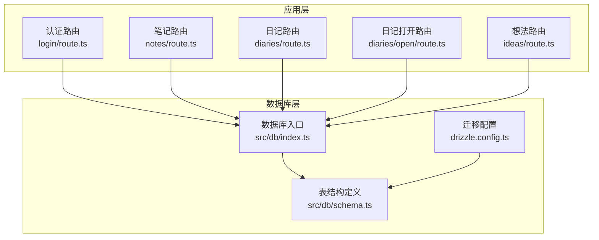
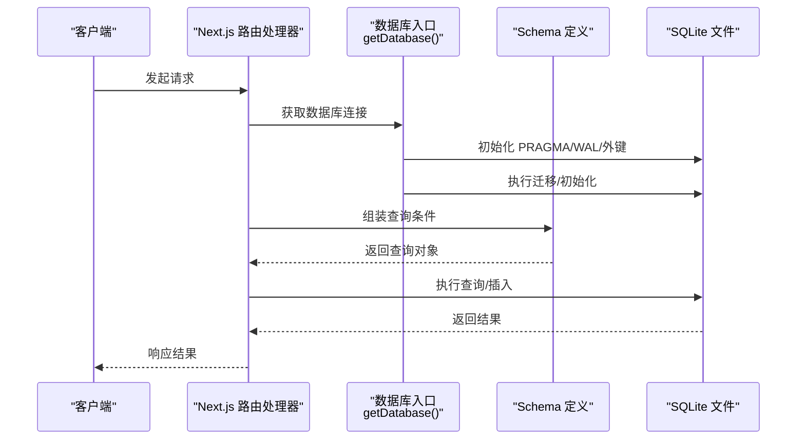
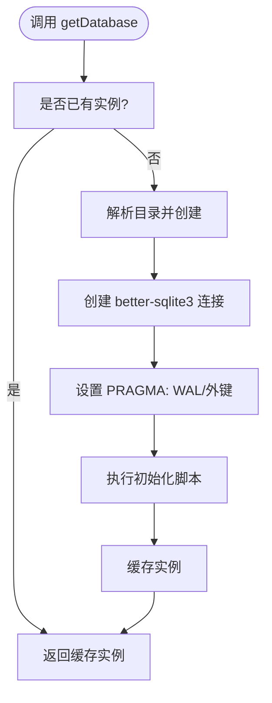
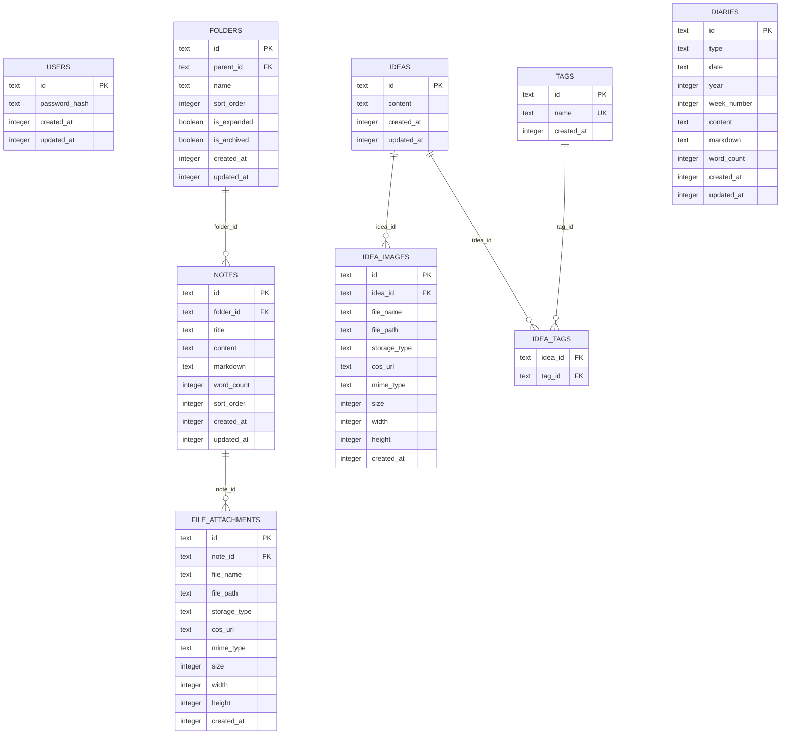
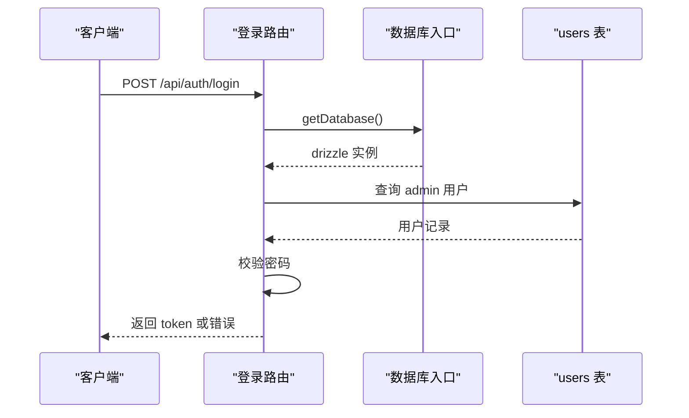
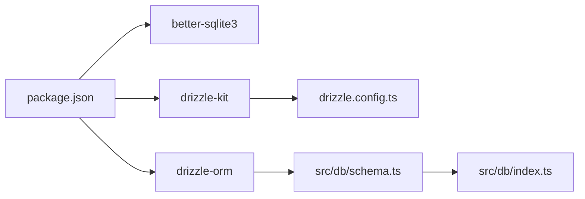
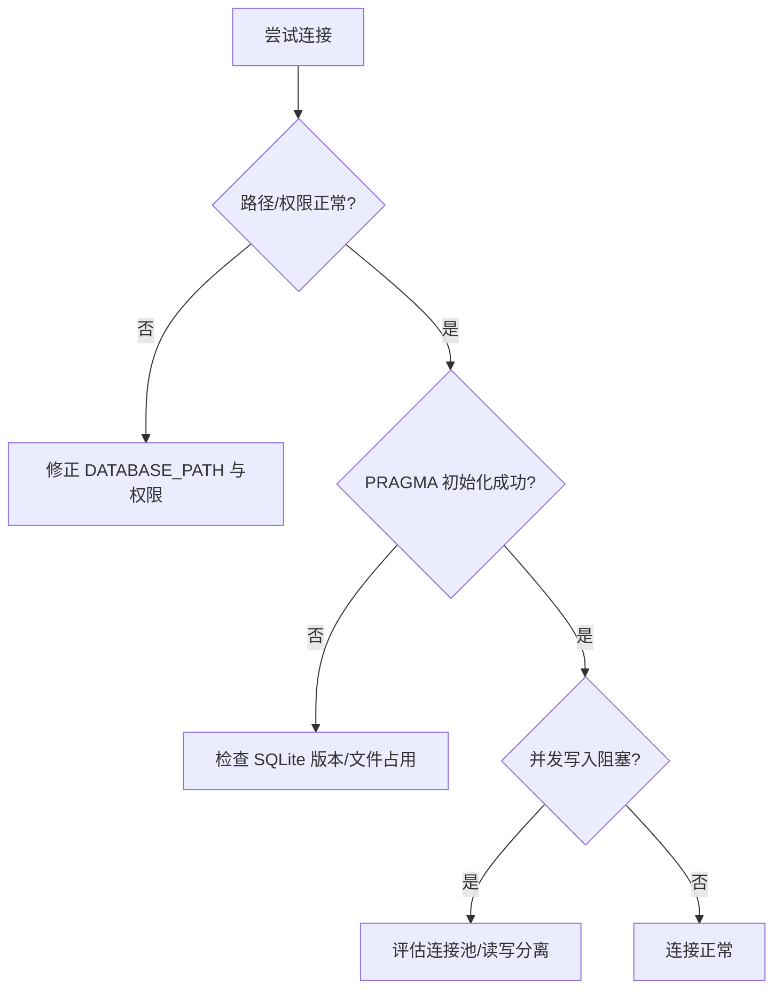
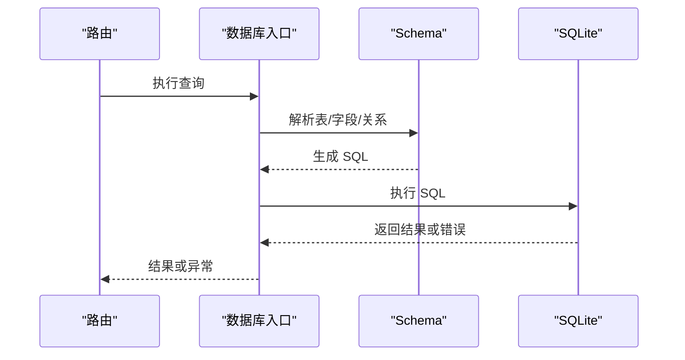

# 数据库问题

<cite>
**本文引用的文件**
- [drizzle.config.ts](file://drizzle.config.ts)
- [package.json](file://package.json)
- [src/db/index.ts](file://src/db/index.ts)
- [src/db/schema.ts](file://src/db/schema.ts)
- [src/app/api/auth/login/route.ts](file://src/app/api/auth/login/route.ts)
- [src/app/api/diaries/open/route.ts](file://src/app/api/diaries/open/route.ts)
- [src/app/api/diaries/route.ts](file://src/app/api/diaries/route.ts)
- [src/app/api/notes/route.ts](file://src/app/api/notes/route.ts)
- [src/app/api/ideas/route.ts](file://src/app/api/ideas/route.ts)
- [src/lib/rate-limit.ts](file://src/lib/rate-limit.ts)
</cite>

## 目录
1. [简介](#简介)
2. [项目结构](#项目结构)
3. [核心组件](#核心组件)
4. [架构总览](#架构总览)
5. [详细组件分析](#详细组件分析)
6. [依赖关系分析](#依赖关系分析)
7. [性能考量](#性能考量)
8. [故障排除指南](#故障排除指南)
9. [结论](#结论)
10. [附录](#附录)

## 简介
本指南聚焦于 SQLite 数据库在本项目中的使用与常见问题的系统性排查方法，涵盖以下方面：
- SQLite 连接失败：数据库文件权限、路径配置、WAL 模式与外键约束初始化
- Drizzle ORM 查询错误：SQL 语法错误与表结构不匹配的诊断
- 数据库迁移失败：版本冲突与约束违反的排查步骤
- 数据读写异常：事务回滚与并发访问问题的定位与修复
- 性能问题：诊断工具与优化建议（基于现有 WAL 配置与索引）

## 项目结构
本项目的数据库层由 Drizzle ORM + better-sqlite3 驱动组成，采用单例连接与内嵌 SQLite 文件存储。Drizzle 的 schema 定义与迁移配置位于 src/db 与 drizzle.config.ts；API 路由通过 getDatabase 获取连接实例执行查询。

**图表来源**
- [src/db/index.ts:1-171](file://src/db/index.ts#L1-L171)
- [src/db/schema.ts:1-105](file://src/db/schema.ts#L1-L105)
- [drizzle.config.ts:1-8](file://drizzle.config.ts#L1-L8)
- [src/app/api/auth/login/route.ts:1-63](file://src/app/api/auth/login/route.ts#L1-L63)
- [src/app/api/notes/route.ts:1-86](file://src/app/api/notes/route.ts#L1-L86)
- [src/app/api/diaries/route.ts:1-45](file://src/app/api/diaries/route.ts#L1-L45)
- [src/app/api/diaries/open/route.ts:1-129](file://src/app/api/diaries/open/route.ts#L1-L129)
- [src/app/api/ideas/route.ts:1-42](file://src/app/api/ideas/route.ts#L1-L42)

**章节来源**
- [src/db/index.ts:1-171](file://src/db/index.ts#L1-L171)
- [src/db/schema.ts:1-105](file://src/db/schema.ts#L1-L105)
- [drizzle.config.ts:1-8](file://drizzle.config.ts#L1-L8)

## 核心组件
- 数据库入口与连接初始化
  - 单例连接：通过 getDatabase 返回 drizzle 实例，避免重复创建连接
  - 路径与目录：根据 DATABASE_PATH 自动创建目录，确保可写
  - PRAGMA 初始化：启用 WAL 模式与外键约束
  - 内置迁移：按需添加列与初始化管理员用户
- Drizzle Schema
  - 定义 users、folders、notes、file_attachments、ideas、idea_images、tags、idea_tags、diaries 等表及索引
- 迁移配置
  - 使用 drizzle-kit 生成 SQLite 迁移，输出到 migrations 目录
- API 路由
  - 登录、日记、笔记、想法等路由均通过 getDatabase 执行查询

**章节来源**
- [src/db/index.ts:8-25](file://src/db/index.ts#L8-L25)
- [src/db/index.ts:160-168](file://src/db/index.ts#L160-L168)
- [src/db/schema.ts:1-105](file://src/db/schema.ts#L1-L105)
- [drizzle.config.ts:1-8](file://drizzle.config.ts#L1-L8)
- [src/app/api/auth/login/route.ts:35-36](file://src/app/api/auth/login/route.ts#L35-L36)
- [src/app/api/diaries/route.ts:8-34](file://src/app/api/diaries/route.ts#L8-L34)
- [src/app/api/notes/route.ts:12-34](file://src/app/api/notes/route.ts#L12-L34)
- [src/app/api/ideas/route.ts:9-41](file://src/app/api/ideas/route.ts#L9-L41)

## 架构总览
下图展示从 API 请求到数据库查询的整体流程，以及数据库初始化的关键步骤。

**图表来源**
- [src/db/index.ts:10-25](file://src/db/index.ts#L10-L25)
- [src/db/index.ts:27-158](file://src/db/index.ts#L27-L158)
- [src/db/schema.ts:1-105](file://src/db/schema.ts#L1-L105)
- [src/app/api/auth/login/route.ts:35-36](file://src/app/api/auth/login/route.ts#L35-L36)

## 详细组件分析

### 数据库入口与初始化
- 单例连接：首次调用时创建连接并缓存，后续直接复用
- 路径与目录：解析 DATABASE_PATH 所在目录，不存在则递归创建
- PRAGMA 设置：启用 WAL 模式与外键约束，提升并发与一致性
- 初始化脚本：创建核心表与索引，检查并添加缺失列，初始化管理员用户
- 连接池：better-sqlite3 默认为单连接，无内置连接池参数

**图表来源**
- [src/db/index.ts:10-25](file://src/db/index.ts#L10-L25)
- [src/db/index.ts:27-158](file://src/db/index.ts#L27-L158)
- [src/db/index.ts:160-168](file://src/db/index.ts#L160-L168)

**章节来源**
- [src/db/index.ts:8-25](file://src/db/index.ts#L8-L25)
- [src/db/index.ts:160-168](file://src/db/index.ts#L160-L168)

### Drizzle Schema 与表结构
- 表与字段：users、folders、notes、file_attachments、ideas、idea_images、tags、idea_tags、diaries
- 关系：外键约束与级联策略（如 cascade、set null）
- 索引：常用查询字段建立索引以提升性能
- 类型映射：integer(mode="number") 映射时间戳

**图表来源**
- [src/db/schema.ts:1-105](file://src/db/schema.ts#L1-L105)

**章节来源**
- [src/db/schema.ts:1-105](file://src/db/schema.ts#L1-L105)

### 迁移配置与生成
- 配置项：方言为 sqlite，schema 路径，迁移输出目录
- 工具链：drizzle-kit 用于生成迁移文件

**章节来源**
- [drizzle.config.ts:1-8](file://drizzle.config.ts#L1-L8)
- [package.json:111](file://package.json#L111)

### API 路由与数据库交互
- 登录路由：从 users 表查询管理员记录，校验密码后签发令牌
- 日记路由：按年份查询日记列表，支持排序
- 笔记路由：按文件夹或根节点查询笔记，支持排序
- 日记打开路由：校验类型与日期，去重后插入新记录

**图表来源**
- [src/app/api/auth/login/route.ts:35-36](file://src/app/api/auth/login/route.ts#L35-L36)
- [src/db/index.ts:160-168](file://src/db/index.ts#L160-L168)

**章节来源**
- [src/app/api/auth/login/route.ts:1-63](file://src/app/api/auth/login/route.ts#L1-L63)
- [src/app/api/diaries/route.ts:1-45](file://src/app/api/diaries/route.ts#L1-L45)
- [src/app/api/notes/route.ts:1-86](file://src/app/api/notes/route.ts#L1-L86)
- [src/app/api/diaries/open/route.ts:1-129](file://src/app/api/diaries/open/route.ts#L1-L129)

## 依赖关系分析
- 运行时依赖
  - better-sqlite3：SQLite 驱动
  - drizzle-orm：ORM 层
  - drizzle-kit：迁移工具
- 开发依赖
  - @types/better-sqlite3、@types/node 等类型声明

**图表来源**
- [package.json:58-66](file://package.json#L58-L66)
- [package.json:111](file://package.json#L111)
- [drizzle.config.ts:1-8](file://drizzle.config.ts#L1-L8)
- [src/db/schema.ts:1-105](file://src/db/schema.ts#L1-L105)
- [src/db/index.ts:1-3](file://src/db/index.ts#L1-L3)

**章节来源**
- [package.json:58-66](file://package.json#L58-L66)
- [package.json:111](file://package.json#L111)

## 性能考量
- WAL 模式：已启用，提升并发读取与写入吞吐
- 外键约束：已启用，保证参照完整性
- 索引：对常用过滤与排序字段建立索引（如 diaries 的 year、week_number、type-date 组合唯一索引）
- 连接模型：单连接，适合本项目轻量场景；若并发高，可考虑连接池方案

**章节来源**
- [src/db/index.ts:17-18](file://src/db/index.ts#L17-L18)
- [src/db/index.ts:127-129](file://src/db/index.ts#L127-L129)
- [src/db/schema.ts:93-104](file://src/db/schema.ts#L93-L104)

## 故障排除指南

### 一、SQLite 数据库连接失败
常见原因与解决步骤：
- 数据库文件权限不足
  - 现象：连接抛出权限错误或无法写入
  - 排查：确认 DATABASE_PATH 指向的数据库文件与父目录具备读写权限
  - 解决：调整文件/目录权限或更换到有权限的路径
- 路径配置错误
  - 现象：找不到数据库文件或无法创建目录
  - 排查：检查 DATABASE_PATH 环境变量；确认目录存在且可写
  - 解决：修正环境变量或手动创建目录
- WAL 模式与外键初始化失败
  - 现象：PRAGMA 设置报错或迁移失败
  - 排查：确认 SQLite 版本与 better-sqlite3 兼容；检查数据库文件是否被其他进程占用
  - 解决：关闭占用进程或更换数据库文件位置
- 连接池问题
  - 现象：并发写入阻塞或锁竞争
  - 排查：当前实现为单连接；高并发下可能出现阻塞
  - 解决：评估升级为连接池或拆分读写

**图表来源**
- [src/db/index.ts:8-25](file://src/db/index.ts#L8-L25)
- [src/db/index.ts:17-18](file://src/db/index.ts#L17-L18)
- [src/db/index.ts:160-168](file://src/db/index.ts#L160-L168)

**章节来源**
- [src/db/index.ts:8-25](file://src/db/index.ts#L8-L25)
- [src/db/index.ts:17-18](file://src/db/index.ts#L17-L18)
- [src/db/index.ts:160-168](file://src/db/index.ts#L160-L168)

### 二、Drizzle ORM 查询错误诊断
- SQL 语法错误
  - 现象：运行时报 SQL 语法错误
  - 排查：核对 schema 中字段名与类型；确认查询条件与表达式正确
  - 参考：schema 定义与路由中查询组装逻辑
- 表结构不匹配
  - 现象：字段缺失、类型不一致、索引缺失导致查询异常
  - 排查：确认数据库已执行初始化脚本；必要时重新生成迁移并应用
  - 参考：初始化脚本与迁移配置

**图表来源**
- [src/db/schema.ts:1-105](file://src/db/schema.ts#L1-L105)
- [src/app/api/diaries/route.ts:20-34](file://src/app/api/diaries/route.ts#L20-L34)
- [src/app/api/notes/route.ts:15-34](file://src/app/api/notes/route.ts#L15-L34)
- [src/app/api/ideas/route.ts:17-41](file://src/app/api/ideas/route.ts#L17-L41)

**章节来源**
- [src/db/schema.ts:1-105](file://src/db/schema.ts#L1-L105)
- [src/app/api/diaries/route.ts:20-34](file://src/app/api/diaries/route.ts#L20-L34)
- [src/app/api/notes/route.ts:15-34](file://src/app/api/notes/route.ts#L15-L34)
- [src/app/api/ideas/route.ts:17-41](file://src/app/api/ideas/route.ts#L17-L41)

### 三、数据库迁移失败排查
- 版本冲突
  - 现象：迁移文件与当前数据库状态不一致
  - 排查：查看 migrations 目录与数据库元信息；确认迁移顺序
  - 解决：备份数据库后重置迁移状态并重新应用
- 约束违反
  - 现象：新增列或索引时违反现有数据约束
  - 排查：检查初始化脚本与 schema 差异；确认数据清理或兼容性处理
  - 参考：初始化脚本中的列检查与迁移逻辑

**章节来源**
- [drizzle.config.ts:1-8](file://drizzle.config.ts#L1-L8)
- [src/db/index.ts:132-140](file://src/db/index.ts#L132-L140)

### 四、数据读写异常
- 事务回滚
  - 现状：better-sqlite3 默认单连接，无显式事务封装
  - 建议：在需要强一致性的场景封装事务块；注意并发写入的锁等待
- 并发访问问题
  - 现象：高并发写入阻塞
  - 建议：评估连接池或读写分离；减少长事务；优化热点表写入

**章节来源**
- [src/db/index.ts:17-18](file://src/db/index.ts#L17-L18)
- [src/app/api/diaries/open/route.ts:122-128](file://src/app/api/diaries/open/route.ts#L122-L128)

### 五、性能问题诊断与优化
- 诊断工具
  - 检查索引使用：确认查询是否命中索引（如 diaries 的 year、week_number、type-date）
  - 观察 WAL 行为：确认 WAL 文件大小与检查点频率
- 优化建议
  - 合理使用索引：避免过度索引导致写入开销增大
  - 控制查询范围：限制返回字段与数量，使用分页或游标
  - 降低并发写入压力：合并写入、批量提交

**章节来源**
- [src/db/index.ts:127-129](file://src/db/index.ts#L127-L129)
- [src/db/schema.ts:93-104](file://src/db/schema.ts#L93-L104)

## 结论
本项目采用轻量级 SQLite + Drizzle ORM 架构，通过单例连接与 WAL/外键初始化保障基本一致性与并发能力。针对连接失败、查询错误、迁移失败与性能问题，建议从路径权限、schema 对齐、索引设计与并发控制等方面系统排查，并结合 WAL 与索引策略进行优化。

## 附录
- 常用排查清单
  - 确认 DATABASE_PATH 指向的文件与目录具备读写权限
  - 核对 schema 与数据库实际结构一致
  - 检查初始化脚本是否成功执行
  - 评估并发写入与索引策略
  - 使用 drizzle-kit 生成并应用迁移