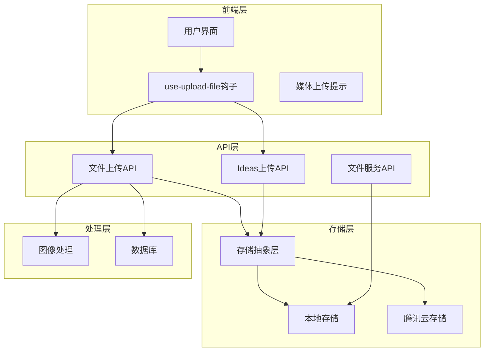
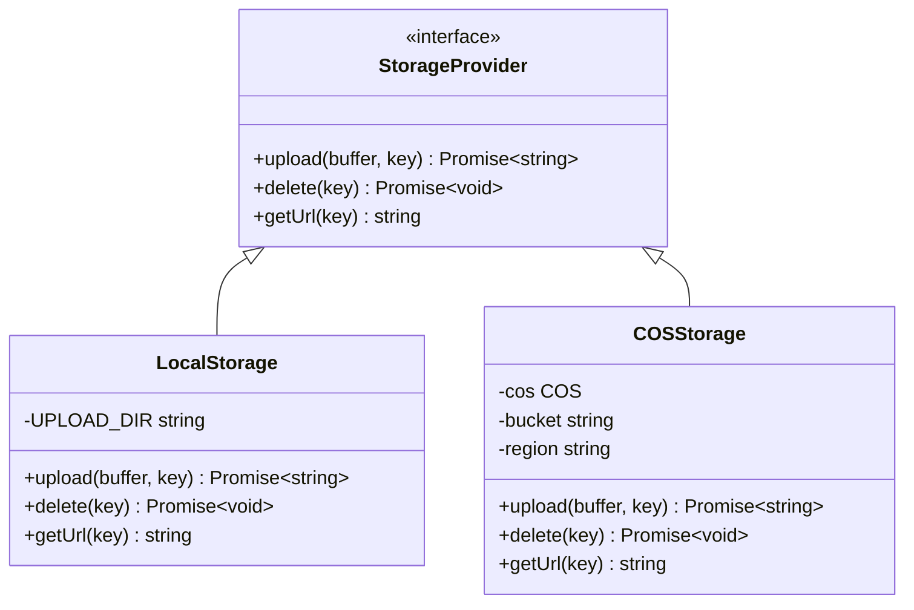
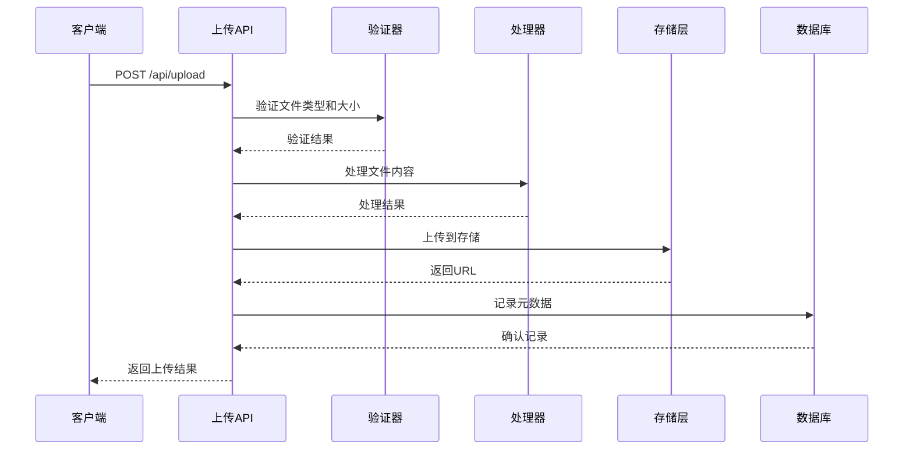
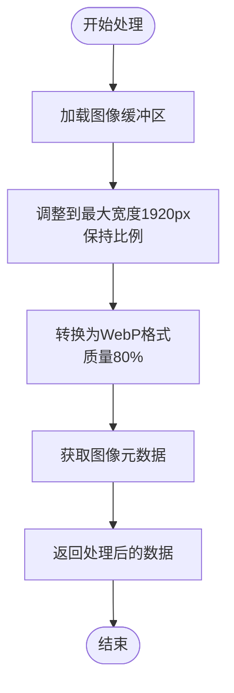
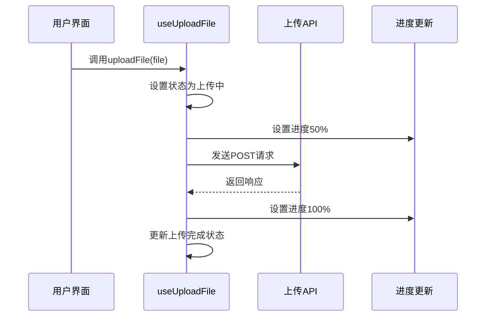
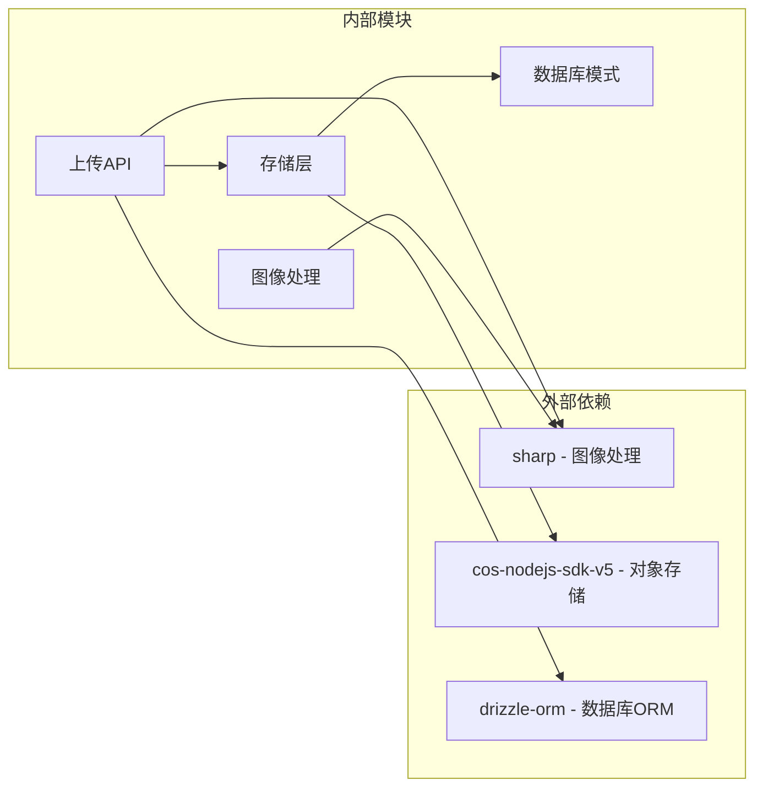
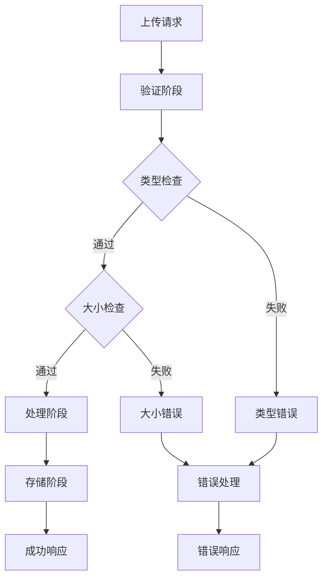

# 文件上传问题

<cite>
**本文档引用的文件**
- [src/app/api/upload/route.ts](file://src/app/api/upload/route.ts)
- [src/app/api/ideas/upload/route.ts](file://src/app/api/ideas/upload/route.ts)
- [src/app/api/files/[...path]/route.ts](file://src/app/api/files/[...path]/route.ts)
- [src/hooks/use-upload-file.ts](file://src/hooks/use-upload-file.ts)
- [src/lib/storage/index.ts](file://src/lib/storage/index.ts)
- [src/lib/storage/local.ts](file://src/lib/storage/local.ts)
- [src/lib/storage/cos.ts](file://src/lib/storage/cos.ts)
- [src/lib/image-process.ts](file://src/lib/image-process.ts)
- [src/components/ui/media-upload-toast.tsx](file://src/components/ui/media-upload-toast.tsx)
- [src/db/schema.ts](file://src/db/schema.ts)
</cite>

## 目录
1. [简介](#简介)
2. [项目结构](#项目结构)
3. [核心组件](#核心组件)
4. [架构概览](#架构概览)
5. [详细组件分析](#详细组件分析)
6. [依赖关系分析](#依赖关系分析)
7. [性能考虑](#性能考虑)
8. [故障排除指南](#故障排除指南)
9. [结论](#结论)

## 简介

本指南专注于ynote-v2项目中的文件上传系统故障排除。该系统支持多种文件类型的上传、存储和管理，包括图片、视频、音频和文档。系统采用双存储后端（本地存储和腾讯云对象存储），并提供了完整的错误处理和用户反馈机制。

## 项目结构

文件上传功能主要分布在以下模块中：



**图表来源**
- [src/app/api/upload/route.ts:1-153](file://src/app/api/upload/route.ts#L1-L153)
- [src/lib/storage/index.ts:1-30](file://src/lib/storage/index.ts#L1-L30)
- [src/lib/storage/local.ts:1-29](file://src/lib/storage/local.ts#L1-L29)
- [src/lib/storage/cos.ts:1-62](file://src/lib/storage/cos.ts#L1-L62)

**章节来源**
- [src/app/api/upload/route.ts:1-153](file://src/app/api/upload/route.ts#L1-L153)
- [src/app/api/ideas/upload/route.ts:1-66](file://src/app/api/ideas/upload/route.ts#L1-L66)
- [src/app/api/files/[...path]/route.ts](file://src/app/api/files/[...path]/route.ts#L1-L48)

## 核心组件

### 上传API组件

系统提供了两个主要的上传接口：

1. **通用文件上传** (`/api/upload`)
   - 支持图片、视频、音频、文档四种类型
   - 不同类型有不同的大小限制
   - 图片自动转换为WebP格式

2. **Ideas专用上传** (`/api/ideas/upload`)
   - 专门用于想法图片上传
   - 固定10MB大小限制
   - 统一输出WebP格式

### 存储抽象层



**图表来源**
- [src/lib/storage/index.ts:1-30](file://src/lib/storage/index.ts#L1-L30)
- [src/lib/storage/local.ts:1-29](file://src/lib/storage/local.ts#L1-L29)
- [src/lib/storage/cos.ts:1-62](file://src/lib/storage/cos.ts#L1-L62)

**章节来源**
- [src/lib/storage/index.ts:1-30](file://src/lib/storage/index.ts#L1-L30)
- [src/lib/storage/local.ts:1-29](file://src/lib/storage/local.ts#L1-L29)
- [src/lib/storage/cos.ts:1-62](file://src/lib/storage/cos.ts#L1-L62)

## 架构概览

文件上传系统采用分层架构设计，确保了良好的可维护性和扩展性：



**图表来源**
- [src/app/api/upload/route.ts:50-152](file://src/app/api/upload/route.ts#L50-L152)
- [src/lib/storage/index.ts:12-29](file://src/lib/storage/index.ts#L12-L29)

## 详细组件分析

### 文件验证组件

系统实现了严格的文件验证机制，包括类型检查和大小限制：

| 文件类型 | 最大大小 | 允许的MIME类型 |
|---------|---------|---------------|
| 图片 | 10MB | image/png, image/jpeg, image/gif, image/webp, image/svg+xml |
| 视频 | 100MB | video/mp4, video/webm, video/ogg, video/quicktime |
| 音频 | 50MB | 多种音频格式 |
| 文档 | 50MB | PDF, Markdown, Office文档等 |

**章节来源**
- [src/app/api/upload/route.ts:8-48](file://src/app/api/upload/route.ts#L8-L48)

### 图像处理组件



**图表来源**
- [src/lib/image-process.ts:3-20](file://src/lib/image-process.ts#L3-L20)

**章节来源**
- [src/lib/image-process.ts:1-21](file://src/lib/image-process.ts#L1-L21)

### 前端上传组件

前端使用自定义Hook实现文件上传功能，提供基本的进度跟踪：



**图表来源**
- [src/hooks/use-upload-file.ts:16-43](file://src/hooks/use-upload-file.ts#L16-L43)

**章节来源**
- [src/hooks/use-upload-file.ts:1-53](file://src/hooks/use-upload-file.ts#L1-L53)

## 依赖关系分析

系统的关键依赖关系如下：



**图表来源**
- [src/app/api/upload/route.ts:1-6](file://src/app/api/upload/route.ts#L1-L6)
- [src/lib/storage/cos.ts:1-2](file://src/lib/storage/cos.ts#L1-L2)
- [src/lib/image-process.ts](file://src/lib/image-process.ts#L1)

**章节来源**
- [src/app/api/upload/route.ts:1-6](file://src/app/api/upload/route.ts#L1-L6)
- [src/lib/storage/cos.ts:1-2](file://src/lib/storage/cos.ts#L1-L2)
- [src/lib/image-process.ts](file://src/lib/image-process.ts#L1)

## 性能考虑

### 存储优化策略

1. **智能存储选择**
   - 检测环境变量决定存储后端
   - 自动在本地存储和云存储间切换

2. **图像压缩优化**
   - 最大宽度1920px限制
   - WebP格式80%质量压缩
   - 减少存储空间和带宽消耗

3. **缓存策略**
   - 文件服务设置长期缓存
   - 公共缓存控制头

### 错误恢复机制

系统实现了多层次的错误处理：



**图表来源**
- [src/app/api/upload/route.ts:50-152](file://src/app/api/upload/route.ts#L50-L152)

## 故障排除指南

### 文件大小限制问题

**常见症状**
- 上传大文件时出现"文件大小超出限制"错误
- 图片上传被拒绝但视频可以正常上传

**诊断步骤**
1. 确认文件类型和对应的大小限制
   - 图片：10MB
   - 视频：100MB  
   - 音频：50MB
   - 文档：50MB

2. 检查文件实际大小
   ```bash
   # 使用ls命令查看文件大小
   ls -lh filename
   ```

3. 验证MIME类型是否正确
   ```bash
   # 检查文件MIME类型
   file --mime-type filename
   ```

**解决方案**
- 对于超大文件，考虑分块上传策略
- 将大视频转换为更高效的编码格式
- 检查浏览器文件选择器的过滤设置

**章节来源**
- [src/app/api/upload/route.ts:8-82](file://src/app/api/upload/route.ts#L8-L82)

### 文件格式不支持问题

**常见症状**
- 上传特定格式文件时报"不支持的文件类型"
- Office文档无法上传
- PDF文件被拒绝

**诊断步骤**
1. 验证文件的实际MIME类型
2. 检查文件扩展名是否与内容匹配
3. 确认文件头部魔数正确

**支持的文件类型**

| 文件类别 | 支持的MIME类型 |
|---------|---------------|
| 图片 | image/png, image/jpeg, image/gif, image/webp, image/svg+xml |
| 视频 | video/mp4, video/webm, video/ogg, video/quicktime |
| 音频 | audio/mpeg, audio/wav, audio/ogg, audio/aac, audio/flac, audio/m4a, audio/x-m4a, audio/webm |
| 文档 | application/pdf, text/markdown, text/x-markdown, text/plain, application/zip, application/x-zip-compressed, application/x-rar-compressed, application/x-7z-compressed, application/gzip, application/x-gzip, application/x-tar, application/x-bzip2, application/msword, application/vnd.openxmlformats-officedocument.wordprocessingml.document, application/vnd.ms-excel, application/vnd.openxmlformats-officedocument.spreadsheetml.sheet, application/vnd.ms-powerpoint, application/vnd.openxmlformats-officedocument.presentationml.presentation |

**解决方案**
- 确保文件具有正确的MIME类型
- 检查文件扩展名
- 对于特殊格式，考虑转换为标准格式

**章节来源**
- [src/app/api/upload/route.ts:13-48](file://src/app/api/upload/route.ts#L13-L48)

### 权限问题排查

**常见症状**
- 上传成功但文件无法访问
- 403禁止访问错误
- 404文件不存在错误

**诊断步骤**
1. 检查上传目录权限
   ```bash
   # 检查data/uploads目录权限
   ls -la data/
   ls -la data/uploads/
   ```

2. 验证目录存在性
   ```bash
   # 确认目录结构
   find data/uploads -type d
   ```

3. 检查存储后端配置
   ```bash
   # 检查环境变量
   echo $COS_SECRET_ID
   echo $COS_BUCKET
   ```

**解决方案**
- 确保data/uploads目录存在且可写
- 检查目录权限设置（建议755）
- 验证腾讯云存储配置参数

**章节来源**
- [src/lib/storage/local.ts:5-15](file://src/lib/storage/local.ts#L5-L15)
- [src/lib/storage/cos.ts:16-23](file://src/lib/storage/cos.ts#L16-L23)

### 上传进度异常问题

**常见症状**
- 进度条卡在50%
- 上传过程中断
- 无进度反馈

**诊断步骤**
1. 检查前端hook的状态管理
   - `isUploading`状态
   - `progress`进度值
   - `uploadingFile`当前文件

2. 验证网络连接稳定性
   ```bash
   # 测试网络连接
   ping localhost
   curl -I http://localhost:3000/api/upload
   ```

3. 检查服务器日志
   ```bash
   # 查看Next.js服务器日志
   npm run dev
   ```

**解决方案**
- 实现更精确的进度跟踪
- 添加重试机制
- 优化网络请求配置

**章节来源**
- [src/hooks/use-upload-file.ts:16-43](file://src/hooks/use-upload-file.ts#L16-L43)

### 文件存储路径问题

**常见症状**
- 文件上传后找不到存储位置
- 目录遍历攻击防护触发
- 路径解析错误

**诊断步骤**
1. 检查路径解析逻辑
   - 确认使用`path.resolve()`防止目录遍历
   - 验证路径前缀检查

2. 验证存储键生成
   ```typescript
   // 检查日期格式和ID生成
   const now = new Date();
   const year = now.getFullYear();
   const month = String(now.getMonth() + 1).padStart(2, "0");
   const id = nanoid();
   const key = `${year}/${month}/${id}.${ext}`;
   ```

3. 确认目录结构
   ```
   data/uploads/
   ├── 2024/
   │   ├── 01/
   │   │   ├── abc123.webp
   │   │   └── def456.jpg
   │   └── 02/
   │     └── ghi789.png
   ```

**解决方案**
- 确保所有中间目录都存在
- 检查磁盘空间充足
- 验证路径权限设置

**章节来源**
- [src/app/api/files/[...path]/route.ts](file://src/app/api/files/[...path]/route.ts#L11-L23)
- [src/lib/storage/local.ts:8-16](file://src/lib/storage/local.ts#L8-L16)

### 文件预览和下载失败

**常见症状**
- 上传成功但无法预览
- 下载链接无效
- MIME类型识别错误

**诊断步骤**
1. 检查MIME类型映射
   - 图片文件的MIME类型映射
   - 扩展名与MIME类型的对应关系

2. 验证缓存头设置
   - `Cache-Control: public, max-age=31536000, immutable`
   - 长期缓存策略

3. 确认文件服务路由
   - `/api/files/[...path]`路由配置
   - 目录遍历防护机制

**解决方案**
- 扩展MIME类型支持
- 检查文件扩展名提取逻辑
- 验证缓存配置

**章节来源**
- [src/app/api/files/[...path]/route.ts](file://src/app/api/files/[...path]/route.ts#L28-L42)

### 大文件上传优化策略

**性能优化建议**

1. **分块上传**
   - 将大文件分割为多个小块
   - 支持断点续传
   - 提高网络稳定性

2. **并发处理**
   - 并发处理多个文件
   - 异步存储操作
   - 避免阻塞主线程

3. **内存管理**
   - 流式处理大文件
   - 及时释放内存
   - 监控内存使用

4. **错误恢复**
   - 自动重试机制
   - 失败回滚
   - 状态持久化

**章节来源**
- [src/app/api/upload/route.ts:84-126](file://src/app/api/upload/route.ts#L84-L126)

### 缓存问题处理

**常见症状**
- 文件更新后仍显示旧版本
- 浏览器缓存导致的问题
- CDN缓存同步延迟

**诊断步骤**
1. 检查缓存头设置
   - `Cache-Control: public, max-age=31536000, immutable`
   - 长期缓存策略

2. 验证文件版本控制
   - 文件名包含时间戳
   - 版本号管理

3. 检查CDN配置
   - 缓存刷新策略
   - 缓存失效规则

**解决方案**
- 实施版本化文件命名
- 添加缓存清理机制
- 配置适当的缓存策略

**章节来源**
- [src/app/api/files/[...path]/route.ts](file://src/app/api/files/[...path]/route.ts#L37-L42)

## 结论

文件上传系统通过严格的验证机制、灵活的存储策略和完善的错误处理，为用户提供可靠的文件管理功能。主要优势包括：

1. **多格式支持**：全面支持图片、视频、音频和文档上传
2. **智能存储**：自动在本地和云存储间切换
3. **性能优化**：图像压缩和缓存策略提升用户体验
4. **安全防护**：目录遍历攻击防护和类型验证
5. **错误处理**：多层次的错误捕获和用户反馈

通过遵循本指南的故障排除步骤，可以有效解决大部分文件上传相关问题，并为进一步优化系统性能提供指导。