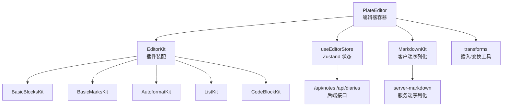
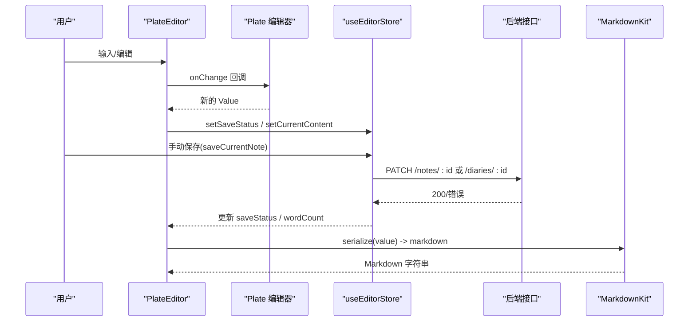
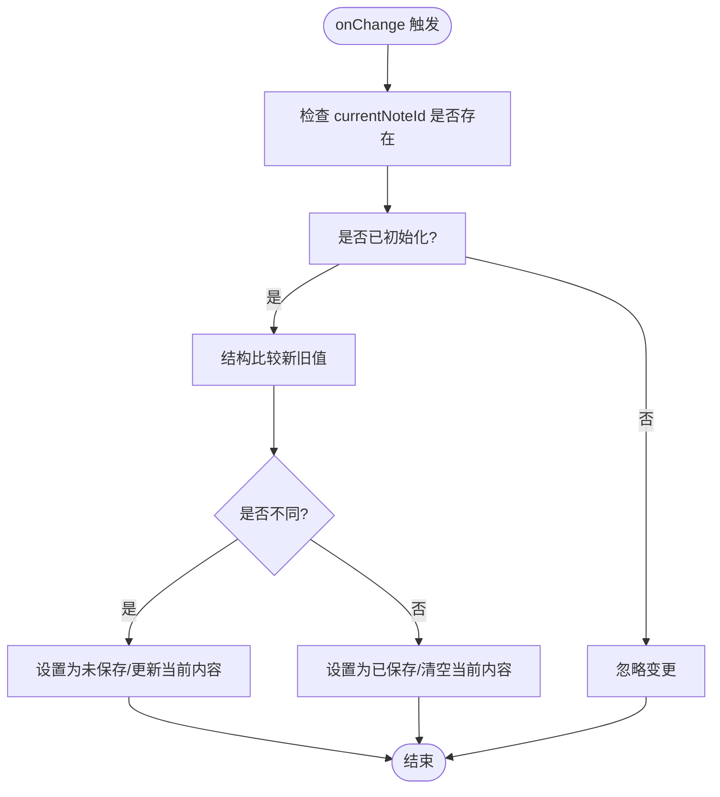
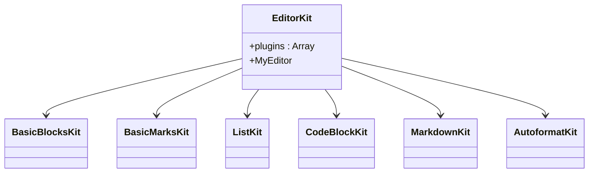
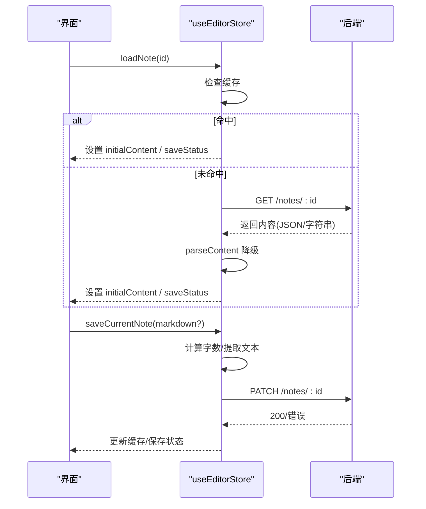
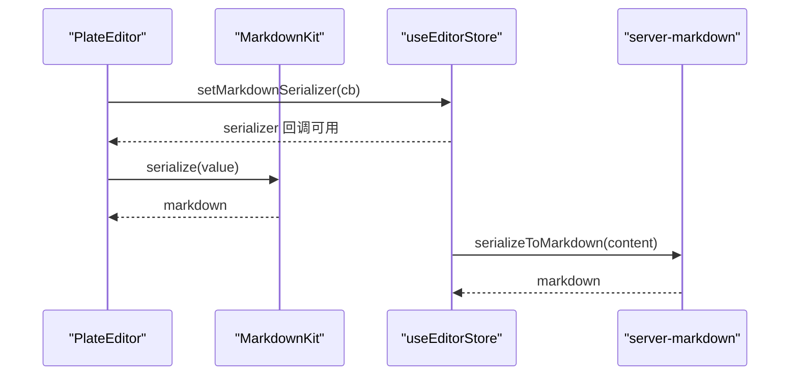
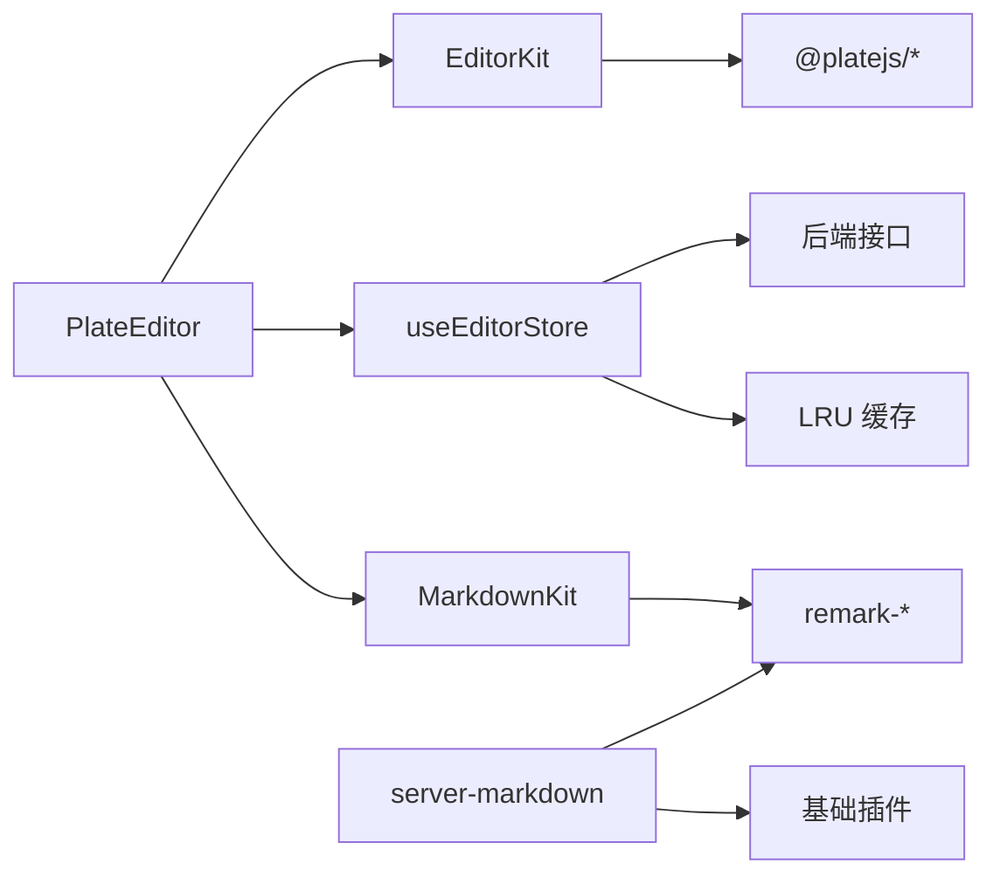

# 编辑器问题

<cite>
**本文引用的文件**
- [src/components/editor/plate-editor.tsx](file://src/components/editor/plate-editor.tsx)
- [src/components/editor/editor-kit.tsx](file://src/components/editor/editor-kit.tsx)
- [src/stores/editor-store.ts](file://src/stores/editor-store.ts)
- [src/lib/server-markdown.ts](file://src/lib/server-markdown.ts)
- [src/components/editor/plugins/markdown-kit.tsx](file://src/components/editor/plugins/markdown-kit.tsx)
- [src/components/editor/plate-types.ts](file://src/components/editor/plate-types.ts)
- [src/components/editor/transforms.ts](file://src/components/editor/transforms.ts)
- [src/components/editor/plugins/basic-blocks-kit.tsx](file://src/components/editor/plugins/basic-blocks-kit.tsx)
- [src/components/editor/plugins/basic-marks-kit.tsx](file://src/components/editor/plugins/basic-marks-kit.tsx)
- [src/components/editor/plugins/autoformat-kit.tsx](file://src/components/editor/plugins/autoformat-kit.tsx)
- [src/components/editor/plugins/list-kit.tsx](file://src/components/editor/plugins/list-kit.tsx)
- [src/components/editor/plugins/code-block-kit.tsx](file://src/components/editor/plugins/code-block-kit.tsx)
- [src/types/index.ts](file://src/types/index.ts)
</cite>

## 目录
1. [简介](#简介)
2. [项目结构](#项目结构)
3. [核心组件](#核心组件)
4. [架构总览](#架构总览)
5. [详细组件分析](#详细组件分析)
6. [依赖分析](#依赖分析)
7. [性能考虑](#性能考虑)
8. [故障排除指南](#故障排除指南)
9. [结论](#结论)
10. [附录](#附录)

## 简介
本指南聚焦于基于 Plate.js 的富文本编辑器在 ynote-v2 中的常见问题与排障实践，涵盖以下主题：
- 内容丢失、格式错误与插件冲突的定位与修复
- 编辑器状态同步（Zustand）与组件重渲染问题的诊断
- Markdown 转换错误（服务端/客户端）的排查步骤
- 大文档处理与内存泄漏预防的性能优化
- 兼容性与浏览器特定错误的处理建议

## 项目结构
编辑器相关的核心文件组织如下：
- 编辑器容器与变更监听：PlateEditor
- 插件装配：EditorKit（聚合各功能插件）
- 状态管理：Zustand 编辑器 Store（加载/保存/缓存/序列化回调）
- Markdown 序列化：客户端 MarkdownKit 与服务端 server-markdown
- 类型系统：plate-types 定义节点与值类型
- 变换工具：transforms 提供块/内联插入与类型切换
- 插件示例：basic-blocks、basic-marks、autoformat、list、code-block 等

图表来源
- [src/components/editor/plate-editor.tsx:63-175](file://src/components/editor/plate-editor.tsx#L63-L175)
- [src/components/editor/editor-kit.tsx:36-78](file://src/components/editor/editor-kit.tsx#L36-L78)
- [src/stores/editor-store.ts:88-281](file://src/stores/editor-store.ts#L88-L281)
- [src/components/editor/plugins/markdown-kit.tsx:5-11](file://src/components/editor/plugins/markdown-kit.tsx#L5-L11)
- [src/lib/server-markdown.ts:85-108](file://src/lib/server-markdown.ts#L85-L108)
- [src/components/editor/transforms.ts:87-193](file://src/components/editor/transforms.ts#L87-L193)
- [src/components/editor/plugins/basic-blocks-kit.tsx:27-88](file://src/components/editor/plugins/basic-blocks-kit.tsx#L27-L88)
- [src/components/editor/plugins/basic-marks-kit.tsx:19-41](file://src/components/editor/plugins/basic-marks-kit.tsx#L19-L41)
- [src/components/editor/plugins/autoformat-kit.tsx:211-236](file://src/components/editor/plugins/autoformat-kit.tsx#L211-L236)
- [src/components/editor/plugins/list-kit.tsx:9-26](file://src/components/editor/plugins/list-kit.tsx#L9-L26)
- [src/components/editor/plugins/code-block-kit.tsx:18-26](file://src/components/editor/plugins/code-block-kit.tsx#L18-L26)

章节来源
- [src/components/editor/plate-editor.tsx:63-175](file://src/components/editor/plate-editor.tsx#L63-L175)
- [src/components/editor/editor-kit.tsx:36-78](file://src/components/editor/editor-kit.tsx#L36-L78)
- [src/stores/editor-store.ts:88-281](file://src/stores/editor-store.ts#L88-L281)

## 核心组件
- PlateEditor：负责初始化 Plate 编辑器、监听内容变更、切换笔记时重置编辑器、设置 Markdown 序列化回调、滚动到顶部等。
- EditorKit：集中装配所有插件（元素/标记/块样式/编辑/解析/UI），统一对外暴露 MyEditor 类型。
- useEditorStore：Zustand 状态，管理当前笔记 ID、初始内容、当前编辑内容、Markdown 序列化回调、保存状态、字数统计、加载状态与 LRU 内容缓存；提供加载笔记/日记、手动保存、缓存失效等能力。
- MarkdownKit：客户端 Markdown 解析/序列化配置（remark 插件链）。
- server-markdown：服务端专用的 Markdown 序列化工具，使用基础插件与 remark 链生成 Markdown 字符串。
- plate-types：自定义节点与值类型定义，确保编辑器内部数据结构稳定。
- transforms：块/内联插入与块类型切换的高层封装。

章节来源
- [src/components/editor/plate-editor.tsx:63-175](file://src/components/editor/plate-editor.tsx#L63-L175)
- [src/components/editor/editor-kit.tsx:36-78](file://src/components/editor/editor-kit.tsx#L36-L78)
- [src/stores/editor-store.ts:88-281](file://src/stores/editor-store.ts#L88-L281)
- [src/components/editor/plugins/markdown-kit.tsx:5-11](file://src/components/editor/plugins/markdown-kit.tsx#L5-L11)
- [src/lib/server-markdown.ts:85-108](file://src/lib/server-markdown.ts#L85-L108)
- [src/components/editor/plate-types.ts:148-164](file://src/components/editor/plate-types.ts#L148-L164)
- [src/components/editor/transforms.ts:87-193](file://src/components/editor/transforms.ts#L87-L193)

## 架构总览
编辑器采用“容器 + 插件装配 + 状态管理 + 序列化”的分层设计：
- 容器层：PlateEditor 负责生命周期与变更监听，避免跨笔记状态污染。
- 插件层：EditorKit 将各功能插件组合，形成统一的编辑体验。
- 状态层：useEditorStore 统一管理加载、保存、缓存与序列化回调。
- 序列化层：客户端 MarkdownKit 与服务端 server-markdown 分别满足前端即时导出与后端批量转换需求。

图表来源
- [src/components/editor/plate-editor.tsx:84-99](file://src/components/editor/plate-editor.tsx#L84-L99)
- [src/stores/editor-store.ts:204-275](file://src/stores/editor-store.ts#L204-L275)
- [src/components/editor/plugins/markdown-kit.tsx:5-11](file://src/components/editor/plugins/markdown-kit.tsx#L5-L11)

## 详细组件分析

### 组件 A：PlateEditor（编辑器容器）
- 关键职责
  - 初始化编辑器并注入 EditorKit
  - 监听内容变更，通过自定义结构比较函数判断是否需要保存
  - 切换笔记时重置编辑器状态（清空历史、取消选区、滚动到顶部）
  - 设置 Markdown 序列化回调，供保存流程使用
- 结构比较逻辑
  - 自定义相等性判断，避免深度 JSON 比较带来的性能开销
  - 递归比较节点与子节点，支持文本节点与对象节点
- 注意事项
  - 使用 isInitializedRef 与 requestAnimationFrame 避免切换笔记时的竞态
  - 清理 editor.history 与 editor.selection，防止跨笔记状态残留

图表来源
- [src/components/editor/plate-editor.tsx:84-99](file://src/components/editor/plate-editor.tsx#L84-L99)
- [src/components/editor/plate-editor.tsx:16-61](file://src/components/editor/plate-editor.tsx#L16-L61)

章节来源
- [src/components/editor/plate-editor.tsx:63-175](file://src/components/editor/plate-editor.tsx#L63-L175)
- [src/components/editor/plate-editor.tsx:16-61](file://src/components/editor/plate-editor.tsx#L16-L61)

### 组件 B：EditorKit（插件装配）
- 职责
  - 聚合元素、标记、块样式、编辑、解析、UI 等插件
  - 统一导出 MyEditor 类型，便于上层约束
- 建议
  - 新增插件时遵循“先元素/标记，再块样式，再编辑，再解析，最后 UI”的顺序
  - 对于复杂插件（如表格、数学公式、媒体），确保配套 UI 组件正确注册

图表来源
- [src/components/editor/editor-kit.tsx:36-78](file://src/components/editor/editor-kit.tsx#L36-L78)
- [src/components/editor/plugins/basic-blocks-kit.tsx:27-88](file://src/components/editor/plugins/basic-blocks-kit.tsx#L27-L88)
- [src/components/editor/plugins/basic-marks-kit.tsx:19-41](file://src/components/editor/plugins/basic-marks-kit.tsx#L19-L41)
- [src/components/editor/plugins/list-kit.tsx:9-26](file://src/components/editor/plugins/list-kit.tsx#L9-L26)
- [src/components/editor/plugins/code-block-kit.tsx:18-26](file://src/components/editor/plugins/code-block-kit.tsx#L18-L26)
- [src/components/editor/plugins/markdown-kit.tsx:5-11](file://src/components/editor/plugins/markdown-kit.tsx#L5-L11)
- [src/components/editor/plugins/autoformat-kit.tsx:211-236](file://src/components/editor/plugins/autoformat-kit.tsx#L211-L236)

章节来源
- [src/components/editor/editor-kit.tsx:36-78](file://src/components/editor/editor-kit.tsx#L36-L78)

### 组件 C：useEditorStore（Zustand 状态）
- 关键字段
  - currentNoteId、editingType、initialContent、currentContent、markdownSerializer、saveStatus、wordCount、contentCache
- 加载与保存流程
  - loadNote/loadDiary：优先命中缓存，否则从 API 获取并写入缓存
  - saveCurrentNote：序列化为 JSON，计算字数，调用后端 PATCH 接口；可选传入 markdown 或由 serializer 生成
- 缓存策略
  - LRU：超过阈值时删除最久未访问项
  - parseContent：对异常 JSON 进行降级处理

图表来源
- [src/stores/editor-store.ts:114-155](file://src/stores/editor-store.ts#L114-L155)
- [src/stores/editor-store.ts:157-198](file://src/stores/editor-store.ts#L157-L198)
- [src/stores/editor-store.ts:204-275](file://src/stores/editor-store.ts#L204-L275)
- [src/stores/editor-store.ts:66-77](file://src/stores/editor-store.ts#L66-L77)
- [src/stores/editor-store.ts:79-86](file://src/stores/editor-store.ts#L79-L86)

章节来源
- [src/stores/editor-store.ts:88-281](file://src/stores/editor-store.ts#L88-L281)

### 组件 D：Markdown 序列化（客户端与服务端）
- 客户端
  - MarkdownKit：启用 MarkdownPlugin 并配置 remark 插件链（数学、GFM、MDX、提及等）
  - PlateEditor 在挂载时设置 serializer 回调，供保存流程使用
- 服务端
  - server-markdown：使用基础插件（无 React 组件）与相同 remark 链，创建编辑器并序列化
  - 支持带标题前缀的序列化，避免重复标题

图表来源
- [src/components/editor/plate-editor.tsx:146-153](file://src/components/editor/plate-editor.tsx#L146-L153)
- [src/components/editor/plugins/markdown-kit.tsx:5-11](file://src/components/editor/plugins/markdown-kit.tsx#L5-L11)
- [src/lib/server-markdown.ts:85-108](file://src/lib/server-markdown.ts#L85-L108)

章节来源
- [src/components/editor/plugins/markdown-kit.tsx:5-11](file://src/components/editor/plugins/markdown-kit.tsx#L5-L11)
- [src/lib/server-markdown.ts:85-108](file://src/lib/server-markdown.ts#L85-L108)
- [src/components/editor/plate-editor.tsx:146-153](file://src/components/editor/plate-editor.tsx#L146-L153)

### 组件 E：类型系统（plate-types）
- 定义了丰富的节点类型（标题、段落、代码块、表格、图片、链接、提及、列表等）与 RichText 类型
- MyValue 作为编辑器顶层值类型，确保上层组件与插件的数据契约一致

章节来源
- [src/components/editor/plate-types.ts:148-164](file://src/components/editor/plate-types.ts#L148-L164)

### 组件 F：变换工具（transforms）
- 提供块/内联插入与块类型切换的高层封装
- insertBlock：根据类型映射插入相应节点，支持 upsert 与自动清理空块
- setBlockType：批量切换块类型，处理列表属性与特殊类型（代码块、三栏布局等）

章节来源
- [src/components/editor/transforms.ts:87-193](file://src/components/editor/transforms.ts#L87-L193)

## 依赖分析
- 组件耦合
  - PlateEditor 依赖 EditorKit、useEditorStore、MarkdownKit
  - EditorKit 依赖各功能插件模块
  - useEditorStore 依赖后端接口与缓存策略
  - server-markdown 依赖基础插件与 remark 生态
- 潜在循环依赖
  - 当前文件组织以“容器 → 插件 → 工具/类型”单向依赖为主，未见明显循环
- 外部依赖
  - Plate.js、@platejs/*、remark-*、lowlight 等

图表来源
- [src/components/editor/plate-editor.tsx:63-175](file://src/components/editor/plate-editor.tsx#L63-L175)
- [src/components/editor/editor-kit.tsx:36-78](file://src/components/editor/editor-kit.tsx#L36-L78)
- [src/stores/editor-store.ts:88-281](file://src/stores/editor-store.ts#L88-L281)
- [src/components/editor/plugins/markdown-kit.tsx:5-11](file://src/components/editor/plugins/markdown-kit.tsx#L5-L11)
- [src/lib/server-markdown.ts:85-108](file://src/lib/server-markdown.ts#L85-L108)

章节来源
- [src/components/editor/plate-editor.tsx:63-175](file://src/components/editor/plate-editor.tsx#L63-L175)
- [src/components/editor/editor-kit.tsx:36-78](file://src/components/editor/editor-kit.tsx#L36-L78)
- [src/stores/editor-store.ts:88-281](file://src/stores/editor-store.ts#L88-L281)

## 性能考虑
- 大文档处理
  - 使用结构比较替代 JSON 深度比较，减少变更检测成本
  - 切换笔记时清空历史与选区，避免跨笔记状态导致的额外重绘
  - 合理拆分长文档，必要时延迟渲染或虚拟化
- 内存泄漏预防
  - 卸载时清理 Markdown 序列化回调（PlateEditor 的 useEffect 返回值）
  - 控制缓存大小（MAX_CACHE_SIZE），定期淘汰最久未使用条目
  - 避免在编辑器实例上累积过多历史记录（切换笔记时清空）
- 渲染优化
  - 将重型插件（如代码高亮、数学公式）按需加载
  - 使用 React.memo 或稳定引用避免不必要的子组件重渲染

## 故障排除指南

### 1. 内容丢失
- 症状
  - 切换笔记后，编辑器显示旧内容或出现“幽灵”内容
- 诊断
  - 检查 PlateEditor 是否在笔记变化时重置编辑器（清空历史、取消选区、滚动到顶部）
  - 确认 baselineContentRef 是否在保存后正确更新
- 解决
  - 确保笔记切换 useEffect 正常执行
  - 保存成功后，使用编辑器当前 children 更新 baselineContentRef

章节来源
- [src/components/editor/plate-editor.tsx:101-136](file://src/components/editor/plate-editor.tsx#L101-L136)
- [src/components/editor/plate-editor.tsx:138-144](file://src/components/editor/plate-editor.tsx#L138-L144)

### 2. 格式错误
- 症状
  - 自动格式化不生效、快捷键无效、列表/代码块状态异常
- 诊断
  - 检查 AutoformatKit 的规则与查询条件（禁止在代码块内自动格式化）
  - 确认 ListKit 与 CodeBlockKit 的注册顺序与组件映射
- 解决
  - 调整 AutoformatKit 规则匹配与优先级
  - 确保 ListPlugin 注入目标插件列表包含期望的块类型

章节来源
- [src/components/editor/plugins/autoformat-kit.tsx:211-236](file://src/components/editor/plugins/autoformat-kit.tsx#L211-L236)
- [src/components/editor/plugins/list-kit.tsx:9-26](file://src/components/editor/plugins/list-kit.tsx#L9-L26)
- [src/components/editor/plugins/code-block-kit.tsx:18-26](file://src/components/editor/plugins/code-block-kit.tsx#L18-L26)

### 3. 插件冲突
- 症状
  - 某些快捷键或菜单行为相互干扰
- 诊断
  - 检查 EditorKit 中插件顺序与覆盖关系
  - 确认同一节点类型是否被多个插件同时处理
- 解决
  - 调整插件装配顺序，确保高优先级插件在前
  - 为冲突插件提供明确的 query/condition 以避免重复处理

章节来源
- [src/components/editor/editor-kit.tsx:36-78](file://src/components/editor/editor-kit.tsx#L36-L78)

### 4. 编辑器状态同步问题（Zustand）
- 症状
  - 保存状态与 UI 不一致、字数统计异常、缓存未更新
- 诊断
  - 检查 saveCurrentNote 的状态流转（saving → saved/error）
  - 确认 contentCache 的写入时机与淘汰策略
- 解决
  - 在保存成功后更新缓存并设置 saveStatus
  - 对异常情况设置 saveStatus 为 error，并提示用户重试

章节来源
- [src/stores/editor-store.ts:204-275](file://src/stores/editor-store.ts#L204-L275)
- [src/stores/editor-store.ts:66-77](file://src/stores/editor-store.ts#L66-L77)

### 5. 组件重新渲染问题
- 症状
  - 编辑器频繁重渲染导致性能下降
- 诊断
  - 检查传递给 PlateEditor 的 props 是否稳定（如 initialContent 引用）
  - 确认 handleChange 的依赖数组是否正确
- 解决
  - 使用 useMemo/useCallback 稳定回调与值
  - 避免在每次渲染中创建新的 Value 引用

章节来源
- [src/components/editor/plate-editor.tsx:84-99](file://src/components/editor/plate-editor.tsx#L84-L99)

### 6. Markdown 转换错误
- 症状
  - 保存时无法生成/导出 Markdown，或服务端转换为空字符串
- 诊断
  - 客户端：确认 MarkdownKit 的 remark 插件链与 PlateEditor 的 serializer 设置
  - 服务端：确认 server-markdown 的基础插件与输入内容合法性
- 解决
  - 在保存流程中捕获序列化异常并回退或提示
  - 对服务端输入进行 JSON 校验与降级处理

章节来源
- [src/components/editor/plugins/markdown-kit.tsx:5-11](file://src/components/editor/plugins/markdown-kit.tsx#L5-L11)
- [src/components/editor/plate-editor.tsx:146-153](file://src/components/editor/plate-editor.tsx#L146-L153)
- [src/lib/server-markdown.ts:85-108](file://src/lib/server-markdown.ts#L85-L108)

### 7. 兼容性与浏览器特定错误
- 症状
  - 某些浏览器下编辑器卡顿、快捷键失效、粘贴异常
- 诊断
  - 检查低版本浏览器对现代 JS/Canvas/MathML 的支持
  - 确认 remark 插件链在目标环境下的可用性
- 解决
  - 为低版本浏览器提供 polyfill 与降级方案
  - 对高开销插件（如数学公式、媒体）按需加载

## 结论
通过结构化的插件装配、稳定的 Zustand 状态管理、完善的 Markdown 序列化与缓存策略，以及针对性能与兼容性的优化手段，可以有效降低 Plate.js 编辑器在实际应用中的问题发生率。遇到问题时，建议按“容器 → 插件 → 状态 → 序列化 → 兼容性”的路径逐层排查，结合本文提供的图示与步骤快速定位并解决。

## 附录
- 相关类型定义参考：[src/types/index.ts:33-33](file://src/types/index.ts#L33-L33)