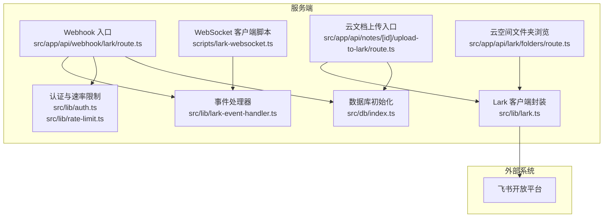
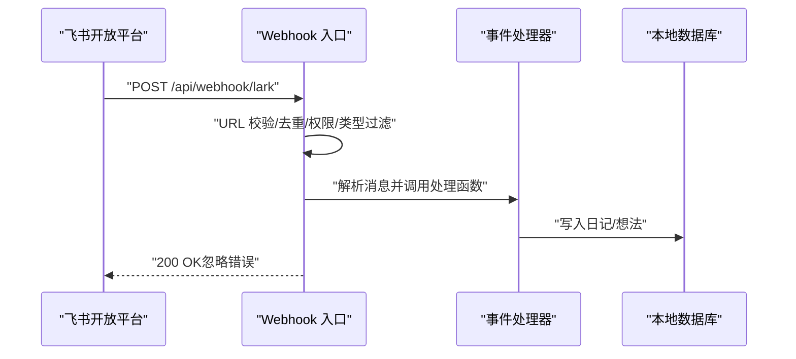
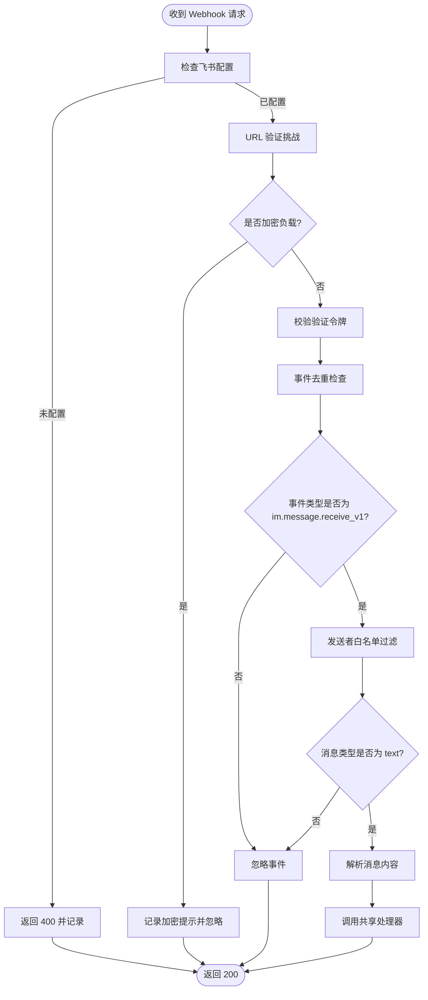
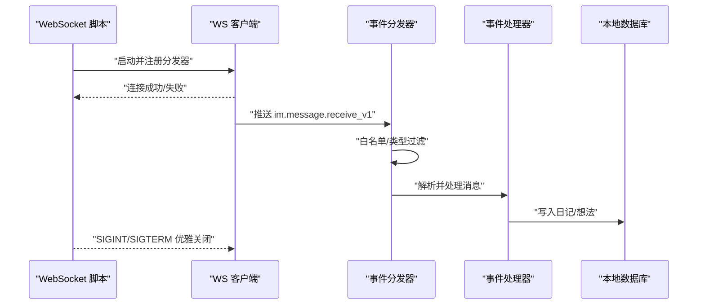
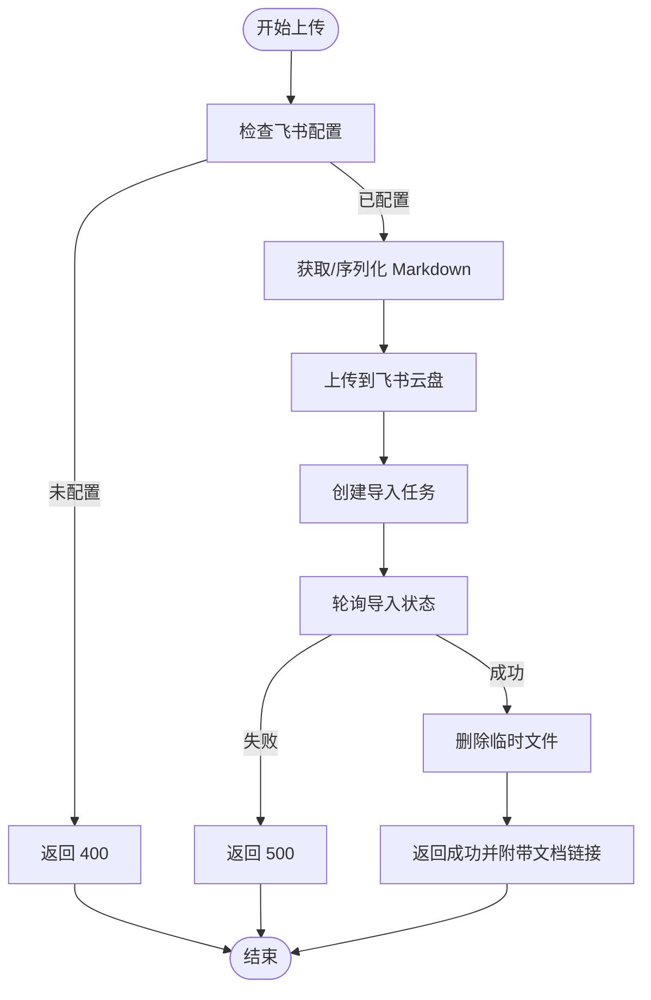
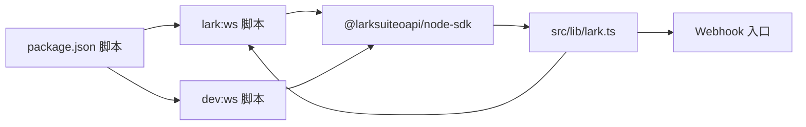

# 飞书集成问题

<cite>
**本文引用的文件**
- [src/lib/lark.ts](file://src/lib/lark.ts)
- [src/lib/lark-event-handler.ts](file://src/lib/lark-event-handler.ts)
- [src/app/api/webhook/lark/route.ts](file://src/app/api/webhook/lark/route.ts)
- [scripts/lark-websocket.ts](file://scripts/lark-websocket.ts)
- [src/app/api/lark/folders/route.ts](file://src/app/api/lark/folders/route.ts)
- [src/app/api/notes/[id]/upload-to-lark/route.ts](file://src/app/api/notes/[id]/upload-to-lark/route.ts)
- [package.json](file://package.json)
- [src/lib/auth.ts](file://src/lib/auth.ts)
- [src/lib/rate-limit.ts](file://src/lib/rate-limit.ts)
- [src/db/index.ts](file://src/db/index.ts)
</cite>

## 目录
1. [简介](#简介)
2. [项目结构](#项目结构)
3. [核心组件](#核心组件)
4. [架构总览](#架构总览)
5. [详细组件分析](#详细组件分析)
6. [依赖关系分析](#依赖关系分析)
7. [性能与稳定性考量](#性能与稳定性考量)
8. [故障排除指南](#故障排除指南)
9. [结论](#结论)
10. [附录](#附录)

## 简介
本指南聚焦于飞书集成的常见问题与排障方法，覆盖以下方面：
- 飞书 API 调用失败：认证配置、权限范围、API 限制
- WebSocket 连接问题：网络防火墙、代理、连接超时
- Webhook 事件处理失败：回调地址验证、消息格式错误
- 云文档同步异常：版本冲突、内容差异
- 调试工具与监控：日志级别、事件去重、速率限制
- 常见错误代码与含义：结合源码中的错误处理逻辑进行解读

## 项目结构
飞书集成相关代码主要分布在以下模块：
- 集成配置与客户端封装：src/lib/lark.ts
- 事件处理器（共享逻辑）：src/lib/lark-event-handler.ts
- Webhook 入口：src/app/api/webhook/lark/route.ts
- WebSocket 客户端脚本：scripts/lark-websocket.ts
- 云文档上传与导入：src/app/api/notes/[id]/upload-to-lark/route.ts
- 云空间文件夹浏览：src/app/api/lark/folders/route.ts
- 认证与速率限制：src/lib/auth.ts、src/lib/rate-limit.ts
- 数据库初始化与表结构：src/db/index.ts
- 启动脚本与开发命令：package.json

图表来源
- [src/app/api/webhook/lark/route.ts:1-106](file://src/app/api/webhook/lark/route.ts#L1-L106)
- [src/lib/lark-event-handler.ts:1-126](file://src/lib/lark-event-handler.ts#L1-L126)
- [src/lib/lark.ts:1-367](file://src/lib/lark.ts#L1-L367)
- [scripts/lark-websocket.ts:1-109](file://scripts/lark-websocket.ts#L1-L109)
- [src/app/api/notes/[id]/upload-to-lark/route.ts:240-327](file://src/app/api/notes/[id]/upload-to-lark/route.ts#L240-L327)
- [src/app/api/lark/folders/route.ts:1-99](file://src/app/api/lark/folders/route.ts#L1-L99)
- [src/lib/auth.ts:1-26](file://src/lib/auth.ts#L1-L26)
- [src/lib/rate-limit.ts:1-41](file://src/lib/rate-limit.ts#L1-L41)
- [src/db/index.ts:1-171](file://src/db/index.ts#L1-L171)

章节来源
- [src/lib/lark.ts:1-367](file://src/lib/lark.ts#L1-L367)
- [src/lib/lark-event-handler.ts:1-126](file://src/lib/lark-event-handler.ts#L1-L126)
- [src/app/api/webhook/lark/route.ts:1-106](file://src/app/api/webhook/lark/route.ts#L1-L106)
- [scripts/lark-websocket.ts:1-109](file://scripts/lark-websocket.ts#L1-L109)
- [src/app/api/lark/folders/route.ts:1-99](file://src/app/api/lark/folders/route.ts#L1-L99)
- [src/app/api/notes/[id]/upload-to-lark/route.ts:240-327](file://src/app/api/notes/[id]/upload-to-lark/route.ts#L240-L327)
- [src/lib/auth.ts:1-26](file://src/lib/auth.ts#L1-L26)
- [src/lib/rate-limit.ts:1-41](file://src/lib/rate-limit.ts#L1-L41)
- [src/db/index.ts:1-171](file://src/db/index.ts#L1-L171)
- [package.json:1-119](file://package.json#L1-L119)

## 核心组件
- 飞书客户端与配置
  - 提供获取 Lark 客户端、WebSocket 客户端、校验配置、读取验证令牌、允许用户集合、加密密钥等能力
  - 支持两种事件模式：Webhook 与 WebSocket
- 事件处理器
  - 解析消息文本，路由到日记或想法处理逻辑，并持久化到本地数据库
- Webhook 入口
  - 实现 URL 校验、事件去重、消息解密开关、权限过滤、事件类型过滤、消息内容解析与处理
- WebSocket 客户端脚本
  - 独立运行的长连接客户端，支持事件分发器、自动重连、优雅关闭
- 云文档上传与导入
  - 生成 Markdown 内容，上传到飞书云空间，创建导入任务并轮询状态，最终清理临时文件
- 云空间文件夹浏览
  - 递归列出云空间文件夹树并按路径排序
- 认证与速率限制
  - JWT 签发与校验、基于 IP 的速率限制
- 数据库
  - 初始化表结构、索引与迁移，保证日记、想法等数据的存储

章节来源
- [src/lib/lark.ts:1-367](file://src/lib/lark.ts#L1-L367)
- [src/lib/lark-event-handler.ts:1-126](file://src/lib/lark-event-handler.ts#L1-L126)
- [src/app/api/webhook/lark/route.ts:1-106](file://src/app/api/webhook/lark/route.ts#L1-L106)
- [scripts/lark-websocket.ts:1-109](file://scripts/lark-websocket.ts#L1-L109)
- [src/app/api/lark/folders/route.ts:1-99](file://src/app/api/lark/folders/route.ts#L1-L99)
- [src/app/api/notes/[id]/upload-to-lark/route.ts:240-327](file://src/app/api/notes/[id]/upload-to-lark/route.ts#L240-L327)
- [src/lib/auth.ts:1-26](file://src/lib/auth.ts#L1-L26)
- [src/lib/rate-limit.ts:1-41](file://src/lib/rate-limit.ts#L1-L41)
- [src/db/index.ts:1-171](file://src/db/index.ts#L1-L171)

## 架构总览
飞书集成采用“双通道”事件接收模式：
- Webhook：通过 Next.js API 接收飞书回调，进行校验与处理
- WebSocket：独立脚本建立长连接，实时接收事件并处理

图表来源
- [src/app/api/webhook/lark/route.ts:28-105](file://src/app/api/webhook/lark/route.ts#L28-L105)
- [src/lib/lark-event-handler.ts:104-125](file://src/lib/lark-event-handler.ts#L104-L125)
- [src/db/index.ts:142-157](file://src/db/index.ts#L142-L157)

章节来源
- [src/app/api/webhook/lark/route.ts:1-106](file://src/app/api/webhook/lark/route.ts#L1-L106)
- [src/lib/lark-event-handler.ts:1-126](file://src/lib/lark-event-handler.ts#L1-L126)
- [src/db/index.ts:1-171](file://src/db/index.ts#L1-L171)

## 详细组件分析

### 组件一：Webhook 事件处理
- 关键流程
  - URL 验证挑战
  - 配置可用性检查
  - 加密负载检测与提示
  - v2.0 验证令牌比对
  - 事件去重（内存 Map，5 分钟 TTL）
  - 事件类型过滤（仅 im.message.receive_v1）
  - 发送者白名单过滤
  - 文本消息过滤与内容解析
  - 调用共享事件处理器
- 错误处理
  - 捕获异常后统一返回 200，避免重复投递
  - 日志记录便于定位问题

图表来源
- [src/app/api/webhook/lark/route.ts:28-105](file://src/app/api/webhook/lark/route.ts#L28-L105)

章节来源
- [src/app/api/webhook/lark/route.ts:1-106](file://src/app/api/webhook/lark/route.ts#L1-L106)

### 组件二：WebSocket 事件处理
- 关键流程
  - 加载环境变量并校验配置
  - 注册事件分发器（im.message.receive_v1）
  - 白名单过滤与文本消息过滤
  - 调用共享事件处理器
  - 自动重连与优雅关闭
- 错误处理
  - 连接失败直接退出进程
  - 处理异常记录日志

图表来源
- [scripts/lark-websocket.ts:38-108](file://scripts/lark-websocket.ts#L38-L108)
- [src/lib/lark-event-handler.ts:104-125](file://src/lib/lark-event-handler.ts#L104-L125)

章节来源
- [scripts/lark-websocket.ts:1-109](file://scripts/lark-websocket.ts#L1-L109)
- [src/lib/lark-event-handler.ts:1-126](file://src/lib/lark-event-handler.ts#L1-L126)

### 组件三：云文档上传与导入
- 关键流程
  - 校验配置
  - 获取笔记 Markdown 或序列化内容
  - 生成 Buffer 并上传到飞书云盘
  - 创建导入任务并轮询状态
  - 成功后删除临时 Markdown 文件
- 错误处理
  - 捕获异常并返回 500
  - 详细日志记录便于排障

图表来源
- [src/app/api/notes/[id]/upload-to-lark/route.ts:240-327](file://src/app/api/notes/[id]/upload-to-lark/route.ts#L240-L327)
- [src/lib/lark.ts:102-130](file://src/lib/lark.ts#L102-L130)

章节来源
- [src/app/api/notes/[id]/upload-to-lark/route.ts:240-327](file://src/app/api/notes/[id]/upload-to-lark/route.ts#L240-L327)
- [src/lib/lark.ts:1-367](file://src/lib/lark.ts#L1-L367)

### 组件四：云空间文件夹浏览
- 关键流程
  - 递归拉取文件夹列表，支持分页
  - 过滤出文件夹并拼接路径
  - 按路径排序返回
- 错误处理
  - 异常捕获并记录，返回 500

章节来源
- [src/app/api/lark/folders/route.ts:1-99](file://src/app/api/lark/folders/route.ts#L1-L99)

### 组件五：认证与速率限制
- 认证
  - JWT 签发与校验，支持自定义密钥与过期时间
- 速率限制
  - 基于 IP 的 15 分钟窗口，最多 5 次尝试
  - 定期清理过期条目

章节来源
- [src/lib/auth.ts:1-26](file://src/lib/auth.ts#L1-L26)
- [src/lib/rate-limit.ts:1-41](file://src/lib/rate-limit.ts#L1-L41)

## 依赖关系分析
- 飞书 SDK
  - 使用官方 Node SDK 进行客户端与 WebSocket 交互
- 开发脚本
  - lark:ws：独立运行 WebSocket 客户端
  - dev:ws：同时启动 Next.js 与 WebSocket 客户端
- 数据库
  - better-sqlite3 + drizzle-orm，初始化表结构与索引

图表来源
- [package.json:5-11](file://package.json#L5-L11)
- [src/lib/lark.ts:1-367](file://src/lib/lark.ts#L1-L367)

章节来源
- [package.json:1-119](file://package.json#L1-L119)
- [src/lib/lark.ts:1-367](file://src/lib/lark.ts#L1-L367)

## 性能与稳定性考量
- 事件去重
  - Webhook 中使用内存 Map 存储事件 ID 及时间戳，TTL 5 分钟，避免重复处理
- 自动重连
  - WebSocket 客户端启用 autoReconnect，提升连接稳定性
- 日志级别
  - SDK 设置 info 级别日志，便于排障
- 速率限制
  - 登录接口使用 IP 限流，防止暴力破解
- 数据库优化
  - WAL 模式与外键约束开启，索引覆盖常用查询字段

章节来源
- [src/app/api/webhook/lark/route.ts:9-25](file://src/app/api/webhook/lark/route.ts#L9-L25)
- [scripts/lark-websocket.ts:74-80](file://scripts/lark-websocket.ts#L74-L80)
- [src/lib/rate-limit.ts:1-41](file://src/lib/rate-limit.ts#L1-L41)
- [src/db/index.ts:17-18](file://src/db/index.ts#L17-L18)

## 故障排除指南

### 一、飞书 API 调用失败
- 常见原因
  - 缺少必要环境变量：LARK_APP_ID、LARK_APP_SECRET
  - 验证令牌不匹配：LARK_VERIFICATION_TOKEN
  - 加密负载未配置：LARK_ENCRYPT_KEY
  - 权限范围不足：仅允许特定用户（LARK_ALLOWED_USER_IDS）
  - API 返回 code 非 0：需根据 msg 字段定位
- 排查步骤
  - 确认 .env 中配置完整且值有效
  - 校验验证令牌与飞书控制台一致
  - 若启用加密，确保 LARK_ENCRYPT_KEY 正确；否则在飞书控制台关闭加密
  - 检查允许用户集合是否包含发送者 open_id
  - 查看日志输出的错误码与消息，结合源码中的错误分支定位
- 相关源码位置
  - 配置检查与客户端初始化：[src/lib/lark.ts:8-23](file://src/lib/lark.ts#L8-L23)
  - 验证令牌与允许用户集合：[src/lib/lark.ts:29-41](file://src/lib/lark.ts#L29-L41)
  - 加密密钥读取：[src/lib/lark.ts:62-64](file://src/lib/lark.ts#L62-L64)
  - Webhook 中的验证与过滤：[src/app/api/webhook/lark/route.ts:32-85](file://src/app/api/webhook/lark/route.ts#L32-L85)

章节来源
- [src/lib/lark.ts:1-367](file://src/lib/lark.ts#L1-L367)
- [src/app/api/webhook/lark/route.ts:1-106](file://src/app/api/webhook/lark/route.ts#L1-L106)

### 二、WebSocket 连接问题
- 常见原因
  - 环境变量缺失导致无法创建客户端
  - 网络受限无法访问飞书 WebSocket 服务器
  - 代理或防火墙阻断
  - 连接超时或被中断
- 排查步骤
  - 确认 LARK_APP_ID、LARK_APP_SECRET 已设置
  - 使用独立脚本运行 WebSocket 客户端，观察连接日志
  - 检查网络连通性与代理设置
  - 观察自动重连行为与优雅关闭信号处理
- 相关源码位置
  - 客户端创建与自动重连：[src/lib/lark.ts:69-84](file://src/lib/lark.ts#L69-L84)
  - 独立脚本启动与事件分发器：[scripts/lark-websocket.ts:38-80](file://scripts/lark-websocket.ts#L38-L80)
  - 连接建立与失败处理：[scripts/lark-websocket.ts:101-108](file://scripts/lark-websocket.ts#L101-L108)

章节来源
- [src/lib/lark.ts:1-367](file://src/lib/lark.ts#L1-L367)
- [scripts/lark-websocket.ts:1-109](file://scripts/lark-websocket.ts#L1-L109)

### 三、Webhook 事件处理失败
- 常见原因
  - 回调地址未通过 URL 验证
  - 验证令牌不匹配
  - 事件重复（去重机制）
  - 事件类型不是 im.message.receive_v1
  - 发送者不在允许列表
  - 消息类型非 text 或内容 JSON 解析失败
  - 加密负载未配置
- 排查步骤
  - 在飞书控制台确认回调地址与验证令牌
  - 检查事件头中的 event_id 是否被去重
  - 确认事件类型与消息类型
  - 核对允许用户集合
  - 若启用加密，配置 LARK_ENCRYPT_KEY 或在飞书控制台关闭加密
- 相关源码位置
  - URL 验证与挑战响应：[src/app/api/webhook/lark/route.ts:32-40](file://src/app/api/webhook/lark/route.ts#L32-L40)
  - 验证令牌比对：[src/app/api/webhook/lark/route.ts:55-60](file://src/app/api/webhook/lark/route.ts#L55-L60)
  - 事件去重：[src/app/api/webhook/lark/route.ts:20-25](file://src/app/api/webhook/lark/route.ts#L20-L25)
  - 类型与内容过滤：[src/app/api/webhook/lark/route.ts:68-94](file://src/app/api/webhook/lark/route.ts#L68-L94)
  - 加密负载提示：[src/app/api/webhook/lark/route.ts:47-53](file://src/app/api/webhook/lark/route.ts#L47-L53)

章节来源
- [src/app/api/webhook/lark/route.ts:1-106](file://src/app/api/webhook/lark/route.ts#L1-L106)

### 四、云文档同步异常
- 常见原因
  - 上传失败或导入任务状态异常
  - 临时 Markdown 文件未清理
  - 目标文件夹路径不存在且创建失败
- 排查步骤
  - 查看上传与导入日志，确认租户令牌获取成功
  - 检查目标文件夹路径是否存在，必要时触发创建
  - 轮询导入状态，确认最终结果
  - 导入完成后检查是否删除临时文件
- 相关源码位置
  - 租户令牌获取与错误处理：[src/lib/lark.ts:102-130](file://src/lib/lark.ts#L102-L130)
  - 文件夹路径确保与创建：[src/lib/lark.ts:278-334](file://src/lib/lark.ts#L278-L334)
  - 上传与导入流程：[src/app/api/notes/[id]/upload-to-lark/route.ts:269-307](file://src/app/api/notes/[id]/upload-to-lark/route.ts#L269-L307)

章节来源
- [src/lib/lark.ts:1-367](file://src/lib/lark.ts#L1-L367)
- [src/app/api/notes/[id]/upload-to-lark/route.ts:240-327](file://src/app/api/notes/[id]/upload-to-lark/route.ts#L240-L327)

### 五、调试工具与监控
- 调试工具
  - 独立 WebSocket 客户端脚本：用于本地实时调试事件
  - 开发脚本组合：同时运行 Next.js 与 WebSocket 客户端
- 监控与日志
  - SDK 日志级别 info，便于观察连接与事件处理
  - Webhook 事件去重（内存 Map），避免重复处理
  - 登录接口速率限制，防止频繁尝试
- 相关源码位置
  - WebSocket 脚本与事件分发器：[scripts/lark-websocket.ts:38-80](file://scripts/lark-websocket.ts#L38-L80)
  - 开发脚本：[package.json:5-11](file://package.json#L5-L11)
  - 事件去重：[src/app/api/webhook/lark/route.ts:9-25](file://src/app/api/webhook/lark/route.ts#L9-L25)
  - 速率限制：[src/lib/rate-limit.ts:21-36](file://src/lib/rate-limit.ts#L21-L36)

章节来源
- [scripts/lark-websocket.ts:1-109](file://scripts/lark-websocket.ts#L1-L109)
- [package.json:1-119](file://package.json#L1-L119)
- [src/app/api/webhook/lark/route.ts:1-106](file://src/app/api/webhook/lark/route.ts#L1-L106)
- [src/lib/rate-limit.ts:1-41](file://src/lib/rate-limit.ts#L1-L41)

### 六、常见错误代码与含义
- Webhook
  - 200：成功处理（即使内部发生异常也返回 200，避免重复投递）
  - 400：飞书未配置或参数错误
  - 401：登录密钥错误（与飞书无关，但登录接口相关）
  - 429：登录速率限制
  - 500：内部错误（如上传/导入异常）
- 云文档上传
  - 400：飞书未配置
  - 404：笔记不存在
  - 500：上传/导入失败
- 事件处理
  - URL 验证失败：返回空对象
  - 验证令牌不匹配：返回空对象
  - 事件重复：返回空对象
  - 非文本消息：返回空对象
  - 加密负载：记录警告并忽略
- 相关源码位置
  - Webhook 返回策略与状态码：[src/app/api/webhook/lark/route.ts:42-104](file://src/app/api/webhook/lark/route.ts#L42-L104)
  - 登录接口 429 与 401：[src/app/api/auth/login/route.ts:12-43](file://src/app/api/auth/login/route.ts#L12-L43)
  - 云文档上传状态码：[src/app/api/notes/[id]/upload-to-lark/route.ts:242-324](file://src/app/api/notes/[id]/upload-to-lark/route.ts#L242-L324)

章节来源
- [src/app/api/webhook/lark/route.ts:1-106](file://src/app/api/webhook/lark/route.ts#L1-L106)
- [src/app/api/auth/login/route.ts:1-63](file://src/app/api/auth/login/route.ts#L1-L63)
- [src/app/api/notes/[id]/upload-to-lark/route.ts:240-327](file://src/app/api/notes/[id]/upload-to-lark/route.ts#L240-L327)

## 结论
本指南基于仓库中的实际实现，总结了飞书集成的关键组件与常见问题的排障路径。建议在生产环境中：
- 明确配置项与权限范围，确保验证令牌与加密设置一致
- 使用 WebSocket 作为补充通道，提高事件接收的实时性
- 通过日志与事件去重机制快速定位重复与异常
- 对云文档上传流程进行可观测性增强，完善失败回滚与清理策略

## 附录
- 开发命令
  - lark:ws：独立运行 WebSocket 客户端
  - dev:ws：同时启动 Next.js 与 WebSocket 客户端
- 相关文件
  - 飞书客户端封装与云文档 API：[src/lib/lark.ts](file://src/lib/lark.ts)
  - 事件处理器（日记/想法）：[src/lib/lark-event-handler.ts](file://src/lib/lark-event-handler.ts)
  - Webhook 入口：[src/app/api/webhook/lark/route.ts](file://src/app/api/webhook/lark/route.ts)
  - WebSocket 客户端脚本：[scripts/lark-websocket.ts](file://scripts/lark-websocket.ts)
  - 云文档上传入口：[src/app/api/notes/[id]/upload-to-lark/route.ts](file://src/app/api/notes/[id]/upload-to-lark/route.ts)
  - 云空间文件夹浏览：[src/app/api/lark/folders/route.ts](file://src/app/api/lark/folders/route.ts)
  - 认证与速率限制：[src/lib/auth.ts](file://src/lib/auth.ts)、[src/lib/rate-limit.ts](file://src/lib/rate-limit.ts)
  - 数据库初始化：[src/db/index.ts](file://src/db/index.ts)