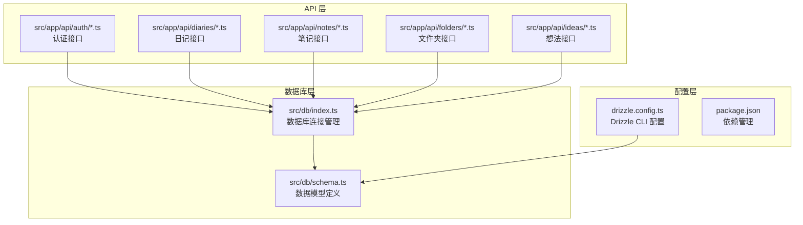
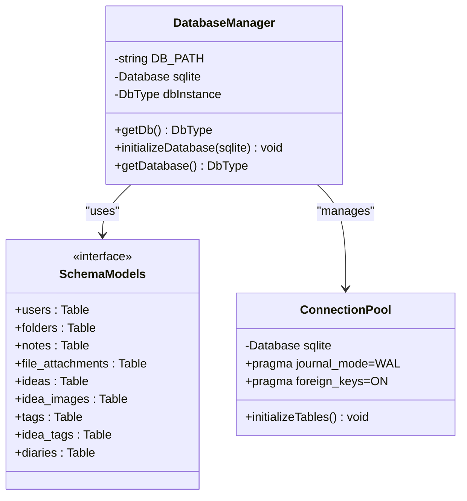
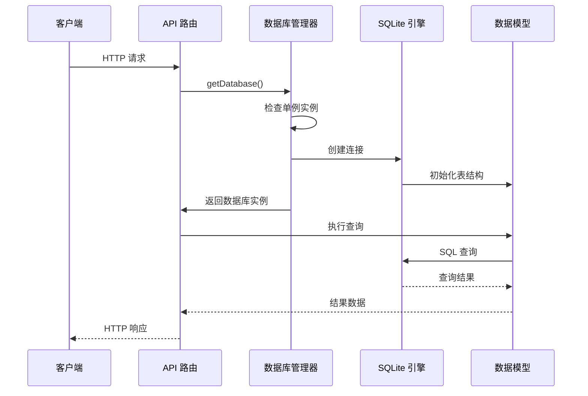
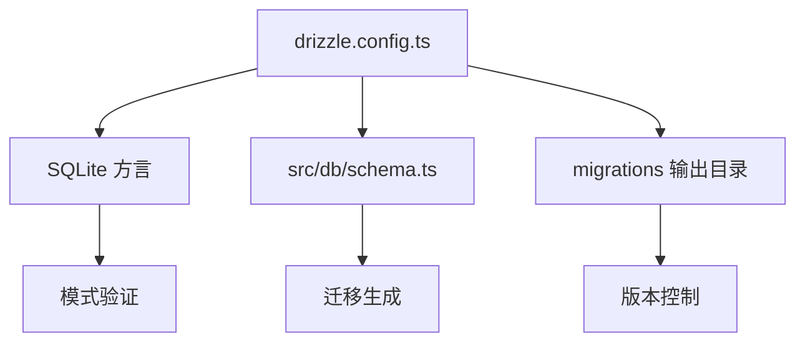
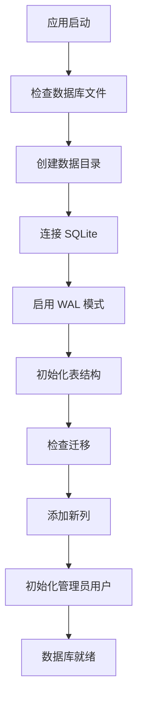
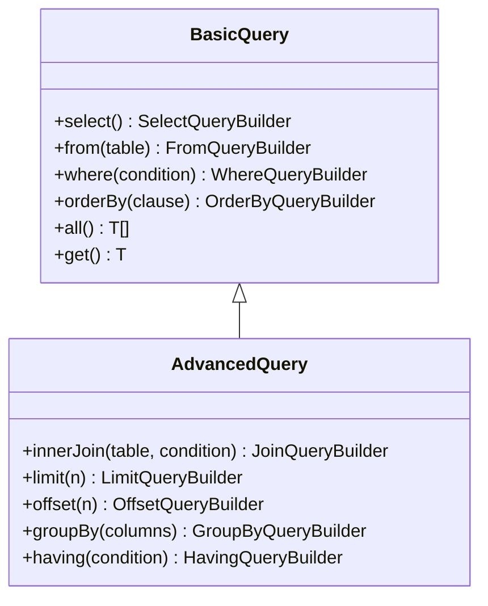
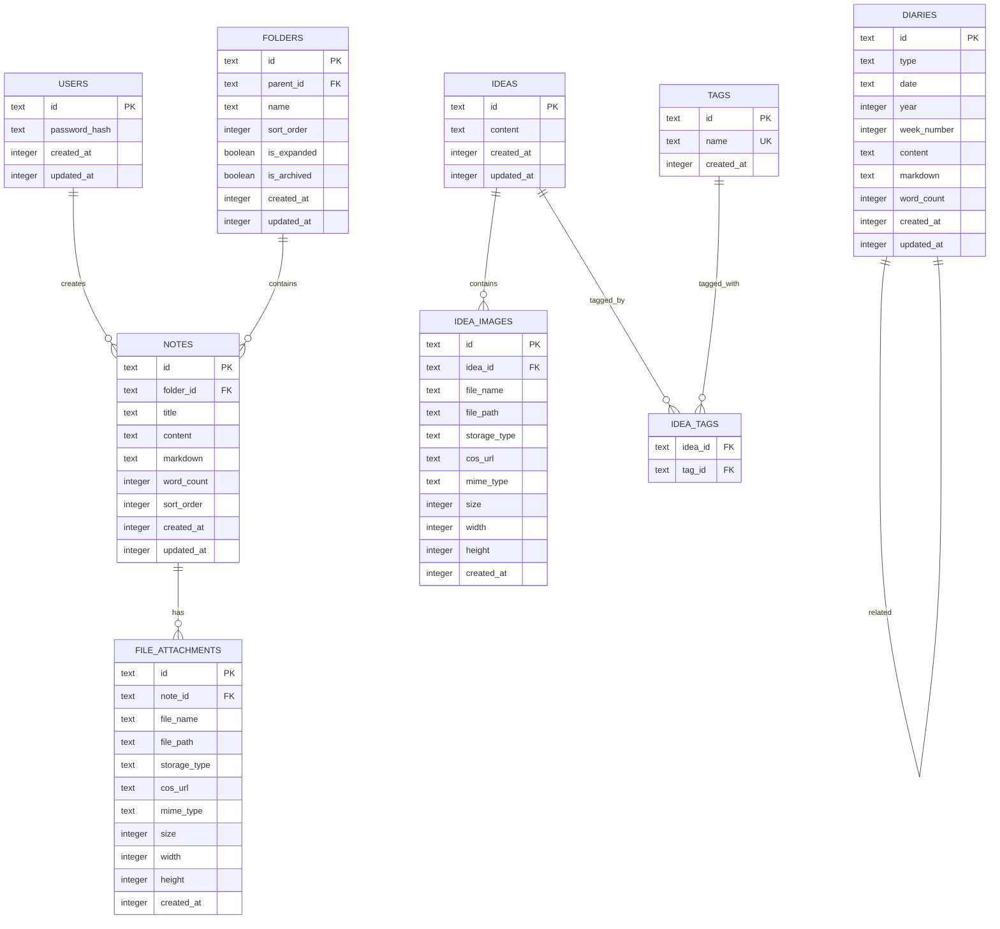
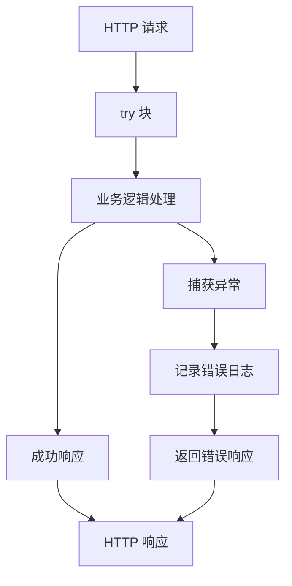

# Drizzle ORM 配置

<cite>
**本文档引用的文件**
- [drizzle.config.ts](file://drizzle.config.ts)
- [package.json](file://package.json)
- [src/db/index.ts](file://src/db/index.ts)
- [src/db/schema.ts](file://src/db/schema.ts)
- [src/app/api/auth/login/route.ts](file://src/app/api/auth/login/route.ts)
- [src/app/api/diaries/route.ts](file://src/app/api/diaries/route.ts)
- [src/app/api/notes/route.ts](file://src/app/api/notes/route.ts)
- [src/app/api/folders/route.ts](file://src/app/api/folders/route.ts)
- [src/app/api/ideas/route.ts](file://src/app/api/ideas/route.ts)
</cite>

## 目录
1. [简介](#简介)
2. [项目结构](#项目结构)
3. [核心组件](#核心组件)
4. [架构概览](#架构概览)
5. [详细组件分析](#详细组件分析)
6. [依赖关系分析](#依赖关系分析)
7. [性能考虑](#性能考虑)
8. [故障排除指南](#故障排除指南)
9. [结论](#结论)

## 简介

YNote v2 使用 Drizzle ORM 进行数据库操作，采用 SQLite 作为主要数据库引擎。本项目实现了完整的数据库配置、连接管理和查询构建器使用模式。系统通过单例模式管理数据库连接，确保应用启动时的高效性和资源利用。

## 项目结构

项目采用模块化的数据库架构设计：



**图表来源**
- [src/db/index.ts:1-171](file://src/db/index.ts#L1-L171)
- [src/db/schema.ts:1-105](file://src/db/schema.ts#L1-L105)
- [drizzle.config.ts:1-8](file://drizzle.config.ts#L1-L8)

**章节来源**
- [src/db/index.ts:1-171](file://src/db/index.ts#L1-L171)
- [src/db/schema.ts:1-105](file://src/db/schema.ts#L1-L105)
- [drizzle.config.ts:1-8](file://drizzle.config.ts#L1-L8)

## 核心组件

### 数据库连接配置

系统使用 better-sqlite3 作为 SQLite 驱动，通过单例模式管理数据库连接：



**图表来源**
- [src/db/index.ts:8-25](file://src/db/index.ts#L8-L25)
- [src/db/index.ts:27-158](file://src/db/index.ts#L27-L158)
- [src/db/schema.ts:1-105](file://src/db/schema.ts#L1-L105)

### 环境变量管理

系统支持以下关键环境变量：

| 环境变量 | 默认值 | 用途 | 必需性 |
|---------|--------|------|--------|
| DATABASE_PATH | ./data/ynote.db | 数据库文件路径 | 否 |
| AUTH_SECRET_KEY | - | 管理员密码哈希 | 否 |

**章节来源**
- [src/db/index.ts:8](file://src/db/index.ts#L8)
- [src/db/index.ts:143-157](file://src/db/index.ts#L143-L157)

## 架构概览

系统采用分层架构设计，确保数据库操作的可维护性和扩展性：



**图表来源**
- [src/db/index.ts:160-168](file://src/db/index.ts#L160-L168)
- [src/app/api/auth/login/route.ts:35-36](file://src/app/api/auth/login/route.ts#L35-L36)

## 详细组件分析

### Drizzle CLI 配置

Drizzle CLI 配置文件定义了数据库方言、模式文件位置和迁移输出目录：



**图表来源**
- [drizzle.config.ts:3-7](file://drizzle.config.ts#L3-L7)

**章节来源**
- [drizzle.config.ts:1-8](file://drizzle.config.ts#L1-L8)

### 数据库初始化流程

系统在应用启动时自动执行数据库初始化：



**图表来源**
- [src/db/index.ts:10-25](file://src/db/index.ts#L10-L25)
- [src/db/index.ts:27-158](file://src/db/index.ts#L27-L158)

**章节来源**
- [src/db/index.ts:10-158](file://src/db/index.ts#L10-L158)

### 查询构建器使用模式

系统展示了多种查询构建器的使用模式：

#### 基础查询模式


**图表来源**
- [src/app/api/notes/route.ts:15-34](file://src/app/api/notes/route.ts#L15-L34)
- [src/app/api/ideas/route.ts:18-42](file://src/app/api/ideas/route.ts#L18-L42)

#### 复杂查询示例
系统使用复杂查询处理标签过滤和分页：

**章节来源**
- [src/app/api/ideas/route.ts:17-84](file://src/app/api/ideas/route.ts#L17-L84)

### 数据模型设计

系统采用标准化的数据模型设计，支持复杂的关联关系：



**图表来源**
- [src/db/schema.ts:3-104](file://src/db/schema.ts#L3-L104)

**章节来源**
- [src/db/schema.ts:1-105](file://src/db/schema.ts#L1-L105)

## 依赖关系分析

系统依赖关系清晰明确，遵循单一职责原则：

```mermaid
graph TB
subgraph "运行时依赖"
DrizzleORM[drizzle-orm@0.45.1]
BetterSQLite[better-sqlite3@12.8.0]
BCrypt[bcryptjs@3.0.3]
end
subgraph "开发依赖"
DrizzleKit[drizzle-kit@0.31.9]
DotEnv[dotenv@17.3.1]
TypeScript[typescript@^5]
end
subgraph "应用层"
NextJS[next@16.1.6]
APIRoutes[API 路由层]
DatabaseLayer[数据库层]
end
DrizzleORM --> BetterSQLite
DrizzleKit --> DrizzleORM
APIRoutes --> DatabaseLayer
DatabaseLayer --> DrizzleORM
APIRoutes --> NextJS
```

**图表来源**
- [package.json:65-99](file://package.json#L65-L99)
- [package.json:111](file://package.json#L111)

**章节来源**
- [package.json:1-119](file://package.json#L1-L119)

## 性能考虑

### 连接池优化

系统采用单例模式管理数据库连接，避免频繁的连接创建开销：

- **WAL 模式**：启用写-ahead 日志提高并发性能
- **外键约束**：在事务中启用外键检查确保数据一致性
- **索引优化**：为常用查询字段建立索引

### 查询性能优化

- **选择性字段**：仅选择需要的字段减少网络传输
- **分页查询**：限制查询结果数量防止内存溢出
- **批量操作**：使用批量插入和更新减少数据库往返

## 故障排除指南

### 常见问题及解决方案

#### 数据库连接问题
1. **权限错误**：检查 DATABASE_PATH 目录的读写权限
2. **文件锁定**：确保没有其他进程占用数据库文件
3. **磁盘空间不足**：监控数据库文件大小和可用空间

#### 查询异常处理
系统在所有 API 路由中实现了统一的错误处理机制：



**图表来源**
- [src/app/api/notes/route.ts:36-40](file://src/app/api/notes/route.ts#L36-L40)
- [src/app/api/ideas/route.ts:80-84](file://src/app/api/ideas/route.ts#L80-L84)

**章节来源**
- [src/app/api/auth/login/route.ts:59-62](file://src/app/api/auth/login/route.ts#L59-L62)
- [src/app/api/diaries/route.ts:37-44](file://src/app/api/diaries/route.ts#L37-L44)

### 配置验证机制

系统实现了多层次的配置验证：

1. **环境变量验证**：检查必需的环境变量是否存在
2. **数据库连接验证**：测试数据库连接的可用性
3. **表结构验证**：确保数据库表结构符合预期

**章节来源**
- [src/db/index.ts:143-157](file://src/db/index.ts#L143-L157)

## 结论

YNote v2 的 Drizzle ORM 配置展现了现代数据库设计的最佳实践。通过合理的架构设计、完善的错误处理机制和性能优化策略，系统能够稳定地支持各种数据库操作需求。

关键优势包括：
- **简洁的配置**：最小化的配置文件实现完整的功能
- **强大的查询能力**：充分利用 Drizzle ORM 的类型安全特性
- **良好的扩展性**：模块化的架构便于功能扩展
- **可靠的错误处理**：完善的异常处理机制确保系统稳定性

建议在生产环境中重点关注数据库备份策略、监控告警和性能调优，以确保系统的长期稳定运行。