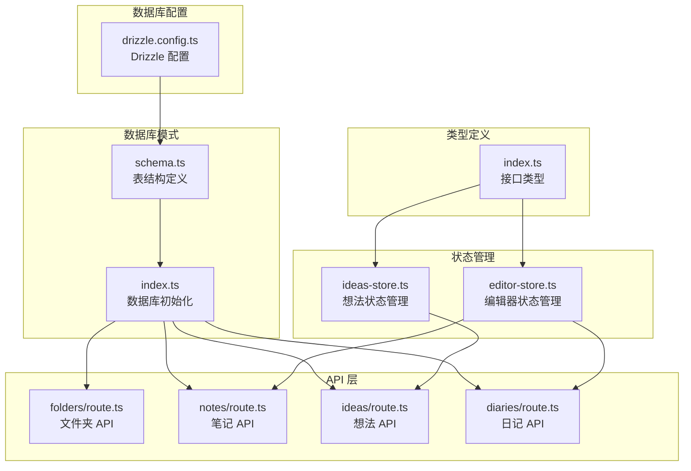
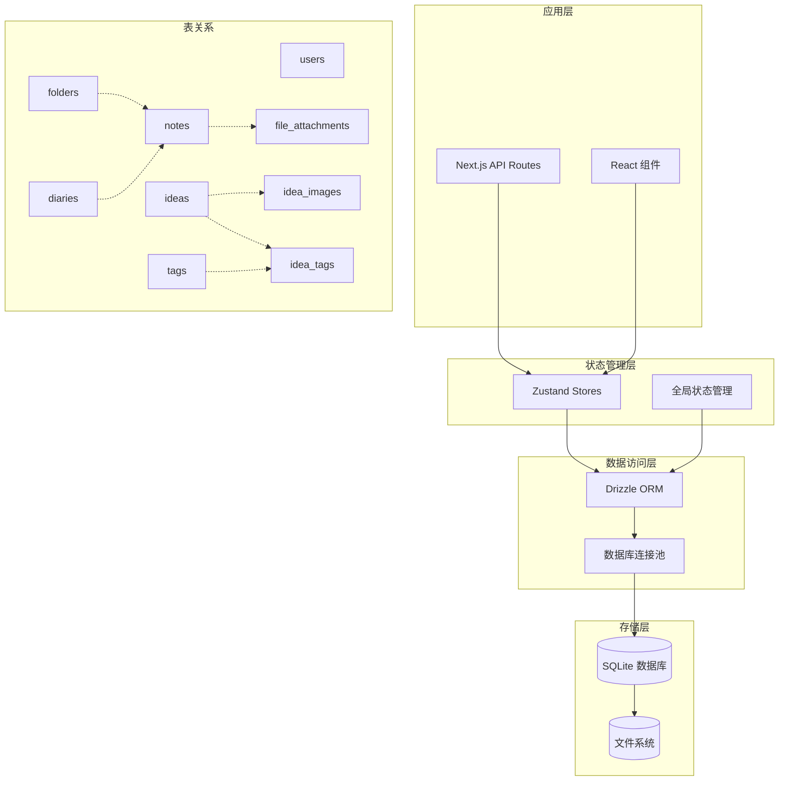
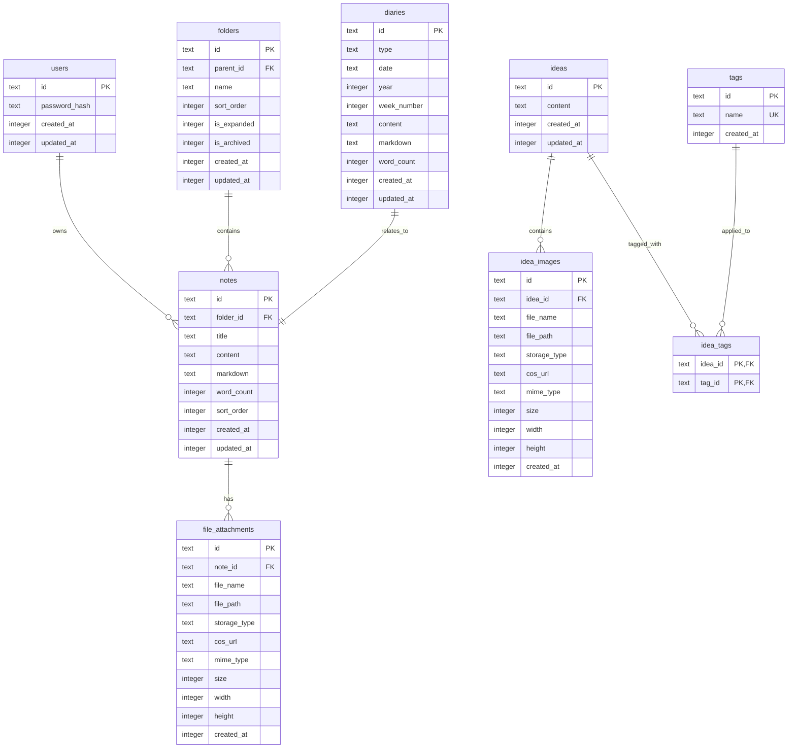
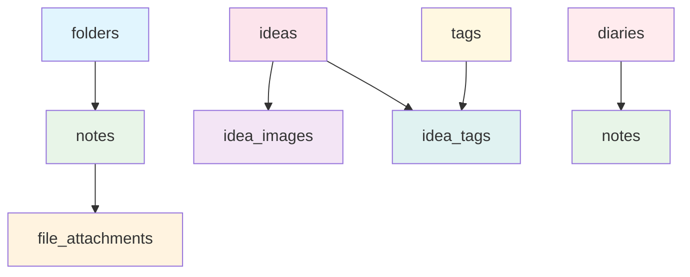

# 数据库模式定义

<cite>
**本文档引用的文件**
- [schema.ts](file://src/db/schema.ts)
- [index.ts](file://src/db/index.ts)
- [drizzle.config.ts](file://drizzle.config.ts)
- [route.ts](file://src/app/api/folders/route.ts)
- [route.ts](file://src/app/api/notes/route.ts)
- [route.ts](file://src/app/api/ideas/route.ts)
- [route.ts](file://src/app/api/diaries/route.ts)
- [ideas-store.ts](file://src/stores/ideas-store.ts)
- [editor-store.ts](file://src/stores/editor-store.ts)
- [index.ts](file://src/types/index.ts)
</cite>

## 目录
1. [简介](#简介)
2. [项目结构](#项目结构)
3. [核心组件](#核心组件)
4. [架构概览](#架构概览)
5. [详细组件分析](#详细组件分析)
6. [依赖关系分析](#依赖关系分析)
7. [性能考虑](#性能考虑)
8. [故障排除指南](#故障排除指南)
9. [结论](#结论)

## 简介

YNote v2 是一个基于 SQLite 的知识管理应用，采用 Drizzle ORM 进行数据库抽象。本文件详细记录了数据库模式的设计，包括用户、文件夹、笔记、文件附件、想法、想法图片、标签、想法标签关联表和日记等核心数据表的结构设计。

该数据库模式遵循以下设计原则：
- 使用 SQLite 作为主要存储引擎
- 通过 Drizzle ORM 提供类型安全的数据库操作
- 实现合理的数据完整性约束
- 支持层次化文件夹结构和多对多标签关联
- 优化查询性能的索引策略

## 项目结构

YNote v2 的数据库相关文件组织结构如下：

**图表来源**
- [drizzle.config.ts:1-8](file://drizzle.config.ts#L1-L8)
- [schema.ts:1-105](file://src/db/schema.ts#L1-L105)
- [index.ts:1-171](file://src/db/index.ts#L1-L171)

**章节来源**
- [drizzle.config.ts:1-8](file://drizzle.config.ts#L1-L8)
- [schema.ts:1-105](file://src/db/schema.ts#L1-L105)
- [index.ts:1-171](file://src/db/index.ts#L1-L171)

## 核心组件

### 数据库配置

Drizzle ORM 配置文件定义了数据库方言、模式文件位置和迁移输出目录：

- **方言**: SQLite
- **模式文件**: `./src/db/schema.ts`
- **迁移输出**: `./migrations`

### 数据库连接管理

数据库连接通过单例模式管理，确保应用中只有一个活跃的数据库连接实例。连接初始化时启用：
- WAL 模式（Write-Ahead Logging）
- 外键约束检查
- 自动数据库初始化

**章节来源**
- [drizzle.config.ts:1-8](file://drizzle.config.ts#L1-L8)
- [index.ts:10-25](file://src/db/index.ts#L10-L25)
- [index.ts:160-168](file://src/db/index.ts#L160-L168)

## 架构概览

YNote v2 的数据库架构采用分层设计，从底层到上层的交互关系如下：

**图表来源**
- [schema.ts:3-105](file://src/db/schema.ts#L3-L105)
- [index.ts:1-171](file://src/db/index.ts#L1-L171)

## 详细组件分析

### 用户表 (users)

用户表是系统的基础认证表，用于存储管理员用户信息。

#### 字段定义

| 字段名 | 数据类型 | 约束 | 默认值 | 描述 |
|--------|----------|------|--------|------|
| id | TEXT | PRIMARY KEY, UNIQUE | 'admin' | 用户唯一标识符 |
| passwordHash | TEXT | NOT NULL | 无 | 密码哈希值 |
| createdAt | INTEGER | NOT NULL | 无 | 创建时间戳 |
| updatedAt | INTEGER | NOT NULL | 无 | 更新时间戳 |

#### 设计原理

- 使用固定用户名 'admin' 确保系统有预设管理员账户
- 采用密码哈希存储保护用户凭据安全
- 时间戳字段支持审计和排序功能

#### 业务用途

- 系统认证和授权
- 管理员权限控制
- 安全审计日志

**章节来源**
- [schema.ts:3-8](file://src/db/schema.ts#L3-L8)
- [index.ts:29-34](file://src/db/index.ts#L29-L34)

### 文件夹表 (folders)

文件夹表实现了层次化的文件夹结构，支持最多两级深度的嵌套。

#### 字段定义

| 字段名 | 数据类型 | 约束 | 默认值 | 描述 |
|--------|----------|------|--------|------|
| id | TEXT | PRIMARY KEY | 无 | 文件夹唯一标识符 |
| parentId | TEXT | FOREIGN KEY | NULL | 父文件夹 ID |
| name | TEXT | NOT NULL | 无 | 文件夹名称 |
| sortOrder | INTEGER | NOT NULL | 0 | 排序权重 |
| isExpanded | INTEGER | NOT NULL, BOOLEAN | TRUE | 是否展开显示 |
| isArchived | INTEGER | NOT NULL, BOOLEAN | FALSE | 是否归档 |
| createdAt | INTEGER | NOT NULL | 无 | 创建时间戳 |
| updatedAt | INTEGER | NOT NULL | 无 | 更新时间戳 |

#### 外键关系

- `parentId` 引用 `folders.id`，删除策略：CASCADE
- 实现文件夹删除时自动删除子文件夹的功能

#### 级联操作策略

- **删除**: 当父文件夹被删除时，所有子文件夹自动删除
- **更新**: 父文件夹 ID 变更时，保持引用完整性

#### 索引策略

- `idx_folders_parent_id`: 优化父子关系查询

#### 业务用途

- 组织笔记的层次化结构
- 支持两级深度的文件夹嵌套
- 提供文件夹的展开/折叠状态管理

**章节来源**
- [schema.ts:10-25](file://src/db/schema.ts#L10-L25)
- [index.ts:36-45](file://src/db/index.ts#L36-L45)
- [index.ts:73](file://src/db/index.ts#L73)

### 笔记表 (notes)

笔记表存储用户创建的所有笔记内容，支持与文件夹的关联。

#### 字段定义

| 字段名 | 数据类型 | 约束 | 默认值 | 描述 |
|--------|----------|------|--------|------|
| id | TEXT | PRIMARY KEY | 无 | 笔记唯一标识符 |
| folderId | TEXT | FOREIGN KEY | NULL | 所属文件夹 ID |
| title | TEXT | NOT NULL | 'Untitled' | 笔记标题 |
| content | TEXT |  | 无 | 富文本内容 |
| markdown | TEXT |  | 无 | Markdown 格式内容 |
| wordCount | INTEGER | NOT NULL | 0 | 字数统计 |
| sortOrder | INTEGER | NOT NULL | 0 | 排序权重 |
| createdAt | INTEGER | NOT NULL | 无 | 创建时间戳 |
| updatedAt | INTEGER | NOT NULL | 无 | 更新时间戳 |

#### 外键关系

- `folderId` 引用 `folders.id`，删除策略：SET NULL
- 当文件夹被删除时，笔记保留但移除文件夹关联

#### 级联操作策略

- **删除**: 文件夹删除时，笔记的 `folderId` 设置为 NULL
- **更新**: 文件夹 ID 变更时，保持引用完整性

#### 索引策略

- `idx_notes_folder_id`: 优化按文件夹查询笔记

#### 业务用途

- 存储用户笔记内容
- 支持富文本和 Markdown 编辑
- 提供字数统计和排序功能

**章节来源**
- [schema.ts:27-39](file://src/db/schema.ts#L27-L39)
- [index.ts:47-57](file://src/db/index.ts#L47-L57)
- [index.ts:74](file://src/db/index.ts#L74)

### 文件附件表 (file_attachments)

文件附件表管理与笔记关联的文件附件信息。

#### 字段定义

| 字段名 | 数据类型 | 约束 | 默认值 | 描述 |
|--------|----------|------|--------|------|
| id | TEXT | PRIMARY KEY | 无 | 附件唯一标识符 |
| noteId | TEXT | NOT NULL, FOREIGN KEY | 无 | 关联笔记 ID |
| fileName | TEXT | NOT NULL | 无 | 原始文件名 |
| filePath | TEXT | NOT NULL | 无 | 文件存储路径 |
| storageType | TEXT | NOT NULL | 无 | 存储类型 |
| cosUrl | TEXT |  | 无 | 对象存储 URL |
| mimeType | TEXT |  | 无 | MIME 类型 |
| size | INTEGER |  | 无 | 文件大小 |
| width | INTEGER |  | 无 | 图片宽度 |
| height | INTEGER |  | 无 | 图片高度 |
| createdAt | INTEGER | NOT NULL | 无 | 创建时间戳 |

#### 外键关系

- `noteId` 引用 `notes.id`，删除策略：CASCADE
- 当笔记删除时，所有关联附件自动删除

#### 级联操作策略

- **删除**: 笔记删除时，所有附件自动删除
- **更新**: 笔记 ID 变更时，保持引用完整性

#### 索引策略

- `idx_file_attachments_note_id`: 优化按笔记查询附件

#### 业务用途

- 管理笔记相关的文件附件
- 支持多种存储类型的文件
- 提供图片尺寸信息存储

**章节来源**
- [schema.ts:41-55](file://src/db/schema.ts#L41-L55)
- [index.ts:59-71](file://src/db/index.ts#L59-L71)
- [index.ts:75](file://src/db/index.ts#L75)

### 想法表 (ideas)

想法表存储用户的创意和想法内容。

#### 字段定义

| 字段名 | 数据类型 | 约束 | 默认值 | 描述 |
|--------|----------|------|--------|------|
| id | TEXT | PRIMARY KEY | 无 | 想法唯一标识符 |
| content | TEXT | NOT NULL | 无 | 想法内容 |
| createdAt | INTEGER | NOT NULL | 无 | 创建时间戳 |
| updatedAt | INTEGER | NOT NULL | 无 | 更新时间戳 |

#### 业务用途

- 存储用户的创意和想法
- 支持内容的创建和更新
- 作为想法图片和标签的关联基础

**章节来源**
- [schema.ts:57-62](file://src/db/schema.ts#L57-L62)
- [index.ts:77-82](file://src/db/index.ts#L77-L82)

### 想法图片表 (idea_images)

想法图片表管理与想法关联的图片资源。

#### 字段定义

| 字段名 | 数据类型 | 约束 | 默认值 | 描述 |
|--------|----------|------|--------|------|
| id | TEXT | PRIMARY KEY | 无 | 图片唯一标识符 |
| ideaId | TEXT | NOT NULL, FOREIGN KEY | 无 | 关联想法 ID |
| fileName | TEXT | NOT NULL | 无 | 原始文件名 |
| filePath | TEXT | NOT NULL | 无 | 文件存储路径 |
| storageType | TEXT | NOT NULL | 无 | 存储类型 |
| cosUrl | TEXT |  | 无 | 对象存储 URL |
| mimeType | TEXT |  | 无 | MIME 类型 |
| size | INTEGER |  | 无 | 文件大小 |
| width | INTEGER |  | 无 | 图片宽度 |
| height | INTEGER |  | 无 | 图片高度 |
| createdAt | INTEGER | NOT NULL | 无 | 创建时间戳 |

#### 外键关系

- `ideaId` 引用 `ideas.id`，删除策略：CASCADE
- 当想法删除时，所有关联图片自动删除

#### 级联操作策略

- **删除**: 想法删除时，所有图片自动删除
- **更新**: 想法 ID 变更时，保持引用完整性

#### 索引策略

- `idx_idea_images_idea_id`: 优化按想法查询图片

#### 业务用途

- 管理想法相关的图片资源
- 支持多种存储类型的图片
- 提供图片元数据信息

**章节来源**
- [schema.ts:64-76](file://src/db/schema.ts#L64-L76)
- [index.ts:84-96](file://src/db/index.ts#L84-L96)
- [index.ts:110](file://src/db/index.ts#L110)

### 标签表 (tags)

标签表存储系统中的标签信息，支持多对多关联。

#### 字段定义

| 字段名 | 数据类型 | 约束 | 默认值 | 描述 |
|--------|----------|------|--------|------|
| id | TEXT | PRIMARY KEY | 无 | 标签唯一标识符 |
| name | TEXT | NOT NULL, UNIQUE | 无 | 标签名称 |
| createdAt | INTEGER | NOT NULL | 无 | 创建时间戳 |

#### 约束规则

- `name` 字段具有 UNIQUE 约束，确保标签名称唯一性

#### 业务用途

- 提供标签分类功能
- 支持想法的多标签关联
- 实现标签的去重管理

**章节来源**
- [schema.ts:78-82](file://src/db/schema.ts#L78-L82)
- [index.ts:98-102](file://src/db/index.ts#L98-L102)

### 想法标签关联表 (idea_tags)

想法标签关联表实现想法与标签的多对多关系。

#### 字段定义

| 字段名 | 数据类型 | 约束 | 默认值 | 描述 |
|--------|----------|------|--------|------|
| ideaId | TEXT | NOT NULL, FOREIGN KEY | 无 | 想法 ID |
| tagId | TEXT | NOT NULL, FOREIGN KEY | 无 | 标签 ID |

#### 主键组合

- `(ideaId, tagId)`: 复合主键，确保同一想法和标签的唯一关联

#### 外键关系

- `ideaId` 引用 `ideas.id`，删除策略：CASCADE
- `tagId` 引用 `tags.id`，删除策略：CASCADE

#### 级联操作策略

- **删除**: 任一端删除时，关联记录自动删除
- **更新**: ID 变更时，保持引用完整性

#### 索引策略

- `idx_idea_tags_idea_id`: 优化按想法查询标签
- `idx_idea_tags_tag_id`: 优化按标签查询想法

#### 业务用途

- 实现想法的多标签分类
- 支持标签的动态添加和移除
- 提供标签过滤和搜索功能

**章节来源**
- [schema.ts:84-91](file://src/db/schema.ts#L84-L91)
- [index.ts:104-108](file://src/db/index.ts#L104-L108)
- [index.ts:111-112](file://src/db/index.ts#L111-L112)

### 日记表 (diaries)

日记表存储用户的日常和周记内容。

#### 字段定义

| 字段名 | 数据类型 | 约束 | 默认值 | 描述 |
|--------|----------|------|--------|------|
| id | TEXT | PRIMARY KEY | 无 | 日记条目唯一标识符 |
| type | TEXT | NOT NULL | 无 | 日记类型: 'daily' 或 'weekly' |
| date | TEXT | NOT NULL | 无 | 日期字符串: 'YYYY-MM-DD' 或 'YYYY-Www' |
| year | INTEGER | NOT NULL | 无 | ISO 周历年份 |
| weekNumber | INTEGER | NOT NULL | 无 | ISO 周数 (1-53) |
| content | TEXT |  | 无 | 日记内容 |
| markdown | TEXT |  | 无 | Markdown 格式内容 |
| wordCount | INTEGER | NOT NULL | 0 | 字数统计 |
| createdAt | INTEGER | NOT NULL | 无 | 创建时间戳 |
| updatedAt | INTEGER | NOT NULL | 无 | 更新时间戳 |

#### 约束规则

- `type` 字段限制为 'daily' 或 'weekly'
- `date` 字段存储特定格式的日期字符串

#### 索引策略

- `idx_diaries_type_date`: 唯一索引，优化按类型和日期查询
- `idx_diaries_year`: 优化按年份查询
- `idx_diaries_year_week`: 优化按年份和周数查询

#### 业务用途

- 存储用户的日常记录
- 支持日历驱动的日记管理
- 提供字数统计和时间序列分析

**章节来源**
- [schema.ts:93-104](file://src/db/schema.ts#L93-L104)
- [index.ts:114-125](file://src/db/index.ts#L114-L125)
- [index.ts:127-129](file://src/db/index.ts#L127-L129)

## 依赖关系分析

### 表间关系图

**图表来源**
- [schema.ts:3-105](file://src/db/schema.ts#L3-L105)

### 外键依赖链

**图表来源**
- [schema.ts:10-104](file://src/db/schema.ts#L10-L104)

### 数据完整性约束

系统通过以下机制确保数据完整性：

1. **主键约束**: 每个表都有明确的主键定义
2. **外键约束**: 通过 CASCADE 和 SET NULL 策略维护引用完整性
3. **唯一约束**: 标签名称的唯一性保证
4. **非空约束**: 关键字段的 NOT NULL 约束
5. **默认值**: 合理的默认值设置确保数据一致性

**章节来源**
- [schema.ts:3-105](file://src/db/schema.ts#L3-L105)
- [index.ts:27-158](file://src/db/index.ts#L27-L158)

## 性能考虑

### 索引策略分析

系统采用了针对常见查询模式的索引策略：

1. **层次查询优化**: `idx_folders_parent_id` 支持文件夹树形结构查询
2. **关联查询优化**: `idx_notes_folder_id` 和 `idx_file_attachments_note_id` 优化关联表查询
3. **多对多查询优化**: `idx_idea_tags_idea_id` 和 `idx_idea_tags_tag_id` 支持标签过滤
4. **时间序列查询优化**: `idx_diaries_type_date`、`idx_diaries_year`、`idx_diaries_year_week` 支持日记查询

### 查询性能优化建议

1. **批量操作**: 对于大量数据操作，使用事务包装
2. **分页查询**: 使用 LIMIT 和 OFFSET 实现高效分页
3. **索引选择**: 根据实际查询模式调整索引策略
4. **缓存策略**: 结合应用层缓存减少数据库压力

### 存储优化

1. **WAL 模式**: 提高并发读写性能
2. **外键检查**: 在事务中启用以保证数据一致性
3. **文件存储**: 将大文件存储在文件系统而非数据库中

## 故障排除指南

### 常见问题及解决方案

#### 数据库初始化失败

**症状**: 应用启动时报数据库初始化错误

**原因分析**:
- 数据库文件权限问题
- 目录不存在或权限不足
- SQLite 版本不兼容

**解决步骤**:
1. 检查 `DATABASE_PATH` 环境变量设置
2. 确认数据目录存在且可写
3. 验证 SQLite 版本兼容性

#### 外键约束冲突

**症状**: 删除或更新数据时报外键约束错误

**原因分析**:
- 存在相关的子记录
- 外键引用未正确设置

**解决步骤**:
1. 检查相关表的数据完整性
2. 确认删除顺序符合 CASCADE 策略
3. 验证外键引用关系

#### 索引性能问题

**症状**: 查询响应缓慢

**原因分析**:
- 缺少必要的索引
- 索引使用不当
- 查询条件不匹配索引

**解决步骤**:
1. 分析查询执行计划
2. 添加适当的索引
3. 优化查询条件

**章节来源**
- [index.ts:10-25](file://src/db/index.ts#L10-L25)
- [index.ts:132-158](file://src/db/index.ts#L132-L158)

## 结论

YNote v2 的数据库模式设计体现了现代应用开发的最佳实践：

### 设计优势

1. **清晰的层次结构**: 通过文件夹表实现清晰的内容组织
2. **灵活的关联关系**: 支持多对多标签关联和附件管理
3. **完善的索引策略**: 针对常见查询模式优化性能
4. **类型安全**: 通过 Drizzle ORM 提供编译时类型检查
5. **可扩展性**: 支持未来功能的平滑扩展

### 技术特点

- **SQLite 优先**: 适合单机部署和小型团队使用
- **零配置**: 最小化配置需求，降低运维复杂度
- **类型安全**: 完整的 TypeScript 支持
- **现代化工具链**: Drizzle ORM + Next.js API Routes

### 发展建议

1. **监控指标**: 添加数据库性能监控
2. **备份策略**: 实现定期自动备份
3. **迁移管理**: 建立规范的数据库迁移流程
4. **容量规划**: 监控数据增长趋势

该数据库模式为 YNote v2 提供了稳定可靠的数据存储基础，支持应用的核心功能需求，并为未来的功能扩展奠定了良好的技术基础。