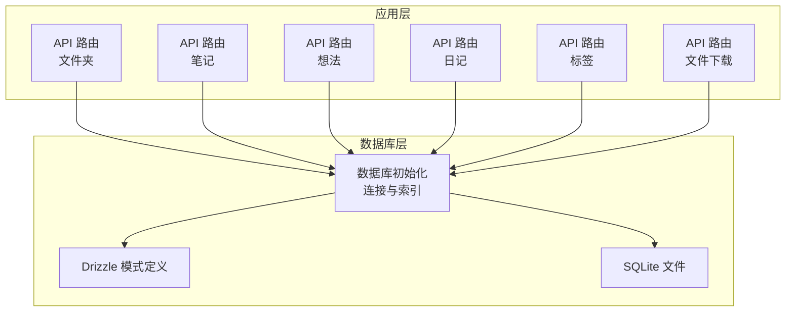
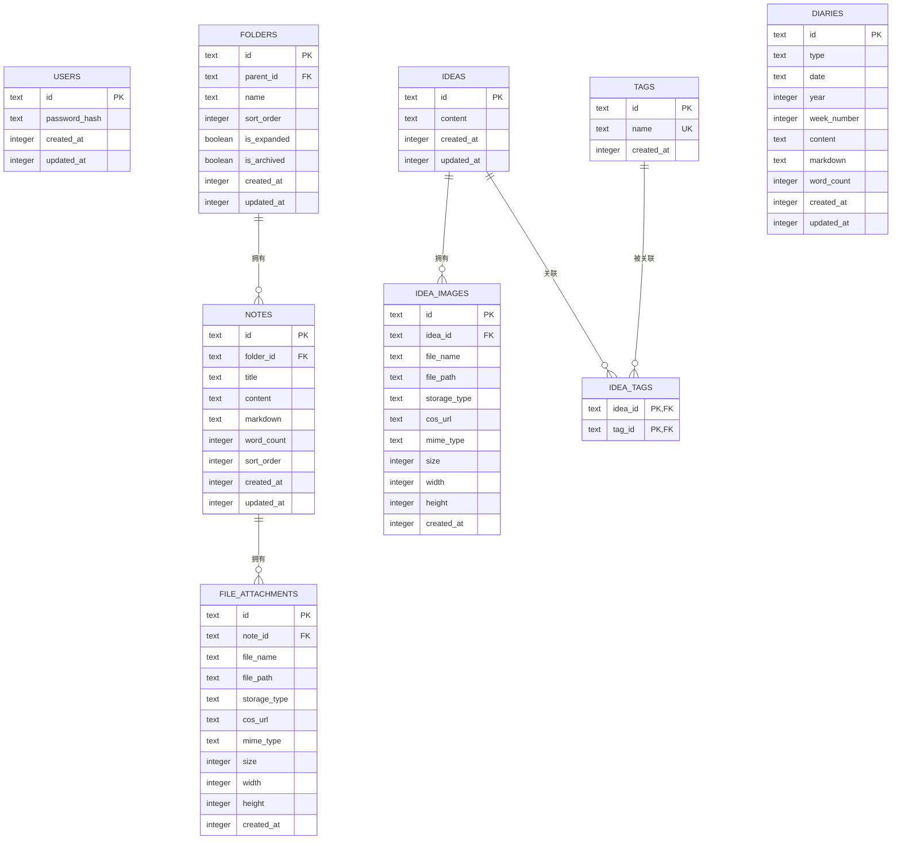
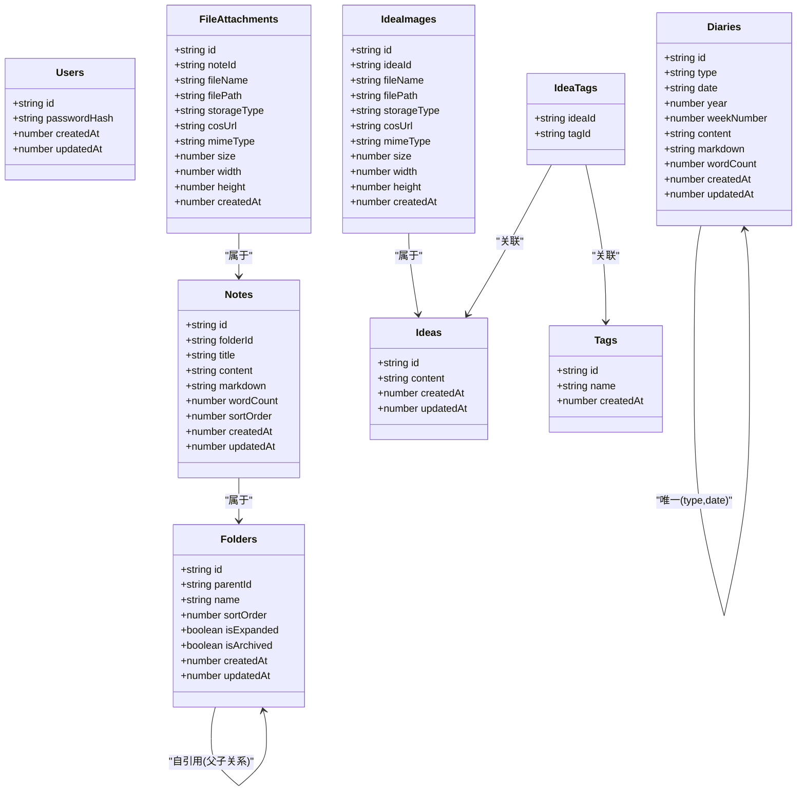
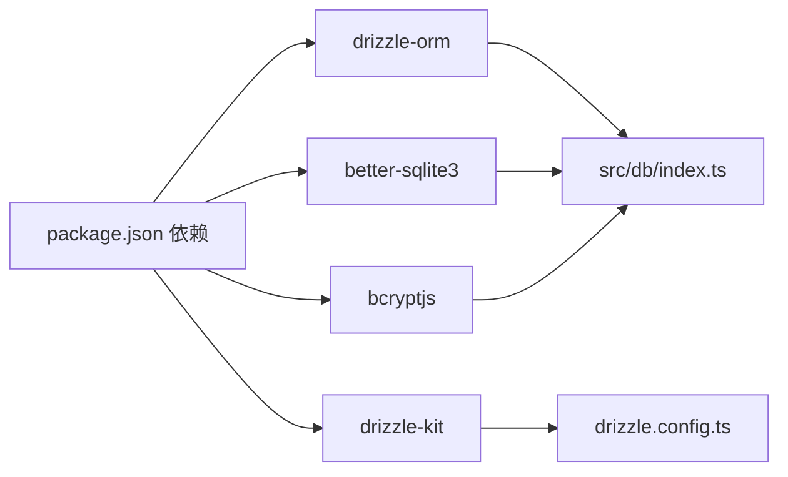

# 数据库设计

<cite>
**本文引用的文件**
- [drizzle.config.ts](file://drizzle.config.ts)
- [schema.ts](file://src/db/schema.ts)
- [index.ts](file://src/db/index.ts)
- [package.json](file://package.json)
- [route.ts（文件夹）](file://src/app/api/folders/route.ts)
- [route.ts（笔记）](file://src/app/api/notes/route.ts)
- [route.ts（想法）](file://src/app/api/ideas/route.ts)
- [route.ts（日记）](file://src/app/api/diaries/route.ts)
- [route.ts（标签）](file://src/app/api/tags/route.ts)
- [route.ts（文件下载）](file://src/app/api/files/[...path]/route.ts)
- [local.ts（本地存储）](file://src/lib/storage/local.ts)
- [index.ts（类型）](file://src/types/index.ts)
</cite>

## 目录
1. [简介](#简介)
2. [项目结构](#项目结构)
3. [核心组件](#核心组件)
4. [架构总览](#架构总览)
5. [详细组件分析](#详细组件分析)
6. [依赖分析](#依赖分析)
7. [性能考量](#性能考量)
8. [故障排查指南](#故障排查指南)
9. [结论](#结论)
10. [附录](#附录)

## 简介
本文件系统性地梳理 YNote v2 的数据库设计，覆盖以下方面：
- 数据库模式：实体、字段、数据类型与约束
- 表关系与主外键设计
- Drizzle ORM 配置与使用（查询构建器、类型安全）
- 数据访问模式与查询优化策略
- 索引设计与性能考虑
- ER 图与关系图
- 迁移路径与版本管理策略
- 数据验证与业务规则
- 缓存策略与一致性保障
- 数据库配置与部署指南
- 常见查询示例与最佳实践

## 项目结构
YNote v2 使用 SQLite 作为本地数据库，通过 Drizzle ORM 提供类型安全的查询能力，并在启动时初始化表结构与索引。数据库相关代码集中在 src/db 目录，API 层通过 Next.js 路由调用数据库。

**图表来源**
- [index.ts（数据库入口）:1-171](file://src/db/index.ts#L1-L171)
- [schema.ts:1-105](file://src/db/schema.ts#L1-L105)
- [route.ts（文件夹）:1-75](file://src/app/api/folders/route.ts#L1-L75)
- [route.ts（笔记）:1-86](file://src/app/api/notes/route.ts#L1-L86)
- [route.ts（想法）:1-151](file://src/app/api/ideas/route.ts#L1-L151)
- [route.ts（日记）:1-45](file://src/app/api/diaries/route.ts#L1-L45)
- [route.ts（标签）:1-28](file://src/app/api/tags/route.ts#L1-L28)
- [route.ts（文件下载）:1-48](file://src/app/api/files/[...path]/route.ts#L1-L48)

**章节来源**
- [index.ts（数据库入口）:1-171](file://src/db/index.ts#L1-L171)
- [schema.ts:1-105](file://src/db/schema.ts#L1-L105)
- [drizzle.config.ts:1-8](file://drizzle.config.ts#L1-L8)

## 核心组件
- Drizzle ORM 配置：SQLite 方言、模式文件路径、迁移输出目录
- 数据库初始化：WAL 模式、外键约束、表与索引创建、迁移脚本、管理员用户初始化
- 类型安全模式：users、folders、notes、file_attachments、ideas、idea_images、tags、idea_tags、diaries
- API 查询：基于 Drizzle 查询构建器的 CRUD 与联表查询

**章节来源**
- [drizzle.config.ts:1-8](file://drizzle.config.ts#L1-L8)
- [index.ts（数据库入口）:1-171](file://src/db/index.ts#L1-L171)
- [schema.ts:1-105](file://src/db/schema.ts#L1-L105)

## 架构总览
下图展示数据库模式与 API 的交互关系，以及 Drizzle ORM 在其中的角色。

**图表来源**
- [schema.ts:1-105](file://src/db/schema.ts#L1-L105)

## 详细组件分析

### 数据库模式与字段定义
- users
  - 主键：id（默认值为“admin”）
  - 字段：password_hash（非空）、created_at、updated_at（均为整数时间戳）
- folders
  - 主键：id；外键：parentId → folders.id（级联删除）
  - 字段：name（非空）、sort_order（默认 0）、is_expanded（布尔，默认 true）、is_archived（布尔，默认 false）、created_at、updated_at
- notes
  - 主键：id；外键：folderId → folders.id（删除设为 NULL）
  - 字段：title（默认“未命名”）、content、markdown、word_count（默认 0）、sort_order（默认 0）、created_at、updated_at
- file_attachments
  - 主键：id；外键：noteId → notes.id（级联删除）
  - 字段：fileName、filePath、storageType、cosUrl、mimeType、size、width、height、created_at
- ideas
  - 主键：id；字段：content、created_at、updated_at
- idea_images
  - 主键：id；外键：ideaId → ideas.id（级联删除）
  - 字段：fileName、filePath、storageType、cosUrl、mimeType、size、width、height、created_at
- tags
  - 主键：id；唯一约束：name
  - 字段：name（非空且唯一）、created_at
- idea_tags
  - 复合主键：(ideaId, tagId)；两个外键均级联删除
- diaries
  - 主键：id；字段：type（取值“daily”或“weekly”）、date（日志日期或 ISO 周字符串）、year、week_number、content、markdown、word_count（默认 0）、created_at、updated_at
  - 约束：唯一索引 (type, date)

**章节来源**
- [schema.ts:1-105](file://src/db/schema.ts#L1-L105)

### Drizzle ORM 配置与使用
- 配置
  - 方言：sqlite
  - 模式文件：./src/db/schema.ts
  - 迁移输出目录：./migrations
- 初始化
  - 连接：better-sqlite3
  - PRAGMA：journal_mode=WAL、foreign_keys=ON
  - 创建表与索引、迁移新增列、初始化管理员用户
- 类型安全
  - 通过 schema.ts 定义的表对象进行查询，返回类型与 TypeScript 接口一致
- 查询示例（路径）
  - 获取所有文件夹：[route.ts（文件夹）:19-32](file://src/app/api/folders/route.ts#L19-L32)
  - 获取笔记列表（支持按 folderId/root 过滤）：[route.ts（笔记）:10-40](file://src/app/api/notes/route.ts#L10-L40)
  - 获取想法列表（支持标签过滤、游标分页）：[route.ts（想法）:7-84](file://src/app/api/ideas/route.ts#L7-L84)
  - 获取日记列表（按年份过滤）：[route.ts（日记）:6-44](file://src/app/api/diaries/route.ts#L6-L44)
  - 获取标签统计（按使用次数排序）：[route.ts（标签）:6-27](file://src/app/api/tags/route.ts#L6-L27)

**章节来源**
- [drizzle.config.ts:1-8](file://drizzle.config.ts#L1-L8)
- [index.ts（数据库入口）:1-171](file://src/db/index.ts#L1-L171)
- [route.ts（文件夹）:1-75](file://src/app/api/folders/route.ts#L1-L75)
- [route.ts（笔记）:1-86](file://src/app/api/notes/route.ts#L1-L86)
- [route.ts（想法）:1-151](file://src/app/api/ideas/route.ts#L1-L151)
- [route.ts（日记）:1-45](file://src/app/api/diaries/route.ts#L1-L45)
- [route.ts（标签）:1-28](file://src/app/api/tags/route.ts#L1-L28)

### 数据访问模式与查询优化
- 访问模式
  - 单表查询：GET /api/folders、GET /api/notes、GET /api/diaries、GET /api/tags
  - 关联查询：GET /api/ideas（内连接 idea_tags 与 tags，左连接 idea_images）
  - 条件过滤：按 folderId/root、year、tagId、游标 cursor
  - 分页策略：limit + 1 切片判断 hasMore
- 优化建议
  - 使用索引覆盖查询（已建立必要索引）
  - 避免 SELECT *，明确选择所需列
  - 对高频过滤字段（如 folder_id、type+date、year+week_number）保持索引
  - 将复杂联表查询拆分为多次简单查询，减少 JOIN 开销

**章节来源**
- [route.ts（文件夹）:1-75](file://src/app/api/folders/route.ts#L1-L75)
- [route.ts（笔记）:1-86](file://src/app/api/notes/route.ts#L1-L86)
- [route.ts（想法）:1-151](file://src/app/api/ideas/route.ts#L1-L151)
- [route.ts（日记）:1-45](file://src/app/api/diaries/route.ts#L1-L45)
- [route.ts（标签）:1-28](file://src/app/api/tags/route.ts#L1-L28)

### 索引设计与性能考虑
- 已建索引
  - folders(parent_id)
  - notes(folder_id)
  - file_attachments(note_id)
  - idea_images(idea_id)
  - idea_tags(idea_id)
  - idea_tags(tag_id)
  - diaries(type, date)（唯一）
  - diaries(year)
  - diaries(year, week_number)
- 性能建议
  - 读多写少场景优先考虑读性能（如 diaries 的复合索引）
  - 对频繁范围查询（如 diaries.year）使用单列索引
  - 对高选择性过滤（如 diaries.type + diaries.date）使用联合唯一索引

**章节来源**
- [index.ts（数据库入口）:73-129](file://src/db/index.ts#L73-L129)

### 数据模型图表与关系图

**图表来源**
- [schema.ts:1-105](file://src/db/schema.ts#L1-L105)

### 数据迁移路径与版本管理策略
- 运行时迁移
  - 启动时检测表结构变化并执行 ALTER TABLE（例如为 folders 新增 is_archived 列）
  - 初始化管理员用户（若存在 AUTH_SECRET_KEY）
- 迁移工具
  - 使用 drizzle-kit 配置生成迁移文件到 ./migrations
- 版本管理
  - 通过 schema.ts 与初始化 SQL 的差异控制演进
  - 建议后续引入版本号与迁移脚本清单，确保生产环境可回滚

**章节来源**
- [index.ts（数据库入口）:132-158](file://src/db/index.ts#L132-L158)
- [drizzle.config.ts:1-8](file://drizzle.config.ts#L1-L8)

### 数据验证规则与业务规则
- 文件夹
  - 名称长度限制、非法字符校验、最多两级深度（子节点不允许再有子节点）
- 笔记
  - 标题长度限制、非法字符校验、folderId 可选（root 级别）
- 想法
  - 内容与图片至少一项存在；标签去重插入；图片归属变更
- 日记
  - 年份参数必填且有效
- 标签
  - 统计使用次数并按次数降序排列
- 存储
  - 本地存储上传路径 data/uploads，防止目录穿越，设置静态缓存头

**章节来源**
- [route.ts（文件夹）:7-17](file://src/app/api/folders/route.ts#L7-L17)
- [route.ts（笔记）:7-57](file://src/app/api/notes/route.ts#L7-L57)
- [route.ts（想法）:86-150](file://src/app/api/ideas/route.ts#L86-L150)
- [route.ts（日记）:11-16](file://src/app/api/diaries/route.ts#L11-L16)
- [route.ts（标签）:6-27](file://src/app/api/tags/route.ts#L6-L27)
- [route.ts（文件下载）:15-19](file://src/app/api/files/[...path]/route.ts#L15-L19)
- [local.ts（本地存储）:1-28](file://src/lib/storage/local.ts#L1-L28)

### 缓存策略与数据一致性
- 缓存策略
  - 静态资源（图片等）通过文件下载路由设置长缓存头
- 一致性
  - WAL 模式提升并发读写一致性
  - 外键约束保证引用完整性
  - 运行时迁移确保结构演进的一致性

**章节来源**
- [index.ts（数据库入口）:17-18](file://src/db/index.ts#L17-L18)
- [route.ts（文件下载）:40-41](file://src/app/api/files/[...path]/route.ts#L40-L41)

### 数据库配置与部署指南
- 连接与初始化
  - DATABASE_PATH 环境变量决定数据库文件位置（默认 ./data/ynote.db）
  - 启动时自动创建目录、表、索引与管理员用户
- 生产建议
  - 使用只读数据库副本用于查询
  - 定期备份 DATABASE_PATH
  - 监控 WAL 文件大小，必要时进行检查点

**章节来源**
- [index.ts（数据库入口）:8-25](file://src/db/index.ts#L8-L25)
- [package.json:1-119](file://package.json#L1-L119)

### 常见查询示例与最佳实践
- 示例（路径）
  - 获取所有文件夹并排序：[route.ts（文件夹）:19-32](file://src/app/api/folders/route.ts#L19-L32)
  - 获取某文件夹下的笔记列表：[route.ts（笔记）:27-34](file://src/app/api/notes/route.ts#L27-L34)
  - 获取某标签下的想法列表（带游标分页）：[route.ts（想法）:17-42](file://src/app/api/ideas/route.ts#L17-L42)
  - 获取某年的日记列表：[route.ts（日记）:20-34](file://src/app/api/diaries/route.ts#L20-L34)
  - 获取标签使用统计：[route.ts（标签）:10-20](file://src/app/api/tags/route.ts#L10-L20)
- 最佳实践
  - 明确选择列，避免 SELECT *
  - 使用索引覆盖高频查询条件
  - 对复杂联表查询采用分步查询
  - 对输入进行严格校验与裁剪

**章节来源**
- [route.ts（文件夹）:1-75](file://src/app/api/folders/route.ts#L1-L75)
- [route.ts（笔记）:1-86](file://src/app/api/notes/route.ts#L1-L86)
- [route.ts（想法）:1-151](file://src/app/api/ideas/route.ts#L1-L151)
- [route.ts（日记）:1-45](file://src/app/api/diaries/route.ts#L1-L45)
- [route.ts（标签）:1-28](file://src/app/api/tags/route.ts#L1-L28)

## 依赖分析
- Drizzle ORM 与 better-sqlite3 提供类型安全与高性能 SQLite 访问
- drizzle-kit 用于生成迁移文件
- bcryptjs 用于密码哈希（初始化管理员用户）

**图表来源**
- [package.json:1-119](file://package.json#L1-L119)
- [index.ts（数据库入口）:1-171](file://src/db/index.ts#L1-L171)
- [drizzle.config.ts:1-8](file://drizzle.config.ts#L1-L8)

**章节来源**
- [package.json:1-119](file://package.json#L1-L119)

## 性能考量
- 读写分离：对只读查询使用 WAL 模式与只读连接
- 索引优化：针对高频过滤与排序字段建立索引
- 查询简化：避免 N+1 查询，优先使用联表一次性获取
- 存储优化：静态资源缓存与本地存储路径规范化

[本节为通用指导，无需特定文件引用]

## 故障排查指南
- 数据库连接失败
  - 检查 DATABASE_PATH 是否可写，目录是否存在
  - 确认 WAL 与外键 PRAGMA 设置是否生效
- 迁移异常
  - 查看初始化日志中运行的 ALTER TABLE 语句
  - 确保 AUTH_SECRET_KEY 环境变量正确设置以初始化管理员用户
- 查询缓慢
  - 检查是否命中索引（EXPLAIN QUERY PLAN）
  - 评估是否需要添加新索引或调整查询条件
- 文件访问问题
  - 确认请求路径未越权访问 data/uploads
  - 检查 MIME 类型映射与缓存头设置

**章节来源**
- [index.ts（数据库入口）:8-25](file://src/db/index.ts#L8-L25)
- [index.ts（数据库入口）:132-158](file://src/db/index.ts#L132-L158)
- [route.ts（文件下载）:15-19](file://src/app/api/files/[...path]/route.ts#L15-L19)

## 结论
YNote v2 的数据库设计围绕 SQLite 与 Drizzle ORM 构建，具备清晰的实体关系、完善的索引与迁移机制，并通过严格的输入校验与缓存策略保障性能与一致性。建议后续引入更系统的迁移版本管理与只读副本策略，进一步提升生产可用性。

[本节为总结，无需特定文件引用]

## 附录
- 类型定义参考
  - 文件夹、笔记、想法、日记、标签等接口定义
- 存储与文件服务
  - 本地存储实现与文件下载路由

**章节来源**
- [index.ts（类型）:1-74](file://src/types/index.ts#L1-L74)
- [local.ts（本地存储）:1-28](file://src/lib/storage/local.ts#L1-L28)
- [route.ts（文件下载）:1-48](file://src/app/api/files/[...path]/route.ts#L1-L48)