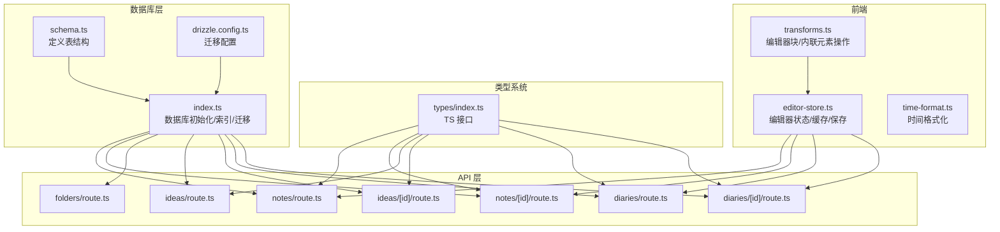
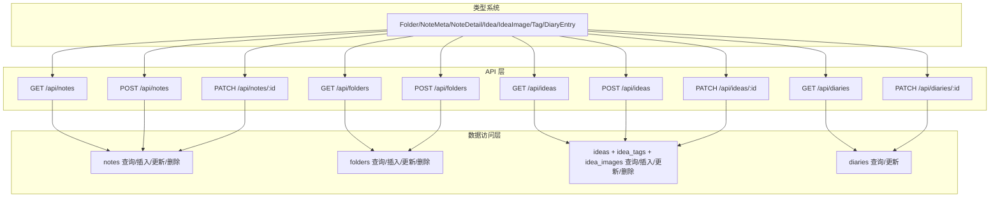
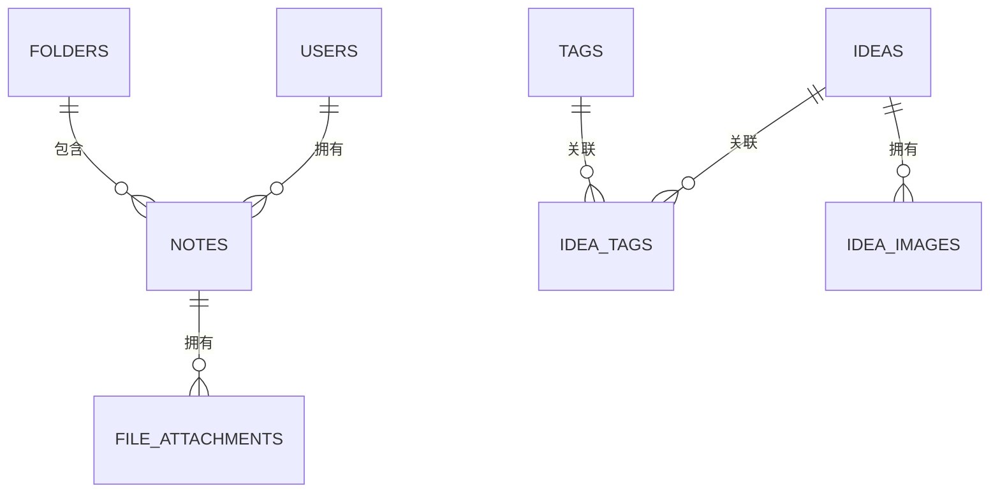
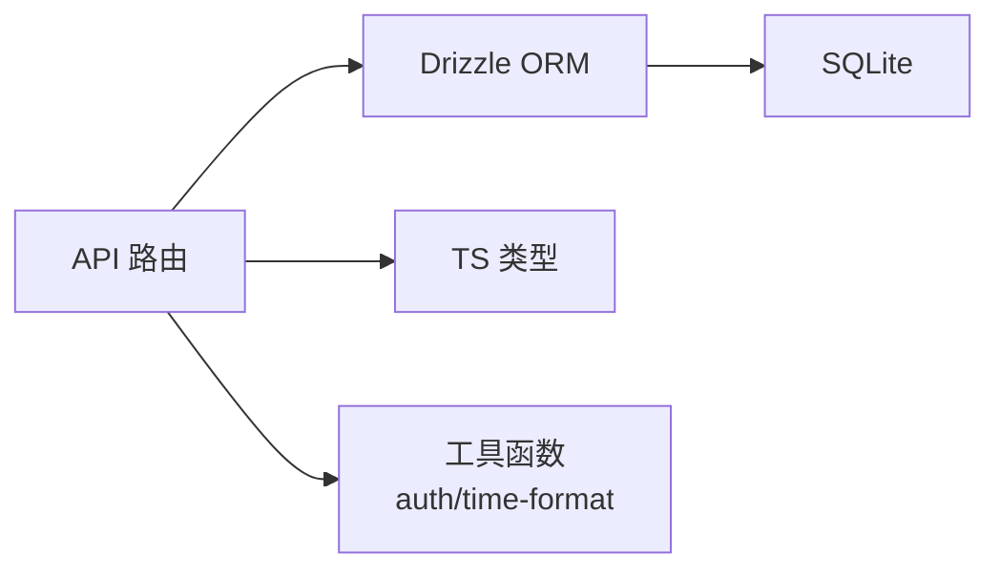

# 数据模型详解

<cite>
**本文引用的文件**
- [schema.ts](file://src/db/schema.ts)
- [index.ts](file://src/db/index.ts)
- [drizzle.config.ts](file://drizzle.config.ts)
- [types/index.ts](file://src/types/index.ts)
- [notes/route.ts](file://src/app/api/notes/route.ts)
- [notes/[id]/route.ts](file://src/app/api/notes/[id]/route.ts)
- [folders/route.ts](file://src/app/api/folders/route.ts)
- [ideas/route.ts](file://src/app/api/ideas/route.ts)
- [ideas/[id]/route.ts](file://src/app/api/ideas/[id]/route.ts)
- [diaries/route.ts](file://src/app/api/diaries/route.ts)
- [diaries/[id]/route.ts](file://src/app/api/diaries/[id]/route.ts)
- [editor-store.ts](file://src/stores/editor-store.ts)
- [transforms.ts](file://src/components/editor/transforms.ts)
- [time-format.ts](file://src/lib/time-format.ts)
</cite>

## 目录
1. [引言](#引言)
2. [项目结构](#项目结构)
3. [核心数据模型](#核心数据模型)
4. [架构总览](#架构总览)
5. [详细组件分析](#详细组件分析)
6. [依赖关系分析](#依赖关系分析)
7. [性能考量](#性能考量)
8. [故障排查指南](#故障排查指南)
9. [结论](#结论)
10. [附录](#附录)

## 引言
本文件系统性梳理 YNote v2 的数据模型设计与实现，覆盖数据库层（Drizzle ORM + SQLite）、类型系统（TypeScript 接口）以及 API 层的数据流转与校验规则。重点说明各模型之间的关系映射（一对一、一对多、多对多），生命周期管理（创建、读取、更新、删除），以及在不同层面（API、业务逻辑、数据访问）的使用方式。同时给出模型扩展与自定义的最佳实践、与 TypeScript 类型系统的集成方法，以及复杂查询的使用示例。

## 项目结构
YNote v2 的数据模型主要由以下部分组成：
- 数据库层：使用 Drizzle ORM 定义 SQLite 表结构，并通过单例连接管理初始化数据库与索引。
- 类型系统：在 TypeScript 中定义与数据库表结构对应的接口，用于前端状态与 API 响应。
- API 层：REST 风格路由负责数据校验、查询与写入，统一返回结构化的响应。
- 前端状态与编辑器：编辑器 Store 管理内容缓存、保存状态与字数统计；编辑器插件负责内容插入与块类型切换。

图表来源
- [schema.ts:1-105](file://src/db/schema.ts#L1-L105)
- [index.ts:1-171](file://src/db/index.ts#L1-L171)
- [drizzle.config.ts:1-8](file://drizzle.config.ts#L1-L8)
- [types/index.ts:1-74](file://src/types/index.ts#L1-L74)
- [notes/route.ts:1-86](file://src/app/api/notes/route.ts#L1-L86)
- [notes/[id]/route.ts](file://src/app/api/notes/[id]/route.ts#L1-L104)
- [folders/route.ts:1-75](file://src/app/api/folders/route.ts#L1-L75)
- [ideas/route.ts:1-151](file://src/app/api/ideas/route.ts#L1-L151)
- [ideas/[id]/route.ts](file://src/app/api/ideas/[id]/route.ts#L1-L117)
- [diaries/route.ts:1-45](file://src/app/api/diaries/route.ts#L1-L45)
- [diaries/[id]/route.ts](file://src/app/api/diaries/[id]/route.ts#L1-L63)
- [editor-store.ts:1-281](file://src/stores/editor-store.ts#L1-L281)
- [transforms.ts:1-208](file://src/components/editor/transforms.ts#L1-L208)
- [time-format.ts:1-27](file://src/lib/time-format.ts#L1-L27)

章节来源
- [schema.ts:1-105](file://src/db/schema.ts#L1-L105)
- [index.ts:1-171](file://src/db/index.ts#L1-L171)
- [drizzle.config.ts:1-8](file://drizzle.config.ts#L1-L8)

## 核心数据模型
本节从数据库表结构出发，逐个解析模型的设计理念、字段含义、约束与默认值，并说明其在 TypeScript 类型系统中的对应关系。

- 用户（users）
  - 设计理念：最小权限账户模型，仅保留管理员账户与密码哈希，便于本地部署与安全控制。
  - 关键字段：id（主键，默认 admin）、passwordHash、createdAt、updatedAt。
  - 约束与默认值：id 默认 admin；时间戳均为数值型。
  - 对应 TS 类型：无直接接口映射，但可作为鉴权上下文的基础对象。
  
- 文件夹（folders）
  - 设计理念：树形目录结构，支持最多两级子层级；提供排序、展开与归档能力。
  - 关键字段：id、parentId（自引用，级联删除）、name、sortOrder、isExpanded、isArchived、createdAt、updatedAt。
  - 约束与默认值：sortOrder 默认 0；isExpanded 默认 true；isArchived 默认 false；外键 onDelete: cascade。
  - 对应 TS 类型：Folder。
  
- 笔记（notes）
  - 设计理念：内容型实体，支持挂载到文件夹或根级别；提供标题、正文、Markdown、字数统计与排序。
  - 关键字段：id、folderId（外键，onDelete: set null）、title、content、markdown、wordCount、sortOrder、createdAt、updatedAt。
  - 约束与默认值：title 默认 Untitled；wordCount 默认 0；sortOrder 默认 0；folderId 可为 null。
  - 对应 TS 类型：NoteMeta（元信息）、NoteDetail（详情）。
  
- 文件附件（file_attachments）
  - 设计理念：与笔记关联的附件表，支持多种存储类型与媒体属性。
  - 关键字段：id、noteId（外键，onDelete: cascade）、fileName、filePath、storageType、cosUrl、mimeType、size、width、height、createdAt。
  - 约束与默认值：noteId 非空；onDelete: cascade。
  - 对应 TS 类型：无直接映射。
  
- 想法（ideas）
  - 设计理念：独立的内容单元，可关联标签与图片，支持分页与游标查询。
  - 关键字段：id、content、createdAt、updatedAt。
  - 约束与默认值：content 非空。
  - 对应 TS 类型：Idea。
  
- 想法图片（idea_images）
  - 设计理念：想法的媒体资源，支持宽高与存储信息。
  - 关键字段：id、ideaId（外键，onDelete: cascade）、fileName、filePath、storageType、cosUrl、mimeType、size、width、height、createdAt。
  - 约束与默认值：ideaId 非空；onDelete: cascade。
  - 对应 TS 类型：IdeaImage。
  
- 标签（tags）
  - 设计理念：去重标签，全局唯一。
  - 关键字段：id、name（唯一）、createdAt。
  - 约束与默认值：name 唯一。
  - 对应 TS 类型：Tag。
  
- 想法-标签关联（idea_tags）
  - 设计理念：多对多关系，支持标签的动态增删改。
  - 关键字段：ideaId、tagId（联合主键），均非空且级联删除。
  - 约束与默认值：联合主键（idea_id, tag_id）。
  - 对应 TS 类型：Tag（在 Idea 中以数组形式出现）。
  
- 日记（diaries）
  - 设计理念：按日/周两种粒度记录，支持 ISO 周计算与字数统计。
  - 关键字段：id、type（枚举 'daily' | 'weekly'）、date（日格式或 ISO 周格式）、year、weekNumber、content、markdown、wordCount、createdAt、updatedAt。
  - 约束与默认值：wordCount 默认 0；存在复合唯一索引（type, date）与相关索引。
  - 对应 TS 类型：DiaryEntry、DiaryMeta。

章节来源
- [schema.ts:1-105](file://src/db/schema.ts#L1-L105)
- [types/index.ts:1-74](file://src/types/index.ts#L1-L74)

## 架构总览
下图展示数据模型在三层中的角色与交互：

图表来源
- [notes/route.ts:1-86](file://src/app/api/notes/route.ts#L1-L86)
- [notes/[id]/route.ts](file://src/app/api/notes/[id]/route.ts#L1-L104)
- [folders/route.ts:1-75](file://src/app/api/folders/route.ts#L1-L75)
- [ideas/route.ts:1-151](file://src/app/api/ideas/route.ts#L1-L151)
- [ideas/[id]/route.ts](file://src/app/api/ideas/[id]/route.ts#L1-L117)
- [diaries/route.ts:1-45](file://src/app/api/diaries/route.ts#L1-L45)
- [diaries/[id]/route.ts](file://src/app/api/diaries/[id]/route.ts#L1-L63)
- [types/index.ts:1-74](file://src/types/index.ts#L1-L74)

## 详细组件分析

### 关系映射与生命周期
- 一对一
  - notes ↔ file_attachments：每条附件属于一个笔记，删除笔记时级联删除附件。
  - ideas ↔ idea_images：每张图片属于一个想法，删除想法时级联删除图片。
- 一对多
  - folders（parentId）↔ folders：父文件夹可有多个子文件夹（最多两级）。
  - folders ↔ notes：一个文件夹可包含多个笔记（含根级笔记）。
  - ideas ↔ idea_tags：一个想法可关联多个标签。
  - tags ↔ idea_tags：一个标签可被多个想法使用。
- 多对多
  - ideas ↔ tags：通过中间表 idea_tags 实现多对多。

图表来源
- [schema.ts:1-105](file://src/db/schema.ts#L1-L105)

生命周期管理（CRUD）与数据流转
- 创建：API 层接收请求体，进行字段校验与默认值填充，调用 Drizzle ORM 插入记录并返回标准化响应。
- 读取：API 层根据查询参数构建 SQL 查询，必要时进行 JOIN 与分页/游标处理，返回聚合后的结果。
- 更新：API 层仅更新允许字段，自动维护 updatedAt；多对多关系采用全量替换策略。
- 删除：API 层先检查存在性，再执行删除；级联删除在数据库层保证一致性。

章节来源
- [notes/route.ts:1-86](file://src/app/api/notes/route.ts#L1-L86)
- [notes/[id]/route.ts](file://src/app/api/notes/[id]/route.ts#L1-L104)
- [folders/route.ts:1-75](file://src/app/api/folders/route.ts#L1-L75)
- [ideas/route.ts:1-151](file://src/app/api/ideas/route.ts#L1-L151)
- [ideas/[id]/route.ts](file://src/app/api/ideas/[id]/route.ts#L1-L117)
- [diaries/route.ts:1-45](file://src/app/api/diaries/route.ts#L1-L45)
- [diaries/[id]/route.ts](file://src/app/api/diaries/[id]/route.ts#L1-L63)

### 模型验证规则与数据转换
- 字符串长度与非法字符
  - 标题/名称最大长度限制与非法字符过滤在 API 层完成，确保入库前的合法性。
- 数值字段
  - wordCount、sortOrder、year、weekNumber 等字段在 API 层进行类型校验与默认值设置。
- 外键与层级约束
  - 文件夹最多两级，父文件夹必须存在且其 parentId 必须为 null；笔记的 folderId 可为 null（根级）。
- 多对多关系
  - 想法的标签通过全量替换策略更新，避免重复与遗漏。
- 时间戳
  - 所有模型统一使用数值型时间戳，便于排序与比较。

章节来源
- [notes/route.ts:7-8](file://src/app/api/notes/route.ts#L7-L8)
- [folders/route.ts:7-17](file://src/app/api/folders/route.ts#L7-L17)
- [ideas/route.ts:86-150](file://src/app/api/ideas/route.ts#L86-L150)
- [ideas/[id]/route.ts](file://src/app/api/ideas/[id]/route.ts#L40-L94)

### 在不同层面的使用方式
- API 层
  - 读取：GET /api/notes、GET /api/folders、GET /api/ideas、GET /api/diaries。
  - 写入：POST /api/notes、POST /api/folders、POST /api/ideas。
  - 更新：PATCH /api/notes/:id、PATCH /api/ideas/:id、PATCH /api/diaries/:id。
  - 删除：DELETE /api/notes/:id、DELETE /api/ideas/:id。
- 业务逻辑层（前端）
  - 编辑器 Store 管理当前编辑内容、保存状态、字数统计与 LRU 缓存；支持手动保存与序列化为 Markdown。
  - 编辑器插件提供块/内联元素插入与类型切换，辅助内容结构化。
- 数据访问层（Drizzle ORM）
  - 使用 schema.ts 定义的表结构与索引；通过单例连接管理初始化数据库、索引与迁移。

章节来源
- [notes/route.ts:1-86](file://src/app/api/notes/route.ts#L1-L86)
- [notes/[id]/route.ts](file://src/app/api/notes/[id]/route.ts#L1-L104)
- [folders/route.ts:1-75](file://src/app/api/folders/route.ts#L1-L75)
- [ideas/route.ts:1-151](file://src/app/api/ideas/route.ts#L1-L151)
- [ideas/[id]/route.ts](file://src/app/api/ideas/[id]/route.ts#L1-L117)
- [diaries/route.ts:1-45](file://src/app/api/diaries/route.ts#L1-L45)
- [diaries/[id]/route.ts](file://src/app/api/diaries/[id]/route.ts#L1-L63)
- [editor-store.ts:1-281](file://src/stores/editor-store.ts#L1-L281)
- [transforms.ts:1-208](file://src/components/editor/transforms.ts#L1-L208)
- [index.ts:1-171](file://src/db/index.ts#L1-L171)

### 模型扩展与自定义最佳实践
- 新增字段
  - 在 schema.ts 中添加字段并更新 drizzle.config.ts；运行迁移生成新版本；在 index.ts 中补充初始化 SQL 与迁移逻辑。
- 新增表
  - 定义新表结构与索引；在 API 层新增路由；在 TypeScript 中补充接口映射。
- 多对多关系
  - 通过中间表实现，更新时采用全量替换策略，确保一致性。
- 索引优化
  - 为高频查询字段建立索引（如 folders.parent_id、notes.folder_id、diaries.year/week_number 等）。
- 兼容性
  - 迁移脚本需考虑历史数据兼容，避免破坏现有记录。

章节来源
- [schema.ts:1-105](file://src/db/schema.ts#L1-L105)
- [index.ts:132-158](file://src/db/index.ts#L132-L158)
- [drizzle.config.ts:1-8](file://drizzle.config.ts#L1-L8)

### 与 TypeScript 类型系统的集成
- 类型映射
  - Folder → folders 表；NoteMeta/NoteDetail → notes 表；Idea/IdeaImage → ideas/idea_images 表；Tag → tags 表；DiaryEntry/DiaryMeta → diaries 表。
- 使用建议
  - 在 API 返回与前端状态中优先使用 TS 接口，确保编译期类型安全。
  - 对于复杂查询结果（如 GET /api/ideas），在前端 Store 中进行二次组装，保持接口稳定。

章节来源
- [types/index.ts:1-74](file://src/types/index.ts#L1-L74)

### 复杂查询示例
- 按标签筛选想法并分页/游标
  - 使用 innerJoin ideaTags + tags，结合游标条件与 limit 控制返回数量。
- 按年份查询日记并排序
  - 使用 where(diaries.year = year)，orderBy(desc(weekNumber), asc(type), desc(date))。
- 获取笔记列表（支持根级与指定文件夹）
  - 使用 isNull(notes.folderId) 或 eq(notes.folderId, folderId)，并按 sort_order 与 createdAt 排序。

章节来源
- [ideas/route.ts:7-84](file://src/app/api/ideas/route.ts#L7-L84)
- [diaries/route.ts:6-44](file://src/app/api/diaries/route.ts#L6-L44)
- [notes/route.ts:10-40](file://src/app/api/notes/route.ts#L10-L40)

## 依赖关系分析
- 组件耦合
  - API 路由依赖 Drizzle ORM 与 schema；Drizzle ORM 依赖 SQLite；类型系统独立于数据库层。
- 外部依赖
  - better-sqlite3、drizzle-orm、nanoid、bcryptjs、jose（JWT）等。
- 循环依赖
  - 当前结构清晰，无明显循环依赖迹象。

图表来源
- [index.ts:1-171](file://src/db/index.ts#L1-L171)
- [notes/route.ts:1-86](file://src/app/api/notes/route.ts#L1-L86)
- [ideas/route.ts:1-151](file://src/app/api/ideas/route.ts#L1-L151)
- [diaries/route.ts:1-45](file://src/app/api/diaries/route.ts#L1-L45)
- [time-format.ts:1-27](file://src/lib/time-format.ts#L1-L27)

章节来源
- [index.ts:1-171](file://src/db/index.ts#L1-L171)

## 性能考量
- 索引策略
  - 为 folders.parent_id、notes.folder_id、file_attachments.note_id、idea_images.idea_id、idea_tags.idea_id/tag_id、diaries.type+date、diaries.year、diaries.year+week_number 建立索引，提升查询效率。
- 查询优化
  - 使用投影选择必要字段，避免 SELECT *；对大结果集采用 limit 与游标分页。
- 缓存
  - 前端编辑器 Store 使用 LRU 缓存减少重复请求；保存成功后更新缓存。
- 序列化成本
  - 编辑器内容序列化为 Markdown 时尽量避免频繁触发，必要时延迟或批量处理。

章节来源
- [index.ts:73-130](file://src/db/index.ts#L73-L130)
- [editor-store.ts:66-77](file://src/stores/editor-store.ts#L66-L77)
- [editor-store.ts:204-275](file://src/stores/editor-store.ts#L204-L275)

## 故障排查指南
- 常见错误与定位
  - “笔记/想法/日记不存在”：检查 ID 是否正确，确认数据库中是否存在该记录。
  - “父文件夹不存在/最多两级文件夹”：确认 parentId 存在且其 parentId 为 null。
  - “标题/名称包含非法字符或超长”：检查输入是否符合长度与字符集要求。
  - “创建失败/更新失败”：查看 API 层返回的错误码与消息，核对请求体字段与类型。
- 调试建议
  - 启用数据库日志与 API 错误日志；逐步缩小问题范围至具体路由与查询。
  - 使用时间格式化函数验证时间戳显示是否异常。

章节来源
- [notes/[id]/route.ts](file://src/app/api/notes/[id]/route.ts#L18-L26)
- [ideas/[id]/route.ts](file://src/app/api/ideas/[id]/route.ts#L104-L112)
- [diaries/[id]/route.ts](file://src/app/api/diaries/[id]/route.ts#L15-L23)
- [folders/route.ts:44-56](file://src/app/api/folders/route.ts#L44-L56)
- [notes/route.ts:49-57](file://src/app/api/notes/route.ts#L49-L57)
- [time-format.ts:1-27](file://src/lib/time-format.ts#L1-L27)

## 结论
YNote v2 的数据模型围绕“简单、清晰、可扩展”的原则设计：通过 Drizzle ORM 与 SQLite 提供可靠的持久化能力，配合 TypeScript 接口确保类型安全；API 层严格的数据校验与标准化响应提升了系统的健壮性；前端编辑器 Store 与插件体系则保障了内容创作体验。多对多关系通过中间表实现，生命周期管理清晰，适合持续演进与扩展。

## 附录
- 迁移与初始化
  - 使用 drizzle.config.ts 配置迁移输出路径；index.ts 中包含初始化 SQL 与迁移逻辑，确保表结构与索引一致。
- 安全与鉴权
  - users 表用于本地管理员账户；JWT 工具函数可用于后续鉴权流程扩展。

章节来源
- [drizzle.config.ts:1-8](file://drizzle.config.ts#L1-L8)
- [index.ts:132-158](file://src/db/index.ts#L132-L158)