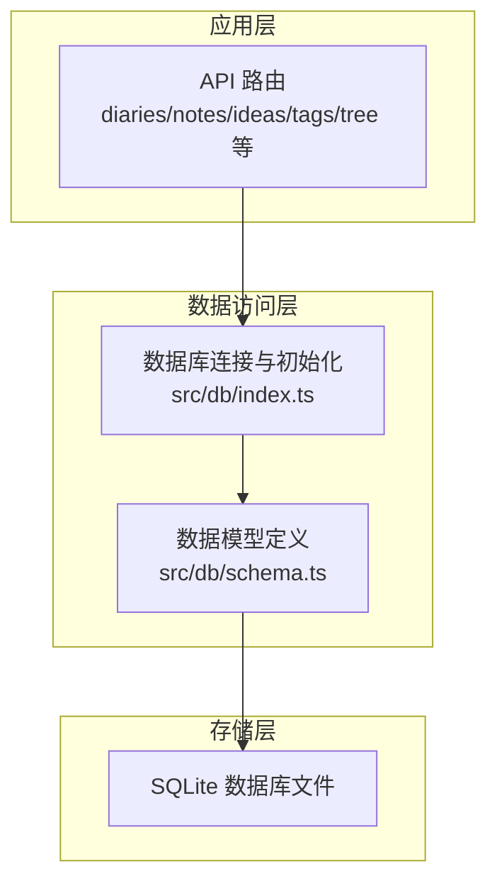
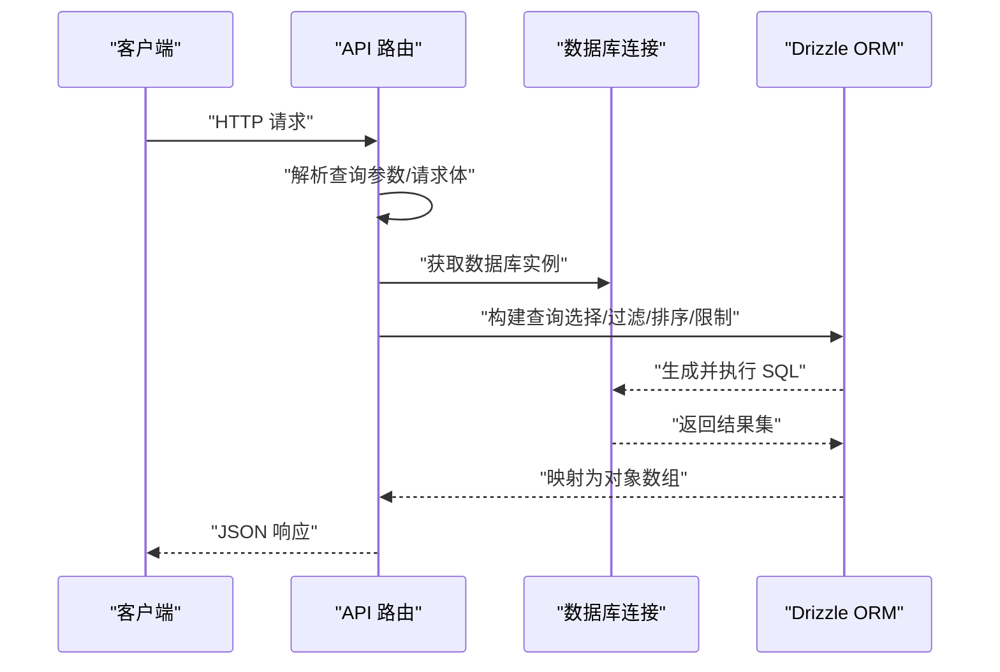
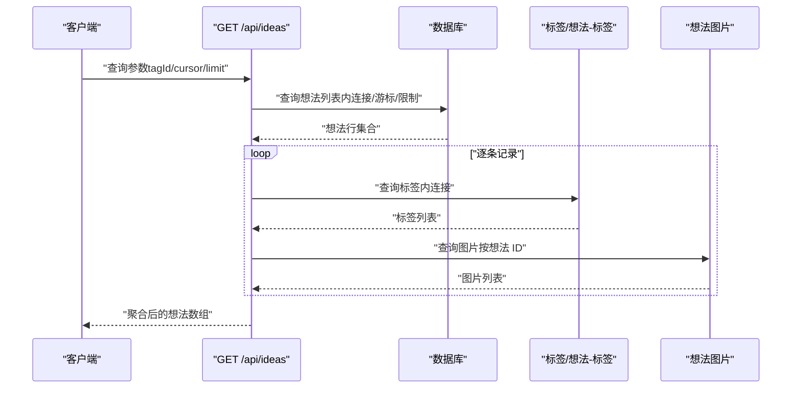
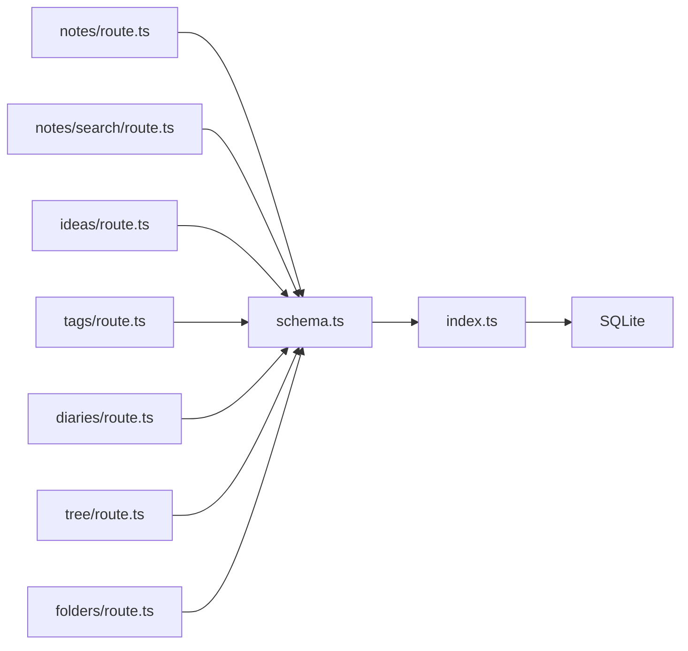

# 查询模式与优化

<cite>
**本文引用的文件**
- [src/db/index.ts](file://src/db/index.ts)
- [src/db/schema.ts](file://src/db/schema.ts)
- [src/app/api/diaries/route.ts](file://src/app/api/diaries/route.ts)
- [src/app/api/folders/route.ts](file://src/app/api/folders/route.ts)
- [src/app/api/notes/route.ts](file://src/app/api/notes/route.ts)
- [src/app/api/notes/search/route.ts](file://src/app/api/notes/search/route.ts)
- [src/app/api/ideas/route.ts](file://src/app/api/ideas/route.ts)
- [src/app/api/tags/route.ts](file://src/app/api/tags/route.ts)
- [src/app/api/tree/route.ts](file://src/app/api/tree/route.ts)
</cite>

## 目录
1. [引言](#引言)
2. [项目结构](#项目结构)
3. [核心组件](#核心组件)
4. [架构总览](#架构总览)
5. [详细组件分析](#详细组件分析)
6. [依赖关系分析](#依赖关系分析)
7. [性能考量](#性能考量)
8. [故障排查指南](#故障排查指南)
9. [结论](#结论)
10. [附录](#附录)

## 引言
本文件系统性梳理 YNote v2 的数据库查询模式与优化策略，覆盖 CRUD 基础操作、关联查询、聚合统计、分页与游标、排序与过滤、复杂查询构建技巧、性能监控与缓存策略、常见陷阱与重构案例，以及事务与并发控制建议。目标是帮助开发者在保持代码可读性的同时，写出高性能且可维护的查询逻辑。

## 项目结构
YNote v2 使用 Drizzle ORM + better-sqlite3 实现 SQLite 数据访问层，并通过 Next.js App Router 的 API 路由暴露查询接口。数据模型集中在 schema 文件中定义，数据库初始化与索引在数据库入口文件中完成。

图表来源
- [src/db/index.ts:1-171](file://src/db/index.ts#L1-L171)
- [src/db/schema.ts:1-105](file://src/db/schema.ts#L1-L105)

章节来源
- [src/db/index.ts:1-171](file://src/db/index.ts#L1-L171)
- [src/db/schema.ts:1-105](file://src/db/schema.ts#L1-L105)

## 核心组件
- 数据库连接与初始化：负责目录与数据库文件准备、WAL 模式、外键约束、表与索引初始化、迁移与默认用户初始化。
- 数据模型：以 Drizzle 表定义组织，涵盖用户、文件夹、笔记、附件、想法、想法图片、标签、想法-标签关联、日记等。
- API 路由：围绕 CRUD、关联查询、聚合统计与分页游标进行实现。

章节来源
- [src/db/index.ts:10-25](file://src/db/index.ts#L10-L25)
- [src/db/index.ts:27-158](file://src/db/index.ts#L27-L158)
- [src/db/schema.ts:3-104](file://src/db/schema.ts#L3-L104)

## 架构总览
Drizzle ORM 将类型安全的查询表达式编译为 SQLite SQL，API 路由在运行时组合查询条件、执行并返回 JSON 响应。查询路径通常为“请求参数解析 → 组合查询 → 执行 → 序列化响应”。

图表来源
- [src/app/api/notes/route.ts:10-40](file://src/app/api/notes/route.ts#L10-L40)
- [src/app/api/notes/search/route.ts:6-38](file://src/app/api/notes/search/route.ts#L6-L38)
- [src/app/api/ideas/route.ts:7-84](file://src/app/api/ideas/route.ts#L7-L84)

## 详细组件分析

### 数据库连接与初始化
- 连接管理：单例模式，首次使用时创建并缓存连接；启用 WAL 模式与外键约束。
- 初始化流程：创建核心表与索引，执行迁移（如新增归档字段），按需初始化管理员账户。
- 典型优化点：WAL 提升并发读写；外键约束保障一致性；索引覆盖常用过滤与排序字段。

章节来源
- [src/db/index.ts:10-25](file://src/db/index.ts#L10-L25)
- [src/db/index.ts:27-158](file://src/db/index.ts#L27-L158)

### 文件夹查询（GET /api/folders）
- 功能要点：无参数时返回全部文件夹，按排序与创建时间升序排列。
- 查询模式：基础 SELECT + ORDER BY。
- 性能提示：利用已建立的排序与创建时间索引；避免一次性返回过多节点，结合前端懒加载。

章节来源
- [src/app/api/folders/route.ts:19-32](file://src/app/api/folders/route.ts#L19-L32)

### 笔记查询（GET /api/notes）
- 功能要点：支持按 folderId 过滤；root 特殊处理（folderId 为空）；排序基于排序号与创建时间。
- 查询模式：条件过滤 + 多列选择 + 排序。
- 性能提示：使用 folder_id 索引；避免 SELECT *；必要时引入分页或游标。

章节来源
- [src/app/api/notes/route.ts:10-40](file://src/app/api/notes/route.ts#L10-L40)

### 日记查询（GET /api/diaries）
- 功能要点：按年份过滤，按周数、类型、日期排序。
- 查询模式：WHERE + ORDER BY 多列组合。
- 性能提示：year 字段已有索引；注意排序列顺序对索引利用的影响。

章节来源
- [src/app/api/diaries/route.ts:6-44](file://src/app/api/diaries/route.ts#L6-L44)

### 笔记搜索（GET /api/notes/search）
- 功能要点：关键词模糊匹配标题、正文与 Markdown 字段。
- 查询模式：OR 条件 + LIKE 模糊匹配。
- 性能提示：LIKE 通配符前缀会破坏索引；可考虑全文检索扩展或预处理词干/分词（当前实现为 SQLite 原生 LIKE）。

章节来源
- [src/app/api/notes/search/route.ts:6-43](file://src/app/api/notes/search/route.ts#L6-L43)

### 想法列表与详情（GET /api/ideas）
- 功能要点：支持按标签过滤、游标分页、每条记录附加标签与图片信息。
- 查询模式：内连接（想法-标签）、左连接（标签计数）、多轮查询（每条记录再查标签与图片）。
- 性能提示：游标分页减少 OFFSET；每条记录二次查询可能放大 N+1 风险；建议批量预取或合并查询。

图表来源
- [src/app/api/ideas/route.ts:7-84](file://src/app/api/ideas/route.ts#L7-L84)

章节来源
- [src/app/api/ideas/route.ts:7-84](file://src/app/api/ideas/route.ts#L7-L84)

### 标签聚合（GET /api/tags）
- 功能要点：统计每个标签被想法引用的次数。
- 查询模式：LEFT JOIN + GROUP BY + 聚合函数。
- 性能提示：索引覆盖关联键；避免不必要的列选择；ORDER BY 聚合列时注意成本。

章节来源
- [src/app/api/tags/route.ts:6-27](file://src/app/api/tags/route.ts#L6-L27)

### 文件树（GET /api/tree）
- 功能要点：一次性返回所有文件夹与笔记，便于前端构建树形结构。
- 查询模式：两个独立查询，分别排序后合并。
- 性能提示：数据量大时建议分页或按需加载；避免重复全量拉取。

章节来源
- [src/app/api/tree/route.ts:6-35](file://src/app/api/tree/route.ts#L6-L35)

### CRUD 操作与事务建议
- 创建（POST /api/notes, /api/folders, /api/ideas）：参数校验后插入，返回新记录关键字段。
- 更新/删除：当前仓库未见对应路由实现，建议统一在 Drizzle 中使用事务包裹多表更新，确保一致性。
- 事务与并发：SQLite 在 WAL 模式下并发读写更友好；长事务应尽量缩短持有锁的时间。

章节来源
- [src/app/api/notes/route.ts:42-85](file://src/app/api/notes/route.ts#L42-L85)
- [src/app/api/folders/route.ts:34-74](file://src/app/api/folders/route.ts#L34-L74)
- [src/app/api/ideas/route.ts:86-150](file://src/app/api/ideas/route.ts#L86-L150)

### 关联查询与 N+1 风险
- 现状：想法列表在返回前对每条记录单独查询标签与图片，存在 N+1 风险。
- 优化建议：使用 JOIN 或子查询一次性收集标签与图片，减少往返次数。

章节来源
- [src/app/api/ideas/route.ts:47-77](file://src/app/api/ideas/route.ts#L47-L77)

### 聚合查询与排序
- 聚合：标签计数通过 LEFT JOIN + GROUP BY 实现。
- 排序：按聚合值降序；多列排序时注意索引覆盖与排序稳定性。

章节来源
- [src/app/api/tags/route.ts:10-20](file://src/app/api/tags/route.ts#L10-L20)

### 分页与游标
- 游标分页：想法列表使用 createdAt 作为游标，避免 OFFSET 的性能问题。
- 限制：服务端限制最大分页大小，防止滥用。

章节来源
- [src/app/api/ideas/route.ts:10-46](file://src/app/api/ideas/route.ts#L10-L46)

### 过滤与排序
- 过滤：按年份、文件夹、标签、游标时间等条件组合。
- 排序：多列排序保证稳定输出；注意索引命中情况。

章节来源
- [src/app/api/diaries/route.ts:18-34](file://src/app/api/diaries/route.ts#L18-L34)
- [src/app/api/notes/route.ts:27-34](file://src/app/api/notes/route.ts#L27-L34)
- [src/app/api/ideas/route.ts:27-42](file://src/app/api/ideas/route.ts#L27-L42)

## 依赖关系分析
Drizzle ORM 将类型安全的查询表达式映射到 SQLite，API 路由负责参数解析与结果序列化。

图表来源
- [src/app/api/notes/route.ts:1-86](file://src/app/api/notes/route.ts#L1-L86)
- [src/app/api/notes/search/route.ts:1-44](file://src/app/api/notes/search/route.ts#L1-L44)
- [src/app/api/ideas/route.ts:1-151](file://src/app/api/ideas/route.ts#L1-L151)
- [src/app/api/tags/route.ts:1-28](file://src/app/api/tags/route.ts#L1-L28)
- [src/app/api/diaries/route.ts:1-45](file://src/app/api/diaries/route.ts#L1-L45)
- [src/app/api/tree/route.ts:1-36](file://src/app/api/tree/route.ts#L1-L36)
- [src/app/api/folders/route.ts:1-75](file://src/app/api/folders/route.ts#L1-L75)
- [src/db/schema.ts:1-105](file://src/db/schema.ts#L1-L105)
- [src/db/index.ts:1-171](file://src/db/index.ts#L1-L171)

## 性能考量
- 索引与查询匹配
  - 已有索引：文件夹 parent_id、笔记 folder_id、附件 note_id、想法图片 idea_id、想法-标签关联键、日记复合索引等。
  - 建议：针对高频过滤与排序列评估是否需要额外复合索引；LIKE 通配符前缀会降低索引效率。
- 分页与游标
  - 使用游标分页替代 OFFSET，避免大数据量下的偏移开销。
  - 控制单页上限，防止资源占用过高。
- N+1 查询
  - 合并查询或批量预取，减少多次往返。
- 聚合与连接
  - LEFT JOIN + GROUP BY 的聚合查询需关注连接顺序与索引覆盖。
- 并发与事务
  - WAL 模式提升并发读写；短事务、尽早提交，避免长时间持锁。
- 缓存策略
  - 只读列表与聚合结果可采用内存缓存（如 LRU），设置 TTL 与失效策略。
  - 对热点数据（如标签统计）可考虑持久化缓存表并定期刷新。
- 监控与分析
  - 记录慢查询日志（阈值建议 100ms~500ms），定位热点 SQL。
  - 统计 QPS、错误率、平均响应时间，观察异常波动。

[本节为通用指导，不直接分析具体文件]

## 故障排查指南
- 常见错误与修复
  - 参数缺失：如日记查询缺少年份参数，返回 400 并提示缺少参数。
  - 校验失败：标题/名称长度超限或包含非法字符，返回 400。
  - 外键约束：创建子文件夹时父节点不存在或层级超限，返回 400。
  - 查询异常：捕获异常并返回 500，同时记录错误日志以便定位。
- 调试建议
  - 开启 SQLite 日志（如 WAL 日志与回滚段），观察锁等待与写放大。
  - 使用 EXPLAIN QUERY PLAN 分析 SQL 执行计划，确认索引使用情况。
  - 对热点接口增加采样日志，记录入参与耗时。

章节来源
- [src/app/api/diaries/route.ts:11-16](file://src/app/api/diaries/route.ts#L11-L16)
- [src/app/api/notes/route.ts:49-57](file://src/app/api/notes/route.ts#L49-L57)
- [src/app/api/folders/route.ts:37-56](file://src/app/api/folders/route.ts#L37-L56)
- [src/app/api/notes/search/route.ts:11-13](file://src/app/api/notes/search/route.ts#L11-L13)

## 结论
YNote v2 的查询体系以 Drizzle ORM 为核心，结合 SQLite 的 WAL 模式与合理索引，实现了从基础 CRUD 到关联与聚合的完整能力。当前实现中，想法列表存在 N+1 风险与 LIKE 全表扫描风险，建议通过合并查询与全文检索扩展加以优化。配合游标分页、缓存与监控，可在保证体验的前提下持续提升性能与稳定性。

[本节为总结，不直接分析具体文件]

## 附录

### 查询模式速查
- 基础查询
  - 过滤：eq、isNull、lt 等条件组合。
  - 排序：asc、desc 多列组合。
  - 限制：limit 控制返回数量。
- 关联查询
  - 内连接：innerJoin 用于强关联过滤。
  - 左连接：leftJoin 用于聚合统计与保留空值。
- 聚合统计
  - GROUP BY + 聚合函数（COUNT、MAX 等）。
- 分页与游标
  - 游标：基于时间戳或自增列的边界条件。
  - 限制：服务端限制最大页大小。

章节来源
- [src/app/api/ideas/route.ts:17-42](file://src/app/api/ideas/route.ts#L17-L42)
- [src/app/api/tags/route.ts:10-20](file://src/app/api/tags/route.ts#L10-L20)
- [src/app/api/notes/search/route.ts:18-36](file://src/app/api/notes/search/route.ts#L18-L36)