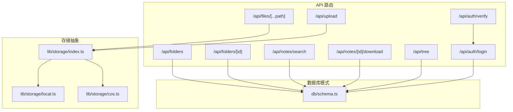
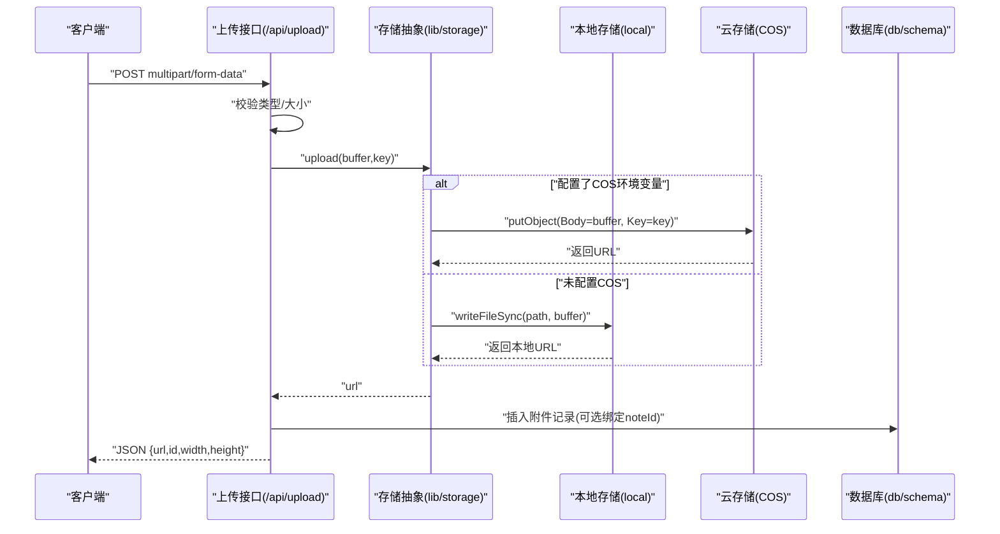
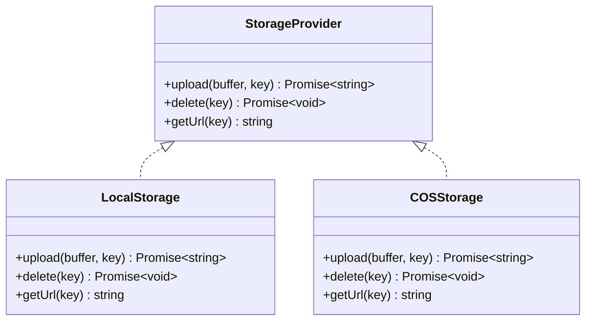
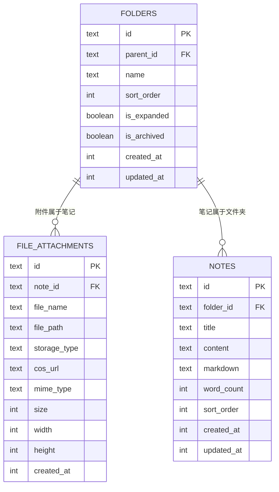

# 文件 API 接口

<cite>
**本文引用的文件**
- [src/app/api/files/[...path]/route.ts](file://src/app/api/files/[...path]/route.ts)
- [src/app/api/folders/route.ts](file://src/app/api/folders/route.ts)
- [src/app/api/folders/[id]/route.ts](file://src/app/api/folders/[id]/route.ts)
- [src/app/api/upload/route.ts](file://src/app/api/upload/route.ts)
- [src/app/api/notes/search/route.ts](file://src/app/api/notes/search/route.ts)
- [src/app/api/notes/[id]/download/route.ts](file://src/app/api/notes/[id]/download/route.ts)
- [src/app/api/tree/route.ts](file://src/app/api/tree/route.ts)
- [src/lib/storage/index.ts](file://src/lib/storage/index.ts)
- [src/lib/storage/local.ts](file://src/lib/storage/local.ts)
- [src/lib/storage/cos.ts](file://src/lib/storage/cos.ts)
- [src/lib/auth.ts](file://src/lib/auth.ts)
- [src/app/api/auth/login/route.ts](file://src/app/api/auth/login/route.ts)
- [src/app/api/auth/verify/route.ts](file://src/app/api/auth/verify/route.ts)
- [src/db/schema.ts](file://src/db/schema.ts)
</cite>

## 目录
1. [简介](#简介)
2. [项目结构](#项目结构)
3. [核心组件](#核心组件)
4. [架构总览](#架构总览)
5. [详细组件分析](#详细组件分析)
6. [依赖关系分析](#依赖关系分析)
7. [性能考虑](#性能考虑)
8. [故障排除指南](#故障排除指南)
9. [结论](#结论)
10. [附录](#附录)

## 简介
本文件为“文件 API 接口”的完整技术文档，覆盖文件系统相关接口的 HTTP 方法、URL 模式、请求参数、响应格式与行为约束。重点包括：
- 文件上传（multipart/form-data）与本地/云存储适配
- 文件下载（基于路径解析、内容类型设置与流式传输）
- 文件夹管理（创建、删除、重命名、移动）
- 文件搜索（关键词检索、排序与分页）
- 权限验证与访问控制（登录、令牌校验、速率限制）
- 错误响应与状态码
- 版本控制与向后兼容策略
- 客户端使用示例与性能优化建议

## 项目结构
与文件 API 相关的核心路由与存储层如下所示：

图表来源
- [src/app/api/files/[...path]/route.ts](file://src/app/api/files/[...path]/route.ts#L1-L48)
- [src/app/api/upload/route.ts:1-153](file://src/app/api/upload/route.ts#L1-L153)
- [src/app/api/folders/route.ts:1-75](file://src/app/api/folders/route.ts#L1-L75)
- [src/app/api/folders/[id]/route.ts](file://src/app/api/folders/[id]/route.ts#L1-L101)
- [src/app/api/notes/search/route.ts:1-44](file://src/app/api/notes/search/route.ts#L1-L44)
- [src/app/api/notes/[id]/download/route.ts](file://src/app/api/notes/[id]/download/route.ts#L1-L33)
- [src/app/api/tree/route.ts:1-36](file://src/app/api/tree/route.ts#L1-L36)
- [src/lib/storage/index.ts:1-30](file://src/lib/storage/index.ts#L1-L30)
- [src/lib/storage/local.ts:1-29](file://src/lib/storage/local.ts#L1-L29)
- [src/lib/storage/cos.ts:1-62](file://src/lib/storage/cos.ts#L1-L62)
- [src/db/schema.ts:1-105](file://src/db/schema.ts#L1-L105)

章节来源
- [src/app/api/files/[...path]/route.ts](file://src/app/api/files/[...path]/route.ts#L1-L48)
- [src/app/api/upload/route.ts:1-153](file://src/app/api/upload/route.ts#L1-L153)
- [src/app/api/folders/route.ts:1-75](file://src/app/api/folders/route.ts#L1-L75)
- [src/app/api/folders/[id]/route.ts](file://src/app/api/folders/[id]/route.ts#L1-L101)
- [src/app/api/notes/search/route.ts:1-44](file://src/app/api/notes/search/route.ts#L1-L44)
- [src/app/api/notes/[id]/download/route.ts](file://src/app/api/notes/[id]/download/route.ts#L1-L33)
- [src/app/api/tree/route.ts:1-36](file://src/app/api/tree/route.ts#L1-L36)
- [src/lib/storage/index.ts:1-30](file://src/lib/storage/index.ts#L1-L30)
- [src/lib/storage/local.ts:1-29](file://src/lib/storage/local.ts#L1-L29)
- [src/lib/storage/cos.ts:1-62](file://src/lib/storage/cos.ts#L1-L62)
- [src/db/schema.ts:1-105](file://src/db/schema.ts#L1-L105)

## 核心组件
- 文件上传接口：支持多类型文件上传，自动按类型处理（图片走压缩/转换流程，其余类型直接保存），生成带年月目录的键值并写入数据库附件表（可选绑定笔记）。
- 文件下载接口：通过路径参数解析文件，进行目录穿越防护，返回二进制流并设置合适的 Content-Type 和缓存头。
- 文件夹管理接口：提供文件夹列表、创建（含层级限制）、更新（重命名、排序、展开状态、归档、移动至父级等）、删除。
- 笔记搜索接口：支持标题/正文/Markdown 关键词模糊匹配，返回精简字段列表。
- 笔记下载接口：将笔记导出为 Markdown 文件，设置正确的 Content-Type 与 Content-Disposition。
- 存储抽象：统一的上传/删除/获取 URL 接口，自动在本地与 COS 之间切换。
- 认证与访问控制：登录签发 JWT 并设置 HttpOnly Cookie，提供令牌校验接口；登录接口内置速率限制。

章节来源
- [src/app/api/upload/route.ts:1-153](file://src/app/api/upload/route.ts#L1-L153)
- [src/app/api/files/[...path]/route.ts](file://src/app/api/files/[...path]/route.ts#L1-L48)
- [src/app/api/folders/route.ts:1-75](file://src/app/api/folders/route.ts#L1-L75)
- [src/app/api/folders/[id]/route.ts](file://src/app/api/folders/[id]/route.ts#L1-L101)
- [src/app/api/notes/search/route.ts:1-44](file://src/app/api/notes/search/route.ts#L1-L44)
- [src/app/api/notes/[id]/download/route.ts](file://src/app/api/notes/[id]/download/route.ts#L1-L33)
- [src/lib/storage/index.ts:1-30](file://src/lib/storage/index.ts#L1-L30)
- [src/lib/auth.ts:1-26](file://src/lib/auth.ts#L1-L26)
- [src/app/api/auth/login/route.ts:1-63](file://src/app/api/auth/login/route.ts#L1-L63)
- [src/app/api/auth/verify/route.ts:1-7](file://src/app/api/auth/verify/route.ts#L1-L7)

## 架构总览
文件 API 的整体调用链路如下：

图表来源
- [src/app/api/upload/route.ts:50-152](file://src/app/api/upload/route.ts#L50-L152)
- [src/lib/storage/index.ts:12-29](file://src/lib/storage/index.ts#L12-L29)
- [src/lib/storage/local.ts:8-16](file://src/lib/storage/local.ts#L8-L16)
- [src/lib/storage/cos.ts:25-40](file://src/lib/storage/cos.ts#L25-L40)
- [src/db/schema.ts:41-55](file://src/db/schema.ts#L41-L55)

## 详细组件分析

### 文件上传接口
- HTTP 方法与路径
  - POST /api/upload
- 请求格式
  - multipart/form-data
  - 字段
    - file: 二进制文件（必填）
    - noteId: 绑定笔记的可选 ID（可选）
- 行为与约束
  - 支持图片、视频、音频、文档类型，不同类别有不同最大尺寸限制。
  - 图片上传会先进行图像处理（生成 webp），再统一以 webp 写入存储。
  - 其他类型直接保存原始二进制，扩展名依据文件名或类型推断。
  - 生成键值规则：年/月/随机ID.扩展名，便于按时间分桶。
  - 若携带 noteId，则写入附件表并记录存储类型（local 或 cos）与 cosUrl。
- 响应
  - 成功：JSON 包含 url、id、width、height（图片时提供，否则为 null/省略）
  - 失败：JSON 包含 error 字段及对应状态码
- 状态码
  - 200：成功
  - 400：缺少文件、类型不支持、大小超限
  - 500：内部错误

章节来源
- [src/app/api/upload/route.ts:50-152](file://src/app/api/upload/route.ts#L50-L152)

### 文件下载接口
- HTTP 方法与路径
  - GET /api/files/[...path]
- 请求参数
  - 路径参数：任意文件路径 segments（如 year/month/name.ext）
- 行为与约束
  - 解析并拼接绝对路径，执行目录穿越防护（确保解析结果位于允许的上传根目录内）。
  - 若文件不存在，返回 404。
  - 读取二进制内容，根据扩展名设置 Content-Type；默认 application/octet-stream。
  - 设置强缓存头（public, max-age=31536000, immutable）。
- 响应
  - 成功：二进制流 + 正确的 Content-Type 与缓存头
  - 失败：JSON 包含 error 字段及对应状态码
- 状态码
  - 200：成功
  - 403：目录穿越检测失败
  - 404：文件不存在
  - 500：服务器错误

章节来源
- [src/app/api/files/[...path]/route.ts](file://src/app/api/files/[...path]/route.ts#L7-L47)

### 文件夹管理接口
- 列表查询
  - GET /api/folders
  - 返回所有文件夹，按 sort_order 与创建时间升序排列
- 创建文件夹
  - POST /api/folders
  - 请求体字段
    - name: 必填，字符串，长度不超过 100，不允许包含特定非法字符
    - parentId: 可选，若提供必须指向顶层（parentId=null）的父节点，且父节点本身也必须是顶层
    - sortOrder: 可选，数字
  - 限制
    - 最大两级深度（根 -> 一级 -> 二级不可用）
    - 含子文件夹的文件夹不可被移动到其他文件夹下
- 更新文件夹
  - PATCH /api/folders/[id]
  - 支持更新 name、sortOrder、isExpanded、isArchived、parentId（含层级与自引用校验）
- 删除文件夹
  - DELETE /api/folders/[id]
  - 若文件夹不存在，返回 404；存在则删除并返回 {success:true}

章节来源
- [src/app/api/folders/route.ts:19-74](file://src/app/api/folders/route.ts#L19-L74)
- [src/app/api/folders/[id]/route.ts](file://src/app/api/folders/[id]/route.ts#L9-L100)

### 笔记搜索接口
- HTTP 方法与路径
  - GET /api/notes/search?q=关键词
- 查询参数
  - q: 必填关键词（空白将返回空数组）
- 响应
  - JSON 包含 notes 数组，每项包含 id、folderId、title、wordCount、sortOrder、createdAt、updatedAt
- 状态码
  - 200：成功
  - 500：服务器错误

章节来源
- [src/app/api/notes/search/route.ts:6-43](file://src/app/api/notes/search/route.ts#L6-L43)

### 笔记下载接口
- HTTP 方法与路径
  - GET /api/notes/[id]/download
- 行为与约束
  - 根据笔记 ID 查询记录；若不存在返回 404
  - 若无 markdown 内容，默认以标题生成基础 Markdown 内容
  - 设置 Content-Type 为 text/markdown; charset=utf-8
  - 设置 Content-Disposition 为 attachment，并对文件名进行 UTF-8 编码
- 响应
  - 成功：Markdown 文本流
  - 失败：JSON 包含 error 字段及对应状态码
- 状态码
  - 200：成功
  - 404：笔记不存在
  - 500：服务器错误

章节来源
- [src/app/api/notes/[id]/download/route.ts](file://src/app/api/notes/[id]/download/route.ts#L6-L32)

### 文件树接口
- HTTP 方法与路径
  - GET /api/tree
- 行为与约束
  - 返回所有文件夹与笔记的聚合视图，分别按排序与创建时间升序排列
- 响应
  - JSON 包含 folders 与 notes 数组
- 状态码
  - 200：成功
  - 500：服务器错误

章节来源
- [src/app/api/tree/route.ts:6-35](file://src/app/api/tree/route.ts#L6-L35)

### 认证与访问控制
- 登录
  - POST /api/auth/login
  - 请求体：{ key: 密钥 }
  - 成功：签发 JWT 并设置 HttpOnly Cookie，清除速率限制计数
  - 失败：401 密钥错误；429 过多尝试（带 Retry-After 与剩余次数头）
- 令牌校验
  - POST /api/auth/verify
  - 仅用于确认中间件已校验通过，返回 {valid:true}
- 速率限制
  - 登录接口内置 IP 级速率限制，防止暴力破解
- JWT
  - 使用 HS256 签发，过期时间可配置

章节来源
- [src/app/api/auth/login/route.ts:9-62](file://src/app/api/auth/login/route.ts#L9-L62)
- [src/app/api/auth/verify/route.ts:3-6](file://src/app/api/auth/verify/route.ts#L3-L6)
- [src/lib/auth.ts:6-25](file://src/lib/auth.ts#L6-L25)

## 依赖关系分析

图表来源
- [src/lib/storage/index.ts:1-5](file://src/lib/storage/index.ts#L1-L5)
- [src/lib/storage/local.ts:7-28](file://src/lib/storage/local.ts#L7-L28)
- [src/lib/storage/cos.ts:11-61](file://src/lib/storage/cos.ts#L11-L61)

章节来源
- [src/lib/storage/index.ts:1-30](file://src/lib/storage/index.ts#L1-L30)
- [src/lib/storage/local.ts:1-29](file://src/lib/storage/local.ts#L1-L29)
- [src/lib/storage/cos.ts:1-62](file://src/lib/storage/cos.ts#L1-L62)

## 性能考虑
- 上传性能
  - 图片预处理与转码（webp）可能带来 CPU 开销，建议在高并发场景启用缓存与异步队列。
  - 对于大文件（视频/音频/文档），避免在请求线程中做额外处理，必要时采用后台任务。
- 下载性能
  - 文件下载设置强缓存头，减少重复请求；CDN 层可进一步加速静态资源。
  - 云存储（COS）与本地存储（LocalStorage）均支持直链访问，优先使用云存储以获得更好扩展性。
- 数据库查询
  - 搜索接口使用模糊匹配，建议在大数据量时增加索引或采用全文检索方案。
  - 分页与游标（cursor）结合，避免深层偏移导致的性能问题。
- 安全与稳定性
  - 上传接口对文件类型与大小严格校验，防止恶意文件。
  - 目录穿越防护与路径规范化，避免任意文件读取风险。

[本节为通用指导，无需列出具体文件来源]

## 故障排除指南
- 上传失败
  - 检查文件类型是否在允许列表内，以及大小是否超过限制。
  - 若使用 COS，确认环境变量配置正确且网络可达。
- 下载 403/404
  - 确认路径参数未包含上层目录符号，且文件确实存在于存储根目录。
- 文件夹操作失败
  - 父级必须为顶层（parentId=null），且目标父级不可已有子级。
  - 含子文件夹的文件夹不可被移动。
- 登录频繁失败
  - 检查速率限制是否触发，等待冷却时间或调整阈值。
- 笔记导出异常
  - 确认笔记存在且包含有效内容；若为空则按标题生成默认内容。

章节来源
- [src/app/api/upload/route.ts:56-82](file://src/app/api/upload/route.ts#L56-L82)
- [src/app/api/files/[...path]/route.ts](file://src/app/api/files/[...path]/route.ts#L15-L23)
- [src/app/api/folders/[id]/route.ts](file://src/app/api/folders/[id]/route.ts#L45-L69)
- [src/app/api/auth/login/route.ts:12-25](file://src/app/api/auth/login/route.ts#L12-L25)

## 结论
本文档系统性梳理了文件 API 的接口规范、数据模型、安全与性能要点。通过统一的存储抽象与严格的输入校验，实现了跨本地与云存储的稳定上传能力；通过目录穿越防护与缓存策略保障了下载的安全与性能；通过层级限制与原子更新保证了文件夹管理的可靠性。建议在生产环境中配合 CDN、缓存与异步处理进一步提升吞吐与可用性。

[本节为总结性内容，无需列出具体文件来源]

## 附录

### API 接口清单与规范

- 文件上传
  - 方法：POST
  - 路径：/api/upload
  - 请求体：multipart/form-data
    - file: 二进制文件（必填）
    - noteId: 绑定笔记的可选 ID（可选）
  - 响应：JSON {url,id,width,height}
  - 状态码：200/400/500

- 文件下载
  - 方法：GET
  - 路径：/api/files/[...path]
  - 响应：二进制流 + Content-Type + 缓存头
  - 状态码：200/403/404/500

- 文件夹列表
  - 方法：GET
  - 路径：/api/folders
  - 响应：JSON 数组（按排序与创建时间升序）

- 创建文件夹
  - 方法：POST
  - 路径：/api/folders
  - 请求体：{name,parentId,sortOrder}
  - 限制：最多两级、父级必须为顶层
  - 响应：JSON 新建文件夹对象
  - 状态码：201/400/500

- 更新文件夹
  - 方法：PATCH
  - 路径：/api/folders/[id]
  - 请求体：{name,sortOrder,isExpanded,isArchived,parentId}
  - 限制：自引用检查、含子文件夹不可移动
  - 响应：JSON 更新后的文件夹对象
  - 状态码：200/400/404/500

- 删除文件夹
  - 方法：DELETE
  - 路径：/api/folders/[id]
  - 响应：JSON {success:true}
  - 状态码：200/404/500

- 笔记搜索
  - 方法：GET
  - 路径：/api/notes/search?q=关键词
  - 响应：JSON {notes:[{id,folderId,title,wordCount,sortOrder,createdAt,updatedAt}]}

- 笔记下载
  - 方法：GET
  - 路径：/api/notes/[id]/download
  - 响应：text/markdown + Content-Disposition
  - 状态码：200/404/500

- 文件树
  - 方法：GET
  - 路径：/api/tree
  - 响应：JSON {folders[],notes[]}

- 登录
  - 方法：POST
  - 路径：/api/auth/login
  - 请求体：{key}
  - 响应：设置 HttpOnly Cookie（token）
  - 状态码：200/400/401/429

- 令牌校验
  - 方法：POST
  - 路径：/api/auth/verify
  - 响应：JSON {valid:true}

章节来源
- [src/app/api/upload/route.ts:50-152](file://src/app/api/upload/route.ts#L50-L152)
- [src/app/api/files/[...path]/route.ts](file://src/app/api/files/[...path]/route.ts#L7-L47)
- [src/app/api/folders/route.ts:19-74](file://src/app/api/folders/route.ts#L19-L74)
- [src/app/api/folders/[id]/route.ts](file://src/app/api/folders/[id]/route.ts#L9-L100)
- [src/app/api/notes/search/route.ts:6-43](file://src/app/api/notes/search/route.ts#L6-L43)
- [src/app/api/notes/[id]/download/route.ts](file://src/app/api/notes/[id]/download/route.ts#L6-L32)
- [src/app/api/tree/route.ts:6-35](file://src/app/api/tree/route.ts#L6-L35)
- [src/app/api/auth/login/route.ts:9-62](file://src/app/api/auth/login/route.ts#L9-L62)
- [src/app/api/auth/verify/route.ts:3-6](file://src/app/api/auth/verify/route.ts#L3-L6)

### 数据模型概览

图表来源
- [src/db/schema.ts:10-25](file://src/db/schema.ts#L10-L25)
- [src/db/schema.ts:27-39](file://src/db/schema.ts#L27-L39)
- [src/db/schema.ts:41-55](file://src/db/schema.ts#L41-L55)

### 版本控制与向后兼容
- 当前未发现显式的 API 版本号（如 v1、v2）路径前缀。
- 建议策略
  - 引入 /api/v1 前缀，保持现有接口不变，新增功能在新版本暴露。
  - 对破坏性变更采用双版本并行过渡，提供迁移指引与废弃时间表。
  - 在响应头中加入 X-API-Version，便于客户端追踪。

[本节为通用指导，无需列出具体文件来源]

### 客户端集成指南
- 上传
  - 使用 multipart/form-data 发送 file 字段；如需绑定笔记，附加 noteId。
  - 读取响应中的 url 作为后续访问地址；若为本地存储，可通过 /api/files 前缀访问。
- 下载
  - 使用 GET /api/files/year/month/randomId.ext 直接下载；浏览器将自动缓存。
- 文件夹管理
  - 列表：GET /api/folders 获取树形结构；结合 /api/tree 获取聚合视图。
  - 创建/更新/删除：遵循对应方法与请求体字段。
- 搜索与导出
  - 搜索：GET /api/notes/search?q=关键词
  - 导出：GET /api/notes/[id]/download
- 认证
  - 登录：POST /api/auth/login，接收设置有 HttpOnly Cookie 的响应。
  - 校验：POST /api/auth/verify 确认令牌有效性。

[本节为通用指导，无需列出具体文件来源]