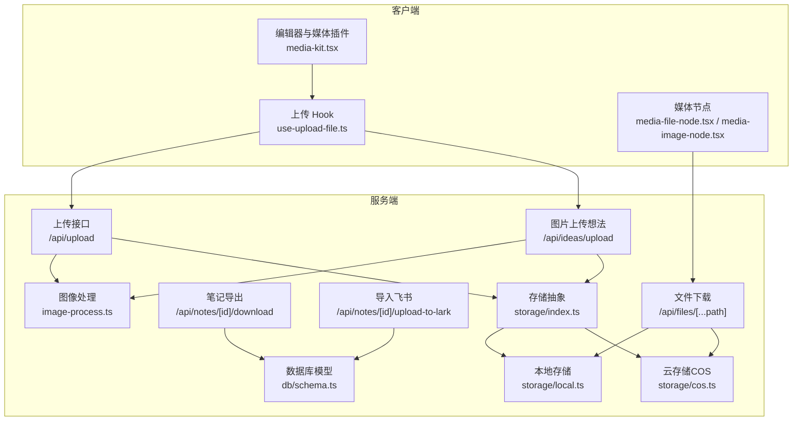
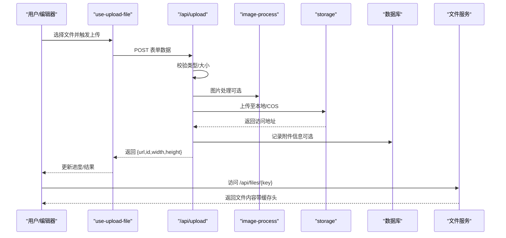
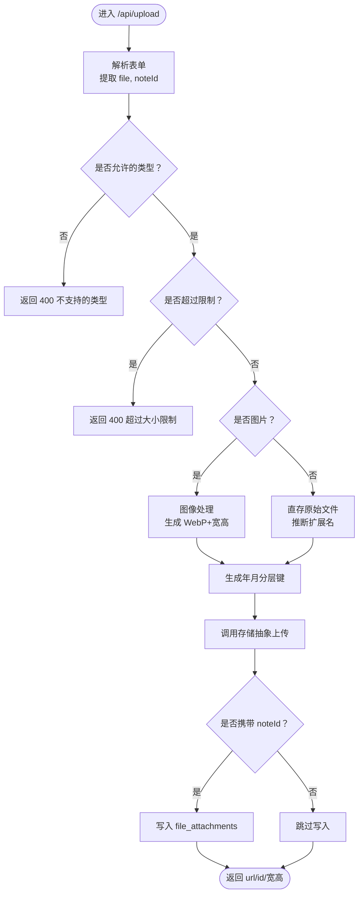
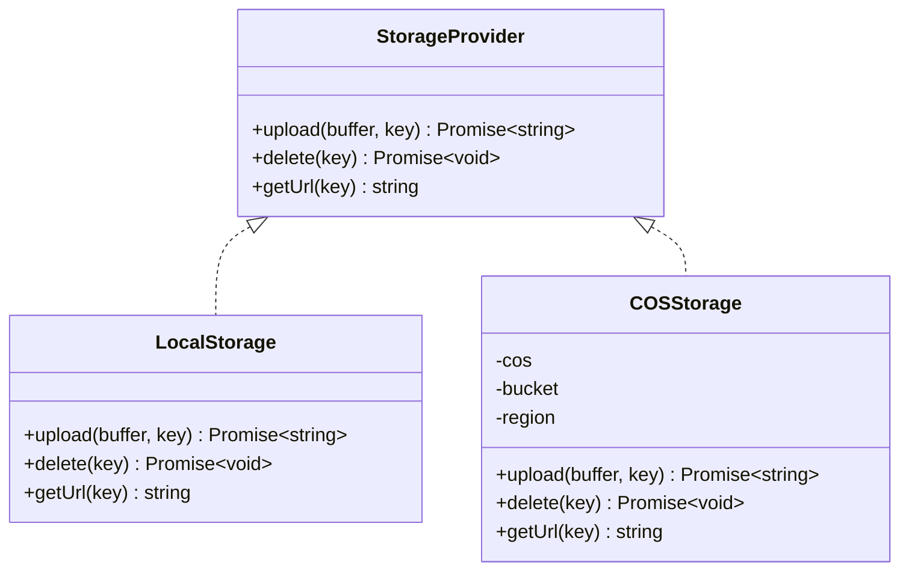
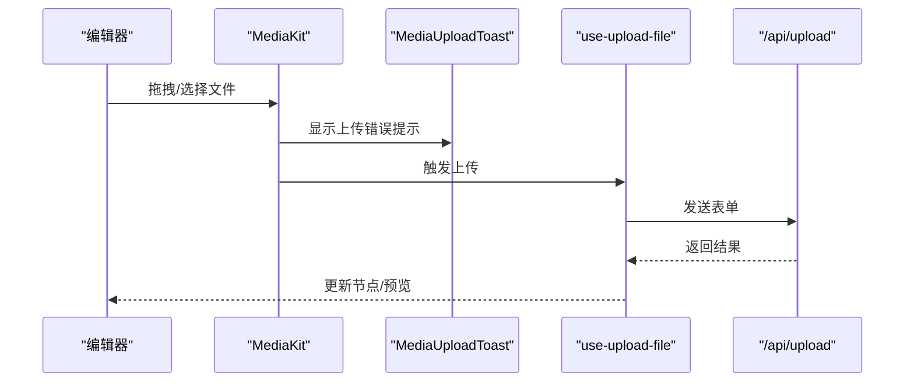
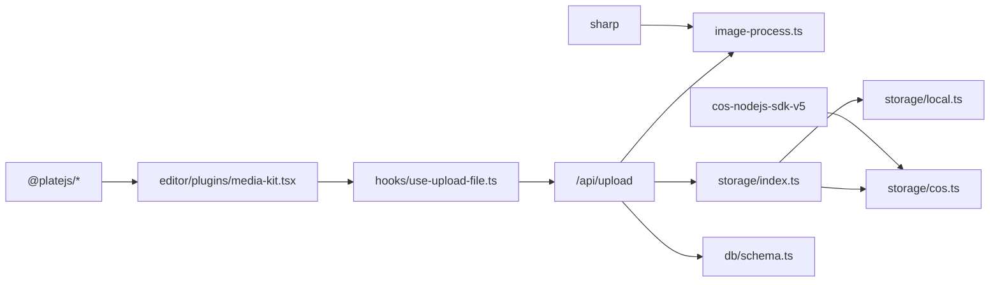

# 文件上传下载

<cite>
**本文引用的文件**
- [src/app/api/files/[...path]/route.ts](file://src/app/api/files/[...path]/route.ts)
- [src/app/api/upload/route.ts](file://src/app/api/upload/route.ts)
- [src/app/api/notes/[id]/download/route.ts](file://src/app/api/notes/[id]/download/route.ts)
- [src/app/api/notes/[id]/upload-to-lark/route.ts](file://src/app/api/notes/[id]/upload-to-lark/route.ts)
- [src/app/api/ideas/upload/route.ts](file://src/app/api/ideas/upload/route.ts)
- [src/hooks/use-upload-file.ts](file://src/hooks/use-upload-file.ts)
- [src/lib/storage/index.ts](file://src/lib/storage/index.ts)
- [src/lib/storage/local.ts](file://src/lib/storage/local.ts)
- [src/lib/storage/cos.ts](file://src/lib/storage/cos.ts)
- [src/lib/image-process.ts](file://src/lib/image-process.ts)
- [src/db/schema.ts](file://src/db/schema.ts)
- [src/components/editor/plugins/media-kit.tsx](file://src/components/editor/plugins/media-kit.tsx)
- [src/components/ui/media-upload-toast.tsx](file://src/components/ui/media-upload-toast.tsx)
- [src/components/ui/media-file-node.tsx](file://src/components/ui/media-file-node.tsx)
- [src/components/ui/media-image-node.tsx](file://src/components/ui/media-image-node.tsx)
- [package.json](file://package.json)
</cite>

## 目录
1. [简介](#简介)
2. [项目结构](#项目结构)
3. [核心组件](#核心组件)
4. [架构总览](#架构总览)
5. [详细组件分析](#详细组件分析)
6. [依赖分析](#依赖分析)
7. [性能考虑](#性能考虑)
8. [故障排查指南](#故障排查指南)
9. [结论](#结论)
10. [附录](#附录)

## 简介
本文件围绕 ynote-v2 的文件上传与下载能力进行系统化说明，覆盖以下主题：
- 上传实现机制：单文件与多文件上传、断点续传现状与建议、进度跟踪
- 下载处理逻辑：静态文件服务、笔记导出下载、临时链接与访问控制
- 存储策略：本地存储与云存储（COS）双栈、文件命名规范
- 类型识别与校验：MIME 类型白名单、文件大小限制
- 错误处理：网络异常、超时、权限错误等
- 性能优化：并发控制、内存管理、图片压缩
- 附件管理：文件与笔记/想法的关联、数据库模型
- 安全性：目录穿越防护、类型与大小校验、访问控制
- 用户体验：拖拽上传、批量操作、可视化反馈

## 项目结构
与文件上传下载相关的关键模块分布如下：
- 后端 API
  - 通用上传接口：/api/upload
  - 图片上传（想法）：/api/ideas/upload
  - 文件下载路由：/api/files/[...path]
  - 笔记导出下载：/api/notes/[id]/download
  - 笔记导入飞书：/api/notes/[id]/upload-to-lark
- 存储抽象与实现：storage/index.ts、storage/local.ts、storage/cos.ts
- 图像处理：image-process.ts
- 数据库模型：db/schema.ts（file_attachments、idea_images 等）
- 前端上传 Hook：hooks/use-upload-file.ts
- 编辑器媒体插件与节点：editor/plugins/media-kit.tsx、ui/media-file-node.tsx、ui/media-image-node.tsx
- 上传错误提示：ui/media-upload-toast.tsx

图表来源
- [src/app/api/upload/route.ts:50-153](file://src/app/api/upload/route.ts#L50-L153)
- [src/app/api/ideas/upload/route.ts:11-66](file://src/app/api/ideas/upload/route.ts#L11-L66)
- [src/app/api/files/[...path]/route.ts](file://src/app/api/files/[...path]/route.ts#L7-L48)
- [src/app/api/notes/[id]/download/route.ts](file://src/app/api/notes/[id]/download/route.ts#L6-L33)
- [src/app/api/notes/[id]/upload-to-lark/route.ts](file://src/app/api/notes/[id]/upload-to-lark/route.ts#L232-L319)
- [src/lib/storage/index.ts:12-30](file://src/lib/storage/index.ts#L12-L30)
- [src/lib/storage/local.ts:7-29](file://src/lib/storage/local.ts#L7-L29)
- [src/lib/storage/cos.ts:11-62](file://src/lib/storage/cos.ts#L11-L62)
- [src/lib/image-process.ts:3-21](file://src/lib/image-process.ts#L3-L21)
- [src/db/schema.ts:41-55](file://src/db/schema.ts#L41-L55)

章节来源
- [src/app/api/upload/route.ts:50-153](file://src/app/api/upload/route.ts#L50-L153)
- [src/app/api/ideas/upload/route.ts:11-66](file://src/app/api/ideas/upload/route.ts#L11-L66)
- [src/app/api/files/[...path]/route.ts](file://src/app/api/files/[...path]/route.ts#L7-L48)
- [src/app/api/notes/[id]/download/route.ts](file://src/app/api/notes/[id]/download/route.ts#L6-L33)
- [src/app/api/notes/[id]/upload-to-lark/route.ts](file://src/app/api/notes/[id]/upload-to-lark/route.ts#L232-L319)
- [src/lib/storage/index.ts:12-30](file://src/lib/storage/index.ts#L12-L30)
- [src/lib/storage/local.ts:7-29](file://src/lib/storage/local.ts#L7-L29)
- [src/lib/storage/cos.ts:11-62](file://src/lib/storage/cos.ts#L11-L62)
- [src/lib/image-process.ts:3-21](file://src/lib/image-process.ts#L3-L21)
- [src/db/schema.ts:41-55](file://src/db/schema.ts#L41-L55)

## 核心组件
- 上传接口
  - 支持表单上传，自动识别文件类型与大小，执行图像压缩或直存，生成稳定文件键并写入数据库（可选）。
  - 提供统一的错误响应与日志记录。
- 存储抽象
  - 通过工厂函数按环境变量自动选择本地或 COS 存储，屏蔽上层差异。
- 文件下载
  - 通过 /api/files/[...path] 提供静态文件读取，内置目录穿越防护与缓存头。
- 笔记导出
  - 将笔记内容序列化为 Markdown 并以附件形式下载。
- 图像处理
  - 使用 sharp 对图片进行缩放与编码，输出 WebP，保留尺寸元数据。
- 媒体插件与节点
  - 提供拖拽上传、批量限制、大小限制、错误提示等编辑器内上传体验。

章节来源
- [src/app/api/upload/route.ts:50-153](file://src/app/api/upload/route.ts#L50-L153)
- [src/lib/storage/index.ts:12-30](file://src/lib/storage/index.ts#L12-L30)
- [src/app/api/files/[...path]/route.ts](file://src/app/api/files/[...path]/route.ts#L7-L48)
- [src/app/api/notes/[id]/download/route.ts](file://src/app/api/notes/[id]/download/route.ts#L6-L33)
- [src/lib/image-process.ts:3-21](file://src/lib/image-process.ts#L3-L21)
- [src/components/editor/plugins/media-kit.tsx:23-84](file://src/components/editor/plugins/media-kit.tsx#L23-L84)

## 架构总览
下图展示上传与下载在系统中的交互流程，以及存储与数据库的关系。

图表来源
- [src/hooks/use-upload-file.ts:16-43](file://src/hooks/use-upload-file.ts#L16-L43)
- [src/app/api/upload/route.ts:50-153](file://src/app/api/upload/route.ts#L50-L153)
- [src/lib/image-process.ts:3-21](file://src/lib/image-process.ts#L3-L21)
- [src/lib/storage/index.ts:12-30](file://src/lib/storage/index.ts#L12-L30)
- [src/lib/storage/local.ts:7-29](file://src/lib/storage/local.ts#L7-L29)
- [src/lib/storage/cos.ts:25-40](file://src/lib/storage/cos.ts#L25-L40)
- [src/db/schema.ts:41-55](file://src/db/schema.ts#L41-L55)
- [src/app/api/files/[...path]/route.ts](file://src/app/api/files/[...path]/route.ts#L7-L48)

## 详细组件分析

### 上传接口（/api/upload）
- 功能要点
  - 接收表单字段 file 与 noteId，校验文件类型与大小，按类型选择最大值限制。
  - 图片走图像处理流程，输出 WebP 并记录宽高；音视频/文档直存并推断扩展名。
  - 生成年月分层键（如 2026/01/{id}.ext），调用存储抽象上传。
  - 若携带 noteId，则写入 file_attachments 表，区分本地与 COS 存储。
  - 返回 url、id、宽高等信息。
- 断点续传现状
  - 当前未实现断点续传；如需支持，可在前端分块上传并在服务端合并，同时引入会话与校验机制。
- 进度跟踪
  - 前端 Hook 在发送请求前后设置进度，但服务端未提供实时进度回调；可结合分块上传与 SSE 实现。
- 错误处理
  - 类型/大小/IO/业务异常均有明确状态码与错误消息。

图表来源
- [src/app/api/upload/route.ts:50-153](file://src/app/api/upload/route.ts#L50-L153)
- [src/lib/image-process.ts:3-21](file://src/lib/image-process.ts#L3-L21)
- [src/lib/storage/index.ts:12-30](file://src/lib/storage/index.ts#L12-L30)
- [src/db/schema.ts:41-55](file://src/db/schema.ts#L41-L55)

章节来源
- [src/app/api/upload/route.ts:50-153](file://src/app/api/upload/route.ts#L50-L153)

### 图片上传（想法）（/api/ideas/upload）
- 功能要点
  - 仅允许图片类型，最大 10MB。
  - 统一走图像处理，生成 WebP，记录宽高与文件键。
  - 写入 idea_images 表，支持绑定 ideaId。
- 适用场景
  - 想法卡片配图上传，便于后续展示与管理。

章节来源
- [src/app/api/ideas/upload/route.ts:11-66](file://src/app/api/ideas/upload/route.ts#L11-L66)
- [src/db/schema.ts:64-76](file://src/db/schema.ts#L64-L76)

### 文件下载（/api/files/[...path]）
- 功能要点
  - 通过路径参数拼接真实文件路径，进行目录穿越防护（路径解析后判断前缀）。
  - 读取文件为二进制缓冲，按扩展名映射 MIME 类型，设置长期缓存头。
  - 不存在或异常返回相应状态码与错误信息。
- 访问控制
  - 该接口未做鉴权；若需保护私有文件，应在入口增加鉴权与权限校验。

章节来源
- [src/app/api/files/[...path]/route.ts](file://src/app/api/files/[...path]/route.ts#L7-L48)
- [src/lib/storage/local.ts:7-29](file://src/lib/storage/local.ts#L7-L29)
- [src/lib/storage/cos.ts:58-60](file://src/lib/storage/cos.ts#L58-L60)

### 笔记导出下载（/api/notes/[id]/download）
- 功能要点
  - 查询笔记，优先使用 markdown 字段；若为空则基于 content 序列化为 Markdown。
  - 以附件形式返回，文件名为标题（非法字符替换为下划线），设置 UTF-8 编码的 Content-Disposition。
- 适用场景
  - 导出单篇笔记为 Markdown 文件，便于备份与迁移。

章节来源
- [src/app/api/notes/[id]/download/route.ts](file://src/app/api/notes/[id]/download/route.ts#L6-L33)

### 导入飞书（/api/notes/[id]/upload-to-lark）
- 功能要点
  - 获取租户访问令牌，确保目标云空间路径存在，将笔记内容序列化为 Markdown 并上传为文件，创建导入任务，轮询导入状态，最终返回飞书文档链接。
- 适用场景
  - 将本地笔记一键导入飞书云空间，支持层级文件夹映射。

章节来源
- [src/app/api/notes/[id]/upload-to-lark/route.ts](file://src/app/api/notes/[id]/upload-to-lark/route.ts#L232-L319)

### 存储抽象与实现
- 抽象接口
  - 提供 upload、delete、getUrl 三个方法，屏蔽本地与 COS 差异。
- 本地存储
  - 自动创建目录，写入文件，返回 /api/files/{key} 形式的访问地址。
- 云存储（COS）
  - 使用腾讯云 COS SDK，对象键带前缀 ynote/，返回公网可访问 URL。

图表来源
- [src/lib/storage/index.ts:1-5](file://src/lib/storage/index.ts#L1-L5)
- [src/lib/storage/local.ts:7-29](file://src/lib/storage/local.ts#L7-L29)
- [src/lib/storage/cos.ts:11-62](file://src/lib/storage/cos.ts#L11-L62)

章节来源
- [src/lib/storage/index.ts:12-30](file://src/lib/storage/index.ts#L12-L30)
- [src/lib/storage/local.ts:7-29](file://src/lib/storage/local.ts#L7-L29)
- [src/lib/storage/cos.ts:11-62](file://src/lib/storage/cos.ts#L11-L62)

### 前端上传 Hook 与媒体插件
- use-upload-file
  - 管理上传状态、进度与结果，构造表单并调用 /api/upload。
- 媒体插件（MediaKit）
  - 配置图片/视频/音频/文件的上传限制（数量、大小）、错误提示与预览对话框。
- 媒体节点
  - 文件节点与图片节点分别渲染下载链接与图片展示，支持标题与可选的预览对话框。

图表来源
- [src/components/editor/plugins/media-kit.tsx:23-84](file://src/components/editor/plugins/media-kit.tsx#L23-L84)
- [src/components/ui/media-upload-toast.tsx:14-69](file://src/components/ui/media-upload-toast.tsx#L14-L69)
- [src/hooks/use-upload-file.ts:16-43](file://src/hooks/use-upload-file.ts#L16-L43)
- [src/app/api/upload/route.ts:50-153](file://src/app/api/upload/route.ts#L50-L153)

章节来源
- [src/hooks/use-upload-file.ts:10-53](file://src/hooks/use-upload-file.ts#L10-L53)
- [src/components/editor/plugins/media-kit.tsx:23-84](file://src/components/editor/plugins/media-kit.tsx#L23-L84)
- [src/components/ui/media-upload-toast.tsx:14-69](file://src/components/ui/media-upload-toast.tsx#L14-L69)
- [src/components/ui/media-file-node.tsx:12-47](file://src/components/ui/media-file-node.tsx#L12-L47)
- [src/components/ui/media-image-node.tsx:20-80](file://src/components/ui/media-image-node.tsx#L20-L80)

## 依赖分析
- 外部依赖
  - sharp：图像处理（缩放、编码、元数据读取）
  - cos-nodejs-sdk-v5：COS 上传/删除/获取 URL
  - platejs 及其媒体插件：编辑器内媒体上传与展示
- 内部依赖
  - 存储抽象被上传接口与图片上传共同依赖
  - 数据库模型被上传接口与图片上传写入

图表来源
- [package.json:92-98](file://package.json#L92-L98)
- [src/lib/image-process.ts:1-21](file://src/lib/image-process.ts#L1-L21)
- [src/lib/storage/cos.ts:1-9](file://src/lib/storage/cos.ts#L1-L9)
- [src/components/editor/plugins/media-kit.tsx:1-22](file://src/components/editor/plugins/media-kit.tsx#L1-L22)
- [src/hooks/use-upload-file.ts:1-53](file://src/hooks/use-upload-file.ts#L1-L53)
- [src/app/api/upload/route.ts:1-12](file://src/app/api/upload/route.ts#L1-L12)
- [src/db/schema.ts:41-55](file://src/db/schema.ts#L41-L55)

章节来源
- [package.json:92-98](file://package.json#L92-L98)

## 性能考虑
- 图像处理
  - 使用 sharp 对图片进行上限缩放与 WebP 编码，降低体积与传输成本。
- 存储选择
  - 无环境变量时使用本地存储，便于开发；部署时建议配置 COS 以获得更好的可用性与扩展性。
- 缓存策略
  - 文件下载设置长期缓存头，减少重复请求。
- 并发与内存
  - 当前上传为一次性读取为 Buffer；对于大文件建议采用流式处理或分块上传，避免内存峰值过高。
- 建议优化
  - 分块上传 + 断点续传：前端分块并记录校验和，服务端合并；结合数据库记录上传会话。
  - 进度上报：结合分块与 SSE 实现实时进度。
  - 并发控制：限制同时上传的任务数，避免资源争用。

章节来源
- [src/lib/image-process.ts:3-21](file://src/lib/image-process.ts#L3-L21)
- [src/lib/storage/index.ts:12-30](file://src/lib/storage/index.ts#L12-L30)
- [src/app/api/files/[...path]/route.ts](file://src/app/api/files/[...path]/route.ts#L37-L42)

## 故障排查指南
- 常见错误与定位
  - 类型不支持：检查前端媒体插件配置与后端类型白名单。
  - 超过大小限制：核对各类型最大值配置与前端限制。
  - 上传失败：查看后端日志与状态码，确认存储可用性与权限。
  - 下载 403/404：确认路径解析与目录穿越防护逻辑，检查文件是否存在。
  - 飞书导入失败：检查租户令牌、云空间路径与轮询状态。
- 建议排查步骤
  - 打开浏览器开发者工具 Network 面板，观察请求与响应。
  - 查看服务端日志，定位具体异常堆栈。
  - 使用 curl 或 Postman 直接调用接口验证行为一致性。

章节来源
- [src/app/api/upload/route.ts:56-82](file://src/app/api/upload/route.ts#L56-L82)
- [src/app/api/files/[...path]/route.ts](file://src/app/api/files/[...path]/route.ts#L15-L23)
- [src/app/api/notes/[id]/upload-to-lark/route.ts](file://src/app/api/notes/[id]/upload-to-lark/route.ts#L237-L242)

## 结论
当前系统提供了完善的文件上传与下载基础能力：类型与大小校验、图像处理、本地与云存储双栈、笔记导出与飞书导入。断点续传与实时进度尚未实现，建议在现有分块上传基础上扩展会话与校验机制。前端通过媒体插件与 Hook 提供了良好的上传体验，后续可进一步增强并发控制与内存管理，提升大文件处理稳定性。

## 附录

### 文件类型与大小限制
- 图片：最大 10MB，统一转为 WebP
- 视频：最大 100MB
- 音频：最大 50MB
- 文档：最大 50MB（PDF、Markdown、常见压缩包、Office）

章节来源
- [src/app/api/upload/route.ts:8-48](file://src/app/api/upload/route.ts#L8-L48)
- [src/app/api/ideas/upload/route.ts:8-9](file://src/app/api/ideas/upload/route.ts#L8-L9)

### 文件命名规范与存储位置
- 命名：年/月/随机ID.扩展名
- 本地存储：data/uploads/{key}
- 云存储：COS 路径 ynote/{key}

章节来源
- [src/app/api/upload/route.ts:119-127](file://src/app/api/upload/route.ts#L119-L127)
- [src/lib/storage/local.ts:8-16](file://src/lib/storage/local.ts#L8-L16)
- [src/lib/storage/cos.ts:25-40](file://src/lib/storage/cos.ts#L25-L40)

### 附件与笔记/想法的关联
- 笔记附件：file_attachments 表，记录文件名、路径、存储类型、MIME、尺寸、宽高、创建时间等
- 想法图片：idea_images 表，结构与附件类似

章节来源
- [src/db/schema.ts:41-55](file://src/db/schema.ts#L41-L55)
- [src/db/schema.ts:64-76](file://src/db/schema.ts#L64-L76)

### 安全性考虑
- 目录穿越防护：文件服务对路径进行解析并校验前缀
- 类型与大小校验：服务端严格限制，防止恶意文件与资源滥用
- 访问控制：文件服务未做鉴权，建议在网关或中间件层增加鉴权与权限校验

章节来源
- [src/app/api/files/[...path]/route.ts](file://src/app/api/files/[...path]/route.ts#L15-L23)