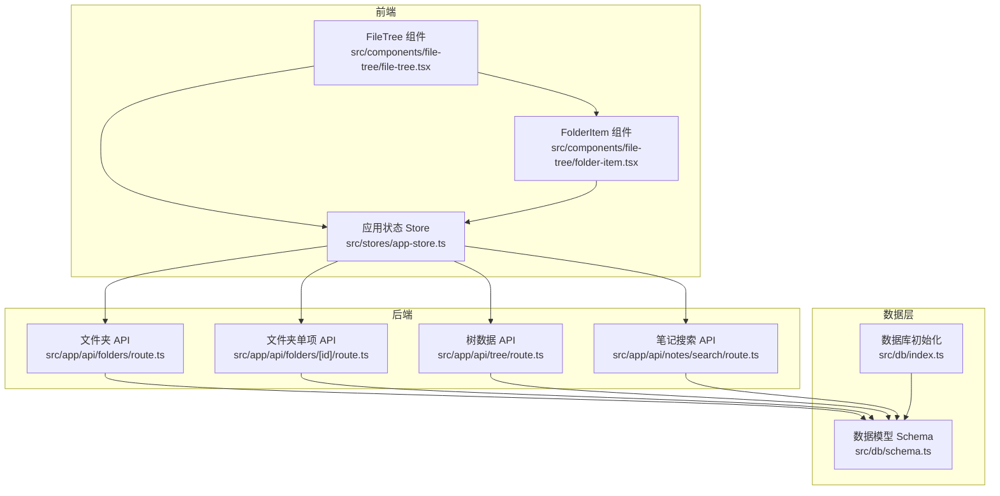
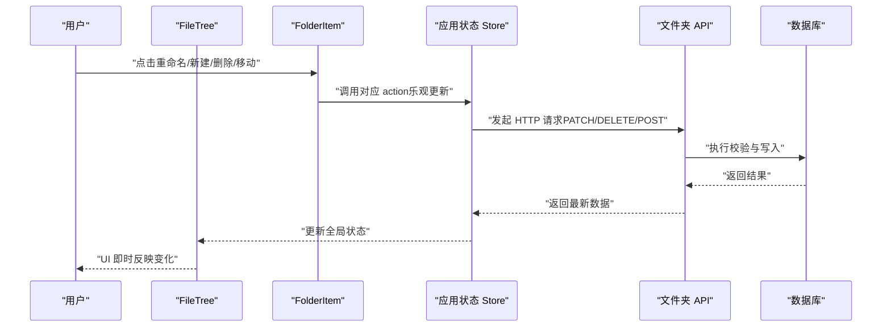
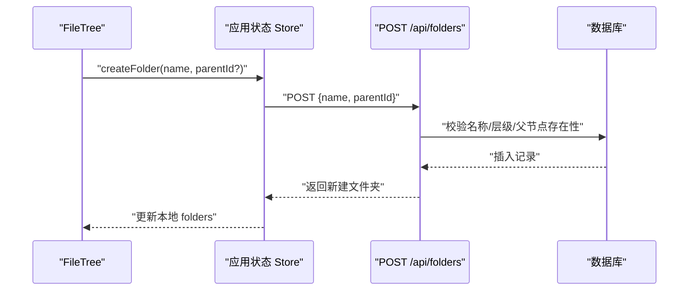
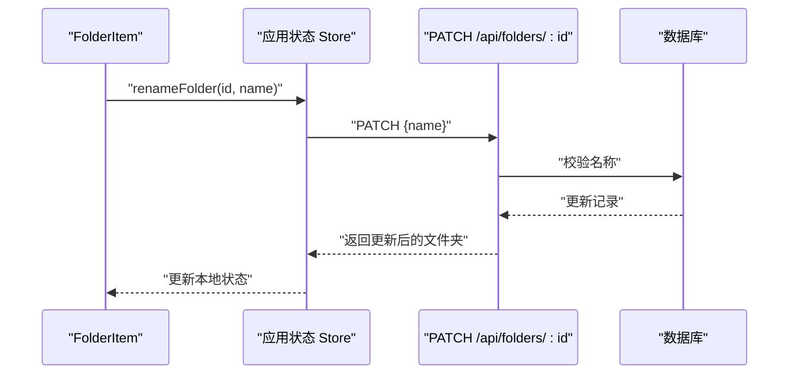
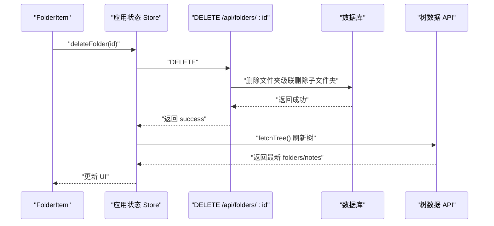
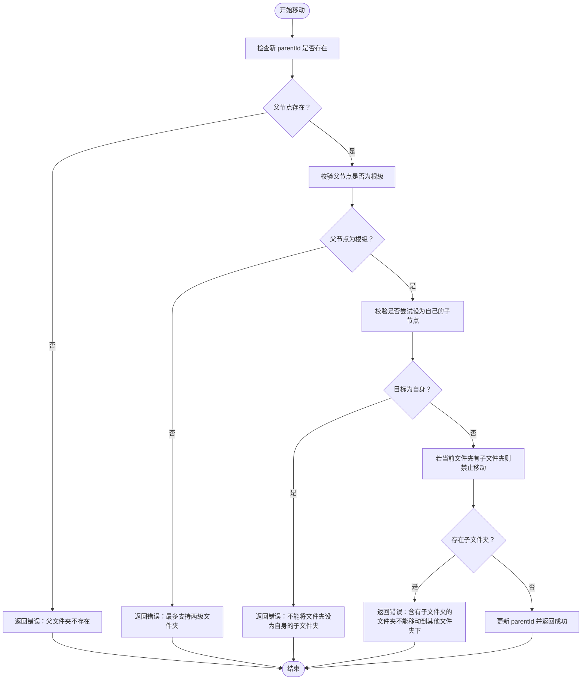
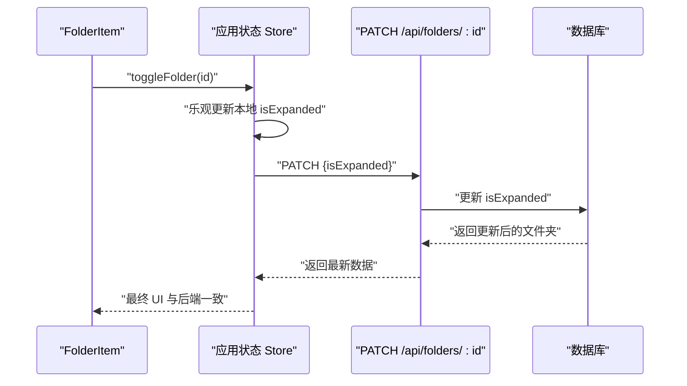
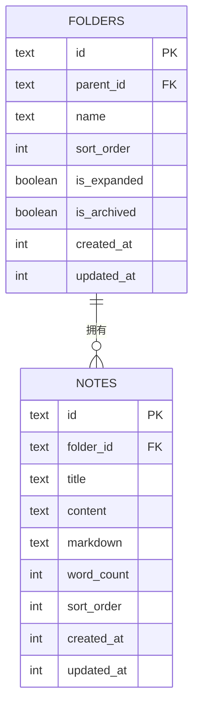
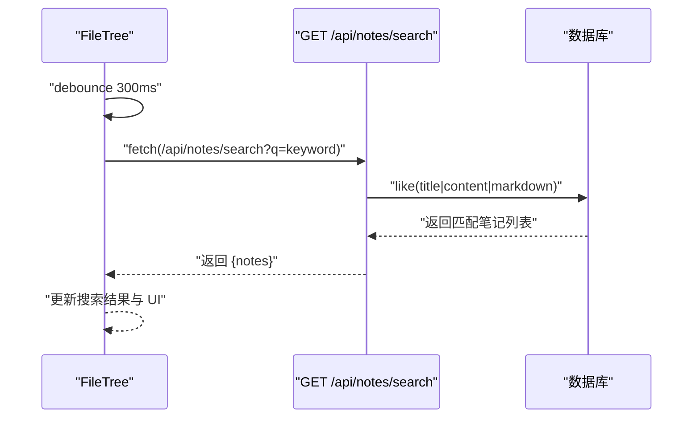
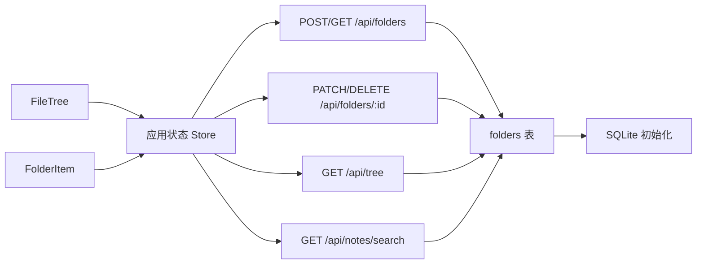

# 文件夹管理

<cite>
**本文引用的文件**
- [src/app/api/folders/route.ts](file://src/app/api/folders/route.ts)
- [src/app/api/folders/[id]/route.ts](file://src/app/api/folders/[id]/route.ts)
- [src/components/file-tree/file-tree.tsx](file://src/components/file-tree/file-tree.tsx)
- [src/components/file-tree/folder-item.tsx](file://src/components/file-tree/folder-item.tsx)
- [src/stores/app-store.ts](file://src/stores/app-store.ts)
- [src/db/schema.ts](file://src/db/schema.ts)
- [src/db/index.ts](file://src/db/index.ts)
- [src/app/api/tree/route.ts](file://src/app/api/tree/route.ts)
- [src/app/api/notes/search/route.ts](file://src/app/api/notes/search/route.ts)
- [src/types/index.ts](file://src/types/index.ts)
</cite>

## 目录
1. [简介](#简介)
2. [项目结构](#项目结构)
3. [核心组件](#核心组件)
4. [架构总览](#架构总览)
5. [详细组件分析](#详细组件分析)
6. [依赖分析](#依赖分析)
7. [性能考虑](#性能考虑)
8. [故障排查指南](#故障排查指南)
9. [结论](#结论)
10. [附录：API 规范](#附录api-规范)

## 简介
本文件系统性地文档化“文件夹管理”能力，覆盖以下方面：
- 文件夹的创建、删除、重命名与移动（父子关系与层级限制）
- 递归删除与笔记归属变更（笔记在删除后成为根级）
- 展开/折叠状态的前端持久化与后端同步
- 权限控制与访问限制现状说明
- 文件夹 API 接口规范（HTTP 方法、请求参数、响应格式）
- 批量操作能力现状与建议
- 文件夹与笔记的关联关系与约束
- 搜索与过滤能力
- 错误处理与异常情况处理方案

## 项目结构
文件夹管理由三层协同完成：
- 前端 UI 与交互：文件树组件负责渲染、用户交互与本地状态优化
- 应用状态层：Zustand store 负责与后端 API 通信、乐观更新与批量操作
- 后端 API 与数据层：Next.js API 路由处理业务校验与数据库操作；Drizzle ORM 管理 SQLite 数据模型与外键约束

图表来源
- [src/components/file-tree/file-tree.tsx:1-326](file://src/components/file-tree/file-tree.tsx#L1-L326)
- [src/components/file-tree/folder-item.tsx:1-299](file://src/components/file-tree/folder-item.tsx#L1-L299)
- [src/stores/app-store.ts:1-318](file://src/stores/app-store.ts#L1-L318)
- [src/app/api/folders/route.ts:1-75](file://src/app/api/folders/route.ts#L1-L75)
- [src/app/api/folders/[id]/route.ts:1-101](file://src/app/api/folders/[id]/route.ts#L1-L101)
- [src/app/api/tree/route.ts:1-36](file://src/app/api/tree/route.ts#L1-L36)
- [src/app/api/notes/search/route.ts:1-44](file://src/app/api/notes/search/route.ts#L1-L44)
- [src/db/schema.ts:1-105](file://src/db/schema.ts#L1-L105)
- [src/db/index.ts:1-171](file://src/db/index.ts#L1-L171)

章节来源
- [src/components/file-tree/file-tree.tsx:1-326](file://src/components/file-tree/file-tree.tsx#L1-L326)
- [src/components/file-tree/folder-item.tsx:1-299](file://src/components/file-tree/folder-item.tsx#L1-L299)
- [src/stores/app-store.ts:1-318](file://src/stores/app-store.ts#L1-L318)
- [src/app/api/folders/route.ts:1-75](file://src/app/api/folders/route.ts#L1-L75)
- [src/app/api/folders/[id]/route.ts:1-101](file://src/app/api/folders/[id]/route.ts#L1-L101)
- [src/app/api/tree/route.ts:1-36](file://src/app/api/tree/route.ts#L1-L36)
- [src/app/api/notes/search/route.ts:1-44](file://src/app/api/notes/search/route.ts#L1-L44)
- [src/db/schema.ts:1-105](file://src/db/schema.ts#L1-L105)
- [src/db/index.ts:1-171](file://src/db/index.ts#L1-L171)

## 核心组件
- 文件树渲染与交互：负责根级文件夹、笔记、归档区的展示，以及搜索、展开/折叠、新建等交互入口
- 文件夹项组件：负责单个文件夹的重命名、新建子文件夹/笔记、归档/取消归档、删除确认对话框
- 应用状态 Store：封装与后端 API 的通信、乐观更新、批量展开/折叠、删除后的树刷新
- 数据模型：定义文件夹与笔记的表结构、索引与外键约束（含归档字段）

章节来源
- [src/components/file-tree/file-tree.tsx:1-326](file://src/components/file-tree/file-tree.tsx#L1-L326)
- [src/components/file-tree/folder-item.tsx:1-299](file://src/components/file-tree/folder-item.tsx#L1-L299)
- [src/stores/app-store.ts:1-318](file://src/stores/app-store.ts#L1-L318)
- [src/db/schema.ts:10-39](file://src/db/schema.ts#L10-L39)

## 架构总览
文件夹管理采用“前端乐观更新 + 后端幂等校验”的设计：
- 前端在用户操作时立即更新本地状态，提升交互流畅度
- 后端对关键约束进行校验（如层级深度、父节点存在性、自环移动等），确保数据一致性
- 删除操作通过后端触发级联与笔记归属变更，并由前端重新拉取树数据以保证 UI 与数据一致

图表来源
- [src/components/file-tree/folder-item.tsx:55-98](file://src/components/file-tree/folder-item.tsx#L55-L98)
- [src/stores/app-store.ts:102-131](file://src/stores/app-store.ts#L102-L131)
- [src/app/api/folders/[id]/route.ts:9-79](file://src/app/api/folders/[id]/route.ts#L9-L79)
- [src/app/api/folders/route.ts:34-74](file://src/app/api/folders/route.ts#L34-L74)

## 详细组件分析

### 文件夹创建
- 前端行为：FileTree 提供新建根级文件夹输入框，提交后调用 Store 的创建方法
- Store 行为：发送 POST /api/folders，携带 name 与可选 parentId；成功后将新文件夹加入本地列表
- 后端校验：名称长度与非法字符校验；parentId 存在性与层级限制（最多两级）
- 数据落库：生成唯一 id，设置默认排序、展开状态、时间戳

图表来源
- [src/components/file-tree/file-tree.tsx:55-63](file://src/components/file-tree/file-tree.tsx#L55-L63)
- [src/stores/app-store.ts:84-100](file://src/stores/app-store.ts#L84-L100)
- [src/app/api/folders/route.ts:34-74](file://src/app/api/folders/route.ts#L34-L74)

章节来源
- [src/components/file-tree/file-tree.tsx:55-63](file://src/components/file-tree/file-tree.tsx#L55-L63)
- [src/stores/app-store.ts:84-100](file://src/stores/app-store.ts#L84-L100)
- [src/app/api/folders/route.ts:34-74](file://src/app/api/folders/route.ts#L34-L74)

### 文件夹重命名
- 前端行为：FolderItem 提供重命名输入框，失焦或回车后调用 Store 的重命名方法
- Store 行为：发送 PATCH /api/folders/{id}，携带 name；成功后替换本地对应文件夹
- 后端校验：名称非空、长度限制、非法字符检测

图表来源
- [src/components/file-tree/folder-item.tsx:55-61](file://src/components/file-tree/folder-item.tsx#L55-L61)
- [src/stores/app-store.ts:102-118](file://src/stores/app-store.ts#L102-L118)
- [src/app/api/folders/[id]/route.ts:9-44](file://src/app/api/folders/[id]/route.ts#L9-L44)

章节来源
- [src/components/file-tree/folder-item.tsx:55-61](file://src/components/file-tree/folder-item.tsx#L55-L61)
- [src/stores/app-store.ts:102-118](file://src/stores/app-store.ts#L102-L118)
- [src/app/api/folders/[id]/route.ts:9-44](file://src/app/api/folders/[id]/route.ts#L9-L44)

### 文件夹删除
- 前端行为：FolderItem 提供删除确认对话框，确认后调用 Store 的删除方法
- Store 行为：发送 DELETE /api/folders/{id}；由于后端使用级联删除与笔记归属变更，Store 会主动重新拉取树数据以保持 UI 与数据一致
- 后端行为：删除文件夹记录；由于外键约束，子文件夹将被级联删除；笔记将被置空 folderId 归位为根级

图表来源
- [src/components/file-tree/folder-item.tsx:96-98](file://src/components/file-tree/folder-item.tsx#L96-L98)
- [src/stores/app-store.ts:120-131](file://src/stores/app-store.ts#L120-L131)
- [src/app/api/folders/[id]/route.ts:81-100](file://src/app/api/folders/[id]/route.ts#L81-L100)
- [src/app/api/tree/route.ts:6-35](file://src/app/api/tree/route.ts#L6-L35)
- [src/db/schema.ts:29-31](file://src/db/schema.ts#L29-L31)

章节来源
- [src/components/file-tree/folder-item.tsx:96-98](file://src/components/file-tree/folder-item.tsx#L96-L98)
- [src/stores/app-store.ts:120-131](file://src/stores/app-store.ts#L120-L131)
- [src/app/api/folders/[id]/route.ts:81-100](file://src/app/api/folders/[id]/route.ts#L81-L100)
- [src/app/api/tree/route.ts:6-35](file://src/app/api/tree/route.ts#L6-L35)
- [src/db/schema.ts:29-31](file://src/db/schema.ts#L29-L31)

### 文件夹移动（父子关系与层级限制）
- 支持将文件夹移动到新的父节点，但需满足：
  - 新父节点必须存在且为根级（parentId 为空）
  - 不允许将文件夹移动到其自身子树内（防自环）
  - 若当前文件夹存在子文件夹，则不允许将其作为其他文件夹的子节点
- 后端在 PATCH /api/folders/{id} 中执行上述校验

图表来源
- [src/app/api/folders/[id]/route.ts:45-69](file://src/app/api/folders/[id]/route.ts#L45-L69)

章节来源
- [src/app/api/folders/[id]/route.ts:45-69](file://src/app/api/folders/[id]/route.ts#L45-L69)

### 文件夹展开/折叠状态持久化与同步
- 前端：FolderItem 在点击时切换 isExpanded，并乐观更新本地状态
- 异步：Store 发送 PATCH /api/folders/{id} 同步 isExpanded 到后端
- 批量：Store 提供展开/折叠全部接口，采用乐观更新 + 并发请求的方式提升体验

图表来源
- [src/components/file-tree/folder-item.tsx:116-117](file://src/components/file-tree/folder-item.tsx#L116-L117)
- [src/stores/app-store.ts:133-147](file://src/stores/app-store.ts#L133-L147)
- [src/app/api/folders/[id]/route.ts:37-39](file://src/app/api/folders/[id]/route.ts#L37-L39)

章节来源
- [src/components/file-tree/folder-item.tsx:116-117](file://src/components/file-tree/folder-item.tsx#L116-L117)
- [src/stores/app-store.ts:133-147](file://src/stores/app-store.ts#L133-L147)
- [src/app/api/folders/[id]/route.ts:37-39](file://src/app/api/folders/[id]/route.ts#L37-L39)

### 文件夹与笔记的关联关系与约束
- 外键约束：notes.folderId 引用 folders.id，删除文件夹时采用级联删除子文件夹；笔记采用“置空 folderId”策略，使笔记成为根级
- 查询：树数据 API 返回 folders 与 notes 的聚合视图，便于前端一次性渲染
- 类型定义：Folder 与 NoteMeta 结构体明确了字段与可空性

图表来源
- [src/db/schema.ts:10-39](file://src/db/schema.ts#L10-L39)
- [src/app/api/tree/route.ts:6-35](file://src/app/api/tree/route.ts#L6-L35)
- [src/types/index.ts:1-25](file://src/types/index.ts#L1-L25)

章节来源
- [src/db/schema.ts:10-39](file://src/db/schema.ts#L10-L39)
- [src/app/api/tree/route.ts:6-35](file://src/app/api/tree/route.ts#L6-L35)
- [src/types/index.ts:1-25](file://src/types/index.ts#L1-L25)

### 搜索与过滤
- 笔记搜索：GET /api/notes/search?q=关键词，支持按标题、内容、markdown 进行模糊匹配
- 文件树搜索：FileTree 内部维护搜索关键字与结果列表，防抖 300ms，搜索中显示加载态

图表来源
- [src/components/file-tree/file-tree.tsx:88-122](file://src/components/file-tree/file-tree.tsx#L88-L122)
- [src/app/api/notes/search/route.ts:6-43](file://src/app/api/notes/search/route.ts#L6-L43)

章节来源
- [src/components/file-tree/file-tree.tsx:88-122](file://src/components/file-tree/file-tree.tsx#L88-L122)
- [src/app/api/notes/search/route.ts:6-43](file://src/app/api/notes/search/route.ts#L6-L43)

### 权限控制与访问限制
- 当前仓库未发现基于用户身份的鉴权与授权逻辑，文件夹与笔记的读写未做访问控制校验
- 如需增强安全，可在 API 层引入鉴权中间件与资源级权限校验

章节来源
- [src/app/api/folders/route.ts:1-75](file://src/app/api/folders/route.ts#L1-L75)
- [src/app/api/folders/[id]/route.ts:1-L101](file://src/app/api/folders/[id]/route.ts#L1-L101)

### 批量操作
- 已实现：批量展开/折叠（Store 提供 expandAllFolders/collapseAllFolders，内部并发请求）
- 未实现：批量删除/批量重命名的后端接口与前端入口
- 建议：新增批量删除/重命名的 API，后端对每条记录执行相同校验；前端提供多选与批量操作按钮

章节来源
- [src/stores/app-store.ts:149-191](file://src/stores/app-store.ts#L149-L191)

## 依赖分析
- 组件耦合：FileTree 与 FolderItem 通过 Store 解耦；FolderItem 仅依赖 Store 的动作签名
- 状态同步：Store 对关键操作采用乐观更新，随后通过后端请求或树刷新保证最终一致
- 数据一致性：数据库外键与 Drizzle 约束保障父子关系与笔记归属变更

图表来源
- [src/components/file-tree/file-tree.tsx:1-326](file://src/components/file-tree/file-tree.tsx#L1-L326)
- [src/components/file-tree/folder-item.tsx:1-299](file://src/components/file-tree/folder-item.tsx#L1-L299)
- [src/stores/app-store.ts:1-318](file://src/stores/app-store.ts#L1-L318)
- [src/app/api/folders/route.ts:1-75](file://src/app/api/folders/route.ts#L1-L75)
- [src/app/api/folders/[id]/route.ts:1-L101](file://src/app/api/folders/[id]/route.ts#L1-L101)
- [src/app/api/tree/route.ts:1-36](file://src/app/api/tree/route.ts#L1-L36)
- [src/app/api/notes/search/route.ts:1-44](file://src/app/api/notes/search/route.ts#L1-L44)
- [src/db/schema.ts:1-105](file://src/db/schema.ts#L1-L105)
- [src/db/index.ts:1-171](file://src/db/index.ts#L1-L171)

章节来源
- [src/components/file-tree/file-tree.tsx:1-326](file://src/components/file-tree/file-tree.tsx#L1-L326)
- [src/components/file-tree/folder-item.tsx:1-299](file://src/components/file-tree/folder-item.tsx#L1-L299)
- [src/stores/app-store.ts:1-318](file://src/stores/app-store.ts#L1-L318)
- [src/app/api/folders/route.ts:1-75](file://src/app/api/folders/route.ts#L1-L75)
- [src/app/api/folders/[id]/route.ts:1-L101](file://src/app/api/folders/[id]/route.ts#L1-L101)
- [src/app/api/tree/route.ts:1-36](file://src/app/api/tree/route.ts#L1-L36)
- [src/app/api/notes/search/route.ts:1-44](file://src/app/api/notes/search/route.ts#L1-L44)
- [src/db/schema.ts:1-105](file://src/db/schema.ts#L1-L105)
- [src/db/index.ts:1-171](file://src/db/index.ts#L1-L171)

## 性能考虑
- 乐观更新：减少网络往返延迟，提升交互流畅度
- 并发批量：批量展开/折叠使用 Promise.all 并发请求，显著降低等待时间
- 防抖搜索：300ms 防抖避免频繁请求
- 索引优化：数据库对 folders.parent_id 与 notes.folder_id 建有索引，有利于树查询与笔记归属筛选

章节来源
- [src/stores/app-store.ts:149-191](file://src/stores/app-store.ts#L149-L191)
- [src/components/file-tree/file-tree.tsx:111-122](file://src/components/file-tree/file-tree.tsx#L111-L122)
- [src/db/index.ts:73-75](file://src/db/index.ts#L73-L75)

## 故障排查指南
- 创建失败
  - 名称为空或过长、包含非法字符
  - 父节点不存在或层级超限
- 更新失败
  - 重命名为空或非法
  - 移动目标不合法（自环、非根级父节点、有子文件夹）
- 删除失败
  - 文件夹不存在
  - 后端删除后需重新拉取树数据，若 UI 未更新，检查 Store 的 fetchTree 调用
- 展开/折叠不同步
  - 检查异步 PATCH 请求是否成功；必要时手动刷新树
- 搜索无结果
  - 关键词为空或过短
  - 确认数据库中笔记的 title/content/markdown 字段是否填充

章节来源
- [src/app/api/folders/route.ts:10-17](file://src/app/api/folders/route.ts#L10-L17)
- [src/app/api/folders/route.ts:44-56](file://src/app/api/folders/route.ts#L44-L56)
- [src/app/api/folders/[id]/route.ts:25-L44](file://src/app/api/folders/[id]/route.ts#L25-L44)
- [src/app/api/folders/[id]/route.ts:45-L69](file://src/app/api/folders/[id]/route.ts#L45-L69)
- [src/app/api/folders/[id]/route.ts:89-L92](file://src/app/api/folders/[id]/route.ts#L89-L92)
- [src/stores/app-store.ts:120-131](file://src/stores/app-store.ts#L120-L131)
- [src/app/api/notes/search/route.ts:11-13](file://src/app/api/notes/search/route.ts#L11-L13)

## 结论
该文件夹管理模块通过前端乐观更新与后端严格校验相结合，实现了稳定、流畅的用户体验。现有能力覆盖了创建、重命名、删除、移动、展开/折叠与搜索；同时具备清晰的数据模型与外键约束，确保父子关系与笔记归属的一致性。后续可在权限控制、批量操作与更丰富的过滤能力上进一步完善。

## 附录：API 规范

- 获取全部文件夹
  - 方法：GET
  - 路径：/api/folders
  - 成功响应：数组，元素为文件夹对象（包含 id、parentId、name、sortOrder、isExpanded、isArchived、createdAt、updatedAt）
  - 失败响应：{ error: "获取文件夹失败" }，状态码 500

- 创建文件夹
  - 方法：POST
  - 路径：/api/folders
  - 请求体：
    - name: string（必填，去空白，长度 ≤ 100，不允许包含非法字符）
    - parentId: string | null（可选，目标父节点 id；若提供则父节点必须为根级）
  - 成功响应：创建成功的文件夹对象，状态码 201
  - 失败响应：
    - { error: "名称不能为空/名称不能超过100个字符/名称包含非法字符" }，状态码 400
    - { error: "父文件夹不存在" }，状态码 400
    - { error: "最多支持两级文件夹" }，状态码 400
    - 其他错误：{ error: "创建文件夹失败" }，状态码 500

- 更新文件夹（支持重命名、排序、展开状态、归档状态、移动）
  - 方法：PATCH
  - 路径：/api/folders/[id]
  - 请求体（可选字段组合）：
    - name: string（去空白，长度 ≤ 100，不允许包含非法字符）
    - sortOrder: number
    - isExpanded: boolean
    - isArchived: boolean
    - parentId: string | null（若提供，目标父节点必须为根级，且不可自环；若当前文件夹有子文件夹则禁止移动）
  - 成功响应：更新后的文件夹对象
  - 失败响应：
    - { error: "文件夹不存在" }，状态码 404
    - { error: "名称不能为空/名称不能超过100个字符/名称包含非法字符" }，状态码 400
    - { error: "不能将文件夹设为自身的子文件夹" }，状态码 400
    - { error: "父文件夹不存在" }，状态码 400
    - { error: "最多支持两级文件夹" }，状态码 400
    - { error: "含有子文件夹的文件夹不能移动到其他文件夹下" }，状态码 400
    - 其他错误：{ error: "更新文件夹失败" }，状态码 500

- 删除文件夹
  - 方法：DELETE
  - 路径：/api/folders/[id]
  - 成功响应：{ success: true }
  - 失败响应：
    - { error: "文件夹不存在" }，状态码 404
    - 其他错误：{ error: "删除文件夹失败" }，状态码 500

- 获取树数据（文件夹+笔记）
  - 方法：GET
  - 路径：/api/tree
  - 成功响应：{ folders: Folder[], notes: NoteMeta[] }
  - 失败响应：{ error: "获取文件树失败" }，状态码 500

- 搜索笔记
  - 方法：GET
  - 路径：/api/notes/search?q=关键词
  - 成功响应：{ notes: NoteMeta[] }
  - 失败响应：{ error: "搜索笔记失败" }，状态码 500

章节来源
- [src/app/api/folders/route.ts:19-32](file://src/app/api/folders/route.ts#L19-L32)
- [src/app/api/folders/route.ts:34-74](file://src/app/api/folders/route.ts#L34-L74)
- [src/app/api/folders/[id]/route.ts:9-L79](file://src/app/api/folders/[id]/route.ts#L9-L79)
- [src/app/api/folders/[id]/route.ts:81-L100](file://src/app/api/folders/[id]/route.ts#L81-L100)
- [src/app/api/tree/route.ts:6-35](file://src/app/api/tree/route.ts#L6-L35)
- [src/app/api/notes/search/route.ts:6-43](file://src/app/api/notes/search/route.ts#L6-L43)