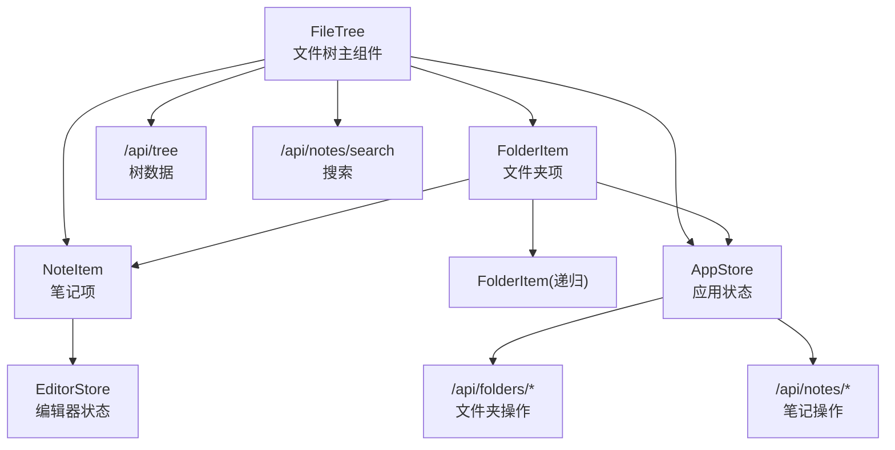
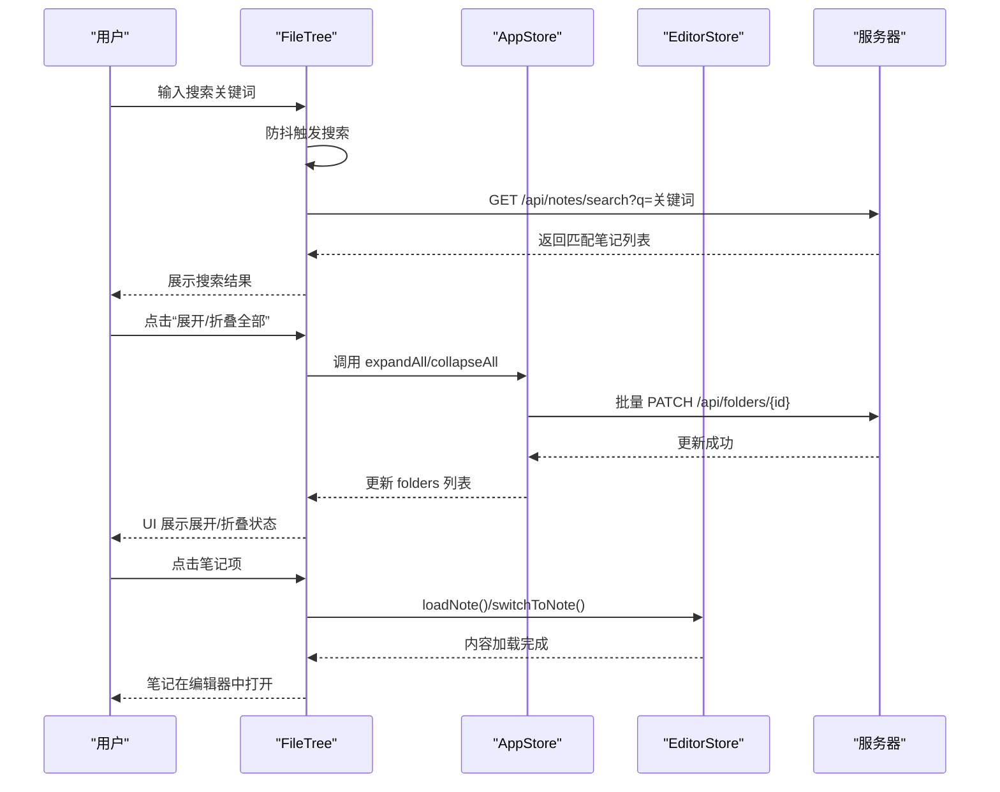
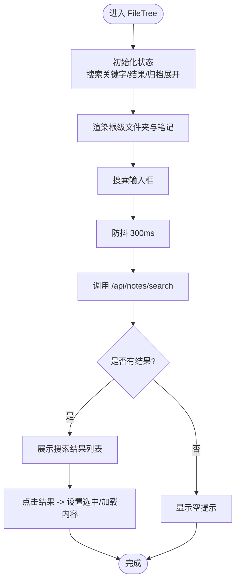
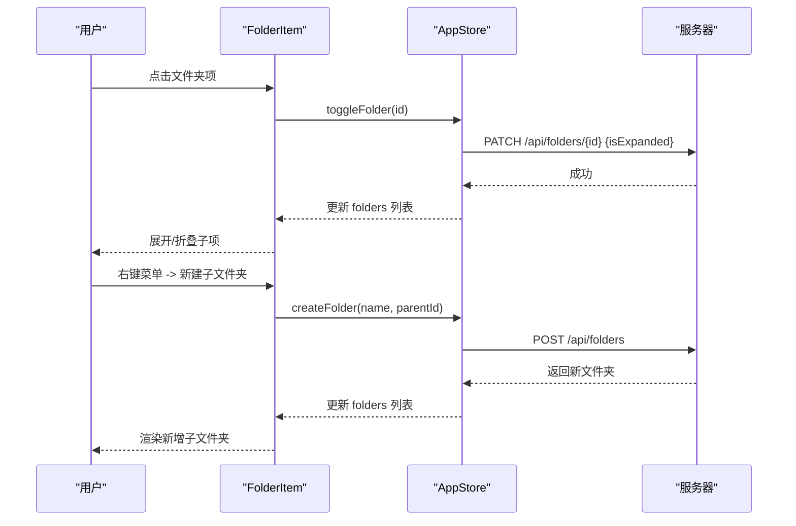
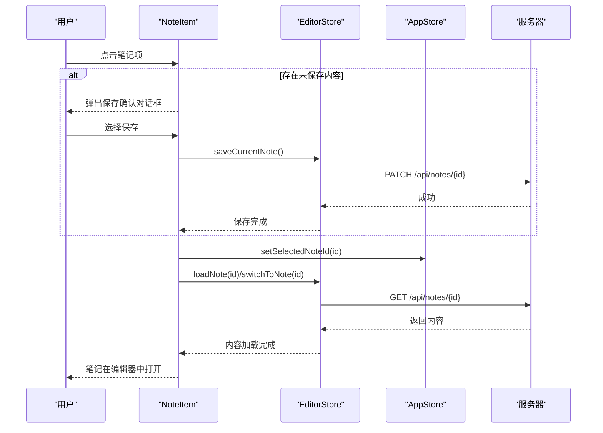
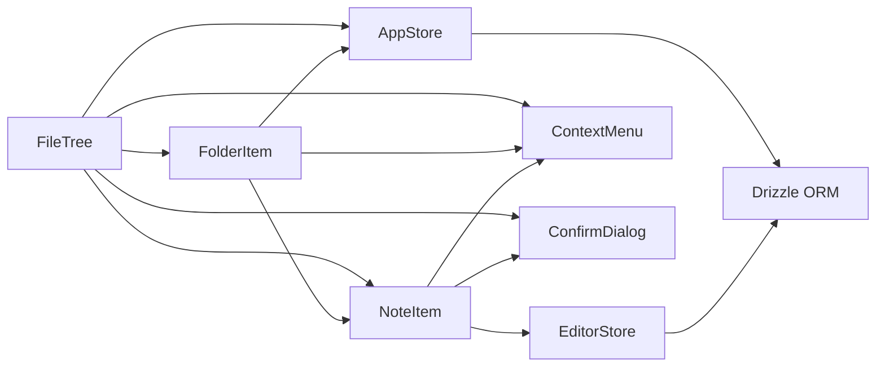

# 文件树组件

<cite>
**本文引用的文件**
- [src/components/file-tree/file-tree.tsx](file://src/components/file-tree/file-tree.tsx)
- [src/components/file-tree/folder-item.tsx](file://src/components/file-tree/folder-item.tsx)
- [src/components/file-tree/note-item.tsx](file://src/components/file-tree/note-item.tsx)
- [src/stores/app-store.ts](file://src/stores/app-store.ts)
- [src/stores/editor-store.ts](file://src/stores/editor-store.ts)
- [src/types/index.ts](file://src/types/index.ts)
- [src/components/ui/context-menu.tsx](file://src/components/ui/context-menu.tsx)
- [src/components/ui/confirm-dialog.tsx](file://src/components/ui/confirm-dialog.tsx)
- [src/app/api/tree/route.ts](file://src/app/api/tree/route.ts)
- [src/app/api/notes/search/route.ts](file://src/app/api/notes/search/route.ts)
- [src/hooks/use-debounce.ts](file://src/hooks/use-debounce.ts)
</cite>

## 目录
1. [简介](#简介)
2. [项目结构](#项目结构)
3. [核心组件](#核心组件)
4. [架构总览](#架构总览)
5. [详细组件分析](#详细组件分析)
6. [依赖关系分析](#依赖关系分析)
7. [性能考虑](#性能考虑)
8. [故障排查指南](#故障排查指南)
9. [结论](#结论)
10. [附录](#附录)

## 简介
本文件树组件提供一个可交互的层级化笔记与文件夹导航界面，支持：
- 递归渲染：文件夹与笔记的嵌套展示
- 动态加载：按需展开文件夹，异步更新展开状态
- 搜索功能：防抖搜索、实时结果显示与高亮（由调用方负责）
- 状态管理：选中状态、展开状态、归档状态
- 用户交互：右键菜单、新建/重命名/删除、导入到飞书等
- 编辑器集成：点击笔记即切换编辑器内容并保持状态同步

## 项目结构
文件树位于组件层，配合全局状态管理与API路由，形成清晰的分层：
- 组件层：FileTree、FolderItem、NoteItem
- 状态层：Zustand stores（应用状态与编辑器状态）
- 类型层：Folder、NoteMeta 等接口定义
- UI工具层：上下文菜单、确认对话框等
- 数据层：Next.js API 路由（树数据与搜索）

图表来源
- [src/components/file-tree/file-tree.tsx:22-300](file://src/components/file-tree/file-tree.tsx#L22-L300)
- [src/components/file-tree/folder-item.tsx:23-299](file://src/components/file-tree/folder-item.tsx#L23-L299)
- [src/components/file-tree/note-item.tsx:24-220](file://src/components/file-tree/note-item.tsx#L24-L220)
- [src/stores/app-store.ts:49-318](file://src/stores/app-store.ts#L49-L318)
- [src/stores/editor-store.ts:88-281](file://src/stores/editor-store.ts#L88-L281)
- [src/app/api/tree/route.ts:6-35](file://src/app/api/tree/route.ts#L6-L35)
- [src/app/api/notes/search/route.ts:6-43](file://src/app/api/notes/search/route.ts#L6-L43)

章节来源
- [src/components/file-tree/file-tree.tsx:22-300](file://src/components/file-tree/file-tree.tsx#L22-L300)
- [src/components/file-tree/folder-item.tsx:23-299](file://src/components/file-tree/folder-item.tsx#L23-L299)
- [src/components/file-tree/note-item.tsx:24-220](file://src/components/file-tree/note-item.tsx#L24-L220)

## 核心组件
- FileTree：顶层容器，负责根级文件夹与笔记渲染、搜索输入与结果展示、全展开/折叠控制、归档区展开/折叠、新建根级笔记。
- FolderItem：单个文件夹项，支持展开/折叠、重命名、新建子文件夹、新建笔记、归档/取消归档、删除；递归渲染子文件夹与笔记。
- NoteItem：单个笔记项，支持重命名、下载、导入到飞书、删除；点击时与编辑器状态联动。

章节来源
- [src/components/file-tree/file-tree.tsx:22-300](file://src/components/file-tree/file-tree.tsx#L22-L300)
- [src/components/file-tree/folder-item.tsx:23-299](file://src/components/file-tree/folder-item.tsx#L23-L299)
- [src/components/file-tree/note-item.tsx:24-220](file://src/components/file-tree/note-item.tsx#L24-L220)

## 架构总览
文件树采用“组件驱动 + 全局状态 + API路由”的架构：
- 组件负责UI与交互事件
- Zustand store 管理应用状态（文件夹/笔记列表、选中、搜索、树加载）
- EditorStore 管理编辑器当前内容、保存状态、缓存
- API路由提供树数据与搜索能力

图表来源
- [src/components/file-tree/file-tree.tsx:87-128](file://src/components/file-tree/file-tree.tsx#L87-L128)
- [src/stores/app-store.ts:149-191](file://src/stores/app-store.ts#L149-L191)
- [src/stores/editor-store.ts:114-155](file://src/stores/editor-store.ts#L114-L155)
- [src/app/api/notes/search/route.ts:6-43](file://src/app/api/notes/search/route.ts#L6-L43)

## 详细组件分析

### FileTree 主组件
职责与特性：
- 根级数据筛选：根级文件夹（无父级且未归档）、根级笔记（无所属文件夹）、归档文件夹
- 展开/折叠控制：根据所有非归档文件夹的展开状态，显示“全部展开/全部折叠”按钮的图标与禁用状态
- 搜索流程：防抖 300ms，调用 /api/notes/search，展示结果或空提示
- 归档区：独立区域，可展开/折叠，仅渲染已归档文件夹
- 新建入口：根级笔记创建、新建根级文件夹
- 与编辑器集成：点击搜索结果或笔记项时，设置选中、加载内容并切换到对应笔记

交互与状态：
- 本地状态：创建文件夹输入、搜索关键字、搜索结果、是否在搜索模式、归档区展开状态
- 全局状态：folders、notes、selectedNoteId、expandAllFolders、collapseAllFolders、createNote、loadNote、switchToNote

图表来源
- [src/components/file-tree/file-tree.tsx:87-128](file://src/components/file-tree/file-tree.tsx#L87-L128)
- [src/app/api/notes/search/route.ts:6-43](file://src/app/api/notes/search/route.ts#L6-L43)

章节来源
- [src/components/file-tree/file-tree.tsx:22-300](file://src/components/file-tree/file-tree.tsx#L22-L300)

### FolderItem 子组件
职责与特性：
- 展开/折叠：点击文件夹项触发 toggleFolder，更新本地展开状态并异步持久化
- 重命名：输入框回车或失焦保存，避免空白名
- 新建子文件夹/笔记：输入框回车或失焦创建，自动确保父级展开
- 归档/取消归档：对非归档区与归档区分别提供操作
- 删除：弹出确认对话框，说明包含的子文件夹与笔记数量，删除后笔记上移为根级
- 递归渲染：当 isExpanded 为真时，渲染子文件夹与该文件夹下的笔记

交互与状态：
- 本地状态：重命名输入、新建子文件夹/笔记输入、删除确认对话框
- 全局状态：toggleFolder、renameFolder、createFolder、deleteFolder、archiveFolder、unarchiveFolder、loadNote、switchToNote、saveCurrentNote

图表来源
- [src/components/file-tree/folder-item.tsx:111-296](file://src/components/file-tree/folder-item.tsx#L111-L296)
- [src/stores/app-store.ts:133-147](file://src/stores/app-store.ts#L133-L147)
- [src/app/api/tree/route.ts:6-35](file://src/app/api/tree/route.ts#L6-L35)

章节来源
- [src/components/file-tree/folder-item.tsx:23-299](file://src/components/file-tree/folder-item.tsx#L23-L299)

### NoteItem 子组件
职责与特性：
- 选中状态：根据 selectedNoteId 判断高亮
- 点击行为：若存在未保存内容，弹出保存确认对话框；否则立即设置选中、加载内容并切换
- 重命名：输入框回车或失焦保存
- 导航：与编辑器状态联动（设置编辑类型、切换当前笔记）
- 下载：跳转到 /api/notes/{id}/download
- 导入到飞书：POST /api/notes/{id}/upload-to-lark，带上传状态反馈
- 删除：弹出确认对话框

交互与状态：
- 本地状态：重命名输入、保存确认对话框、删除确认对话框、飞书导入上传状态
- 全局状态：selectedNoteId、renameNote、deleteNote、loadNote、switchToNote、setEditingType、saveCurrentNote

图表来源
- [src/components/file-tree/note-item.tsx:52-82](file://src/components/file-tree/note-item.tsx#L52-L82)
- [src/stores/editor-store.ts:114-155](file://src/stores/editor-store.ts#L114-L155)
- [src/app/api/notes/search/route.ts:6-43](file://src/app/api/notes/search/route.ts#L6-L43)

章节来源
- [src/components/file-tree/note-item.tsx:24-220](file://src/components/file-tree/note-item.tsx#L24-L220)

### 搜索功能实现
- 防抖策略：使用本地定时器实现 300ms 防抖，避免频繁请求
- 请求路径：GET /api/notes/search?q=关键词
- 结果展示：在搜索模式下替换为搜索结果列表，包含“搜索中/结果数量/空结果”提示
- 高亮：前端未内置高亮逻辑，建议在调用方渲染时对标题进行关键词高亮

章节来源
- [src/components/file-tree/file-tree.tsx:87-128](file://src/components/file-tree/file-tree.tsx#L87-L128)
- [src/app/api/notes/search/route.ts:6-43](file://src/app/api/notes/search/route.ts#L6-L43)

### 状态管理
- 应用状态（AppStore）：
  - 数据源：folders、notes
  - 选中：selectedNoteId
  - 搜索：searchQuery、searchResults
  - 树加载：treeLoading
  - 文件夹操作：create/rename/delete/toggle/expandAll/collapseAll/archive/unarchive
  - 笔记操作：create/rename/delete
  - 树数据拉取：fetchTree
- 编辑器状态（EditorStore）：
  - 当前笔记：currentNoteId
  - 编辑类型：editingType
  - 内容：initialContent、currentContent
  - 保存状态：saveStatus
  - 缓存：contentCache（LRU）
  - 加载/保存/切换/失效缓存

章节来源
- [src/stores/app-store.ts:49-318](file://src/stores/app-store.ts#L49-L318)
- [src/stores/editor-store.ts:88-281](file://src/stores/editor-store.ts#L88-L281)
- [src/types/index.ts:1-74](file://src/types/index.ts#L1-L74)

### 用户交互功能
- 右键菜单：基于 Radix UI ContextMenu，提供新建笔记/子文件夹、重命名、归档/取消归档、删除等
- 对话框：确认删除与保存确认对话框
- 快捷键：输入框内支持 Enter/Escape 提交或取消
- 飞书导入：按钮禁用上传中状态，成功/失败 toast 提示

章节来源
- [src/components/file-tree/folder-item.tsx:111-216](file://src/components/file-tree/folder-item.tsx#L111-L216)
- [src/components/file-tree/note-item.tsx:117-198](file://src/components/file-tree/note-item.tsx#L117-L198)
- [src/components/ui/context-menu.tsx:9-252](file://src/components/ui/context-menu.tsx#L9-L252)
- [src/components/ui/confirm-dialog.tsx:15-149](file://src/components/ui/confirm-dialog.tsx#L15-L149)

### 性能优化策略
- 递归渲染：仅在文件夹展开时渲染子节点，减少 DOM 数量
- 防抖搜索：300ms 防抖降低网络请求频率
- 编辑器缓存：EditorStore 使用 LRU 缓存最近访问的笔记内容，命中直接返回
- 批量更新：展开/折叠全部时乐观更新 UI，并批量发起请求
- 懒加载：树数据通过 /api/tree 按需拉取，避免一次性加载大量数据

章节来源
- [src/components/file-tree/file-tree.tsx:87-128](file://src/components/file-tree/file-tree.tsx#L87-L128)
- [src/stores/editor-store.ts:66-77](file://src/stores/editor-store.ts#L66-L77)
- [src/stores/app-store.ts:149-191](file://src/stores/app-store.ts#L149-L191)

### 与其他组件的集成
- 编辑器切换：NoteItem 点击后通过 EditorStore 的 loadNote/switchToNote 将内容注入编辑器
- 状态同步：AppStore 的 selectedNoteId 与 EditorStore 的 currentNoteId 保持一致
- 树数据刷新：删除文件夹后通过 AppStore.fetchTree 重新拉取，保证 UI 与服务端一致

章节来源
- [src/components/file-tree/note-item.tsx:52-82](file://src/components/file-tree/note-item.tsx#L52-L82)
- [src/stores/app-store.ts:120-131](file://src/stores/app-store.ts#L120-L131)
- [src/app/api/tree/route.ts:6-35](file://src/app/api/tree/route.ts#L6-L35)

## 依赖关系分析
- 组件间依赖：
  - FileTree 依赖 FolderItem、NoteItem、AppStore、EditorStore
  - FolderItem 依赖 NoteItem、AppStore、EditorStore、上下文菜单、确认对话框
  - NoteItem 依赖 AppStore、EditorStore、上下文菜单、确认对话框、提示组件
- 外部依赖：
  - Radix UI 上下文菜单与对话框
  - Lucide 图标库
  - Drizzle ORM（数据库查询）
  - Next.js API 路由（树数据与搜索）

图表来源
- [src/components/file-tree/file-tree.tsx:22-300](file://src/components/file-tree/file-tree.tsx#L22-L300)
- [src/components/file-tree/folder-item.tsx:23-299](file://src/components/file-tree/folder-item.tsx#L23-L299)
- [src/components/file-tree/note-item.tsx:24-220](file://src/components/file-tree/note-item.tsx#L24-L220)
- [src/stores/app-store.ts:49-318](file://src/stores/app-store.ts#L49-L318)
- [src/stores/editor-store.ts:88-281](file://src/stores/editor-store.ts#L88-L281)

章节来源
- [src/components/file-tree/file-tree.tsx:22-300](file://src/components/file-tree/file-tree.tsx#L22-L300)
- [src/components/file-tree/folder-item.tsx:23-299](file://src/components/file-tree/folder-item.tsx#L23-L299)
- [src/components/file-tree/note-item.tsx:24-220](file://src/components/file-tree/note-item.tsx#L24-L220)

## 性能考虑
- 渲染层面：
  - 仅在展开时渲染子节点，避免深层递归导致的大量 DOM
  - 搜索结果以列表形式呈现，避免在树中重复渲染
- 网络层面：
  - 搜索防抖 300ms，减少请求次数
  - 批量展开/折叠时乐观更新 UI，提升响应速度
- 存储层面：
  - 编辑器内容 LRU 缓存，命中直接返回，降低重复加载成本
- 建议：
  - 大规模树结构可引入虚拟滚动（例如第三方库）进一步降低渲染压力
  - 对搜索结果进行分页或限制最大返回条数，避免超大数据集

章节来源
- [src/components/file-tree/file-tree.tsx:87-128](file://src/components/file-tree/file-tree.tsx#L87-L128)
- [src/stores/editor-store.ts:66-77](file://src/stores/editor-store.ts#L66-L77)
- [src/stores/app-store.ts:149-191](file://src/stores/app-store.ts#L149-L191)

## 故障排查指南
- 搜索无结果：
  - 检查关键词是否为空，确认防抖是否生效
  - 查看 /api/notes/search 路由返回状态
- 展开/折叠异常：
  - 确认 toggleFolder 是否正确调用并持久化
  - 检查 folders 列表中 isExpanded 字段是否更新
- 删除后树不刷新：
  - 确认 deleteFolder 后是否调用 fetchTree 重新拉取
- 未保存内容切换：
  - 确保 saveCurrentNote 成功后再切换，否则弹出保存确认对话框
- 飞书导入失败：
  - 检查 /api/notes/{id}/upload-to-lark 接口返回错误信息，toast 会提示具体原因

章节来源
- [src/components/file-tree/file-tree.tsx:87-128](file://src/components/file-tree/file-tree.tsx#L87-L128)
- [src/stores/app-store.ts:120-131](file://src/stores/app-store.ts#L120-L131)
- [src/stores/editor-store.ts:204-275](file://src/stores/editor-store.ts#L204-L275)
- [src/app/api/notes/search/route.ts:6-43](file://src/app/api/notes/search/route.ts#L6-L43)

## 结论
文件树组件通过清晰的组件分层与全局状态管理，实现了高效的递归渲染、动态加载与丰富的用户交互。结合防抖搜索、批量更新与编辑器缓存，整体具备良好的性能与可用性。后续可在大规模场景下引入虚拟滚动与搜索结果分页，进一步优化体验。

## 附录
- API 路由参考：
  - 获取树数据：GET /api/tree
  - 搜索笔记：GET /api/notes/search?q=关键词
  - 文件夹操作：POST/PATCH/DELETE /api/folders/*
  - 笔记操作：POST/PATCH/DELETE /api/notes/*

章节来源
- [src/app/api/tree/route.ts:6-35](file://src/app/api/tree/route.ts#L6-L35)
- [src/app/api/notes/search/route.ts:6-43](file://src/app/api/notes/search/route.ts#L6-L43)