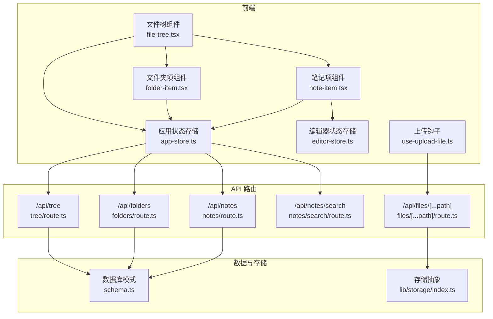
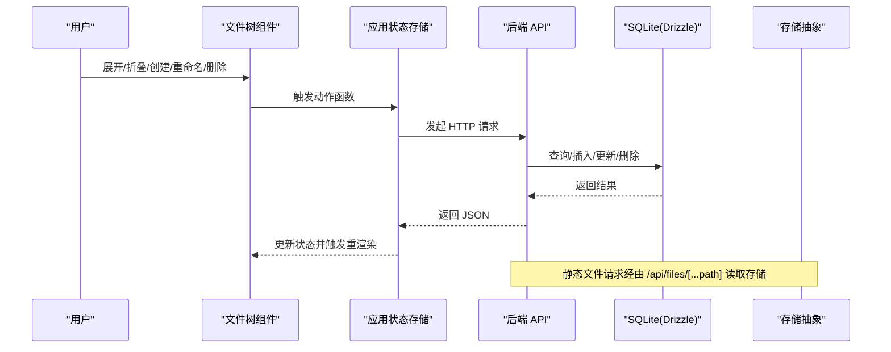
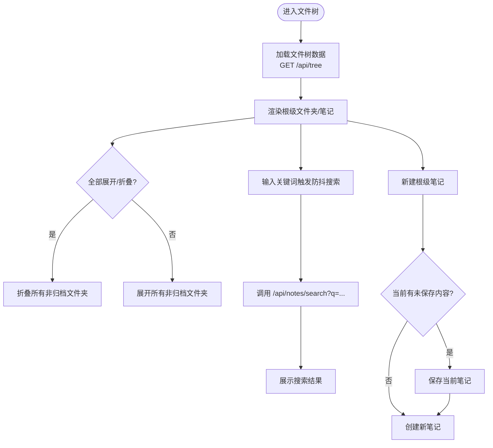
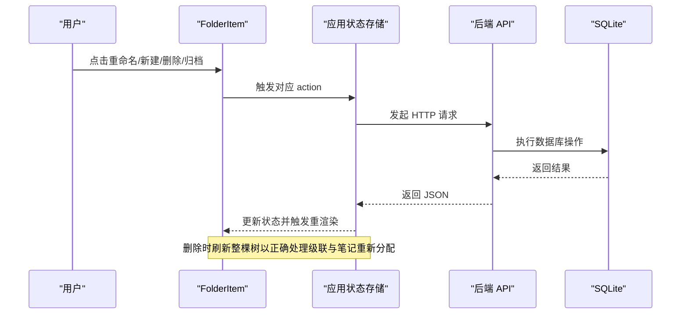
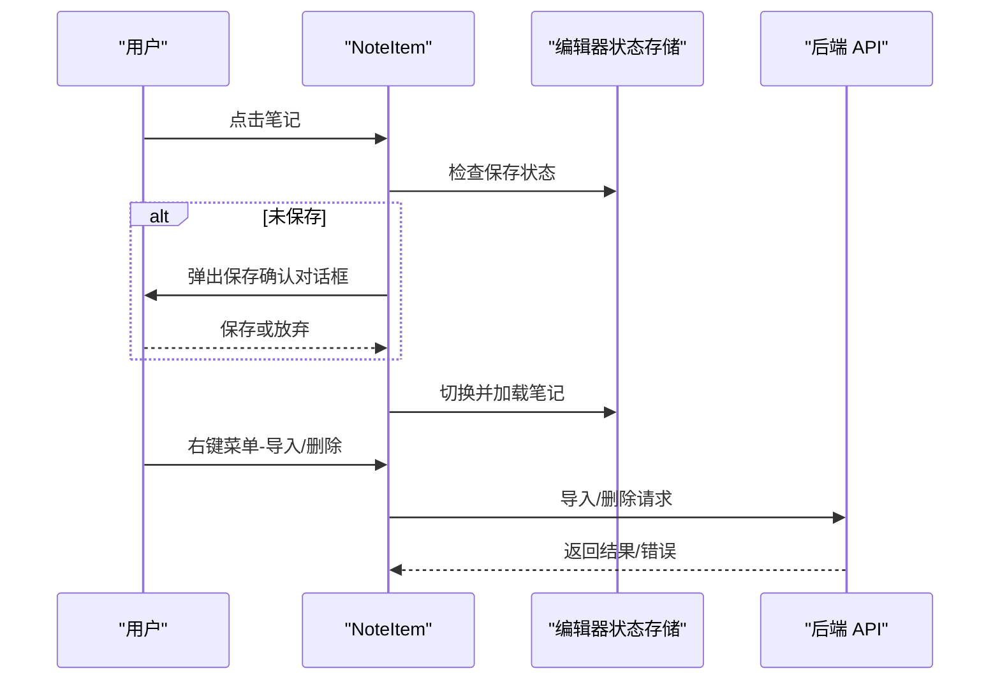
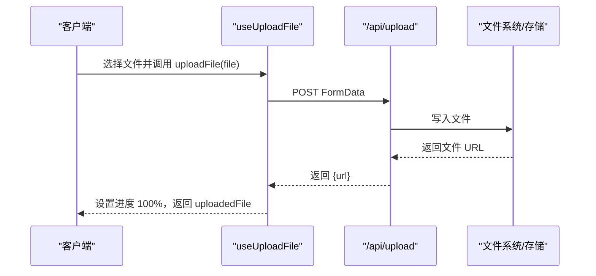
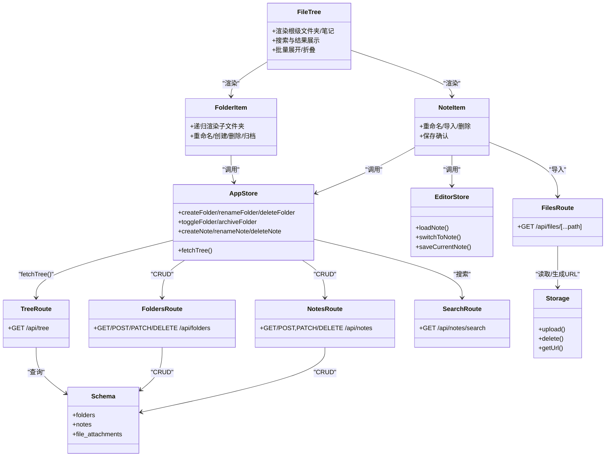

# 文件管理系统

<cite>
**本文引用的文件**
- [src/components/file-tree/file-tree.tsx](file://src/components/file-tree/file-tree.tsx)
- [src/components/file-tree/folder-item.tsx](file://src/components/file-tree/folder-item.tsx)
- [src/components/file-tree/note-item.tsx](file://src/components/file-tree/note-item.tsx)
- [src/stores/app-store.ts](file://src/stores/app-store.ts)
- [src/stores/editor-store.ts](file://src/stores/editor-store.ts)
- [src/app/api/tree/route.ts](file://src/app/api/tree/route.ts)
- [src/app/api/folders/route.ts](file://src/app/api/folders/route.ts)
- [src/app/api/notes/route.ts](file://src/app/api/notes/route.ts)
- [src/app/api/notes/search/route.ts](file://src/app/api/notes/search/route.ts)
- [src/app/api/files/[...path]/route.ts](file://src/app/api/files/[...path]/route.ts)
- [src/db/schema.ts](file://src/db/schema.ts)
- [src/lib/storage/index.ts](file://src/lib/storage/index.ts)
- [src/hooks/use-upload-file.ts](file://src/hooks/use-upload-file.ts)
</cite>

## 更新摘要
**所做更改**
- 更新了笔记项组件的下载功能描述，反映下载功能已被移除
- 移除了相关的下载API接口说明
- 更新了文件上传与下载机制章节，移除下载相关内容
- 更新了用户体验优化章节，移除下载相关的UI组件描述

## 目录
1. [简介](#简介)
2. [项目结构](#项目结构)
3. [核心组件](#核心组件)
4. [架构总览](#架构总览)
5. [详细组件分析](#详细组件分析)
6. [依赖关系分析](#依赖关系分析)
7. [性能考量](#性能考量)
8. [故障排查指南](#故障排查指南)
9. [结论](#结论)
10. [附录：API 接口规范](#附录api-接口规范)

## 简介
本文件管理系统围绕"文件树"组件构建，提供递归渲染与动态加载能力；支持文件夹的创建、删除、重命名与归档/取消归档；支持笔记的创建、重命名、删除与导入到飞书文档；提供基于 Drizzle ORM 的 SQLite 数据库存储；通过统一的存储抽象层支持本地或云端存储；提供搜索、上下文菜单、确认对话框等用户体验优化；并具备与数据库的同步机制。

## 项目结构
- 前端组件集中在 src/components/file-tree，负责文件树的渲染与交互。
- 状态管理使用 Zustand 存储在 src/stores，包含应用状态与编辑器状态。
- API 路由位于 src/app/api，覆盖文件树、文件夹、笔记、搜索与静态文件服务。
- 数据模型定义于 src/db/schema.ts，采用 Drizzle ORM 的 SQLite 表结构。
- 存储抽象位于 src/lib/storage，支持本地与云存储切换。
- 上传钩子位于 src/hooks/use-upload-file.ts，提供上传进度与结果反馈。

**图表来源**
- [src/components/file-tree/file-tree.tsx:1-326](file://src/components/file-tree/file-tree.tsx#L1-L326)
- [src/components/file-tree/folder-item.tsx:1-299](file://src/components/file-tree/folder-item.tsx#L1-L299)
- [src/components/file-tree/note-item.tsx:1-210](file://src/components/file-tree/note-item.tsx#L1-L210)
- [src/stores/app-store.ts:1-318](file://src/stores/app-store.ts#L1-L318)
- [src/stores/editor-store.ts](file://src/stores/editor-store.ts)
- [src/app/api/tree/route.ts:1-36](file://src/app/api/tree/route.ts#L1-L36)
- [src/app/api/folders/route.ts:1-75](file://src/app/api/folders/route.ts#L1-L75)
- [src/app/api/notes/route.ts:1-86](file://src/app/api/notes/route.ts#L1-L86)
- [src/app/api/notes/search/route.ts:1-44](file://src/app/api/notes/search/route.ts#L1-L44)
- [src/app/api/files/[...path]/route.ts:1-48](file://src/app/api/files/[...path]/route.ts#L1-L48)
- [src/db/schema.ts:1-105](file://src/db/schema.ts#L1-L105)
- [src/lib/storage/index.ts:1-30](file://src/lib/storage/index.ts#L1-L30)
- [src/hooks/use-upload-file.ts:1-53](file://src/hooks/use-upload-file.ts#L1-L53)

**章节来源**
- [src/components/file-tree/file-tree.tsx:1-326](file://src/components/file-tree/file-tree.tsx#L1-L326)
- [src/stores/app-store.ts:1-318](file://src/stores/app-store.ts#L1-L318)

## 核心组件
- 文件树组件 FileTree：负责根级文件夹、根级笔记、归档区的展示与搜索；调用应用状态存储进行文件夹/笔记操作与选择。
- 文件夹项组件 FolderItem：递归渲染子文件夹与笔记；支持重命名、创建子文件夹/笔记、删除、归档/取消归档；右键上下文菜单提供快捷操作。
- 笔记项组件 NoteItem：支持重命名、导入到飞书文档、删除；带保存确认对话框与提示。
- 应用状态存储 AppStore：封装文件树数据获取、文件夹/笔记 CRUD、展开/折叠、归档/取消归档、搜索结果管理；与编辑器状态存储协同。
- 编辑器状态存储 EditorStore：负责笔记加载、切换、保存状态与缓存失效。
- API 路由：提供文件树聚合查询、文件夹 CRUD、笔记 CRUD 与搜索；静态文件服务路由用于图片等资源读取。
- 数据模型：folders、notes、file_attachments 等表定义，支持文件夹层级、笔记元信息与附件字段。
- 存储抽象：根据环境变量自动选择本地或 COS 云存储，统一上传、删除、URL 获取接口。
- 上传钩子：封装文件上传、进度与结果返回。

**章节来源**
- [src/components/file-tree/file-tree.tsx:22-300](file://src/components/file-tree/file-tree.tsx#L22-L300)
- [src/components/file-tree/folder-item.tsx:23-298](file://src/components/file-tree/folder-item.tsx#L23-L298)
- [src/components/file-tree/note-item.tsx:24-210](file://src/components/file-tree/note-item.tsx#L24-L210)
- [src/stores/app-store.ts:49-317](file://src/stores/app-store.ts#L49-L317)
- [src/stores/editor-store.ts](file://src/stores/editor-store.ts)
- [src/app/api/tree/route.ts:6-35](file://src/app/api/tree/route.ts#L6-L35)
- [src/app/api/folders/route.ts:19-74](file://src/app/api/folders/route.ts#L19-L74)
- [src/app/api/notes/route.ts:10-86](file://src/app/api/notes/route.ts#L10-L86)
- [src/app/api/notes/search/route.ts:6-43](file://src/app/api/notes/search/route.ts#L6-L43)
- [src/app/api/files/[...path]/route.ts:7-47](file://src/app/api/files/[...path]/route.ts#L7-L47)
- [src/db/schema.ts:10-55](file://src/db/schema.ts#L10-L55)
- [src/lib/storage/index.ts:12-29](file://src/lib/storage/index.ts#L12-L29)
- [src/hooks/use-upload-file.ts:10-52](file://src/hooks/use-upload-file.ts#L10-L52)

## 架构总览
系统采用前后端分离的 Next.js 路由器 API 设计，前端通过 fetch 调用后端接口，状态集中于 Zustand Store，数据持久化使用 Drizzle ORM + SQLite。文件资源通过统一存储抽象层管理，支持本地或 COS 云存储。

**图表来源**
- [src/components/file-tree/file-tree.tsx:130-300](file://src/components/file-tree/file-tree.tsx#L130-L300)
- [src/stores/app-store.ts:69-317](file://src/stores/app-store.ts#L69-L317)
- [src/app/api/tree/route.ts:6-35](file://src/app/api/tree/route.ts#L6-L35)
- [src/app/api/folders/route.ts:34-74](file://src/app/api/folders/route.ts#L34-L74)
- [src/app/api/notes/route.ts:42-86](file://src/app/api/notes/route.ts#L42-L86)
- [src/app/api/files/[...path]/route.ts:7-47](file://src/app/api/files/[...path]/route.ts#L7-L47)
- [src/db/schema.ts:10-55](file://src/db/schema.ts#L10-L55)
- [src/lib/storage/index.ts:12-29](file://src/lib/storage/index.ts#L12-L29)

## 详细组件分析

### 文件树组件 FileTree
- 功能要点
  - 分类渲染：根级文件夹、根级笔记、归档区。
  - 搜索：防抖搜索，调用 /api/notes/search?q=...，展示搜索结果列表。
  - 批量展开/折叠：根据是否全部展开/折叠决定按钮图标与行为。
  - 新建根级笔记：自动保存当前未保存内容后再创建新笔记。
  - 归档区：可折叠显示归档文件夹。
- 递归渲染与动态加载
  - 通过 FolderItem 递归渲染子文件夹与笔记。
  - 展开状态由应用状态存储维护，UI 乐观更新，随后异步同步至后端。
- 用户体验
  - 输入框即时校验与回车/ESC 快捷键。
  - 清空搜索、空状态提示。

**图表来源**
- [src/components/file-tree/file-tree.tsx:43-122](file://src/components/file-tree/file-tree.tsx#L43-L122)
- [src/stores/app-store.ts:69-82](file://src/stores/app-store.ts#L69-L82)
- [src/app/api/notes/search/route.ts:6-43](file://src/app/api/notes/search/route.ts#L6-L43)

**章节来源**
- [src/components/file-tree/file-tree.tsx:22-300](file://src/components/file-tree/file-tree.tsx#L22-L300)
- [src/stores/app-store.ts:69-191](file://src/stores/app-store.ts#L69-L191)

### 文件夹项组件 FolderItem
- 功能要点
  - 展开/折叠：切换 isExpanded 并异步更新后端。
  - 重命名：输入校验后调用 PATCH /api/folders/[id]。
  - 创建子文件夹/笔记：输入校验后调用 POST /api/folders 与 POST /api/notes。
  - 删除：弹出确认对话框，执行 DELETE /api/folders/[id]，随后刷新文件树。
  - 归档/取消归档：PATCH /api/folders/[id]，UI 乐观更新并失败回滚。
- 递归渲染
  - 子文件夹通过自身再次渲染，深度 depth 控制缩进。
- 上下文菜单
  - 支持新建笔记、新建子文件夹、重命名、移入/取消归档、删除。

**图表来源**
- [src/components/file-tree/folder-item.tsx:55-98](file://src/components/file-tree/folder-item.tsx#L55-L98)
- [src/stores/app-store.ts:102-131](file://src/stores/app-store.ts#L102-L131)
- [src/app/api/folders/route.ts:34-74](file://src/app/api/folders/route.ts#L34-L74)

**章节来源**
- [src/components/file-tree/folder-item.tsx:23-298](file://src/components/file-tree/folder-item.tsx#L23-L298)
- [src/stores/app-store.ts:84-261](file://src/stores/app-store.ts#L84-L261)

### 笔记项组件 NoteItem
- 功能要点
  - 点击切换：若存在未保存内容，弹出保存确认对话框；否则立即切换并加载笔记。
  - 重命名：PATCH /api/notes/[id]。
  - 导入到飞书文档：POST /api/notes/[id]/upload-to-lark，成功提示与错误处理。
  - 删除：DELETE /api/notes/[id]，清理编辑器缓存与选中状态。
- 用户体验
  - Tooltip 显示完整标题。
  - 保存确认对话框避免误切换导致未保存丢失。

**图表来源**
- [src/components/file-tree/note-item.tsx:52-94](file://src/components/file-tree/note-item.tsx#L52-L94)
- [src/stores/editor-store.ts](file://src/stores/editor-store.ts)
- [src/app/api/notes/route.ts:42-86](file://src/app/api/notes/route.ts#L42-L86)

**章节来源**
- [src/components/file-tree/note-item.tsx:24-210](file://src/components/file-tree/note-item.tsx#L24-L210)
- [src/stores/editor-store.ts](file://src/stores/editor-store.ts)

### 文件上传与下载机制
- 上传
  - 使用自定义 Hook useUploadFile，构造 FormData 提交到 /api/upload。
  - 进度：初始阶段设置到 50%，收到响应后置为 100%。
  - 结果：返回 url 与文件名，可用于插入编辑器或附件列表。
- 静态文件
  - /api/files/[...path] 路由读取 data/uploads 目录下的文件，防止目录穿越，按扩展名映射 MIME 类型。
- 错误处理
  - 上传失败时重置进度。
  - 导入/删除异常通过 toast 提示。

**图表来源**
- [src/hooks/use-upload-file.ts:16-43](file://src/hooks/use-upload-file.ts#L16-L43)
- [src/app/api/files/[...path]/route.ts:7-47](file://src/app/api/files/[...path]/route.ts#L7-L47)

**章节来源**
- [src/hooks/use-upload-file.ts:10-52](file://src/hooks/use-upload-file.ts#L10-L52)
- [src/app/api/files/[...path]/route.ts:7-47](file://src/app/api/files/[...path]/route.ts#L7-L47)

### 文件路径解析与 URL 处理
- 静态文件服务
  - 路径参数 [...path] 解析为绝对路径，使用 path.resolve 并检查前缀，防止目录穿越。
  - 根据扩展名映射 MIME 类型，设置缓存头。
- 存储抽象
  - 通过 getStorage() 自动选择本地或 COS 实现，统一 upload/delete/getUrl 接口。
- URL 生成
  - 上传成功后返回 url，供前端使用；静态文件通过 /api/files/[...path] 访问。

**章节来源**
- [src/app/api/files/[...path]/route.ts:10-47](file://src/app/api/files/[...path]/route.ts#L10-L47)
- [src/lib/storage/index.ts:12-29](file://src/lib/storage/index.ts#L12-L29)

### 文件类型识别与预览支持
- 当前实现
  - 静态文件服务对常见图片类型（.webp/.png/.jpg/.jpeg/.gif/.svg）进行 MIME 类型映射。
- 预览建议
  - 可在前端根据扩展名或 MIME 类型选择合适的预览组件（图片、视频、音频、PDF 等）。

**章节来源**
- [src/app/api/files/[...path]/route.ts:28-42](file://src/app/api/files/[...path]/route.ts#L28-L42)

### 文件存储策略与命名规范
- 存储策略
  - 本地：默认使用本地文件系统，文件存放于 data/uploads。
  - 云存储：通过环境变量启用 COS，统一接口适配。
- 命名规范
  - 上传文件名由后端生成唯一 key（例如使用 nanoid），避免冲突与非法字符。
  - 前端可保留原始文件名，存储层仅使用 key。
- 数据库关联
  - 附件表 file_attachments 记录 noteId、fileName、filePath、storageType、mimeType、size 等字段，便于检索与管理。

**章节来源**
- [src/lib/storage/index.ts:12-29](file://src/lib/storage/index.ts#L12-L29)
- [src/db/schema.ts:41-55](file://src/db/schema.ts#L41-L55)

### 文件权限与访问控制
- 当前实现
  - 代码库未发现显式的鉴权与权限控制逻辑。
- 建议
  - 在 API 路由中增加鉴权中间件，校验用户身份与资源访问权限。
  - 对文件夹/笔记的 CRUD 操作增加细粒度权限检查。

**章节来源**
- [src/app/api/folders/route.ts:34-74](file://src/app/api/folders/route.ts#L34-L74)
- [src/app/api/notes/route.ts:42-86](file://src/app/api/notes/route.ts#L42-L86)

### 用户体验优化
- 拖拽上传
  - 当前未见拖拽上传实现；可在编辑器或媒体工具栏中集成拖拽区域与事件处理。
- 批量操作
  - 文件夹项支持批量展开/折叠（UI 乐观更新 + 异步回写）。
  - 搜索防抖提升输入体验。
- 其他
  - Tooltip 展示完整标题。
  - 保存确认对话框避免误操作。
  - 归档/取消归档支持，便于整理空间。

**章节来源**
- [src/stores/app-store.ts:149-191](file://src/stores/app-store.ts#L149-L191)
- [src/components/file-tree/file-tree.tsx:111-122](file://src/components/file-tree/file-tree.tsx#L111-L122)
- [src/components/file-tree/note-item.tsx:172-185](file://src/components/file-tree/note-item.tsx#L172-L185)

### 文件系统与数据库同步机制
- 文件树聚合
  - /api/tree 聚合 folders 与 notes，作为前端一次性加载的数据源。
- CRUD 同步
  - FolderItem/Delete：删除后主动刷新整棵树，确保级联删除与笔记重新分配正确反映在 UI。
  - FolderItem/Toggle/Archive：UI 乐观更新，随后异步回写后端；失败时回滚。
- 搜索同步
  - 搜索结果来自后端数据库查询，保证实时性与准确性。

**章节来源**
- [src/app/api/tree/route.ts:6-35](file://src/app/api/tree/route.ts#L6-L35)
- [src/stores/app-store.ts:120-131](file://src/stores/app-store.ts#L120-L131)
- [src/stores/app-store.ts:193-261](file://src/stores/app-store.ts#L193-L261)

## 依赖关系分析

**图表来源**
- [src/components/file-tree/file-tree.tsx:22-300](file://src/components/file-tree/file-tree.tsx#L22-L300)
- [src/components/file-tree/folder-item.tsx:23-298](file://src/components/file-tree/folder-item.tsx#L23-L298)
- [src/components/file-tree/note-item.tsx:24-210](file://src/components/file-tree/note-item.tsx#L24-L210)
- [src/stores/app-store.ts:49-317](file://src/stores/app-store.ts#L49-L317)
- [src/stores/editor-store.ts](file://src/stores/editor-store.ts)
- [src/app/api/tree/route.ts:6-35](file://src/app/api/tree/route.ts#L6-L35)
- [src/app/api/folders/route.ts:19-74](file://src/app/api/folders/route.ts#L19-L74)
- [src/app/api/notes/route.ts:10-86](file://src/app/api/notes/route.ts#L10-L86)
- [src/app/api/notes/search/route.ts:6-43](file://src/app/api/notes/search/route.ts#L6-L43)
- [src/app/api/files/[...path]/route.ts:7-47](file://src/app/api/files/[...path]/route.ts#L7-L47)
- [src/db/schema.ts:10-55](file://src/db/schema.ts#L10-L55)
- [src/lib/storage/index.ts:12-29](file://src/lib/storage/index.ts#L12-L29)

## 性能考量
- 递归渲染
  - 通过传递 notes 与 folders 的过滤子集，减少不必要的重渲染。
- 乐观更新
  - 展开/折叠、归档/取消归档等操作先更新 UI，再异步回写，提升响应速度。
- 批量操作
  - 批量展开/折叠使用 Promise.all 并行更新，降低等待时间。
- 搜索防抖
  - 300ms 防抖降低频繁请求压力。
- 缓存头
  - 静态文件设置长期缓存头，减少重复请求。

**章节来源**
- [src/stores/app-store.ts:149-191](file://src/stores/app-store.ts#L149-L191)
- [src/components/file-tree/file-tree.tsx:111-122](file://src/components/file-tree/file-tree.tsx#L111-L122)
- [src/app/api/files/[...path]/route.ts:37-42](file://src/app/api/files/[...path]/route.ts#L37-L42)

## 故障排查指南
- 上传失败
  - 检查 /api/upload 是否可达，FormData 是否正确构造。
  - 查看浏览器网络面板与控制台错误日志。
- 导入到飞书文档失败
  - 确认 /api/notes/[id]/upload-to-lark 是否返回 200；检查笔记是否存在。
  - 静态文件 404：确认文件路径与 data/uploads 目录权限。
- 删除后 UI 不一致
  - 确保删除后调用了刷新文件树；检查后端级联删除逻辑。
- 归档/取消归档失败
  - 检查 PATCH 请求返回状态；失败时 UI 将自动回滚。
- 搜索无结果
  - 确认关键词非空且后端数据库中存在匹配内容。

**章节来源**
- [src/hooks/use-upload-file.ts:37-42](file://src/hooks/use-upload-file.ts#L37-L42)
- [src/app/api/files/[...path]/route.ts:15-23](file://src/app/api/files/[...path]/route.ts#L15-L23)
- [src/stores/app-store.ts:120-131](file://src/stores/app-store.ts#L120-L131)
- [src/stores/app-store.ts:193-261](file://src/stores/app-store.ts#L193-L261)

## 结论
该文件管理系统以文件树为核心，结合状态存储与 API 路由实现了完整的文件夹与笔记管理流程。前端通过递归组件与上下文菜单提供良好交互，后端通过 Drizzle ORM 与 SQLite 保障数据一致性。存储抽象支持本地与云存储切换，静态文件服务具备基础的安全与缓存策略。建议后续增强鉴权与权限控制、引入拖拽上传与批量操作、扩展文件类型识别与预览能力。

## 附录：API 接口规范

- 文件树
  - GET /api/tree
    - 描述：获取完整的文件夹与笔记列表，按排序与创建时间排序。
    - 成功：200，返回 { folders[], notes[] }。
    - 失败：500，返回 { error }。
- 文件夹
  - GET /api/folders
    - 描述：获取所有文件夹，按排序与创建时间排序。
    - 成功：200，返回 folders 数组。
    - 失败：500，返回 { error }。
  - POST /api/folders
    - 描述：创建文件夹，支持指定 parentId（最多两级）。
    - 请求体：{ name, parentId?, sortOrder? }
    - 成功：201，返回新建文件夹对象。
    - 失败：400/500，返回 { error }。
  - PATCH /api/folders/{id}
    - 描述：更新文件夹属性（如 isExpanded、isArchived、name）。
    - 成功：200，返回更新后的文件夹对象。
    - 失败：400/500，返回 { error }。
  - DELETE /api/folders/{id}
    - 描述：删除文件夹（支持级联删除），删除后刷新整棵树。
    - 成功：200。
    - 失败：500，返回 { error }。
- 笔记
  - GET /api/notes?folderId=root|{folderId}
    - 描述：获取笔记列表，支持根级（folderId=root）或指定文件夹。
    - 成功：200，返回 notes 数组。
    - 失败：500，返回 { error }。
  - POST /api/notes
    - 描述：创建笔记，folderId 可为空表示根级。
    - 请求体：{ folderId?, title? }
    - 成功：201，返回新建笔记对象。
    - 失败：400/500，返回 { error }。
  - PATCH /api/notes/{id}
    - 描述：更新笔记标题。
    - 成功：200，返回更新后的笔记对象。
    - 失败：400/500，返回 { error }。
  - DELETE /api/notes/{id}
    - 描述：删除笔记，清理编辑器缓存与选中状态。
    - 成功：200。
    - 失败：500，返回 { error }。
  - POST /api/notes/{id}/upload-to-lark
    - 描述：导入笔记到飞书文档。
    - 成功：200，返回 { message }。
    - 失败：400/500，返回 { error }。
- 搜索
  - GET /api/notes/search?q=关键词
    - 描述：按标题/内容/Markdown 模糊搜索笔记。
    - 成功：200，返回 { notes[] }。
    - 失败：500，返回 { error }。
- 静态文件
  - GET /api/files/[...path]
    - 描述：安全读取 data/uploads 下的文件，防止目录穿越。
    - 成功：200，返回文件二进制流与对应 MIME 类型。
    - 失败：403/404/500，返回 { error }。

**章节来源**
- [src/app/api/tree/route.ts:6-35](file://src/app/api/tree/route.ts#L6-L35)
- [src/app/api/folders/route.ts:19-74](file://src/app/api/folders/route.ts#L19-L74)
- [src/app/api/notes/route.ts:10-86](file://src/app/api/notes/route.ts#L10-L86)
- [src/app/api/notes/search/route.ts:6-43](file://src/app/api/notes/search/route.ts#L6-L43)
- [src/app/api/files/[...path]/route.ts:7-47](file://src/app/api/files/[...path]/route.ts#L7-L47)