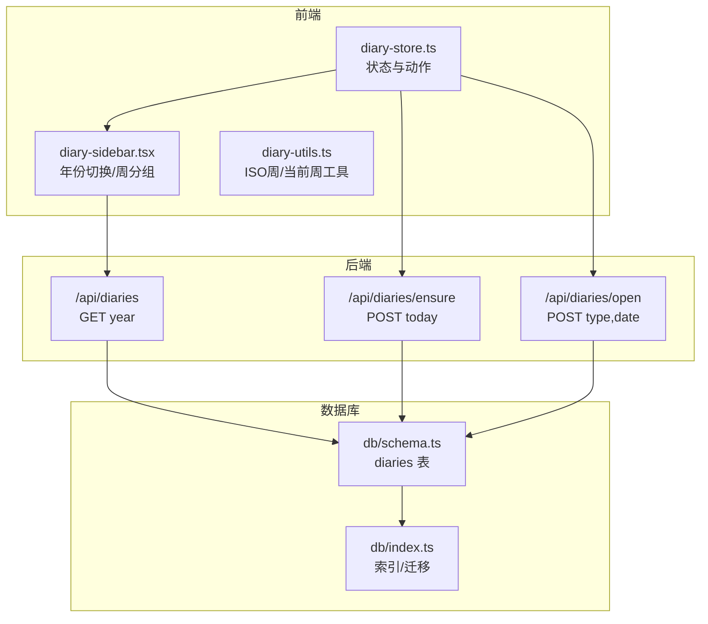
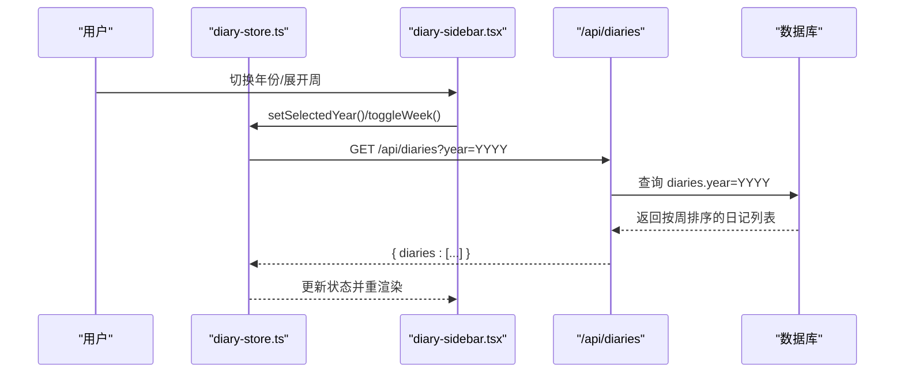
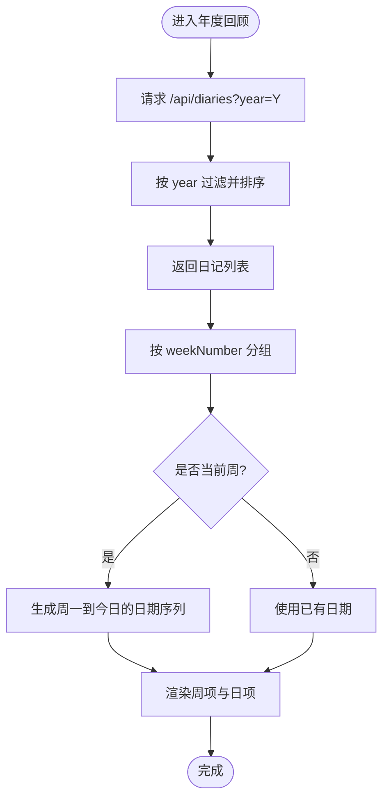
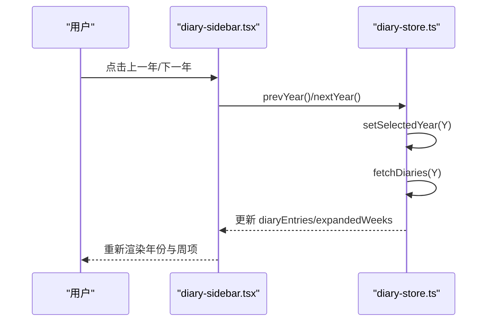
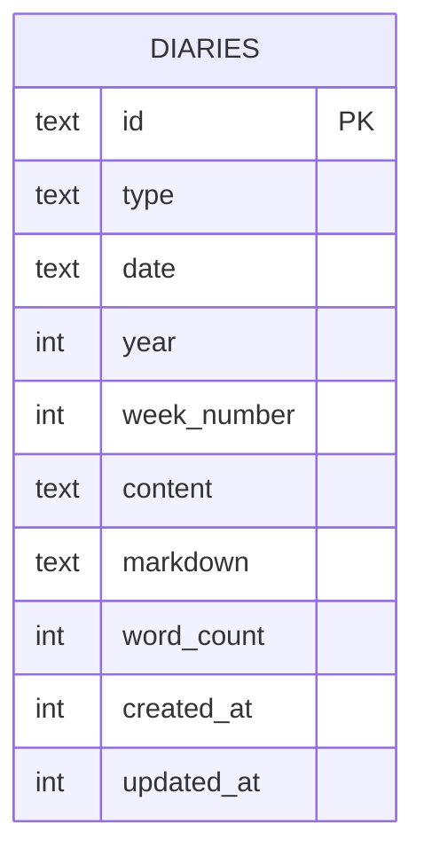
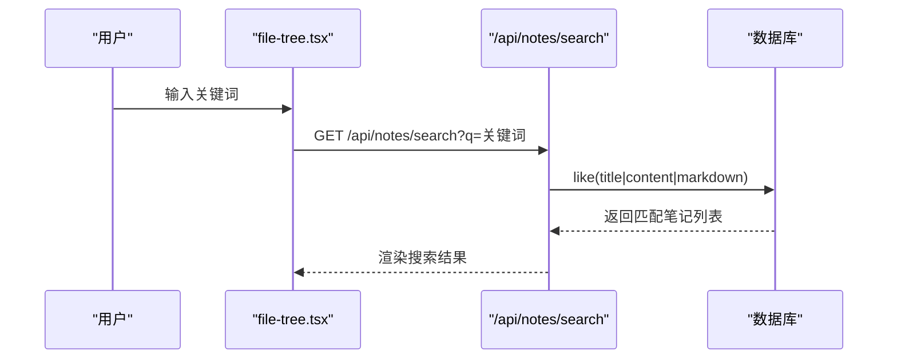
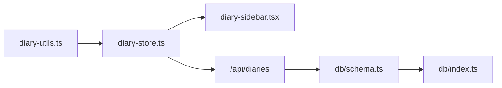

# 年度回顾系统

<cite>
**本文引用的文件**
- [README.md](file://README.md)
- [src/app/api/diaries/route.ts](file://src/app/api/diaries/route.ts)
- [src/app/api/diaries/ensure/route.ts](file://src/app/api/diaries/ensure/route.ts)
- [src/app/api/diaries/open/route.ts](file://src/app/api/diaries/open/route.ts)
- [src/stores/diary-store.ts](file://src/stores/diary-store.ts)
- [src/components/diary/diary-sidebar.tsx](file://src/components/diary/diary-sidebar.tsx)
- [src/lib/diary-utils.ts](file://src/lib/diary-utils.ts)
- [src/db/schema.ts](file://src/db/schema.ts)
- [src/db/index.ts](file://src/db/index.ts)
- [src/types/index.ts](file://src/types/index.ts)
- [src/app/api/notes/search/route.ts](file://src/app/api/notes/search/route.ts)
- [src/components/file-tree/file-tree.tsx](file://src/components/file-tree/file-tree.tsx)
- [src/stores/ideas-store.ts](file://src/stores/ideas-store.ts)
- [src/components/ideas/idea-timeline.tsx](file://src/components/ideas/idea-timeline.tsx)
- [src/components/ideas/tag-filter-bar.tsx](file://src/components/ideas/tag-filter-bar.tsx)
- [src/components/ideas/ideas-page.tsx](file://src/components/ideas/ideas-page.tsx)
</cite>

## 目录
1. [简介](#简介)
2. [项目结构](#项目结构)
3. [核心组件](#核心组件)
4. [架构总览](#架构总览)
5. [详细组件分析](#详细组件分析)
6. [依赖关系分析](#依赖关系分析)
7. [性能考量](#性能考量)
8. [故障排查指南](#故障排查指南)
9. [结论](#结论)
10. [附录](#附录)

## 简介
本文件面向“年度回顾系统”的实现与使用，聚焦于以下目标：
- 年度数据聚合：按年份分组、按周统计与排序
- 数据可视化：周粒度分组、当前周动态展示、历史周按需展开
- 存储结构与查询优化：数据库表结构、索引策略与查询路径
- 筛选条件：时间范围（年/周）、内容关键词（笔记搜索）
- 导出与分享：基于现有接口的扩展思路
- 个性化定制：年份切换、周展开状态管理
- 备份与恢复：SQLite 单机存储与迁移脚本
- 性能与大数据量处理：索引、分页游标、懒加载
- 用户体验设计建议：交互反馈、加载状态、可访问性

## 项目结构
年度回顾能力主要围绕“日记”模块构建，前端通过 Zustand 状态管理调用 API，后端以 Drizzle ORM 访问 SQLite。相关目录与文件如下：
- 前端状态与界面
  - stores/diary-store.ts：年份选择、周分组、加载控制
  - components/diary/diary-sidebar.tsx：年份切换、周分组渲染、当前周动态展示
  - lib/diary-utils.ts：ISO 周计算、当前周判断、周内日期序列生成
- 后端 API
  - app/api/diaries/route.ts：按年份查询日记列表
  - app/api/diaries/ensure/route.ts：确保今日日与本周周记存在
  - app/api/diaries/open/route.ts：创建或打开指定日期/周的日记
- 数据模型与索引
  - db/schema.ts：diaries 表结构
  - db/index.ts：初始化与索引创建、迁移
- 类型定义
  - types/index.ts：DiaryMeta/Entry 类型
- 扩展能力（笔记搜索）
  - app/api/notes/search/route.ts：关键词检索
  - components/file-tree/file-tree.tsx：搜索输入与清空

**图示来源**
- [src/stores/diary-store.ts:1-233](file://src/stores/diary-store.ts#L1-L233)
- [src/components/diary/diary-sidebar.tsx:1-93](file://src/components/diary/diary-sidebar.tsx#L1-L93)
- [src/lib/diary-utils.ts:1-113](file://src/lib/diary-utils.ts#L1-L113)
- [src/app/api/diaries/route.ts:1-44](file://src/app/api/diaries/route.ts#L1-L44)
- [src/app/api/diaries/ensure/route.ts:1-127](file://src/app/api/diaries/ensure/route.ts#L1-L127)
- [src/app/api/diaries/open/route.ts:1-130](file://src/app/api/diaries/open/route.ts#L1-L130)
- [src/db/schema.ts:93-104](file://src/db/schema.ts#L93-L104)
- [src/db/index.ts:114-130](file://src/db/index.ts#L114-L130)

**章节来源**
- [README.md:1-37](file://README.md#L1-L37)
- [src/stores/diary-store.ts:1-233](file://src/stores/diary-store.ts#L1-L233)
- [src/components/diary/diary-sidebar.tsx:1-93](file://src/components/diary/diary-sidebar.tsx#L1-L93)
- [src/lib/diary-utils.ts:1-113](file://src/lib/diary-utils.ts#L1-L113)
- [src/app/api/diaries/route.ts:1-44](file://src/app/api/diaries/route.ts#L1-L44)
- [src/app/api/diaries/ensure/route.ts:1-127](file://src/app/api/diaries/ensure/route.ts#L1-L127)
- [src/app/api/diaries/open/route.ts:1-130](file://src/app/api/diaries/open/route.ts#L1-L130)
- [src/db/schema.ts:93-104](file://src/db/schema.ts#L93-L104)
- [src/db/index.ts:114-130](file://src/db/index.ts#L114-L130)

## 核心组件
- 年度数据入口
  - 年份选择与翻页：通过状态管理器切换年份并触发拉取
  - 周分组与展开：按周号分组，当前周显示至今日，历史周仅展示已有条目
- API 聚合
  - 按年份查询：后端按年份过滤，排序规则保证周序与类型顺序
  - 确保今日与本周：创建缺失的当日日与当周周记
  - 打开指定日记：校验日期/周合法性，不存在则创建
- 工具函数
  - ISO 周计算、当前周判断、周内日期序列生成
- 类型与存储
  - DiaryMeta/Entry 定义，diaries 表含 year、weekNumber 等关键字段
  - 索引：唯一(type,date)、year、year+week_number

**章节来源**
- [src/stores/diary-store.ts:40-233](file://src/stores/diary-store.ts#L40-L233)
- [src/components/diary/diary-sidebar.tsx:9-93](file://src/components/diary/diary-sidebar.tsx#L9-L93)
- [src/lib/diary-utils.ts:31-113](file://src/lib/diary-utils.ts#L31-L113)
- [src/types/index.ts:60-74](file://src/types/index.ts#L60-L74)
- [src/db/schema.ts:93-104](file://src/db/schema.ts#L93-L104)
- [src/db/index.ts:127-130](file://src/db/index.ts#L127-L130)

## 架构总览
年度回顾由“前端状态与视图 + 后端 API + 数据库”三层构成。前端负责用户交互与展示，后端负责数据聚合与持久化，数据库提供高效查询与索引支持。

**图示来源**
- [src/stores/diary-store.ts:69-82](file://src/stores/diary-store.ts#L69-L82)
- [src/app/api/diaries/route.ts:6-36](file://src/app/api/diaries/route.ts#L6-L36)
- [src/db/index.ts:127-130](file://src/db/index.ts#L127-L130)

## 详细组件分析

### 年度数据聚合与周分组
- 年度筛选
  - 前端传入 year 参数，后端按 diaries.year 过滤并排序
  - 排序规则：desc(weekNumber)、asc(type)、desc(date)，确保周序优先、周记在日记之前、日期降序
- 周分组与当前周展示
  - 前端按 weekNumber 分组，当前周按“从周一到今日”的完整日期序列展示，历史周仅展示已有条目
  - 当前周判断依据 ISO 周年与周数，避免未来周显示

**图示来源**
- [src/app/api/diaries/route.ts:6-36](file://src/app/api/diaries/route.ts#L6-L36)
- [src/stores/diary-store.ts:187-233](file://src/stores/diary-store.ts#L187-L233)
- [src/components/diary/diary-sidebar.tsx:17-61](file://src/components/diary/diary-sidebar.tsx#L17-L61)
- [src/lib/diary-utils.ts:67-91](file://src/lib/diary-utils.ts#L67-L91)

**章节来源**
- [src/app/api/diaries/route.ts:6-36](file://src/app/api/diaries/route.ts#L6-L36)
- [src/stores/diary-store.ts:187-233](file://src/stores/diary-store.ts#L187-L233)
- [src/components/diary/diary-sidebar.tsx:17-61](file://src/components/diary/diary-sidebar.tsx#L17-L61)
- [src/lib/diary-utils.ts:67-91](file://src/lib/diary-utils.ts#L67-L91)

### 数据可视化与交互
- 年份导航
  - 上一年/下一年按钮，下一年禁用（防止跳转未来）
- 周项展开
  - 展开/收起周，仅影响 UI 展示，不改变数据
- 当前周特殊处理
  - 显示周一到今日的所有日期，未写日志的日期占位

**图示来源**
- [src/components/diary/diary-sidebar.tsx:75-93](file://src/components/diary/diary-sidebar.tsx#L75-L93)
- [src/stores/diary-store.ts:48-67](file://src/stores/diary-store.ts#L48-L67)
- [src/stores/diary-store.ts:69-82](file://src/stores/diary-store.ts#L69-L82)

**章节来源**
- [src/components/diary/diary-sidebar.tsx:75-93](file://src/components/diary/diary-sidebar.tsx#L75-L93)
- [src/stores/diary-store.ts:48-67](file://src/stores/diary-store.ts#L48-L67)
- [src/stores/diary-store.ts:69-82](file://src/stores/diary-store.ts#L69-L82)

### 存储结构与查询优化
- 表结构要点
  - diaries：主键 id，type=daily/weekly，date 为“YYYY-MM-DD”或“YYYY-Www”，year 与 weekNumber 便于按年/周查询
- 索引策略
  - idx_diaries_type_date：唯一(type,date)，避免重复
  - idx_diaries_year：按年查询
  - idx_diaries_year_week：复合索引，支持“年+周”过滤
- 查询路径
  - 年度列表：year 过滤 + 多列排序
  - 确保今日/本周：按 type+date 或 type+week 标识查询
  - 打开日记：先查再插，保证幂等

**图示来源**
- [src/db/schema.ts:93-104](file://src/db/schema.ts#L93-L104)
- [src/db/index.ts:127-130](file://src/db/index.ts#L127-L130)

**章节来源**
- [src/db/schema.ts:93-104](file://src/db/schema.ts#L93-L104)
- [src/db/index.ts:127-130](file://src/db/index.ts#L127-L130)

### 筛选条件与关键词搜索
- 时间范围
  - 年份：通过 URL 参数 year 控制
  - 周：后端按 year/weekNumber 组合进行过滤与排序
- 内容关键词
  - 笔记搜索：支持标题/正文/markdown 的模糊匹配
  - 日记侧暂无内置全文检索，可结合笔记搜索辅助定位相关内容

**图示来源**
- [src/components/file-tree/file-tree.tsx:168-187](file://src/components/file-tree/file-tree.tsx#L168-L187)
- [src/app/api/notes/search/route.ts:6-39](file://src/app/api/notes/search/route.ts#L6-L39)

**章节来源**
- [src/components/file-tree/file-tree.tsx:168-187](file://src/components/file-tree/file-tree.tsx#L168-L187)
- [src/app/api/notes/search/route.ts:6-39](file://src/app/api/notes/search/route.ts#L6-L39)

### 年度回顾的个性化定制
- 年份切换：支持上一年/下一年，当前年禁用下一年
- 周展开状态：记忆展开的周号，提升浏览连续性
- 当前周高亮：根据 ISO 周年与周数判断，自动展开当前周

**章节来源**
- [src/components/diary/diary-sidebar.tsx:75-93](file://src/components/diary/diary-sidebar.tsx#L75-L93)
- [src/stores/diary-store.ts:144-151](file://src/stores/diary-store.ts#L144-L151)
- [src/lib/diary-utils.ts:94-97](file://src/lib/diary-utils.ts#L94-L97)

### 年度数据导出与分享（扩展建议）
- 导出
  - 可在前端收集年度数据（按年/周聚合），导出为 JSON/CSV/Markdown 文档
  - 对应后端可新增 /api/diaries/export?year=YYYY 接口，返回聚合后的年度报告数据
- 分享
  - 生成年度报告快照链接，或提供只读模式的 PDF/DOCX 导出（结合现有笔记导出能力）

[本节为概念性建议，不直接分析具体文件，故不附“章节来源”]

### 备份与恢复机制
- 备份
  - SQLite 数据库存放在本地，可通过复制数据库文件实现备份
- 恢复
  - 还原数据库文件后重启服务即可恢复
- 迁移
  - 初始化时创建表与索引，并支持向现有表添加列（示例：folders 表新增 is_archived）

**章节来源**
- [src/db/index.ts:132-158](file://src/db/index.ts#L132-L158)

## 依赖关系分析
- 前端依赖
  - diary-store.ts 依赖 lib/diary-utils.ts 提供的 ISO 周计算
  - diary-sidebar.tsx 依赖 diary-store.ts 的状态与动作
- 后端依赖
  - diaries API 依赖 db/schema.ts 的表结构与 db/index.ts 的索引
- 类型依赖
  - types/index.ts 中的 DiaryMeta/Entry 为前后端一致的数据契约

**图示来源**
- [src/lib/diary-utils.ts:1-113](file://src/lib/diary-utils.ts#L1-L113)
- [src/stores/diary-store.ts:1-38](file://src/stores/diary-store.ts#L1-L38)
- [src/components/diary/diary-sidebar.tsx:1-9](file://src/components/diary/diary-sidebar.tsx#L1-L9)
- [src/app/api/diaries/route.ts:1-4](file://src/app/api/diaries/route.ts#L1-L4)
- [src/db/schema.ts:93-104](file://src/db/schema.ts#L93-L104)
- [src/db/index.ts:114-130](file://src/db/index.ts#L114-L130)

**章节来源**
- [src/lib/diary-utils.ts:1-113](file://src/lib/diary-utils.ts#L1-L113)
- [src/stores/diary-store.ts:1-38](file://src/stores/diary-store.ts#L1-L38)
- [src/components/diary/diary-sidebar.tsx:1-9](file://src/components/diary/diary-sidebar.tsx#L1-L9)
- [src/app/api/diaries/route.ts:1-4](file://src/app/api/diaries/route.ts#L1-L4)
- [src/db/schema.ts:93-104](file://src/db/schema.ts#L93-L104)
- [src/db/index.ts:114-130](file://src/db/index.ts#L114-L130)

## 性能考量
- 查询优化
  - 年度列表：利用 idx_diaries_year 与 idx_diaries_year_week，避免全表扫描
  - 确保今日/本周：利用 idx_diaries_type_date 防止重复插入
- 分页与懒加载
  - ideas 页面采用游标分页（cursor）与 IntersectionObserver 懒加载，可借鉴到年度回顾的长列表场景
- 前端缓存
  - useMemo 缓存周分组结果，避免重复计算
- I/O 与并发
  - 单机 SQLite 在小到中等规模数据下表现良好；若数据量增长，可考虑分表/分区或引入二级索引

**章节来源**
- [src/db/index.ts:127-130](file://src/db/index.ts#L127-L130)
- [src/components/ideas/idea-timeline.tsx:15-35](file://src/components/ideas/idea-timeline.tsx#L15-L35)
- [src/stores/ideas-store.ts:29-59](file://src/stores/ideas-store.ts#L29-L59)
- [src/components/diary/diary-sidebar.tsx:17-61](file://src/components/diary/diary-sidebar.tsx#L17-L61)

## 故障排查指南
- 年度列表为空
  - 检查 year 参数是否有效（数字且非空）
  - 确认数据库中是否存在对应年份的日记
- 无法切换到未来年份
  - 下一年按钮在当前年已禁用，属预期行为
- 今日/本周未生成
  - 调用 /api/diaries/ensure 确保存在，检查返回值
- 打开指定日记报错
  - 检查日期格式（daily: YYYY-MM-DD；weekly: YYYY-Www），以及是否超过当前周
- 关键词搜索无结果
  - 确认 q 参数非空，检查笔记内容是否包含关键词

**章节来源**
- [src/app/api/diaries/route.ts:11-16](file://src/app/api/diaries/route.ts#L11-L16)
- [src/app/api/diaries/ensure/route.ts:13-18](file://src/app/api/diaries/ensure/route.ts#L13-L18)
- [src/app/api/diaries/open/route.ts:19-31](file://src/app/api/diaries/open/route.ts#L19-L31)
- [src/app/api/notes/search/route.ts:11-13](file://src/app/api/notes/search/route.ts#L11-L13)

## 结论
年度回顾系统以“日记”为核心数据源，通过前端状态与视图、后端 API 与 SQLite 存储形成闭环。系统具备：
- 明确的年度筛选与周分组逻辑
- 高效的索引与排序策略
- 可扩展的关键词搜索能力
- 可落地的导出/分享与备份恢复方案

建议后续在“年度报告导出”“跨年对比”“个性化主题”等方面持续增强。

## 附录
- 相关页面与组件
  - ideas 页面与标签筛选：可作为年度回顾“想法/灵感”维度的参考
  - 笔记搜索：为年度回顾中的内容检索提供思路

**章节来源**
- [src/components/ideas/ideas-page.tsx:9-42](file://src/components/ideas/ideas-page.tsx#L9-L42)
- [src/components/ideas/tag-filter-bar.tsx:1-51](file://src/components/ideas/tag-filter-bar.tsx#L1-L51)
- [src/stores/ideas-store.ts:20-126](file://src/stores/ideas-store.ts#L20-L126)